# OgamiPHP Chain Process Integrity Audit -- Full Report

## Executive Summary

This system has **significant chain integrity gaps** that would be exposed in a thesis defense. The single biggest problem is that **Delivery Receipts can be created with no Sales Order reference**, and **Customer Invoices can be created with no Delivery Receipt requirement** -- meaning the entire Sales-to-Cash chain (SO -> DR -> Invoice) is not enforced. Additionally, the Vendor Invoice (AP) can be created manually without any PO or GR linkage. While event-driven automation exists (listeners for auto-drafting invoices, auto-creating DRs on production completion), the manual creation routes remain wide open, undermining every automated chain. The system is **not ready for a thesis defense** without fixing at least the P1 items below.

---

## Chain Integrity Results

| Chain | Status | Severity |
|-------|--------|----------|
| SO -> Delivery Receipt | **BROKEN** | CRITICAL |
| DR -> Customer Invoice | **PARTIAL** | HIGH |
| PO -> GR -> Vendor Invoice | **PARTIAL** | HIGH |
| Production Order -> MRQ -> Issue | **PARTIAL** | MEDIUM |
| HR -> Payroll Enrollment | **CORRECT** | LOW |
| Leave -> Attendance Update | **CORRECT** | -- |
| Loan -> Payroll Deduction | **CORRECT** | -- |
| QC -> Inventory Release | **CORRECT** | -- |
| Fixed Assets -> GL Posting | **CORRECT** | -- |
| Payroll Run -> Payslip | **CORRECT** | -- |
| JE Manual Creation | **PARTIAL** | MEDIUM |

---

## CLASS 1 -- Broken Chains

### 1A. SO -> Delivery Receipt Chain: **BROKEN**

**Finding:** [`DeliveryReceiptService::store()`](app/Domains/Delivery/Services/DeliveryReceiptService.php:43) accepts `vendor_id`, `customer_id`, `delivery_schedule_id` -- all nullable. There is **no `sales_order_id` field at all** on the Delivery Receipt model or creation flow. The [`StoreDeliveryReceiptRequest`](app/Http/Requests/Delivery/StoreDeliveryReceiptRequest.php:19) validates `vendor_id` and `customer_id` as nullable; no upstream document reference is required.

**Impact:** A user can create a Delivery Receipt from scratch via `POST /api/v1/delivery/receipts` with arbitrary items and no connection to any Sales Order. This breaks the SO -> DR chain completely.

**Correct ERP behavior:** An outbound DR should only exist because a confirmed Sales Order (or Production Order completion) triggered it.

**Mitigating factor:** The listener [`CreateDeliveryReceiptOnProductionComplete`](app/Listeners/Delivery/CreateDeliveryReceiptOnProductionComplete.php:21) auto-creates DRs when production orders complete, and [`CreateDeliveryReceiptOnOqcPass`](app/Listeners/Delivery/CreateDeliveryReceiptOnOqcPass.php:22) handles the QC gate path. But the manual route is still wide open.

**Fix:**
1. Add `sales_order_id` (nullable FK) to the `delivery_receipts` table
2. For `direction = 'outbound'`, require either `sales_order_id` or `delivery_schedule_id` in the FormRequest
3. Validate that the referenced SO is in `confirmed` or `partially_delivered` status

---

### 1B. DR -> Customer Invoice Chain: **PARTIAL**

**Finding:** [`CreateCustomerInvoiceRequest`](app/Http/Requests/AR/CreateCustomerInvoiceRequest.php:24) has **no `delivery_receipt_id` field** in its validation rules. The [`CustomerInvoiceService::create()`](app/Domains/AR/Services/CustomerInvoiceService.php:55) accepts `delivery_receipt_id` as optional (`$data['delivery_receipt_id'] ?? null`). When provided, it validates the DR exists, belongs to the customer, and is in `delivered` status -- this is good. But **it is not required**.

**Impact:** A user can create a Customer Invoice at `POST /api/v1/ar/invoices` with just a `customer_id` and monetary amounts, with no proof of delivery. Revenue can be recognized before goods are delivered.

**Mitigating factor:** The [`InvoiceAutoDraftService`](app/Domains/AR/Services/InvoiceAutoDraftService.php:30) auto-drafts invoices when a DR reaches `delivered` status. The [`CreateCustomerInvoiceOnShipmentDelivered`](app/Listeners/AR/CreateCustomerInvoiceOnShipmentDelivered.php:25) listener triggers this. But the manual bypass remains.

**Fix:**
1. Add `'delivery_receipt_id' => ['required', 'integer', 'exists:delivery_receipts,id']` to [`CreateCustomerInvoiceRequest`](app/Http/Requests/AR/CreateCustomerInvoiceRequest.php:24)
2. Or if non-delivery invoices are a valid use case (service invoices), add a `invoice_type` field where `product` type requires DR and `service` type does not

---

### 1C. PO -> GR -> Vendor Invoice Chain: **PARTIAL**

**Finding:** The GR -> Vendor Invoice link is partially enforced. [`GoodsReceiptService::store()`](app/Domains/Procurement/Services/GoodsReceiptService.php:33) **correctly requires** a `PurchaseOrder` parameter -- GR cannot exist without a PO. However, [`VendorInvoiceService::create()`](app/Domains/AP/Services/VendorInvoiceService.php:71) has **no `purchase_order_id` or `goods_receipt_id` parameter**. The route `POST /api/v1/finance/ap/invoices` creates invoices with just a vendor and amounts.

The `POST /api/v1/finance/ap/invoices/from-po` route at [`VendorInvoiceController::createFromPo()`](routes/api/v1/accounting.php:190) exists as an alternative that links to a PO, but the plain `store` route bypasses this entirely.

**Mitigating factor:** [`InvoiceAutoDraftService`](app/Domains/AP/Services/InvoiceAutoDraftService.php:31) (AP) auto-creates draft invoices when GR is confirmed. [`CreateApInvoiceOnThreeWayMatch`](app/Listeners/Procurement/CreateApInvoiceOnThreeWayMatch.php:24) handles this. But manual creation is unrestricted.

**Impact:** Finance can create vendor invoices for vendors with no PO or goods receipt, bypassing procurement controls entirely. 3-way match becomes meaningless if invoices can be created without PO/GR references.

**Fix:**
1. Add `purchase_order_id` (required) and `goods_receipt_id` (nullable) to the AP invoice creation request
2. Or deprecate the plain `POST /ap/invoices` store route and only allow `POST /ap/invoices/from-po`

---

### 1D. Production Order Chain: **PARTIAL**

**Finding:** [`ProductionOrderService::store()`](app/Domains/Production/Services/ProductionOrderService.php:171) sets `sales_order_id` from `$data['sales_order_id'] ?? null` -- it is **optional**. The `source_type` defaults to `'manual'`. A production order can be created with no upstream document at all.

**Impact:** For make-to-order manufacturing, production should trace back to a Sales Order. Without enforcement, production orders may exist as orphans with no customer context.

**Mitigating factor:** This is partially by design -- make-to-stock production legitimately has no SO. The `source_type` field distinguishes `manual` from `client_order` / `delivery_schedule`. However, there is no validation that `source_type = 'client_order'` actually has a valid `client_order_id`.

**Fix:**
1. Add conditional validation: if `source_type` is `client_order`, require `client_order_id`; if `delivery_schedule`, require `delivery_schedule_id`
2. If `source_type = 'manual'`, it is acceptable to have no upstream reference

---

### 1E. Material Requisition Chain: **PARTIAL**

**Finding:** `POST /api/v1/inventory/requisitions` via [`MaterialRequisitionController::store()`](routes/api/v1/inventory.php:53) allows manual MRQ creation. The MRQ model has a `production_order_id` field but it is not required in the store route.

**Fix:** If MRQ is for production, require `production_order_id`. Add `source_type` validation similar to Production Orders.

---

## CLASS 2 -- Missing Chain Links

### 2A. SO Confirmation Does NOT Auto-Create DR

**Finding:** When a Sales Order is confirmed via `PATCH /api/v1/sales/orders/{ulid}/confirm`, there is **no listener or event** that auto-creates a Delivery Receipt draft. The DR is only auto-created when a Production Order completes (via [`CreateDeliveryReceiptOnProductionComplete`](app/Listeners/Delivery/CreateDeliveryReceiptOnProductionComplete.php:21)).

**Impact:** For stock-available items (no production needed), there is no automated path from SO confirmation to DR creation. Someone must manually create the DR.

**Fix:** Add a `SalesOrderConfirmed` event listener that checks inventory availability. If stock is sufficient, auto-create a draft DR linked to the SO.

---

### 2B. Payroll Enrollment Is Log-Only

**Finding:** [`EnrollNewHireInPayroll`](app/Listeners/Payroll/EnrollNewHireInPayroll.php:22) only **logs** the activation and checks for missing fields. It does NOT actually enroll the employee in any payroll table or create any enrollment record. It simply logs warnings.

**Impact:** The chain link from HR -> Payroll is a notification, not an action. The payroll scope service presumably auto-includes active employees, but the listener name is misleading -- it does not "enroll" anyone.

**Severity:** LOW -- if PayrollScopeService auto-includes all active employees, this is a naming issue. But if it relies on an enrollment table, new hires would be missed.

---

### 2C. Leave Approval -> Attendance: **CORRECT**

**Finding:** [`RecordLeaveAttendanceCorrection`](app/Listeners/Attendance/RecordLeaveAttendanceCorrection.php:22) correctly uses `updateOrCreate` to mark attendance as `on_leave` (480 worked minutes) for each approved leave day. This chain link is properly implemented.

---

### 2D. Loan -> Payroll Deduction: **CORRECT**

**Finding:** [`LoanAmortizationService::recordPayment()`](app/Domains/Loan/Services/LoanAmortizationService.php:80) correctly updates installment status and auto-transitions loan to `fully_paid` when all installments are paid. The payroll pipeline Step 15 handles deductions, and the amortization service prevents double-payment via `isPaid()` check.

---

## CLASS 3 -- Stuck Processes (Frontend Blockers)

### 3A. Payroll Module: **WELL COVERED**

The payroll module has the most complete frontend coverage:

| Status | Action | Backend Route | Frontend Page | Status |
|--------|--------|--------------|---------------|--------|
| DRAFT | Set Scope | `PATCH /runs/{id}/scope` | [`PayrollRunDraftScopePage.tsx`](frontend/src/pages/payroll/PayrollRunDraftScopePage.tsx) | OK |
| SCOPE_SET | Pre-Run Checks | `POST /runs/{id}/pre-run-checks` | [`PayrollRunDraftValidatePage.tsx`](frontend/src/pages/payroll/PayrollRunDraftValidatePage.tsx) | OK |
| PRE_RUN_CHECKED | Compute | `POST /runs/{id}/compute` | [`PayrollRunComputingPage.tsx`](frontend/src/pages/payroll/PayrollRunComputingPage.tsx) | OK |
| COMPUTED | Review | implicit | [`PayrollRunReviewPage.tsx`](frontend/src/pages/payroll/PayrollRunReviewPage.tsx) | OK |
| REVIEW | Submit for HR | `POST /runs/{id}/submit-for-hr` | [`PayrollRunReviewPage.tsx`](frontend/src/pages/payroll/PayrollRunReviewPage.tsx) | OK |
| SUBMITTED | HR Approve | `POST /runs/{id}/hr-approve` | [`PayrollRunHrReviewPage.tsx`](frontend/src/pages/payroll/PayrollRunHrReviewPage.tsx) | OK |
| HR_APPROVED | Acctg Approve | `POST /runs/{id}/acctg-approve` | [`PayrollRunAcctgReviewPage.tsx`](frontend/src/pages/payroll/PayrollRunAcctgReviewPage.tsx) | OK |
| ACCTG_APPROVED | VP Approve | `POST /runs/{id}/vp-approve` | [`PayrollRunVpReviewPage.tsx`](frontend/src/pages/payroll/PayrollRunVpReviewPage.tsx) | OK |
| VP_APPROVED | Disburse | `POST /runs/{id}/disburse` | [`PayrollRunDisbursePage.tsx`](frontend/src/pages/payroll/PayrollRunDisbursePage.tsx) | OK |
| DISBURSED | Publish | `POST /runs/{id}/publish` | [`PayrollRunDisbursePage.tsx`](frontend/src/pages/payroll/PayrollRunDisbursePage.tsx) | OK |

---

### 3B. Production Module: Potential Stuck Points

| Status | Action | Backend Route | Frontend Hook | Status |
|--------|--------|--------------|---------------|--------|
| draft | Release | `PATCH /orders/{id}/release` | Need to verify in detail page | **CHECK** |
| released | Start | `PATCH /orders/{id}/start` | Need to verify in detail page | **CHECK** |
| in_progress | Complete | `PATCH /orders/{id}/complete` | Need to verify in detail page | **CHECK** |
| completed | Close | `PATCH /orders/{id}/close` | Need to verify in detail page | **CHECK** |
| any | Hold/Resume | `PATCH /orders/{id}/hold` and `/resume` | Need to verify | **CHECK** |
| in_progress | Log Output | `POST /orders/{id}/output` | Need to verify | **CHECK** |

The [`useProduction.ts`](frontend/src/hooks/useProduction.ts) hook exports mutations for release, start, complete, close, cancel, hold, resume, and logOutput -- so hooks exist. The [`ProductionOrderDetailPage.tsx`](frontend/src/pages/production/ProductionOrderDetailPage.tsx) likely renders these buttons conditionally. **Likely OK but needs page-level verification.**

---

### 3C. Delivery Module: **MISSING "Dispatch" Status**

**Finding:** The [`DeliveryReceiptStateMachine`](app/Domains/Delivery/StateMachines/DeliveryReceiptStateMachine.php:27) has states: `draft -> confirmed -> partially_delivered -> delivered`. There is **no "dispatched" state**. The typical ERP flow is: confirmed -> dispatched -> delivered. Without a dispatch state, the warehouse cannot mark when goods left the building vs. when the customer received them.

The frontend has: [`useConfirmDeliveryReceipt`](frontend/src/hooks/useDelivery.ts:30), [`useMarkPartiallyDelivered`](frontend/src/hooks/useDelivery.ts:39), [`useMarkDelivered`](frontend/src/hooks/useDelivery.ts:48) -- these match the backend routes. No dispatch action exists.

**Impact:** Minor for thesis demo, but a panelist may ask "how do you track when goods left the warehouse vs. when they arrived at the customer?"

---

### 3D. Fixed Assets: **MISSING Pages**

**Finding:** The frontend has only [`FixedAssetsPage.tsx`](frontend/src/pages/fixed-assets/FixedAssetsPage.tsx) and [`FixedAssetDetailPage.tsx`](frontend/src/pages/fixed-assets/FixedAssetDetailPage.tsx). There are **no dedicated pages** for:
- Depreciation run (button likely on list page, OK)
- Disposal workflow (button likely on detail page, OK)
- **Depreciation schedule view** (export exists as CSV but no in-app view)
- **Asset transfer** (commented out in routes as Phase 4 TODO)

---

### 3E. Recruitment Module: **WELL COVERED**

The recruitment module has comprehensive pages:
- [`RequisitionFormPage.tsx`](frontend/src/pages/hr/recruitment/RequisitionFormPage.tsx) / [`RequisitionDetailPage.tsx`](frontend/src/pages/hr/recruitment/RequisitionDetailPage.tsx)
- [`JobPostingFormPage.tsx`](frontend/src/pages/hr/recruitment/JobPostingFormPage.tsx) / [`JobPostingDetailPage.tsx`](frontend/src/pages/hr/recruitment/JobPostingDetailPage.tsx)
- [`ApplicationFormPage.tsx`](frontend/src/pages/hr/recruitment/ApplicationFormPage.tsx) / [`ApplicationDetailPage.tsx`](frontend/src/pages/hr/recruitment/ApplicationDetailPage.tsx)
- [`InterviewDetailPage.tsx`](frontend/src/pages/hr/recruitment/InterviewDetailPage.tsx)
- [`OfferDetailPage.tsx`](frontend/src/pages/hr/recruitment/OfferDetailPage.tsx)

Backend has full workflow: requisition -> posting -> application -> interview -> offer -> pre-employment -> hire. All routes exist in [`recruitment.php`](routes/api/v1/recruitment.php).

**Potential stuck point:** No dedicated `PreEmploymentPage.tsx` exists in the frontend pages list. The pre-employment workflow (`/pre-employment/{application}/init`, document upload, verify, complete) has backend routes but may lack a dedicated frontend page. This could be embedded in [`ApplicationDetailPage.tsx`](frontend/src/pages/hr/recruitment/ApplicationDetailPage.tsx) or missing entirely.

---

### 3F. QC Module: Stuck Process Risk

**Finding:** The QC inspection route `PATCH /inspections/{id}/results` at [`InspectionController::recordResults()`](routes/api/v1/qc.php:39) records pass/fail. The listeners auto-create NCRs on failure ([`AutoCreateNcrOnInspectionFailure`](app/Listeners/QC/AutoCreateNcrOnInspectionFailure.php:19)) and CAPAs from NCRs ([`CreateCapaOnNcrRaised`](app/Listeners/QC/CreateCapaOnNcrRaised.php:24)). Frontend has [`InspectionDetailPage.tsx`](frontend/src/pages/qc/InspectionDetailPage.tsx), [`NcrDetailPage.tsx`](frontend/src/pages/qc/NcrDetailPage.tsx), [`CapaListPage.tsx`](frontend/src/pages/qc/CapaListPage.tsx).

**CAPA Completion:** `PATCH /capa/{capaAction}/complete` exists. Need to verify the [`CapaListPage.tsx`](frontend/src/pages/qc/CapaListPage.tsx) has a "Complete" button. If the CAPA status machine goes `draft -> assigned -> in_progress -> completed -> verified` but the frontend only shows list without action buttons, CAPAs are stuck.

---

### 3G. Budget Module: **CHECK**

Budget routes exist in [`budget.php`](routes/api/v1/budget.php). [`BudgetStateMachine`](app/Domains/Budget/StateMachines/BudgetStateMachine.php:22) has states: `draft -> submitted -> reviewed -> approved`. Need to verify frontend pages exist in `frontend/src/pages/budget/`.

---

## Manual Creation Violations Summary

| Record | Should Only Come From | Manual Route Exists? | FK Required? | Status Validated? |
|--------|----------------------|---------------------|-------------|-------------------|
| DeliveryReceipt | Confirmed SO or Production Complete | YES: `POST /delivery/receipts` | NO -- no `sales_order_id` field | N/A |
| CustomerInvoice | Delivered DR | YES: `POST /ar/invoices` | NO -- `delivery_receipt_id` optional | Yes (when provided) |
| VendorInvoice | Matched GR + PO | YES: `POST /ap/invoices` | NO -- no PO/GR fields | N/A |
| GoodsReceipt | Sent PO | YES: `POST /procurement/goods-receipts` | **YES** -- requires PO param | **YES** -- validates PO status |
| Payslip | PayrollRun computation | NO manual route | N/A -- auto-generated | **CORRECT** |
| StockLedgerEntry | StockService methods | No direct route | N/A | **CORRECT** |
| NCR | Failed QC Inspection | YES: `POST /qc/ncrs` | Needs verification | **CHECK** |
| CAPA | Existing NCR | Auto-created by listener | N/A | **CORRECT** (auto) |
| InterviewSchedule | Shortlisted Application | YES: via `POST /interviews` | `application_id` likely required | **CHECK** |
| JobOffer | Endorsed Application | YES: via `POST /offers` | `application_id` likely required | **CHECK** |
| JournalEntry | Source document (or manual with FM approval) | YES: `POST /journal-entries` | `source_type` defaults to `manual` | SoD enforced on post |
| ProductionOrder | SO or internal request | YES: `POST /production/orders` | NO -- `sales_order_id` optional | N/A |
| MaterialRequisition | Production Order | YES: `POST /inventory/requisitions` | `production_order_id` likely optional | **CHECK** |
| AttendanceLog | Time-in/out or system | YES: `POST /attendance/logs` | No upstream required | **BY DESIGN** (HR override) |

---

## Data Consistency Audit Patterns

The following queries should be run in tinker to detect orphaned/mismatched data:

### Orphaned Records Detection
```php
// DR without any SO or delivery_schedule reference (orphans)
DeliveryReceipt::where('direction', 'outbound')
    ->whereNull('delivery_schedule_id')
    ->whereNull('customer_id')
    ->count();

// Customer Invoices without DR
CustomerInvoice::whereNull('delivery_receipt_id')
    ->where('status', '!=', 'cancelled')
    ->count();

// Vendor Invoices -- no PO link check possible (no FK column exists)

// Active employees missing payroll-critical fields
Employee::where('status', 'active')
    ->where(fn($q) => $q->whereNull('basic_monthly_rate')
        ->orWhere('basic_monthly_rate', 0))
    ->count();
```

### Financial Reconciliation
```php
// Trial balance check
$debits = DB::table('journal_entry_lines')->whereHas('journalEntry', fn($q) => $q->where('status', 'posted'))->sum('debit');
$credits = DB::table('journal_entry_lines')->whereHas('journalEntry', fn($q) => $q->where('status', 'posted'))->sum('credit');
// If abs($debits - $credits) > 0, the trial balance is broken
```

---

## Fix Priority Queue (Ordered by Thesis Defense Impact)

### P1: Delivery Receipt Chain Enforcement
- **What:** Add `sales_order_id` to DR model; require upstream reference for outbound DRs
- **File:** [`StoreDeliveryReceiptRequest.php`](app/Http/Requests/Delivery/StoreDeliveryReceiptRequest.php:19), [`DeliveryReceiptService::store()`](app/Domains/Delivery/Services/DeliveryReceiptService.php:43)
- **Why panelist finds it:** "Create a delivery receipt" -> no SO required -> "So I can ship things without an order?"

### P2: Customer Invoice DR Requirement
- **What:** Make `delivery_receipt_id` required in [`CreateCustomerInvoiceRequest`](app/Http/Requests/AR/CreateCustomerInvoiceRequest.php:24)
- **File:** [`CreateCustomerInvoiceRequest.php`](app/Http/Requests/AR/CreateCustomerInvoiceRequest.php:24)
- **Why panelist finds it:** "Can I invoice without delivering?" -> Yes -> "Revenue recognition before delivery?"

### P3: Vendor Invoice PO/GR Linkage
- **What:** Add `purchase_order_id` as required field to AP invoice creation
- **File:** [`VendorInvoiceService::create()`](app/Domains/AP/Services/VendorInvoiceService.php:71)
- **Why panelist finds it:** "Show me the 3-way match" -> Invoice has no PO reference -> match is meaningless

### P4: SO Confirmation -> DR Auto-Creation
- **What:** Add event listener for `SalesOrderConfirmed` that auto-creates draft DR when stock is available
- **File:** New listener in `app/Listeners/Delivery/`
- **Why panelist finds it:** "What happens after I confirm an order?" -> Nothing automated -> manual DR creation

### P5: Production Order Source Validation
- **What:** Validate that `source_type` matches provided FK (e.g., `client_order` requires `client_order_id`)
- **File:** [`ProductionOrderService::store()`](app/Domains/Production/Services/ProductionOrderService.php:171)

### P6: Pre-Employment Frontend Page
- **What:** Create or verify `PreEmploymentPage.tsx` exists with document upload/verify/complete actions
- **File:** `frontend/src/pages/hr/recruitment/`

### P7: JE Manual Creation Guard
- **What:** Manual JEs (source_type = 'manual') already require SoD for posting. Consider adding a Finance Manager approval step before posting manual JEs.
- **File:** [`JournalEntryService::post()`](app/Domains/Accounting/Services/JournalEntryService.php:102)

---

## Panelist Danger Questions

### Q1: "Walk me through creating a delivery -- where does it start?"
**Current system answer:** User goes to Delivery > Create Receipt > fills in items manually. No SO required.
**Correct ERP answer:** Sales Order confirmed -> system auto-creates draft DR -> warehouse confirms -> dispatches -> marks delivered.
**Gap:** The manual creation path is the only path for stock-available orders. No SO -> DR automation exists.

### Q2: "Can I create an invoice without delivering anything first?"
**Current system answer:** Yes. `POST /ar/invoices` with `customer_id` and amounts. `delivery_receipt_id` is optional.
**Correct ERP answer:** No. Invoice should only generate after delivery confirmation. Revenue recognition requires proof of delivery (PFRS 15).
**Gap:** `delivery_receipt_id` is nullable in the service and absent from the FormRequest rules.

### Q3: "Show me what happens when an employee doesn't clock in."
**Current system answer:** HR can manually create attendance logs via `POST /attendance/logs`. There is no automated absent-marking job visible in the codebase (no scheduled command for marking absences was found).
**Correct ERP answer:** End-of-day job auto-marks `absent` for employees with shifts but no time-in record.
**Gap:** No automated absence detection -- likely needs a scheduled command in `console.php`.

### Q4: "How does your 3-way match work? Show me."
**Current system answer:** GR confirmation triggers [`CreateApInvoiceOnThreeWayMatch`](app/Listeners/Procurement/CreateApInvoiceOnThreeWayMatch.php:24) listener which auto-drafts an AP invoice. The [`ThreeWayMatchService`](app/Domains/Procurement/Services/GoodsReceiptService.php:24) runs during GR confirmation.
**BUT:** Finance can also create invoices via `POST /ap/invoices` with no PO/GR reference, completely bypassing the 3-way match.
**Gap:** The match is enforced on the auto-draft path but not on the manual creation path.

### Q5: "Can a posted journal entry be edited?"
**Current system answer:** No. [`JournalEntryService::cancel()`](app/Domains/Accounting/Services/JournalEntryService.php:197) throws `DomainException` for posted JEs. Reversal mechanism exists via [`reverse()`](app/Domains/Accounting/Services/JournalEntryService.php:150) which creates a mirror entry. This is **correctly implemented**.

### Q6: "What happens when a QC inspection fails on a goods receipt?"
**Current system answer:** Listener [`AutoCreateNcrOnInspectionFailure`](app/Listeners/QC/AutoCreateNcrOnInspectionFailure.php:19) auto-creates an NCR. [`CreateCapaOnNcrRaised`](app/Listeners/QC/CreateCapaOnNcrRaised.php:24) auto-creates a CAPA. [`QuarantineService`](app/Domains/QC/Services/QuarantineService.php:29) correctly uses [`StockService::transfer()`](app/Domains/QC/Services/QuarantineService.php:55) for all stock movements (the known bug is **FIXED**).

### Q7: "Does depreciation silently skip when GL accounts are null?"
**Current system answer:** No. [`FixedAssetService::depreciateMonth()`](app/Domains/FixedAssets/Services/FixedAssetService.php:81) throws a `DomainException` when GL accounts are null (FA-GL-001). The known silent-skip bug is **FIXED**.

---

## Process Chain Diagram

```mermaid
flowchart TD
    subgraph Sales Chain
        SO[Sales Order] -->|confirm| SO_CONF[SO Confirmed]
        SO_CONF -.->|MISSING: no auto-DR| DR_DRAFT[DR Draft]
        DR_DRAFT -->|confirm| DR_CONF[DR Confirmed]
        DR_CONF -->|deliver| DR_DEL[DR Delivered]
        DR_DEL -->|auto-draft via listener| CI_DRAFT[Customer Invoice Draft]
        CI_DRAFT -->|approve| CI_APP[CI Approved + JE Posted]
    end

    subgraph Procurement Chain
        PR[Purchase Request] -->|approve| PR_APP[PR Approved]
        PR_APP -->|convert| PO_DRAFT[PO Draft]
        PO_DRAFT -->|send| PO_SENT[PO Sent]
        PO_SENT -->|receive| GR_DRAFT[GR Draft - PO REQUIRED]
        GR_DRAFT -->|confirm| GR_CONF[GR Confirmed]
        GR_CONF -->|auto-draft via listener| VI_DRAFT[Vendor Invoice Draft]
        VI_DRAFT -->|approve chain| VI_APP[VI Approved + JE Posted]
    end

    subgraph Production Chain
        PROD[Production Order] -->|release| PROD_REL[Released]
        PROD_REL -->|start| PROD_IP[In Progress]
        PROD_IP -->|complete| PROD_COMP[Completed]
        PROD_COMP -->|OQC listener| QC_INSP[QC Inspection]
        QC_INSP -->|pass| DR_AUTO[Auto DR Created]
        QC_INSP -->|fail| NCR[NCR Auto-Created]
        NCR -->|auto| CAPA[CAPA Auto-Created]
    end

    subgraph Payroll Chain
        PAY_DRAFT[Payroll Run DRAFT] -->|scope| PAY_SCOPE[SCOPE_SET]
        PAY_SCOPE -->|validate| PAY_PRE[PRE_RUN_CHECKED]
        PAY_PRE -->|compute| PAY_PROC[PROCESSING]
        PAY_PROC -->|done| PAY_COMP[COMPUTED]
        PAY_COMP -->|review| PAY_REV[REVIEW]
        PAY_REV -->|submit| PAY_SUB[SUBMITTED]
        PAY_SUB -->|hr approve| PAY_HR[HR_APPROVED]
        PAY_HR -->|acctg approve| PAY_ACC[ACCTG_APPROVED]
        PAY_ACC -->|vp approve| PAY_VP[VP_APPROVED]
        PAY_VP -->|disburse| PAY_DIS[DISBURSED]
        PAY_DIS -->|publish| PAY_PUB[PUBLISHED]
    end

    style SO_CONF fill:#ff6b6b
    style DR_DRAFT fill:#ff6b6b
    style CI_DRAFT fill:#ffa500
    style VI_DRAFT fill:#ffa500
```



Legend: Red = broken chain link, Orange = partially enforced

---

## What Works Well

1. **Payroll pipeline** is the strongest chain -- 14 states with full frontend coverage, SoD enforcement, and proper state machine transitions
2. **QC -> Inventory** chain is properly fixed -- QuarantineService uses StockService for all movements
3. **Fixed Assets GL** posting now throws on null accounts instead of silently skipping
4. **Leave -> Attendance** integration is correct with idempotent `updateOrCreate`
5. **Loan amortization** correctly tracks payments and auto-transitions to `fully_paid`
6. **GR requires PO** -- the procurement chain from PO to GR is properly enforced
7. **Event-driven automation** exists for most chains (auto-draft invoices, auto-create DRs, auto-NCR on QC fail)
8. **Recruitment module** has comprehensive workflow coverage with full state machines

The main weakness is that the **automated paths are correct but manual bypass routes remain open**, undermining the chain integrity that the automation provides.
