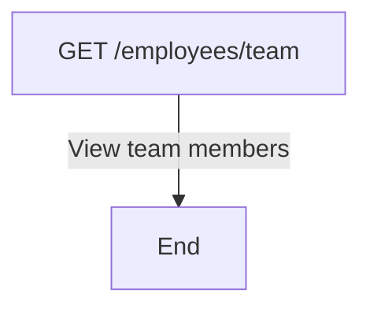
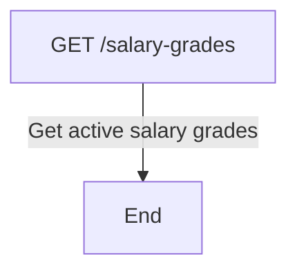
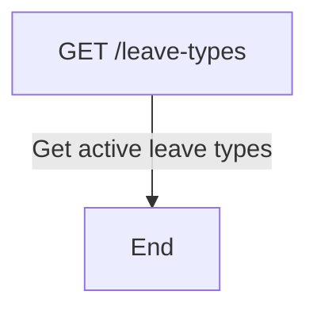
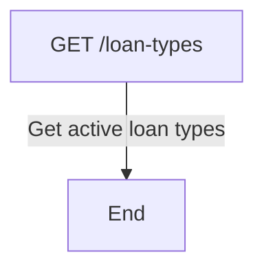
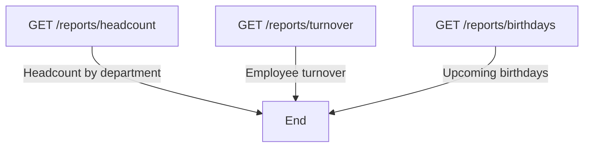
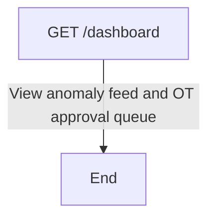
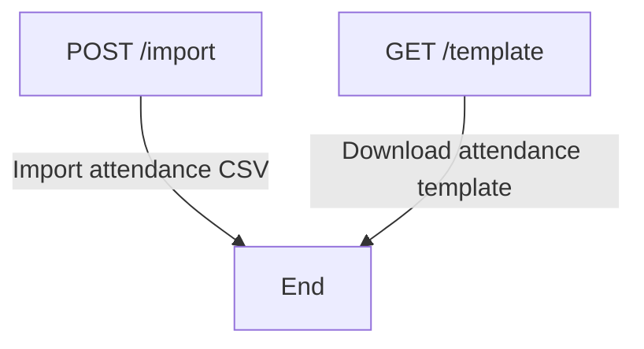
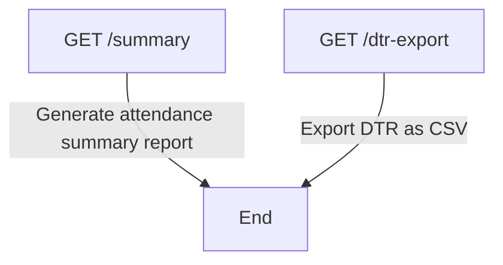
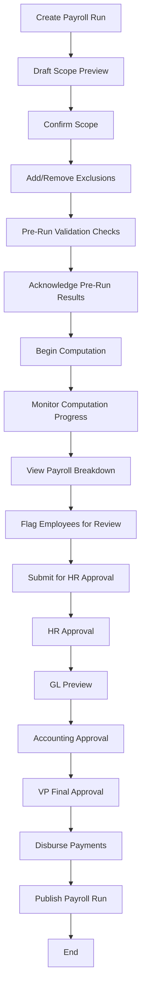

# Ogami ERP Module Flowcharts

This document contains flowcharts for each module and sub-module in the Ogami ERP system, based on the API route definitions.

## HR Module

### Team Management
Flowchart for viewing team members (department-scoped for managers/supervisors).



### Employee Management
Flowchart for employee CRUD operations and transitions (department-scoped).

```mermaid
flowchart TD
    A[GET /employees] -->|List employees| B[End]
    C[GET /employees/{employee}] -->|View employee details| B
    D[POST /employees] -->|Create new employee| B
    E[PATCH /employees/{employee}] -->|Update employee| B
    F[POST /employees/{employee}/transition] -->|Transition employee status| B
```

### Salary Grades
Flowchart for viewing salary grades (reference data).



### Leave Types
Flowchart for viewing leave types (reference data).



### Loan Types
Flowchart for viewing loan types (reference data).



### Departments
Flowchart for department CRUD operations.

```mermaid
flowchart TD
    A[GET /departments] -->|List departments| B[End]
    C[POST /departments] -->|Create department| B
    D[PATCH /departments/{department}] -->|Update department| B
    E[DELETE /departments/{department}] -->|Delete department| B
```

### Positions
Flowchart for position CRUD operations.

```mermaid
flowchart TD
    A[GET /positions] -->|List positions| B[End]
    C[POST /positions] -->|Create position| B
    D[PATCH /positions/{position}] -->|Update position| B
    E[DELETE /positions/{position}] -->|Delete position| B
```

### HR Reports
Flowchart for HR reporting endpoints.



## Attendance Module

### Dashboard
Flowchart for attendance dashboard.



### Attendance Logs
Flowchart for attendance log management.

```mermaid
flowchart TD
    A[GET /logs] -->|List attendance logs| B[End]
    C[GET /logs/team] -->|View team attendance logs| B
    D[GET /logs/{attendanceLog}] -->|View specific attendance log| B
    E[POST /logs] -->|Create manual attendance entry| B
    F[PATCH /logs/{attendanceLog}] -->|Update attendance log| B
```

### Attendance Import
Flowchart for attendance CSV import and template download.



### Overtime Requests
Flowchart for overtime request CRUD and workflow.

```mermaid
flowchart TD
    A[GET /overtime-requests] -->|List overtime requests| B[End]
    C[GET /overtime-requests/team] -->|View team overtime requests| B
    D[GET /overtime-requests/pending-executive] -->|View pending executive OT requests| B
    E[POST /overtime-requests] -->|Create overtime request| B
    F[GET /overtime-requests/{overtimeRequest}] -->|View overtime request| B
    G[PATCH /overtime-requests/{overtimeRequest}/supervisor-endorse] -->|Supervisor endorsement| B
    H[PATCH /overtime-requests/{overtimeRequest}/head-endorse] -->|Head endorsement| B
    I[PATCH /overtime-requests/{overtimeRequest}/approve] -->|Manager approval| B
    J[PATCH /overtime-requests/{overtimeRequest}/reject] -->|Reject OT request| B
    K[DELETE /overtime-requests/{overtimeRequest}] -->|Cancel OT request| B
    L[PATCH /overtime-requests/{overtimeRequest}/executive-approve] -->|Executive approval| B
    M[PATCH /overtime-requests/{overtimeRequest}/executive-reject] -->|Executive reject| B
    N[PATCH /overtime-requests/{overtimeRequest}/officer-review] -->|HR officer review| B
    O[PATCH /overtime-requests/{overtimeRequest}/vp-approve] -->|VP final approval| B
```

### Shift Schedules
Flowchart for shift schedule CRUD operations.

```mermaid
flowchart TD
    A[GET /shifts] -->|List shift schedules| B[End]
    C[POST /shifts] -->|Create shift schedule| B
    D[PATCH /shifts/{shift}] -->|Update shift schedule| B
    E[DELETE /shifts/{shift}] -->|Delete shift schedule| B
```

### Employee Shift Assignments
Flowchart for managing employee shift assignments.

```mermaid
flowchart TD
    A[GET /employees/{employee}/shift-assignments] -->|Get employee's shift assignments| B[End]
    C[POST /employees/{employee}/shift-assignments] -->|Assign shift to employee| B
    D[DELETE /shift-assignments/{assignment}] -->|Remove shift assignment| B
```

### Attendance Reports
Flowchart for attendance summary and DTR export.



## Payroll Module

### Payroll Runs
Flowchart for payroll run lifecycle and workflow.

```mermaid
flowchart TD
    A[GET /runs] -->|List payroll runs| B[End]
    C[GET /runs/validate] -->|Pre-run validation| B
    D[GET /runs/draft-scope-preview] -->|Draft scope preview| B
    E[POST /runs] -->|Create new payroll run| B
    F[GET /runs/{payrollRun}] -->|View payroll run details| B
    G[PATCH /runs/{payrollRun}/lock] -->|Lock payroll run| B
    H[PATCH /runs/{payrollRun}/approve] -->|Approve payroll run| B
    I[PATCH /runs/{payrollRun}/submit] -->|Submit payroll run| B
    J[PATCH /runs/{payrollRun}/accounting-approve] -->|Accounting approval| B
    K[PATCH /runs/{payrollRun}/post] -->|Post payroll run| B
    L[PATCH /runs/{payrollRun}/reject] -->|Reject payroll run| B
    M[GET /runs/{payrollRun}/exceptions] -->|View payroll run exceptions| B
    N[PATCH /runs/{payrollRun}/cancel] -->|Cancel payroll run| B
    O[DELETE /runs/{payrollRun}] -->|Delete payroll run| B
```

### Payroll Run Workflow Steps
Flowchart showing the detailed workflow steps for a payroll run.



### Payroll Details (Payslips)
Flowchart for accessing payroll details and payslips.

```mermaid
flowchart TD
    A[GET /runs/{payrollRun}/details] -->|List payroll details| B[End]
    C[GET /runs/{payrollRun}/details/{payrollDetail}] -->|View specific payroll detail| B
    D[GET /runs/{payrollRun}/details/{payrollDetail}/payslip] -->|Generate payslip| B
```

### Payroll Exports
Flowchart for payroll export functionality.

```mermaid
flowchart TD
    A[GET /runs/{payrollRun}/export/register] -->|Export payroll register| B[End]
    C[GET /runs/{payrollRun}/export/disbursement] -->|Export disbursement file| B
    D[GET /runs/{payrollRun}/export/breakdown] -->|Export payroll breakdown| B
```

### Payroll Adjustments
Flowchart for managing payroll adjustments.

```mermaid
flowchart TD
    A[GET /runs/{payrollRun}/adjustments] -->|List payroll adjustments| B[End]
    C[POST /runs/{payrollRun}/adjustments] -->|Create payroll adjustment| B
    D[DELETE /adjustments/{payrollAdjustment}] -->|Delete payroll adjustment| B
```

### Pay Periods
Flowchart for pay period management.

```mermaid
flowchart TD
    A[GET /periods] -->|List pay periods| B[End]
    B[POST /periods] -->|Create pay period| B
    C[GET /periods/{payPeriod}] -->|View pay period details| B
    D[PATCH /periods/{payPeriod}/close] -->|Close pay period| B
```

## Accounting Module

### Chart of Accounts
Flowchart for chart of accounts CRUD operations.

```mermaid
flowchart TD
    A[GET /accounts] -->|List chart of accounts| B[End]
    C[POST /accounts] -->|Create account| B
    D[GET /accounts/{account}] -->|View account details| B
    E[PUT /accounts/{account}] -->|Update account| B
    F[DELETE /accounts/{account}] -->|Delete account| B
```

### Fiscal Periods
Flowchart for fiscal period management.

```mermaid
flowchart TD
    A[GET /fiscal-periods] -->|List fiscal periods| B[End]
    C[POST /fiscal-periods] -->|Create fiscal period| B
    D[GET /fiscal-periods/{fiscalPeriod}] -->|View fiscal period details| B
    E[PATCH /fiscal-periods/{fiscalPeriod}/open] -->|Open fiscal period| B
    F[PATCH /fiscal-periods/{fiscalPeriod}/close] -->|Close fiscal period| B
```

### Journal Entries
Flowchart for journal entry CRUD and workflow.

```mermaid
flowchart TD
    A[GET /journal-entries] -->|List journal entries| B[End]
    C[POST /journal-entries] -->|Create journal entry| B
    D[GET /journal-entries/{journalEntry}] -->|View journal entry| B
    E[PATCH /journal-entries/{journalEntry}/submit] -->|Submit journal entry| B
    F[PATCH /journal-entries/{journalEntry}/post] -->|Post journal entry| B
    G[POST /journal-entries/{journalEntry}/reverse] -->|Reverse journal entry| B
    H[DELETE /journal-entries/{journalEntry}] -->|Cancel journal entry| B
```

### Journal Entry Templates
Flowchart for journal entry template management.

```mermaid
flowchart TD
    A[GET /journal-entry-templates] -->|List journal entry templates| B[End]
    C[POST /journal-entry-templates] -->|Create journal entry template| B
    D[GET /journal-entry-templates/{templateId}/apply] -->|Apply journal entry template| B
    E[DELETE /journal-entry-templates/{templateId}] -->|Delete journal entry template| B
```

### Recurring Journal Entry Templates
Flowchart for recurring journal entry template management.

```mermaid
flowchart TD
    A[GET /recurring-templates] -->|List recurring journal entry templates| B[End]
    C[POST /recurring-templates] -->|Create recurring journal entry template| B
    D[GET /recurring-templates/{recurringJournalTemplate}] -->|View recurring journal entry template| B
    E[PUT /recurring-templates/{recurringJournalTemplate}] -->|Update recurring journal entry template| B
    F[PATCH /recurring-templates/{recurringJournalTemplate}/toggle] -->|Toggle recurring journal entry template| B
    G[DELETE /recurring-templates/{recurringJournalTemplate}] -->|Delete recurring journal entry template| B
```

### Vendors
Flowchart for vendor CRUD operations and management.

```mermaid
flowchart TD
    A[GET /vendors] -->|List vendors| B[End]
    C[POST /vendors] -->|Create vendor| B
    D[GET /vendors/{vendor}] -->|View vendor details| B
    E[GET /vendors/{vendor}/items] -->|View vendor items| B
    F[PUT /vendors/{vendor}] -->|Update vendor| B
    G[DELETE /vendors/{vendor}] -->|Delete vendor| B
    H[PATCH /vendors/{vendor}/accredit] -->|Accredit vendor| B
    I[PATCH /vendors/{vendor}/suspend] -->|Suspend vendor| B
    J[POST /vendors/{vendor}/provision-account] -->|Provision portal account| B
    K[POST /vendors/{vendor}/reset-account] -->|Reset portal account password| B
```

### Vendor Items
Flowchart for vendor item CRUD operations.

```mermaid
flowchart TD
    A[GET /vendors/{vendor}/items] -->|List vendor items| B[End]
    B[POST /vendors/{vendor}/items] -->|Create vendor item| B
    C[PUT /vendors/{vendor}/items/{vendorItem}] -->|Update vendor item| B
    D[DELETE /vendors/{vendor}/items/{vendorItem}] -->|Delete vendor item| B
    E[POST /vendors/{vendor}/items/import] -->|Import vendor items| B
```

### AP Invoices
Flowchart for AP invoice management and workflow.

```mermaid
flowchart TD
    A[GET /ap/dashboard] -->|View AP operational dashboard| B[End]
    C[GET /ap/invoices/due-soon] -->|View invoices due soon| B
    D[GET /ap/invoices] -->|List AP invoices| B
    E[POST /ap/invoices] -->|Create AP invoice| B
    F[POST /ap/invoices/from-po] -->|Create invoice from PO| B
    G[GET /ap/invoices/{apInvoice}] -->|View AP invoice details| B
    H[GET /ap/invoices/{apInvoice}/form-2307] -->|Generate BIR Form 2307| B
    I[PATCH /ap/invoices/{apInvoice}/submit] -->|Submit AP invoice| B
    J[PATCH /ap/invoices/{apInvoice}/head-note] -->|Add head note| B
    K[PATCH /ap/invoices/{apInvoice}/manager-check] -->|Manager check| B
    L[PATCH /ap/invoices/{apInvoice}/officer-review] -->|Officer review| B
    M[PATCH /ap/invoices/{apInvoice}/approve] -->|Approve AP invoice| B
    N[PATCH /ap/invoices/{apInvoice}/reject] -->|Reject AP invoice| B
    O[POST /ap/invoices/{apInvoice}/payments] -->|Record payment| B
```

### Vendor Credit Notes
Flowchart for vendor credit note management.

```mermaid
flowchart TD
    A[GET /ap/credit-notes] -->|List vendor credit notes| B[End]
    B[POST /ap/credit-notes] -->|Create vendor credit note| B
    C[GET /ap/credit-notes/{creditNote}] -->|View vendor credit note| B
    D[PATCH /ap/credit-notes/{creditNote}/post] -->|Post vendor credit note| B
```

### Financial Reports
Flowchart for financial report generation.

```mermaid
flowchart TD
    A[GET /reports/gl] -->|Generate general ledger report| B[End]
    C[GET /reports/trial-balance] -->|Generate trial balance report| B
    D[GET /reports/balance-sheet] -->|Generate balance sheet report| B
    E[GET /reports/income-statement] -->|Generate income statement report| B
    F[GET /reports/cash-flow] -->|Generate cash flow report| B
```

### Bank Accounts
Flowchart for bank account management.

```mermaid
flowchart TD
    A[GET /bank-accounts] -->|List bank accounts| B[End]
    B[POST /bank-accounts] -->|Create bank account| B
    C[GET /bank-accounts/{bankAccount}] -->|View bank account details| B
    D[PUT /bank-accounts/{bankAccount}] -->|Update bank account| B
    E[DELETE /bank-accounts/{bankAccount}] -->|Delete bank account| B
```

### Bank Reconciliation
Flowchart for bank reconciliation management.

```mermaid
flowchart TD
    A[GET /bank-reconciliations] -->|List bank reconciliations| B[End]
    B[POST /bank-reconciliations] -->|Create bank reconciliation| B
    C[GET /bank-reconciliations/{reconciliation}] -->|View bank reconciliation details| B
    D[POST /bank-reconciliations/{reconciliation}/import-statement] -->|Import bank statement| B
    E[PATCH /bank-reconciliations/{reconciliation}/match] -->|Match transaction| B
    F[PATCH /bank-reconciliations/{reconciliation}/transactions/{bankTransaction}/unmatch] -->|Unmatch transaction| B
    G[PATCH /bank-reconciliations/{reconciliation}/certify] -->|Certify bank reconciliation| B
```

## AR Module

### Customers
Flowchart for customer CRUD operations and account provisioning.

```mermaid
flowchart TD
    A[GET /customers] -->|List customers| B[End]
    C[POST /customers] -->|Create customer| B
    D[GET /customers/{customer}] -->|View customer details| B
    E[PUT /customers/{customer}] -->|Update customer| B
    F[DELETE /customers/{customer}] -->|Delete customer| B
    G[POST /customers/{customer}/provision-account] -->|Provision portal account| B
    H[POST /customers/{customer}/reset-account] -->|Reset portal account password| B
```

### Customer Invoices
Flowchart for customer invoice management and workflow.

```mermaid
flowchart TD
    A[GET /invoices/due-soon] -->|View invoices due soon| B[End]
    C[GET /invoices] -->|List customer invoices| B
    D[POST /invoices] -->|Create customer invoice| B
    E[GET /invoices/{customerInvoice}] -->|View customer invoice details| B
    F[PATCH /invoices/{customerInvoice}/approve] -->|Approve invoice (generate INV + auto-post JE)| B
    G[PATCH /invoices/{customerInvoice}/cancel] -->|Cancel invoice| B
    H[POST /invoices/{customerInvoice}/payments] -->|Receive payment| B
    I[PATCH /invoices/{customerInvoice}/write-off] -->|Write off bad debt| B
```

### Customer Credit Notes
Flowchart for customer credit note management.

```mermaid
flowchart TD
    A[GET /credit-notes] -->|List customer credit notes| B[End]
    B[POST /credit-notes] -->|Create customer credit note| B
    C[GET /credit-notes/{customerCreditNote}] -->|View customer credit note| B
    D[PATCH /credit-notes/{customerCreditNote}/post] -->|Post customer credit note| B
```

### AR Reports
Flowchart for AR reporting functionality.

```mermaid
flowchart TD
    A[GET /aging-report] -->|Generate AR aging report| B[End]
    C[GET /customers/{customer}/statement] -->|Export customer statement (CSV)| B
```

## Budget Module

### Cost Centers
Flowchart for cost center CRUD operations.

```mermaid
flowchart TD
    A[GET /cost-centers] -->|List cost centers| B[End]
    C[POST /cost-centers] -->|Create cost center| B
    D[PATCH /cost-centers/{costCenter}] -->|Update cost center| B
```

### Annual Budget Lines
Flowchart for annual budget line management.

```mermaid
flowchart TD
    A[GET /lines] -->|List budget lines| B[End]
    B[POST /lines] -->|Set budget line| B
```

### Utilisation Report
Flowchart for budget utilisation reporting.

```mermaid
flowchart TD
    A[GET /utilisation/{costCenter}] -->|Generate utilisation report| B[End]
```

### Budget Approval Workflow
Flowchart for budget approval workflow.

```mermaid
flowchart TD
    A[PATCH /lines/{annualBudget}/submit] -->|Submit budget for approval| B[End]
    C[PATCH /lines/{annualBudget}/approve] -->|Approve budget| B
    D[PATCH /lines/{annualBudget}/reject] -->|Reject budget| B
```

### Department Budgets
Flowchart for department budget management (Accounting managed).

```mermaid
flowchart TD
    A[GET /department-budgets] -->|List department budgets| B[End]
    B[PATCH /department-budgets/{department}] -->|Update department budget| B
```

## CRM Module

### Tickets
Flowchart for ticket CRUD operations and workflow.

```mermaid
flowchart TD
    A[GET /tickets] -->|List tickets| B[End]
    C[POST /tickets] -->|Create ticket| B
    D[GET /tickets/{ticket:ulid}] -->|View ticket details| B
    E[POST /tickets/{ticket:ulid}/reply] -->|Reply to ticket| B
    F[PATCH /tickets/{ticket:ulid}/assign] -->|Assign ticket| B
    G[PATCH /tickets/{ticket:ulid}/resolve] -->|Resolve ticket| B
    H[PATCH /tickets/{ticket:ulid}/close] -->|Close ticket| B
    I[PATCH /tickets/{ticket:ulid}/reopen] -->|Reopen ticket| B
```

### CRM Dashboard / SLA Metrics
Flowchart for CRM dashboard and SLA metrics.

```mermaid
flowchart TD
    A[GET /dashboard] -->|View CRM dashboard and SLA metrics| B[End]
```

### Client Portal Orders
Flowchart for client order management in the client portal.

```mermaid
flowchart TD
    A[GET /client-orders/my-orders] -->|Get customer's orders| B[End]
    C[POST /client-orders] -->|Create new order| B
    D[GET /client-orders/products/available] -->|Get available products| B
    E[GET /client-orders] -->|List all orders (staff/sales)| B
    F[GET /client-orders/{order}] -->|View order details| B
    G[POST /client-orders/{order}/approve] -->|Approve order| B
    H[POST /client-orders/{order}/reject] -->|Reject order| B
    I[POST /client-orders/{order}/negotiate] -->|Negotiate order| B
    J[POST /client-orders/{order}/respond] -->|Respond to order| B
    K[POST /client-orders/{order}/sales-respond] -->|Sales respond to order| B
    L[POST /client-orders/{order}/cancel] -->|Cancel order| B
```

## Delivery Module

### Delivery Receipts
Flowchart for delivery receipt CRUD operations and confirmation.

```mermaid
flowchart TD
    A[GET /receipts] -->|List delivery receipts| B[End]
    C[POST /receipts] -->|Create delivery receipt| B
    D[GET /receipts/{deliveryReceipt}] -->|View delivery receipt details| B
    E[PATCH /receipts/{deliveryReceipt}/confirm] -->|Confirm delivery receipt| B
```

### Shipments
Flowchart for shipment CRUD operations and status updates.

```mermaid
flowchart TD
    A[GET /shipments] -->|List shipments| B[End]
    B[POST /shipments] -->|Create shipment| B
    C[GET /shipments/{shipment}] -->|View shipment details| B
    D[PATCH /shipments/{shipment}/status] -->|Update shipment status| B
```

### Delivery Export
Flowchart for delivery data export functionality.

```mermaid
flowchart TD
    A[GET /export] -->|Export delivery data as CSV| B[End]
```

## Employee Self-Service Module

### Payslip Management
Flowchart for employee payslip access and history.

```mermaid
flowchart TD
    A[GET /me/payslips] -->|List payslip history| B[End]
    C[GET /me/payslips/{payrollDetail}] -->|View payslip detail with breakdown| B
    D[GET /me/payslips/{payrollDetail}/pdf] -->|Download payslip PDF| B
```

### YTD Summary
Flowchart for year-to-date summary access.

```mermaid
flowchart TD
    A[GET /me/ytd] -->|View YTD summary| B[End]
```

### HR Profile
Flowchart for employee HR profile access and updates.

```mermaid
flowchart TD
    A[GET /me/profile] -->|View HR profile| B[End]
    B[PATCH /me/profile] -->|Update HR profile| B
```

### Leave Management
Flowchart for employee leave balance and request history access.

```mermaid
flowchart TD
    A[GET /me/leave] -->|View leave balances and request history| B[End]
```

### Loan Management
Flowchart for employee loan balance and amortization history access.

```mermaid
flowchart TD
    A[GET /me/loans] -->|View loan balances and amortization history| B[End]
```

## Fixed Assets Module

### Asset Categories
Flowchart for fixed asset category CRUD operations.

```mermaid
flowchart TD
    A[GET /categories] -->|List asset categories| B[End]
    C[POST /categories] -->|Create asset category| B
```

### Asset Register
Flowchart for fixed asset register CRUD operations.

```mermaid
flowchart TD
    A[GET /] -->|List fixed assets| B[End]
    B[POST /] -->|Create fixed asset| B
    C[GET /{fixedAsset}] -->|View fixed asset details| B
    D[PUT /{fixedAsset}] -->|Update fixed asset| B
```

### Depreciation
Flowchart for fixed asset depreciation processing.

```mermaid
flowchart TD
    A[POST /depreciate] -->|Process depreciation for fiscal period| B[End]
```

### Disposal
Flowchart for fixed asset disposal.

```mermaid
flowchart TD
    A[POST /{fixedAsset}/dispose] -->|Dispose of fixed asset| B[End]
```

### Depreciation Schedule Export
Flowchart for depreciation schedule export functionality.

```mermaid
flowchart TD
    A[GET /depreciation-export] -->|Export depreciation schedule as CSV| B[End]
```

## Inventory Module

### Item Master
Flowchart for item master CRUD operations and management.

```mermaid
flowchart TD
    A[GET /items/low-stock] -->|Get low stock items| B[End]
    C[GET /items/categories] -->|Get item categories| B
    D[POST /items/categories] -->|Create item category| B
    E[GET /items] -->|List items| B
    F[POST /items] -->|Create item| B
    G[GET /items/{item}] -->|View item details| B
    H[PUT /items/{item}] -->|Update item| B
    I[PATCH /items/{item}/toggle-active] -->|Toggle item active status| B
```

### Warehouse Locations
Flowchart for warehouse location CRUD operations.

```mermaid
flowchart TD
    A[GET /locations] -->|List warehouse locations| B[End]
    B[POST /locations] -->|Create warehouse location| B
    C[PUT /locations/{warehouseLocation}] -->|Update warehouse location| B
```

### Stock Management
Flowchart for stock balance and ledger operations.

```mermaid
flowchart TD
    A[GET /stock-balances] -->|Get stock balances| B[End]
    B[GET /stock-ledger] -->|Get stock ledger| B
    C[POST /adjustments] -->|Create stock adjustment| B
```

### Material Requisitions
Flowchart for material requisition CRUD operations and workflow.

```mermaid
flowchart TD
    A[GET /requisitions] -->|List material requisitions| B[End]
    B[POST /requisitions] -->|Create material requisition| B
    C[GET /requisitions/{materialRequisition}] -->|View material requisition details| B
    D[PATCH /requisitions/{materialRequisition}/submit] -->|Submit material requisition| B
    E[PATCH /requisitions/{materialRequisition}/note] -->|Add note to requisition| B
    F[PATCH /requisitions/{materialRequisition}/check] -->|Check requisition| B
    G[PATCH /requisitions/{materialRequisition}/review] -->|Review requisition| B
    H[PATCH /requisitions/{materialRequisition}/vp-approve] -->|VP approve requisition| B
    I[PATCH /requisitions/{materialRequisition}/reject] -->|Reject requisition| B
    J[PATCH /requisitions/{materialRequisition}/cancel] -->|Cancel requisition| B
    K[PATCH /requisitions/{materialRequisition}/fulfill] -->|Fulfill requisition| B
```

### Inventory Valuation Report
Flowchart for inventory valuation report generation.

```mermaid
flowchart TD
    A[GET /reports/valuation] -->|Generate inventory valuation report| B[End]
```

## Leave Module

### Leave Requests
Flowchart for leave request CRUD operations and workflow.

```mermaid
flowchart TD
    A[GET /requests] -->|List leave requests| B[End]
    C[GET /requests/team] -->|View team leave requests| B
    D[POST /requests] -->|Create leave request| B
    E[GET /requests/{leaveRequest}] -->|View leave request details| B
    F[PATCH /requests/{leaveRequest}/head-approve] -->|Department head approval| B
    G[PATCH /requests/{leaveRequest}/manager-check] -->|Plant manager check| B
    H[PATCH /requests/{leaveRequest}/ga-process] -->|GA officer process| B
    I[PATCH /requests/{leaveRequest}/vp-note] -->|VP note| B
    J[PATCH /requests/{leaveRequest}/reject] -->|Reject leave request| B
    K[DELETE /requests/{leaveRequest}] -->|Cancel leave request| B
```

### Leave Balances
Flowchart for leave balance management.

```mermaid
flowchart TD
    A[GET /balances] -->|List leave balances| B[End]
    B[POST /balances] -->|Create leave balance| B
    C[PATCH /balances/{leaveBalance}] -->|Update leave balance| B
```

### Leave Calendar
Flowchart for leave calendar view.

```mermaid
flowchart TD
    A[GET /calendar] -->|View monthly leave calendar| B[End]
```

### Leave Export
Flowchart for leave report export functionality.

```mermaid
flowchart TD
    A[GET /export] -->|Export leave requests as CSV| B[End]
```

## Loans Module

### Loan Management
Flowchart for loan CRUD operations and workflow.

```mermaid
flowchart TD
    A[GET /] -->|List loans| B[End]
    C[GET /team] -->|View team loans| B
    D[POST /] -->|Create loan| B
    E[GET /{loan}] -->|View loan details| B
    F[GET /{loan}/employee-history] -->|View employee loan history| B
    G[PATCH /{loan}/approve] -->|Approve loan| B
    H[PATCH /{loan}/accounting-approve] -->|Accounting approve loan| B
    I[PATCH /{loan}/disburse] -->|Disburse loan| B
    J[PATCH /{loan}/reject] -->|Reject loan| B
    K[DELETE /{loan}] -->|Cancel loan| B
```

### Loan Workflow Actions
Flowchart for loan workflow steps with SoD enforcement.

```mermaid
flowchart TD
    A[PATCH /{loan}/head-note] -->|Add head note| B[End]
    B[PATCH /{loan}/manager-check] -->|Manager check| B
    C[PATCH /{loan}/officer-review] -->|Officer review| B
    D[PATCH /{loan}/vp-approve] -->|VP approve| B
```

### Loan Amortization Schedule
Flowchart for loan amortization schedule access.

```mermaid
flowchart TD
    A[GET /{loan}/schedule] -->|Get loan amortization schedule| B[End]
```

### Loan Payment Recording
Flowchart for recording loan payments.

```mermaid
flowchart TD
    A[POST /{loan}/payments] -->|Record loan payment| B[End]
```

### Loan SOA Export
Flowchart for loan statement of account export.

```mermaid
flowchart TD
    A[GET /{loan}/soa-export] -->|Export loan SOA as CSV| B[End]
```

## Maintenance Module

### Equipment
Flowchart for equipment CRUD operations and preventive maintenance scheduling.

```mermaid
flowchart TD
    A[GET /equipment] -->|List equipment| B[End]
    C[POST /equipment] -->|Create equipment| B
    D[GET /equipment/{equipment}] -->|View equipment details| B
    E[PUT /equipment/{equipment}] -->|Update equipment| B
    F[POST /equipment/{equipment}/pm-schedules] -->|Create PM schedule for equipment| B
```

### Work Orders
Flowchart for work order CRUD operations and workflow.

```mermaid
flowchart TD
    A[GET /work-orders] -->|List work orders| B[End]
    B[POST /work-orders] -->|Create work order| B
    C[GET /work-orders/{maintenanceWorkOrder}] -->|View work order details| B
    D[PATCH /work-orders/{maintenanceWorkOrder}/start] -->|Start work order| B
    E[PATCH /work-orders/{maintenanceWorkOrder}/complete] -->|Complete work order| B
```

### Work Order Parts
Flowchart for work order parts management (Maintenance ↔ Inventory integration).

```mermaid
flowchart TD
    A[GET /work-orders/{maintenanceWorkOrder}/parts] -->|List work order parts| B[End]
    B[POST /work-orders/{maintenanceWorkOrder}/parts] -->|Add part to work order| B
```

### Work Order Export
Flowchart for work order export functionality.

```mermaid
flowchart TD
    A[GET /work-orders/export] -->|Export work orders as CSV| B[End]
```

## Mold Module

### Mold Master
Flowchart for mold master CRUD operations.

```mermaid
flowchart TD
    A[GET /molds] -->|List molds| B[End]
    B[POST /molds] -->|Create mold| B
    C[GET /molds/{moldMaster}] -->|View mold details| B
    D[PUT /molds/{moldMaster}] -->|Update mold| B
```

### Mold Shots
Flowchart for logging mold shots.

```mermaid
flowchart TD
    A[POST /molds/{moldMaster}/shots] -->|Log mold shots| B[End]
```

### Mold Retirement
Flowchart for retiring molds.

```mermaid
flowchart TD
    A[PATCH /molds/{moldMaster}/retire] -->|Retire mold| B[End]
```

## Production Module

### Bill of Materials
Flowchart for bill of materials CRUD operations and activation.

```mermaid
flowchart TD
    A[GET /boms] -->|List BOMs| B[End]
    C[POST /boms] -->|Create BOM| B
    D[GET /boms/{bom}] -->|View BOM details| B
    E[PUT /boms/{bom}] -->|Update BOM| B
    F[PATCH /boms/{bom}/activate] -->|Activate BOM| B
    G[DELETE /boms/{bom}] -->|Delete BOM| B
```

### Delivery Schedules
Flowchart for delivery schedule CRUD operations and fulfillment.

```mermaid
flowchart TD
    A[GET /delivery-schedules] -->|List delivery schedules| B[End]
    B[POST /delivery-schedules] -->|Create delivery schedule| B
    C[GET /delivery-schedules/{deliverySchedule}] -->|View delivery schedule details| B
    D[PUT /delivery-schedules/{deliverySchedule}] -->|Update delivery schedule| B
    E[POST /delivery-schedules/{deliverySchedule}/fulfill] -->|Fulfill from stock| B
```

### Combined Delivery Schedules
Flowchart for combined delivery schedule management and workflow.

```mermaid
flowchart TD
    A[GET /combined-delivery-schedules] -->|List combined delivery schedules| B[End]
    C[GET /combined-delivery-schedules/{schedule:ulid}] -->|View combined delivery schedule details| B
    D[POST /combined-delivery-schedules/{schedule:ulid}/dispatch] -->|Dispatch schedule| B
    E[POST /combined-delivery-schedules/{schedule:ulid}/delivered] -->|Mark as delivered| B
    F[POST /combined-delivery-schedules/{schedule:ulid}/notify-missing] -->|Notify missing items| B
    G[POST /combined-delivery-schedules/{schedule:ulid}/acknowledge] -->|Acknowledge receipt| B
```

### Production Orders
Flowchart for production order CRUD operations, workflow, and stock checking.

```mermaid
flowchart TD
    A[GET /orders] -->|List production orders| B[End]
    C[POST /orders] -->|Create production order| B
    D[GET /orders/smart-defaults] -->|Get smart defaults for production order| B
    E[GET /orders/{productionOrder}] -->|View production order details| B
    F[PATCH /orders/{productionOrder}/release] -->|Release production order| B
    G[PATCH /orders/{productionOrder}/start] -->|Start production order| B
    H[PATCH /orders/{productionOrder}/complete] -->|Complete production order| B
    I[PATCH /orders/{productionOrder}/cancel] -->|Cancel production order| B
    J[PATCH /orders/{productionOrder}/void] -->|Void production order| B
    K[POST /orders/{productionOrder}/output] -->|Log production output| B
    L[GET /orders/{productionOrder}/stock-check] -->|Check stock availability| B
```

### Production Cost Analysis Report
Flowchart for production cost analysis report generation.

```mermaid
flowchart TD
    A[GET /reports/cost-analysis] -->|Generate production cost analysis report| B[End]
```

## QC Module

### Inspection Templates
Flowchart for inspection template CRUD operations.

```mermaid
flowchart TD
    A[GET /templates] -->|List inspection templates| B[End]
    B[POST /templates] -->|Create inspection template| B
    C[GET /templates/{inspectionTemplate}] -->|View inspection template details| B
    D[PUT /templates/{inspectionTemplate}] -->|Update inspection template| B
    E[DELETE /templates/{inspectionTemplate}] -->|Delete inspection template| B
```

### Inspections
Flowchart for inspection CRUD operations and result recording.

```mermaid
flowchart TD
    A[GET /inspections] -->|List inspections| B[End]
    B[POST /inspections] -->|Create inspection| B
    C[GET /inspections/{inspection}] -->|View inspection details| B
    D[PATCH /inspections/{inspection}/results] -->|Record inspection results| B
    E[PATCH /inspections/{inspection}/cancel-results] -->|Cancel inspection results| B
    F[DELETE /inspections/{inspection}] -->|Delete inspection| B
```

### NCRs (Non-Conformance Reports)
Flowchart for NCR CRUD operations and CAPA management.

```mermaid
flowchart TD
    A[GET /ncrs] -->|List NCRs| B[End]
    B[POST /ncrs] -->|Create NCR| B
    C[GET /ncrs/{nonConformanceReport}] -->|View NCR details| B
    D[PATCH /ncrs/{nonConformanceReport}/capa] -->|Issue CAPA| B
    E[PATCH /ncrs/{nonConformanceReport}/close] -->|Close NCR| B
    F[GET /capa] -->|List CAPA actions| B
    G[PATCH /capa/{capaAction}/complete] -->|Complete CAPA action| B
```

### QC Reports
Flowchart for QC reporting functionality.

```mermaid
flowchart TD
    A[GET /reports/defect-rate] -->|Generate defect rate analytics report| B[End]
```

## Reports Module

### Government Reports
Flowchart for government report generation (BIR, SSS, PhilHealth, Pag-IBIG).

```mermaid
flowchart TD
    A[GET /bir/1601c] -->|Generate BIR Form 1601-C| B[End]
    C[GET /bir/2316] -->|Generate BIR Form 2316| B
    D[GET /bir/alphalist] -->|Generate BIR Alphalist| B
    E[GET /sss/sbr2] -->|Generate SSS SBR2 Report| B
    F[GET /philhealth/rf1] -->|Generate PhilHealth RF1 Report| B
    G[GET /pagibig/monthly] -->|Generate Pag-IBIG Monthly Report| B
```

## Tax Module

### VAT Ledger
Flowchart for VAT ledger management and period closing.

```mermaid
flowchart TD
    A[GET /vat-ledger] -->|List VAT ledger entries| B[End]
    C[GET /vat-ledger/{vatLedger}] -->|View VAT ledger details| B
    D[PATCH /vat-ledger/{vatLedger}/close] -->|Close VAT period| B
```

### BIR Filing Tracker
Flowchart for BIR filing tracking and management.

```mermaid
flowchart TD
    A[GET /bir-filings] -->|List BIR filings| B[End]
    B[POST /bir-filings] -->|Schedule BIR filing| B
    C[GET /bir-filings/overdue] -->|View overdue BIR filings| B
    D[GET /bir-filings/calendar] -->|View BIR filing calendar| B
    E[PATCH /bir-filings/{birFiling}/file] -->|Mark BIR filing as filed| B
    F[PATCH /bir-filings/{birFiling}/amend] -->|Mark BIR filing as amended| B
```

## Search Module

### Global Search
Flowchart for global search functionality across multiple modules.

```mermaid
flowchart TD
    A[GET /] -->|Process search query| B[End]
```

## Vendor Portal Module

### Orders
Flowchart for vendor portal order management.

```mermaid
flowchart TD
    A[GET /orders] -->|List vendor orders| B[End]
    C[GET /orders/{purchaseOrder}] -->|View order details| B
    D[POST /orders/{purchaseOrder}/in-transit] -->|Mark order as in transit| B
    E[POST /orders/{purchaseOrder}/deliver] -->|Mark order as delivered| B
```

### Catalog Items
Flowchart for vendor portal catalog item management.

```mermaid
flowchart TD
    A[GET /items] -->|List catalog items| B[End]
    B[POST /items] -->|Create catalog item| B
    C[PATCH /{item}] -->|Update catalog item| B
    D[POST /import] -->|Import catalog items| B
```

### Goods Receipts
Flowchart for vendor portal goods receipts viewing.

```mermaid
flowchart TD
    A[GET /goods-receipts] -->|List goods receipts| B[End]
```

### Invoices
Flowchart for vendor portal invoice management.

```mermaid
flowchart TD
    A[GET /invoices] -->|List vendor invoices| B[End]
    B[POST /invoices] -->|Create vendor invoice| B
```

## Notifications Module

### Notification Center
Flowchart for in-app notification center management.

```mermaid
flowchart TD
    A[GET /] -->|List notifications| B[End]
    C[GET /unread-count] -->|Get unread notification count| B
    D[PUT /read-all] -->|Mark all notifications as read| B
    E[PUT /{id}/read] -->|Mark notification as read| B
    F[DELETE /{id}] -->|Delete notification| B
```

---
*Generated from Ogami ERP route definitions. Flowcharts illustrate API endpoint groupings and typical workflows.*