# Ogami ERP — Full System Process Flowchart

> **17 Modules** · Manufacturing ERP for Philippine businesses · Laravel 11 + React 18 + PostgreSQL 16

---

## Table of Contents

1. [System Overview — Module Interconnections](#1-system-overview--module-interconnections)
2. [HR — Employee Lifecycle](#2-hr--employee-lifecycle)
3. [Attendance — Time & Overtime](#3-attendance--time--overtime)
4. [Leave — Leave Request Approval](#4-leave--leave-request-approval)
5. [Payroll — Full Payroll Run Pipeline](#5-payroll--full-payroll-run-pipeline)
6. [Loan — Loan Request & Disbursement](#6-loan--loan-request--disbursement)
7. [Procurement — Purchase to Receipt](#7-procurement--purchase-to-receipt)
8. [Inventory — Stock Management & Requisition](#8-inventory--stock-management--requisition)
9. [Production — Manufacturing Order](#9-production--manufacturing-order)
10. [QC — Inspection & Non-Conformance](#10-qc--inspection--non-conformance)
11. [Delivery — Shipment & Receipt](#11-delivery--shipment--receipt)
12. [Accounting — Journal Entry & Fiscal Periods](#12-accounting--journal-entry--fiscal-periods)
13. [AP — Accounts Payable (Vendor Invoices)](#13-ap--accounts-payable-vendor-invoices)
14. [AR — Accounts Receivable (Customer Invoices)](#14-ar--accounts-receivable-customer-invoices)
15. [Tax — VAT Ledger](#15-tax--vat-ledger)
16. [Maintenance — Equipment & Work Orders](#16-maintenance--equipment--work-orders)
17. [Mold — Mold Tracking](#17-mold--mold-tracking)
18. [ISO — Document Control & Internal Audit](#18-iso--document-control--internal-audit)

---

## 1. System Overview — Module Interconnections

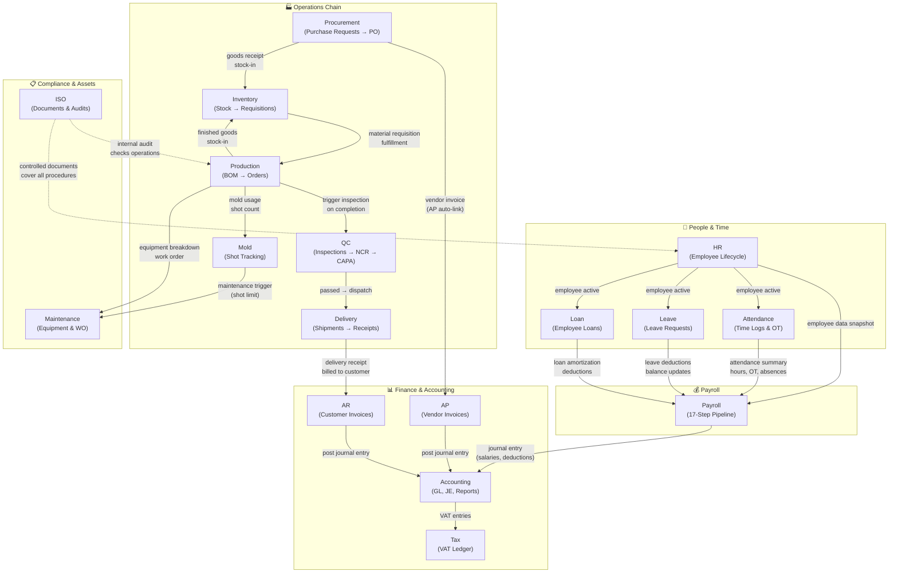
```mermaid
flowchart TD
    subgraph PEOPLE["👥 People & Time"]
        HR["HR\n(Employee Lifecycle)"]
        ATT["Attendance\n(Time Logs & OT)"]
        LV["Leave\n(Leave Requests)"]
        LN["Loan\n(Employee Loans)"]
    end

    subgraph PAYROLL_G["💰 Payroll"]
        PAY["Payroll\n(17-Step Pipeline)"]
    end

    subgraph OPCHAIN["🏭 Operations Chain"]
        PROC["Procurement\n(Purchase Requests → PO)"]
        INV["Inventory\n(Stock → Requisitions)"]
        PROD["Production\n(BOM → Orders)"]
        QC["QC\n(Inspections → NCR → CAPA)"]
        DEL["Delivery\n(Shipments → Receipts)"]
        MOLD["Mold\n(Shot Tracking)"]
    end

    subgraph FINANCE["📊 Finance & Accounting"]
        AP["AP\n(Vendor Invoices)"]
        AR["AR\n(Customer Invoices)"]
        ACCT["Accounting\n(GL, JE, Reports)"]
        TAX["Tax\n(VAT Ledger)"]
    end

    subgraph COMPLIANCE["📋 Compliance & Assets"]
        MAINT["Maintenance\n(Equipment & WO)"]
        ISO["ISO\n(Documents & Audits)"]
    end

    %% HR feeds everything
    HR -->|"employee active"| ATT
    HR -->|"employee active"| LV
    HR -->|"employee active"| LN
    HR -->|"employee data snapshot"| PAY

    %% Time & benefits feed payroll
    ATT -->|"attendance summary\nhours, OT, absences"| PAY
    LV -->|"leave deductions\nbalance updates"| PAY
    LN -->|"loan amortization\ndeductions"| PAY

    %% Payroll posts to GL
    PAY -->|"journal entry\n(salaries, deductions)"| ACCT

    %% Operations chain
    PROC -->|"goods receipt\nstock-in"| INV
    PROC -->|"vendor invoice\n(AP auto-link)"| AP
    INV -->|"material requisition\nfulfillment"| PROD
    PROD -->|"trigger inspection\non completion"| QC
    PROD -->|"finished goods\nstock-in"| INV
    QC -->|"passed → dispatch"| DEL
    PROD -->|"mold usage\nshot count"| MOLD
    MOLD -->|"maintenance trigger\n(shot limit)"| MAINT

    %% Finance flows
    AP -->|"post journal entry"| ACCT
    AR -->|"post journal entry"| ACCT
    ACCT -->|"VAT entries"| TAX
    DEL -->|"delivery receipt\nbilled to customer"| AR

    %% Maintenance link
    PROD -->|"equipment breakdown\nwork order"| MAINT

    %% ISO covers everything
    ISO -.->|"controlled documents\ncover all procedures"| HR
    ISO -.->|"internal audit\nchecks operations"| PROD
```

---

## 2. HR — Employee Lifecycle

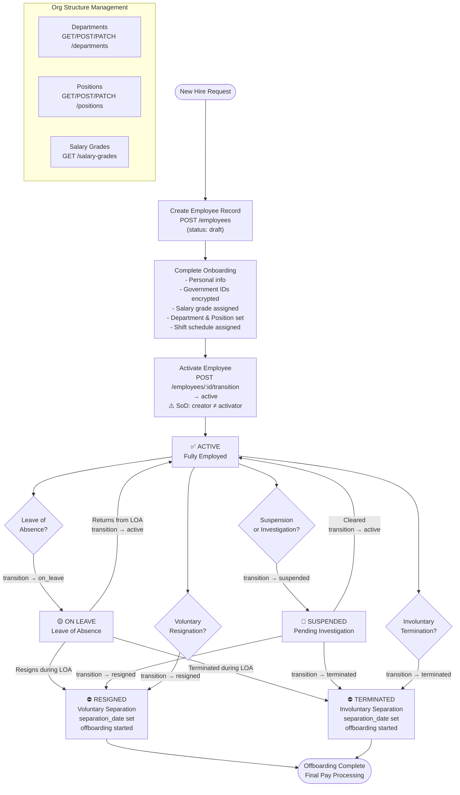
```mermaid
flowchart TD
    START([New Hire Request]) --> CREATE["Create Employee Record\nPOST /employees\n(status: draft)"]
    CREATE --> ONBOARD["Complete Onboarding\n- Personal info\n- Government IDs encrypted\n- Salary grade assigned\n- Department & Position set\n- Shift schedule assigned"]
    ONBOARD --> ACTIVATE["Activate Employee\nPOST /employees/:id/transition\n→ active\n⚠️ SoD: creator ≠ activator"]

    ACTIVATE --> EMPLOYED["✅ ACTIVE\nFully Employed"]

    EMPLOYED --> LOA{"Leave of\nAbsence?"}
    EMPLOYED --> SUSPEND{"Suspension\nor Investigation?"}
    EMPLOYED --> RESIGN{"Voluntary\nResignation?"}
    EMPLOYED --> TERM{"Involuntary\nTermination?"}

    LOA -->|"transition → on_leave"| ON_LEAVE["🟡 ON LEAVE\nLeave of Absence"]
    ON_LEAVE -->|"Returns from LOA\ntransition → active"| EMPLOYED
    ON_LEAVE -->|"Resigns during LOA"| RESIGNED
    ON_LEAVE -->|"Terminated during LOA"| TERMINATED

    SUSPEND -->|"transition → suspended"| SUSPENDED["🔴 SUSPENDED\nPending Investigation"]
    SUSPENDED -->|"Cleared\ntransition → active"| EMPLOYED
    SUSPENDED -->|"transition → resigned"| RESIGNED
    SUSPENDED -->|"transition → terminated"| TERMINATED

    RESIGN -->|"transition → resigned"| RESIGNED["⛔ RESIGNED\nVoluntary Separation\nseparation_date set\noffboarding started"]
    TERM -->|"transition → terminated"| TERMINATED["⛔ TERMINATED\nInvoluntary Separation\nseparation_date set\noffboarding started"]

    RESIGNED --> END_OFFBOARD([Offboarding Complete\nFinal Pay Processing])
    TERMINATED --> END_OFFBOARD

    subgraph STRUCTURE["Org Structure Management"]
        DEPT["Departments\nGET/POST/PATCH /departments"]
        POS["Positions\nGET/POST/PATCH /positions"]
        SG["Salary Grades\nGET /salary-grades"]
    end
```

---

## 3. Attendance — Time & Overtime

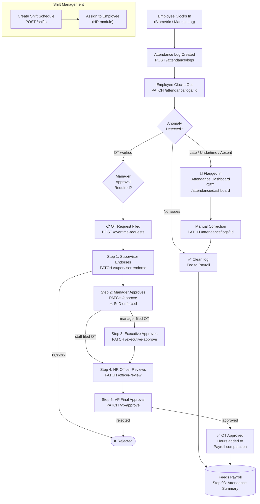
```mermaid
flowchart TD
    CLOCK_IN["Employee Clocks In\n(Biometric / Manual Log)"] --> LOG["Attendance Log Created\nPOST /attendance/logs"]
    LOG --> CLOCK_OUT["Employee Clocks Out\nPATCH /attendance/logs/:id"]
    CLOCK_OUT --> ANOMALY{"Anomaly\nDetected?"}

    ANOMALY -->|"Late / Undertime / Absent"| ANOMALY_FLAG["🚩 Flagged in\nAttendance Dashboard\nGET /attendance/dashboard"]
    ANOMALY -->|"OT worked"| OT_CHECK{"Manager\nApproval\nRequired?"}
    ANOMALY -->|"No issues"| NORMAL["✅ Clean log\nFed to Payroll"]

    ANOMALY_FLAG --> CORRECTION["Manual Correction\nPATCH /attendance/logs/:id"]
    CORRECTION --> NORMAL

    OT_CHECK --> OT_REQUEST["📋 OT Request Filed\nPOST /overtime-requests"]
    OT_REQUEST --> SUPERVISOR["Step 1: Supervisor Endorses\nPATCH /supervisor-endorse"]
    SUPERVISOR -->|"rejected"| OT_REJECT(["❌ Rejected"])
    SUPERVISOR --> APPROVE["Step 2: Manager Approves\nPATCH /approve\n⚠️ SoD enforced"]
    APPROVE -->|"manager filed OT"| EXEC_APPROVE["Step 3: Executive Approves\nPATCH /executive-approve"]
    APPROVE -->|"staff filed OT"| OFFICER["Step 4: HR Officer Reviews\nPATCH /officer-review"]
    EXEC_APPROVE --> OFFICER
    OFFICER --> VP["Step 5: VP Final Approval\nPATCH /vp-approve"]
    VP -->|"approved"| OT_APPROVED["✅ OT Approved\nHours added to\nPayroll computation"]
    VP -->|"rejected"| OT_REJECT

    NORMAL --> PAYROLL_FEED[("Feeds Payroll\nStep 03: Attendance Summary")]
    OT_APPROVED --> PAYROLL_FEED

    subgraph SHIFTS["Shift Management"]
        SHIFT_CREATE["Create Shift Schedule\nPOST /shifts"]
        SHIFT_ASSIGN["Assign to Employee\n(HR module)"]
        SHIFT_CREATE --> SHIFT_ASSIGN
    end
```

---

## 4. Leave — Leave Request Approval

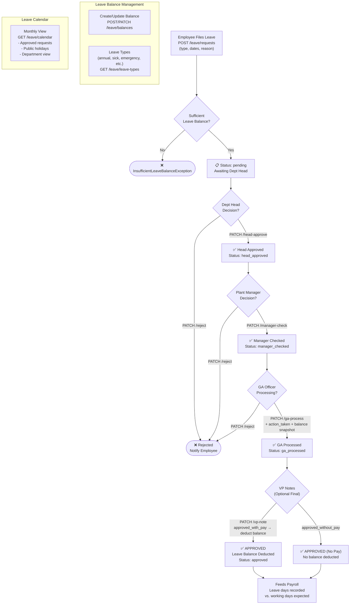
```mermaid
flowchart TD
    EMPLOYEE["Employee Files Leave\nPOST /leave/requests\n(type, dates, reason)"] --> CHECK_BALANCE{"Sufficient\nLeave Balance?"}
    CHECK_BALANCE -->|"No"| INSUFFICIENT(["❌ InsufficientLeaveBalanceException"])
    CHECK_BALANCE -->|"Yes"| PENDING["📋 Status: pending\nAwaiting Dept Head"]

    PENDING --> HEAD{"Dept Head\nDecision?"}
    HEAD -->|"PATCH /head-approve"| HEAD_APPROVED["✅ Head Approved\nStatus: head_approved"]
    HEAD -->|"PATCH /reject"| REJECTED(["❌ Rejected\nNotify Employee"])

    HEAD_APPROVED --> MANAGER{"Plant Manager\nDecision?"}
    MANAGER -->|"PATCH /manager-check"| MANAGER_NOTED["✅ Manager Checked\nStatus: manager_checked"]
    MANAGER -->|"PATCH /reject"| REJECTED

    MANAGER_NOTED --> GA{"GA Officer\nProcessing?"}
    GA -->|"PATCH /ga-process\n+ action_taken + balance snapshot"| GA_PROCESSED["✅ GA Processed\nStatus: ga_processed"]
    GA -->|"PATCH /reject"| REJECTED

    GA_PROCESSED --> VP{"VP Notes\n(Optional Final)"}
    VP -->|"PATCH /vp-note\napproved_with_pay → deduct balance"| APPROVED["✅ APPROVED\nLeave Balance Deducted\nStatus: approved"]
    VP -->|"approved_without_pay"| APPROVED_NOPAY["✅ APPROVED (No Pay)\nNo balance deducted"]

    APPROVED --> PAYROLL_IMPACT["Feeds Payroll\nLeave days recorded\nvs. working days expected"]
    APPROVED_NOPAY --> PAYROLL_IMPACT

    subgraph BALANCE["Leave Balance Management"]
        LB_CREATE["Create/Update Balance\nPOST/PATCH /leave/balances"]
        LB_TYPES["Leave Types\n(annual, sick, emergency, etc.)\nGET /leave/leave-types"]
    end

    subgraph CALENDAR["Leave Calendar"]
        CAL["Monthly View\nGET /leave/calendar\n- Approved requests\n- Public holidays\n- Department view"]
    end
```

---

## 5. Payroll — Full Payroll Run Pipeline

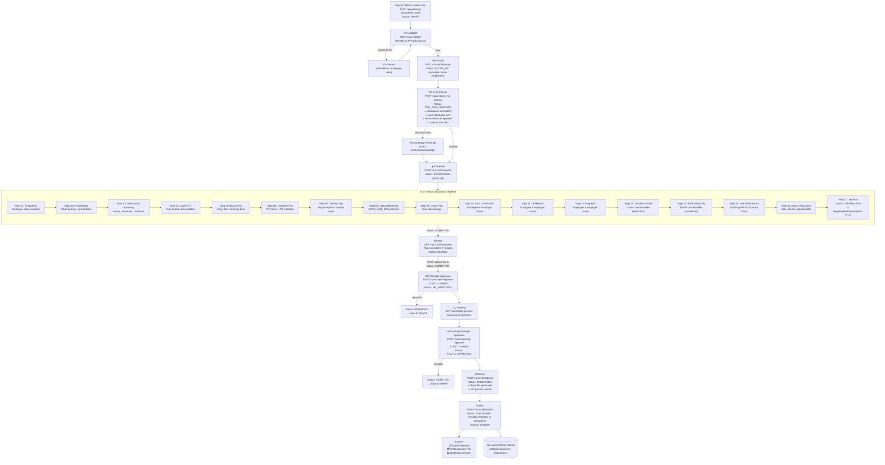
```mermaid
flowchart TD
    %% Creation
    INITIATE["Payroll Officer Creates Run\nPOST /payroll/runs\n(pay period, type)\nStatus: DRAFT"] --> VALIDATE["Pre-Validate\nGET /runs/validate\n(PR-001 to PR-008 checks)"]
    VALIDATE -->|"issues found"| FIX_ISSUES["Fix Issues\n(attendance, employee data)"]
    FIX_ISSUES --> VALIDATE
    VALIDATE -->|"clear"| SCOPE["Set Scope\nPATCH /runs/:id/scope\nStatus: SCOPE_SET\n(include/exclude employees)"]

    %% Pre-run
    SCOPE --> PRERUN["Pre-Run Checks\nPOST /runs/:id/pre-run-checks\nStatus: PRE_RUN_CHECKED\n✔ attendance complete?\n✔ loan schedules set?\n✔ leave balances updated?\n✔ salary rates set?"]
    PRERUN -->|"warnings exist"| ACKNOWLEDGE["Acknowledge Warnings\nPOST /runs/:id/acknowledge"]
    ACKNOWLEDGE --> COMPUTE
    PRERUN -->|"all clear"| COMPUTE

    %% 17-Step Pipeline
    COMPUTE["▶ Compute\nPOST /runs/:id/compute\nStatus: PROCESSING\n(async job)"] --> PIPELINE

    subgraph PIPELINE["⚙️ 17-Step Computation Pipeline"]
        S1["Step 01: Snapshots\nEmployee data snapshot"]
        S2["Step 02: Period Meta\nWorking days, period dates"]
        S3["Step 03: Attendance Summary\nHours, absences, tardiness"]
        S4["Step 04: Load YTD\nYear-to-date accumulators"]
        S5["Step 05: Basic Pay\nDaily rate × working days"]
        S6["Step 06: Overtime Pay\nOT hours × OT multiplier"]
        S7["Step 07: Holiday Pay\nRegular/special holiday rates"]
        S8["Step 08: Night Differential\n(10PM–6AM) 10% premium"]
        S9["Step 09: Gross Pay\nSum all earnings"]
        S10["Step 10: SSS Contribution\nEmployee & employer share"]
        S11["Step 11: PhilHealth\nEmployee & employer share"]
        S12["Step 12: Pag-IBIG\nEmployee & employer share"]
        S13["Step 13: Taxable Income\nGross − non-taxable deductions"]
        S14["Step 14: Withholding Tax\nTRAIN Law brackets (annualized)"]
        S15["Step 15: Loan Deductions\nSSS/Pag-IBIG/Corporate loans"]
        S16["Step 16: Other Deductions\n(late, absent, adjustments)"]
        S17["Step 17: Net Pay\nGross − all deductions\n⚠️ NegativeNetPayException if < 0"]
        S1 --> S2 --> S3 --> S4 --> S5 --> S6 --> S7 --> S8 --> S9
        S9 --> S10 --> S11 --> S12 --> S13 --> S14 --> S15 --> S16 --> S17
    end

    PIPELINE -->|"Status: COMPUTED"| REVIEW_STATE["Review\nGET /runs/:id/breakdown\nFlag exceptions if needed\nStatus: REVIEW"]

    REVIEW_STATE -->|"POST /submit-for-hr\nStatus: SUBMITTED"| HR_APPROVE["HR Manager Approves\nPOST /runs/:id/hr-approve\n⚠️ SoD: ≠ initiator\nStatus: HR_APPROVED"]
    HR_APPROVE -->|"returned"| RETURNED["Status: RETURNED\n→ back to DRAFT"]
    HR_APPROVE --> GL_PREVIEW["GL Preview\nGET /runs/:id/gl-preview\nJournal entry preview"]
    GL_PREVIEW --> ACCTG_APPROVE["Accounting Manager Approves\nPOST /runs/:id/acctg-approve\n⚠️ SoD: ≠ initiator\nStatus: ACCTG_APPROVED"]
    ACCTG_APPROVE -->|"rejected"| REJECTED_PAY["Status: REJECTED\n→ back to DRAFT"]
    ACCTG_APPROVE --> DISBURSE["Disburse\nPOST /runs/:id/disburse\nStatus: DISBURSED\n✔ Bank file generated\n✔ GL journal posted"]
    DISBURSE --> PUBLISH["Publish\nPOST /runs/:id/publish\nStatus: PUBLISHED ✅\nPayslips released to employees\nExports available"]

    PUBLISH --> EXPORTS["Exports\n📋 Payroll Register\n💳 Disbursement File\n📊 Breakdown Report"]
    PUBLISH --> GL_POST[("GL Journal Entry Posted\n(Salaries Expense / Deductions)")]
```

---

## 6. Loan — Loan Request & Disbursement

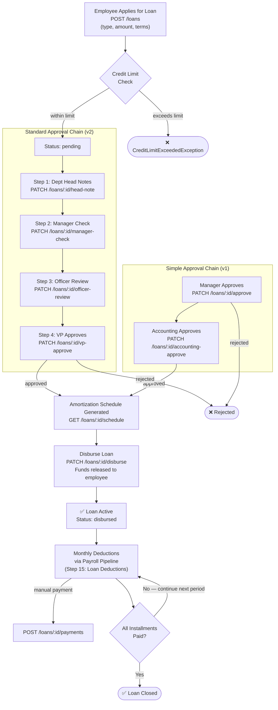
```mermaid
flowchart TD
    APPLY["Employee Applies for Loan\nPOST /loans\n(type, amount, terms)"] --> CHECK_LIMIT{"Credit Limit\nCheck"}
    CHECK_LIMIT -->|"exceeds limit"| EXCEED(["❌ CreditLimitExceededException"])
    CHECK_LIMIT -->|"within limit"| PENDING_LOAN["Status: pending"]

    subgraph V2["Standard Approval Chain (v2)"]
        PENDING_LOAN --> HEAD_NOTE["Step 1: Dept Head Notes\nPATCH /loans/:id/head-note"]
        HEAD_NOTE --> MGR_CHECK["Step 2: Manager Check\nPATCH /loans/:id/manager-check"]
        MGR_CHECK --> OFFICER_REV["Step 3: Officer Review\nPATCH /loans/:id/officer-review"]
        OFFICER_REV --> VP_APPROVE["Step 4: VP Approves\nPATCH /loans/:id/vp-approve"]
    end

    subgraph V1["Simple Approval Chain (v1)"]
        APPROVE_MGR["Manager Approves\nPATCH /loans/:id/approve"]
        APPROVE_ACCTG["Accounting Approves\nPATCH /loans/:id/accounting-approve"]
        APPROVE_MGR --> APPROVE_ACCTG
    end

    VP_APPROVE -->|"approved"| SCHEDULE["Amortization Schedule Generated\nGET /loans/:id/schedule"]
    APPROVE_ACCTG -->|"approved"| SCHEDULE

    SCHEDULE --> DISBURSE_LOAN["Disburse Loan\nPATCH /loans/:id/disburse\nFunds released to employee"]
    DISBURSE_LOAN --> ACTIVE_LOAN["✅ Loan Active\nStatus: disbursed"]

    ACTIVE_LOAN --> PAYMENT_LOOP["Monthly Deductions\nvia Payroll Pipeline\n(Step 15: Loan Deductions)"]
    PAYMENT_LOOP -->|"manual payment"| RECORD_PAY["POST /loans/:id/payments"]
    PAYMENT_LOOP --> FULLY_PAID{"All Installments\nPaid?"}
    FULLY_PAID -->|"No — continue next period"| PAYMENT_LOOP
    FULLY_PAID -->|"Yes"| CLOSED(["✅ Loan Closed"])

    VP_APPROVE -->|"rejected"| LOAN_REJECT(["❌ Rejected"])
    APPROVE_MGR -->|"rejected"| LOAN_REJECT
```

---

## 7. Procurement — Purchase to Receipt

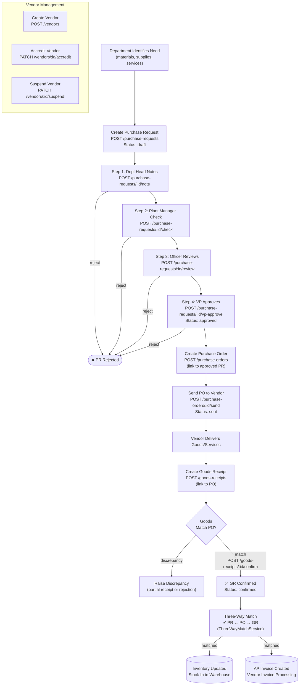
```mermaid
flowchart TD
    NEED["Department Identifies Need\n(materials, supplies, services)"] --> PR["Create Purchase Request\nPOST /purchase-requests\nStatus: draft"]

    PR --> HEAD_NOTE_PR["Step 1: Dept Head Notes\nPOST /purchase-requests/:id/note"]
    HEAD_NOTE_PR --> MGR_CHECK_PR["Step 2: Plant Manager Check\nPOST /purchase-requests/:id/check"]
    MGR_CHECK_PR --> OFFICER_PR["Step 3: Officer Reviews\nPOST /purchase-requests/:id/review"]
    OFFICER_PR --> VP_PR["Step 4: VP Approves\nPOST /purchase-requests/:id/vp-approve\nStatus: approved"]

    HEAD_NOTE_PR -->|"reject"| PR_REJECT(["❌ PR Rejected"])
    MGR_CHECK_PR -->|"reject"| PR_REJECT
    OFFICER_PR -->|"reject"| PR_REJECT
    VP_PR -->|"reject"| PR_REJECT

    VP_PR --> CREATE_PO["Create Purchase Order\nPOST /purchase-orders\n(link to approved PR)"]
    CREATE_PO --> SEND_PO["Send PO to Vendor\nPOST /purchase-orders/:id/send\nStatus: sent"]

    SEND_PO --> VENDOR_DELIVERS["Vendor Delivers Goods/Services"]
    VENDOR_DELIVERS --> GR["Create Goods Receipt\nPOST /goods-receipts\n(link to PO)"]
    GR --> CONFIRM_GR{"Goods\nMatch PO?"}
    CONFIRM_GR -->|"discrepancy"| DISCREPANCY["Raise Discrepancy\n(partial receipt or rejection)"]
    CONFIRM_GR -->|"match\nPOST /goods-receipts/:id/confirm"| GR_CONFIRMED["✅ GR Confirmed\nStatus: confirmed"]

    GR_CONFIRMED --> THREE_WAY["Three-Way Match\n✔ PR ↔ PO ↔ GR\n(ThreeWayMatchService)"]
    THREE_WAY -->|"matched"| STOCK_UPDATE[("Inventory Updated\nStock-In to Warehouse")]
    THREE_WAY -->|"matched"| AP_INVOICE[("AP Invoice Created\nVendor Invoice Processing")]

    subgraph VENDOR_MGMT["Vendor Management"]
        VENDOR_CREATE["Create Vendor\nPOST /vendors"]
        VENDOR_ACCREDIT["Accredit Vendor\nPATCH /vendors/:id/accredit"]
        VENDOR_SUSPEND["Suspend Vendor\nPATCH /vendors/:id/suspend"]
    end
```

---

## 8. Inventory — Stock Management & Requisition

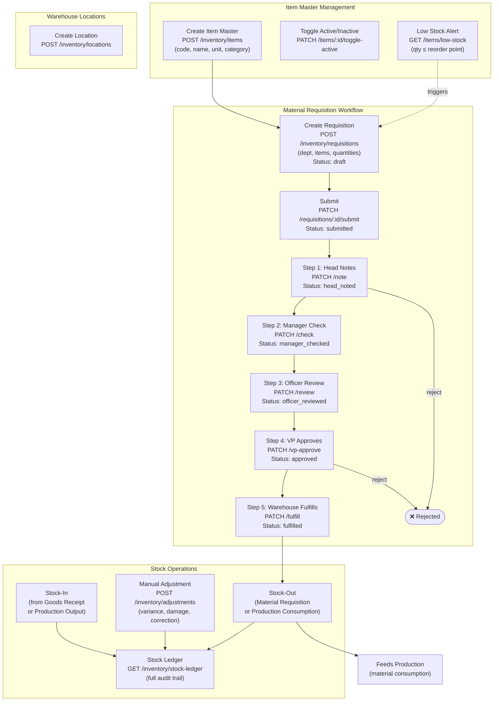
```mermaid
flowchart TD
    subgraph ITEM_MGMT["Item Master Management"]
        ITEM_CREATE["Create Item Master\nPOST /inventory/items\n(code, name, unit, category)"]
        ITEM_TOGGLE["Toggle Active/Inactive\nPATCH /items/:id/toggle-active"]
        LOW_STOCK["Low Stock Alert\nGET /items/low-stock\n(qty ≤ reorder point)"]
    end

    subgraph LOCATION["Warehouse Locations"]
        LOC_CREATE["Create Location\nPOST /inventory/locations"]
    end

    subgraph STOCK_OPS["Stock Operations"]
        STOCK_IN["Stock-In\n(from Goods Receipt\nor Production Output)"]
        STOCK_ADJ["Manual Adjustment\nPOST /inventory/adjustments\n(variance, damage, correction)"]
        STOCK_OUT["Stock-Out\n(Material Requisition\nor Production Consumption)"]
        LEDGER["Stock Ledger\nGET /inventory/stock-ledger\n(full audit trail)"]
        STOCK_IN --> LEDGER
        STOCK_ADJ --> LEDGER
        STOCK_OUT --> LEDGER
    end

    ITEM_CREATE --> MR

    subgraph MR_FLOW["Material Requisition Workflow"]
        MR["Create Requisition\nPOST /inventory/requisitions\n(dept, items, quantities)\nStatus: draft"]
        MR --> SUBMIT_MR["Submit\nPATCH /requisitions/:id/submit\nStatus: submitted"]
        SUBMIT_MR --> HEAD_MR["Step 1: Head Notes\nPATCH /note\nStatus: head_noted"]
        HEAD_MR --> MGR_MR["Step 2: Manager Check\nPATCH /check\nStatus: manager_checked"]
        MGR_MR --> OFFICER_MR["Step 3: Officer Review\nPATCH /review\nStatus: officer_reviewed"]
        OFFICER_MR --> VP_MR["Step 4: VP Approves\nPATCH /vp-approve\nStatus: approved"]
        VP_MR --> WAREHOUSE["Step 5: Warehouse Fulfills\nPATCH /fulfill\nStatus: fulfilled"]
        VP_MR -->|"reject"| MR_REJECT(["❌ Rejected"])
        HEAD_MR -->|"reject"| MR_REJECT
    end

    WAREHOUSE --> STOCK_OUT
    STOCK_OUT --> PRODUCTION["Feeds Production\n(material consumption)"]

    LOW_STOCK -.->|"triggers"| MR
```

---

## 9. Production — Manufacturing Order

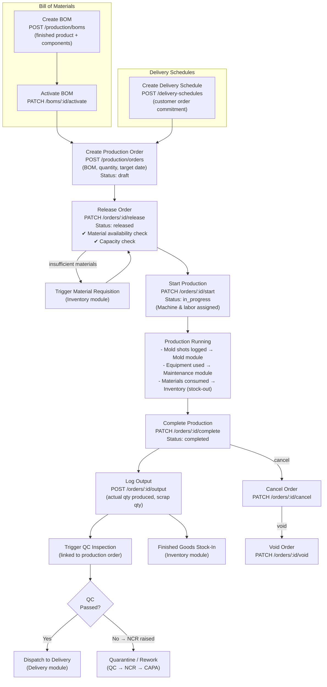
```mermaid
flowchart TD
    subgraph BOM_MGMT["Bill of Materials"]
        BOM_CREATE["Create BOM\nPOST /production/boms\n(finished product + components)"]
        BOM_ACTIVATE["Activate BOM\nPATCH /boms/:id/activate"]
        BOM_CREATE --> BOM_ACTIVATE
    end

    subgraph DELIVERY_SCHED["Delivery Schedules"]
        DS_CREATE["Create Delivery Schedule\nPOST /delivery-schedules\n(customer order commitment)"]
    end

    BOM_ACTIVATE --> PO_CREATE["Create Production Order\nPOST /production/orders\n(BOM, quantity, target date)\nStatus: draft"]
    DS_CREATE --> PO_CREATE

    PO_CREATE --> RELEASE["Release Order\nPATCH /orders/:id/release\nStatus: released\n✔ Material availability check\n✔ Capacity check"]
    RELEASE -->|"insufficient materials"| MR_TRIGGER["Trigger Material Requisition\n(Inventory module)"]
    MR_TRIGGER --> RELEASE

    RELEASE --> START_PROD["Start Production\nPATCH /orders/:id/start\nStatus: in_progress\n(Machine & labor assigned)"]

    START_PROD --> MACHINE_USE["Production Running\n- Mold shots logged → Mold module\n- Equipment used → Maintenance module\n- Materials consumed → Inventory (stock-out)"]

    MACHINE_USE --> COMPLETE["Complete Production\nPATCH /orders/:id/complete\nStatus: completed"]
    COMPLETE --> LOG_OUTPUT["Log Output\nPOST /orders/:id/output\n(actual qty produced, scrap qty)"]

    LOG_OUTPUT --> QC_TRIGGER["Trigger QC Inspection\n(linked to production order)"]
    LOG_OUTPUT --> STOCK_IN_FG["Finished Goods Stock-In\n(Inventory module)"]

    QC_TRIGGER --> QC_PASS{"QC\nPassed?"}
    QC_PASS -->|"Yes"| DISPATCH["Dispatch to Delivery\n(Delivery module)"]
    QC_PASS -->|"No → NCR raised"| QUARANTINE["Quarantine / Rework\n(QC → NCR → CAPA)"]

    COMPLETE -->|"cancel"| CANCEL_PO["Cancel Order\nPATCH /orders/:id/cancel"]
    CANCEL_PO -->|"void"| VOID_PO["Void Order\nPATCH /orders/:id/void"]
```

---

## 10. QC — Inspection & Non-Conformance

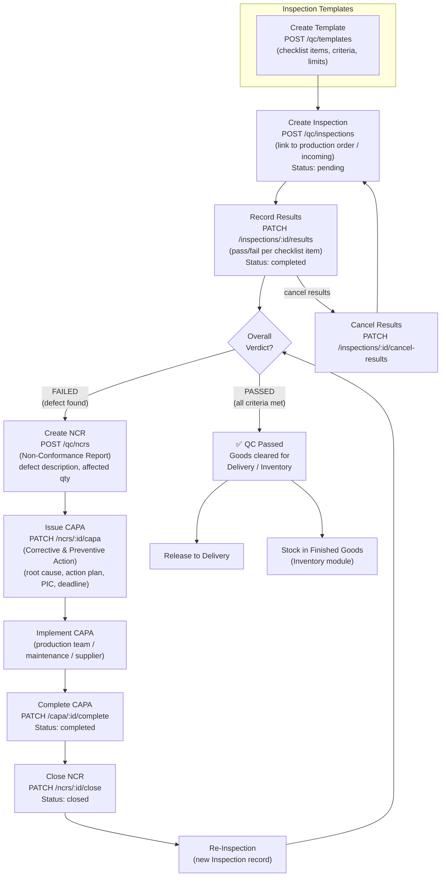
```mermaid
flowchart TD
    subgraph TEMPLATE["Inspection Templates"]
        TMPL_CREATE["Create Template\nPOST /qc/templates\n(checklist items, criteria, limits)"]
    end

    TMPL_CREATE --> INSPECTION["Create Inspection\nPOST /qc/inspections\n(link to production order / incoming)\nStatus: pending"]

    INSPECTION --> RECORD["Record Results\nPATCH /inspections/:id/results\n(pass/fail per checklist item)\nStatus: completed"]

    RECORD --> VERDICT{"Overall\nVerdict?"}
    VERDICT -->|"PASSED\n(all criteria met)"| PASS["✅ QC Passed\nGoods cleared for\nDelivery / Inventory"]
    VERDICT -->|"FAILED\n(defect found)"| NCR["Create NCR\nPOST /qc/ncrs\n(Non-Conformance Report)\ndefect description, affected qty"]

    NCR --> CAPA_ISSUE["Issue CAPA\nPATCH /ncrs/:id/capa\n(Corrective & Preventive Action)\n(root cause, action plan, PIC, deadline)"]
    CAPA_ISSUE --> CAPA_IMPL["Implement CAPA\n(production team / maintenance / supplier)"]
    CAPA_IMPL --> CAPA_COMPLETE["Complete CAPA\nPATCH /capa/:id/complete\nStatus: completed"]
    CAPA_COMPLETE --> NCR_CLOSE["Close NCR\nPATCH /ncrs/:id/close\nStatus: closed"]
    NCR_CLOSE --> RE_INSPECT["Re-Inspection\n(new Inspection record)"]
    RE_INSPECT --> VERDICT

    RECORD -->|"cancel results"| CANCEL_RESULTS["Cancel Results\nPATCH /inspections/:id/cancel-results"]
    CANCEL_RESULTS --> INSPECTION

    PASS --> DISPATCH["Release to Delivery"]
    PASS --> STOCK_IN_FG["Stock in Finished Goods\n(Inventory module)"]
```

---

## 11. Delivery — Shipment & Receipt

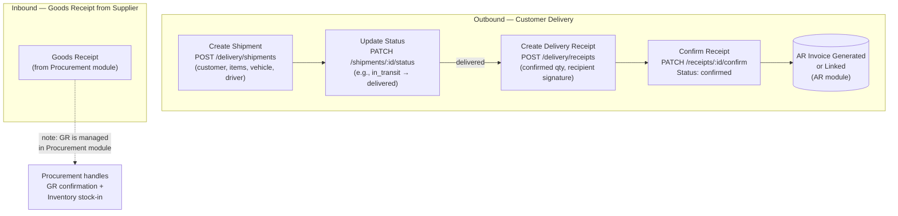
```mermaid
flowchart TD
    subgraph OUTBOUND["Outbound — Customer Delivery"]
        SHIP_CREATE["Create Shipment\nPOST /delivery/shipments\n(customer, items, vehicle, driver)"]
        SHIP_STATUS["Update Status\nPATCH /shipments/:id/status\n(e.g., in_transit → delivered)"]
        SHIP_CREATE --> SHIP_STATUS
        SHIP_STATUS -->|"delivered"| DR_CREATE["Create Delivery Receipt\nPOST /delivery/receipts\n(confirmed qty, recipient signature)"]
        DR_CREATE --> DR_CONFIRM["Confirm Receipt\nPATCH /receipts/:id/confirm\nStatus: confirmed"]
        DR_CONFIRM --> AR_INVOICE[("AR Invoice Generated\nor Linked\n(AR module)")]
    end

    subgraph INBOUND["Inbound — Goods Receipt from Supplier"]
        GR_SOURCE["Goods Receipt\n(from Procurement module)"]
    end

    GR_SOURCE -.->|"note: GR is managed\nin Procurement module"| NOTE["Procurement handles\nGR confirmation +\nInventory stock-in"]
```

---

## 12. Accounting — Journal Entry & Fiscal Periods

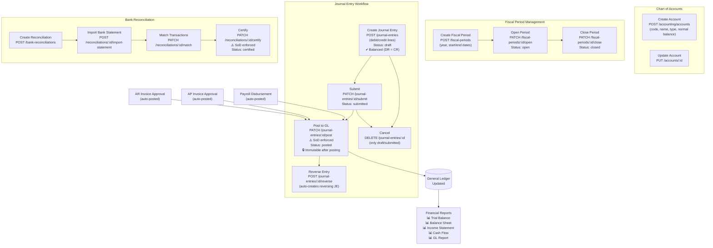
```mermaid
flowchart TD
    subgraph COA["Chart of Accounts"]
        COA_CREATE["Create Account\nPOST /accounting/accounts\n(code, name, type, normal balance)"]
        COA_UPDATE["Update Account\nPUT /accounts/:id"]
    end

    subgraph FISCAL["Fiscal Period Management"]
        FP_CREATE["Create Fiscal Period\nPOST /fiscal-periods\n(year, start/end dates)"]
        FP_OPEN["Open Period\nPATCH /fiscal-periods/:id/open\nStatus: open"]
        FP_CLOSE["Close Period\nPATCH /fiscal-periods/:id/close\nStatus: closed"]
        FP_CREATE --> FP_OPEN --> FP_CLOSE
    end

    subgraph JE["Journal Entry Workflow"]
        JE_CREATE["Create Journal Entry\nPOST /journal-entries\n(debit/credit lines)\nStatus: draft\n✔ Balanced (DR = CR)"]
        JE_SUBMIT["Submit\nPATCH /journal-entries/:id/submit\nStatus: submitted"]
        JE_POST["Post to GL\nPATCH /journal-entries/:id/post\n⚠️ SoD enforced\nStatus: posted\n🔒 Immutable after posting"]
        JE_REVERSE["Reverse Entry\nPOST /journal-entries/:id/reverse\n(auto-creates reversing JE)"]
        JE_CANCEL["Cancel\nDELETE /journal-entries/:id\n(only draft/submitted)"]

        JE_CREATE --> JE_SUBMIT --> JE_POST
        JE_POST --> JE_REVERSE
        JE_CREATE --> JE_CANCEL
        JE_SUBMIT --> JE_CANCEL
    end

    JE_POST --> GL[("General Ledger\nUpdated")]

    GL --> REPORTS["Financial Reports\n📊 Trial Balance\n📊 Balance Sheet\n📊 Income Statement\n📊 Cash Flow\n📊 GL Report"]

    subgraph BANK["Bank Reconciliation"]
        BANK_CREATE["Create Reconciliation\nPOST /bank-reconciliations"]
        BANK_IMPORT["Import Bank Statement\nPOST /reconciliations/:id/import-statement"]
        BANK_MATCH["Match Transactions\nPATCH /reconciliations/:id/match"]
        BANK_CERTIFY["Certify\nPATCH /reconciliations/:id/certify\n⚠️ SoD enforced\nStatus: certified"]
        BANK_CREATE --> BANK_IMPORT --> BANK_MATCH --> BANK_CERTIFY
    end

    %% Auto-posted JEs from other modules
    PAYROLL_JE["Payroll Disbursement\n(auto-posted)"] --> JE_POST
    AP_JE["AP Invoice Approval\n(auto-posted)"] --> JE_POST
    AR_JE["AR Invoice Approval\n(auto-posted)"] --> JE_POST
```

---

## 13. AP — Accounts Payable (Vendor Invoices)

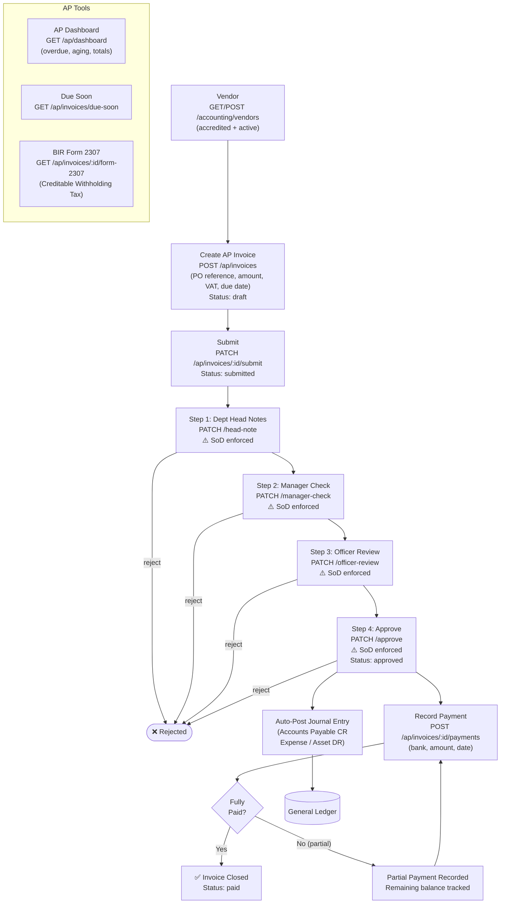
```mermaid
flowchart TD
    VENDOR["Vendor\nGET/POST /accounting/vendors\n(accredited + active)"] --> INVOICE["Create AP Invoice\nPOST /ap/invoices\n(PO reference, amount, VAT, due date)\nStatus: draft"]

    INVOICE --> SUBMIT_AP["Submit\nPATCH /ap/invoices/:id/submit\nStatus: submitted"]

    SUBMIT_AP --> HEAD_AP["Step 1: Dept Head Notes\nPATCH /head-note\n⚠️ SoD enforced"]
    HEAD_AP --> MGR_AP["Step 2: Manager Check\nPATCH /manager-check\n⚠️ SoD enforced"]
    MGR_AP --> OFFICER_AP["Step 3: Officer Review\nPATCH /officer-review\n⚠️ SoD enforced"]
    OFFICER_AP --> APPROVE_AP["Step 4: Approve\nPATCH /approve\n⚠️ SoD enforced\nStatus: approved"]

    HEAD_AP -->|"reject"| AP_REJECT(["❌ Rejected"])
    MGR_AP -->|"reject"| AP_REJECT
    OFFICER_AP -->|"reject"| AP_REJECT
    APPROVE_AP -->|"reject"| AP_REJECT

    APPROVE_AP --> JE_AUTO["Auto-Post Journal Entry\n(Accounts Payable CR\n Expense / Asset DR)"]
    APPROVE_AP --> PAYMENT["Record Payment\nPOST /ap/invoices/:id/payments\n(bank, amount, date)"]

    PAYMENT --> FULLY_PAID_AP{"Fully\nPaid?"}
    FULLY_PAID_AP -->|"Yes"| CLOSED_AP["✅ Invoice Closed\nStatus: paid"]
    FULLY_PAID_AP -->|"No (partial)"| PARTIAL["Partial Payment Recorded\nRemaining balance tracked"]
    PARTIAL --> PAYMENT

    subgraph AP_TOOLS["AP Tools"]
        DASHBOARD["AP Dashboard\nGET /ap/dashboard\n(overdue, aging, totals)"]
        DUE_SOON["Due Soon\nGET /ap/invoices/due-soon"]
        FORM_2307["BIR Form 2307\nGET /ap/invoices/:id/form-2307\n(Creditable Withholding Tax)"]
    end

    JE_AUTO --> GL[("General Ledger")]
```

---

## 14. AR — Accounts Receivable (Customer Invoices)

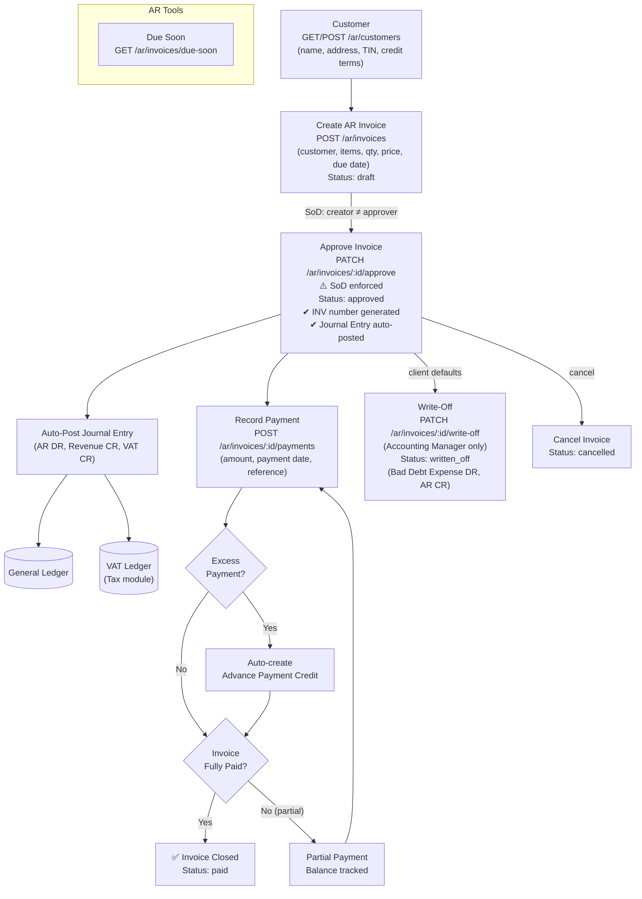
```mermaid
flowchart TD
    CUSTOMER["Customer\nGET/POST /ar/customers\n(name, address, TIN, credit terms)"] --> AR_INVOICE["Create AR Invoice\nPOST /ar/invoices\n(customer, items, qty, price, due date)\nStatus: draft"]

    AR_INVOICE -->|"SoD: creator ≠ approver"| APPROVE_AR["Approve Invoice\nPATCH /ar/invoices/:id/approve\n⚠️ SoD enforced\nStatus: approved\n✔ INV number generated\n✔ Journal Entry auto-posted"]

    APPROVE_AR --> JE_AR_AUTO["Auto-Post Journal Entry\n(AR DR, Revenue CR, VAT CR)"]
    JE_AR_AUTO --> GL_AR[("General Ledger")]
    JE_AR_AUTO --> VAT_LEDGER[("VAT Ledger\n(Tax module)")]

    APPROVE_AR --> PAYMENT_AR["Record Payment\nPOST /ar/invoices/:id/payments\n(amount, payment date, reference)"]

    PAYMENT_AR --> EXCESS{"Excess\nPayment?"}
    EXCESS -->|"Yes"| ADVANCE["Auto-create\nAdvance Payment Credit"]
    EXCESS -->|"No"| MATCH_AR{"Invoice\nFully Paid?"}
    ADVANCE --> MATCH_AR

    MATCH_AR -->|"Yes"| CLOSED_AR["✅ Invoice Closed\nStatus: paid"]
    MATCH_AR -->|"No (partial)"| PARTIAL_AR["Partial Payment\nBalance tracked"]
    PARTIAL_AR --> PAYMENT_AR

    APPROVE_AR -->|"client defaults"| WRITE_OFF["Write-Off\nPATCH /ar/invoices/:id/write-off\n(Accounting Manager only)\nStatus: written_off\n(Bad Debt Expense DR, AR CR)"]
    APPROVE_AR -->|"cancel"| CANCEL_AR["Cancel Invoice\nStatus: cancelled"]

    subgraph AR_TOOLS["AR Tools"]
        DUE_SOON_AR["Due Soon\nGET /ar/invoices/due-soon"]
    end
```

---

## 15. Tax — VAT Ledger

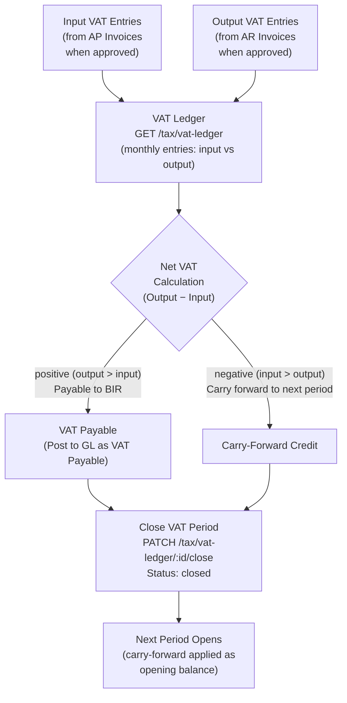
```mermaid
flowchart TD
    IN_VAT["Input VAT Entries\n(from AP Invoices\nwhen approved)"]
    OUT_VAT["Output VAT Entries\n(from AR Invoices\nwhen approved)"]

    IN_VAT --> VAT_LEDGER["VAT Ledger\nGET /tax/vat-ledger\n(monthly entries: input vs output)"]
    OUT_VAT --> VAT_LEDGER

    VAT_LEDGER --> NET_VAT{"Net VAT\nCalculation\n(Output − Input)"}

    NET_VAT -->|"positive (output > input)\nPayable to BIR"| VAT_PAYABLE["VAT Payable\n(Post to GL as VAT Payable)"]
    NET_VAT -->|"negative (input > output)\nCarry forward to next period"| CARRY_FWD["Carry-Forward Credit"]

    VAT_PAYABLE --> CLOSE_PERIOD["Close VAT Period\nPATCH /tax/vat-ledger/:id/close\nStatus: closed"]
    CARRY_FWD --> CLOSE_PERIOD

    CLOSE_PERIOD --> NEXT_PERIOD["Next Period Opens\n(carry-forward applied as\nopening balance)"]
```

---

## 16. Maintenance — Equipment & Work Orders

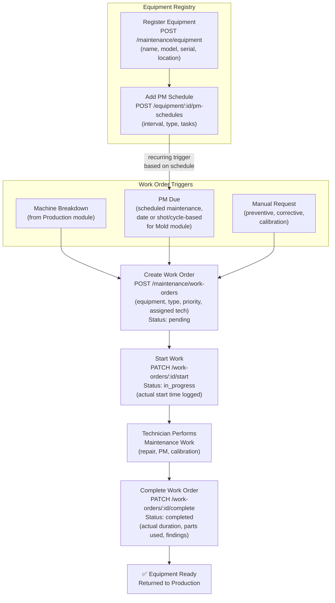
```mermaid
flowchart TD
    subgraph EQUIPMENT["Equipment Registry"]
        EQUIP_CREATE["Register Equipment\nPOST /maintenance/equipment\n(name, model, serial, location)"]
        PM_SCHED["Add PM Schedule\nPOST /equipment/:id/pm-schedules\n(interval, type, tasks)"]
        EQUIP_CREATE --> PM_SCHED
    end

    subgraph TRIGGERS["Work Order Triggers"]
        BREAKDOWN["Machine Breakdown\n(from Production module)"]
        PM_DUE["PM Due\n(scheduled maintenance,\ndate or shot/cycle-based\nfor Mold module)"]
        MANUAL_WO["Manual Request\n(preventive, corrective,\ncalibration)"]
    end

    BREAKDOWN --> WO_CREATE
    PM_DUE --> WO_CREATE
    MANUAL_WO --> WO_CREATE

    WO_CREATE["Create Work Order\nPOST /maintenance/work-orders\n(equipment, type, priority, assigned tech)\nStatus: pending"]

    WO_CREATE --> START_WO["Start Work\nPATCH /work-orders/:id/start\nStatus: in_progress\n(actual start time logged)"]

    START_WO --> WORK["Technician Performs\nMaintenance Work\n(repair, PM, calibration)"]

    WORK --> COMPLETE_WO["Complete Work Order\nPATCH /work-orders/:id/complete\nStatus: completed\n(actual duration, parts used, findings)"]

    COMPLETE_WO --> EQUIP_READY["✅ Equipment Ready\nReturned to Production"]

    PM_SCHED -->|"recurring trigger\nbased on schedule"| PM_DUE
```

---

## 17. Mold — Mold Tracking

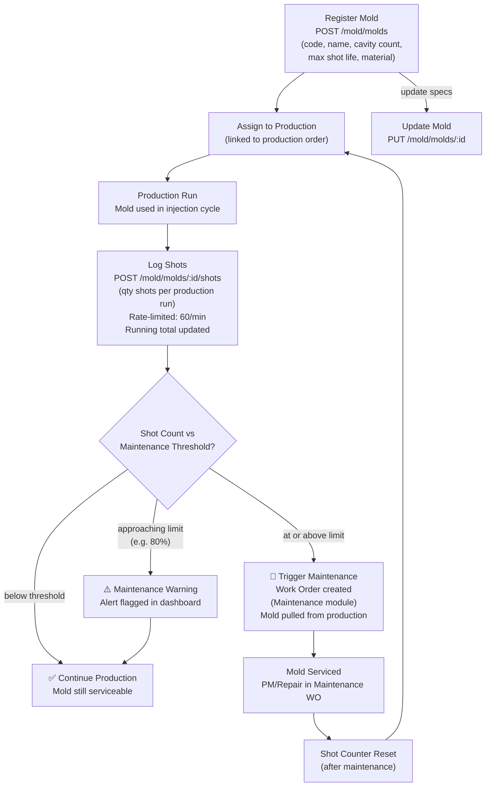
```mermaid
flowchart TD
    MOLD_CREATE["Register Mold\nPOST /mold/molds\n(code, name, cavity count,\nmax shot life, material)"]

    MOLD_CREATE --> MOLD_ASSIGN["Assign to Production\n(linked to production order)"]

    MOLD_ASSIGN --> PROD_RUN["Production Run\nMold used in injection cycle"]

    PROD_RUN --> LOG_SHOTS["Log Shots\nPOST /mold/molds/:id/shots\n(qty shots per production run)\nRate-limited: 60/min\nRunning total updated"]

    LOG_SHOTS --> SHOT_CHECK{"Shot Count vs\nMaintenance Threshold?"}

    SHOT_CHECK -->|"below threshold"| CONTINUE["✅ Continue Production\nMold still serviceable"]
    SHOT_CHECK -->|"approaching limit\n(e.g. 80%)"| WARN["⚠️ Maintenance Warning\nAlert flagged in dashboard"]
    SHOT_CHECK -->|"at or above limit"| MAINT_TRIGGER["🔴 Trigger Maintenance\nWork Order created\n(Maintenance module)\nMold pulled from production"]

    WARN --> CONTINUE
    MAINT_TRIGGER --> MOLD_MAINT["Mold Serviced\nPM/Repair in Maintenance WO"]
    MOLD_MAINT --> RESET_SHOTS["Shot Counter Reset\n(after maintenance)"]
    RESET_SHOTS --> MOLD_ASSIGN

    MOLD_CREATE -->|"update specs"| MOLD_UPDATE["Update Mold\nPUT /mold/molds/:id"]
```

---

## 18. ISO — Document Control & Internal Audit

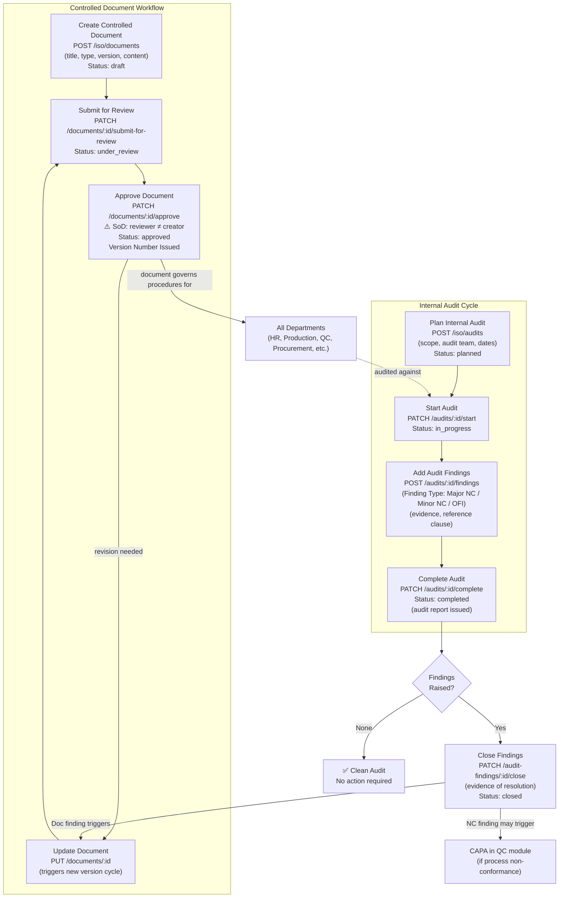
```mermaid
flowchart TD
    subgraph DOC_CONTROL["Controlled Document Workflow"]
        DOC_CREATE["Create Controlled Document\nPOST /iso/documents\n(title, type, version, content)\nStatus: draft"]
        DOC_SUBMIT_REV["Submit for Review\nPATCH /documents/:id/submit-for-review\nStatus: under_review"]
        DOC_APPROVE["Approve Document\nPATCH /documents/:id/approve\n⚠️ SoD: reviewer ≠ creator\nStatus: approved\nVersion Number Issued"]
        DOC_UPDATE["Update Document\nPUT /documents/:id\n(triggers new version cycle)"]

        DOC_CREATE --> DOC_SUBMIT_REV --> DOC_APPROVE
        DOC_APPROVE -->|"revision needed"| DOC_UPDATE --> DOC_SUBMIT_REV
    end

    DOC_APPROVE -->|"document governs procedures for"| ALL_DEPTS["All Departments\n(HR, Production, QC, Procurement, etc.)"]

    subgraph AUDIT_CYCLE["Internal Audit Cycle"]
        AUDIT_PLAN["Plan Internal Audit\nPOST /iso/audits\n(scope, audit team, dates)\nStatus: planned"]
        AUDIT_START["Start Audit\nPATCH /audits/:id/start\nStatus: in_progress"]
        FINDING_ADD["Add Audit Findings\nPOST /audits/:id/findings\n(Finding Type: Major NC / Minor NC / OFI)\n(evidence, reference clause)"]
        AUDIT_COMPLETE["Complete Audit\nPATCH /audits/:id/complete\nStatus: completed\n(audit report issued)"]

        AUDIT_PLAN --> AUDIT_START --> FINDING_ADD --> AUDIT_COMPLETE
    end

    AUDIT_COMPLETE --> FINDINGS{"Findings\nRaised?"}
    FINDINGS -->|"None"| CLEAN_AUDIT["✅ Clean Audit\nNo action required"]
    FINDINGS -->|"Yes"| CLOSE_FINDING["Close Findings\nPATCH /audit-findings/:id/close\n(evidence of resolution)\nStatus: closed"]

    CLOSE_FINDING -->|"NC finding may trigger"| CAPA_ISO["CAPA in QC module\n(if process non-conformance)"]
    CLOSE_FINDING -->|"Doc finding triggers"| DOC_UPDATE

    ALL_DEPTS -.->|"audited against"| AUDIT_START
```

---

## Cross-Module Integration Summary

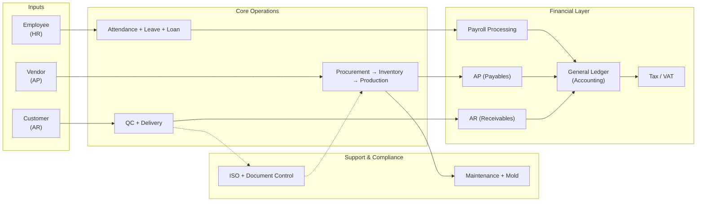
```mermaid
flowchart LR
    subgraph INPUT["Inputs"]
        EMPLOYEE["Employee\n(HR)"]
        VENDOR_I["Vendor\n(AP)"]
        CUSTOMER_I["Customer\n(AR)"]
    end

    subgraph OPERATIONS["Core Operations"]
        direction TB
        OPS1["Attendance + Leave + Loan"]
        OPS2["Procurement → Inventory → Production"]
        OPS3["QC + Delivery"]
    end

    subgraph SUPPORT["Support & Compliance"]
        MAINT_S["Maintenance + Mold"]
        ISO_S["ISO + Document Control"]
    end

    subgraph FINANCIAL["Financial Layer"]
        direction TB
        PAY_F["Payroll Processing"]
        AP_F["AP (Payables)"]
        AR_F["AR (Receivables)"]
        GL_F["General Ledger\n(Accounting)"]
        TAX_F["Tax / VAT"]
    end

    EMPLOYEE --> OPS1 --> PAY_F --> GL_F
    VENDOR_I --> OPS2 --> AP_F --> GL_F
    CUSTOMER_I --> OPS3 --> AR_F --> GL_F
    GL_F --> TAX_F

    OPS2 --> MAINT_S
    OPS3 -.-> ISO_S
    ISO_S -.-> OPS2
```

---

## Key Approval Role Matrix

| Module | Step 1 | Step 2 | Step 3 | Step 4 | Step 5 |
|--------|--------|--------|--------|--------|--------|
| **Employee Activation** | HR Manager (creator) | Dept Head (activator ≠ creator) | — | — | — |
| **Leave Request** | Dept Head | Plant Manager | GA Officer | VP (final) | — |
| **Overtime Request** | Supervisor | Manager | Executive (if mgr filed) | HR Officer | VP |
| **Loan (v2)** | Dept Head | Manager | Officer | VP | — |
| **Procurement (PR)** | Dept Head | Plant Manager | Officer | VP | — |
| **Material Requisition** | Dept Head | Manager | Officer | VP | Warehouse |
| **AP Invoice** | Dept Head | Manager | Officer | Accounting Mgr | — |
| **Payroll Run** | Initiator (compute) | HR Manager (approve) | Accounting Mgr | Cashier (disburse) | — |
| **Journal Entry** | Preparer (submit) | Accounting Mgr (post, SoD) | — | — | — |
| **AR Invoice** | Creator (draft) | Accounting Mgr (approve, SoD) | — | — | — |
| **ISO Document** | Author (submit) | QMR / Manager (approve, SoD) | — | — | — |

> **SoD Rule**: The same user who **creates** a record **cannot approve** it. Only `admin` and `super_admin` bypass SoD — `manager` role does NOT.

---

## Philippine Statutory Deductions (Payroll)

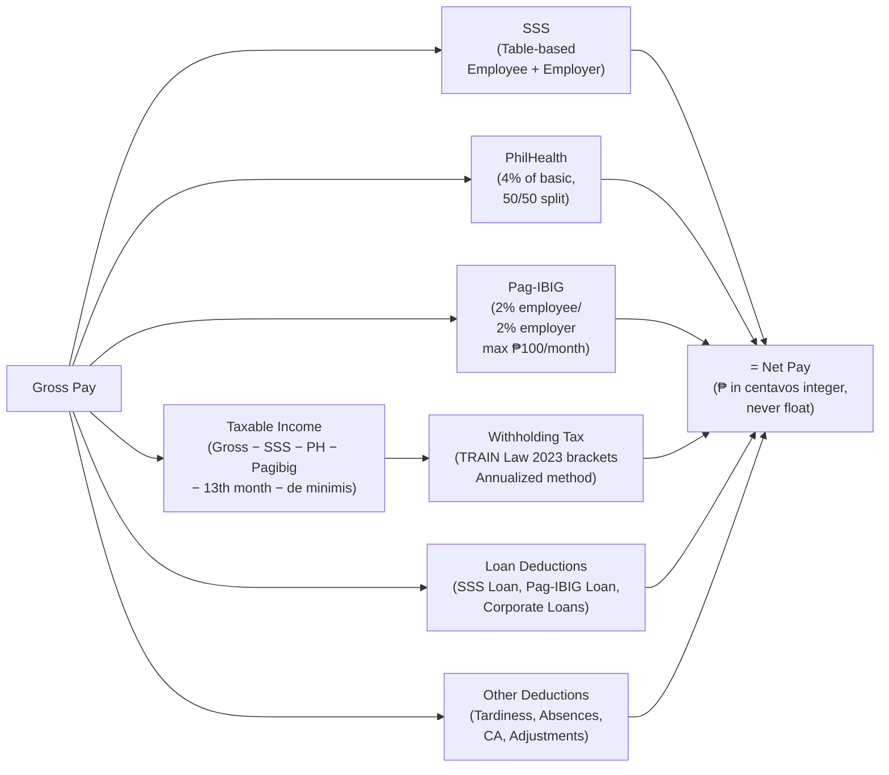
```mermaid
flowchart LR
    GROSS["Gross Pay"] --> SSS["SSS\n(Table-based\nEmployee + Employer)"]
    GROSS --> PH["PhilHealth\n(4% of basic,\n50/50 split)"]
    GROSS --> PAG["Pag-IBIG\n(2% employee/\n2% employer\nmax ₱100/month)"]
    GROSS --> TAXABLE["Taxable Income\n(Gross − SSS − PH − Pagibig\n− 13th month − de minimis)"]
    TAXABLE --> TAX_WITHHELD["Withholding Tax\n(TRAIN Law 2023 brackets\nAnnualized method)"]
    GROSS --> LOANS_DED["Loan Deductions\n(SSS Loan, Pag-IBIG Loan,\nCorporate Loans)"]
    GROSS --> OTHER_DED["Other Deductions\n(Tardiness, Absences,\nCA, Adjustments)"]

    SSS --> NET
    PH --> NET
    PAG --> NET
    TAX_WITHHELD --> NET
    LOANS_DED --> NET
    OTHER_DED --> NET
    NET["= Net Pay\n(₱ in centavos integer,\nnever float)"]
```
