# Ogami ERP -- Comprehensive Thesis Flowcharts

> **22 Modules + 4 Cross-Module Flows** | Manufacturing ERP for Philippine Businesses
> Laravel 11 + React 18 + PostgreSQL 16 | Role-Based Swimlane Diagrams

---

## Notation Legend

| Symbol | Mermaid Syntax | Meaning |
|--------|---------------|---------|
| Stadium / Oval | `([text])` | Start / End |
| Rectangle | `[text]` | Process / Action |
| Diamond | `{text}` | Decision -- Yes/No |
| Parallelogram | `[/text/]` | Data Input / Output |
| Cylinder | `[(text)]` | Database / Data Store |
| Subgraph | `subgraph` | Swimlane per Role/Actor |

> **SoD** = Separation of Duties: creator cannot be the same person as approver.

---

## Table of Contents

### Part A -- Module Flowcharts
1. [A1. HR -- Employee Lifecycle](#a1-hr----employee-lifecycle)
2. [A2. Payroll -- 17-Step Pipeline and Approval](#a2-payroll----17-step-pipeline-and-approval)
3. [A3. Accounting -- Journal Entry and Fiscal Periods](#a3-accounting----journal-entry-and-fiscal-periods)
4. [A4. AP -- Accounts Payable](#a4-ap----accounts-payable)
5. [A5. AR -- Accounts Receivable](#a5-ar----accounts-receivable)
6. [A6. Tax -- BIR Filing and VAT Ledger](#a6-tax----bir-filing-and-vat-ledger)
7. [A7. Procurement -- Purchase Request to Goods Receipt](#a7-procurement----purchase-request-to-goods-receipt)
8. [A8. Inventory -- Stock Management and Material Requisition](#a8-inventory----stock-management-and-material-requisition)
9. [A9. Production -- Manufacturing Order](#a9-production----manufacturing-order)
10. [A10. QC -- Inspection and NCR/CAPA](#a10-qc----inspection-and-ncrcapa)
11. [A11. Maintenance -- Equipment and Work Orders](#a11-maintenance----equipment-and-work-orders)
12. [A12. Mold -- Shot Tracking and EOL](#a12-mold----shot-tracking-and-eol)
13. [A13. Delivery -- Shipment and Receipt](#a13-delivery----shipment-and-receipt)
14. [A14. ISO -- Document Control and Internal Audit](#a14-iso----document-control-and-internal-audit)
15. [A15. CRM -- Client Orders and Negotiation](#a15-crm----client-orders-and-negotiation)
16. [A16. Fixed Assets -- Depreciation and Disposal](#a16-fixed-assets----depreciation-and-disposal)
17. [A17. Budget -- Annual Departmental Budgets](#a17-budget----annual-departmental-budgets)
18. [A18. Attendance -- Time Logs and Overtime](#a18-attendance----time-logs-and-overtime)
19. [A19. Leave -- Request and Approval](#a19-leave----request-and-approval)
20. [A20. Loan -- Application and Amortization](#a20-loan----application-and-amortization)
21. [A21. Sales -- Quotation to Sales Order](#a21-sales----quotation-to-sales-order)
22. [A22. Dashboard -- Role-Based KPIs](#a22-dashboard----role-based-kpis)

### Part B -- Cross-Module Integration Flowcharts
23. [B1. Purchase-to-Pay P2P](#b1-purchase-to-pay-p2p)
24. [B2. Order-to-Cash O2C](#b2-order-to-cash-o2c)
25. [B3. Payroll Cycle](#b3-payroll-cycle)
26. [B4. Inventory Flow](#b4-inventory-flow)

### Reference
- [Approval Role Matrix](#approval-role-matrix)

---

## A1. HR -- Employee Lifecycle

**Actors:** Employee, HR Manager, Department Head, System
**States:** `draft -> active <-> on_leave | suspended -> resigned | terminated`

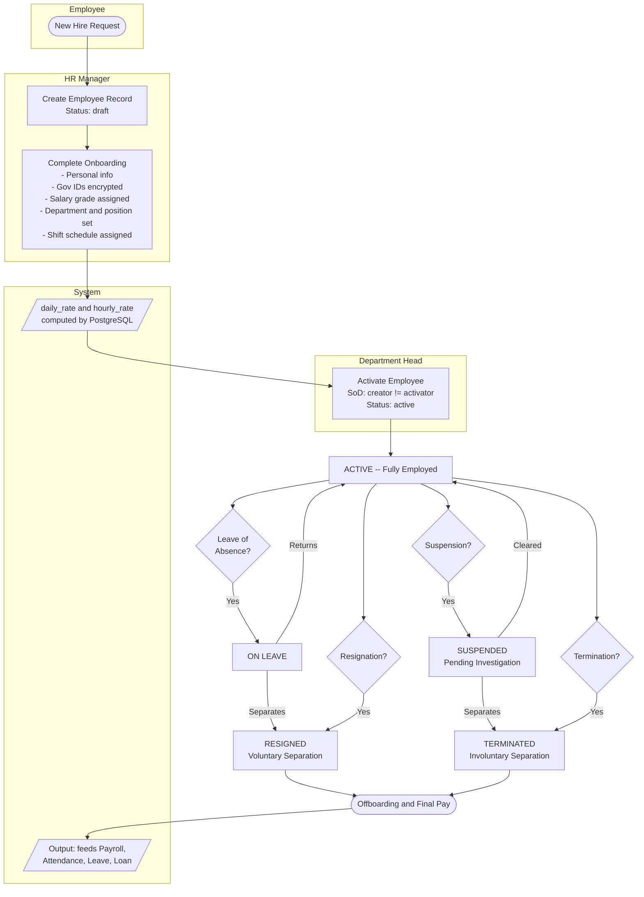
```mermaid
flowchart TD
    subgraph EMPLOYEE["Employee"]
        START([New Hire Request])
    end

    subgraph HR_MGR["HR Manager"]
        CREATE[Create Employee Record\nStatus: draft]
        ONBOARD[Complete Onboarding\n- Personal info\n- Gov IDs encrypted\n- Salary grade assigned\n- Department and position set\n- Shift schedule assigned]
    end

    subgraph DEPT_HEAD["Department Head"]
        ACTIVATE[Activate Employee\nSoD: creator != activator\nStatus: active]
    end

    subgraph SYSTEM["System"]
        GEN_COLS[/daily_rate and hourly_rate\ncomputed by PostgreSQL/]
        FEEDS[/Output: feeds Payroll,\nAttendance, Leave, Loan/]
    end

    START --> CREATE
    CREATE --> ONBOARD
    ONBOARD --> GEN_COLS
    GEN_COLS --> ACTIVATE
    ACTIVATE --> EMPLOYED["ACTIVE -- Fully Employed"]

    EMPLOYED --> LOA_Q{Leave of\nAbsence?}
    EMPLOYED --> SUSPEND_Q{Suspension?}
    EMPLOYED --> RESIGN_Q{Resignation?}
    EMPLOYED --> TERM_Q{Termination?}

    LOA_Q -->|Yes| ON_LEAVE[ON LEAVE]
    ON_LEAVE -->|Returns| EMPLOYED
    ON_LEAVE -->|Separates| RESIGNED

    SUSPEND_Q -->|Yes| SUSPENDED[SUSPENDED\nPending Investigation]
    SUSPENDED -->|Cleared| EMPLOYED
    SUSPENDED -->|Separates| TERMINATED

    RESIGN_Q -->|Yes| RESIGNED[RESIGNED\nVoluntary Separation]
    TERM_Q -->|Yes| TERMINATED[TERMINATED\nInvoluntary Separation]

    RESIGNED --> OFFBOARD([Offboarding and Final Pay])
    TERMINATED --> OFFBOARD
    OFFBOARD --> FEEDS
```

---

## A2. Payroll -- 17-Step Pipeline and Approval

**Actors:** Payroll Admin, System Pipeline, HR Manager, Accounting Manager, VP
**States:** `DRAFT -> SCOPE_SET -> PRE_RUN_CHECKED -> PROCESSING -> COMPUTED -> REVIEW -> SUBMITTED -> HR_APPROVED -> ACCTG_APPROVED -> DISBURSED -> PUBLISHED`

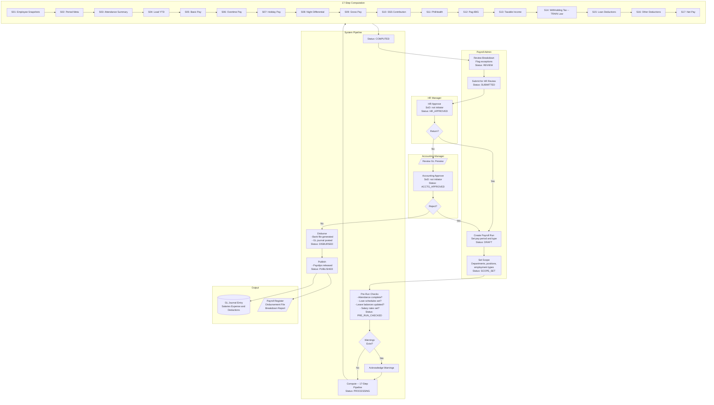
```mermaid
flowchart TD
    subgraph PAY_ADMIN["Payroll Admin"]
        CREATE_RUN[Create Payroll Run\nSet pay period and type\nStatus: DRAFT]
        SET_SCOPE[Set Scope\nDepartments, positions,\nemployment types\nStatus: SCOPE_SET]
        REVIEW_BREAK[Review Breakdown\nFlag exceptions\nStatus: REVIEW]
        SUBMIT_HR[Submit for HR Review\nStatus: SUBMITTED]
    end

    subgraph SYSTEM["System Pipeline"]
        PRERUN[Pre-Run Checks\n- Attendance complete?\n- Loan schedules set?\n- Leave balances updated?\n- Salary rates set?\nStatus: PRE_RUN_CHECKED]
        WARN_Q{Warnings\nExist?}
        ACK[Acknowledge Warnings]
        COMPUTE[Compute -- 17-Step Pipeline\nStatus: PROCESSING]
        COMPUTED_STATE[Status: COMPUTED]
        DISBURSE[Disburse\n- Bank file generated\n- GL journal posted\nStatus: DISBURSED]
        PUBLISH[Publish\n- Payslips released\nStatus: PUBLISHED]
    end

    subgraph PIPELINE["17-Step Computation"]
        S01[S01: Employee Snapshots]
        S02[S02: Period Meta]
        S03[S03: Attendance Summary]
        S04[S04: Load YTD]
        S05[S05: Basic Pay]
        S06[S06: Overtime Pay]
        S07[S07: Holiday Pay]
        S08[S08: Night Differential]
        S09[S09: Gross Pay]
        S10[S10: SSS Contribution]
        S11[S11: PhilHealth]
        S12[S12: Pag-IBIG]
        S13[S13: Taxable Income]
        S14[S14: Withholding Tax -- TRAIN Law]
        S15[S15: Loan Deductions]
        S16[S16: Other Deductions]
        S17[S17: Net Pay]
        S01 --> S02 --> S03 --> S04 --> S05 --> S06 --> S07 --> S08 --> S09
        S09 --> S10 --> S11 --> S12 --> S13 --> S14 --> S15 --> S16 --> S17
    end

    subgraph HR_MGR["HR Manager"]
        HR_APPROVE[HR Approve\nSoD: not initiator\nStatus: HR_APPROVED]
        RETURN_Q{Return?}
    end

    subgraph ACCTG_MGR["Accounting Manager"]
        GL_PREVIEW[/Review GL Preview/]
        ACCTG_APPROVE[Accounting Approve\nSoD: not initiator\nStatus: ACCTG_APPROVED]
        REJECT_Q{Reject?}
    end

    subgraph OUTPUT["Output"]
        GL_POST[(GL Journal Entry\nSalaries Expense and Deductions)]
        EXPORTS[/Payroll Register\nDisbursement File\nBreakdown Report/]
    end

    CREATE_RUN --> SET_SCOPE --> PRERUN
    PRERUN --> WARN_Q
    WARN_Q -->|Yes| ACK --> COMPUTE
    WARN_Q -->|No| COMPUTE
    COMPUTE --> PIPELINE --> COMPUTED_STATE
    COMPUTED_STATE --> REVIEW_BREAK --> SUBMIT_HR
    SUBMIT_HR --> HR_APPROVE
    HR_APPROVE --> RETURN_Q
    RETURN_Q -->|Yes| CREATE_RUN
    RETURN_Q -->|No| GL_PREVIEW --> ACCTG_APPROVE
    ACCTG_APPROVE --> REJECT_Q
    REJECT_Q -->|Yes| CREATE_RUN
    REJECT_Q -->|No| DISBURSE --> PUBLISH
    PUBLISH --> GL_POST
    PUBLISH --> EXPORTS
```

---

## A3. Accounting -- Journal Entry and Fiscal Periods

**Actors:** Accounting Clerk, Accounting Manager, System
**States (JE):** `draft -> submitted -> posted | cancelled`
**States (Bank Recon):** `pending -> in_progress -> reconciled | exception`

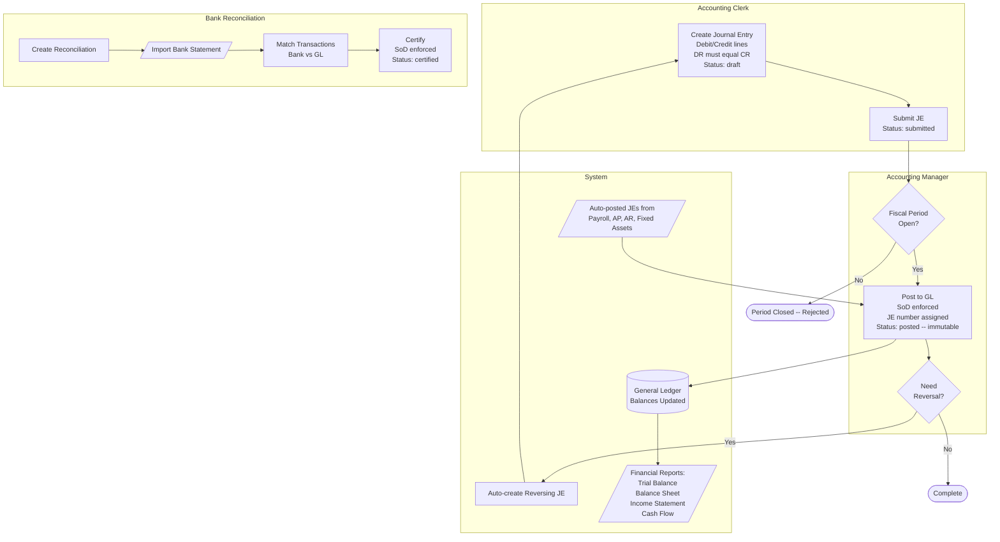
```mermaid
flowchart TD
    subgraph CLERK["Accounting Clerk"]
        JE_CREATE[Create Journal Entry\nDebit/Credit lines\nDR must equal CR\nStatus: draft]
        JE_SUBMIT[Submit JE\nStatus: submitted]
    end

    subgraph ACCTG_MGR["Accounting Manager"]
        FP_Q{Fiscal Period\nOpen?}
        JE_POST[Post to GL\nSoD enforced\nJE number assigned\nStatus: posted -- immutable]
        REVERSAL_Q{Need\nReversal?}
    end

    subgraph SYSTEM["System"]
        AUTO_JE[/Auto-posted JEs from\nPayroll, AP, AR, Fixed Assets/]
        GL_UPDATE[(General Ledger\nBalances Updated)]
        REVERSE[Auto-create Reversing JE]
        REPORTS[/Financial Reports:\nTrial Balance\nBalance Sheet\nIncome Statement\nCash Flow/]
    end

    subgraph BANK_RECON["Bank Reconciliation"]
        BANK_CREATE[Create Reconciliation]
        BANK_IMPORT[/Import Bank Statement/]
        BANK_MATCH[Match Transactions\nBank vs GL]
        BANK_CERTIFY[Certify\nSoD enforced\nStatus: certified]
    end

    JE_CREATE --> JE_SUBMIT --> FP_Q
    FP_Q -->|No| CANCEL_JE([Period Closed -- Rejected])
    FP_Q -->|Yes| JE_POST
    AUTO_JE --> JE_POST
    JE_POST --> GL_UPDATE --> REPORTS
    JE_POST --> REVERSAL_Q
    REVERSAL_Q -->|Yes| REVERSE --> JE_CREATE
    REVERSAL_Q -->|No| END_JE([Complete])

    BANK_CREATE --> BANK_IMPORT --> BANK_MATCH --> BANK_CERTIFY
```

---

## A4. AP -- Accounts Payable

**Actors:** AP Clerk, Department Head, Manager, Accounting Officer, System
**States:** `draft -> submitted -> head_noted -> manager_checked -> officer_reviewed -> approved -> partially_paid | paid`

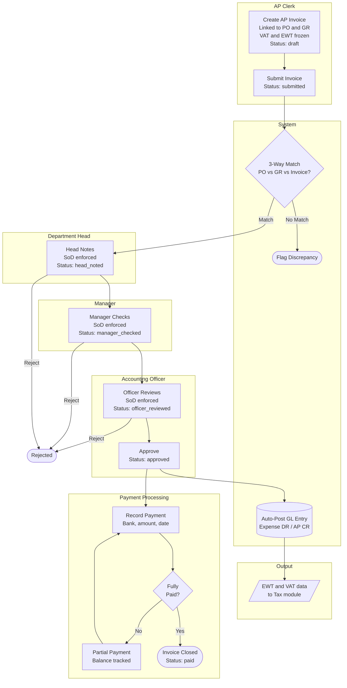
```mermaid
flowchart TD
    subgraph AP_CLERK["AP Clerk"]
        INV_CREATE[Create AP Invoice\nLinked to PO and GR\nVAT and EWT frozen\nStatus: draft]
        INV_SUBMIT[Submit Invoice\nStatus: submitted]
    end

    subgraph SYSTEM["System"]
        THREE_WAY{3-Way Match\nPO vs GR vs Invoice?}
        DISCREPANCY([Flag Discrepancy])
        GL_AUTO[(Auto-Post GL Entry\nExpense DR / AP CR)]
    end

    subgraph DEPT_HEAD["Department Head"]
        HEAD_NOTE[Head Notes\nSoD enforced\nStatus: head_noted]
    end

    subgraph MANAGER["Manager"]
        MGR_CHECK[Manager Checks\nSoD enforced\nStatus: manager_checked]
    end

    subgraph OFFICER["Accounting Officer"]
        OFF_REVIEW[Officer Reviews\nSoD enforced\nStatus: officer_reviewed]
        APPROVE_INV[Approve\nStatus: approved]
    end

    subgraph PAYMENT["Payment Processing"]
        PAY_RECORD[Record Payment\nBank, amount, date]
        FULL_Q{Fully\nPaid?}
        PARTIAL[Partial Payment\nBalance tracked]
        CLOSED([Invoice Closed\nStatus: paid])
    end

    subgraph OUTPUT["Output"]
        TAX_OUT[/EWT and VAT data\nto Tax module/]
    end

    INV_CREATE --> INV_SUBMIT --> THREE_WAY
    THREE_WAY -->|No Match| DISCREPANCY
    THREE_WAY -->|Match| HEAD_NOTE
    HEAD_NOTE --> MGR_CHECK --> OFF_REVIEW --> APPROVE_INV
    HEAD_NOTE -->|Reject| REJECTED([Rejected])
    MGR_CHECK -->|Reject| REJECTED
    OFF_REVIEW -->|Reject| REJECTED
    APPROVE_INV --> GL_AUTO
    APPROVE_INV --> PAY_RECORD
    PAY_RECORD --> FULL_Q
    FULL_Q -->|Yes| CLOSED
    FULL_Q -->|No| PARTIAL --> PAY_RECORD
    GL_AUTO --> TAX_OUT
```

---

## A5. AR -- Accounts Receivable

**Actors:** Sales Clerk, Accounting Manager, VP, System
**States:** `draft -> approved -> partially_paid -> paid | written_off | cancelled`

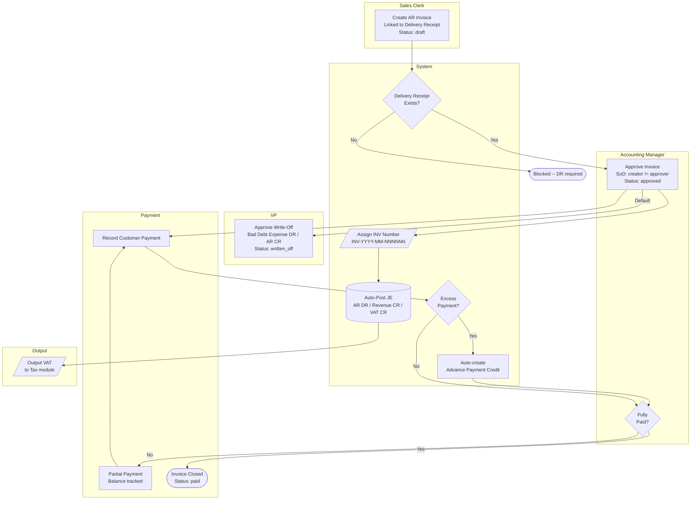
```mermaid
flowchart TD
    subgraph SALES_CLERK["Sales Clerk"]
        AR_CREATE[Create AR Invoice\nLinked to Delivery Receipt\nStatus: draft]
    end

    subgraph SYSTEM["System"]
        DR_Q{Delivery Receipt\nExists?}
        INV_NUM[/Assign INV Number\nINV-YYYY-MM-NNNNNN/]
        GL_AUTO[(Auto-Post JE\nAR DR / Revenue CR / VAT CR)]
        EXCESS_Q{Excess\nPayment?}
        ADVANCE[Auto-create\nAdvance Payment Credit]
    end

    subgraph ACCTG_MGR["Accounting Manager"]
        AR_APPROVE[Approve Invoice\nSoD: creator != approver\nStatus: approved]
        PAID_Q{Fully\nPaid?}
    end

    subgraph VP["VP"]
        WRITE_OFF[Approve Write-Off\nBad Debt Expense DR / AR CR\nStatus: written_off]
    end

    subgraph PAYMENT["Payment"]
        PAY_RECORD[Record Customer Payment]
        PARTIAL[Partial Payment\nBalance tracked]
        CLOSED([Invoice Closed\nStatus: paid])
    end

    subgraph OUTPUT["Output"]
        VAT_OUT[/Output VAT\nto Tax module/]
    end

    AR_CREATE --> DR_Q
    DR_Q -->|No| BLOCK([Blocked -- DR required])
    DR_Q -->|Yes| AR_APPROVE
    AR_APPROVE --> INV_NUM --> GL_AUTO --> VAT_OUT
    AR_APPROVE --> PAY_RECORD
    PAY_RECORD --> EXCESS_Q
    EXCESS_Q -->|Yes| ADVANCE --> PAID_Q
    EXCESS_Q -->|No| PAID_Q
    PAID_Q -->|Yes| CLOSED
    PAID_Q -->|No| PARTIAL --> PAY_RECORD
    AR_APPROVE -->|Default| WRITE_OFF
```

---

## A6. Tax -- BIR Filing and VAT Ledger

**Actors:** System, Tax Officer, Accounting Manager
**States (BIR Filing):** `pending -> filed | late | amended | cancelled`

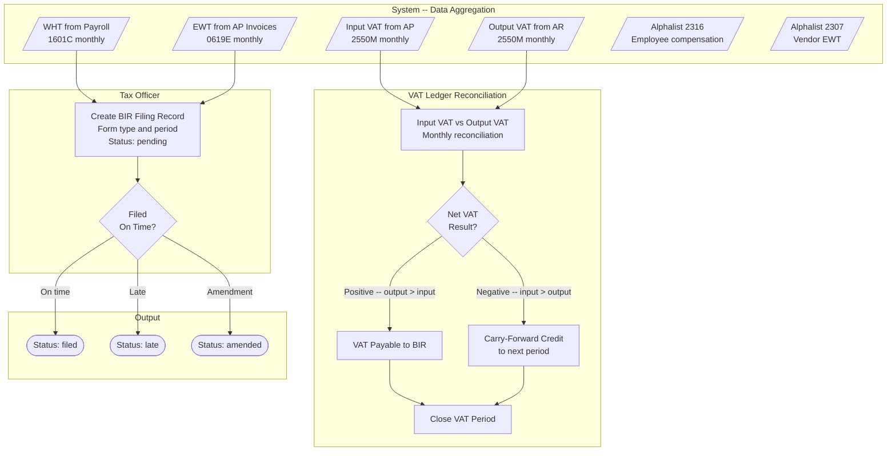
```mermaid
flowchart TD
    subgraph SYSTEM["System -- Data Aggregation"]
        WHT_IN[/WHT from Payroll\n1601C monthly/]
        EWT_IN[/EWT from AP Invoices\n0619E monthly/]
        INPUT_VAT[/Input VAT from AP\n2550M monthly/]
        OUTPUT_VAT[/Output VAT from AR\n2550M monthly/]
        ALPHA_2316[/Alphalist 2316\nEmployee compensation/]
        ALPHA_2307[/Alphalist 2307\nVendor EWT/]
    end

    subgraph TAX_OFFICER["Tax Officer"]
        CREATE_FILING[Create BIR Filing Record\nForm type and period\nStatus: pending]
        FILE_Q{Filed\nOn Time?}
    end

    subgraph VAT_LEDGER["VAT Ledger Reconciliation"]
        VAT_CALC[Input VAT vs Output VAT\nMonthly reconciliation]
        NET_Q{Net VAT\nResult?}
        PAYABLE[VAT Payable to BIR]
        CARRY_FWD[Carry-Forward Credit\nto next period]
        CLOSE_PERIOD[Close VAT Period]
    end

    subgraph OUTPUT["Output"]
        FILED([Status: filed])
        LATE([Status: late])
        AMENDED([Status: amended])
    end

    WHT_IN --> CREATE_FILING
    EWT_IN --> CREATE_FILING
    INPUT_VAT --> VAT_CALC
    OUTPUT_VAT --> VAT_CALC

    CREATE_FILING --> FILE_Q
    FILE_Q -->|On time| FILED
    FILE_Q -->|Late| LATE
    FILE_Q -->|Amendment| AMENDED

    VAT_CALC --> NET_Q
    NET_Q -->|Positive -- output > input| PAYABLE --> CLOSE_PERIOD
    NET_Q -->|Negative -- input > output| CARRY_FWD --> CLOSE_PERIOD
```

---

## A7. Procurement -- Purchase Request to Goods Receipt

**Actors:** Department Staff, Department Head, Plant Manager, Purchasing Officer, VP, Vendor, System
**States (PR):** `draft -> pending_review -> reviewed -> budget_verified -> approved -> converted_to_po`
**States (PO):** `draft -> submitted -> acknowledged -> partially_received -> received_in_full | cancelled`

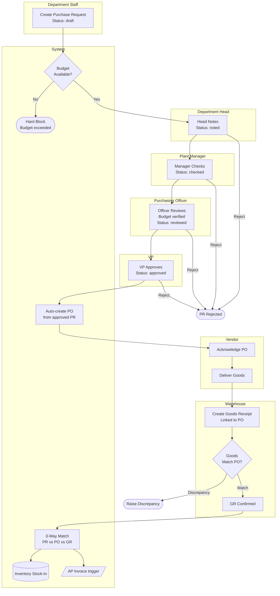
```mermaid
flowchart TD
    subgraph DEPT_STAFF["Department Staff"]
        PR_CREATE[Create Purchase Request\nStatus: draft]
    end

    subgraph SYSTEM["System"]
        BUDGET_Q{Budget\nAvailable?}
        BUDGET_BLOCK([Hard Block\nBudget exceeded])
        PO_AUTO[Auto-create PO\nfrom approved PR]
        THREE_WAY[3-Way Match\nPR vs PO vs GR]
        STOCK_IN[(Inventory Stock-In)]
        AP_TRIGGER[/AP Invoice trigger/]
    end

    subgraph DEPT_HEAD["Department Head"]
        HEAD_NOTE[Head Notes\nStatus: noted]
    end

    subgraph PLANT_MGR["Plant Manager"]
        MGR_CHECK[Manager Checks\nStatus: checked]
    end

    subgraph PURCH_OFFICER["Purchasing Officer"]
        OFF_REVIEW[Officer Reviews\nBudget verified\nStatus: reviewed]
    end

    subgraph VP["VP"]
        VP_APPROVE[VP Approves\nStatus: approved]
    end

    subgraph VENDOR["Vendor"]
        VENDOR_ACK[Acknowledge PO]
        VENDOR_DELIVER[Deliver Goods]
    end

    subgraph WAREHOUSE["Warehouse"]
        GR_CREATE[Create Goods Receipt\nLinked to PO]
        GR_Q{Goods\nMatch PO?}
        GR_CONFIRM[GR Confirmed]
    end

    PR_CREATE --> BUDGET_Q
    BUDGET_Q -->|No| BUDGET_BLOCK
    BUDGET_Q -->|Yes| HEAD_NOTE
    HEAD_NOTE --> MGR_CHECK --> OFF_REVIEW --> VP_APPROVE
    HEAD_NOTE -->|Reject| PR_REJECT([PR Rejected])
    MGR_CHECK -->|Reject| PR_REJECT
    OFF_REVIEW -->|Reject| PR_REJECT
    VP_APPROVE -->|Reject| PR_REJECT
    VP_APPROVE --> PO_AUTO
    PO_AUTO --> VENDOR_ACK --> VENDOR_DELIVER
    VENDOR_DELIVER --> GR_CREATE --> GR_Q
    GR_Q -->|Discrepancy| DISC([Raise Discrepancy])
    GR_Q -->|Match| GR_CONFIRM
    GR_CONFIRM --> THREE_WAY
    THREE_WAY --> STOCK_IN
    THREE_WAY --> AP_TRIGGER
```

---

## A8. Inventory -- Stock Management and Material Requisition

**Actors:** Warehouse Manager, Department Staff, Department Head, Manager, Officer, VP, System
**States (MRQ):** `draft -> submitted -> head_noted -> manager_checked -> officer_reviewed -> approved -> fulfilled`

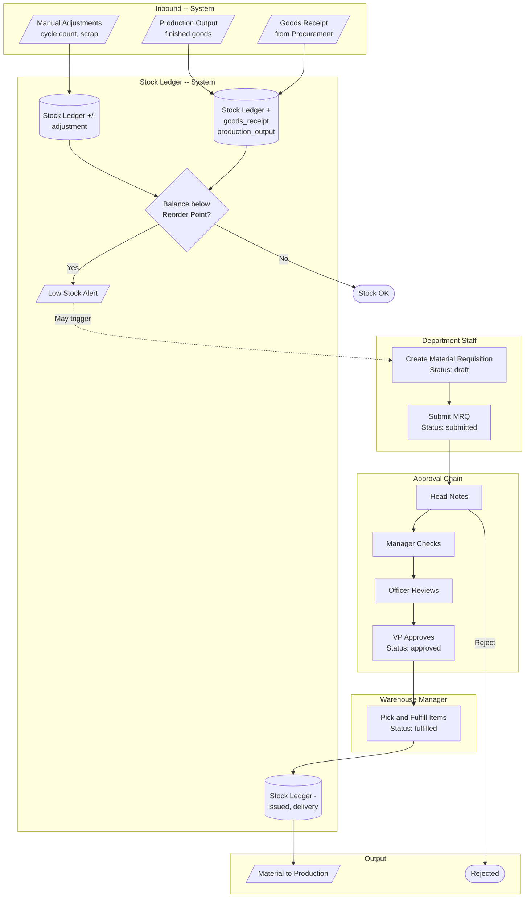
```mermaid
flowchart TD
    subgraph INBOUND["Inbound -- System"]
        GR_IN[/Goods Receipt\nfrom Procurement/]
        PROD_IN[/Production Output\nfinished goods/]
        ADJ_IN[/Manual Adjustments\ncycle count, scrap/]
    end

    subgraph LEDGER["Stock Ledger -- System"]
        LEDGER_PLUS[(Stock Ledger +\ngoods_receipt\nproduction_output)]
        LEDGER_MINUS[(Stock Ledger -\nissued, delivery)]
        LEDGER_ADJ[(Stock Ledger +/-\nadjustment)]
        LOW_Q{Balance below\nReorder Point?}
        ALERT[/Low Stock Alert/]
    end

    subgraph DEPT_STAFF["Department Staff"]
        MR_CREATE[Create Material Requisition\nStatus: draft]
        MR_SUBMIT[Submit MRQ\nStatus: submitted]
    end

    subgraph APPROVAL["Approval Chain"]
        HEAD_NOTE[Head Notes]
        MGR_CHECK[Manager Checks]
        OFF_REVIEW[Officer Reviews]
        VP_APPROVE[VP Approves\nStatus: approved]
    end

    subgraph WAREHOUSE["Warehouse Manager"]
        FULFILL[Pick and Fulfill Items\nStatus: fulfilled]
    end

    subgraph OUTPUT["Output"]
        PROD_OUT[/Material to Production/]
        REJECT([Rejected])
    end

    GR_IN --> LEDGER_PLUS
    PROD_IN --> LEDGER_PLUS
    ADJ_IN --> LEDGER_ADJ
    LEDGER_PLUS --> LOW_Q
    LEDGER_ADJ --> LOW_Q
    LOW_Q -->|Yes| ALERT -.->|May trigger| MR_CREATE
    LOW_Q -->|No| CONTINUE([Stock OK])

    MR_CREATE --> MR_SUBMIT --> HEAD_NOTE
    HEAD_NOTE --> MGR_CHECK --> OFF_REVIEW --> VP_APPROVE
    HEAD_NOTE -->|Reject| REJECT
    VP_APPROVE --> FULFILL --> LEDGER_MINUS
    LEDGER_MINUS --> PROD_OUT
```

---

## A9. Production -- Manufacturing Order

**Actors:** Production Planner, Shop Floor Supervisor, QC Inspector, System
**States:** `draft -> scheduled -> released -> in_progress -> completed | cancelled`

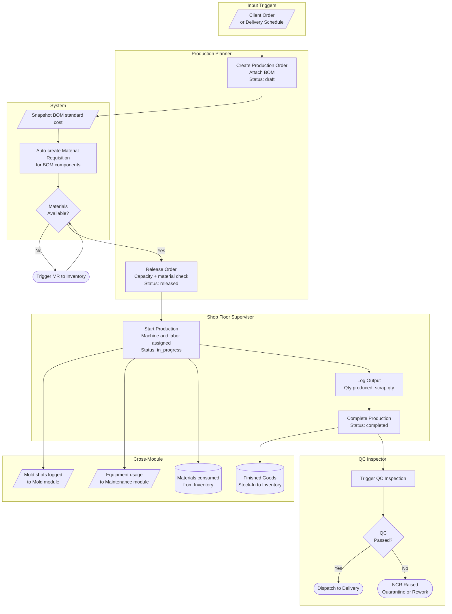
```mermaid
flowchart TD
    subgraph INPUT["Input Triggers"]
        CLIENT_ORDER[/Client Order\nor Delivery Schedule/]
    end

    subgraph PLANNER["Production Planner"]
        PO_CREATE[Create Production Order\nAttach BOM\nStatus: draft]
        RELEASE[Release Order\nCapacity + material check\nStatus: released]
    end

    subgraph SYSTEM["System"]
        COST_SNAP[/Snapshot BOM standard cost/]
        MR_AUTO[Auto-create Material Requisition\nfor BOM components]
        MAT_Q{Materials\nAvailable?}
    end

    subgraph SHOP_FLOOR["Shop Floor Supervisor"]
        START_PROD[Start Production\nMachine and labor assigned\nStatus: in_progress]
        LOG_OUTPUT[Log Output\nQty produced, scrap qty]
        COMPLETE[Complete Production\nStatus: completed]
    end

    subgraph INTEGRATIONS["Cross-Module"]
        MOLD_LOG[/Mold shots logged\nto Mold module/]
        EQUIP_LOG[/Equipment usage\nto Maintenance module/]
        MAT_CONSUME[(Materials consumed\nfrom Inventory)]
        FG_STOCK[(Finished Goods\nStock-In to Inventory)]
    end

    subgraph QC["QC Inspector"]
        QC_TRIGGER[Trigger QC Inspection]
        QC_Q{QC\nPassed?}
        DISPATCH([Dispatch to Delivery])
        NCR([NCR Raised\nQuarantine or Rework])
    end

    CLIENT_ORDER --> PO_CREATE
    PO_CREATE --> COST_SNAP --> MR_AUTO --> MAT_Q
    MAT_Q -->|No| MR_TRIGGER([Trigger MR to Inventory]) --> MAT_Q
    MAT_Q -->|Yes| RELEASE
    RELEASE --> START_PROD
    START_PROD --> MOLD_LOG
    START_PROD --> EQUIP_LOG
    START_PROD --> MAT_CONSUME
    START_PROD --> LOG_OUTPUT --> COMPLETE
    COMPLETE --> FG_STOCK
    COMPLETE --> QC_TRIGGER --> QC_Q
    QC_Q -->|Yes| DISPATCH
    QC_Q -->|No| NCR
```

---

## A10. QC -- Inspection and NCR/CAPA

**Actors:** QC Inspector, QC Manager, Production Manager, System
**States (Inspection):** `pending -> in_progress -> passed | failed_hold | reworked | scrap`
**States (NCR):** `raised -> under_investigation -> corrective_action_assigned -> closed | reopened`

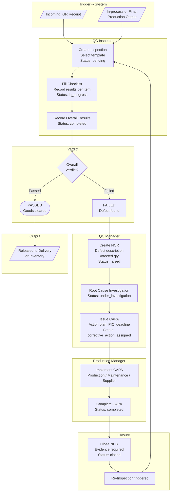
```mermaid
flowchart TD
    subgraph TRIGGER["Trigger -- System"]
        GR_TRIG[/Incoming: GR Receipt/]
        PROD_TRIG[/In-process or Final:\nProduction Output/]
    end

    subgraph INSPECTOR["QC Inspector"]
        CREATE_INSP[Create Inspection\nSelect template\nStatus: pending]
        FILL_CHECK[Fill Checklist\nRecord results per item\nStatus: in_progress]
        RECORD[Record Overall Results\nStatus: completed]
    end

    subgraph DECISION["Verdict"]
        VERDICT_Q{Overall\nVerdict?}
        PASSED([PASSED\nGoods cleared])
        FAILED[FAILED\nDefect found]
    end

    subgraph QC_MGR["QC Manager"]
        NCR_CREATE[Create NCR\nDefect description\nAffected qty\nStatus: raised]
        INVESTIGATE[Root Cause Investigation\nStatus: under_investigation]
        CAPA_ISSUE[Issue CAPA\nAction plan, PIC, deadline\nStatus: corrective_action_assigned]
    end

    subgraph PROD_MGR["Production Manager"]
        CAPA_IMPL[Implement CAPA\nProduction / Maintenance / Supplier]
        CAPA_COMPLETE[Complete CAPA\nStatus: completed]
    end

    subgraph CLOSE["Closure"]
        NCR_CLOSE[Close NCR\nEvidence required\nStatus: closed]
        RE_INSPECT[Re-Inspection triggered]
    end

    subgraph OUTPUT["Output"]
        RELEASE[/Released to Delivery\nor Inventory/]
    end

    GR_TRIG --> CREATE_INSP
    PROD_TRIG --> CREATE_INSP
    CREATE_INSP --> FILL_CHECK --> RECORD --> VERDICT_Q
    VERDICT_Q -->|Passed| PASSED --> RELEASE
    VERDICT_Q -->|Failed| FAILED --> NCR_CREATE
    NCR_CREATE --> INVESTIGATE --> CAPA_ISSUE
    CAPA_ISSUE --> CAPA_IMPL --> CAPA_COMPLETE
    CAPA_COMPLETE --> NCR_CLOSE --> RE_INSPECT
    RE_INSPECT --> CREATE_INSP
```

---

## A11. Maintenance -- Equipment and Work Orders

**Actors:** Equipment Operator, Maintenance Supervisor, Technician, System
**States (WO):** `reported -> assigned -> in_progress -> completed | cancelled`

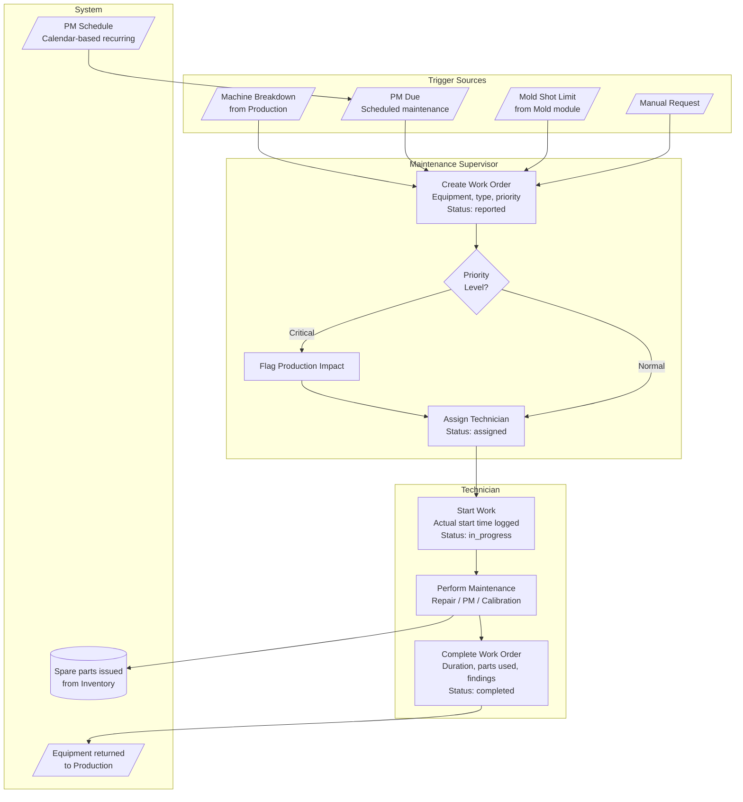
```mermaid
flowchart TD
    subgraph TRIGGERS["Trigger Sources"]
        BREAKDOWN[/Machine Breakdown\nfrom Production/]
        PM_DUE[/PM Due\nScheduled maintenance/]
        MOLD_SHOT[/Mold Shot Limit\nfrom Mold module/]
        MANUAL[/Manual Request/]
    end

    subgraph SUPERVISOR["Maintenance Supervisor"]
        WO_CREATE[Create Work Order\nEquipment, type, priority\nStatus: reported]
        ASSIGN[Assign Technician\nStatus: assigned]
        PRIORITY_Q{Priority\nLevel?}
        CRITICAL_FLAG[Flag Production Impact]
    end

    subgraph TECHNICIAN["Technician"]
        START_WORK[Start Work\nActual start time logged\nStatus: in_progress]
        PERFORM[Perform Maintenance\nRepair / PM / Calibration]
        COMPLETE_WO[Complete Work Order\nDuration, parts used, findings\nStatus: completed]
    end

    subgraph SYSTEM["System"]
        SPARE_PARTS[(Spare parts issued\nfrom Inventory)]
        EQUIP_READY[/Equipment returned\nto Production/]
        PM_SCHED[/PM Schedule\nCalendar-based recurring/]
    end

    BREAKDOWN --> WO_CREATE
    PM_DUE --> WO_CREATE
    MOLD_SHOT --> WO_CREATE
    MANUAL --> WO_CREATE
    WO_CREATE --> PRIORITY_Q
    PRIORITY_Q -->|Critical| CRITICAL_FLAG --> ASSIGN
    PRIORITY_Q -->|Normal| ASSIGN
    ASSIGN --> START_WORK --> PERFORM
    PERFORM --> SPARE_PARTS
    PERFORM --> COMPLETE_WO --> EQUIP_READY
    PM_SCHED --> PM_DUE
```

---

## A12. Mold -- Shot Tracking and EOL

**Actors:** Production Manager, Mold Engineer, System, Maintenance
**States:** `active -> under_maintenance | retired | inactive`

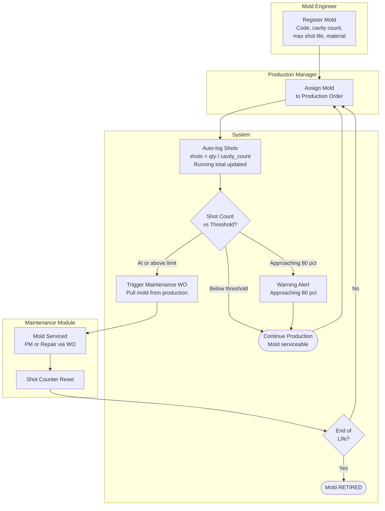
```mermaid
flowchart TD
    subgraph MOLD_ENG["Mold Engineer"]
        REGISTER[Register Mold\nCode, cavity count,\nmax shot life, material]
    end

    subgraph PROD_MGR["Production Manager"]
        ASSIGN_PROD[Assign Mold\nto Production Order]
    end

    subgraph SYSTEM["System"]
        LOG_SHOTS[Auto-log Shots\nshots = qty / cavity_count\nRunning total updated]
        SHOT_Q{Shot Count\nvs Threshold?}
        CONTINUE([Continue Production\nMold serviceable])
        WARN[Warning Alert\nApproaching 80 pct]
        MAINT_TRIGGER[Trigger Maintenance WO\nPull mold from production]
        EOL_Q{End of\nLife?}
        RETIRED([Mold RETIRED])
    end

    subgraph MAINTENANCE["Maintenance Module"]
        MOLD_SERVICE[Mold Serviced\nPM or Repair via WO]
        RESET_SHOTS[Shot Counter Reset]
    end

    REGISTER --> ASSIGN_PROD --> LOG_SHOTS --> SHOT_Q
    SHOT_Q -->|Below threshold| CONTINUE --> ASSIGN_PROD
    SHOT_Q -->|Approaching 80 pct| WARN --> CONTINUE
    SHOT_Q -->|At or above limit| MAINT_TRIGGER
    MAINT_TRIGGER --> MOLD_SERVICE --> RESET_SHOTS
    RESET_SHOTS --> EOL_Q
    EOL_Q -->|Yes| RETIRED
    EOL_Q -->|No| ASSIGN_PROD
```

---

## A13. Delivery -- Shipment and Receipt

**Actors:** Sales Admin, Logistics Manager, Delivery Driver, Customer, System
**States (DR):** `draft -> ready_for_pickup -> in_transit -> delivered | returned | cancelled`
**States (Shipment):** `pending -> shipped -> in_transit -> delivered | lost | returned`

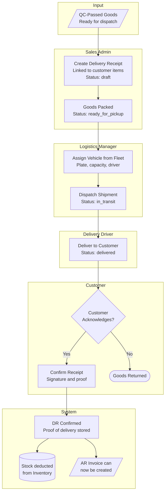
```mermaid
flowchart TD
    subgraph INPUT["Input"]
        QC_PASS[/QC-Passed Goods\nReady for dispatch/]
    end

    subgraph SALES_ADMIN["Sales Admin"]
        DR_CREATE[Create Delivery Receipt\nLinked to customer items\nStatus: draft]
        PACK[Goods Packed\nStatus: ready_for_pickup]
    end

    subgraph LOGISTICS["Logistics Manager"]
        ASSIGN_VEHICLE[Assign Vehicle from Fleet\nPlate, capacity, driver]
        DISPATCH[Dispatch Shipment\nStatus: in_transit]
    end

    subgraph DRIVER["Delivery Driver"]
        DELIVER[Deliver to Customer\nStatus: delivered]
    end

    subgraph CUSTOMER["Customer"]
        ACK_Q{Customer\nAcknowledges?}
        CONFIRM[Confirm Receipt\nSignature and proof]
        RETURN([Goods Returned])
    end

    subgraph SYSTEM["System"]
        DR_CONFIRM[DR Confirmed\nProof of delivery stored]
        STOCK_OUT[(Stock deducted\nfrom Inventory)]
        AR_TRIGGER[/AR Invoice can\nnow be created/]
    end

    QC_PASS --> DR_CREATE --> PACK --> ASSIGN_VEHICLE --> DISPATCH --> DELIVER
    DELIVER --> ACK_Q
    ACK_Q -->|Yes| CONFIRM --> DR_CONFIRM
    ACK_Q -->|No| RETURN
    DR_CONFIRM --> STOCK_OUT
    DR_CONFIRM --> AR_TRIGGER
```

---

## A14. ISO -- Document Control and Internal Audit

**Actors:** Document Author, QMS Manager, Internal Auditor, Department Owner
**States (Document):** `draft -> under_review -> effective | superseded | archived`
**States (Audit):** `scheduled -> in_progress -> completed | cancelled`
**States (Finding):** `raised -> under_investigation -> closed`

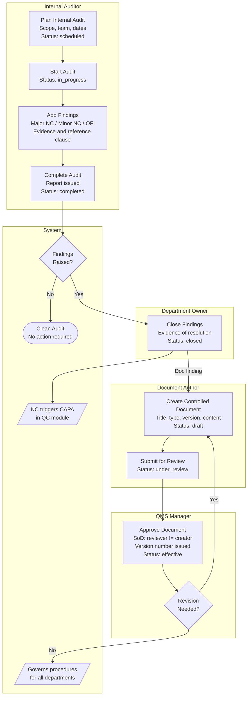
```mermaid
flowchart TD
    subgraph AUTHOR["Document Author"]
        DOC_CREATE[Create Controlled Document\nTitle, type, version, content\nStatus: draft]
        DOC_SUBMIT[Submit for Review\nStatus: under_review]
    end

    subgraph QMS_MGR["QMS Manager"]
        DOC_APPROVE[Approve Document\nSoD: reviewer != creator\nVersion number issued\nStatus: effective]
        REVISION_Q{Revision\nNeeded?}
    end

    subgraph AUDITOR["Internal Auditor"]
        AUDIT_PLAN[Plan Internal Audit\nScope, team, dates\nStatus: scheduled]
        AUDIT_START[Start Audit\nStatus: in_progress]
        ADD_FINDINGS[Add Findings\nMajor NC / Minor NC / OFI\nEvidence and reference clause]
        AUDIT_COMPLETE[Complete Audit\nReport issued\nStatus: completed]
    end

    subgraph DEPT_OWNER["Department Owner"]
        CLOSE_FINDING[Close Findings\nEvidence of resolution\nStatus: closed]
    end

    subgraph SYSTEM["System"]
        FINDINGS_Q{Findings\nRaised?}
        CLEAN([Clean Audit\nNo action required])
        CAPA_LINK[/NC triggers CAPA\nin QC module/]
        ALL_DEPTS[/Governs procedures\nfor all departments/]
    end

    DOC_CREATE --> DOC_SUBMIT --> DOC_APPROVE
    DOC_APPROVE --> REVISION_Q
    REVISION_Q -->|Yes| DOC_CREATE
    REVISION_Q -->|No| ALL_DEPTS

    AUDIT_PLAN --> AUDIT_START --> ADD_FINDINGS --> AUDIT_COMPLETE
    AUDIT_COMPLETE --> FINDINGS_Q
    FINDINGS_Q -->|No| CLEAN
    FINDINGS_Q -->|Yes| CLOSE_FINDING
    CLOSE_FINDING --> CAPA_LINK
    CLOSE_FINDING -->|Doc finding| DOC_CREATE
```

---

## A15. CRM -- Client Orders and Negotiation

**Actors:** Customer, Sales Rep, Sales Manager, VP, System
**States (Order):** `pending -> negotiating <-> client_responded -> approved | rejected | cancelled`
**States (Ticket):** `open -> in_progress -> resolved | closed | reopened`

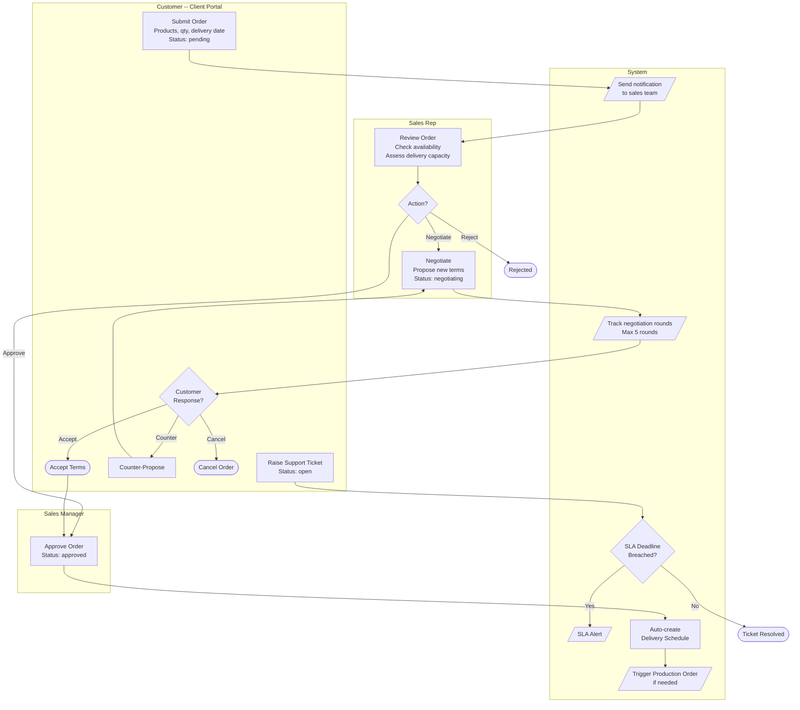
```mermaid
flowchart TD
    subgraph CUSTOMER["Customer -- Client Portal"]
        SUBMIT_ORDER[Submit Order\nProducts, qty, delivery date\nStatus: pending]
        RESPOND_Q{Customer\nResponse?}
        ACCEPT([Accept Terms])
        COUNTER[Counter-Propose]
        CANCEL_CUS([Cancel Order])
        TICKET[Raise Support Ticket\nStatus: open]
    end

    subgraph SALES_REP["Sales Rep"]
        REVIEW_ORDER[Review Order\nCheck availability\nAssess delivery capacity]
        ACTION_Q{Action?}
        NEGOTIATE[Negotiate\nPropose new terms\nStatus: negotiating]
    end

    subgraph SALES_MGR["Sales Manager"]
        APPROVE_ORDER[Approve Order\nStatus: approved]
    end

    subgraph SYSTEM["System"]
        SLA_Q{SLA Deadline\nBreached?}
        SLA_ALERT[/SLA Alert/]
        ROUND_COUNT[/Track negotiation rounds\nMax 5 rounds/]
        DS_AUTO[Auto-create\nDelivery Schedule]
        PO_AUTO[/Trigger Production Order\nif needed/]
        NOTIF[/Send notification\nto sales team/]
    end

    SUBMIT_ORDER --> NOTIF --> REVIEW_ORDER
    REVIEW_ORDER --> ACTION_Q
    ACTION_Q -->|Approve| APPROVE_ORDER
    ACTION_Q -->|Negotiate| NEGOTIATE --> ROUND_COUNT
    ACTION_Q -->|Reject| REJECTED([Rejected])
    ROUND_COUNT --> RESPOND_Q
    RESPOND_Q -->|Accept| ACCEPT --> APPROVE_ORDER
    RESPOND_Q -->|Counter| COUNTER --> NEGOTIATE
    RESPOND_Q -->|Cancel| CANCEL_CUS

    APPROVE_ORDER --> DS_AUTO --> PO_AUTO
    TICKET --> SLA_Q
    SLA_Q -->|Yes| SLA_ALERT
    SLA_Q -->|No| RESOLVE([Ticket Resolved])
```

---

## A16. Fixed Assets -- Depreciation and Disposal

**Actors:** Asset Manager, Finance Controller, System
**States:** `active -> fully_depreciated | disposed | impaired`

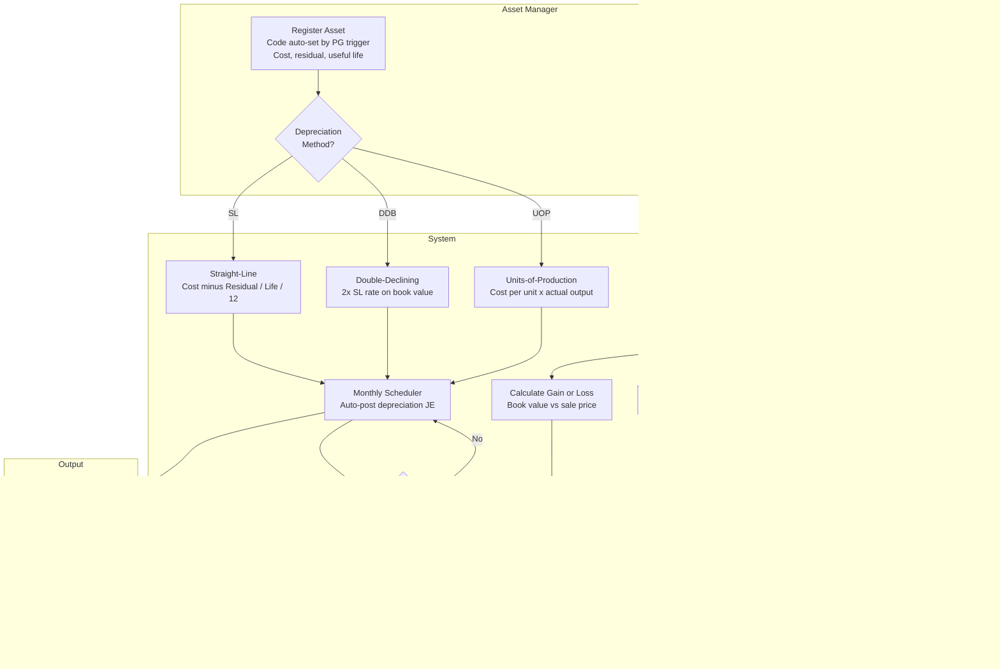
```mermaid
flowchart TD
    subgraph ASSET_MGR["Asset Manager"]
        REGISTER[Register Asset\nCode auto-set by PG trigger\nCost, residual, useful life]
        METHOD_Q{Depreciation\nMethod?}
        DISPOSE_REQ[Request Disposal\nSale price entered]
    end

    subgraph SYSTEM["System"]
        SL[Straight-Line\nCost minus Residual / Life / 12]
        DDB[Double-Declining\n2x SL rate on book value]
        UOP[Units-of-Production\nCost per unit x actual output]
        MONTHLY[Monthly Scheduler\nAuto-post depreciation JE]
        FULL_Q{Fully\nDepreciated?}
        ZERO_BV([Continue in use\nat zero book value])
        CALC_GL[Calculate Gain or Loss\nBook value vs sale price]
        DISPOSAL_JE[(Post Disposal JE\nDR Accum Dep + Gain/Loss\nCR Asset)]
        IMPAIR_JE[(Post Impairment JE)]
    end

    subgraph FIN_CTRL["Finance Controller"]
        APPROVE_DISP[Approve Disposal]
        IMPAIR_Q{Impairment\nTest?}
    end

    subgraph OUTPUT["Output"]
        GL_OUT[(Monthly Depreciation JE\nto General Ledger)]
    end

    REGISTER --> METHOD_Q
    METHOD_Q -->|SL| SL --> MONTHLY
    METHOD_Q -->|DDB| DDB --> MONTHLY
    METHOD_Q -->|UOP| UOP --> MONTHLY
    MONTHLY --> GL_OUT
    MONTHLY --> FULL_Q
    FULL_Q -->|Yes| ZERO_BV
    FULL_Q -->|No| MONTHLY

    DISPOSE_REQ --> APPROVE_DISP --> CALC_GL --> DISPOSAL_JE
    IMPAIR_Q -->|Yes| IMPAIR_JE
```

---

## A17. Budget -- Annual Departmental Budgets

**Actors:** Department Manager, Finance Controller, Budget Analyst, System
**States:** `draft -> submitted -> approved | rejected`

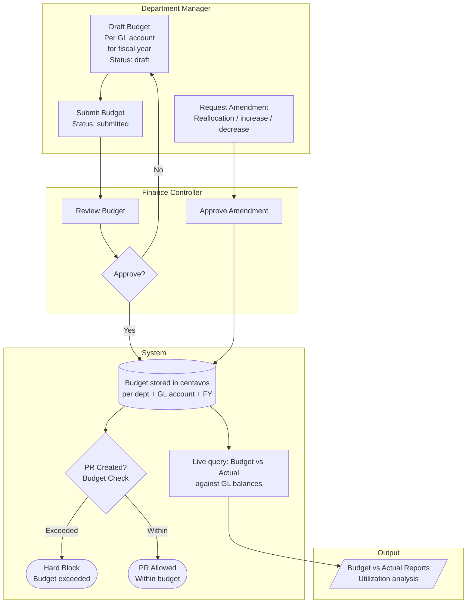
```mermaid
flowchart TD
    subgraph DEPT_MGR["Department Manager"]
        DRAFT_BUDGET[Draft Budget\nPer GL account\nfor fiscal year\nStatus: draft]
        SUBMIT_BUDGET[Submit Budget\nStatus: submitted]
        AMEND_REQ[Request Amendment\nReallocation / increase / decrease]
    end

    subgraph FIN_CTRL["Finance Controller"]
        REVIEW_BUDGET[Review Budget]
        APPROVE_Q{Approve?}
        APPROVE_AMEND[Approve Amendment]
    end

    subgraph SYSTEM["System"]
        BUDGET_DB[(Budget stored in centavos\nper dept + GL account + FY)]
        ACTUAL_Q[Live query: Budget vs Actual\nagainst GL balances]
        PR_CHECK{PR Created?\nBudget Check}
        HARD_BLOCK([Hard Block\nBudget exceeded])
        ALLOW([PR Allowed\nWithin budget])
    end

    subgraph OUTPUT["Output"]
        REPORTS[/Budget vs Actual Reports\nUtilization analysis/]
    end

    DRAFT_BUDGET --> SUBMIT_BUDGET --> REVIEW_BUDGET --> APPROVE_Q
    APPROVE_Q -->|Yes| BUDGET_DB
    APPROVE_Q -->|No| DRAFT_BUDGET
    BUDGET_DB --> ACTUAL_Q --> REPORTS
    BUDGET_DB --> PR_CHECK
    PR_CHECK -->|Exceeded| HARD_BLOCK
    PR_CHECK -->|Within| ALLOW
    AMEND_REQ --> APPROVE_AMEND --> BUDGET_DB
```

---

## A18. Attendance -- Time Logs and Overtime

**Actors:** Employee, Supervisor, Manager, HR Officer, VP, System
**States (OT):** `pending -> supervisor_endorsed -> manager_approved -> executive_approved -> officer_reviewed -> vp_approved | rejected`

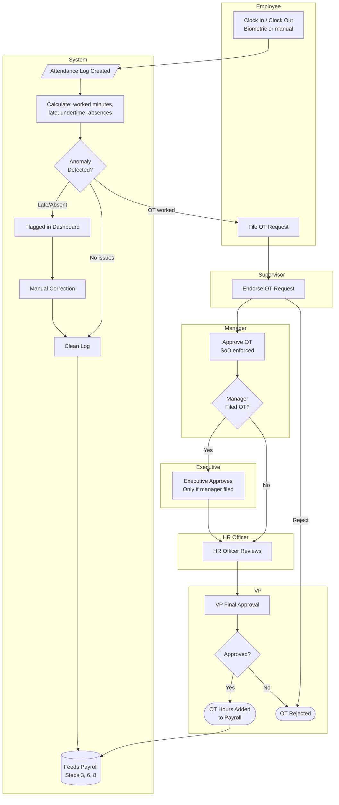
```mermaid
flowchart TD
    subgraph EMPLOYEE["Employee"]
        CLOCK[Clock In / Clock Out\nBiometric or manual]
        OT_FILE[File OT Request]
    end

    subgraph SYSTEM["System"]
        LOG[/Attendance Log Created/]
        CALC[Calculate: worked minutes,\nlate, undertime, absences]
        ANOMALY_Q{Anomaly\nDetected?}
        NORMAL[Clean Log]
        FLAG[Flagged in Dashboard]
        CORRECTION[Manual Correction]
        PAY_FEED[(Feeds Payroll\nSteps 3, 6, 8)]
    end

    subgraph SUPERVISOR["Supervisor"]
        SUP_ENDORSE[Endorse OT Request]
    end

    subgraph MANAGER["Manager"]
        MGR_APPROVE[Approve OT\nSoD enforced]
        MGR_FILED_Q{Manager\nFiled OT?}
    end

    subgraph EXEC["Executive"]
        EXEC_APPROVE[Executive Approves\nOnly if manager filed]
    end

    subgraph HR_OFFICER["HR Officer"]
        OFF_REVIEW[HR Officer Reviews]
    end

    subgraph VP["VP"]
        VP_FINAL[VP Final Approval]
        OT_Q{Approved?}
        OT_APPROVED([OT Hours Added\nto Payroll])
        OT_REJECTED([OT Rejected])
    end

    CLOCK --> LOG --> CALC --> ANOMALY_Q
    ANOMALY_Q -->|Late/Absent| FLAG --> CORRECTION --> NORMAL
    ANOMALY_Q -->|OT worked| OT_FILE
    ANOMALY_Q -->|No issues| NORMAL
    NORMAL --> PAY_FEED

    OT_FILE --> SUP_ENDORSE --> MGR_APPROVE --> MGR_FILED_Q
    MGR_FILED_Q -->|Yes| EXEC_APPROVE --> OFF_REVIEW
    MGR_FILED_Q -->|No| OFF_REVIEW
    OFF_REVIEW --> VP_FINAL --> OT_Q
    OT_Q -->|Yes| OT_APPROVED --> PAY_FEED
    OT_Q -->|No| OT_REJECTED
    SUP_ENDORSE -->|Reject| OT_REJECTED
```

---

## A19. Leave -- Request and Approval

**Actors:** Employee, Department Head, Plant Manager, GA Officer, VP, System
**States:** `draft -> submitted -> head_approved -> manager_checked -> ga_processed -> approved | rejected`

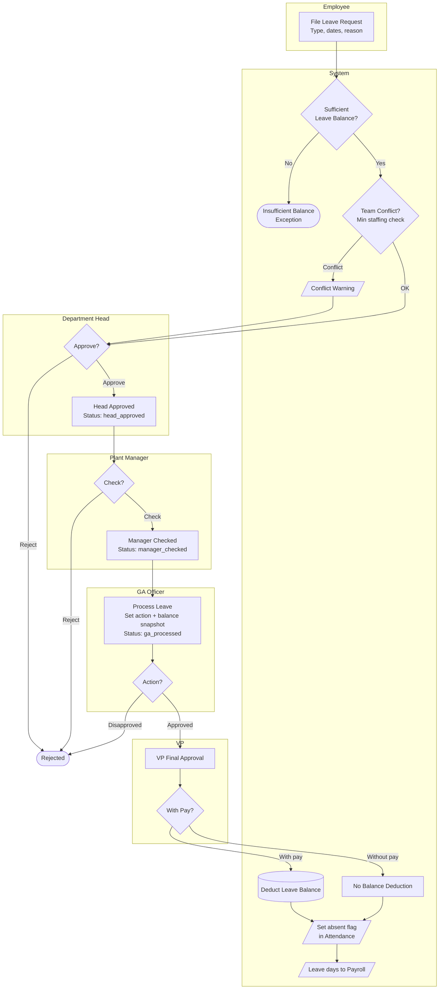
```mermaid
flowchart TD
    subgraph EMPLOYEE["Employee"]
        FILE_LEAVE[File Leave Request\nType, dates, reason]
    end

    subgraph SYSTEM["System"]
        BAL_Q{Sufficient\nLeave Balance?}
        INSUFF([Insufficient Balance\nException])
        CONFLICT_Q{Team Conflict?\nMin staffing check}
        CONFLICT_WARN[/Conflict Warning/]
        BAL_DEDUCT[(Deduct Leave Balance)]
        NO_DEDUCT[No Balance Deduction]
        ATT_FLAG[/Set absent flag\nin Attendance/]
        PAY_OUT[/Leave days to Payroll/]
    end

    subgraph DEPT_HEAD["Department Head"]
        HEAD_Q{Approve?}
        HEAD_APP[Head Approved\nStatus: head_approved]
    end

    subgraph PLANT_MGR["Plant Manager"]
        MGR_Q{Check?}
        MGR_APP[Manager Checked\nStatus: manager_checked]
    end

    subgraph GA_OFFICER["GA Officer"]
        GA_PROCESS[Process Leave\nSet action + balance snapshot\nStatus: ga_processed]
        ACTION_Q{Action?}
    end

    subgraph VP["VP"]
        VP_NOTE[VP Final Approval]
        PAY_Q{With Pay?}
    end

    FILE_LEAVE --> BAL_Q
    BAL_Q -->|No| INSUFF
    BAL_Q -->|Yes| CONFLICT_Q
    CONFLICT_Q -->|Conflict| CONFLICT_WARN
    CONFLICT_Q -->|OK| HEAD_Q
    CONFLICT_WARN --> HEAD_Q

    HEAD_Q -->|Reject| REJECTED([Rejected])
    HEAD_Q -->|Approve| HEAD_APP --> MGR_Q
    MGR_Q -->|Reject| REJECTED
    MGR_Q -->|Check| MGR_APP --> GA_PROCESS --> ACTION_Q
    ACTION_Q -->|Disapproved| REJECTED
    ACTION_Q -->|Approved| VP_NOTE --> PAY_Q
    PAY_Q -->|With pay| BAL_DEDUCT --> ATT_FLAG --> PAY_OUT
    PAY_Q -->|Without pay| NO_DEDUCT --> ATT_FLAG
```

---

## A20. Loan -- Application and Amortization

**Actors:** Employee, Department Head, Manager, Officer, VP, System
**States:** `pending -> head_noted -> manager_checked -> officer_reviewed -> supervisor_approved -> approved -> ready_for_disbursement -> active -> fully_paid | written_off`

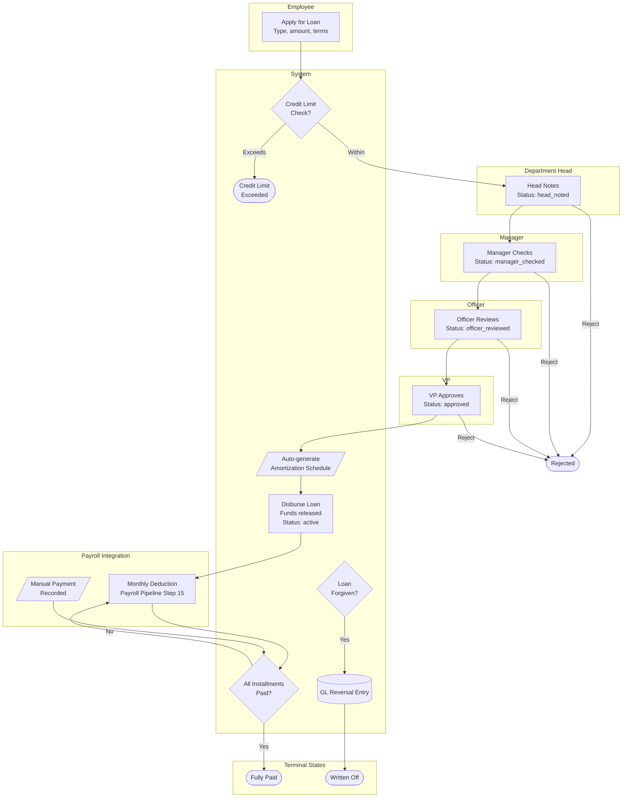
```mermaid
flowchart TD
    subgraph EMPLOYEE["Employee"]
        APPLY[Apply for Loan\nType, amount, terms]
    end

    subgraph SYSTEM["System"]
        CREDIT_Q{Credit Limit\nCheck?}
        EXCEED([Credit Limit\nExceeded])
        SCHEDULE[/Auto-generate\nAmortization Schedule/]
        DISBURSE[Disburse Loan\nFunds released\nStatus: active]
        PAID_Q{All Installments\nPaid?}
        FORGIVE_Q{Loan\nForgiven?}
        GL_REVERSAL[(GL Reversal Entry)]
    end

    subgraph DEPT_HEAD["Department Head"]
        HEAD_NOTE[Head Notes\nStatus: head_noted]
    end

    subgraph MANAGER["Manager"]
        MGR_CHECK[Manager Checks\nStatus: manager_checked]
    end

    subgraph OFFICER["Officer"]
        OFF_REVIEW[Officer Reviews\nStatus: officer_reviewed]
    end

    subgraph VP["VP"]
        VP_APPROVE[VP Approves\nStatus: approved]
    end

    subgraph PAYROLL["Payroll Integration"]
        MONTHLY_DED[Monthly Deduction\nPayroll Pipeline Step 15]
        MANUAL_PAY[/Manual Payment\nRecorded/]
    end

    subgraph TERMINAL["Terminal States"]
        FULLY_PAID([Fully Paid])
        WRITTEN_OFF([Written Off])
    end

    APPLY --> CREDIT_Q
    CREDIT_Q -->|Exceeds| EXCEED
    CREDIT_Q -->|Within| HEAD_NOTE
    HEAD_NOTE --> MGR_CHECK --> OFF_REVIEW --> VP_APPROVE
    HEAD_NOTE -->|Reject| REJECT([Rejected])
    MGR_CHECK -->|Reject| REJECT
    OFF_REVIEW -->|Reject| REJECT
    VP_APPROVE -->|Reject| REJECT
    VP_APPROVE --> SCHEDULE --> DISBURSE
    DISBURSE --> MONTHLY_DED
    MONTHLY_DED --> PAID_Q
    MANUAL_PAY --> PAID_Q
    PAID_Q -->|Yes| FULLY_PAID
    PAID_Q -->|No| MONTHLY_DED
    FORGIVE_Q -->|Yes| GL_REVERSAL --> WRITTEN_OFF
```

---

## A21. Sales -- Quotation to Sales Order

**Actors:** Customer, Sales Rep, Sales Manager, VP, System
**States (Quotation):** `draft -> sent -> accepted -> converted_to_order | rejected | expired`
**States (Sales Order):** `draft -> confirmed -> in_production -> partially_delivered -> delivered -> invoiced | cancelled`

```mermaid
flowchart TD
    subgraph SALES_REP["Sales Rep"]
        QUOT_CREATE[Create Quotation\nLine items and prices\nStatus: draft]
        QUOT_SEND[Send to Customer\nStatus: sent]
    end

    subgraph SYSTEM["System"]
        MARGIN_CHECK[/ProfitMarginService\nCheck margin per line item\nusing BOM standard costs/]
        BELOW_Q{Below-Cost\nFlagged?}
        BELOW_WARN[/Below-Cost Warning/]
        AUTO_CONVERT[Auto-convert Quotation\nto Sales Order]
        SO_CREATE[Sales Order Created\nStatus: draft]
        CREDIT_Q{Credit Limit\nCheck?}
        CREDIT_WARN[/Credit Limit Warning\nor Block/]
        FULFILL_Q{Fulfillment\nType?}
        PROD_TRIGGER[/Trigger Production Order\nMake-to-Order/]
        STOCK_CHECK[/Check Inventory\nMake-to-Stock/]
    end

    subgraph CUSTOMER["Customer"]
        CUST_Q{Customer\nResponse?}
    end

    subgraph SALES_MGR["Sales Manager"]
        DISCOUNT_Q{Discount\nAbove Threshold?}
        SO_CONFIRM[Confirm Sales Order\nStatus: confirmed]
    end

    subgraph VP["VP"]
        VP_DISC[VP Approves Discount]
    end

    subgraph LIFECYCLE["Order Lifecycle"]
        IN_PROD[Status: in_production]
        PARTIAL[Status: partially_delivered]
        DELIVERED[Status: delivered]
        INVOICED([Status: invoiced\nAR Invoice created])
        CANCELLED([Status: cancelled])
    end

    QUOT_CREATE --> MARGIN_CHECK --> BELOW_Q
    BELOW_Q -->|Yes| BELOW_WARN --> QUOT_SEND
    BELOW_Q -->|No| QUOT_SEND

    QUOT_SEND --> CUST_Q
    CUST_Q -->|Accepted| AUTO_CONVERT --> SO_CREATE
    CUST_Q -->|Rejected| REJECTED([Quotation Rejected])
    CUST_Q -->|No response| EXPIRED([Quotation Expired])

    SO_CREATE --> DISCOUNT_Q
    DISCOUNT_Q -->|Yes| VP_DISC --> SO_CONFIRM
    DISCOUNT_Q -->|No| SO_CONFIRM
    SO_CONFIRM --> CREDIT_Q
    CREDIT_Q -->|Exceeded| CREDIT_WARN
    CREDIT_Q -->|OK| FULFILL_Q
    FULFILL_Q -->|Make-to-Order| PROD_TRIGGER --> IN_PROD
    FULFILL_Q -->|Make-to-Stock| STOCK_CHECK --> IN_PROD
    IN_PROD --> PARTIAL --> DELIVERED --> INVOICED
    SO_CONFIRM -->|Cancel| CANCELLED
```

---

## A22. Dashboard -- Role-Based KPIs

**Actors:** System, Executive, Department Manager, Employee
**7 Dashboard Types:** Executive, Production, HR, Accounting, Warehouse, Sales, Employee

```mermaid
flowchart TD
    subgraph SYSTEM["System -- Data Aggregation"]
        AGG[Aggregate KPI Data\nfrom all 22 modules]
        ROLE_Q{User Role?}
        SCOPE[/Department Scope\nMiddleware enforced/]
    end

    subgraph EXECUTIVE["Executive / VP"]
        EXEC_DASH[Executive Dashboard\n- Revenue and expenses\n- Headcount\n- Production output\n- Cash position\nAll departments visible]
    end

    subgraph DEPT_MGR["Department Manager"]
        PROD_DASH[Production Dashboard\n- Order status\n- Machine utilization\n- QC pass rates]
        HR_DASH[HR Dashboard\n- Headcount and turnover\n- Recruitment pipeline\n- Leave utilization]
        ACCTG_DASH[Accounting Dashboard\n- GL balances\n- AP/AR aging\n- Budget vs Actual]
        WH_DASH[Warehouse Dashboard\n- Stock levels\n- Low-stock alerts\n- Pending MRQs]
        SALES_DASH[Sales Dashboard\n- Quotation pipeline\n- SO fulfillment\n- Revenue by customer]
    end

    subgraph EMP["Employee"]
        EMP_DASH[Employee Dashboard\n- Payslips\n- Leave balance\n- Loan status\n- Attendance summary]
    end

    AGG --> SCOPE --> ROLE_Q
    ROLE_Q -->|executive / VP| EXEC_DASH
    ROLE_Q -->|production_manager| PROD_DASH
    ROLE_Q -->|hr_manager| HR_DASH
    ROLE_Q -->|accounting_officer| ACCTG_DASH
    ROLE_Q -->|warehouse_head| WH_DASH
    ROLE_Q -->|sales_manager| SALES_DASH
    ROLE_Q -->|staff / employee| EMP_DASH
```

---

## B1. Purchase-to-Pay P2P

**End-to-End Cross-Module Flow**
**Modules:** Budget -> Procurement -> Inventory -> AP -> Accounting -> Tax

```mermaid
flowchart TD
    subgraph DEPARTMENT["Department"]
        NEED([Department identifies need])
    end

    subgraph BUDGET["Budget Module"]
        BUDGET_CHECK{Budget\nAvailable?}
        BUDGET_BLOCK([Hard Block\nBudget exceeded])
    end

    subgraph PROCUREMENT["Procurement Module"]
        PR_CREATE[Create Purchase Request\nStatus: draft]
        PR_APPROVE[4-Step Approval\nHead -> Manager -> Officer -> VP\nSoD enforced at each step]
        PR_REJECT([PR Rejected])
        PO_CREATE[Auto-create Purchase Order\nfrom approved PR]
        PO_SEND[Send PO to Vendor]
    end

    subgraph VENDOR["Vendor"]
        VENDOR_ACK[Acknowledge PO]
        VENDOR_DELIVER[Deliver Goods]
    end

    subgraph INVENTORY["Inventory Module"]
        GR_CREATE[Create Goods Receipt\nLinked to PO]
        GR_MATCH_Q{Goods\nMatch PO?}
        GR_CONFIRM[GR Confirmed]
        STOCK_IN[(Stock Ledger +\ngoods_receipt)]
    end

    subgraph AP["AP Module"]
        INV_CREATE[Create AP Invoice\nLinked to PO and GR]
        THREE_WAY{3-Way Match\nPO vs GR vs Invoice?}
        INV_APPROVE[4-Step Invoice Approval\nHead -> Manager -> Officer -> Approve\nSoD enforced]
    end

    subgraph ACCOUNTING["Accounting Module"]
        GL_POST[(Auto-Post GL Entry\nExpense DR / AP CR)]
    end

    subgraph PAYMENT["Payment"]
        PAY[Process Payment]
        PAID_Q{Fully Paid?}
        CLOSED([Invoice Paid])
        PARTIAL[Partial -- loop]
    end

    subgraph TAX["Tax Module"]
        TAX_DATA[/EWT and Input VAT\ndata recorded/]
    end

    NEED --> BUDGET_CHECK
    BUDGET_CHECK -->|No| BUDGET_BLOCK
    BUDGET_CHECK -->|Yes| PR_CREATE
    PR_CREATE --> PR_APPROVE
    PR_APPROVE -->|Reject| PR_REJECT
    PR_APPROVE -->|Approve| PO_CREATE
    PO_CREATE --> PO_SEND --> VENDOR_ACK --> VENDOR_DELIVER
    VENDOR_DELIVER --> GR_CREATE --> GR_MATCH_Q
    GR_MATCH_Q -->|Discrepancy| DISC([Raise Discrepancy])
    GR_MATCH_Q -->|Match| GR_CONFIRM --> STOCK_IN

    GR_CONFIRM --> INV_CREATE --> THREE_WAY
    THREE_WAY -->|No match| DISC
    THREE_WAY -->|Match| INV_APPROVE
    INV_APPROVE --> GL_POST --> TAX_DATA
    INV_APPROVE --> PAY --> PAID_Q
    PAID_Q -->|Yes| CLOSED
    PAID_Q -->|No| PARTIAL --> PAY
```

---

## B2. Order-to-Cash O2C

**End-to-End Cross-Module Flow**
**Modules:** CRM -> Sales -> Production -> QC -> Inventory -> Delivery -> AR -> Accounting

```mermaid
flowchart TD
    subgraph CRM["CRM Module -- Client Portal"]
        ORDER_SUBMIT([Customer submits order])
        NEGOTIATE[Sales reviews and negotiates\nMax 5 rounds]
        AGREE_Q{Agreement\nReached?}
        ORDER_CANCEL([Order Cancelled])
    end

    subgraph SALES["Sales Module"]
        ORDER_APPROVE[Order Approved]
        SO_CREATE[Sales Order Created\nCredit limit checked]
    end

    subgraph SYSTEM_DECISION["System"]
        DS_AUTO[Auto-create\nDelivery Schedule]
        PROD_Q{Production\nNeeded?}
    end

    subgraph PRODUCTION["Production Module"]
        PO_CREATE[Create Production Order\nBOM attached]
        MR_AUTO[Material Requisition\nto Inventory]
        PRODUCE[Production in progress\nOutput logged]
    end

    subgraph INVENTORY["Inventory Module"]
        MAT_ISSUE[(Materials Issued\nStock Ledger -)]
        FG_IN[(Finished Goods\nStock Ledger +)]
        STOCK_FULFILL[Stock Fulfillment\nDirect from warehouse]
    end

    subgraph QC["QC Module"]
        INSPECT[QC Inspection]
        QC_Q{Passed?}
        NCR_FLOW([NCR and Rework])
    end

    subgraph DELIVERY["Delivery Module"]
        DR_CREATE[Create Delivery Receipt]
        DISPATCH[Dispatch Shipment]
        DELIVER[Customer Receives Goods]
        ACK[Customer Acknowledges Receipt]
    end

    subgraph AR["AR Module"]
        AR_CREATE[Create AR Invoice\nLinked to DR]
        AR_APPROVE[Approve Invoice\nSoD enforced\nJE auto-posted]
    end

    subgraph ACCOUNTING["Accounting Module"]
        GL_POST[(GL Updated\nAR DR / Revenue CR / VAT CR)]
    end

    subgraph PAYMENT["Payment"]
        CUST_PAY[Customer Payment]
        PAID_Q{Fully Paid?}
        CLOSED([Invoice Paid])
    end

    subgraph TAX["Tax Module"]
        VAT_OUT[/Output VAT recorded/]
    end

    ORDER_SUBMIT --> NEGOTIATE --> AGREE_Q
    AGREE_Q -->|No| ORDER_CANCEL
    AGREE_Q -->|Yes| ORDER_APPROVE --> SO_CREATE --> DS_AUTO --> PROD_Q
    PROD_Q -->|Yes -- Make-to-Order| PO_CREATE --> MR_AUTO --> MAT_ISSUE
    MR_AUTO --> PRODUCE --> FG_IN
    PROD_Q -->|No -- Make-to-Stock| STOCK_FULFILL

    FG_IN --> INSPECT
    STOCK_FULFILL --> INSPECT
    INSPECT --> QC_Q
    QC_Q -->|No| NCR_FLOW
    QC_Q -->|Yes| DR_CREATE --> DISPATCH --> DELIVER --> ACK

    ACK --> AR_CREATE --> AR_APPROVE --> GL_POST --> VAT_OUT
    AR_APPROVE --> CUST_PAY --> PAID_Q
    PAID_Q -->|Yes| CLOSED
    PAID_Q -->|No| CUST_PAY
```

---

## B3. Payroll Cycle

**End-to-End Cross-Module Flow**
**Modules:** HR + Attendance + Leave + Loan -> Payroll -> Accounting -> Tax

```mermaid
flowchart TD
    subgraph HR["HR Module"]
        EMP_DATA[/Employee Master Data\nRates, department, position\nSalary grade snapshot/]
    end

    subgraph ATTENDANCE["Attendance Module"]
        ATT_DATA[/Attendance Summary\nWorked days, OT hours\nAbsences, night diff hours/]
    end

    subgraph LEAVE["Leave Module"]
        LEAVE_DATA[/Leave Data\nDays taken\nBalance updates\nWith or without pay/]
    end

    subgraph LOAN["Loan Module"]
        LOAN_DATA[/Active Loan Amortizations\nMonthly deduction amounts/]
    end

    subgraph PAYROLL["Payroll Module"]
        CREATE_RUN[Payroll Admin creates run\nSets scope -- DRAFT]
        PRERUN[Pre-run checks\nValidate all input data]
        COMPUTE[17-Step Pipeline\nS01 Snapshots through S17 Net Pay]
        REVIEW[Review computed results]
        SUBMIT[Submit for approval]
    end

    subgraph APPROVAL["Multi-Level Approval"]
        HR_APPROVE[HR Manager Approves\nSoD: not initiator]
        RETURN_Q{Return?}
        ACCTG_APPROVE[Accounting Manager Approves\nGL preview reviewed]
        REJECT_Q{Reject?}
    end

    subgraph DISBURSE["Disbursement"]
        BANK_FILE[/Generate Bank File/]
        PAYSLIPS[/Release Payslips\nto employees/]
    end

    subgraph ACCOUNTING["Accounting Module"]
        GL_POST[(GL Journal Entry\nSalaries Expense DR\nDeductions CR\nCash CR)]
    end

    subgraph TAX["Tax Module"]
        WHT_DATA[/WHT data for\nBIR 1601C filing/]
    end

    EMP_DATA --> PRERUN
    ATT_DATA --> PRERUN
    LEAVE_DATA --> PRERUN
    LOAN_DATA --> PRERUN

    CREATE_RUN --> PRERUN --> COMPUTE --> REVIEW --> SUBMIT
    SUBMIT --> HR_APPROVE --> RETURN_Q
    RETURN_Q -->|Yes| CREATE_RUN
    RETURN_Q -->|No| ACCTG_APPROVE --> REJECT_Q
    REJECT_Q -->|Yes| CREATE_RUN
    REJECT_Q -->|No| BANK_FILE
    BANK_FILE --> PAYSLIPS
    BANK_FILE --> GL_POST --> WHT_DATA
```

---

## B4. Inventory Flow

**End-to-End Cross-Module Flow**
**Modules:** Procurement -> Warehouse -> Production -> QC -> Delivery

```mermaid
flowchart TD
    subgraph PROCUREMENT["Procurement Module"]
        GR_CONFIRM[Goods Receipt Confirmed\nfrom vendor delivery]
    end

    subgraph WAREHOUSE["Warehouse -- Stock Ledger"]
        LEDGER_GR[(Stock Ledger +\ngoods_receipt)]
        LEDGER_PROD_OUT[(Stock Ledger +\nproduction_output)]
        LEDGER_ISSUE[(Stock Ledger -\nissued to production)]
        LEDGER_DELIVERY[(Stock Ledger -\ndelivery to customer)]
        LEDGER_ADJ[(Stock Ledger +/-\nadjustment)]
        BALANCE[Running Stock Balance\nDenormalized total]
        REORDER_Q{Below\nReorder Point?}
        LOW_ALERT[/Low Stock Alert Event/]
        RESERVE[Stock Reservations\nBlocked for open\nproduction orders]
    end

    subgraph PRODUCTION["Production Module"]
        MR_FULFILL[Material Requisition\nFulfilled by warehouse]
        PROD_OUTPUT[Production Output\nFinished goods completed]
    end

    subgraph QC["QC Module"]
        QC_INSPECT[QC Inspection]
        QC_Q{Passed?}
        QUARANTINE[Quarantine Zone\nPending disposition]
        RELEASE[Released for dispatch]
    end

    subgraph DELIVERY["Delivery Module"]
        DR_DISPATCH[Delivery Receipt\nDispatched to customer]
    end

    subgraph ADJUSTMENTS["Manual Adjustments"]
        CYCLE_COUNT[/Cycle Count/]
        SCRAP[/Scrap Write-Off/]
        CORRECTION[/Variance Correction/]
    end

    subgraph TRACEABILITY["Traceability"]
        LOT[/Lot and Batch Tracking\nFIFO costing/]
    end

    GR_CONFIRM --> LEDGER_GR --> BALANCE
    MR_FULFILL --> LEDGER_ISSUE --> BALANCE
    PROD_OUTPUT --> LEDGER_PROD_OUT --> BALANCE
    DR_DISPATCH --> LEDGER_DELIVERY --> BALANCE

    CYCLE_COUNT --> LEDGER_ADJ --> BALANCE
    SCRAP --> LEDGER_ADJ
    CORRECTION --> LEDGER_ADJ

    BALANCE --> REORDER_Q
    REORDER_Q -->|Yes| LOW_ALERT -.->|May trigger PR| GR_CONFIRM
    REORDER_Q -->|No| RESERVE

    PROD_OUTPUT --> QC_INSPECT --> QC_Q
    QC_Q -->|No| QUARANTINE
    QC_Q -->|Yes| RELEASE --> DR_DISPATCH

    BALANCE --> LOT
```

---

## Approval Role Matrix

| Module | Step 1 | Step 2 | Step 3 | Step 4 | Step 5 |
|--------|--------|--------|--------|--------|--------|
| **Employee Activation** | HR Manager -- creator | Dept Head -- activator, SoD | -- | -- | -- |
| **Leave Request** | Dept Head | Plant Manager | GA Officer | VP -- final | -- |
| **Overtime Request** | Supervisor | Manager | Executive -- if mgr filed | HR Officer | VP |
| **Loan v2** | Dept Head | Manager | Officer | VP | -- |
| **Procurement PR** | Dept Head | Plant Manager | Officer | VP | -- |
| **Material Requisition** | Dept Head | Manager | Officer | VP | Warehouse |
| **AP Invoice** | Dept Head | Manager | Officer | Accounting Mgr | -- |
| **Payroll Run** | Initiator -- compute | HR Manager -- approve | Accounting Mgr | Cashier -- disburse | -- |
| **Journal Entry** | Preparer -- submit | Accounting Mgr -- post, SoD | -- | -- | -- |
| **AR Invoice** | Creator -- draft | Accounting Mgr -- approve, SoD | -- | -- | -- |
| **ISO Document** | Author -- submit | QMR / Manager -- approve, SoD | -- | -- | -- |
| **Sales Order** | Sales Rep -- create | Sales Manager -- confirm | VP -- discount approval | -- | -- |

> **SoD Rule**: The same user who **creates** a record **cannot approve** it. Only `admin` and `super_admin` bypass SoD.

---

## Roles Quick Reference

| Role | Key Access |
|------|-----------|
| `super_admin` / `admin` | System-wide configuration, user management |
| `executive` | Read-only across all modules, VP approvals |
| `vice_president` | Final approval on payroll, leave, loans, procurement |
| `manager` | Domain operations for their department |
| `officer` | Accounting, GA, purchasing operations |
| `head` | Department head approvals |
| `staff` | Basic data entry in their department |
| `vendor` | Vendor Portal only -- PO fulfillment, catalog, invoices |
| `client` | Client Portal only -- orders, tickets |

> `manager`, `head`, and `staff` are scoped to their department. `executive` and `vice_president` see all departments. `admin` has only `system.*` permissions.
