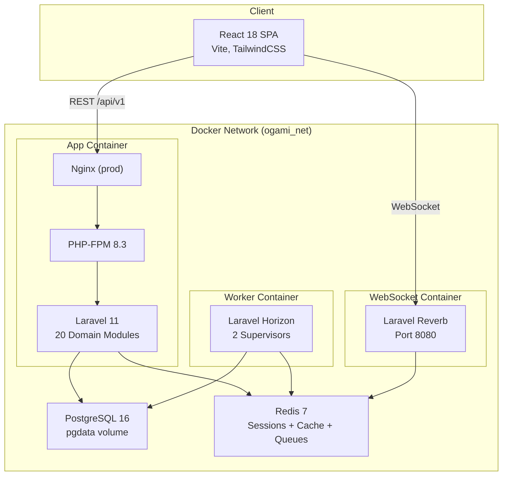

# 🔍 Full System Audit — Ogami ERP

> **Audit Date:** 2026-03-11  
> **Auditor:** AI Architecture Review  
> **Codebase:** [ogamiPHP](file:///home/kwat0g/Desktop/ogamiPHP)

---

# PART 1 — CODEBASE FOUNDATIONS

## 1.1 Repository Structure

✅ **Well-organized modular monolith.** Top-level structure:

| Directory | Contents |
|-----------|----------|
| `app/` | Application code — `Domains/`, `Http/`, `Shared/`, `Jobs/`, `Providers/` |
| `bootstrap/` | Framework bootstrap + cached config |
| [config/](file:///home/kwat0g/Desktop/ogamiPHP/.editorconfig) | 19 Laravel config files |
| `database/` | 142 migrations, 25 seeders, factories |
| `docker/` | Nginx, PHP, Supervisor config for Docker |
| `docs/` | Project documentation |
| `frontend/` | React 18 SPA (separate pnpm workspace) |
| `public/` | Web root + built frontend assets |
| `resources/` | Blade views (minimal — SPA-first) |
| `routes/` | [api.php](file:///home/kwat0g/Desktop/ogamiPHP/routes/api.php) + 27 domain route files in `routes/api/v1/` |
| `storage/` | Logs, cache, sessions |
| `tests/` | Pest PHP tests (5 suites) + k6/load test scripts |
| `vendor/` | Composer dependencies |
| `.agents/` | AI coding agent instructions (skills, workflows) |
| `.github/` | GitHub Copilot instructions (no CI/CD pipelines) |
| `.githooks/` | Pre-push hook |

- **Monorepo style** — pnpm workspace (`pnpm-workspace.yaml`) connects root and `frontend/`.
- **Auto-generated/excluded dirs:** `vendor/`, `node_modules/`, `frontend/dist/`, `storage/logs/*`, `docker/postgres/data/` — all in `.gitignore`.
- ⚠️ `.env.production` is in `.gitignore` but a copy exists on disk — verify it is not committed.

**Root-level files (26):**

| File | Purpose |
|------|---------|
| `composer.json` / `composer.lock` | PHP dependency management |
| `package.json` / `pnpm-lock.yaml` / `pnpm-workspace.yaml` | JS workspace orchestration |
| `Dockerfile` | Multi-stage Docker build (4 stages) |
| `docker-compose.yml` | Dev/prod services (app, postgres, redis, horizon, reverb) |
| `dev.sh` | Dev server orchestration (Laravel + Vite + Queue + Reverb) |
| `deploy.py` / `update.py` / `reseed.py` / `env.py` | Python deployment/maintenance scripts |
| `phpunit.xml` | Test config (5 suites, PgSQL forced) |
| `phpstan.neon` / `phpstan-baseline.neon` | Static analysis (Larastan level 5) |
| `.editorconfig` | Code formatting defaults |
| `AGENTS.md` | AI agent documentation |
| `AUDIT_REPORT.md` / `SYSTEM_AUDIT_PROMPT.md` | Previous audit + audit template |
| `README.md` | Project README |
| `ogami_ai_plan.md` / `plan.md` / `needs.md` / `company_operational_flow.md` | Planning docs |

## 1.2 File & Folder Naming Conventions

- **PHP files:** `PascalCase.php` (PSR-4 autoloading) — models, controllers, services, etc.
- **Migrations:** `snake_case` with date prefix (`2026_02_23_100001_create_system_settings_table.php`)
- **Frontend TS/TSX files:** `PascalCase.tsx` for components, `camelCase.ts` for hooks/utils/types
- **Frontend folders:** `kebab-case` for page directories, `camelCase` for utility folders
- **Enforced via:** ESLint (frontend), Laravel Pint (PHP code style), pre-push hook
- ⚠️ No explicit filename linting plugin (e.g., `eslint-plugin-filenames`) — convention is implicit

## 1.3 Language & Runtime

| Layer | Language | Version |
|-------|----------|---------|
| Backend | PHP | `^8.2` (Dockerfile uses `8.3-fpm-alpine`) |
| Frontend | TypeScript | `~5.6.2` |
| DB | PostgreSQL | `16-alpine` |
| Cache/Queue | Redis | `7-alpine` |
| Frontend Runtime | Node.js | `22-alpine` (in Docker) |

- **Runtime pinned via:** Dockerfile (`php:8.3-fpm-alpine`, `node:22-alpine`), `packageManager` field in `package.json` (`pnpm@10.30.1`)
- **No `.nvmrc` or `.tool-versions`** — runtime pinning is Docker-only
- **TypeScript config:** Strict mode enabled, target `ES2020`, `@/` path alias, `noUnusedLocals`, `noUnusedParameters`, `noFallthroughCasesInSwitch`

## 1.4 Package Management & Dependencies

### PHP (Composer)
- **17 production deps**, 8 dev deps, lockfile committed
- **Version strategy:** Caret ranges (`^`) — standard composer practice
- **Key deps:** Laravel 11, Sanctum 4, Spatie Permission 6, Spatie Media Library 11, Owen-it Auditing 14, Horizon 5, Reverb 1, Pulse 1, DomPDF 3, Maatwebsite Excel 3, Spatie Backup 9
- **Notable:** `fakerphp/faker` is in `require` instead of `require-dev` — ⚠️ this ships Faker to production unnecessarily
- **RoadRunner deps** (`spiral/roadrunner-cli`, `spiral/roadrunner-http`) present but appear unused — ⚠️ potential dead weight

### Frontend (pnpm)
- **21 production deps**, 16 dev deps, lockfile committed
- **Version strategy:** Caret ranges
- **Key deps:** React 18, React Router 7, TanStack Query 5, TanStack Table 8, React Hook Form 7, Zod 3, Zustand 5, Recharts 2, Framer Motion 11, Tailwind 3, Vite 6, Sonner 1, Lucide React, cmdk, Playwright 1.58

- **No automated dependency auditing** (no Dependabot/Renovate config) — ⚠️ gap
- **No peer dependency conflicts noted**

## 1.5 Code Style & Formatting

### PHP
- **Linter/Formatter:** [Laravel Pint](file:///home/kwat0g/Desktop/ogamiPHP/vendor/bin/pint) (PSR-12 based)
- **Static analysis:** [Larastan](file:///home/kwat0g/Desktop/ogamiPHP/phpstan.neon) level 5 with baseline
- ✅ Enforced at push time via pre-push hook

### Frontend
- **Linter:** [ESLint 9](file:///home/kwat0g/Desktop/ogamiPHP/frontend/eslint.config.js) (flat config)
  - Plugins: `react-hooks`, `react-refresh`, `typescript-eslint`
  - `@typescript-eslint/no-unused-vars` set to `error` (underscore-prefixed vars ignored)
- **No Prettier** — ⚠️ no explicit formatter for TypeScript/TSX
- ✅ Enforced at push time via pre-push hook

### Commit-time hooks
- **Pre-push hook** at [.githooks/pre-push](file:///home/kwat0g/Desktop/ogamiPHP/.githooks/pre-push) runs 4 checks:
  1. Laravel Pint (code style)
  2. PHPStan (static analysis)
  3. Frontend TypeScript typecheck
  4. Frontend ESLint
- ⚠️ No pre-commit hooks (lint-staged, Husky) — checks only run on push
- ⚠️ Hook must be manually installed: `git config core.hooksPath .githooks`

### .editorconfig
- 4-space indent, UTF-8, LF line endings, trim trailing whitespace
- YAML uses 2-space indent (except `docker-compose.yml` which uses 4)

## 1.6 Git & Version Control

- **Branches:** `main` (production), `full-changes` (current HEAD)
- **Branching strategy:** UNDOCUMENTED — appears to be feature-branch based
- ⚠️ **Commit messages are informal**: `"asd"`, `"fix"`, `"clean up"`, `"ADD NEW FEATURES"` — no Conventional Commits
- ⚠️ **No commit message enforcement** (no commitlint/commitizen)
- ⚠️ **No PR template** found
- ⚠️ **No branch protection** config in repo (may be configured on GitHub)
- **Git history:** Appears to have messy, informal commits

---

# PART 2 — CONFIGURATION & ENVIRONMENT

## 2.1 Environment Variables

[.env.example](file:///home/kwat0g/Desktop/ogamiPHP/.env.example) defines **94 variables** across these categories:

| Category | Key Variables | Notes |
|----------|--------------|-------|
| App | `APP_NAME`, `APP_ENV`, `APP_KEY`, `APP_DEBUG`, `APP_TIMEZONE`, `APP_URL` | Timezone: `Asia/Manila` |
| Build | `APP_BUILD_TARGET`, `PHP_CLI_SERVER_WORKERS`, `BCRYPT_ROUNDS` | 12 bcrypt rounds |
| Database | `DB_CONNECTION`, `DB_HOST`, `DB_PORT`, `DB_DATABASE`, `DB_USERNAME`, `DB_PASSWORD` | PgSQL only |
| Test DB | `TEST_DB_DATABASE` | `ogami_erp_test` |
| Session | `SESSION_DRIVER`, `SESSION_LIFETIME`, `SESSION_ENCRYPT`, `SESSION_COOKIE` | Redis, 30 min, encrypted |
| Redis | `REDIS_CLIENT`, `REDIS_HOST`, `REDIS_PASSWORD`, `REDIS_PORT`, `REDIS_PREFIX` | phpredis client |
| Sanctum | `SANCTUM_STATEFUL_DOMAINS`, `SANCTUM_TOKEN_PREFIX` | Cookie-based SPA auth |
| Reverb | `REVERB_APP_ID/KEY/SECRET/HOST/PORT/SCHEME` | WebSocket server |
| Horizon | `HORIZON_DARK_MODE`, `HORIZON_MEMORY_LIMIT`, `HORIZON_PREFIX`, `HORIZON_PATH` | 256 MB limit |
| Pulse | `PULSE_ENABLED`, `PULSE_PATH`, `PULSE_STORAGE_KEEP`, `PULSE_SLOW_*_THRESHOLD` | 7 days retention |
| Mail | `MAIL_MAILER`, `MAIL_FROM_ADDRESS`, `MAIL_FROM_NAME` | Default: `log` mailer |
| Backup | `BACKUP_INCLUDE_FILES`, `BACKUP_ARCHIVE_PASSWORD`, `BACKUP_NOTIFY_EMAIL`, `BACKUP_DISK`, `BACKUP_NAME` | DB-only backup |
| Region | `DEFAULT_REGION`, `DASHBOARD_CACHE_TTL` | NCR (PH minimum wage) |

- ⚠️ **No env validation at startup** (no Zod/envalid equivalent) — missing env vars could cause silent failures
- ⚠️ `.env.example` includes a real `APP_KEY` — this should be a placeholder
- ⚠️ No dedicated secrets management (Vault, AWS Secrets Manager) — all secrets in `.env` files

## 2.2 Configuration Management

- ✅ Centralized via Laravel's `config/` directory (19 config files)
- ✅ Environment-specific config handled via `.env` overrides
- ⚠️ **No feature flag system** (no LaunchDarkly, ConfigCat, or homegrown feature flags)
- ⚠️ **No remote/dynamic config** system

## 2.3 Multi-Environment Setup

| Environment | Notes |
|-------------|-------|
| `local` | `dev.sh` orchestrates everything locally |
| `testing` | Locked in `phpunit.xml` (force="true") — no `.env.testing` |
| `production` | Docker multi-stage build with Nginx+PHP-FPM+Supervisor |

- ⚠️ **No staging environment** documented
- ⚠️ **No preview environments** per PR/branch

---

# PART 3 — FRONTEND

## 3.1 Framework & Tooling

| Aspect | Choice |
|--------|--------|
| Framework | React 18.3 |
| Meta-framework | None — pure SPA (CSR only) |
| Build tool | Vite 6 |
| Dev server | `vite dev` on port 5173, proxies `/api` and `/sanctum` to Laravel |
| Rendering | CSR (Client-Side Rendering) only |

## 3.2 Project Structure (Frontend)

```
frontend/src/
├── App.tsx           # Root component
├── main.tsx          # Entry point
├── index.css         # Global styles
├── components/       # Shared UI components
├── contexts/         # React contexts
├── hooks/            # 42 TanStack Query hook files (one per domain)
├── lib/              # api.ts (Axios), permissions.ts, utilities
├── pages/            # 29 page directories organized by domain
├── router/           # Single route file with lazy-loaded routes
├── schemas/          # 19 Zod validation schema files
├── stores/           # 2 Zustand stores (authStore, uiStore)
├── styles/           # Additional style files
├── test/             # Frontend test utilities
├── types/            # 24 TypeScript type definition files
└── vite-env.d.ts     # Vite type declarations
```

**Total:** 309 TS/TSX files

## 3.3 Component Architecture

- **No component library** (no shadcn/ui, MUI, etc.) — ⚠️ custom components throughout
- Components are function declarations with explicit TypeScript return types
- **No Storybook** or component documentation — ⚠️ gap
- Reuse via shared `components/` directory

## 3.4 Styling

- **Tailwind CSS 3** with custom design system in [tailwind.config.ts](file:///home/kwat0g/Desktop/ogamiPHP/frontend/tailwind.config.ts):
  - Minimalist palette: zinc-900 primary, blue accent, semantic colors (danger, warning, success)
  - Inter font family (sans), JetBrains Mono (numeric/currency)
  - Custom spacing, shadows (`subtle`, `elevated`, `floating`), `out-expo` easing
  - Extra breakpoint: `xs: 480px`
- ✅ Dark mode: likely via Tailwind `dark:` classes
- ⚠️ **No explicit responsive breakpoint documentation**

## 3.5 State Management

| State Type | Solution |
|-----------|---------|
| Server/async state | TanStack Query v5 (`staleTime: 30s`, `refetchOnWindowFocus: false`) |
| Global auth state | Zustand (`authStore.ts`) |
| Global UI state | Zustand (`uiStore.ts`) |
| Form state | React Hook Form + Zod schemas |

- ✅ Clean separation of server vs. client state
- ✅ Only 2 Zustand stores — minimal global state

## 3.6 Routing

- **React Router v7** with lazy-loaded routes in a single file
- Auth-gated routing via `RequirePermission` guard component
- URL params use **ULID strings** (not integer IDs)

## 3.7 API Communication

- **Centralized Axios client** at `lib/api.ts`:
  - `baseURL: /api/v1`, `withCredentials: true`
  - Built-in **write cooldown**: duplicate POST/PUT/PATCH/DELETE to the same URL silently aborted within 1500ms
- Auth via **session cookies** (Sanctum stateful) — no tokens in localStorage
- TanStack Query handles caching with queryKey-based invalidation
- ✅ Error responses have `error_code` field — queries with this never retry

## 3.8 Performance (Frontend)

- ✅ **Code splitting** via Vite `manualChunks`:
  - `vendor`: react, react-dom, react-router-dom
  - `query`: @tanstack/react-query
  - `charts`: recharts
- ✅ Route-level lazy loading
- ⚠️ **No image optimization** (no next/image equivalent)
- ⚠️ **No bundle size budget** or monitoring
- ⚠️ **Core Web Vitals:** UNDOCUMENTED

## 3.9 Accessibility & Internationalization

- ⚠️ **WCAG compliance:** UNDOCUMENTED
- ⚠️ **No i18n** — English only (Filipino manufacturing ERP)
- ⚠️ **Accessibility testing:** UNDOCUMENTED

---

# PART 4 — BACKEND

## 4.1 Framework & Architecture Pattern

- **Laravel 11** (PHP 8.2+, runs on 8.3)
- **Architecture:** Modular monolith with domain-driven organization
- **Pattern:** Controller → Service → Model (with policies, state machines, pipeline for payroll)
- ✅ Clean domain boundaries with 20 modules

## 4.2 Module Breakdown

**562 PHP files** across:

| Component | Count |
|-----------|-------|
| Models | 100 |
| Services | 73 |
| Controllers | 70 |
| Form Requests | 82 |
| API Resources | 57 |
| Policies | 38 |
| Jobs | 6 |

**20 domains** with internal layers:

| Domain | Internal Structure |
|--------|-------------------|
| **HR** | Models, Services, Policies, Events, Listeners, Rules, StateMachines |
| **Payroll** | Models, Services, Policies, Pipeline (17 steps), StateMachines, DTOs, Rules, Validators |
| **Accounting** | Models, Services, Policies, Rules |
| Most domains | Models, Services, Policies (standard trio) |

✅ HR and Payroll have the richest internal architecture (events, state machines, pipeline).

## 4.3 Request Lifecycle

1. **Ingress:** Docker / Nginx (production) or `php artisan serve` (dev, 4 workers)
2. **Middleware:** Rate limiting (`throttle:api` — 120 reads / 60 writes per min), CORS, session encryption, CSRF validation
3. **Auth:** `auth:sanctum` on all API routes (session-cookie based)
4. **Route matching:** 27 domain route files included via `routes/api.php`
5. **Input validation:** Laravel `FormRequest` classes (82 total)
6. **Business logic:** Domain services with `DB::transaction()` wrapping
7. **Data access:** Eloquent ORM with eager loading
8. **Response:** `JsonResource` wrapping (`{ "data": ... }`)
9. **Error handling:** Global exception handler, `DomainException` base class
10. **Observability:** Owen-it Auditing on sensitive models, Laravel Pulse

## 4.4 Validation & Input Handling

- ✅ **Input validation:** FormRequest classes at controller level (82 classes)
- ✅ **Schema validation:** Laravel's built-in rules + custom domain Rules classes
- ✅ **Mass assignment protection:** Eloquent `$fillable`/`$guarded`
- **Error format:** `{ "success": false, "error_code": "VALIDATION_ERROR", "errors": { "field": [...] } }`
- File uploads via Spatie Media Library

## 4.5 Error Handling

- ✅ **Global error handler:** Laravel's exception handler
- ✅ **13 domain-specific exceptions** + base `DomainException` (3 mandatory args: message, errorCode, httpStatus)
- **Error response format:** `{ "success": false, "error_code": "DOMAIN_ERROR_CODE", "message": "..." }`
- ✅ Stack traces hidden in production (`APP_DEBUG=false`)

Known domain exceptions: `AuthorizationException`, `ContributionTableNotFoundException`, `CreditLimitExceededException`, `DuplicatePayrollRunException`, `InsufficientLeaveBalanceException`, `InvalidStateTransitionException`, `LockedPeriodException`, `NegativeNetPayException`, `SodViolationException`, `TaxTableNotFoundException`, `UnbalancedJournalEntryException`, `ValidationException`

## 4.6 Business Logic Layer

- ✅ Business logic in domain services (`final class`, implements `ServiceContract`)
- ✅ Transactions via `DB::transaction()` for mutations
- ✅ Domain validation separated via Rules classes and StateMachines
- **Complex workflows:**
  - Payroll 17-step pipeline (`Step01`–`Step17`) via Laravel's `Pipeline`
  - PayrollRun 14-state machine workflow
  - Employee lifecycle state machine (5 states)
  - Leave accrual + carry-over workflows
  - AP/AR three-way matching with inventory

## 4.7 Scheduled Jobs & Background Tasks

**9 scheduled tasks** in [console.php](file:///home/kwat0g/Desktop/ogamiPHP/routes/console.php):

| Job | Schedule | Purpose | Idempotent? |
|-----|----------|---------|-------------|
| `FlagStaleJournalEntriesJob` | Daily 02:00 | Flag/cancel idle draft JEs | ✅ Yes |
| `SendApDueDateAlertJob` | Daily 08:00 | Log overdue AP invoices | ✅ Yes |
| `SendApDailyDigestJob` | Weekdays 08:05 | AP management summary | ✅ Yes |
| `RunLeaveAccrualJob` | Monthly 1st 01:00 | Credit leave balances | Via `withoutOverlapping` |
| `leave:renew` | Yearly Jan 1 02:00 | Year-end carry-over | Via `withoutOverlapping` |
| `backup:run --only-db` | Daily 02:30 | Database backup | Via `withoutOverlapping` |
| `backup:clean` | Weekly 03:00 | Remove old backups | ✅ Yes |
| `crm:mark-sla-breaches` | Every 15 min | Detect SLA breaches | ✅ Yes |
| `backup:verify` | Sunday 04:00 | Restore verification | Via `withoutOverlapping` |

Plus `horizon:snapshot` (every 5 min) and `pulse:check` (every minute) for infrastructure.

## 4.8 WebSockets / Real-Time

- **Laravel Reverb** on port 8080 for WebSocket connections
- **Client:** Laravel Echo + Pusher.js
- Auth via Redis pub/sub (scales across instances)
- ⚠️ Specific events emitted/consumed: UNDOCUMENTED

---

# PART 5 — API LAYER

## 5.1 API Style & Design

- **REST API** under `/api/v1/`
- ⚠️ **No OpenAPI/Swagger spec** — API is not formally documented
- **27 domain route files** with consistent patterns (`apiResource` + custom workflow actions)

## 5.2 Key API Prefixes

`/api/v1/{prefix}`: `auth`, `hr`, `leave`, `loans`, `attendance`, `payroll`, `reports`, `employee`, `accounting`, `ar`, `tax`, `admin`, `notifications`, `dashboard`, `procurement`, `vendor-portal`, `inventory`, `production`, `qc`, `maintenance`, `mold`, `delivery`, `iso`, `crm`, `fixed-assets`, `budget`

## 5.4 API Versioning

- ✅ URL prefix versioning: `/api/v1/`
- Current version: v1 (only version)
- ⚠️ **No deprecation policy** documented

## 5.5 Authentication & API Security

- **Session-cookie auth** via Laravel Sanctum (stateful)
- CSRF protection via `X-XSRF-TOKEN` header
- **Rate limiting:** 120 reads / 60 writes per minute + separate brute-force throttle on auth
- **CORS:** Explicit origin allowlist (no wildcard), `credentials: true`
- ⚠️ **No dedicated WAF**
- ⚠️ **No IP allowlisting/blocklisting**

## 5.6 Third-Party Integrations

- **No external API integrations** documented (self-contained ERP)
- Email via `MAIL_MAILER` (defaults to `log` — not configured for production SMTP)

---

# PART 6 — DATABASE & DATA LAYER

## 6.1 Database Overview

- **PostgreSQL 16** (Alpine) — single database
- Managed via Docker (`pgdata` volume)
- No read replicas
- Test database: `ogami_erp_test` (separate DB, same server)

## 6.2 ORM / Query Builder

- **Eloquent ORM** — full ORM usage, no raw SQL except for:
  - Stored computed columns (`GENERATED ALWAYS AS STORED`)
  - CHECK constraints via `DB::statement()`
  - SHA-256 hash column indexing
- Connection pooling via PHP-FPM (process-level connections)
- N+1 addressed via eager loading (`with()`)

## 6.3 Schema & Data Model

- **142 migrations** spanning 2026-02-23 to 2026-03-11
- **~100 models** across 20 domains
- **Primary key strategy:** Auto-increment bigint IDs + ULID public identifiers (`HasPublicUlid` trait)
- ✅ All models with `HasPublicUlid` also use `SoftDeletes`
- **Sensitive data:** Government IDs (SSS, TIN, PhilHealth, Pag-IBIG) encrypted at model layer with SHA-256 hash columns for uniqueness

## 6.4 Relationships

Key relationships span across domains:
- Employees → Departments, Positions, SalaryGrades
- PayrollRun → PayrollDetails → Employee
- PurchaseOrders → GoodsReceipts → VendorInvoices (three-way matching)
- JournalEntries → JournalEntryLines → ChartOfAccounts
- MaterialRequisitions → ItemMaster → StockLedger

## 6.5 Migrations

- **Laravel migrations** — 142 files in `database/migrations/`
- PostgreSQL-specific: stored generated columns, CHECK constraints, SHA-256 hash columns
- ⚠️ **Never SQLite-compatible** by design (PG features are integral)
- Rollback via `php artisan migrate:rollback`

## 6.6 Indexing Strategy

- UNDOCUMENTED — would require individual migration analysis
- ✅ SHA-256 hash columns indexed for uniqueness lookups (government IDs)
- ✅ ULID columns likely indexed for route resolution

## 6.7 Caching Layer

- **Redis 7** (Alpine) with AOF persistence
- Used for: sessions, cache, queue (all on same Redis instance)
- Cache prefix: `ogami_`
- ⚠️ **Single Redis instance** for all purposes — no separation of concerns
- ✅ Dashboard cache TTL configurable via `DASHBOARD_CACHE_TTL`

## 6.8 Data Integrity

- ✅ Database constraints: NOT NULL, UNIQUE, FK, CHECK (PG-specific)
- ✅ Business constraints enforced in both DB and application layer
- ✅ Transactions for all mutations via `DB::transaction()`
- ✅ Full audit trail via Owen-it Auditing

## 6.9 Sensitive Data Handling

- ✅ Government IDs **encrypted** at model layer (Laravel's encryption)
- ✅ SHA-256 hash columns (`tin_hash`, `sss_no_hash`, etc.) for uniqueness without storing raw values
- ✅ Financial data uses `Money` value object (integer centavos, never float)
- ⚠️ **No documented data retention/deletion policy**
- Applicable regulations: Philippine Data Privacy Act of 2012

---

# PART 7 — QUEUE SYSTEM & ASYNC WORKERS

## 7.1 Queue Engine

- **Redis-backed queues** via Laravel Queue + Laravel Horizon
- 4 named queues: `notifications`, `default`, `payroll`, `computations`

## 7.2 Queue Configuration (Horizon)

| Supervisor | Queues | Min/Max Processes | Memory | Timeout | Tries |
|-----------|--------|-------------------|--------|---------|-------|
| `supervisor-default` | notifications, default | 1–3 (prod) | 128 MB | 120s | 3 |
| `supervisor-payroll` | computations, payroll | 2–5 (prod) | 256 MB | 600s | 1 |

- Auto-scaling strategy: `time`-based for default, `simple` for payroll
- Long wait thresholds: 60s (default/notifications), 300s (payroll/computations)

## 7.3 Worker Inventory

- **6 job classes** under `app/Jobs/`:
  - `FlagStaleJournalEntriesJob` (Accounting)
  - `SendApDueDateAlertJob` (AP)
  - `SendApDailyDigestJob` (AP)
  - `RunLeaveAccrualJob` (Leave)
  - `ProcessPayrollBatch` (Payroll — Batchable)
  - Plus event-driven listeners (e.g., `LinkGoodsReceiptToInventory`, `CreateApInvoiceOnThreeWayMatch`)

## 7.4 Retry & Dead Letter

- Default queue: 3 retries, 120s timeout
- Payroll queue: **1 try only**, 600s timeout (batch payroll can't safely retry)
- Failed jobs stored in Redis for 7 days (10080 min)
- ✅ Horizon dashboard for monitoring failed jobs

## 7.5 Job Monitoring

- ✅ **Laravel Horizon** at `/horizon` — queue dashboard, metrics, failed job management
- ✅ **Laravel Pulse** at `/pulse` — slow queries, slow jobs, slow requests
- Horizon snapshots every 5 minutes, Pulse check every minute

---

# PART 8 — AUTHENTICATION & AUTHORIZATION

## 8.1 Authentication Flow

- **Session-cookie auth** via Laravel Sanctum (no JWT)
- Login flow: `POST /sanctum/csrf-cookie` → `POST /api/v1/auth/login`
- Password hashing: **bcrypt, 12 rounds** (4 rounds in tests for speed)
- ✅ MFA supported (`MFA_ISSUER` env var) — likely TOTP-based
- ⚠️ Social login: not implemented

## 8.2 Token Management

- **Stateful sessions** stored in Redis (encrypted)
- Session lifetime: 30 minutes (`SESSION_LIFETIME=30`)
- Session cookie: `ogami_session` (httpOnly, SameSite=lax)
- ✅ Sessions encrypted (`SESSION_ENCRYPT=true`)
- Token prefix for API tokens: `ogami_` (for secret scanning detection)

## 8.3 Authorization Model

- **RBAC** via Spatie Laravel Permission
- **Roles** (hierarchical): `admin` → `executive` → `vice_president` → `manager` → `officer` → `head` → `staff`
- ✅ **SoD (Segregation of Duties):** Same user cannot create AND approve a record — enforced in middleware, policies, AND frontend (`useSodCheck`)
- ✅ **Department scoping:** `dept_scope` middleware restricts data to user's department
- Only `admin`/`super_admin` bypass SoD; `manager` can be blocked
- Only `admin`/`super_admin`/`executive`/`vice_president` bypass department scoping

## 8.4 Session Management

- Sessions stored in **Redis** (encrypted)
- ⚠️ Concurrent session handling: UNDOCUMENTED
- ⚠️ "Log out all devices": UNDOCUMENTED

## 8.5 Security Hardening

- ✅ CSRF protection (Sanctum stateful + `X-XSRF-TOKEN`)
- ✅ SQL injection prevention via Eloquent ORM parameterized queries
- ✅ XSS prevention via React's default escaping + API-only backend
- ✅ CORS configured with explicit origin allowlist
- ✅ Session cookies: httpOnly, encrypted, SameSite=lax
- ✅ Encryption: AES-256-CBC
- ✅ Audit trail on all sensitive models (Owen-it Auditing)
- ⚠️ **No security scanning in CI** (no SAST, no Snyk, no Trivy)
- ⚠️ **No CSP headers** configured
- ⚠️ **No HSTS** configured (would need reverse proxy/Nginx config)

---

# PART 9 — INFRASTRUCTURE & DEPLOYMENT

## 9.1 Hosting

- **Docker-based** deployment
- ⚠️ **Cloud provider:** UNDOCUMENTED
- ⚠️ **Regions:** UNDOCUMENTED

## 9.2 Containerization

**4-stage Dockerfile:**

| Stage | Base | Purpose |
|-------|------|---------|
| `base` | `php:8.3-fpm-alpine` | Shared PHP 8.3 + extensions (pdo_pgsql, redis, gd, intl, etc.) |
| `development` | `base` | `artisan serve` with volume mounts |
| `frontend-builder` | `node:22-alpine` | Vite/React build (pnpm, frozen lockfile) |
| `production` | `base` + Nginx + Supervisor | Full production setup (Nginx + PHP-FPM) |

**Docker Compose services:**

| Service | Image/Build | Ports |
|---------|-------------|-------|
| `app` | Dockerfile (configurable target) | 8000 |
| `postgres` | `postgres:16-alpine` | 5432 (localhost only) |
| `redis` | `redis:7-alpine` | 6379 (localhost only) |
| `horizon` | Dockerfile (production) | — (production profile) |
| `reverb` | Dockerfile (production) | 8080 (production profile) |

- ✅ Services bound to localhost only (postgres, redis) — not exposed to public network
- ✅ Health checks on postgres and redis
- ✅ Persistent volumes: `pgdata`, `redisdata`, `ogami_storage`

## 9.3 Scaling

- ⚠️ **No auto-scaling** documented
- ⚠️ **Single instance** deployment assumed
- Horizon handles queue worker auto-scaling (1–5 processes)

## 9.4 Disaster Recovery & Backups

- ✅ **Daily DB backup** at 02:30 AM via `spatie/laravel-backup`
- ✅ **Weekly backup cleanup** at 03:00 AM
- ✅ **Weekly backup verification** (Sundays 04:00 AM) — restores to test DB + runs GoldenSuiteTest
- ✅ **System restore status API** — frontend polls every 2s during restores
- ⚠️ **RPO/RTO:** Not formally documented

---

# PART 10 — DEVOPS, CI/CD & DEVELOPER EXPERIENCE

## 10.1 CI/CD Pipeline

- ⚠️ **NO CI/CD PIPELINE** — no GitHub Actions, no GitLab CI, no Jenkins
- Only a **pre-push git hook** for local quality gates
- ⚠️ This is a **critical gap** — code can be pushed to main without any server-side verification

## 10.2 Code Quality Gates

**Pre-push hook** (local only):
1. Laravel Pint (code style)
2. PHPStan level 5 (static analysis)
3. Frontend TypeScript typecheck
4. Frontend ESLint

- ⚠️ **Tests are NOT run** pre-push — only linting and type checking
- ⚠️ **No coverage enforcement**
- ⚠️ **No bundle size checks**
- ⚠️ Hooks can be bypassed with `git push --no-verify`

## 10.3 Developer Onboarding

**Setup procedure:**
1. Clone repo
2. `docker-compose up` (starts PG + Redis)
3. `composer install`
4. `cd frontend && pnpm install`
5. Copy `.env.example` to `.env`
6. `php artisan migrate:fresh --seed`
7. `npm run dev` (starts all services)

- ✅ `dev.sh` handles process orchestration (Laravel, Vite, Queue, Reverb, keepalive pings)
- ✅ `dev.sh --minimal` for lightweight sessions
- ⚠️ `git config core.hooksPath .githooks` must be run manually (not in setup script)

## 10.4 Deployment Scripts

Custom Python scripts at root level:
- `deploy.py` — deployment automation
- `update.py` — update automation
- `reseed.py` — database reseeding
- `env.py` — environment setup

---

# PART 11 — TESTING

## 11.1 Testing Strategy

**37 test files** across 5 suites:

| Suite | Files | Scope | DB Trait |
|-------|-------|-------|----------|
| Feature | 16 | HTTP endpoint tests | `RefreshDatabase` |
| Unit | 14 | Value objects, payroll golden suite | `RefreshDatabase` (Payroll only) |
| Integration | 2 | Cross-domain workflows (PayrollToGL, APToGL) | `RefreshDatabase` |
| Arch | 1 | ARCH-001–006 structural constraints | None |
| E2E | 1 | Sequential walkthrough tests | Per-file |

Plus: `tests/k6/` and `tests/load/` directories for performance testing.

## 11.2 Unit Tests

- **Framework:** Pest PHP 3
- **Assertion:** Pest native + custom expectations (`toBeValidationError`, `toBeDomainError`)
- **Payroll golden suite:** 24 canonical scenarios in `GoldenSuiteTest.php`
- **Test helper:** `PayrollTestHelper.php` with factory aliases and `normalizeOverrides()`

## 11.3 Integration Tests

- Tests cross-domain workflows: PayrollToGL, APToGL
- Real PostgreSQL test database (never SQLite)
- Seeders run in `beforeEach`: `RolePermissionSeeder`, `SalaryGradeSeeder`

## 11.4 Architecture Tests (ARCH-001–006)

| Rule | Constraint |
|------|-----------|
| ARCH-001 | Controllers: no `DB::` calls |
| ARCH-002 | Domain services must implement `ServiceContract` |
| ARCH-003 | Exceptions must extend `DomainException` |
| ARCH-004 | Value objects must be `final readonly` |
| ARCH-005 | No `dd()`/`dump()`/`var_dump()` in `app/` |
| ARCH-006 | `Shared\Contracts`: interfaces only |

## 11.5 E2E & Load Tests

- **E2E:** Playwright (frontend), Pest E2E suite (backend)
- **Load testing:** k6 scripts present (capabilities exist but usage undocumented)

## 11.6 Testing Gaps

- ⚠️ **No test coverage reporting** enforced
- ⚠️ **Frontend unit test count:** Unknown (Vitest configured but coverage not tracked)
- ⚠️ **Many domains likely undertested** — 37 test files for 20 domains
- ⚠️ **No visual regression tests**
- ⚠️ **No accessibility tests**
- ⚠️ **No contract tests**

---

# PART 12 — OBSERVABILITY & MONITORING

## 12.1 Logging

- ✅ Laravel's logging system (stack driver → single file)
- Log level: `debug` (local), configurable via `LOG_LEVEL`
- Logs at: `storage/logs/laravel.log`
- Dev process logs: `storage/logs/{serve,queue,vite,reverb}.log`
- ⚠️ **No log shipping** to external service (Datadog, ELK, CloudWatch)
- ⚠️ **No structured/JSON logging** — default Laravel formatter
- ⚠️ **No correlation/trace ID** across requests

## 12.2 Metrics

- ✅ **Laravel Pulse** for application metrics:
  - Slow queries threshold: 500ms
  - Slow jobs threshold: 500ms
  - Slow requests threshold: 1000ms
  - Retention: 7 days
- ✅ **Horizon metrics** with snapshot every 5 minutes

## 12.3 Alerting

- ⚠️ **No alerting platform** (no PagerDuty, Opsgenie, etc.)
- Backup failures logged + emailed via Spatie Backup
- ⚠️ **No on-call rotation** documented

## 12.4 Error Tracking

- ⚠️ **No error tracking platform** (no Sentry, Bugsnag, Rollbar)
- Errors only in `storage/logs/laravel.log`

## 12.5 Health Checks

- ✅ `/api/health` endpoint — checks DB + Redis, returns `ok`/`degraded`
- In non-production: includes per-service breakdown
- In production: only aggregate status (prevents infrastructure recon)
- ⚠️ **No readiness/liveness probes** configured (Docker HEALTHCHECK only on PG/Redis)

---

# PART 13 — PERFORMANCE & SCALABILITY

## 13.1 Current Performance Baselines

- UNDOCUMENTED — no APM, no p50/p95/p99 tracking
- Pulse tracks slow queries/jobs/requests but no historical baselines

## 13.2 Known Optimizations

- ✅ Dev server pre-warms 4 PHP workers on startup
- ✅ Worker keepalive pings every 45s (prevents DB/Redis TCP timeout)
- ✅ Config/event caching in dev (`config:cache`, `event:cache`)
- ✅ Production: `composer dump-autoload --optimize --classmap-authoritative`, `view:cache`

## 13.3 Scalability Limits

- ⚠️ **Single PostgreSQL instance** — SPOF
- ⚠️ **Single Redis instance** for cache, sessions, AND queues — SPOF
- ⚠️ **No CDN** for frontend assets
- ⚠️ **No horizontal scaling** documented
- Payroll can process batches (via `ProcessPayrollBatch` with `Batchable`)

---

# PART 14 — DOCUMENTATION & KNOWLEDGE

## 14.1 Existing Documentation

| Document | Location | Quality |
|----------|----------|---------|
| `AGENTS.md` | Root | ✅ Comprehensive AI agent docs |
| `README.md` | Root | Basic setup instructions |
| `ogami_ai_plan.md` | Root | Large planning document |
| `plan.md` | Root | Implementation plan |
| `needs.md` | Root | Requirements document |
| `company_operational_flow.md` | Root | Business process documentation |
| `docs/` | Directory | Additional documentation |
| `.agents/` | Directory | AI agent skills, workflows |

## 14.2 Runbooks & Operational Procedures

- ⚠️ **No runbooks** for: deploying hotfixes, rolling back deployments, handling queue overflow, rotating secrets, responding to outages
- Partial backup restore procedure via `backup:verify` command

## 14.3 Architecture Decision Records (ADRs)

- ⚠️ **No formal ADRs** maintained

## 14.4 Tribal Knowledge

Most critical undocumented knowledge:
- PayrollRun 14-state machine transitions and edge cases
- Department scoping bypass rules
- Government ID encryption/hashing implementation details
- Production deployment procedure
- Business rules for each of the 20 domains

---

# PART 15 — TECHNICAL DEBT & RISK REGISTER

## 15.1 Known Technical Debt

| ID | Location | Description | Priority |
|----|----------|-------------|----------|
| TD-001 | `composer.json` | `fakerphp/faker` in `require` (prod) instead of `require-dev` | Low |
| TD-002 | `composer.json` | RoadRunner deps (`spiral/*`) appear unused | Low |
| TD-003 | `.env.example` | Contains real `APP_KEY` instead of placeholder | Medium |
| TD-004 | Git history | Informal commit messages, no conventional commits | Medium |
| TD-005 | Tests | 37 test files for 562 app files — likely undertested | High |
| TD-006 | CI/CD | No pipeline — only local pre-push hooks | Critical |
| TD-007 | Observability | No log shipping, no error tracking, no alerting | High |
| TD-008 | Frontend | No Prettier/formatter configured | Low |
| TD-009 | Frontend | No component library or Storybook | Medium |
| TD-010 | PHPStan | Large baseline file (112 KB) with suppressed errors | Medium |

## 15.2 Security Risks

| Risk | Likelihood | Impact | Mitigation |
|------|-----------|--------|------------|
| No CI/CD security scanning | High | High | Pre-push hook only (bypassable) |
| No CSP/HSTS headers | Medium | Medium | None |
| Single Redis for everything | Medium | High | None |
| No env validation at startup | Medium | Medium | None |
| `.env.production` on disk | Low | Critical | In `.gitignore` |
| No secrets management | Medium | High | Env vars only |

## 15.3 Operational Risks

- **SPOF:** PostgreSQL (single instance), Redis (single instance)
- **DB failure:** Application is completely down (no failover)
- **Redis failure:** Sessions lost, queues stall, cache gone
- **No monitoring → No alerting** — outages discovered by users

---

# FINAL SYNTHESIS

## Executive Summary

**Ogami ERP** is an ambitious, comprehensive Enterprise Resource Planning system tailored for Philippine manufacturing businesses. It covers 20 business domains (HR, payroll, accounting, procurement, production, QC, maintenance, delivery, ISO compliance, and more) built on a modern Laravel 11 + React 18 stack backed by PostgreSQL 16.

The **codebase architecture is its greatest strength** — a well-organized modular monolith with clean domain boundaries, consistent patterns (service → controller → resource), proper value objects for financial calculations, state machines for complex workflows, and a 17-step payroll pipeline that demonstrates sophisticated domain modeling. The Shared layer (value objects, exceptions, traits, contracts) provides a solid foundation, and the architecture tests (ARCH-001–006) enforce structural discipline.

However, the project has **critical infrastructure gaps**. There is no CI/CD pipeline whatsoever — code quality is enforced only via a bypassable local pre-push hook. There is no error tracking (Sentry), no log aggregation, no alerting, and no monitoring beyond Pulse and Horizon dashboards. The system runs on single instances of PostgreSQL and Redis with no failover. These gaps would be dangerous in production.

The **testing coverage is thin** relative to the codebase size (37 test files for 562 application files across 20 domains), though the payroll golden suite and architecture tests show good intent. The frontend lacks a formatter, component documentation, and accessibility/i18n support. Documentation is AI-agent-oriented rather than human-developer-oriented.

Overall, this is a **well-architected codebase at the application layer** that needs significant investment in DevOps, observability, testing, and operational readiness before it can be considered production-grade.

## Architecture Diagram (Text)



## Top 5 Strengths

1. ✅ **Domain-driven modular monolith** — 20 cleanly separated domains with consistent internal structure (Models, Services, Policies)
2. ✅ **Financial precision** — `Money` value object (integer centavos, never float), immutable arithmetic, `PHP_ROUND_HALF_UP`
3. ✅ **Payroll pipeline architecture** — 17-step Laravel Pipeline with shared context, 14-state machine, 24 golden-suite test scenarios
4. ✅ **Security-conscious design** — encrypted sessions, SoD enforcement (backend + frontend), department scoping, government ID encryption with SHA-256 hash indexing, audit trail
5. ✅ **Architecture enforcement** — ARCH-001–006 structural rules via Pest Architecture tests + Larastan level 5

## Top 10 Risks & Gaps

| # | Risk | Severity | Recommended Action |
|---|------|----------|-------------------|
| 1 | **No CI/CD pipeline** | 🔴 Critical | Add GitHub Actions with lint, typecheck, PHPStan, Pest, Vitest gates |
| 2 | **No error tracking** (Sentry/Bugsnag) | 🔴 Critical | Deploy Sentry for both Laravel and React |
| 3 | **No monitoring/alerting** | 🔴 Critical | Add Prometheus/Grafana or Datadog + PagerDuty |
| 4 | **Single-instance PostgreSQL** | 🟠 High | Add streaming replication or managed PG |
| 5 | **Single-instance Redis** (cache+session+queue) | 🟠 High | Separate Redis instances by purpose |
| 6 | **Low test coverage** (37 files for 562 app files) | 🟠 High | Target 80%+ coverage on domain services |
| 7 | **No log aggregation** | 🟠 High | Ship logs to ELK/Datadog/CloudWatch |
| 8 | **No environment validation** | 🟡 Medium | Add startup validation for required env vars |
| 9 | **No API documentation** (OpenAPI/Swagger) | 🟡 Medium | Generate OpenAPI spec from routes/requests |
| 10 | **No staging environment** | 🟡 Medium | Create staging for pre-production validation |

## Recommended Roadmap

### Immediate (This Sprint)
- [ ] Add GitHub Actions CI pipeline (Pint + PHPStan + Pest + ESLint + TypeScript + Vitest)
- [ ] Move `fakerphp/faker` to `require-dev`
- [ ] Replace real `APP_KEY` in `.env.example` with placeholder
- [ ] Remove unused RoadRunner dependencies
- [ ] Add env validation at application boot

### Short-Term (1–4 Weeks)
- [ ] Integrate Sentry for error tracking (Laravel + React)
- [ ] Add structured JSON logging with request correlation IDs
- [ ] Write tests for the 10 most critical domain services (increase from 37 to ~60 test files)
- [ ] Set up Prettier for frontend code formatting
- [ ] Generate OpenAPI spec from existing routes/requests
- [ ] Add security headers (CSP, HSTS, X-Frame-Options)

### Medium-Term (1–3 Months)
- [ ] Set up staging environment with CD pipeline
- [ ] Add monitoring/alerting (Prometheus+Grafana or Datadog)
- [ ] Separate Redis instances (sessions, cache, queues)
- [ ] Add PostgreSQL read replica
- [ ] Create operational runbooks (deployment, rollback, restore, incident response)
- [ ] Set up Storybook for frontend components
- [ ] Implement Conventional Commits + semantic versioning

### Long-Term (3–12 Months)
- [ ] Add CDN for frontend assets (CloudFront/Cloudflare)
- [ ] Implement feature flag system
- [ ] Add distributed tracing (OpenTelemetry)
- [ ] Set up preview environments per PR
- [ ] Add i18n support (Filipino/English)
- [ ] Build ADR practice and maintain decision records
- [ ] Achieve 80%+ test coverage across all domains

## Bus Factor Analysis

- **Project appears to be single-developer or very small team** — informal commits, no PR process, no code review
- Critical knowledge at risk: payroll pipeline logic, state machine transitions, government ID encryption, deployment procedures
- **Bus Factor: 1** — ⚠️ extremely high knowledge concentration risk

## Maturity Assessment

| Dimension | Score (1–5) | Notes |
|-----------|:-----------:|-------|
| Code Quality | **4** | Strong patterns, PHPStan L5, architecture tests, but large baseline |
| Test Coverage | **2** | Good fixtures/helpers but low coverage across 20 domains |
| Documentation | **3** | Excellent AI agent docs, weak developer/operational docs |
| Observability | **1** | Pulse + Horizon only; no log shipping, no error tracking, no alerting |
| Security | **3** | Good app-layer security (SoD, encryption, CSRF); no CI scanning, no headers |
| Performance | **2** | Worker pre-warming good; no baselines, no CDN, no profiling |
| Scalability | **1** | Single instances for everything; no horizontal scaling, no failover |
| DevOps / CI-CD | **1** | No pipeline at all — only local pre-push hooks |
| Developer Experience | **3** | Good `dev.sh` orchestration; no staging, no formatter, manual hook setup |
| Operational Readiness | **1** | No runbooks, no alerting, no monitoring, no DR drill |

---

*End of audit report.*
