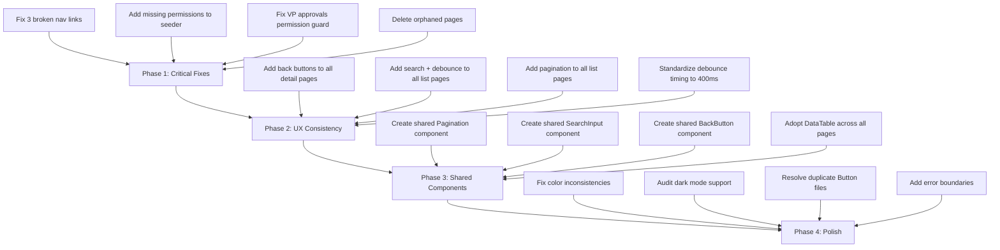

# Full Frontend & Backend Audit - Ogami ERP

## Executive Summary

This audit covers wiring issues, broken navigation, missing UX patterns, permission gaps, redundant pages, and UI inconsistencies across the Ogami ERP system. The findings are grouped into actionable categories with specific file references.

---

## 1. Broken Nav Links - Sidebar Points to Non-Existent Routes

These sidebar entries in `AppLayout.tsx` link to URLs that have **no matching route** in `router/index.tsx` and **no page component** exists:

| Sidebar Label | Broken href | Section | Line |
|---|---|---|---|
| Sales Pipeline | `/crm/opportunities` | CRM & Delivery | ~261 |
| Year-End Forecast | `/budget/forecast` | Budget & Assets | ~194 |
| Dept. Transfers | `/fixed-assets/transfers` | Budget & Assets | ~197 |

**Additionally**, these sidebar entries reference permissions that **do not exist** in `permissions.ts` or `RolePermissionSeeder.php`:
- `crm.opportunities.view`
- `budget.forecast`
- `fixed_assets.transfer`

### Action Items
- [ ] Remove or stub the 3 broken sidebar links until pages are built
- [ ] If features are planned, create placeholder pages with "Coming Soon" state
- [ ] Add missing permissions to `RolePermissionSeeder.php` and `permissions.ts` if features will be built

---

## 2. Detail/Form Pages Missing Back Button

The following detail and form pages lack a visible back/navigation button to return to the parent list:

| Page | File | Issue |
|---|---|---|
| Equipment Detail | `pages/maintenance/EquipmentDetailPage.tsx` | No back button to equipment list |
| Work Order Detail | `pages/maintenance/WorkOrderDetailPage.tsx` | No back button to work orders list |
| Fixed Asset Detail | `pages/fixed-assets/FixedAssetDetailPage.tsx` | Back button only shows on error state, not in normal view |
| Mold Detail | `pages/mold/MoldDetailPage.tsx` | No back arrow import, no back navigation |
| NCR Detail | `pages/qc/NcrDetailPage.tsx` | No back button |
| Inspection Detail | `pages/qc/InspectionDetailPage.tsx` | No back button |
| Journal Entry Detail | `pages/accounting/JournalEntryDetailPage.tsx` | No back button |
| AP Invoice Detail | `pages/accounting/APInvoiceDetailPage.tsx` | No back button |
| Customer Invoice Detail | `pages/ar/CustomerInvoiceDetailPage.tsx` | No back button |
| Team Employee Detail | `pages/team/TeamEmployeeDetailPage.tsx` | No back button |
| Loan Detail | `pages/hr/loans/LoanDetailPage.tsx` | No back button |
| Ticket Detail (CRM) | `pages/crm/TicketDetailPage.tsx` | No back button |
| Bank Reconciliation Detail | `pages/banking/BankReconciliationDetailPage.tsx` | No back button at top |
| Purchase Order Detail | `pages/procurement/PurchaseOrderDetailPage.tsx` | No back button |
| Goods Receipt Detail | `pages/procurement/GoodsReceiptDetailPage.tsx` | Uses navigate(-1) on cancel only |
| Delivery Receipt Detail | `pages/delivery/DeliveryReceiptDetailPage.tsx` | No back button |

### Action Items
- [ ] Add a consistent back button pattern using `PageHeader` icon prop with `ArrowLeft` across all detail pages
- [ ] Create a reusable `BackButton` component to standardize the pattern
- [ ] Ensure back button navigates to the correct parent list, not `navigate(-1)`

---

## 3. List Pages Missing Search Bar with Debounce

The following list pages have **no search functionality** at all:

| Page | File | Records Expected |
|---|---|---|
| Equipment List | `pages/maintenance/EquipmentListPage.tsx` | Equipment registry |
| Work Order List | `pages/maintenance/WorkOrderListPage.tsx` | Maintenance work orders |
| Delivery Receipt List | `pages/delivery/DeliveryReceiptListPage.tsx` | Delivery receipts |
| Shipments | `pages/delivery/ShipmentsPage.tsx` | Shipment records |
| Mold List | `pages/mold/MoldListPage.tsx` | Mold masters |
| BOM List | `pages/production/BomListPage.tsx` | Bill of materials |
| Production Order List | `pages/production/ProductionOrderListPage.tsx` | Production orders |
| Delivery Schedule List | `pages/production/DeliveryScheduleListPage.tsx` | Delivery schedules |
| NCR List | `pages/qc/NcrListPage.tsx` | Non-conformance reports |
| CAPA List | `pages/qc/CapaListPage.tsx` | Corrective actions |
| QC Template List | `pages/qc/QcTemplateListPage.tsx` | QC templates |
| Fixed Assets | `pages/fixed-assets/FixedAssetsPage.tsx` | Asset register |
| Stock Balance | `pages/inventory/StockBalancePage.tsx` | Stock positions |
| Item Master List | `pages/inventory/ItemMasterListPage.tsx` | Item master data |
| Material Requisition List | `pages/inventory/MaterialRequisitionListPage.tsx` | MRQs |
| Vendors | `pages/accounting/VendorsPage.tsx` | Vendor master |
| Customers | `pages/ar/CustomersPage.tsx` | Customer master |
| Blanket POs | `pages/procurement/BlanketPurchaseOrdersPage.tsx` | Blanket purchase orders |
| Cost Centers | `pages/budget/CostCentersPage.tsx` | Budget cost centers |

### Debounce Inconsistency
Pages that DO have search use **inconsistent debounce timings**:

| Timing | Pages |
|---|---|
| 250ms | UsersPage (target search) |
| 300ms | UsersPage (main), ClientOrdersPage |
| 350ms | VpApprovalsDashboardPage |
| 400ms | OvertimeListPage, LeaveListPage |
| 450ms | VendorItemsPage |
| 500ms | LeaveBalancesPage (employee search) |
| 600ms | AttendanceListPage, TeamAttendancePage, LeaveBalancesPage |

Additionally, `UsersPage` imports from `use-debounce` (external npm package) while all other pages use the project's own `@/hooks/useDebounce` hook. `ClientOrdersPage` defines its **own inline debounce hook** instead of using the shared one.

### Action Items
- [ ] Add search with debounce to all list pages above
- [ ] Standardize debounce timing to 400ms across all list pages
- [ ] Remove the inline debounce hook in `ClientOrdersPage` - use `@/hooks/useDebounce`
- [ ] Replace `use-debounce` external import in `UsersPage` with `@/hooks/useDebounce`
- [ ] Ensure search does NOT cause full page refresh - only update query params / refetch data

---

## 4. List Pages Missing Pagination

Cross-referencing the pagination search results against all list pages, these pages appear to **lack server-side pagination**:

| Page | File |
|---|---|
| Equipment List | `pages/maintenance/EquipmentListPage.tsx` |
| Work Order List | `pages/maintenance/WorkOrderListPage.tsx` |
| Delivery Receipt List | `pages/delivery/DeliveryReceiptListPage.tsx` |
| Shipments | `pages/delivery/ShipmentsPage.tsx` |
| Mold List | `pages/mold/MoldListPage.tsx` |
| BOM List | `pages/production/BomListPage.tsx` |
| Production Order List | `pages/production/ProductionOrderListPage.tsx` |
| Delivery Schedule List | `pages/production/DeliveryScheduleListPage.tsx` |
| Combined Delivery Schedule List | `pages/production/CombinedDeliveryScheduleListPage.tsx` |
| NCR List | `pages/qc/NcrListPage.tsx` |
| CAPA List | `pages/qc/CapaListPage.tsx` |
| QC Template List | `pages/qc/QcTemplateListPage.tsx` |
| Fixed Assets | `pages/fixed-assets/FixedAssetsPage.tsx` |
| Vendors | `pages/accounting/VendorsPage.tsx` |
| Customers | `pages/ar/CustomersPage.tsx` |
| Customer Invoices | `pages/ar/CustomerInvoicesPage.tsx` |
| AP Invoices | `pages/accounting/APInvoicesPage.tsx` |
| Blanket POs | `pages/procurement/BlanketPurchaseOrdersPage.tsx` |
| Vendor RFQ List | `pages/procurement/VendorRfqListPage.tsx` |
| Cost Centers | `pages/budget/CostCentersPage.tsx` |
| Dept Budgets | `pages/budget/DepartmentBudgetsPage.tsx` |
| Recurring Templates | `pages/accounting/RecurringTemplatesPage.tsx` |
| Vendor Credit Notes | `pages/accounting/VendorCreditNotesPage.tsx` |
| Customer Credit Notes | `pages/ar/CustomerCreditNotesPage.tsx` |
| Quotation List | `pages/sales/QuotationListPage.tsx` |
| Sales Order List | `pages/sales/SalesOrderListPage.tsx` |

### Action Items
- [ ] Add server-side pagination to all backend API endpoints that return lists
- [ ] Add `Pagination` component to all list pages (extract the reusable one from `VpApprovalsDashboardPage`)
- [ ] Create a shared `Pagination` component in `components/ui/` instead of defining it inline
- [ ] Ensure backend controllers accept `page` and `per_page` query parameters and return `meta` object

---

## 5. Redundant / Orphaned Pages

| Page | File | Issue |
|---|---|---|
| Executive Leave Approval | `pages/executive/ExecutiveLeaveApprovalPage.tsx` | Route redirects to `/approvals/pending` - page is dead code |
| Executive Overtime Approval | `pages/executive/ExecutiveOvertimeApprovalPage.tsx` | Route redirects to `/approvals/pending` - page is dead code |
| Attendance Summary | `pages/hr/attendance/AttendanceSummaryPage.tsx` | File exists but no route in router |
| Attendance Dashboard vs Summary | Both exist in `pages/hr/attendance/` | Potentially overlapping functionality |

### Action Items
- [ ] Delete `ExecutiveLeaveApprovalPage.tsx` and `ExecutiveOvertimeApprovalPage.tsx` - fully replaced by `VpApprovalsDashboardPage`
- [ ] Remove `AttendanceSummaryPage.tsx` or wire it to a route if needed
- [ ] Audit for any other orphaned page files not referenced in the router

---

## 6. Permission & Role Access Gaps

### 6a. Missing Permissions in Frontend Constants
These permissions are used in sidebar/router but not defined in `permissions.ts`:

| Permission | Used In |
|---|---|
| `crm.opportunities.view` | Sidebar CRM section |
| `budget.forecast` | Sidebar Budget section |
| `fixed_assets.transfer` | Sidebar Fixed Assets section |
| `fixed_assets.manage` | Used in `FixedAssetDetailPage` |
| `delivery.routes.view` | Router for delivery routes |
| `inventory.transfers.manage` | Router for stock transfers |
| `sales.quotations.view` | Router for quotations |
| `sales.orders.view` | Router for sales orders |
| `ar.dunning.view` | Router for dunning notices |
| `ap.payment_batches.view` | Router for payment batches |
| `inventory.items.delete` | Used in `ItemMasterListPage` |

### 6b. VP Approvals Permission Issue
The `/approvals/pending` route is guarded by `loans.vp_approve` but the page serves as a hub for PR approvals, MRQ approvals, payroll approvals, and leave approvals - not just loans. Users who need to approve PRs but not loans would be blocked.

### 6c. Client Portal Missing Permission Guards
In the client portal routes, several child routes lack permission guards:
- `/client-portal` (index) - no guard
- `/client-portal/shop` - no guard
- `/client-portal/orders` - no guard
- `/client-portal/orders/:ulid` - no guard

### Action Items
- [ ] Add all missing permissions to `permissions.ts` and `RolePermissionSeeder.php`
- [ ] Change VP Approvals route guard to use OR logic: `loans.vp_approve|procurement.purchase-request.view`
- [ ] Add permission guards to client portal routes or document that they are intentionally open
- [ ] Audit all roles to verify key responsibilities have matching permissions

---

## 7. Forms Using Manual Text Input Instead of Dropdowns

### Forms That Could Benefit from Dropdowns/Select
| Form | Field | Current | Suggested |
|---|---|---|---|
| Create Equipment | `category` | Free text input | Dropdown of equipment categories |
| Create Work Order | `assigned_to` | Free text / ID | Employee search dropdown |
| Create Equipment | `location` | Free text | Warehouse locations dropdown |
| AP Invoice Form | `vendor` selection | Needs verification | Searchable vendor dropdown |
| Create Delivery Receipt | `customer` | Needs verification | Searchable customer dropdown |
| Create NCR | Various fields | Needs verification | Reference data dropdowns |
| Create Inspection | Various fields | Needs verification | Reference data dropdowns |

### Action Items
- [ ] Audit all create/edit forms for fields that should use dropdowns
- [ ] Implement searchable select/combobox for entity references (vendors, customers, employees, items)
- [ ] Use server-side search for large datasets (employees, items) to avoid loading all records

---

## 8. UI/UX Inconsistencies

### 8a. Color Inconsistencies
- `WorkOrderDetailPage` uses semantic colors (`bg-amber-50 text-amber-700`, `bg-red-50 text-red-700`) for priority badges while the rest of the system uses neutral-only palette
- The system theme is predominantly neutral gray, but some pages still have colored status badges that break the design language

### 8b. Modal Patterns
- Some modals use custom `fixed inset-0 z-50` divs (e.g., `ItemCategoriesModal`, `DuplicateConfirmModal`)
- Others use the `Sheet` component from `components/ui/sheet`
- `ConfirmDialog` and `ConfirmDestructiveDialog` exist as shared components but aren't always used

### 8c. Dark Mode Support
- `AppLayout.tsx` uses proper `dark:` variants throughout the sidebar
- Individual pages need verification that all elements properly support dark mode

### 8d. Table Styling
- No shared `DataTable` pattern is consistently used - `components/ui/DataTable.tsx` exists but many pages implement their own table markup
- Inconsistent table header styling across pages

### 8e. Button Styling
- Mix of inline className strings and no shared button variants
- `components/ui/Button.tsx` and `components/ui/button.tsx` BOTH exist (case difference) - potential confusion

### Action Items
- [ ] Standardize status badge colors to use neutral palette consistently, or define a clear color system
- [ ] Migrate all custom modals to use shared `Dialog` component from `components/ui/dialog.tsx`
- [ ] Audit all pages for dark mode support
- [ ] Adopt `DataTable` component across all list pages for consistent table rendering
- [ ] Resolve the duplicate `Button.tsx` / `button.tsx` component files
- [ ] Create a button variant system (primary, secondary, destructive, ghost)

---

## 9. API Call Issues

### 9a. Pages That Likely Fire Failed API Calls
- Any page behind a sidebar link pointing to `/crm/opportunities`, `/budget/forecast`, `/fixed-assets/transfers` will 404
- Pages referencing permissions that don't exist in the seeder may cause 403 redirects

### 9b. Search Triggering Page Refresh
- Pages using URL search params (`useSearchParams`) for search state may cause unnecessary re-renders
- Ensure search input state is local with debounce, only updating query params after debounce settles

### Action Items
- [ ] Test all list page loads for failed API calls on mount
- [ ] Ensure search inputs use local state with debounce before triggering API calls
- [ ] Add error boundaries around data-fetching pages to gracefully handle API failures

---

## 10. Production-Grade Improvements

### 10a. Missing Shared Components
- [ ] Create a reusable `ListPage` wrapper: PageHeader + search + filters + DataTable + Pagination
- [ ] Create a reusable `DetailPage` wrapper: back button + PageHeader + content sections
- [ ] Create a shared `SearchInput` component with built-in debounce
- [ ] Create a shared `Pagination` component extracted to `components/ui/`
- [ ] Create a `BackButton` component for consistent back navigation

### 10b. Performance
- [ ] Add `keepPreviousData` to all paginated TanStack Query hooks to prevent flash of empty state
- [ ] Add optimistic updates for approval/rejection actions
- [ ] Implement proper loading skeletons matching actual content layout (not generic `SkeletonLoader rows={6}`)

### 10c. Error Handling
- [ ] Add error boundaries around each route segment
- [ ] Show meaningful empty states with action prompts (not just "No data found")
- [ ] Handle 403/404 at page level with contextual messages

### 10d. Accessibility
- [ ] Audit all interactive elements for keyboard navigation
- [ ] Add proper `aria-label` attributes to icon-only buttons
- [ ] Ensure all form fields have associated labels

---

## Implementation Priority

### Phase 1 - Critical Fixes (Blocking Issues)
- [ ] Fix 3 broken sidebar nav links (remove or add placeholder pages)
- [ ] Add 11+ missing permissions to `RolePermissionSeeder.php` and `permissions.ts`
- [ ] Fix VP Approvals route guard to be inclusive of all approval types
- [ ] Delete 2-3 orphaned/redundant page files
- [ ] Add permission guards to unguarded client portal routes

### Phase 2 - UX Consistency (User-Facing Quality)
- [ ] Add back buttons to ~16 detail pages missing them
- [ ] Add search with debounce to ~19 list pages missing search
- [ ] Add pagination to ~26 list pages missing it
- [ ] Standardize debounce timing (400ms) and imports across all pages
- [ ] Replace manual text inputs with dropdowns where reference data exists

### Phase 3 - Shared Components (Developer Productivity)
- [ ] Create shared `Pagination` component in `components/ui/`
- [ ] Create shared `SearchInput` component with built-in debounce
- [ ] Create shared `BackButton` component
- [ ] Migrate custom modals to shared `Dialog` component
- [ ] Adopt `DataTable` component for all list pages

### Phase 4 - Polish (Production Grade)
- [ ] Standardize color palette and status badge design
- [ ] Full dark mode audit
- [ ] Resolve duplicate Button component files
- [ ] Add error boundaries and meaningful empty states
- [ ] Add `keepPreviousData` to paginated queries
- [ ] Accessibility audit (keyboard nav, aria labels)
