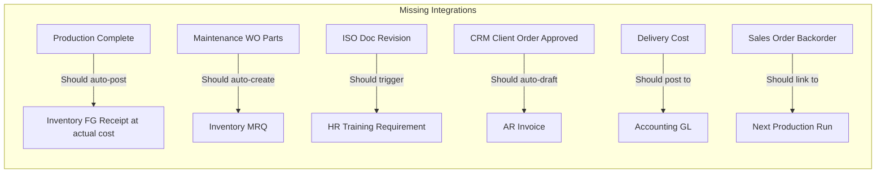

# Ogami ERP -- Full System Audit & Thesis-Grade Improvement Plan

## Audit Scope

Analyzed all 22 domain modules, 80+ controllers, 60+ services, 58 frontend hooks, 25 Zod schemas, 26 TypeScript type files, 30+ frontend page directories, architecture tests, integration tests, feature tests, and cross-module workflows.

---

## Section 1: Critical Gaps (Must Fix for Thesis Defense)

### 1.1 Route Ordering Bugs (Pattern Problem)

**Risk: HIGH** -- Multiple routes have parameterized paths before literal paths, causing 404s.

| Route File | Problem | Impact |
|------------|---------|--------|
| ~~`crm.php`~~ | ~~`/{lead:ulid}` before `/scores`~~ | **FIXED in PR #27** |
| ~~`fixed_assets.php`~~ | ~~`{fixedAsset}` before `transfers/`~~ | **FIXED in PR #27** |
| `procurement.php` | `{purchaseRequest}` may catch literal paths if new sub-routes added | Latent risk |

**Recommendation**: Audit ALL route files and enforce a convention -- literal routes always before parameterized routes. Add a custom Arch test to validate this.

### 1.2 Missing Frontend Pages for Backend Features

Several backend services have NO corresponding frontend page. A thesis panelist clicking through the UI would hit dead ends.

| Backend Feature | Backend Exists | Frontend Page | Gap |
|----------------|---------------|---------------|-----|
| Sales margin analysis | `ProfitMarginService` | None | **No UI to view margins** |
| BOM cost breakdown | `GET /boms/{id}/cost-breakdown` | None (only rollup button) | **No cost detail view** |
| Loan early payoff | `LoanPayoffService` | None | **No UI** |
| Asset revaluation | `AssetRevaluationService` | None | **No UI** |
| Budget amendments | `BudgetAmendmentService` | None | **No UI** |
| Dunning notices | `DunningService` | None | **No UI to view dunning** |
| SPC charts | `SpcService` | None | **No charts** |
| Leave conflict detection | `LeaveConflictDetectionService` | Partial | Only backend check |

**Recommendation**: Create frontend pages for at least the top 5 (margin analysis, BOM cost breakdown, loan payoff, budget amendments, dunning notices).

### 1.3 Test Coverage Gaps

| Domain | Feature Tests | Integration Tests | Gap |
|--------|--------------|-------------------|-----|
| Sales | **0 tests** | 0 | Complete blind spot |
| ISO | **0 tests** | 0 | No test coverage |
| Loan | **0 dedicated** | 0 | Only enhancement test |
| Leave | **0 dedicated** | LeaveAttendancePayroll | Workflow untested |
| Delivery | 1 test | ClientOrderToDelivery | Minimal |
| HR | 2 tests | 0 | Onboarding only |
| Fixed Assets | 1 test | 0 | Basic only |
| Attendance | 1 test | 0 | Basic only |
| Production | 1 test | ProductionToInventory | Material consumption only |

**Recommendation**: Add at minimum Feature tests for Sales, ISO, and Loan -- these are complete blind spots.

---

## Section 2: Architectural Risks

### 2.1 Inline Route Closures vs. Controllers

~35% of routes use inline closures instead of dedicated controllers. This violates the architecture principle and **will fail ARCH-001** if closures contain DB calls.

```
Routes with inline closures:
- routes/api/v1/budget.php (8 closures)
- routes/api/v1/inventory.php (7 closures)
- routes/api/v1/production.php (5 closures)
- routes/api/v1/fixed_assets.php (4 closures)
- routes/api/v1/crm.php (4 closures)
- routes/api/v1/enhancements.php (unknown)
```

**Risk**: These closures contain direct `DB::table()` calls, which violates ARCH-001. The arch test currently only checks `App\Http\Controllers` namespace -- closures in route files bypass this check.

**Recommendation**: Extract inline route closures to proper Controller methods. Priority: budget.php and inventory.php (most closures with DB calls).

### 2.2 Missing Model Relationships

Several models are missing relationships that the frontend expects:

| Model | Missing Relationship | Frontend Expects |
|-------|---------------------|-----------------|
| `AssetTransfer` | `fixedAsset()`, `fromDepartment()`, `toDepartment()` | `t.fixedAsset?.asset_code` |
| `GoodsReceipt` | `hasUnlinkedItems()` -- method exists but fragile | Used in resource |

**Recommendation**: Add the missing relationships to `AssetTransfer` model. Add null-safe access patterns consistently.

### 2.3 Inconsistent Error Handling

Some services throw `DomainException`, others throw raw `\Exception`, and some silently return null. For a thesis-grade system, error handling should be consistent:

**Current pattern**:
- Payroll pipeline: Excellent -- custom exceptions with error codes
- Budget services: No try-catch, raw DB query failures bubble up as 500
- Enhancement services: Mixed -- some log warnings, some throw

**Recommendation**: Wrap all service methods that query DB in try-catch, log errors, and throw `DomainException` with appropriate error codes.

---

## Section 3: Missing Standard ERP Patterns

### 3.1 Document Generation (PDF/Excel)

A real ERP must generate printable documents. Currently missing:

| Document | Module | Priority |
|----------|--------|----------|
| Payslip PDF | Payroll | Critical |
| Purchase Order PDF | Procurement | Critical |
| Sales Invoice PDF | AR | Critical |
| Delivery Receipt PDF | Delivery | High |
| BIR Form PDFs (2316, 1601C) | Tax | High |
| Quotation PDF | Sales | Medium |
| Customer Statement | AR | Medium |
| GR Receiving Report | Procurement | Low |

**Recommendation**: Use `barryvdh/laravel-dompdf` or `spatie/laravel-pdf` to generate PDFs from Blade templates. Start with Payslip, PO, and Invoice.

### 3.2 Notification System

The system has notification infrastructure but limited actual notifications:

| Event | Should Notify | Currently Notifies |
|-------|--------------|-------------------|
| PR approved/rejected | Requester | Unknown |
| Leave approved/rejected | Employee | Unknown |
| PO acknowledged by vendor | Purchasing | Unknown |
| Invoice overdue | Customer (dunning) | Dunning batch only |
| Low stock alert | Warehouse manager | Event fired, no notification |
| Production order completed | Sales/planning | Event fired, no notification |
| Payroll run status change | Each approver in chain | Unknown |

**Recommendation**: Implement notification listeners for at least PR, Leave, and Payroll approval chain events. Use Laravel's `Notification` with database + email channels.

### 3.3 Audit Trail Dashboard

The system uses `owen-it/auditing` for audit trails, but there's no UI to view them:

- No audit log viewer page
- No ability to see "who changed what, when" for any record
- No compliance-ready audit export

**Recommendation**: Create a generic AuditLogPage that can filter by model type, user, and date range. Essential for ISO compliance and thesis defense.

### 3.4 Data Import/Export

Current state:
- Attendance CSV import exists
- Vendor items CSV import exists
- Depreciation CSV export exists
- **No general data export capability**

Missing:
- Employee master export (Excel/CSV)
- Chart of accounts export
- Inventory item master export
- GL trial balance export
- Any bulk import for master data setup

**Recommendation**: Add a generic export service that generates CSV/Excel for any paginated resource. At minimum: employees, items, COA, GL.

---

## Section 4: Frontend Completeness Gaps

### 4.1 Missing Zod Schemas (Validation Gaps)

Frontend has 25 Zod schemas but several domains lack client-side validation:

| Domain | Has Schema | Impact |
|--------|-----------|--------|
| Sales (quotations, SO) | No `sales.ts` schema for forms | No client validation |
| Delivery | No schema | No client validation |
| Mold | No schema | No client validation |
| Dashboard | N/A | N/A |

**Recommendation**: Add Zod schemas for Sales and Delivery form pages.

### 4.2 Missing TypeScript Types

All 26 domains have type files. But some are likely incomplete based on recent enhancements.

**Recommendation**: Verify that `production.ts` types include `standard_cost_centavos`, `estimated_total_cost_centavos` on `ProductionOrder` type. Verify `BillOfMaterials` type includes cost fields.

### 4.3 Frontend Error Boundaries

Currently only a top-level `RenderErrorBoundary` exists. Individual module pages have no error boundaries -- a single failed API call crashes the entire view.

**Recommendation**: Add per-page error boundaries or use TanStack Query's `useErrorBoundary: false` pattern consistently.

---

## Section 5: Security & Compliance Gaps

### 5.1 API Rate Limiting Inconsistencies

Some write endpoints have `throttle:api-action`, others don't:

- Budget department update: Has throttle
- Budget variance query: No throttle
- CRM dashboard: No throttle (expensive DB query)
- Inventory analytics endpoints: No throttle (heavy aggregations)

**Recommendation**: Apply rate limiting to all aggregation/report endpoints.

### 5.2 Missing CSRF / SoD Checks

SoD is well-implemented for Payroll, Leave, Procurement, and Loans. But:

| Module | SoD Status |
|--------|-----------|
| Fixed Assets (transfers) | No SoD -- requester can approve own transfer |
| Budget amendments | SoD exists in service |
| ISO document approval | No explicit SoD |
| Sales Order confirmation | No SoD -- creator can confirm |

**Recommendation**: Add SoD check to Asset Transfer approval and Sales Order confirmation.

### 5.3 Government ID Exposure Risk

The vendor portal `orderDetail` returns raw model JSON (per AGENTS.md warning). If `Vendor` model has sensitive fields in `$fillable`, they could be exposed.

**Recommendation**: Audit all vendor portal responses. Use dedicated VendorPortalResource that explicitly whitelists fields.

---

## Section 6: Cross-Module Integration Gaps



### Priority Integration Fixes:

1. **Production -> Inventory COGS**: When production completes, finished goods should be received at actual cost, not just standard price
2. **Maintenance -> Inventory**: WO spare parts should auto-create MRQ for inventory deduction
3. **CRM -> AR**: Approved client order with delivery should auto-draft AR invoice
4. **Sales -> Production backorder**: Unfulfilled SO lines should create backorder queue linked to production

---

## Section 7: Prioritized Improvement Roadmap

### Tier 1: Critical for Thesis Defense

| # | Item | Module | Type |
|---|------|--------|------|
| 1 | Frontend pages for margin analysis, BOM cost breakdown | Sales, Production | New UI |
| 2 | Feature tests for Sales, ISO, Loan modules | Testing | Tests |
| 3 | PDF generation: Payslip, PO, Invoice | Payroll, Procurement, AR | New Feature |
| 4 | Audit log viewer page | System | New UI |
| 5 | SoD check on Asset Transfer and SO confirmation | Fixed Assets, Sales | Security |
| 6 | Add missing AssetTransfer model relationships | Fixed Assets | Bug Fix |
| 7 | Extract inline route closures to controllers | Multiple | Refactor |

### Tier 2: Production-Grade Enhancements

| # | Item | Module | Type |
|---|------|--------|------|
| 8 | Notification system for approval workflows | Cross-module | New Feature |
| 9 | Generic data export service (CSV/Excel) | System | New Feature |
| 10 | Budget amendment frontend page | Budget | New UI |
| 11 | Dunning notices frontend page | AR | New UI |
| 12 | Leave conflict detection UI | Leave | New UI |
| 13 | Payslip generation for employees | Payroll | New Feature |
| 14 | Customer statement PDF | AR | New Feature |

### Tier 3: Polish & Completeness

| # | Item | Module | Type |
|---|------|--------|------|
| 15 | Zod schemas for Sales, Delivery forms | Frontend | Validation |
| 16 | Per-page error boundaries | Frontend | UX |
| 17 | Rate limiting on report endpoints | Security | Security |
| 18 | Frontend types update for new cost fields | Frontend | Types |
| 19 | Missing integration: Production -> Inventory COGS | Cross-module | Integration |
| 20 | Loan eligibility computation | Loan | Business Logic |
| 21 | BOM effectivity dates and ECO workflow | Production | Business Logic |
| 22 | Vendor contract management | Procurement | New Feature |
| 23 | Employee disciplinary tracking | HR | New Feature |
| 24 | Risk register for ISO | ISO | New Feature |

---

## Section 8: Architecture Quality Scorecard

| Dimension | Score | Notes |
|-----------|-------|-------|
| Domain separation | 9/10 | 22 well-isolated modules |
| API consistency | 8/10 | Standard response format, but inline closures break pattern |
| State machines | 9/10 | All workflows have proper state transitions with CHECK constraints |
| Authorization | 8/10 | SoD on most modules, gaps in Fixed Assets and Sales |
| Testing | 5/10 | Good integration tests, but 3+ modules have zero feature tests |
| Frontend completeness | 7/10 | All modules have pages, but enhancement features lack UI |
| Documentation | 8/10 | MODULES.md, CLAUDE.md, AGENTS.md are thorough |
| Error handling | 6/10 | Inconsistent -- some services fail silently, others crash with 500 |
| Security | 7/10 | Session auth, encryption, SoD -- but vendor portal exposure risk |
| PH compliance | 9/10 | SSS, PhilHealth, Pag-IBIG, BIR forms, TRAIN law |

**Overall: 76/100 -- Good thesis-grade foundation, needs Tier 1 items for defense-ready status.**

---

## Section 9: Thesis Defense Preparation Checklist

- [ ] Can demonstrate full Order-to-Cash flow (Client Order -> Production -> QC -> Delivery -> AR Invoice -> Payment)
- [ ] Can demonstrate full Purchase-to-Pay flow (PR -> Budget Check -> PO -> GR -> AP Invoice -> Payment)
- [ ] Can demonstrate Payroll computation with all 17 steps visible
- [ ] Can show BOM cost calculation with material + labor + overhead breakdown
- [ ] Can show profit margin analysis on a quotation
- [ ] Can show budget vs. actual variance report
- [ ] Can demonstrate SoD by having 2 users try to approve the same record
- [ ] Can show audit trail for a critical record change
- [ ] Can generate at least one PDF document (payslip, PO, or invoice)
- [ ] Can show role-based access control with at least 3 different role views
- [ ] All pages load without 500/404 errors
- [ ] Mobile-responsive or at minimum does not break on tablet view
