# Ogami ERP -- Module-by-Module Functional Gap Analysis & Enhancement Plan

## Purpose
Audit every module against **real-world ERP standards** and identify where the module name promises functionality that the code does not deliver. Each section grades the module, names the gap, and prescribes the fix.

---

## Grading Legend

| Grade | Meaning |
|-------|---------|
| **A** | Feature-complete for thesis -- minor polish only |
| **B** | Core workflow works, but missing 1-2 standard ERP features |
| **C** | Scaffolded with models/CRUD, but key business logic absent |
| **D** | Name exists but functionality is a stub or fundamentally misaligned |

---

## 1. Production -- Grade B

### 1.1 BOM -- Bill of Materials
**Name vs Reality:** The BOM module stores components and quantities, has cost rollup via `BomService.rollupCost()`, and `CostingService` computes standard/actual cost variance. This is better than the user feared -- **cost calculation exists**. However:

**Gaps:**
- **Multi-level BOM explosion is incomplete.** `BomComponent` has `parent_bom_component_id` for nesting, but `BomService.rollupCost()` only does single-level summation -- it never recurses into sub-assemblies.
- **No BOM versioning workflow.** Versions are just a string field. Real ERPs have Engineering Change Order/Notice flows where a new BOM version must be approved before becoming active.
- **Routing cost not included in BOM cost.** `Routing` and `WorkCenter` models exist with `hourly_rate_centavos` and `setup_time_hours`, but `CostingService.standardCost()` only sums material cost -- it ignores labor/overhead from routings.
- **No BOM where-used report.** Given a raw material, show all finished goods that use it.

**Enhancements:**
1. Implement recursive multi-level BOM explosion in `BomService.rollupCost()` using `parent_bom_component_id`
2. Add routing-based labor + overhead cost to `CostingService.standardCost()`: `SUM(setup_time + run_time * qty) * work_center.hourly_rate`
3. Add `whereUsed(itemId)` method to `BomService` -- reverse BOM lookup
4. Add Engineering Change Order model with draft/review/approved states for BOM version control

### 1.2 MRP -- Material Requirements Planning
**Name vs Reality:** `MrpService.explode()` does single-level MRP explosion and `suggestPurchases()` recommends PRs. This is functional but basic.

**Gaps:**
- **No time-phasing.** Real MRP considers lead times to determine *when* to order, not just *how much*. Current implementation only calculates total shortage.
- **No planned order releases.** MRP should generate planned production orders for sub-assemblies, not just purchase suggestions for raw materials.
- **No capacity planning (CRP).** Work Centers have `capacity_hours_per_day` but no service uses it to check if production schedule is feasible.

**Enhancements:**
1. Add lead time fields to `ItemMaster` and offset requirement dates by lead time
2. Generate planned production orders for semi-finished items, not just purchase suggestions
3. Create `CapacityPlanningService` that checks work center capacity against scheduled production orders

### 1.3 Production Orders
**Name vs Reality:** Full workflow exists -- draft/scheduled/in_progress/completed with output logging, stock reservation, MRQ auto-creation, and GL cost posting. **This is well-built.**

**Gaps:**
- **No production scheduling/sequencing.** Orders exist independently with no prioritization or machine scheduling.
- **No yield/scrap tracking per operation.** Output logs capture total qty but not per-routing-step yield.

**Enhancements:**
1. Add `priority` and `scheduled_start/end` fields for basic finite scheduling
2. Add per-operation output logging linked to `Routing` steps

---

## 2. Inventory -- Grade B+

**Name vs Reality:** Comprehensive module with stock ledger, lot/batch tracking, physical counts, material requisitions, warehouse locations, ABC analysis, valuation reports, and low-stock alerts.

**Gaps:**
- **Costing method declared but not enforced.** `ItemMaster.costing_method` supports `standard|fifo|weighted_average` but `StockService` always uses `standard_price` -- FIFO and weighted average are never computed.
- **No bin/zone management.** `WarehouseLocation` is flat -- no zone/aisle/rack/bin hierarchy for pick path optimization.
- **No stock transfer between warehouses with in-transit tracking.** Transfer exists as an adjustment, not as a proper two-step transfer with in-transit state.
- **Physical count has no cycle count scheduling.** Counts are ad-hoc; real ERPs schedule them by ABC class.

**Enhancements:**
1. Implement FIFO costing: track cost per lot, issue oldest lots first, compute COGS from actual lot costs
2. Implement weighted average costing: recalculate average unit cost on every receipt
3. Add zone/aisle/rack/bin hierarchy to `WarehouseLocation` for pick optimization
4. Add two-step stock transfer: source warehouse issues -> in-transit -> destination receives
5. Add cycle count scheduling: auto-generate physical counts -- A items monthly, B quarterly, C annually

---

## 3. Sales -- Grade C+

**Name vs Reality:** Has Quotation, Sales Order, and Pricing Engine. Quotation-to-SO conversion works. Pricing resolves customer-specific/default/volume tiers.

**Gaps:**
- **No Sales Order to Delivery Receipt link.** SO confirmed but no mechanism to trigger a Delivery Receipt or Production Order from it. The CRM `ClientOrder` handles this flow instead, creating two parallel order paths.
- **No discount management.** `PricingService` handles price lists but has no concept of line-level discounts, trade discounts, or promotional pricing.
- **No credit limit check.** Sales Orders created without checking if the customer has exceeded their credit limit -- standard in every real ERP.
- **No Sales Order fulfillment tracking.** No visibility into which SO lines have been delivered vs pending.
- **Missing connection to AR.** Sales Orders don't flow into AR Invoices.
- **Sales module vs CRM module overlap.** Both handle "orders" but differently -- `SalesOrder` and `ClientOrder` are parallel concepts that should be unified or clearly delineated.

**Enhancements:**
1. Add customer credit limit field to `Customer` model; enforce on SO creation
2. Add `fulfilled_qty` to `SalesOrderItem` and track partial fulfillment
3. Create SO -> DR -> AR Invoice flow to complement the CRM client order flow
4. Add line-level discount support: `discount_pct`, `discount_amount_centavos`
5. Clarify Sales vs CRM: Sales is for direct B2B orders; CRM ClientOrder is for portal/negotiated orders. Document this distinction clearly and add cross-references.

---

## 4. CRM -- Grade B

**Name vs Reality:** Has Lead management, Opportunity pipeline, Client Orders with negotiation rounds, Support Tickets, Sales Analytics. Good feature set.

**Gaps:**
- **Lead scoring is absent.** Leads have status but no scoring model to prioritize them.
- **Opportunity weighted pipeline value not calculated.** `expected_value_centavos * probability_pct / 100` is never computed as weighted value in analytics.
- **No SLA enforcement on tickets.** `Ticket` has no SLA deadline fields or escalation rules.
- **No email integration.** CRM activities are manual entries -- no email send/receive tracking.
- **Opportunity to Quotation link missing.** Opportunities should convert to Sales Quotations, but there is no automated conversion.

**Enhancements:**
1. Add lead scoring: assign points based on source, company size, engagement; auto-qualify above threshold
2. Add weighted pipeline value to `SalesAnalyticsService.pipelineFunnel()`
3. Add SLA fields to `Ticket`: `sla_deadline`, `escalated_at`, `breached` -- auto-escalate on deadline
4. Add `Opportunity -> Quotation` conversion method in `OpportunityService`

---

## 5. Accounting -- Grade A-

**Name vs Reality:** Full GL, JE workflow, bank reconciliation, financial statements (Balance Sheet, Income Statement, Trial Balance, Cash Flow), year-end closing, recurring journal templates, and fiscal period management.

**Gaps:**
- **No multi-company/entity support.** Single company assumption throughout.
- **No intercompany transactions.**
- **Bank reconciliation auto-matching is basic.** Matching is manual -- real systems use rules to auto-match by amount/reference.
- **No aging analysis in accounting.** AR/AP aging exists in their respective modules, but accounting has no consolidated aging report.

**Enhancements:**
1. Add auto-matching rules to `BankReconciliationService`: match by exact amount + date range + reference pattern
2. Add consolidated aging report combining AR + AP data
3. Add financial ratio calculations: current ratio, quick ratio, debt-to-equity, ROE

---

## 6. AP -- Accounts Payable -- Grade A-

**Name vs Reality:** Full vendor management, invoice workflow with 3-way match, payment batches, credit notes, EWT handling, vendor fulfillment portal, auto-GL posting.

**Gaps:**
- **No payment terms management.** Net-30, Net-60, 2/10-Net-30 early payment discounts are not modeled.
- **No early payment discount tracking.** Standard ERP calculates discount available if paid within terms.
- **No vendor aging report by payment terms.**

**Enhancements:**
1. Add `payment_terms` field to `Vendor` and `VendorInvoice`: `net_30|net_60|cod|custom`
2. Add early payment discount calculation: if invoice has `2/10 Net 30`, show discount amount and deadline
3. Add payment scheduling: suggest which invoices to pay this week to capture discounts

---

## 7. AR -- Accounts Receivable -- Grade B+

**Name vs Reality:** Customer invoices, payments, credit notes, dunning notices, advance payments, aging analysis, payment allocation.

**Gaps:**
- **No customer credit limit enforcement.** `Customer` model lacks `credit_limit_centavos` field.
- **No statement of account generation.** Frontend page may exist but no service to compile all transactions for a period.
- **Dunning is basic.** `DunningLevel` and `DunningNotice` exist but no automated dunning run that batches all overdue customers.

**Enhancements:**
1. Add `credit_limit_centavos` and `current_balance_centavos` to `Customer`
2. Add `StatementOfAccountService` to generate per-customer transaction history
3. Add automated dunning run: batch-create dunning notices for all overdue customers at appropriate levels

---

## 8. Tax -- Grade B

**Name vs Reality:** BIR filing tracking, VAT ledger reconciliation, auto-population from AP/AR/Payroll, BIR form generation service.

**Gaps:**
- **No actual BIR form PDF generation.** `BirFormGeneratorService` exists but forms are tracking records, not printable BIR-format documents.
- **No alphalist generation.** BIR 2316/2307 alphalist requires per-employee/per-vendor detail aggregation.
- **No tax calendar with deadline alerts.** Filing deadlines are not tracked or alerted.

**Enhancements:**
1. Add BIR form PDF generation matching official BIR formats (1601C, 2550M, etc.)
2. Add alphalist generation service for 2316 (employees) and 2307 (vendors)
3. Add tax filing calendar with configurable deadline reminders

---

## 9. Procurement -- Grade A-

**Name vs Reality:** Full PR-to-PO-to-GR cycle, vendor RFQ with scoring, budget enforcement, SoD on approvals, state machines.

**Gaps:**
- **No blanket/framework agreements.** Real procurement has long-term contracts with agreed prices that POs draw against.
- **No PR consolidation.** Multiple PRs for the same item from different departments should be auto-consolidated into one PO.
- **Vendor scoring exists but no blacklisting/preferred list.** `VendorScoringService` scores vendors but results don't affect PO creation.

**Enhancements:**
1. Add blanket PO model: agreed quantities/prices over a period; individual POs release against it
2. Add PR consolidation: when creating PO, suggest merging PRs for the same vendor/item
3. Use vendor scores to auto-suggest preferred vendors and flag low-scoring ones

---

## 10. QC -- Quality Control -- Grade B+

**Name vs Reality:** Inspection templates, inspection execution, NCR with CAPA, quality analytics, SPC dashboard, supplier quality tracking.

**Gaps:**
- **SPC is dashboard-only.** No actual Statistical Process Control calculations (control charts, Cp/Cpk indices).
- **No incoming QC gate enforcement.** `ItemMaster.requires_iqc` flag exists but GR confirmation doesn't check if IQC inspection passed.
- **No QC hold/release workflow.** Failed inspections flag `failed_hold` but no formal hold-release process for stock.

**Enhancements:**
1. Implement SPC calculations: X-bar/R charts, Cp/Cpk process capability indices from inspection measurement data
2. Enforce IQC gate: GR confirmation blocked until linked inspection passes for `requires_iqc` items
3. Add QC hold status to stock: quarantine zone, hold-release approval workflow

---

## 11. Maintenance -- Grade B+

**Name vs Reality:** Equipment register, corrective/preventive work orders, PM schedules, spare parts tracking, MTBF/MTTR analytics, cost per equipment.

**Gaps:**
- **PM schedule doesn't auto-generate work orders.** `PmSchedule` model exists but no scheduled task creates WOs.
- **No equipment downtime tracking separate from repair time.** Total downtime includes waiting-for-parts time, not just repair.
- **OEE calculation incomplete.** `MaintenanceAnalyticsService` calculates availability but not performance or quality factors.

**Enhancements:**
1. Add artisan command/scheduler to auto-generate WOs from PM schedules
2. Track downtime phases: wait-for-assignment, wait-for-parts, active-repair, testing
3. Complete OEE: Availability (from downtime) x Performance (actual vs theoretical throughput) x Quality (good units / total units)

---

## 12. Mold -- Grade C+

**Name vs Reality:** Mold master with shot count tracking and analytics. Niche module for injection molding.

**Gaps:**
- **Shot count not automatically incremented from production output.** Must be manually updated.
- **No cavity efficiency tracking.** Cavity count exists but no comparison of theoretical vs actual units per shot.
- **No mold lifecycle cost tracking.** No aggregation of maintenance costs over the mold's lifetime.

**Enhancements:**
1. Auto-increment shot count when production output is logged for a mold-linked production order
2. Add cavity efficiency: `actual_units / (shots * cavity_count) * 100`
3. Add mold TCO report: acquisition cost + cumulative maintenance cost + refurbishment cost

---

## 13. Delivery -- Grade B

**Name vs Reality:** Delivery receipts, shipments, fleet/vehicle management, ImpEx documents, delivery routes.

**Gaps:**
- **No proof of delivery capture.** DR status changes to `delivered` but no signature/photo upload mechanism.
- **No delivery cost tracking.** Fleet trips have no fuel/distance/cost logging.
- **No route optimization or trip planning.** Routes are defined but not used for trip scheduling.
- **ImpEx documents are attachment-only.** No customs declaration data fields.

**Enhancements:**
1. Add proof of delivery: signature pad or photo upload on DR confirmation
2. Add trip cost tracking: fuel, distance, tolls per trip; aggregate per vehicle
3. Add trip planning: assign multiple DRs to a vehicle trip with sequence optimization

---

## 14. ISO -- Grade B-

**Name vs Reality:** Document control with versioning, internal audits, findings, improvement actions.

**Gaps:**
- **No document distribution acknowledgment tracking.** `DocumentDistribution` exists but no confirmation that recipients have read the document.
- **No CAPA effectiveness review.** Corrective actions close but no follow-up verification.
- **No management review meeting support.** ISO 9001 requires periodic management review with specific agenda items.
- **No training linkage.** ISO requires training records linked to document changes.

**Enhancements:**
1. Add read acknowledgment: require distributed users to confirm they have read the document
2. Add CAPA effectiveness review step: after closure, schedule a verification date
3. Add management review template: auto-aggregate QMS data for the review meeting
4. Link document revisions to HR Training module: when a procedure changes, auto-create training requirement

---

## 15. Fixed Assets -- Grade B

**Name vs Reality:** Asset register with auto-code generation, three depreciation methods, monthly auto-depreciation, disposal with gain/loss GL posting, asset transfers.

**Gaps:**
- **No asset revaluation.** Real ERPs allow revaluing assets (IAS 16 requirement).
- **No asset impairment testing.** Status `impaired` exists in DB but no impairment calculation service.
- **No asset tagging/barcode support.** Asset code exists but no barcode generation for physical verification.
- **No insurance tracking.** No link between assets and insurance policies.

**Enhancements:**
1. Add revaluation service: adjust carrying value, post revaluation surplus to equity
2. Add impairment test: compare carrying value to recoverable amount, post impairment loss
3. Add barcode/QR code generation from asset_code for physical inventory scans

---

## 16. Budget -- Grade B

**Name vs Reality:** Annual budgets by GL account and cost center, variance analysis, enforcement on PRs, forecast service.

**Gaps:**
- **No budget revision/amendment workflow.** Once approved, budget can't be formally amended mid-year.
- **No budget transfer between line items.** Real ERPs allow reallocating budget from one account to another.
- **No monthly/quarterly budget breakdown.** Budget is annual only -- no seasonal distribution.

**Enhancements:**
1. Add budget amendment model with approval workflow: request/approve/post amendment
2. Add budget transfer: move allocation between GL accounts within same cost center
3. Add monthly phasing: distribute annual budget across months (equal, seasonal, or custom pattern)

---

## 17. HR -- Grade B+

**Name vs Reality:** Employee master, departments, positions, salary grades, competency matrix, training tracking, employee clearance, onboarding checklist, org chart.

**Gaps:**
- **No performance appraisal/evaluation module.** Standard HR feature for thesis.
- **No employee self-service.** Employees can't view their own records, payslips, or file requests from a portal.
- **No separation/offboarding workflow.** Employee goes to `resigned`/`terminated` but no clearance checklist is enforced.
- **No 201 file completeness tracking.** Documents uploaded but no checklist validation.

**Enhancements:**
1. Add performance appraisal: rating forms, KPI tracking, appraisal cycle management
2. Add employee self-service portal: view payslips, leave balances, file leave/OT requests
3. Link `EmployeeClearance` to separation workflow: all clearance items must be signed before final pay
4. Add 201 file completeness: required document checklist per employment type

---

## 18. Payroll -- Grade A

**Name vs Reality:** 17-step pipeline, multi-level approval, golden test suite, government contribution tables, GL auto-posting. This is the most mature module.

**Gaps (minor):**
- **No 13th month pay computation.** Philippine labor law requires it; currently not in the pipeline.
- **No final pay computation.** Separation requires prorated salary + unused leave monetization + 13th month.
- **No payroll comparison report.** Compare two periods side-by-side for variance analysis.

**Enhancements:**
1. Add 13th month pay step or separate computation service
2. Add final pay computation linked to HR separation workflow
3. Add period-over-period comparison report

---

## 19. Attendance -- Grade B+

**Name vs Reality:** Attendance logs with biometric/CSV import, shift assignments, OT requests, anomaly detection, night differential calculation.

**Gaps:**
- **No real-time attendance dashboard.** No view of who is present/absent today.
- **No geofencing or mobile clock-in.** Biometric-only is limiting.
- **Timesheet approval is modeled but not fully wired.** `TimesheetApproval` model exists but no approval service.

**Enhancements:**
1. Add daily attendance dashboard: present/absent/late summary per department
2. Wire `TimesheetApproval` with full approval workflow for weekly/bi-weekly timesheets
3. Add tardiness summary report per employee per period

---

## 20. Leave -- Grade A-

**Name vs Reality:** Leave types, multi-level approval, balance tracking, accrual, calendar view, SIL monetization.

**Gaps:**
- **No leave conflict detection.** No warning when too many people from the same department are on leave.
- **No carry-over rules.** Leave balance doesn't enforce max carry-over from previous year.
- **No leave encashment at year-end.** `SilMonetizationService` exists for SIL but general VL monetization at year-end is not automated.

**Enhancements:**
1. Add conflict detection: warn/block if department would fall below minimum staffing
2. Add carry-over configuration per leave type: max carry-over days, expiry policy
3. Add year-end leave encashment batch process

---

## 21. Loan -- Grade B+

**Name vs Reality:** Loan applications, amortization schedules, multi-level approval, payroll deduction integration.

**Gaps:**
- **No loan balance dashboard.** Employee can't see remaining balance or amortization schedule.
- **No early payoff calculation.** No service to compute payoff amount with interest adjustment.
- **No loan restructuring.** Can't modify amortization schedule after approval.

**Enhancements:**
1. Add loan balance dashboard for employees and HR
2. Add early payoff calculation: remaining principal + accrued interest
3. Add loan restructuring: modify remaining amortization with new terms and approval

---

## 22. Dashboard -- Grade C

**Name vs Reality:** Single `DashboardKpiService` with supplementary KPIs. Basic.

**Gaps:**
- **No role-based dashboards.** All users see the same dashboard.
- **No configurable widgets.** Users can't choose which KPIs to display.
- **No trend visualization data.** KPIs are point-in-time, not time-series.

**Enhancements:**
1. Add role-based dashboard routing: executive sees financial overview, production manager sees OEE/yield, HR sees headcount
2. Add time-series data for key KPIs: revenue trend, production throughput trend, attendance trend
3. Add drill-down: click a KPI card to navigate to the relevant module's detail page

---

## Cross-Module Naming & Architecture Issues

### Issue 1: Sales vs CRM Overlap
Both `Sales` and `CRM` modules handle customer orders. `SalesOrder` and `ClientOrder` are parallel concepts.

**Fix:** Clearly define: `CRM.ClientOrder` = portal orders with negotiation; `Sales.SalesOrder` = internal/direct orders. Add explicit cross-references. Consider merging into a unified Order module, or create a `Sales.SalesOrder -> Production/Delivery` flow that mirrors the `CRM.ClientOrder -> Production/Delivery` flow.

### Issue 2: Delivery Module in Production vs Delivery Domain
`Production` has `DeliverySchedule` and `CombinedDeliverySchedule` models. `Delivery` domain has `DeliveryReceipt` and `Shipment`. These are related but in different domains.

**Fix:** Production should own "what to deliver and when" (schedule). Delivery should own "how it was delivered" (receipt, shipment, vehicle). Ensure a clear handoff: Production.DeliverySchedule -> Delivery.DeliveryReceipt creation.

### Issue 3: Customer Model in AR, Not CRM
`Customer` lives in `AR/Models/Customer.php` but is used heavily in CRM. This is an architectural smell.

**Fix:** Either move `Customer` to a shared location or create a `CRM.Customer` that extends/wraps the AR customer for CRM-specific fields (lead source, assigned rep, etc.).

---

## Implementation Priority Matrix

### Tier 1 -- Functional Completeness (Make each module do what its name says)

| # | Module | Enhancement | Impact |
|---|--------|-------------|--------|
| 1 | Production/BOM | Multi-level cost rollup including routing labor/overhead | High -- core thesis differentiator |
| 2 | Inventory | Implement FIFO and weighted average costing | High -- currently broken promise |
| 3 | Sales | Add credit limit check + SO fulfillment tracking | High -- basic ERP requirement |
| 4 | QC | Enforce IQC gate on GR confirmation | High -- quality control is meaningless without gate |
| 5 | Maintenance | Auto-generate WOs from PM schedules | High -- PM is non-functional without this |
| 6 | Mold | Auto-increment shot count from production output | Medium -- manual workaround exists |
| 7 | Dashboard | Role-based dashboards | Medium -- UX impact |

### Tier 2 -- ERP Standard Features (Make it thesis-grade)

| # | Module | Enhancement | Impact |
|---|--------|-------------|--------|
| 8 | Payroll | 13th month pay + final pay computation | High -- Philippine labor law |
| 9 | HR | Performance appraisal module | High -- expected in any HR system |
| 10 | Budget | Monthly phasing + budget amendments | Medium -- budget is too rigid |
| 11 | AR | Customer credit limit enforcement | Medium -- financial control |
| 12 | AP | Payment terms + early payment discounts | Medium -- real-world finance |
| 13 | Leave | Conflict detection + carry-over rules | Medium -- team management |
| 14 | CRM | Lead scoring + opportunity weighted pipeline | Medium -- CRM differentiator |
| 15 | ISO | Read acknowledgment + CAPA effectiveness review | Medium -- ISO 9001 compliance |

### Tier 3 -- Advanced Features (Real-world polish)

| # | Module | Enhancement | Impact |
|---|--------|-------------|--------|
| 16 | Production/MRP | Time-phased MRP with lead times | High complexity, high value |
| 17 | Production | Capacity planning against work centers | Medium |
| 18 | Inventory | Two-step warehouse transfer with in-transit | Medium |
| 19 | Tax | BIR form PDF generation + alphalist | Medium -- compliance value |
| 20 | Delivery | Proof of delivery + trip cost tracking | Medium |
| 21 | Fixed Assets | Revaluation + impairment testing | Lower priority |
| 22 | Loan | Early payoff + restructuring | Lower priority |

---

## Architecture Diagram: Current vs Enhanced Module Relationships

```mermaid
graph TB
    subgraph Enhanced_Flow_P2P[Purchase to Pay - Enhanced]
        BUD[Budget] -->|enforce| PR[Purchase Request]
        PR -->|consolidate| PO[Purchase Order]
        PO -->|blanket release| BPO[Blanket PO]
        PO -->|vendor delivers| GR[Goods Receipt]
        GR -->|IQC gate| QC_IN[QC Incoming]
        QC_IN -->|pass| STOCK[Inventory Stock]
        QC_IN -->|fail| NCR[NCR + Return]
        GR -->|auto-draft| API[AP Invoice]
        API -->|3-way match| PAY[AP Payment]
        PAY -->|auto-post| GL[General Ledger]
    end

    subgraph Enhanced_Flow_O2C[Order to Cash - Enhanced]
        LEAD[CRM Lead] -->|score + qualify| OPP[CRM Opportunity]
        OPP -->|convert| QUOT[Sales Quotation]
        QUOT -->|accept| SO[Sales Order]
        SO -->|credit check| CRED{Credit Limit OK?}
        CRED -->|yes| PROD_ORD[Production Order]
        PROD_ORD -->|BOM explode multi-level| MRQ[Material Requisition]
        PROD_ORD -->|capacity check| WC[Work Center]
        PROD_ORD -->|output| QC_FIN[QC Final]
        QC_FIN -->|pass| FG[Finished Goods]
        FG -->|fulfill SO| DR[Delivery Receipt]
        DR -->|POD captured| ARI[AR Invoice]
        ARI -->|payment| CASH[Cash Receipt]
        CASH -->|auto-post| GL2[General Ledger]
    end

    subgraph Enhanced_Payroll[Payroll Cycle - Enhanced]
        HR[HR Master] --> ATT[Attendance]
        ATT -->|timesheet approved| PAY_RUN[Payroll Run]
        LV[Leave] -->|absence days| PAY_RUN
        LN[Loan] -->|amortization| PAY_RUN
        PAY_RUN -->|18 steps + 13th month| NET[Net Pay]
        NET -->|auto-post| GL3[General Ledger]
        NET -->|WHT| TAX[Tax BIR Filing]
        HR -->|separation| FINAL[Final Pay Computation]
    end
```

---

## Summary: Top 10 Changes That Would Most Improve Thesis Grade

1. **Multi-level BOM cost rollup with labor/overhead** -- proves manufacturing ERP depth
2. **FIFO/Weighted Average costing implementation** -- proves inventory management rigor
3. **13th month pay + final pay** -- Philippine compliance, legally required
4. **IQC gate enforcement on Goods Receipt** -- proves quality system integrity
5. **PM schedule auto-WO generation** -- proves maintenance automation works
6. **Customer credit limit on Sales Orders** -- proves financial controls
7. **Role-based dashboards** -- proves the system serves different stakeholders
8. **Lead scoring + weighted pipeline** -- proves CRM is analytical, not just CRUD
9. **Budget monthly phasing + amendments** -- proves budget module is dynamic
10. **Performance appraisal in HR** -- expected by any thesis reviewer evaluating an HR module
