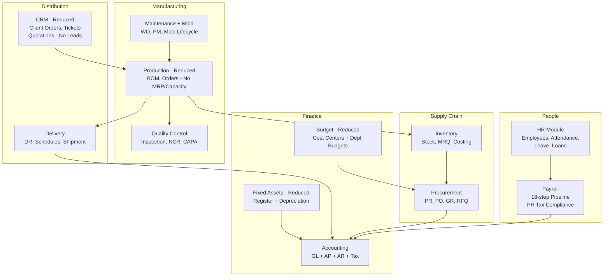

# Ogami ERP Module Consolidation Plan v2

## Goal
Reduce 22 domain modules to **12 lean modules** with solid, real-world ERP workflows. Cut sub-features that add explanation burden without demo value. Fix duplicates.

---

## Summary of ALL Cuts

### A. Full Domain Removals (from v1 plan)
| Domain | Services | Pages | Reason |
|--------|----------|-------|--------|
| **Budget** | 5 | 7 | Reduce to inline PR budget check only |
| **ISO** | 4 | 6 | Compliance fluff, no manufacturing workflow integration |
| **Fixed Assets** | 2 | 5 | Reduce -- keep only asset register + depreciation, remove transfers/categories/disposal pages |

### B. HR Sub-Feature Removals (user requested)
| Sub-Feature | Backend Files | Frontend Pages | Reason |
|-------------|--------------|----------------|--------|
| **Performance Appraisals** | `PerformanceAppraisalService.php`, `PerformanceAppraisal.php`, `PerformanceAppraisalCriteria.php` | `PerformanceAppraisalListPage.tsx`, `CreatePerformanceAppraisalPage.tsx` | Not core HR, hard to demo meaningfully |
| **Employee Training Programs** | `Training.php`, `TrainingAttendee.php` | `TrainingListPage.tsx` | L&D is separate from core HR |
| **Competency Matrix / Skill Gap** | `CompetencyMatrix.php` | `CompetencyMatrixPage.tsx` | Niche HR feature, adds explanation without impact |

### C. Production Sub-Feature Removals (user requested)
| Sub-Feature | Backend Files | Frontend Pages | Reason |
|-------------|--------------|----------------|--------|
| **Time-Phased MRP** | `MrpService.php` | `TimePhasedMrpPage.tsx` | Complex algorithm, hard to demo, not core to thesis |
| **Capacity Planning** | `CapacityPlanningService.php`, `WorkCenter.php`, `Routing.php` | `CapacityPlanningPage.tsx` | Work center utilization is advanced manufacturing planning |

### D. CRM Sub-Feature Reductions (user requested)
| Sub-Feature | Backend Files | Frontend Pages | Reason |
|-------------|--------------|----------------|--------|
| **Lead Management** | `LeadService.php`, `LeadScoringService.php`, `Lead.php`, `Contact.php` | `LeadListPage.tsx`, `LeadDetailPage.tsx`, `LeadScoringPage.tsx` | Pre-sales pipeline adds 3 pages with no manufacturing tie-in |
| **Opportunity Pipeline** | `OpportunityService.php`, `Opportunity.php` | `OpportunityListPage.tsx`, `OpportunityDetailPage.tsx` | CRM pipeline is separate from order fulfillment |

**CRM keeps:** Client Orders (with negotiation), Tickets (with SLA), SalesAnalyticsService, OrderTrackingService

### E. Fixed Assets Reduction (user requested: reduce, not fully remove)
| Keep | Remove |
|------|--------|
| `FixedAssetsPage.tsx` (register + depreciation run) | `AssetDisposalPage.tsx` |
| `FixedAssetDetailPage.tsx` | `AssetTransfersPage.tsx` |
| `FixedAssetService.php` | `FixedAssetCategoriesPage.tsx` (inline into main page) |
| | `AssetRevaluationService.php` |

### F. Budget Reduction (user requested: reduce, not fully remove)
| Keep | Remove |
|------|--------|
| `CostCentersPage.tsx` | `BudgetAmendmentsPage.tsx` |
| `DepartmentBudgetsPage.tsx` | `BudgetForecastPage.tsx` |
| `BudgetEnforcementService.php` (inline PR check) | `BudgetVarianceReportPage.tsx` |
| `BudgetService.php` (basic CRUD) | `BudgetVsActualPage.tsx` |
| | `BudgetLinesPage.tsx` |
| | `BudgetAmendmentService.php` |
| | `BudgetForecastService.php` |
| | `BudgetVarianceService.php` |

---

## Domain Merges (from v1 plan, still recommended)

### 1. Attendance + Leave + Loan -> HR
Group under `app/Domains/HR/` as sub-namespaces. Present as "HR Module with attendance tracking, leave management, and employee loans."

### 2. AP + AR + Tax -> Accounting
Group under `app/Domains/Accounting/` as sub-namespaces. Present as "Accounting Module with General Ledger, AP sub-ledger, AR sub-ledger, and Philippine tax compliance."

### 3. Mold -> Maintenance
Move `MoldMaster` and `MoldShotLog` into Maintenance. Present as "Maintenance Module with work orders, PM scheduling, and mold lifecycle tracking."

### 4. Sales -> CRM (reduced CRM)
After removing Leads and Opportunities, merge remaining Sales features (Quotation, SalesOrder, PriceList) into CRM. Present as "CRM Module with client orders, quotations, and support tickets."

---

## Duplicates to Fix

| Issue | Location | Fix |
|-------|----------|-----|
| **Stock adjustment bypass** | `DeliveryScheduleService::fulfillFromStock()` creates raw StockLedger entries at line 264 | Refactor to use `StockService::issue()` |
| **InvoiceAutoDraftService naming** | Same class name in both `AP/Services/` and `AR/Services/` | Rename to `ApInvoiceAutoDraftService` and `ArInvoiceAutoDraftService` |
| **CostingService confusion** | `Production/Services/CostingService.php` vs `Inventory/Services/CostingMethodService.php` | Rename to `BomCostingService` and `InventoryValuationService` |
| **InventoryReportService overlap** | Queries same tables as `InventoryAnalyticsService` | Merge into `InventoryAnalyticsService` |
| **ProductionReportService overlap** | Thin wrapper over production queries | Merge into `ProductionOrderService` |
| **Delivery schedule domain split** | `DeliverySchedule` + `CombinedDeliverySchedule` live in Production but contain delivery logic | Move to Delivery domain |

---

## Final Module Map (12 Modules)

---

## Impact Summary

| Metric | Before | After | Removed |
|--------|--------|-------|---------|
| Domains | 22 | 12 | -10 |
| Services | 141 | ~105 | ~-36 |
| Frontend Pages | 241 | ~205 | ~-36 |
| Sidebar Items | 22+ | 12 | -10 |

### Pages Removed Breakdown
| Source | Pages Cut |
|--------|-----------|
| Budget reduction | -5 (keep 2) |
| ISO removal | -6 |
| Fixed Assets reduction | -3 (keep 2) |
| HR sub-features | -3 |
| Production sub-features | -2 |
| CRM sub-features | -5 |
| Sales merge into CRM | ~0 (pages absorbed) |
| **Total** | **~-24 pages** |

---

## Execution Steps (ordered)

1. **Remove HR sub-features:** Delete PerformanceAppraisalService, Training models, CompetencyMatrix model, and 3 frontend pages. Remove routes.
2. **Remove Production sub-features:** Delete MrpService, CapacityPlanningService, WorkCenter model, Routing model, and 2 frontend pages. Remove routes.
3. **Reduce CRM:** Delete LeadService, LeadScoringService, OpportunityService, Lead/Contact/Opportunity models, and 5 frontend pages. Remove routes.
4. **Reduce Budget:** Delete BudgetAmendmentService, BudgetForecastService, BudgetVarianceService, and 5 frontend pages. Keep CostCenters + DeptBudgets pages.
5. **Reduce Fixed Assets:** Delete AssetRevaluationService, and 3 frontend pages. Keep register + detail pages.
6. **Remove ISO:** Delete entire `app/Domains/ISO/`, 6 frontend pages, and routes.
7. **Fix stock adjustment bypass** in `DeliveryScheduleService::fulfillFromStock()`.
8. **Merge Mold into Maintenance** (namespace move).
9. **Merge Sales into CRM** (namespace move, absorb quotation/SO pages).
10. **Merge Attendance + Leave + Loan into HR** (namespace moves).
11. **Merge AP + AR + Tax into Accounting** (namespace moves).
12. **Move delivery schedules from Production to Delivery** domain.
13. **Rename confusing services** (InvoiceAutoDraft, CostingService).
14. **Merge overlapping report/analytics services.**
15. **Update sidebar navigation** to show 12 grouped modules.
16. **Update router** to reflect new page locations.

---

## What You Present to the Panel

> "Ogami ERP is a 12-module manufacturing ERP system for Philippine businesses. It covers the complete business cycle:
> 
> **People:** HR manages 200+ employees with attendance, leave, and loan tracking. Payroll runs an 18-step computation pipeline with full SSS, PhilHealth, PagIBIG, and TRAIN law tax compliance.
> 
> **Finance:** Accounting provides a complete General Ledger with AP and AR sub-ledgers, automated journal posting from payroll and procurement, and BIR tax form generation.
> 
> **Supply Chain:** Procurement handles the full PR-to-PO-to-GR cycle with 4-stage SoD approval workflow. Inventory manages stock with FIFO/weighted average costing, material requisitions, and physical counts.
> 
> **Manufacturing:** Production manages BOMs and production orders. QC performs inspections with NCR and CAPA workflows. Maintenance schedules preventive maintenance and tracks mold lifecycles.
> 
> **Distribution:** Delivery handles delivery receipts and shipment tracking. CRM manages client orders with negotiation workflows and support tickets.
> 
> All modules enforce Segregation of Duties, role-based access control with department scoping, and maintain complete audit trails."

This narrative covers 12 modules in under 2 minutes and every module has a clear, demonstrable workflow.
