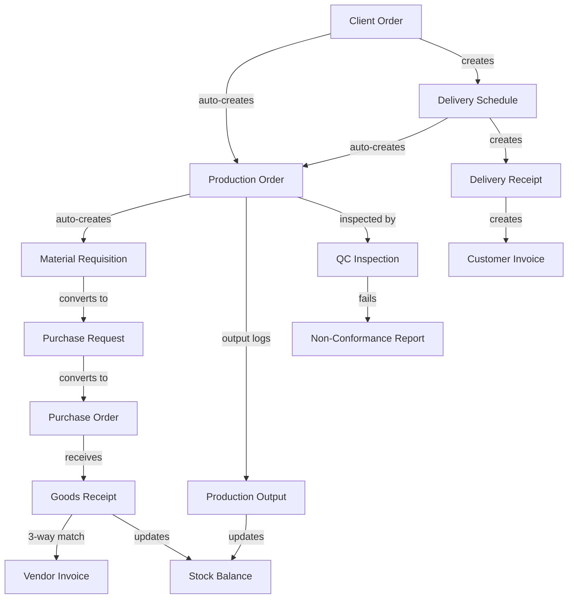

# Ogami ERP - Production-Grade Chain Record and Workflow Improvements

## Current Chain Record Map

Here is the existing document chain across Procurement and Production:



---

## Gaps Found in Current Chain Record

### Gap 1: No Unified Document Trail View
**Problem:** Each document stores its parent FK but there is no API endpoint or UI component that shows the complete chain. When a panel member asks "show me the full audit trail from client order to payment," you have to click through 6+ separate pages.

**Fix:** Add a **Chain Record Timeline API** and **UI component** that given any document ID, traces the full chain upstream and downstream.

### Gap 2: Production Order Has No po_reference Auto-Generation
**Problem:** [`ProductionOrder.po_reference`](app/Domains/Production/Models/ProductionOrder.php:24) is set manually but there is no auto-generation pattern like PR/PO/GR have. This means production orders can have inconsistent or missing reference numbers.

**Fix:** Add auto-generation: `PROD-YYYY-MM-NNNNN` pattern in [`ProductionOrderService::store()`](app/Domains/Production/Services/ProductionOrderService.php:137).

### Gap 3: GR-to-Stock Update Not Fully Linked to Original MRQ
**Problem:** When a GR is confirmed and stock is received via [`StockService::receive()`](app/Domains/Inventory/Services/StockService.php:24), the `reference_type` is the GR, but the original MRQ that triggered the PR that triggered the PO that triggered the GR is not traceable from the stock ledger entry.

**Fix:** Add `source_mrq_id` to stock ledger entries when the receive comes from a GR linked to a PO linked to a PR linked to an MRQ. This creates a direct shortcut for traceability.

### Gap 4: Production Output Does Not Auto-Create Delivery Receipt
**Problem:** When production is completed and QC passes, the delivery schedule status updates but no Delivery Receipt is auto-created. The warehouse staff must manually create a DR.

**Fix:** Add auto-draft DR creation when production order reaches `completed` status and the linked delivery schedule has status `ready`.

### Gap 5: No GR Quantity Validation Against Original PR Quantities
**Problem:** The 3-way match validates GR against PO quantities, but does not cross-check against the original PR estimated quantities to detect procurement scope creep.

**Fix:** Add a **scope creep warning** (not a blocker) in the 3-way match when total received value exceeds original PR estimated cost by more than 10%.

### Gap 6: Missing Status Timeline on Detail Pages
**Problem:** Document detail pages show the current status but not the history of status transitions with timestamps and actors. Real ERP systems show "Created by X at T1 -> Submitted by Y at T2 -> Approved by Z at T3".

**Fix:** Leverage the existing `owen-it/laravel-auditing` data to show a **Status Timeline** component on PR, PO, GR, Production Order, and Delivery Schedule detail pages.

### Gap 7: No Vendor Invoice to Payment Chain
**Problem:** Vendor invoices are auto-drafted from GR confirmation, but there is no visible chain from invoice to actual payment and GL posting. The AP payment workflow exists but the chain record is not surfaced in the UI.

**Fix:** Add payment status and GL journal entry reference to the vendor invoice detail page, completing the Procure-to-Pay chain visibility.

---

## Procurement Workflow Improvements

### P1: PR Workflow Enhancement - Add Cancellation Audit Trail
**Current:** PR can be cancelled but [`cancellation_reason`](app/Domains/Procurement/Models/PurchaseRequest.php) and cancellation audit fields exist in the migration but are not consistently populated.

**Fix:** Ensure `cancelled_by_id`, `cancelled_at`, `cancellation_reason` are always set when transitioning to `cancelled` state.

### P2: PO Negotiation Round Tracking - Show History
**Current:** PO has `negotiation_round` counter and vendor remarks, but the negotiation history is only visible through fulfillment notes.

**Fix:** Add a **Negotiation History Panel** on PO detail page that shows all fulfillment notes with `note_type` in `change_requested`, `change_accepted`, `change_rejected` -- presented as a conversation timeline.

### P3: Blanket PO to Release Order Workflow
**Current:** [`BlanketPurchaseOrderService`](app/Domains/Procurement/Services/BlanketPurchaseOrderService.php) exists but the workflow for creating release orders against a blanket PO is incomplete.

**Fix:** Add release order creation from blanket PO with automatic quantity tracking against the blanket agreement total.

### P4: GR Quality Gate Integration
**Current:** GR confirmation checks for IQC inspection in [`GoodsReceiptService`](app/Domains/Procurement/Services/GoodsReceiptService.php:291) but only as a soft check.

**Fix:** Make IQC inspection mandatory before GR can transition to `confirmed`. Add a "Pending QC" status to GR state machine so the workflow is: `draft -> pending_qc -> confirmed`.

---

## Production Workflow Improvements

### M1: Production Order State Machine Formalization
**Current:** Production order statuses exist but there is no explicit state machine class like PR and PO have.

**Fix:** Create [`ProductionOrderStateMachine.php`](app/Domains/Production/StateMachines/) with transitions:
```
draft -> released -> in_progress -> completed -> closed
draft -> cancelled
released -> on_hold -> released
in_progress -> on_hold -> in_progress
completed -> closed
```

### M2: Material Consumption Tracking Per Production Order
**Current:** MRQ fulfillment issues stock but there is no per-production-order material consumption summary that compares BOM expected vs actual consumed.

**Fix:** Add a **Material Consumption Report** on Production Order detail page: BOM expected quantities vs actual MRQ fulfilled quantities, with variance analysis.

### M3: Production Output Quality Gate
**Current:** Production output logs can be recorded even before QC inspection. The inspection is a separate action.

**Fix:** Add a "pending_qc" intermediate state after output is logged. Output only counts toward `qty_produced` after QC inspection passes. Failed inspection increments `qty_rejected`.

### M4: Production Cost vs Standard Cost Variance
**Current:** [`CostingService`](app/Domains/Production/Services/CostingService.php) calculates standard costs from BOM, and [`ProductionCostPostingService`](app/Domains/Production/Services/ProductionCostPostingService.php) posts to GL. But there is no variance analysis between standard and actual.

**Fix:** Add production cost variance calculation: `(Actual Material + Actual Labor) - (Standard Material + Standard Labor)` with favorable/unfavorable classification.

---

## Cross-Module Chain Record UI Component

### The Chain Record Timeline Component

A reusable React component that shows the full document chain for any record:

```
ChainRecordTimeline
  |-- Given: { documentType: 'purchase_request', documentId: 123 }
  |-- API: GET /api/v1/chain-record/{type}/{id}
  |-- Returns: ordered list of linked documents with status, date, actor
  |-- Renders: vertical timeline with status badges and links
```

**Example output for a Production Order:**
```
1. Client Order #CO-2026-03-001  [approved]     Mar 15, 2026
   |-> Created by: Sales Manager
2. Delivery Schedule #DS-2026-03-001  [ready]    Mar 16, 2026
   |-> Auto-created from Client Order
3. Production Order #PROD-2026-03-001  [completed]  Mar 17, 2026
   |-> Auto-created from Delivery Schedule
4. Material Requisition #MRQ-2026-03-001  [fulfilled]  Mar 17, 2026
   |-> Auto-created from Production Order BOM
5. Purchase Request #PR-2026-03-001  [converted_to_po]  Mar 18, 2026
   |-> Converted from MRQ
6. Purchase Order #PO-2026-03-001  [fully_received]  Mar 18, 2026
   |-> Created from PR
7. Goods Receipt #GR-2026-03-001  [confirmed]  Mar 20, 2026
   |-> 3-way match passed
8. Vendor Invoice #VI-2026-03-001  [approved]  Mar 20, 2026
   |-> Auto-drafted from GR
9. QC Inspection #INS-2026-03-001  [passed]  Mar 21, 2026
   |-> Linked to Production Order
10. Delivery Receipt #DR-2026-03-001  [confirmed]  Mar 22, 2026
    |-> Linked to Delivery Schedule
11. Customer Invoice #CI-2026-03-001  [sent]  Mar 22, 2026
    |-> Auto-created from DR
```

This is the single most impressive feature for a thesis demo -- it shows the complete business cycle in one view.

---

## Execution Priority

| # | Task | Impact | Risk |
|---|------|--------|------|
| 1 | **Chain Record Timeline API + Component** | Highest demo value | Medium -- new API endpoint + React component |
| 2 | **Status Timeline on detail pages** | High -- uses existing audit data | Low -- read-only component |
| 3 | **Production Order auto-reference generation** | Medium -- consistency | Low -- simple string generation |
| 4 | **ProductionOrderStateMachine formalization** | High -- shows engineering rigor | Low -- extract existing logic |
| 5 | **GR Quality Gate (pending_qc status)** | High -- real-world workflow | Medium -- state machine change |
| 6 | **Negotiation History Panel on PO detail** | Medium -- shows procurement depth | Low -- read existing fulfillment notes |
| 7 | **Material Consumption variance report** | Medium -- manufacturing depth | Medium -- new query + UI |
| 8 | **PR cancellation audit trail** | Low -- cleanup | Low -- field population |
| 9 | **Scope creep warning in 3-way match** | Low -- nice-to-have | Low -- add warning log |
| 10 | **Production cost variance analysis** | Medium -- accounting depth | Medium -- new computation |

---

## What This Gets You for the Panel

The Chain Record Timeline alone transforms the demo narrative from "here are 12 separate modules" to:

> "Let me show you a real order flowing through the entire system. This client order automatically triggered production, which generated material requisitions, which converted to purchase requests, which went through 4-stage approval, became purchase orders sent to vendors, received goods receipts with 3-way matching, auto-created vendor invoices, passed quality inspection, and shipped to the customer -- all with full audit trail, SoD enforcement, and GL postings at every financial touchpoint."

That is a production-grade ERP story that will impress any panel.
