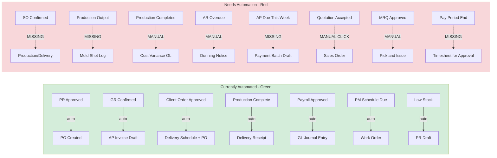

# Ogami ERP -- Module-by-Module Functional Gap Analysis & Enhancement Plan (v2 -- Verified)

## Purpose
Audit every module against **real-world ERP standards** and identify where the module name promises functionality that the code does not deliver. Each item has been **verified against the actual codebase** to prevent proposing features that already exist.

### Verification Legend
- **NEW** = Feature does not exist at all
- **IMPROVE** = Feature exists partially but needs enhancement
- **WIRED** = Backend exists but frontend/integration missing

---

## Grading Legend

| Grade | Meaning |
|-------|---------|
| **A** | Feature-complete for thesis -- minor polish only |
| **B** | Core workflow works, but missing 1-2 standard ERP features |
| **C** | Scaffolded with models/CRUD, but key business logic absent |
| **D** | Name exists but functionality is a stub or fundamentally misaligned |

---

## Corrections from v1 -- Features That Already Exist

Before the enhancement list, here is what was initially flagged but **already implemented**:

| Originally Proposed | Actually Exists In |
|---|---|
| 13th month pay | `ThirteenthMonthComputationService`, `Step18ThirteenthMonthStep`, `ThirteenthMonthAccrual` model |
| Final pay computation | `PayrollEdgeCaseHandler` EDGE-002 -- prorates salary to separation date |
| Customer credit limit enforcement | `Customer.credit_limit` + `enforceCredit()` method throws DomainException |
| PM schedule auto-WO generation | `GeneratePmWorkOrdersCommand` -- runs daily, auto-creates WOs from due PM schedules |
| CRM weighted pipeline value | `OpportunityService.pipelineSummary()` computes `weighted_centavos` per stage |
| Low stock auto-reorder | `CheckReorderPointsCommand` + `LowStockReorderService` auto-draft PRs |
| Employee self-service portal | `EmployeeSelfServiceController` -- payslips, YTD, leave balances, loans, payslip PDF |
| Payment terms on vendors | `Vendor.payment_terms` field, parsed for due date in `VendorInvoiceService` |
| Leave carry-over rules | `LeaveType.max_carry_over_days`, `RenewLeaveBalances` command, `LeaveAccrualService` year-end |
| Mold shot DB trigger | `trg_update_mold_shots` auto-increments `current_shots` when shot log inserted |
| Client Order to Production auto-chain | `ClientOrderService` auto-creates delivery schedules + production orders on approval |
| GR to AP Invoice auto-draft | `InvoiceAutoDraftService.createFromGoodsReceipt()` called from `GoodsReceiptService.confirm()` |
| DR to AR Invoice auto-draft | `CreateCustomerInvoiceOnShipmentDelivered` listener + `CombinedDeliveryScheduleService.createCustomerInvoice()` |

---

## 1. Production -- Grade B

### 1.1 BOM -- Bill of Materials

| # | Enhancement | Type | Detail |
|---|---|---|---|
| 1 | Multi-level BOM cost rollup | **IMPROVE** | `BomComponent.parent_bom_component_id` exists for nesting, but `BomService.rollupCost()` only iterates `$bom->components` flat -- never recurses into sub-assembly BOMs |
| 2 | Include routing labor/overhead in cost | **NEW** | `Routing` and `WorkCenter` models have `hourly_rate_centavos`, `setup_time_hours`, `run_time_hours_per_unit` but `CostingService.standardCost()` only sums material. Should add: `SUM per routing step of setup_time + run_time * qty multiplied by work_center.hourly_rate + overhead_rate` |
| 3 | BOM where-used report | **NEW** | Given a raw material item_id, return all BOMs/finished goods that use it. Reverse lookup. |
| 4 | Engineering Change Order | **NEW** | BOM version is just a string. No approval workflow for version changes. Add ECO model with draft/review/approved states. |

### 1.2 MRP -- Material Requirements Planning

| # | Enhancement | Type | Detail |
|---|---|---|---|
| 5 | Time-phased MRP with lead times | **IMPROVE** | `MrpService.explode()` calculates total shortage but not WHEN to order. `Vendor.lead_time_days` exists. Offset requirement dates by lead time to determine order release dates. |
| 6 | Planned orders for sub-assemblies | **IMPROVE** | `suggestPurchases()` only recommends raw material PRs. For semi-finished items with their own BOM, it should suggest production orders instead. |
| 7 | Capacity planning | **NEW** | `WorkCenter.capacity_hours_per_day` is stored but never used. Create `CapacityPlanningService` to check if scheduled production fits within work center capacity. |

### 1.3 Production Orders

| # | Enhancement | Type | Detail |
|---|---|---|---|
| 8 | Production scheduling/sequencing | **IMPROVE** | Orders have status transitions but no `priority`, `scheduled_start`, `scheduled_end` for finite scheduling. |
| 9 | Per-operation output logging | **NEW** | Output logs capture total qty only. Link to `Routing` steps for per-operation yield tracking. |

---

## 2. Inventory -- Grade B+

| # | Enhancement | Type | Detail |
|---|---|---|---|
| 10 | FIFO costing implementation | **NEW** | `ItemMaster.costing_method` allows `fifo` but `StockService` always uses `standard_price`. Need to track cost per lot and issue oldest lots first. |
| 11 | Weighted average costing | **IMPROVE** | `InventoryAnalyticsService.valuationReport()` is labeled weighted average but actually just uses `standard_price`. Need to recalculate average unit cost on every receipt: `new_avg = (old_qty * old_avg + new_qty * new_cost) / (old_qty + new_qty)` |
| 12 | Two-step warehouse transfer | **IMPROVE** | Current transfer is a single adjustment. Need source-issues -> in-transit -> destination-receives with in-transit visibility. |
| 13 | Cycle count scheduling by ABC class | **NEW** | Physical counts are ad-hoc. Auto-generate counts: A items monthly, B quarterly, C annually using existing ABC analysis from `InventoryAnalyticsService`. |

---

## 3. Sales -- Grade C+

| # | Enhancement | Type | Detail |
|---|---|---|---|
| 14 | SO to Delivery/Production flow | **NEW** | `SalesOrder` confirms but does not trigger DR or Production Order. Only `ClientOrder` has this automation. Need parallel flow for direct sales. |
| 15 | SO line fulfillment tracking | **NEW** | No `fulfilled_qty` on `SalesOrderItem`. No visibility into which SO lines have been delivered. |
| 16 | Line-level discounts | **NEW** | `SalesOrderItem` has `unit_price_centavos` but no `discount_pct` or `discount_amount_centavos`. Same for `QuotationItem`. |
| 17 | Sales vs CRM module delineation | **IMPROVE** | Document + enforce: Sales = direct B2B orders; CRM ClientOrder = portal/negotiated orders. Add cross-references between the two when same customer is involved. |

---

## 4. CRM -- Grade B+

| # | Enhancement | Type | Detail |
|---|---|---|---|
| 18 | Lead scoring model | **NEW** | Leads have status but zero scoring. Add score based on source, company size, engagement level. Auto-qualify when score exceeds threshold. |
| 19 | SLA enforcement on tickets | **NEW** | `Ticket` has no `sla_deadline`, `escalated_at`, `breached` fields. No auto-escalation on deadline. |
| 20 | Opportunity to Quotation conversion | **NEW** | Opportunities exist in CRM, Quotations in Sales, but no conversion path between them. Add `OpportunityService.convertToQuotation()`. |

---

## 5. Accounting -- Grade A-

| # | Enhancement | Type | Detail |
|---|---|---|---|
| 21 | Bank reconciliation auto-matching | **IMPROVE** | Matching is manual. Add rules engine: match by exact amount + date range + reference number pattern. |
| 22 | Financial ratio calculations | **NEW** | No current ratio, quick ratio, debt-to-equity, ROE calculations. Add `FinancialRatioService` using GL data. |
| 23 | Consolidated aging report | **NEW** | AR/AP aging exist separately. No single report combining both for cash flow visibility. |

---

## 6. AP -- Accounts Payable -- Grade A-

| # | Enhancement | Type | Detail |
|---|---|---|---|
| 24 | Early payment discount logic | **IMPROVE** | `payment_terms` is a free-text string parsed with regex for day count. No structured early payment discount like 2/10 Net 30. Add `discount_pct`, `discount_days` fields and compute savings. |
| 25 | Payment scheduling optimizer | **NEW** | No service to suggest which invoices to pay this week to capture early-pay discounts or meet deadlines. |

---

## 7. AR -- Accounts Receivable -- Grade B+

| # | Enhancement | Type | Detail |
|---|---|---|---|
| 26 | Statement of Account service | **NEW** | No backend service to compile all transactions for a customer over a date range. |
| 27 | Automated dunning batch run | **IMPROVE** | `DunningService` and models exist but no scheduled command to batch-create dunning notices for all overdue customers. |

---

## 8. Tax -- Grade B

| # | Enhancement | Type | Detail |
|---|---|---|---|
| 28 | BIR form PDF generation | **NEW** | `BirFormGeneratorService` generates data but not printable BIR-format PDFs. Filing records are tracking only. |
| 29 | Alphalist generation | **NEW** | BIR 2316 for employees and 2307 for vendors alphalist require per-entity detail aggregation not yet implemented. |
| 30 | Tax filing calendar with alerts | **NEW** | Filing deadlines not tracked with configurable reminders. |

---

## 9. Procurement -- Grade A-

| # | Enhancement | Type | Detail |
|---|---|---|---|
| 31 | Blanket/framework purchase orders | **NEW** | No model for long-term purchase agreements with agreed prices that individual POs draw against. |
| 32 | PR consolidation into PO | **IMPROVE** | Multiple PRs for same item/vendor created separately. When creating PO, suggest merging PRs. |
| 33 | Vendor score impact on PO | **IMPROVE** | `VendorScoringService` exists with quality/delivery/price composite score but results do not influence PO creation or vendor selection UI. |

---

## 10. QC -- Quality Control -- Grade B+

| # | Enhancement | Type | Detail |
|---|---|---|---|
| 34 | IQC gate enforcement on GR | **NEW** | `ItemMaster.requires_iqc` flag exists. `InspectionTemplate` supports `stage=iqc`. But `GoodsReceiptService.confirm()` does NOT check if IQC inspection passed before allowing stock receipt. Critical gap. |
| 35 | SPC calculations | **IMPROVE** | `SpcService` and `SpcDashboardPage` exist but need actual X-bar/R chart calculations and Cp/Cpk process capability indices from measurement data. |
| 36 | QC hold/quarantine for stock | **NEW** | Failed inspections flag `failed_hold` but stock goes directly to balance. Need quarantine zone concept where stock is held until QC release. |

---

## 11. Maintenance -- Grade A-

*PM auto-WO generation already exists via `GeneratePmWorkOrdersCommand`.*

| # | Enhancement | Type | Detail |
|---|---|---|---|
| 37 | Downtime phase tracking | **IMPROVE** | Work order has `labor_hours` but no breakdown: wait-for-assignment, wait-for-parts, active-repair, testing. Needed for accurate OEE. |
| 38 | Complete OEE calculation | **IMPROVE** | `MaintenanceAnalyticsService` calculates availability only. Full OEE = Availability x Performance x Quality. Need production throughput and QC data integration. |

---

## 12. Mold -- Grade B

*DB trigger auto-increments shot count on log insert. PM WO auto-created at threshold.*

| # | Enhancement | Type | Detail |
|---|---|---|---|
| 39 | Auto-log shots from production output | **NEW** | `MoldService.logShots()` is called manually. When `ProductionOrderService.logOutput()` records output for a mold-linked order, it should auto-call `logShots()`. |
| 40 | Cavity efficiency tracking | **NEW** | `cavity_count` exists on MoldMaster. No metric: `actual_units / (shots * cavity_count) * 100`. |
| 41 | Mold lifecycle cost report | **NEW** | No aggregation of acquisition + cumulative maintenance costs over mold lifetime. |

---

## 13. Delivery -- Grade B

| # | Enhancement | Type | Detail |
|---|---|---|---|
| 42 | Proof of delivery capture | **NEW** | DR moves to `delivered` but no signature/photo upload mechanism. |
| 43 | Trip cost tracking | **NEW** | `Vehicle` model has plate and capacity. No fuel/distance/cost logging per trip. |
| 44 | On-time delivery metric | **IMPROVE** | `DeliveryReceiptService` has a TODO: `on_time: $total, // TODO: compare against schedule expected dates`. |

---

## 14. ISO -- Grade B-

| # | Enhancement | Type | Detail |
|---|---|---|---|
| 45 | Document read acknowledgment | **NEW** | `DocumentDistribution` exists but no confirmation that recipients read the document. |
| 46 | CAPA effectiveness review | **NEW** | Corrective actions close but no follow-up verification step. |
| 47 | Training linkage to document changes | **NEW** | ISO 9001 requires: when procedure changes, affected staff need retraining. No link between `DocumentRevision` and HR `Training`. |

---

## 15. Fixed Assets -- Grade B

| # | Enhancement | Type | Detail |
|---|---|---|---|
| 48 | Asset revaluation | **NEW** | No service to revalue assets and post revaluation surplus to equity GL account. |
| 49 | Impairment testing | **IMPROVE** | Status `impaired` exists in DB but no impairment calculation service. |
| 50 | Barcode/QR generation | **NEW** | `asset_code` exists but no barcode image generation for physical verification. |

---

## 16. Budget -- Grade B

| # | Enhancement | Type | Detail |
|---|---|---|---|
| 51 | Budget amendment workflow | **NEW** | Zero results for budget amendments. Once approved, budget cannot be formally revised mid-year. Need amendment model with approval flow. |
| 52 | Budget transfer between accounts | **NEW** | Cannot reallocate budget from one GL account to another within same cost center. |
| 53 | Monthly phasing | **NEW** | Budget is annual only. No seasonal distribution across months for more accurate monthly variance analysis. |

---

## 17. HR -- Grade B+

*Employee self-service already exists via `EmployeeSelfServiceController`.*

| # | Enhancement | Type | Detail |
|---|---|---|---|
| 54 | Performance appraisal module | **NEW** | Zero results. No models, services, or UI for performance reviews/KPI tracking. Standard HR feature expected in thesis. |
| 55 | Separation/offboarding workflow | **IMPROVE** | `EmployeeClearance` model and `EmployeeClearanceService` exist. But clearance is not enforced before final pay. Need gate: all clearance items signed before final pay processes. |
| 56 | 201 file completeness tracking | **IMPROVE** | `EmployeeDocument` model exists. `OnboardingChecklistService` exists. Need completeness percentage on employee detail page and gate to prevent activation without required docs. |

---

## 18. Payroll -- Grade A

*13th month pay fully implemented. Final pay proration exists in EdgeCaseHandler.*

| # | Enhancement | Type | Detail |
|---|---|---|---|
| 57 | Final pay enhancement | **IMPROVE** | EDGE-002 prorates basic salary to separation date but does not include: unused leave monetization, prorated 13th month, last payroll deductions reconciliation. Need comprehensive `FinalPayService`. |
| 58 | Payroll period comparison report | **NEW** | No side-by-side comparison of two payroll runs to identify variances. |

---

## 19. Attendance -- Grade B+

| # | Enhancement | Type | Detail |
|---|---|---|---|
| 59 | Daily attendance dashboard | **NEW** | No real-time view of who is present/absent/late today per department. |
| 60 | Timesheet approval wiring | **IMPROVE** | `TimesheetApproval` model exists but no approval service. Model is orphaned. |

---

## 20. Leave -- Grade A-

*Carry-over rules fully implemented. Leave accrual automated.*

| # | Enhancement | Type | Detail |
|---|---|---|---|
| 61 | Team leave conflict detection | **NEW** | No check if approving a leave would drop department below minimum staffing. |
| 62 | Leave calendar view | **WIRED** | `LeaveCalendarService` exists backend. Need frontend calendar component showing team leave by month. |

---

## 21. Loan -- Grade B+

| # | Enhancement | Type | Detail |
|---|---|---|---|
| 63 | Early payoff calculation | **NEW** | No service to compute remaining principal + accrued interest for payoff. |
| 64 | Loan restructuring | **NEW** | Cannot modify amortization schedule terms after approval. |

---

## 22. Dashboard -- Grade C

| # | Enhancement | Type | Detail |
|---|---|---|---|
| 65 | Role-based dashboards | **NEW** | Only `ExecutiveDashboardController` exists. All roles see the same dashboard. Production manager, HR head, finance controller all need different default views. |
| 66 | Time-series KPI trends | **IMPROVE** | `DashboardKpiService` returns point-in-time values. No historical trend data for charts. |

---

## Automation Audit: Kill Manual Creation Where Possible

### What Is Already Automated (do NOT duplicate)

| Trigger | Auto-Action | Code Location |
|---------|-------------|---------------|
| PR VP-approved | Auto-create draft PO | `PurchaseRequestService.vpApprove()` -> `PurchaseOrderService.autoCreateFromPr()` |
| GR confirmed | Auto-draft AP Invoice | `GoodsReceiptService.confirm()` -> `InvoiceAutoDraftService.createFromGoodsReceipt()` |
| Client Order approved | Auto-create Delivery Schedules + Production Orders | `ClientOrderService.approve()` -> `createDeliverySchedulesFromOrder()` + `checkAndCreateDraftProductionOrders()` |
| Production completed + no QC | Auto-create Delivery Receipt | `CreateDeliveryReceiptOnProductionComplete` listener |
| OQC inspection passed | Auto-create Delivery Receipt | `CreateDeliveryReceiptOnOqcPass` listener |
| Shipment delivered | Auto-draft AR Invoice | `CreateCustomerInvoiceOnShipmentDelivered` listener |
| Client acknowledges delivery | Auto-create Customer Invoice | `CombinedDeliveryScheduleService.acknowledgeReceipt()` -> `createCustomerInvoice()` |
| Payroll VP-approved | Auto-post GL Journal Entry | `PayrollRunObserver` -> `PayrollAutoPostService.post()` |
| AP Invoice approved | Auto-post GL Journal Entry | `VendorInvoiceService.approve()` -> JE creation |
| AR Invoice approved | Auto-post GL Journal Entry | `CustomerInvoiceService` -> JE creation |
| Loan accounting-approved | Auto-generate amortization + GL entry | `LoanRequestService.accountingApprove()` |
| PM schedule due | Auto-create Work Order | `GeneratePmWorkOrdersCommand` scheduled daily |
| Stock below reorder point | Auto-draft Purchase Request | `CheckReorderPointsCommand` scheduled daily |
| Mold shot limit reached | Auto-create PM Work Order | `MoldService.logShots()` threshold check |
| Lead converted | Auto-create Customer + Opportunity | `LeadService.convert()` |
| Leave accrual monthly | Auto-credit balances | `RunLeaveAccrualJob` scheduled monthly |
| Leave year-end | Auto carry-over with caps | `RenewLeaveBalances` command |
| Recurring JE templates | Auto-generate draft JEs | `GenerateRecurringJournalEntries` command |
| PO manual creation | **BLOCKED** -- returns 403 | `PurchaseOrderController.store()` aborts with message |

### Automation Gaps That Must Be Fixed

These are places where a user must manually create something that the system should auto-create or auto-trigger:

| # | Manual Step Today | Should Be Automated | Type | Detail |
|---|---|---|---|---|
| A1 | Sales Order confirmed -> nothing happens | **SO confirmed -> auto-create Production Order or DR** | **NEW** | `SalesOrderService.confirm()` updates status but triggers no downstream action. Should mirror the Client Order flow: check stock, reserve or create Production Order, create Delivery Schedule. |
| A2 | Quotation accepted -> user must click Convert to Order | **Quotation accepted -> auto-create Sales Order** | **IMPROVE** | `QuotationController.convertToOrder()` exists as a manual action. When quotation status changes to `accepted`, auto-create SO and notify sales team. |
| A3 | Production output logged -> mold shots logged manually | **Production output -> auto-log mold shots** | **NEW** | `ProductionOrderService.logOutput()` records output qty but does not call `MoldService.logShots()`. If production order is linked to a mold, auto-log shots = output_qty / cavity_count. |
| A4 | Production Order completed -> cost variance posting is manual API call | **Production completed -> auto-post cost variance GL** | **IMPROVE** | Route `POST orders/{id}/post-cost` exists but must be called manually. Should fire automatically on completion event, similar to payroll auto-post. |
| A5 | MRQ VP-approved -> warehouse must manually pick and issue | **MRQ approved -> auto-generate pick list or auto-issue if single location** | **NEW** | After VP approval, `MaterialRequisitionService` doesn't create a pick list or auto-issue from default warehouse. Warehouse staff must manually go to MRQ and click Fulfill. For single-location warehouses, auto-issue should be an option. |
| A6 | Overdue AR invoices -> notification only, no dunning | **Overdue AR -> auto-create dunning notices in batch** | **IMPROVE** | `CheckOverdueArInvoicesCommand` sends notifications. `DunningService` and `DunningLevel` models exist but no scheduled command to batch-create dunning notices matching the level to days-overdue. |
| A7 | AP invoices due this week -> no payment suggestion | **AP due dates -> auto-suggest payment batch** | **NEW** | `SendApDailyDigestJob` sends a summary email but doesn't create a draft payment batch. Should auto-create a draft payment batch with invoices due in the next 7 days, grouped by vendor. |
| A8 | Physical Count variance found -> adjustment auto-posted on approval | *Already automated* | N/A | `PhysicalCountService.approve()` already calls `StockService` to post adjustments. Confirmed working. |
| A9 | Fixed Asset monthly depreciation -> scheduled? | **Verify and wire to scheduler** | **VERIFY** | `FixedAssetService` likely has depreciation logic but need to confirm it's wired to the Laravel scheduler for monthly auto-run. |
| A10 | Timesheet period ends -> no auto-submit for approval | **Auto-create timesheet for approval at period end** | **NEW** | `TimesheetApproval` model exists but is orphaned. At the end of each pay period, auto-aggregate attendance logs into a timesheet summary and submit for supervisor approval. |
| A11 | Budget fiscal year starts -> no auto-carry-forward | **Auto-create next year budget lines from current** | **NEW** | When new fiscal year starts, no mechanism to copy approved budget lines as draft for next year. Department managers start from scratch. |
| A12 | Leave request approved -> attendance log not auto-updated | *Already automated* | N/A | `RecordLeaveAttendanceCorrection` listener handles this. |
| A13 | Vendor RFQ awarded -> auto-create PO | *Already automated* | N/A | `VendorRfqService.award()` auto-creates draft PO. |

### Automation Priority Order

**Phase 1 -- High Impact, Directly User-Visible:**
1. **A1**: Sales Order -> Production/Delivery chain (kills the biggest dead-end)
2. **A3**: Production output -> mold shot auto-logging (closes the mold automation gap)
3. **A4**: Production completed -> auto-post cost variance (matches payroll pattern)
4. **A6**: Overdue AR -> auto-dunning batch (makes dunning module actually work)

**Phase 2 -- Workflow Efficiency:**
5. **A2**: Quotation accepted -> auto-create SO (reduces clicks)
6. **A7**: AP due dates -> auto-suggest payment batch (financial control)
7. **A10**: Auto-create timesheets for approval (wires orphaned model)
8. **A5**: MRQ approved -> auto-issue for single-location warehouses

**Phase 3 -- Administrative Automation:**
9. **A9**: Verify fixed asset depreciation scheduler
10. **A11**: Auto-carry-forward budget lines to new fiscal year

### Automation Flow Diagram



---

## Cross-Module Architecture Issues

### Issue 1: Sales vs CRM Overlap
Both modules handle customer orders. `SalesOrder` and `ClientOrder` are parallel concepts.

**Recommended Fix:** Define: `CRM.ClientOrder` = portal orders with negotiation; `Sales.SalesOrder` = internal/direct orders. The CRM path already has full automation (order -> production -> delivery -> invoice). Sales needs the same chain. Consider whether to unify or keep separate with shared automation.

### Issue 2: Delivery in Production vs Delivery Domain
`Production` owns `DeliverySchedule` and `CombinedDeliverySchedule`. `Delivery` owns `DeliveryReceipt` and `Shipment`.

**Status:** Already wired via listeners (`CreateDeliveryReceiptOnProductionComplete`, `CreateDeliveryReceiptOnOqcPass`). The handoff works. No change needed -- just document the boundary.

### Issue 3: Customer Model in AR, Not CRM
`Customer` lives in `AR/Models/Customer.php` but is used heavily in CRM.

**Recommended Fix:** Leave as-is (AR owns the financial entity). Add CRM-specific fields (lead source, assigned rep) via a `CrmCustomerProfile` extension model if needed.

---

## Verified Priority Matrix

### Tier 1 -- Functional Completeness (True Gaps)

| # | Module | Enhancement | Type | Impact |
|---|--------|-------------|------|--------|
| 2 | Production/BOM | Routing labor/overhead in standard cost | NEW | High -- cost is only material, ignoring labor |
| 1 | Production/BOM | Multi-level BOM cost rollup | IMPROVE | High -- sub-assemblies not costed recursively |
| 10 | Inventory | FIFO costing implementation | NEW | High -- declared but not implemented |
| 34 | QC | IQC gate enforcement on GR confirmation | NEW | High -- quality control has no real gate |
| 54 | HR | Performance appraisal module | NEW | High -- standard HR feature for thesis |
| 65 | Dashboard | Role-based dashboards | NEW | High -- all roles see same view |
| 14 | Sales | SO to Delivery/Production flow | NEW | High -- Sales Orders lead nowhere |

### Tier 2 -- ERP Standard Features (Improve Existing)

| # | Module | Enhancement | Type | Impact |
|---|--------|-------------|------|--------|
| 57 | Payroll | Comprehensive final pay service | IMPROVE | Medium -- proration exists but incomplete |
| 51 | Budget | Budget amendment workflow | NEW | Medium -- budget too rigid mid-year |
| 39 | Mold | Auto-log shots from production output | NEW | Medium -- manual step should be automated |
| 18 | CRM | Lead scoring model | NEW | Medium -- CRM differentiator |
| 28 | Tax | BIR form PDF generation | NEW | Medium -- Philippine compliance |
| 24 | AP | Early payment discount calculation | IMPROVE | Medium -- payment_terms exists but no discount |
| 11 | Inventory | Weighted average costing fix | IMPROVE | Medium -- mislabeled, uses standard_price |
| 61 | Leave | Team conflict detection | NEW | Medium -- safety concern |

### Tier 3 -- Polish and Differentiation

| # | Module | Enhancement | Type | Impact |
|---|--------|-------------|------|--------|
| 5 | Production/MRP | Time-phased MRP with lead times | IMPROVE | High complexity |
| 7 | Production | Capacity planning service | NEW | Medium complexity |
| 36 | QC | Stock quarantine zone | NEW | Medium |
| 45 | ISO | Document read acknowledgment | NEW | Medium |
| 42 | Delivery | Proof of delivery capture | NEW | Medium |
| 22 | Accounting | Financial ratio calculations | NEW | Lower |
| 48 | Fixed Assets | Asset revaluation | NEW | Lower |
| 63 | Loan | Early payoff calculation | NEW | Lower |

---

## Flexibility & Real-Life Scenario Handling

Every enhancement must handle multiple real-world scenarios, not just the happy path. Below are the key flexibility requirements organized by domain.

### Production / BOM Flexibility

**Multi-level BOM scenarios:**
- **Simple product:** Single-level BOM with only raw materials (e.g., custom plastic part)
- **Complex assembly:** Multi-level BOM with sub-assemblies that have their own BOMs (e.g., machine with motor assembly + housing assembly, each with their own components)
- **Shared sub-assemblies:** Same sub-assembly used across multiple finished goods (motor assembly used in Product A and Product B)
- **Alternate components:** When primary material is unavailable, substitute with approved alternate (add `alternate_item_id` to `BomComponent`)
- **Phantom BOMs:** Sub-assemblies that are never stocked -- they exist only for planning purposes, components pass through to parent
- **Co-products and by-products:** One production run produces multiple outputs (e.g., cutting process produces main product + scrap that is reusable)

**Cost rollup flexibility:**
- **Configurable cost elements:** Toggle which cost types to include -- material only, material + labor, material + labor + overhead
- **Multiple cost versions:** Standard cost for budgeting, actual cost for variance analysis, simulated cost for what-if scenarios
- **Cost override per component:** Allow manual cost override for components without standard price (newly sourced materials)

### Inventory Costing Flexibility

**FIFO scenarios:**
- **Single warehouse:** Simple FIFO across one location
- **Multi-warehouse:** FIFO per warehouse (each location has its own cost stack) or global FIFO across all locations
- **Mixed methods:** Some items use standard costing (stable-price commodities), others use FIFO (volatile-price materials), others use weighted average -- respect `ItemMaster.costing_method` per item
- **Cost adjustment on return:** When goods are returned to vendor, remove cost from FIFO stack or adjust weighted average
- **Period-end revaluation:** At month-end, option to revalue stock using latest purchase price vs historical cost

**Stock reservation scenarios:**
- **Soft reservation:** Reserve for planning but allow override if urgent order comes in
- **Hard reservation:** Locked for specific production order, cannot be reallocated
- **Expiring reservation:** Auto-release if production order not started within X days (configurable per item or globally)

### Sales Order Flexibility

**Multiple order fulfillment paths:**
- **Make-to-order:** SO -> Production Order -> QC -> DR -> AR Invoice (no stock, everything produced fresh)
- **Make-to-stock:** SO -> Check Stock -> Reserve -> DR -> AR Invoice (fulfill from existing inventory)
- **Partial fulfillment:** Some lines from stock, others need production. Split SO into immediate delivery + backorder.
- **Drop-ship:** SO -> PO to vendor -> vendor ships directly to customer (no warehouse involvement)
- **Blanket sales order:** Customer commits to volume over time, individual releases against the blanket

**Credit check scenarios:**
- **No credit limit:** Small customers pay upfront, no limit needed (`credit_limit = 0` means unlimited)
- **Soft limit:** Warn but allow override with manager approval
- **Hard limit:** Block order creation entirely until payment received
- **Temporary limit increase:** Customer requests temporary increase for large project, with expiry date
- **Credit hold:** Customer on hold due to overdue payments -- block all new orders until resolved

### Procurement Flexibility

**PR to PO scenarios:**
- **Single vendor PR:** Straightforward auto-PO creation (current flow)
- **Multi-vendor PR:** PR items need to go to different vendors -- split into multiple POs automatically
- **No vendor specified:** PR created without vendor -- purchasing agent must select vendor before PO can be created
- **Blanket PO release:** Instead of new PO, release against existing blanket agreement
- **Emergency procurement:** Skip budget check and expedited approval for critical items (configurable flag)

**Vendor selection scenarios:**
- **Preferred vendor:** Auto-select if item has `preferred_vendor_id` and vendor score is above threshold
- **RFQ required:** For items above a cost threshold, require competitive bidding via RFQ before PO
- **Sole source:** Only one vendor supplies this item -- skip selection, document justification
- **Vendor on probation:** Low score vendor gets flagged but not blocked -- require manager override

### Budget Flexibility

**Budget amendment scenarios:**
- **Reallocation within department:** Move budget from one GL account to another in same cost center (zero-sum)
- **Additional allocation:** Request more budget mid-year with VP approval (increases total)
- **Emergency spending:** Override budget for critical items with executive approval and post-facto documentation
- **Multi-year capital budget:** Fixed asset purchases span fiscal years -- budget commitment in year 1, spending in year 2

**Budget phasing scenarios:**
- **Equal monthly:** Divide annual by 12 (default)
- **Seasonal pattern:** Higher allocation in peak production months (configurable per department)
- **Front-loaded:** Most spending in Q1/Q2 for annual contracts
- **Custom pattern:** Department specifies exact monthly amounts that sum to annual total

### Leave Flexibility

**Conflict detection scenarios:**
- **Minimum staffing:** Department X needs at least 3 people present -- block leave if it would drop below
- **Critical role:** Certain positions (e.g., sole accountant) can never overlap leave with same-role colleague
- **Seasonal blackout:** No leave allowed during peak production months (configurable date ranges)
- **Team distribution:** No more than 30% of a team on leave simultaneously
- **Cross-department:** Employee has dual assignment -- check both departments for conflicts

### QC Gate Flexibility

**IQC scenarios:**
- **Always inspect:** Every receipt requires inspection before stock entry (high-risk materials)
- **Skip-lot inspection:** After 5 consecutive passes from same vendor, inspect every 3rd lot (reduced inspection)
- **Certificate-based:** Vendor provides Certificate of Analysis -- inspection is document review only, not physical test
- **Urgent receipt:** Production needs material NOW -- allow provisional stock entry with inspection within 24 hours (quarantine zone with time-limited release)
- **Vendor-qualified:** Trusted vendors skip IQC entirely (linked to vendor scoring -- auto-qualify above 95% quality score)

### Maintenance Flexibility

**PM scheduling scenarios:**
- **Calendar-based:** Every 30/60/90 days regardless of usage
- **Usage-based:** Every 1000 machine hours (requires hour meter tracking)
- **Condition-based:** When sensor reading exceeds threshold (IoT integration -- future)
- **Hybrid:** Whichever comes first -- 90 days or 1000 hours
- **Seasonal:** Some equipment only used seasonally -- skip PM when idle

### Dashboard Flexibility

**Role-based dashboard scenarios:**
- **Executive/VP:** Financial KPIs (revenue, cash position, aging), high-level production status, budget utilization
- **Production Manager:** OEE, yield rate, production schedule, pending MRQs, mold status
- **HR Manager:** Headcount, turnover rate, pending leave/loan approvals, attendance summary
- **Accounting Manager:** GL health, unreconciled transactions, pending JEs, tax filing deadlines
- **Warehouse Manager:** Low stock alerts, pending GRs, MRQ queue, physical count schedule
- **Sales Manager:** Pipeline value, win rate, open quotations, overdue deliveries
- **Department Head:** Their department's budget utilization, pending approvals, team attendance
- **Employee:** Own payslips, leave balance, loan balance, attendance record (self-service)

### Configurable System Settings Pattern

All flexibility should be driven by a `system_settings` table (already exists) with keys like:

```
# Automation toggles
automation.so_confirmed.auto_create_production = true
automation.quotation_accepted.auto_create_so = true
automation.production_output.auto_log_mold_shots = true
automation.production_completed.auto_post_cost_gl = true
automation.mrq_approved.auto_issue_single_location = false
automation.ar_overdue.auto_create_dunning = true
automation.ap_due.auto_suggest_payment_batch = true

# Thresholds
procurement.rfq_required_above_centavos = 50000000
procurement.emergency_skip_budget = false
credit.soft_limit_warn_only = true
leave.department_min_staffing_pct = 70
qc.skip_lot_after_consecutive_passes = 5
qc.provisional_receipt_hours = 24
budget.allow_overspend_with_approval = false

# Costing
inventory.default_costing_method = standard
inventory.fifo_scope = per_warehouse
inventory.reservation_expiry_days = 7

# Dashboard
dashboard.executive_roles = executive,vice_president,super_admin
dashboard.production_roles = production_manager,production_planner
dashboard.hr_roles = hr_manager,hr_officer
```

This makes every enhancement configurable without code changes -- administrators can tune behavior through the settings UI.

---

## Summary: Verified Top 10 Changes for Thesis Grade

1. **Routing labor/overhead in BOM standard cost** -- `WorkCenter` rates exist but are unused in costing
2. **Multi-level BOM recursive cost rollup** -- `parent_bom_component_id` exists but `rollupCost()` is flat
3. **FIFO costing implementation** -- `costing_method` field promises three options, only standard works
4. **IQC gate enforcement on Goods Receipt** -- `requires_iqc` flag ignored during GR confirmation
5. **HR Performance appraisal module** -- completely absent, expected by thesis reviewers
6. **Role-based dashboards** -- single executive dashboard for all users
7. **Sales Order fulfillment chain** -- SO confirms but triggers nothing downstream
8. **Budget amendment workflow** -- approved budgets are immutable mid-year
9. **BIR form PDF generation** -- filing tracking exists but no printable output
10. **Auto-log mold shots from production output** -- manual step in an otherwise automated chain
