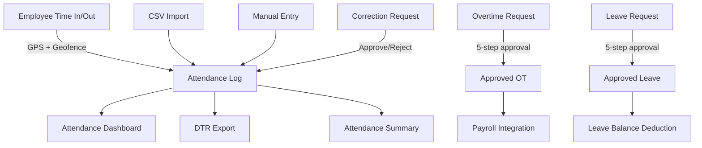

# Attendance/Leave Module -- Gap Analysis and Audit

## Executive Summary

The Attendance/Leave module is the **most mature and well-secured module** in the entire Ogami ERP codebase. It has comprehensive authorization (53 checks across 7 controllers), proper SoD enforcement via middleware, multi-step approval workflows, batch operations, GPS time clock with geofencing, and correction request workflows.

**No critical bugs found.** The `_err` pattern was already fixed globally in PR #73. No significant gaps require code changes.

---

## Module Architecture

---

## Authorization Coverage: Excellent

| Controller | Auth Checks | Method |
|-----------|------------|--------|
| AttendanceLogController | 6 | `$this->authorize()` |
| OvertimeRequestController | 19 | `$this->authorize()` |
| AttendanceImportController | 2 | `$this->authorize()` |
| AttendanceTimeController | 5 | `abort_unless()` |
| AttendanceCorrectionController | 4 | `abort_unless()` |
| WorkLocationController | 4 | `abort_unless()` |
| LeaveRequestController | 16 | `$this->authorize()` |
| **Total** | **53** | |

---

## SoD Enforcement: Comprehensive

- Leave: head_approve, manager_check, ga_process, vp_note -- all with `sod:` middleware
- OT: supervisor_endorse, head_endorse, approve, executive_approve, officer_review, vp_approve -- all with `sod:` middleware
- Submitter cannot approve their own requests

---

## Minor Observations (Not Bugs)

### OBS-01: Duplicate calendar route in leave.php
- **Location**: [`leave.php:79`](routes/api/v1/leave.php:79) and [`leave.php:123`](routes/api/v1/leave.php:123)
- **Problem**: Two `Route::get('calendar', ...)` routes exist. The second one (Phase 4 calendar service) overrides the first (controller method). This is not a bug per se, but the first route is dead code.
- **Impact**: None -- the second route works correctly.
- **Fix**: Remove the first duplicate calendar route (line 79) or consolidate.

### OBS-02: No edit capability for leave requests
- **Problem**: Leave requests can be created and cancelled but not edited. Once submitted, details cannot be changed.
- **Impact**: Low -- users can cancel and re-file. This is standard for approval workflows.
- **Fix**: Optional -- add edit for draft/pending status.

### OBS-03: No edit for overtime requests
- **Problem**: Same as leave -- OT requests cannot be edited after creation.
- **Impact**: Low -- cancel and re-file workflow works.

### OBS-04: Attendance correction requests have no frontend page
- **Problem**: Backend has full correction request workflow (create, submit, approve, reject) but I don't see a dedicated CorrectionRequestsPage in the frontend. Users may not be able to access the correction workflow.
- **Impact**: Medium -- the dashboard may show corrections, but there's no dedicated management view.
- **Fix**: Consider adding a CorrectionRequestsPage.

---

## Verdict

**No PR needed.** The Attendance/Leave module is production-ready with excellent authorization, SoD enforcement, batch operations, and error handling. The only minor observation (OBS-04 -- correction requests page) is a nice-to-have feature addition, not a bug or gap.
