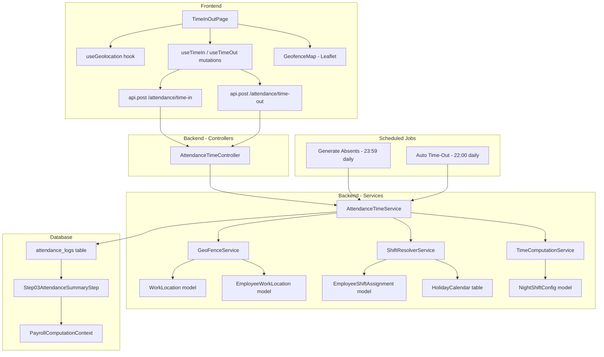
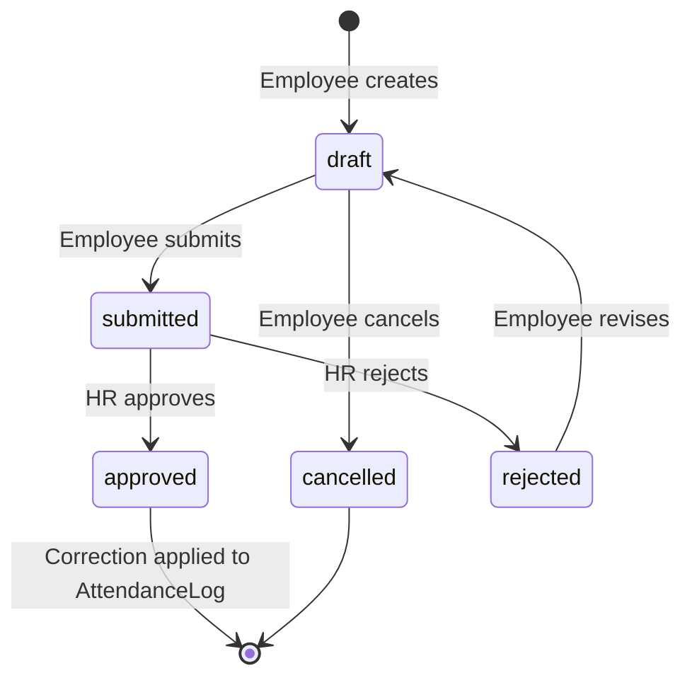

# Attendance Time In/Out Module (Location-Based) - Implementation Plan

## Discovery Summary

### Phase 0A - Existing Attendance Domain Inventory

| Component | Exists? | Path | Notes |
|---|---|---|---|
| Attendance domain directory | YES | `app/Domains/Attendance/` | Models, Services, Policies, StateMachines |
| AttendanceLog model | YES | `app/Domains/Attendance/Models/AttendanceLog.php` | Boolean flags - no status enum, no geo columns, no ulid |
| ShiftSchedule model | YES | `app/Domains/Attendance/Models/ShiftSchedule.php` | Has start_time, end_time, grace_period_minutes, is_flexible, is_night_shift, work_days |
| EmployeeShiftAssignment | YES | `app/Domains/Attendance/Models/EmployeeShiftAssignment.php` | effective_from/to with EXCLUDE USING gist |
| OvertimeRequest + StateMachine | YES | `app/Domains/Attendance/Models/OvertimeRequest.php` | Full multi-step workflow |
| AttendanceProcessingService | YES | `app/Domains/Attendance/Services/AttendanceProcessingService.php` | Processes biometric/CSV, applies ATT-001 through ATT-006 |
| AnomalyResolutionService | YES | `app/Domains/Attendance/Services/AnomalyResolutionService.php` | Resolves missing clock-outs, duplicates |
| AttendanceImportService | YES | `app/Domains/Attendance/Services/AttendanceImportService.php` | CSV import pipeline |
| TimesheetApproval model | YES | `app/Domains/Attendance/Models/TimesheetApproval.php` | Has ulid + SoftDeletes |
| Work Location / Site model | **NO** | - | Must create |
| Geofence / Location config | **NO** | - | Must create |
| Existing attendance routes | YES | `routes/api/v1/attendance.php` | Logs CRUD, import, OT workflow, shifts |
| Frontend pages | YES | Multiple | HR list, import, dashboard, employee self-service, team views |
| Frontend hooks | YES | `frontend/src/hooks/useAttendance.ts` | TanStack Query hooks for logs, OT, shifts |
| Attendance seeder | YES | `database/seeders/SampleAttendanceJanFeb2026Seeder.php` | Creates logs for active employees |

### Phase 0B - Integration Points

| Integration | Exists? | Path | How It Works |
|---|---|---|---|
| Payroll Step03 reads attendance | YES | `app/Domains/Payroll/Pipeline/Step03AttendanceSummaryStep.php` | Reads `is_present`, iterates logs for tardiness/OT/night diff |
| Leave approval marks attendance | YES | `app/Listeners/Attendance/RecordLeaveAttendanceCorrection.php` | Creates log with is_present=true, worked_minutes=480, source=leave_correction |
| Holiday calendar | YES | `database/migrations/..._create_holiday_calendars_table.php` | REGULAR, SPECIAL_NON_WORKING, SPECIAL_WORKING |
| Employee to ShiftSchedule | YES | `EmployeeShiftAssignment` model | Date-range based with DB gist constraint |
| Department to Work Location | **NO** | - | Must design |
| Geolocation utilities | **NO** | - | No haversine, PostGIS, Leaflet, or maps anywhere |

### Phase 0C - Critical Architecture Decisions

**Decision 1: Extend existing `attendance_logs` table, do NOT replace it.**

The existing table uses boolean flags (`is_present`, `is_absent`, `is_rest_day`, `is_holiday`) and computed integer columns (`late_minutes`, `worked_minutes`, etc.). Step03, dashboards, and seeders all depend on these exact columns. We add geo columns and a new `source` type via ALTER migration.

**Decision 2: Add `source = 'web_clock'` to the CHECK constraint.**

Current valid sources: `biometric`, `csv_import`, `manual`, `system`. The leave listener uses `leave_correction` which violates the constraint - need to verify. Add `web_clock` for the new time-in/out feature.

**Decision 3: Keep boolean flags, NOT a status enum.**

The task spec proposes an `AttendanceStatus` enum with 13 values. However, the existing system uses boolean flags that Step03 and all dashboards read. Introducing a status enum would require rewriting Step03, all dashboard queries, the leave listener, and all seeders. Instead:
- Keep `is_present`, `is_absent`, `is_rest_day`, `is_holiday` booleans
- Add an `attendance_status` string column alongside for richer status display in the new UI
- The `AttendanceStatus` enum drives the new column but the booleans remain the source of truth for payroll

**Decision 4: Fix the `tardiness_minutes` vs `late_minutes` field name mismatch.**

Step03 reads `$log->tardiness_minutes` but the DB column is `late_minutes`. Since there is no accessor, `tardiness_minutes` resolves to `null` and `?? 0` makes it always 0. This is a pre-existing bug. Options:
- Add an accessor `getTardinessMinutesAttribute()` on AttendanceLog that returns `late_minutes` -- safest fix
- OR rename the column -- too risky, too many references

**Decision 5: No Leaflet in the project -- use Leaflet for geofence maps.**

No mapping library exists in the frontend. Leaflet is free, lightweight, and works well with OpenStreetMap tiles - no API key needed. Add `leaflet` + `react-leaflet` packages.

---

## Implementation Plan

### Phase 2: Database Migrations

#### Migration 1: `create_work_locations_table`

New table in `app/Domains/Attendance/`:

```
work_locations
  id, ulid (unique)
  name (string 100)
  code (string 20, unique)
  address (text)
  city (string 100, nullable)
  latitude (decimal 10,7)
  longitude (decimal 10,7)
  radius_meters (unsignedInteger, default 100)
  allowed_variance_meters (unsignedSmallInteger, default 20)
  is_remote_allowed (boolean, default false)
  is_active (boolean, default true)
  timestamps, softDeletes
  CHECK constraint on radius_meters BETWEEN 10 AND 5000
```

#### Migration 2: `create_employee_work_locations_table`

```
employee_work_locations
  id
  employee_id (FK employees, cascadeOnDelete)
  work_location_id (FK work_locations, restrictOnDelete)
  effective_date (date)
  end_date (date, nullable)
  is_primary (boolean, default true)
  assigned_by (FK users, nullable)
  timestamps
  UNIQUE(employee_id, work_location_id, effective_date)
  CHECK(end_date IS NULL OR end_date > effective_date)
```

#### Migration 3: `add_geolocation_columns_to_attendance_logs`

Add columns to existing `attendance_logs` table:

```
-- Geo columns for time-in
time_in_latitude (decimal 10,7, nullable)
time_in_longitude (decimal 10,7, nullable)
time_in_accuracy_meters (decimal 8,2, nullable)
time_in_distance_meters (decimal 10,2, nullable)
time_in_within_geofence (boolean, nullable)
time_in_device_info (jsonb, nullable)
time_in_override_reason (text, nullable)

-- Geo columns for time-out
time_out_latitude (decimal 10,7, nullable)
time_out_longitude (decimal 10,7, nullable)
time_out_accuracy_meters (decimal 8,2, nullable)
time_out_distance_meters (decimal 10,2, nullable)
time_out_within_geofence (boolean, nullable)
time_out_device_info (jsonb, nullable)
time_out_override_reason (text, nullable)

-- Location reference
work_location_id (FK work_locations, nullable, nullOnDelete)

-- Richer status for new UI (alongside existing boolean flags)
attendance_status (string 30, nullable)

-- Flagging
is_flagged (boolean, default false)
flag_reason (text, nullable)

-- Correction audit trail
correction_note (text, nullable)
corrected_by (FK users, nullable)
corrected_at (timestamp, nullable)

-- Update source CHECK constraint to include 'web_clock' and 'leave_correction'
```

#### Migration 4: `create_attendance_correction_requests_table`

```
attendance_correction_requests
  id, ulid (unique)
  attendance_log_id (FK attendance_logs)
  employee_id (FK employees)
  correction_type (string 20) -- time_in|time_out|status|both
  requested_time_in (timestamp, nullable)
  requested_time_out (timestamp, nullable)
  requested_remarks (text, nullable)
  reason (text)
  supporting_document_path (string, nullable)
  status (string 20, default 'draft') -- draft|submitted|approved|rejected|cancelled
  reviewed_by (FK users, nullable)
  reviewed_at (timestamp, nullable)
  review_remarks (text, nullable)
  timestamps, softDeletes
  CHECK(status IN ...)
  CHECK(correction_type IN ...)
```

#### Migration 5: `create_night_shift_configs_table`

```
night_shift_configs
  id
  night_start_time (time, default '22:00:00')
  night_end_time (time, default '06:00:00')
  differential_rate_bps (unsignedSmallInteger, default 1000) -- 10% in basis points
  effective_date (date)
  timestamps
  UNIQUE(effective_date)
```

### Phase 3: Backend - Models, Enums, Services

#### 3.1 Enums

Create `app/Domains/Attendance/Enums/AttendanceStatus.php`:
- Values: `present`, `late`, `undertime`, `late_and_undertime`, `absent`, `on_leave`, `holiday`, `rest_day`, `overtime_only`, `out_of_office`, `pending`, `corrected`, `no_schedule`
- Methods: `label()`, `color()`, `affectsPayroll()`, `isExcused()`
- This enum drives the new `attendance_status` column for UI display

Create `app/Domains/Attendance/Enums/CorrectionRequestStatus.php`:
- Values: `draft`, `submitted`, `approved`, `rejected`, `cancelled`

Create `app/Domains/Attendance/Enums/CorrectionType.php`:
- Values: `time_in`, `time_out`, `status`, `both`

#### 3.2 Models

Create `app/Domains/Attendance/Models/WorkLocation.php`:
- Uses `HasPublicUlid`, `SoftDeletes`
- Relations: `hasMany(EmployeeWorkLocation)`, `hasMany(AttendanceLog)`

Create `app/Domains/Attendance/Models/EmployeeWorkLocation.php`:
- Relations: `belongsTo(Employee)`, `belongsTo(WorkLocation)`
- Scope: `scopeActiveOn(date)` -- filters by effective_date/end_date range

Create `app/Domains/Attendance/Models/AttendanceCorrectionRequest.php`:
- Uses `HasPublicUlid`, `SoftDeletes`
- Relations: `belongsTo(AttendanceLog)`, `belongsTo(Employee)`, `belongsTo(User, 'reviewed_by')`

Create `app/Domains/Attendance/Models/NightShiftConfig.php`:
- Scope: `scopeEffectiveOn(date)`

Update `app/Domains/Attendance/Models/AttendanceLog.php`:
- Add new fillable columns (geo fields, work_location_id, attendance_status, flagging, correction fields)
- Add new casts
- Add `getTardinessMinutesAttribute()` accessor returning `$this->late_minutes` -- fixes Step03 bug
- Add relations: `belongsTo(WorkLocation)`, `hasMany(AttendanceCorrectionRequest)`
- Add `workedHoursFormatted()` helper

#### 3.3 StateMachines

Create `app/Domains/Attendance/StateMachines/CorrectionRequestStateMachine.php`:

```
TRANSITIONS:
  draft     -> [submitted, cancelled]
  submitted -> [approved, rejected]
  approved  -> []
  rejected  -> [draft]     // allow resubmission
  cancelled -> []
```

#### 3.4 Services

**GeoFenceService** (`app/Domains/Attendance/Services/GeoFenceService.php`):
- `final class` implements `ServiceContract`
- `distanceMeters(lat1, lon1, lat2, lon2): float` -- Haversine formula, pure PHP
- `validateLocation(Employee, latitude, longitude, Carbon): array` -- returns `[within, distance_meters, location]`
- `resolveWorkLocation(Employee, Carbon): ?WorkLocation` -- finds primary active assignment

**ShiftResolverService** (`app/Domains/Attendance/Services/ShiftResolverService.php`):
- `final class` implements `ServiceContract`
- `resolve(Employee, string date): ?ShiftSchedule` -- uses existing `EmployeeShiftAssignment` lookup
- `isRestDay(Employee, string date): bool` -- checks `ShiftSchedule->work_days` against date's ISO weekday
- `isHoliday(string date): ?HolidayCalendar` -- queries `holiday_calendars` table

**TimeComputationService** (`app/Domains/Attendance/Services/TimeComputationService.php`):
- `final class` implements `ServiceContract`
- `compute(AttendanceLog): array` -- returns all derived fields
- Computes: `worked_minutes`, `late_minutes`, `undertime_minutes`, `overtime_minutes`, `night_diff_minutes`
- Sets boolean flags: `is_present`, `is_absent` for backward compatibility
- Sets `attendance_status` for the new enum-based status
- Night diff calculation reads from `NightShiftConfig` table, not hardcoded
- Handles night shifts crossing midnight

**AttendanceTimeService** (`app/Domains/Attendance/Services/AttendanceTimeService.php`):
- `final class` implements `ServiceContract`
- Constructor injects: `GeoFenceService`, `TimeComputationService`, `ShiftResolverService`

Methods:
- `timeIn(Employee, latitude, longitude, accuracyMeters, deviceInfo, ?overrideReason): AttendanceLog`
  - `DB::transaction` with `lockForUpdate` to prevent duplicate time-in
  - Validates shift exists for today
  - Validates geofence via GeoFenceService
  - If outside geofence and no override reason, throws `OUTSIDE_GEOFENCE` DomainException
  - Creates/updates AttendanceLog with source='web_clock', geo data
  - Sets `attendance_status = 'pending'`
  - Flags record if outside geofence

- `timeOut(Employee, latitude, longitude, accuracyMeters, deviceInfo, ?overrideReason): AttendanceLog`
  - `DB::transaction` with `lockForUpdate`
  - Validates time_in exists, time_out does not
  - Validates geofence
  - Calls `TimeComputationService::compute()` to fill all derived fields
  - Updates boolean flags AND attendance_status

- `generateAbsentRecords(Carbon date): int`
  - Idempotent -- skips if record exists
  - Checks leave, holiday, rest day before marking absent

- `autoTimeOut(Carbon cutoffTime): int`
  - Finds all logs where time_in is set but time_out is null and time_in is more than X hours ago
  - Sets time_out to cutoff time, flags record, computes fields

**AttendanceCorrectionService** (`app/Domains/Attendance/Services/AttendanceCorrectionService.php`):
- `final class` implements `ServiceContract`
- `submit(Employee, AttendanceCorrectionRequest): AttendanceCorrectionRequest`
- `approve(AttendanceCorrectionRequest, User): AttendanceCorrectionRequest` -- applies correction, recomputes fields
- `reject(AttendanceCorrectionRequest, User, remarks): AttendanceCorrectionRequest`

### Phase 4: Backend - Controllers, Routes, Requests, Policies

#### 4.1 Controllers

Create `app/Http/Controllers/Attendance/AttendanceTimeController.php`:
- `timeIn(TimeInRequest)` -- calls `AttendanceTimeService::timeIn()`
- `timeOut(TimeOutRequest)` -- calls `AttendanceTimeService::timeOut()`
- `today(Request)` -- returns employee's attendance log for today
- `myLogs(Request)` -- returns paginated own attendance history

Create `app/Http/Controllers/Attendance/AttendanceCorrectionController.php`:
- Standard CRUD + `submit()`, `approve()`, `reject()` actions

Create `app/Http/Controllers/Attendance/WorkLocationController.php`:
- Standard apiResource CRUD
- `nearby(Request)` -- returns work locations sorted by distance from given lat/lon

Create `app/Http/Controllers/Attendance/EmployeeWorkLocationController.php`:
- `show(Employee)` -- current assignment
- `assign(Employee, Request)` -- create/update assignment

#### 4.2 Form Requests

`TimeInRequest` / `TimeOutRequest`:
```
latitude:        required|numeric|between:-90,90
longitude:       required|numeric|between:-180,180
accuracy_meters: required|numeric|min:0|max:1000
device_info:     nullable|array
override_reason: nullable|string|max:500
```

`StoreCorrectionRequest`:
```
attendance_log_id: required|exists:attendance_logs,id
correction_type:   required|in:time_in,time_out,status,both
requested_time_in: nullable|date|required_if:correction_type,time_in,both
requested_time_out:nullable|date|required_if:correction_type,time_out,both
reason:            required|string|min:10|max:1000
supporting_document: nullable|file|mimes:pdf,jpg,png|max:5120
```

`StoreWorkLocationRequest`:
```
name:             required|string|max:100
code:             required|string|max:20|unique:work_locations,code
address:          required|string
latitude:         required|numeric|between:-90,90
longitude:        required|numeric|between:-180,180
radius_meters:    required|integer|min:10|max:5000
is_remote_allowed:boolean
allowed_variance_meters: nullable|integer|min:0|max:200
```

#### 4.3 Routes

Append to `routes/api/v1/attendance.php`:

```
// Employee self-service time clock
POST   /time-in                    -> AttendanceTimeController@timeIn
POST   /time-out                   -> AttendanceTimeController@timeOut
GET    /today                      -> AttendanceTimeController@today
GET    /my-logs                    -> AttendanceTimeController@myLogs

// Correction requests
GET    /correction-requests        -> AttendanceCorrectionController@index
POST   /correction-requests        -> AttendanceCorrectionController@store
GET    /correction-requests/{ulid} -> AttendanceCorrectionController@show
POST   /correction-requests/{ulid}/submit  -> @submit
POST   /correction-requests/{ulid}/approve -> @approve (permission gated)
POST   /correction-requests/{ulid}/reject  -> @reject (permission gated)

// Work locations (admin)
apiResource /work-locations        -> WorkLocationController (permission gated)

// Employee work location assignment
GET    /employees/{ulid}/work-location     -> EmployeeWorkLocationController@show
POST   /employees/{ulid}/work-location     -> EmployeeWorkLocationController@assign

// HR actions
POST   /generate-absents           -> AttendanceLogController@generateAbsents
```

#### 4.4 Policies

Create `app/Domains/Attendance/Policies/AttendanceCorrectionPolicy.php`
Create `app/Domains/Attendance/Policies/WorkLocationPolicy.php`

Update `app/Domains/Attendance/Policies/AttendanceLogPolicy.php` -- add `timeIn`, `timeOut` ability checks

### Phase 5: Scheduled Jobs, Notifications, Permissions

#### 5.1 Permissions to Add

Add to `RolePermissionSeeder`:
```
attendance.time_clock           -- employee: time in/out for self
attendance.corrections.submit   -- employee: submit correction request
attendance.corrections.review   -- HR: approve/reject corrections
attendance.work_locations.manage -- admin: CRUD work locations
attendance.work_locations.assign -- HR: assign employees to locations
```

Role mapping:
- Staff/Employee: `attendance.time_clock`, `attendance.corrections.submit`
- HR Officer: all attendance.* except work_locations.manage
- HR Manager: all attendance.*
- Admin: all attendance.*

#### 5.2 Scheduled Jobs

Register in `routes/console.php` or `bootstrap/app.php`:

1. **Generate absent records** -- daily at 23:59
   ```php
   Schedule::call(fn() => app(AttendanceTimeService::class)
       ->generateAbsentRecords(today()))
       ->dailyAt('23:59')->withoutOverlapping();
   ```

2. **Auto time-out** -- daily at 22:00
   ```php
   Schedule::call(fn() => app(AttendanceTimeService::class)
       ->autoTimeOut(now()))
       ->dailyAt('22:00')->withoutOverlapping();
   ```

#### 5.3 Notifications

Create using `::fromModel()` pattern:

| Event | Class | Recipient | Channel |
|---|---|---|---|
| Time-in confirmed | `TimeInConfirmedNotification` | Employee | database |
| Time-in outside geofence | `GeofenceViolationNotification` | Employee + HR | database |
| Time-out + summary | `TimeOutConfirmedNotification` | Employee | database |
| Auto time-out applied | `AutoTimeOutNotification` | Employee | database, mail |
| Correction submitted | `CorrectionSubmittedNotification` | HR | database |
| Correction approved | `CorrectionDecidedNotification` | Employee | database, mail |
| Correction rejected | `CorrectionDecidedNotification` | Employee | database, mail |

### Phase 6: Payroll Step03 Integration

**Bug fix**: Add accessor to `AttendanceLog`:
```php
public function getTardinessMinutesAttribute(): int
{
    return $this->late_minutes ?? 0;
}
```

This makes `$log->tardiness_minutes` (which Step03 reads) return the actual `late_minutes` column value. No changes needed in Step03 itself.

**Verify**: After adding the accessor, run the payroll golden suite:
```bash
./vendor/bin/pest tests/Unit/Payroll/
```

All existing tests must still pass. The accessor is additive -- it doesn't change existing behavior for code that reads `late_minutes` directly.

### Phase 7: Frontend - Core Time In/Out

#### 7.1 Install Dependencies

```bash
cd frontend && pnpm add leaflet react-leaflet @types/leaflet
```

#### 7.2 New Hooks

`frontend/src/hooks/useGeolocation.ts`:
- State: `latitude`, `longitude`, `accuracy`, `status` (idle/requesting/granted/denied/unavailable/timeout), `error`
- `requestLocation()` callback using `navigator.geolocation.getCurrentPosition`
- Options: `enableHighAccuracy: true`, `timeout: 10000`, `maximumAge: 30000`

Add to `frontend/src/hooks/useAttendance.ts`:
```typescript
// Time clock hooks
useToday()            -- GET /attendance/today, refetchInterval: 60s
useTimeIn()           -- POST /attendance/time-in, invalidates today + my-logs
useTimeOut()          -- POST /attendance/time-out, invalidates today + my-logs

// Correction hooks
useCorrectionRequests(filters)
useSubmitCorrection()
useApproveCorrectionRequest()
useRejectCorrectionRequest()

// Work location hooks
useWorkLocations()
useCreateWorkLocation()
useUpdateWorkLocation()
```

#### 7.3 New Types

Add to `frontend/src/types/hr.ts`:
```typescript
interface TimeInOutPayload {
  latitude: number
  longitude: number
  accuracy_meters: number
  device_info?: Record<string, unknown>
  override_reason?: string
}

interface WorkLocation {
  id: number
  ulid: string
  name: string
  code: string
  address: string
  latitude: number
  longitude: number
  radius_meters: number
  is_remote_allowed: boolean
  allowed_variance_meters: number
  is_active: boolean
}

interface AttendanceCorrectionRequest {
  id: number
  ulid: string
  attendance_log_id: number
  employee_id: number
  correction_type: 'time_in' | 'time_out' | 'status' | 'both'
  requested_time_in?: string
  requested_time_out?: string
  reason: string
  status: 'draft' | 'submitted' | 'approved' | 'rejected' | 'cancelled'
  reviewed_by?: number
  reviewed_at?: string
  review_remarks?: string
}
```

#### 7.4 New Pages

`frontend/src/pages/employee/TimeInOutPage.tsx`:
- The main "punch clock" page
- Shows: date, employee info, shift info, geofence map, today's log, TIME IN/OUT button
- States: no-shift, requesting-location, within-geofence, outside-geofence, timed-in, timed-out
- Live duration counter when timed in
- Override reason input when outside geofence

`frontend/src/components/attendance/GeofenceMap.tsx`:
- Leaflet map component
- Shows work location marker + radius circle
- Shows employee's current position
- Color coding: green if within, red if outside
- Distance label between points

`frontend/src/components/attendance/AttendanceStatusBadge.tsx`:
- Color-coded badge component for `attendance_status` enum values
- Reusable across list views, calendar, detail panels

#### 7.5 Route Registration

Add to `frontend/src/router/index.tsx`:
```typescript
{ path: '/me/time-clock', element: withSuspense(guard('attendance.time_clock', <TimeInOutPage />)) }
```

Add to sidebar in `frontend/src/components/layout/AppLayout.tsx`:
- Self-service section: "Time Clock" link with Clock icon

### Phase 8: Frontend - Correction Flow, Work Locations, Enhanced Views

`frontend/src/pages/employee/CorrectionRequestPage.tsx`:
- Form to submit correction: type selector, time inputs, reason textarea, file upload
- List of own correction requests with status badges

`frontend/src/pages/hr/attendance/CorrectionReviewPage.tsx`:
- HR queue of pending corrections
- Detail view: original log vs requested changes, diff highlight
- Approve/Reject with remarks

`frontend/src/pages/hr/attendance/WorkLocationsPage.tsx`:
- Admin CRUD for work locations
- Leaflet map with draggable marker + radius circle
- Employee assignment panel

Enhance existing `frontend/src/pages/employee/MyAttendancePage.tsx`:
- Add `attendance_status` badge column
- Add geofence indicator column
- Add "Request Correction" button per row
- Link to Time Clock page

### Phase 9: Tests

#### Feature Tests

`tests/Feature/Attendance/TimeInOutTest.php`:
- employee can time in within geofence
- time in records correct lat/lon/accuracy/distance
- employee cannot time in twice on same day (ALREADY_TIMED_IN)
- time in outside geofence without reason throws OUTSIDE_GEOFENCE
- time in outside geofence with reason succeeds, sets is_flagged=true
- employee without shift throws NO_SHIFT_ASSIGNED
- employee can time out after time in
- time out computes late_minutes correctly (15min late scenario)
- time out computes undertime_minutes correctly (30min early)
- time out computes night_diff_minutes correctly
- cannot time out without timing in (NOT_TIMED_IN)
- cannot time out twice (ALREADY_TIMED_OUT)

`tests/Feature/Attendance/CorrectionRequestTest.php`:
- employee can submit correction request
- HR can approve correction and attendance log is updated
- HR can reject correction with remarks
- approved correction recomputes late/undertime minutes
- state machine transitions enforced

`tests/Feature/Attendance/GeoFenceTest.php`:
- location within radius returns within=true
- location outside radius returns within=false with correct distance
- location at exact boundary returns within=true
- employee with no work location assigned skips geofence
- remote-allowed location always returns within=true
- GPS variance tolerance applied correctly

`tests/Feature/Attendance/AbsentGenerationTest.php`:
- absent records generated for no-shows
- employee on approved leave NOT marked absent
- employee on holiday NOT marked absent
- employee on rest day NOT marked absent
- idempotent: no duplicates if run twice

`tests/Unit/Attendance/TimeComputationTest.php`:
- tardiness computed correctly for various late scenarios
- zero tardiness within grace period
- undertime computed correctly
- night shift crossing midnight handled
- night diff minutes for partial overlap
- night diff zero for pure day shift

`tests/Unit/Attendance/TardinessMinutesAccessorTest.php`:
- accessor returns late_minutes value
- Step03 reads correct value through accessor

#### Test Conventions
- Always PostgreSQL (ogami_erp_test)
- Seed RBAC first: `$this->artisan('db:seed', ['--class' => 'RolePermissionSeeder'])`
- Use custom expectations: `->toBeDomainError('OUTSIDE_GEOFENCE')`
- Philippine coordinates for test data: Metro Manila area ~14.5995N, 120.9842E

### Phase 10: Seeder

`database/seeders/AttendanceTimeInOutSeeder.php`:
- Create 3 work locations (Main Office, Factory Floor, Warehouse) with Metro Manila coordinates
- Assign all active employees to their primary work location
- Create 1 `NightShiftConfig` record (22:00-06:00, 10%)
- Generate 30 days of web_clock attendance logs with realistic geo data
- Mix: 70% present, 10% late, 5% undertime, 5% absent, 5% on_leave, 5% flagged
- Create 5 correction requests (2 approved, 2 pending, 1 rejected)

---

## Architecture Diagram



## Correction Request Flow



## File Inventory - New Files to Create

### Backend (PHP)
| File | Type |
|---|---|
| `database/migrations/..._create_work_locations_table.php` | Migration |
| `database/migrations/..._create_employee_work_locations_table.php` | Migration |
| `database/migrations/..._add_geolocation_to_attendance_logs.php` | Migration |
| `database/migrations/..._create_attendance_correction_requests_table.php` | Migration |
| `database/migrations/..._create_night_shift_configs_table.php` | Migration |
| `app/Domains/Attendance/Enums/AttendanceStatus.php` | Enum |
| `app/Domains/Attendance/Enums/CorrectionRequestStatus.php` | Enum |
| `app/Domains/Attendance/Enums/CorrectionType.php` | Enum |
| `app/Domains/Attendance/Models/WorkLocation.php` | Model |
| `app/Domains/Attendance/Models/EmployeeWorkLocation.php` | Model |
| `app/Domains/Attendance/Models/AttendanceCorrectionRequest.php` | Model |
| `app/Domains/Attendance/Models/NightShiftConfig.php` | Model |
| `app/Domains/Attendance/Services/GeoFenceService.php` | Service |
| `app/Domains/Attendance/Services/ShiftResolverService.php` | Service |
| `app/Domains/Attendance/Services/TimeComputationService.php` | Service |
| `app/Domains/Attendance/Services/AttendanceTimeService.php` | Service |
| `app/Domains/Attendance/Services/AttendanceCorrectionService.php` | Service |
| `app/Domains/Attendance/StateMachines/CorrectionRequestStateMachine.php` | StateMachine |
| `app/Domains/Attendance/Policies/AttendanceCorrectionPolicy.php` | Policy |
| `app/Domains/Attendance/Policies/WorkLocationPolicy.php` | Policy |
| `app/Http/Controllers/Attendance/AttendanceTimeController.php` | Controller |
| `app/Http/Controllers/Attendance/AttendanceCorrectionController.php` | Controller |
| `app/Http/Controllers/Attendance/WorkLocationController.php` | Controller |
| `app/Http/Controllers/Attendance/EmployeeWorkLocationController.php` | Controller |
| `app/Http/Requests/Attendance/TimeInRequest.php` | FormRequest |
| `app/Http/Requests/Attendance/TimeOutRequest.php` | FormRequest |
| `app/Http/Requests/Attendance/StoreCorrectionRequest.php` | FormRequest |
| `app/Http/Requests/Attendance/StoreWorkLocationRequest.php` | FormRequest |
| `app/Http/Resources/Attendance/WorkLocationResource.php` | Resource |
| `app/Http/Resources/Attendance/CorrectionRequestResource.php` | Resource |
| `app/Notifications/TimeInConfirmedNotification.php` | Notification |
| `app/Notifications/TimeOutConfirmedNotification.php` | Notification |
| `app/Notifications/GeofenceViolationNotification.php` | Notification |
| `app/Notifications/AutoTimeOutNotification.php` | Notification |
| `app/Notifications/CorrectionSubmittedNotification.php` | Notification |
| `app/Notifications/CorrectionDecidedNotification.php` | Notification |
| `database/seeders/AttendanceTimeInOutSeeder.php` | Seeder |

### Backend (Modify)
| File | Change |
|---|---|
| `app/Domains/Attendance/Models/AttendanceLog.php` | Add geo fillables, casts, accessor, relations |
| `routes/api/v1/attendance.php` | Add time-clock, correction, work-location routes |
| `app/Providers/AppServiceProvider.php` | Register new policies |
| `database/seeders/RolePermissionSeeder.php` | Add new permissions |
| `routes/console.php` or `bootstrap/app.php` | Register scheduled jobs |

### Frontend (TypeScript/React)
| File | Type |
|---|---|
| `frontend/src/hooks/useGeolocation.ts` | Hook |
| `frontend/src/pages/employee/TimeInOutPage.tsx` | Page |
| `frontend/src/pages/employee/CorrectionRequestPage.tsx` | Page |
| `frontend/src/pages/hr/attendance/CorrectionReviewPage.tsx` | Page |
| `frontend/src/pages/hr/attendance/WorkLocationsPage.tsx` | Page |
| `frontend/src/components/attendance/GeofenceMap.tsx` | Component |
| `frontend/src/components/attendance/AttendanceStatusBadge.tsx` | Component |

### Frontend (Modify)
| File | Change |
|---|---|
| `frontend/src/hooks/useAttendance.ts` | Add time-clock, correction, work-location hooks |
| `frontend/src/types/hr.ts` | Add TimeInOut, WorkLocation, CorrectionRequest types |
| `frontend/src/router/index.tsx` | Add new routes |
| `frontend/src/components/layout/AppLayout.tsx` | Add Time Clock to sidebar |
| `frontend/src/pages/employee/MyAttendancePage.tsx` | Add status badge, correction link |

### Tests
| File | Type |
|---|---|
| `tests/Feature/Attendance/TimeInOutTest.php` | Feature |
| `tests/Feature/Attendance/CorrectionRequestTest.php` | Feature |
| `tests/Feature/Attendance/GeoFenceTest.php` | Feature |
| `tests/Feature/Attendance/AbsentGenerationTest.php` | Feature |
| `tests/Unit/Attendance/TimeComputationTest.php` | Unit |
| `tests/Unit/Attendance/TardinessMinutesAccessorTest.php` | Unit |

## Build Order

1. Migrations (in FK dependency order)
2. Enums
3. Models (WorkLocation -> EmployeeWorkLocation -> NightShiftConfig -> update AttendanceLog -> AttendanceCorrectionRequest)
4. StateMachines
5. Services (GeoFenceService -> ShiftResolverService -> TimeComputationService -> AttendanceTimeService -> AttendanceCorrectionService)
6. Form Requests
7. Resources
8. Controllers
9. Routes
10. Policies + register in AppServiceProvider
11. Permissions seeder update
12. Notifications
13. Scheduled jobs
14. Run `./vendor/bin/pest` -- all tests must pass
15. Frontend: install leaflet, add types
16. Frontend: useGeolocation hook
17. Frontend: useAttendance hook additions
18. Frontend: GeofenceMap component
19. Frontend: AttendanceStatusBadge component
20. Frontend: TimeInOutPage
21. Frontend: Router + sidebar updates
22. Frontend: CorrectionRequestPage + CorrectionReviewPage
23. Frontend: WorkLocationsPage
24. Frontend: Enhance MyAttendancePage
25. Run `cd frontend && pnpm typecheck && pnpm lint`
26. Write tests
27. Run `./vendor/bin/pest` -- all tests pass
28. Seeder
29. Architecture coherence checklist
