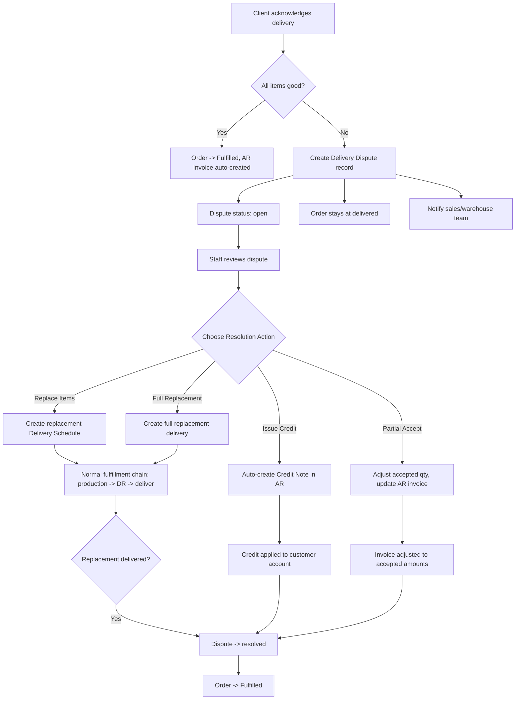

# Delivery Dispute Resolution Workflow -- Full Plan

## Overview

When a client reports damaged, missing, or incorrect items during delivery acknowledgment, the system creates a structured dispute process with concrete resolution actions that trigger real business processes.

## Flow Diagram



## Data Model

### New Table: `delivery_disputes`

```
delivery_disputes
  id                    BIGSERIAL PRIMARY KEY
  ulid                  CHAR 26 NOT NULL UNIQUE
  dispute_reference     VARCHAR 30 NOT NULL UNIQUE  -- DDP-2026-00001
  delivery_schedule_id  BIGINT FK delivery_schedules
  client_order_id       BIGINT FK client_orders
  customer_id           BIGINT FK customers
  delivery_receipt_id   BIGINT FK delivery_receipts NULLABLE
  reported_by_id        BIGINT FK users  -- the client user
  assigned_to_id        BIGINT FK users NULLABLE
  status                VARCHAR 30 DEFAULT open
  resolution_type       VARCHAR 30 NULLABLE  -- replace_items, credit_note, partial_accept, full_replacement
  resolution_notes      TEXT NULLABLE
  resolved_by_id        BIGINT FK users NULLABLE
  resolved_at           TIMESTAMPTZ NULLABLE
  -- linked records created during resolution
  replacement_schedule_id   BIGINT FK delivery_schedules NULLABLE
  credit_note_id            BIGINT FK customer_credit_notes NULLABLE
  timestamps
  soft_deletes

  CHECK status IN: open, investigating, pending_resolution, resolved, closed
  CHECK resolution_type IN: replace_items, credit_note, partial_accept, full_replacement
```

### New Table: `delivery_dispute_items`

```
delivery_dispute_items
  id                    BIGSERIAL PRIMARY KEY
  delivery_dispute_id   BIGINT FK delivery_disputes
  item_master_id        BIGINT FK item_masters
  expected_qty          DECIMAL 12,4
  received_qty          DECIMAL 12,4
  condition             VARCHAR 20  -- good, damaged, missing, wrong_item
  notes                 TEXT NULLABLE
  resolution_action     VARCHAR 30 NULLABLE  -- replace, credit, accept
  resolution_qty        DECIMAL 12,4 NULLABLE  -- qty to replace or credit
  timestamps
```

### Why a separate table instead of CRM tickets?

- **Structured data**: Disputes need per-item tracking with quantities, conditions, and resolution actions. Tickets are free-text threads.
- **Business logic**: Resolution actions trigger other modules -- delivery schedules, credit notes, invoice adjustments. Tickets cannot do this.
- **Reporting**: You need to track dispute rates, resolution times, and common issue types. This requires structured data, not text search in ticket bodies.
- **CRM ticket still created**: A ticket IS auto-created for the communication thread, but the dispute record drives the business process.

## Resolution Actions -- Detailed

### 1. Replace Items

**When**: Items are damaged or missing, and the company has stock or can produce more.

**Process**:
1. Staff selects which disputed items to replace and quantities
2. System creates a new `DeliverySchedule` linked to the same `ClientOrder`
3. If stock available: schedule status = `ready`
4. If no stock: auto-creates a Production Order, schedule status = `in_production`
5. Normal fulfillment chain handles the rest: production -> QC -> DR -> dispatch -> deliver
6. When replacement delivery is acknowledged by client with all items good:
   - Dispute auto-resolves
   - Original order moves to Fulfilled

**Backend calls**:
- `DeliveryScheduleService::createReplacementSchedule(dispute, items)`
- Reuses existing `ClientOrderService::checkAndCreateDraftProductionOrders()` logic

### 2. Issue Credit Note

**When**: Items cannot be replaced -- discontinued product, client doesn't want replacement, or cost of replacement exceeds value.

**Process**:
1. Staff selects which items to credit and quantities
2. System calculates credit amount from the original order item prices * credited quantities
3. System calls `CustomerCreditNoteService::create()` to create a draft credit note
4. Credit note is linked to the original customer invoice via `customer_invoice_id`
5. Staff reviews and posts the credit note -- auto-creates GL journal entry
6. Dispute resolves, order moves to Fulfilled

**Backend calls**:
- `CustomerCreditNoteService::create(customer, data, actor)` -- already exists
- `CustomerCreditNoteService::post(note, actor)` -- already exists, creates GL entry

### 3. Partial Accept

**When**: Client decides to keep what was delivered despite the issues. Maybe a few items have cosmetic damage but are usable.

**Process**:
1. Staff records the accepted quantities per item
2. If the accepted total is less than the original invoice:
   - System creates a credit note for the difference
   - Or adjusts the pending invoice if it hasn't been approved yet
3. Dispute resolves with resolution_type = `partial_accept`
4. Order moves to Fulfilled

### 4. Full Replacement Delivery

**When**: The entire delivery was wrong, severely damaged, or completely missing.

**Process**:
1. Staff creates a full replacement delivery schedule for all items
2. Original DR is marked with a `disputed` flag
3. New fulfillment chain starts from scratch
4. When replacement is delivered and acknowledged, dispute resolves

## Frontend Pages

### Dispute Detail Page -- `/delivery/disputes/{ulid}`

**For company staff**:
- Dispute header: reference, status, customer, order reference, reported date
- Item table: each disputed item with expected qty, received qty, condition, client notes
- Resolution form: dropdown per item (replace / credit / accept) with resolution qty
- Submit resolution button triggers the chosen action
- Communication thread -- embedded CRM ticket messages
- Timeline: created -> investigating -> resolution chosen -> replacement delivered / credit issued -> resolved

**For client portal** -- on order detail page:
- Dispute banner with status
- Per-item condition report they submitted
- Resolution status: "Replacement in progress" / "Credit of PHP X issued" / etc.
- Can add comments through linked ticket

### Company Sidebar Addition

Under Delivery section:
- Delivery Receipts
- Delivery Vehicles
- **Delivery Disputes** -- `/delivery/disputes` (list page with status filters)

## Implementation Steps

### Phase 1: Database + Backend

1. Migration: create `delivery_disputes` and `delivery_dispute_items` tables
2. Model: `DeliveryDispute`, `DeliveryDisputeItem`
3. Service: `DeliveryDisputeService` with:
   - `createFromAcknowledgment()` -- auto-creates when client reports issues
   - `resolveWithReplacement()` -- creates replacement delivery schedule
   - `resolveWithCredit()` -- creates credit note
   - `resolveWithPartialAccept()` -- adjusts quantities + optional credit
4. Auto-create CRM ticket linked to dispute for communication
5. Block Fulfilled transition when open disputes exist

### Phase 2: Frontend

6. Dispute list page `/delivery/disputes` with status filters
7. Dispute detail page with item table and resolution form
8. Client order detail page: dispute banner + status
9. DR detail page: dispute alert when acknowledgment has issues
10. Sidebar link

### Phase 3: Integration

11. Replacement delivery triggers normal fulfillment chain
12. Credit note creation via existing AR service
13. Auto-resolve dispute when replacement delivery is acknowledged
14. Notifications to staff and client at each stage

## Files to Create

| File | Purpose |
|------|---------|
| `database/migrations/..._create_delivery_disputes_table.php` | Tables |
| `app/Domains/Delivery/Models/DeliveryDispute.php` | Model |
| `app/Domains/Delivery/Models/DeliveryDisputeItem.php` | Model |
| `app/Domains/Delivery/Services/DeliveryDisputeService.php` | Business logic |
| `routes/api/v1/delivery.php` | API endpoints |
| `frontend/src/pages/delivery/DeliveryDisputeListPage.tsx` | List page |
| `frontend/src/pages/delivery/DeliveryDisputeDetailPage.tsx` | Detail + resolution |
| `frontend/src/hooks/useDeliveryDisputes.ts` | Hooks |

## Files to Modify

| File | Change |
|------|--------|
| Acknowledgment handler | Auto-create dispute on issues |
| Client order detail page | Show dispute banner |
| DR detail page | Show dispute alert |
| AppLayout sidebar | Add Delivery Disputes link |
| Router | Add dispute routes |
