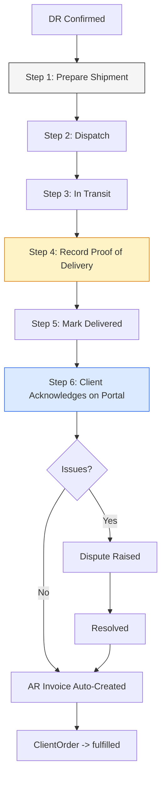

# Delivery Workflow Enhancement and Client Portal Status Sync Fix (v4)

## Problem Summary

1. **Shallow delivery process**: After DR confirmed, the UI is just two one-click buttons: "Dispatch Goods" and "Mark Delivered" -- no vehicle assignment, no driver, no shipment tracking, no proof of delivery, no client acknowledgment.
2. **Client Portal status stuck**: Client sees `approved` even after company delivers. Frontend missing post-approval status mappings.
3. **Redundant CDS layer**: `CombinedDeliverySchedule` duplicates `DeliverySchedule` fields -- already marked deprecated in router but never cleaned up.
4. **Disconnected infrastructure**: `Vehicle`, `Shipment`, `ProofOfDeliveryService` all exist in the codebase but are never wired into the DR workflow.

---

## Current Post-Confirmation Flow (the problem)

```
DR Confirmed
  └── Click "Dispatch Goods" ──→ one-click confirm dialog, no inputs
       └── Click "Mark Delivered" ──→ one-click confirm dialog, no inputs
            └── Done. No POD, no shipment, no tracking, no client notification.
```

## Proposed Post-Confirmation Flow (rich, production-grade)



### Step 1: Prepare Shipment (NEW -- form-based, replaces one-click dispatch)

**When**: DR status = `confirmed`
**What the user does**: Opens "Prepare Shipment" form with:
- **Vehicle selection** -- dropdown from `vehicles` table (plate number, type)
- **Driver name** -- text input (stored on DR `driver_name` field which already exists but is never populated)
- **Carrier** -- text input (for 3PL deliveries)
- **Tracking number** -- auto-generated or manual entry
- **Estimated delivery date** -- date picker
- **Delivery notes** -- textarea

**What happens on submit**:
- Creates a `Shipment` record linked to the DR (status = `pending`)
- Updates DR with `vehicle_id` and `driver_name` (fields already exist on model)
- DR stays in `confirmed` status -- shipment preparation doesn't mean it left yet

**Backend**: New endpoint `POST /delivery/receipts/{dr}/prepare-shipment`
**Frontend**: Replace the one-click "Dispatch Goods" dialog with a proper form modal

### Step 2: Dispatch (enriched -- requires shipment)

**When**: DR status = `confirmed` AND shipment exists
**What the user does**: Clicks "Dispatch" which:
- Shows a summary of the shipment details (vehicle, driver, items)
- Records dispatch timestamp
- Optionally captures gate-out notes

**What happens on submit**:
- DR transitions: `confirmed` -> `dispatched`
- Shipment transitions: `pending` -> `in_transit`
- Shipment `shipped_at` = now()
- Client notification sent with tracking info and ETA
- ClientOrder transitions to `dispatched` (if linked)

**Backend**: Enriched `PATCH /delivery/receipts/{dr}/dispatch` -- requires shipment to exist
**Frontend**: Dispatch button shows shipment summary before confirming

### Step 3: In Transit (tracking updates)

**When**: DR status = `dispatched`
**What the driver/logistics team can do**:
- Update ETA on the shipment
- Add transit notes (e.g., "Delayed due to traffic", "Arrived at client gate")
- Report partial delivery issues

**What the client sees** (on portal):
- Order status shows "In Transit"
- Tracking number and carrier visible
- ETA displayed
- Real-time status from the shipment record

**Backend**: `PATCH /delivery/shipments/{shipment}/update` (already exists via ShipmentService)
**Frontend**: Add transit update form on DR detail page; add tracking display on client portal order detail

### Step 4: Record Proof of Delivery (NEW step -- mandatory before delivered)

**When**: DR status = `dispatched` (goods are at the customer site)
**What the driver/delivery person records**:
- **Receiver name** (required) -- who physically received the goods
- **Receiver designation** -- their role at the client company
- **Digital signature** -- canvas-based signature capture (base64 PNG)
- **Photo of delivered goods** -- camera/upload (base64 JPG)
- **GPS coordinates** -- auto-captured from browser geolocation
- **Delivery notes** -- any observations

**What happens on submit**:
- POD data stored on DR record (fields already exist: `pod_receiver_name`, `pod_signature_path`, `pod_photo_path`, `pod_latitude`, `pod_longitude`, `pod_notes`, `pod_recorded_at`)
- DR does NOT transition yet -- POD is recorded but delivery isn't finalized until confirmed

**Backend**: `POST /delivery/receipts/{dr}/pod` (endpoint already exists in enhancements routes!)
**Frontend**: NEW POD capture form with signature pad, camera, geolocation on DR detail page

### Step 5: Mark Delivered (enriched -- requires POD)

**When**: DR status = `dispatched` AND POD has been recorded
**What happens**:
- DR transitions: `dispatched` -> `delivered`
- Shipment transitions: `in_transit` -> `delivered`
- Shipment `actual_arrival` = now()
- DeliverySchedule synced to `delivered`
- ClientOrder transitions to `delivered`
- Client notification sent: "Your order has been delivered"
- `ShipmentDelivered` event fires (triggers AR invoice auto-draft)

**Guard**: Cannot mark delivered without POD (configurable via `system_settings` key `require_pod_for_delivery`)

**Backend**: Enriched `PATCH /delivery/receipts/{dr}/deliver`
**Frontend**: "Mark Delivered" button only enabled when POD exists; shows POD summary

### Step 6: Client Acknowledges on Portal

**When**: ClientOrder status = `delivered`
**What the client does** (on portal):
- Reviews each delivered item
- Reports condition per item: good / damaged / missing
- Enters received quantities
- Adds notes for any issues
- Submits acknowledgment

**What happens**:
- If all items good: ClientOrder -> `fulfilled`, AR invoice auto-created
- If issues reported: Dispute flagged, sales team notified, resolution required before invoicing

**Backend**: Uses the existing DS acknowledgment logic (migrated from CDS)
**Frontend**: Existing `OrderReceiptPage.tsx` (repointed from CDS to DS)

---

## DR State Machine Changes

### Current (too simple)

```
draft -> confirmed -> dispatched -> delivered
```

### Proposed (with proper intermediate states)

```
draft -> confirmed / cancelled
confirmed -> dispatched / cancelled
dispatched -> in_transit / delivered / partially_delivered / cancelled
in_transit -> delivered / partially_delivered / cancelled       <-- NEW STATE
partially_delivered -> delivered / cancelled
delivered -> []
cancelled -> []
```

Note: `in_transit` is already expected by `ProofOfDeliveryService` (line 44) but never existed in the state machine.

### ClientOrder State Machine (proposed)

```
pending -> negotiating / vp_pending / approved / rejected / cancelled
negotiating -> client_responded / approved / rejected / cancelled
client_responded -> negotiating / vp_pending / approved / rejected / cancelled
vp_pending -> approved / rejected / cancelled
approved -> in_production / cancelled
in_production -> ready_for_delivery / cancelled
ready_for_delivery -> dispatched / cancelled
dispatched -> delivered                          <-- NEW STATE
delivered -> fulfilled                           <-- replaces completed
fulfilled -> []
rejected -> []
cancelled -> []
```

---

## Implementation Plan

### Phase 1: Fix Client Portal Status Display (frontend-only, quick win)

- [ ] **1.1** Add missing status entries to `STATUS_CONFIG` in `ClientOrderDetailPage.tsx`: `in_production`, `ready_for_delivery`, `dispatched`, `delivered`, `fulfilled`
- [ ] **1.2** Add missing entries to `STATUS_LABELS` and `STATUS_COLORS` in `ClientOrdersPage.tsx`
- [ ] **1.3** Add order tracking timeline component to `ClientOrderDetailPage.tsx` using existing `/tracking` API
- [ ] **1.4** Show delivery info on order detail: dispatch date, carrier, tracking number, ETA, link to acknowledgment page

### Phase 2: Fix ClientOrder State Machine (backend)

- [ ] **2.1** Add `dispatched` state to `ClientOrderStateMachine::TRANSITIONS`
- [ ] **2.2** Add missing status constants to `ClientOrder` model
- [ ] **2.3** Fix `UpdateClientOrderOnShipmentDelivered` listener to handle `approved`, `in_production`, `dispatched` statuses
- [ ] **2.4** Replace `completed` status with `fulfilled` throughout codebase

### Phase 3: Enrich DR State Machine and Backend (the core delivery improvement)

- [ ] **3.1** Add `in_transit` state to `DeliveryReceiptStateMachine::TRANSITIONS`
- [ ] **3.2** Create `POST /delivery/receipts/{dr}/prepare-shipment` endpoint that:
  - Validates DR is `confirmed`
  - Accepts vehicle_id, driver_name, carrier, tracking_number, estimated_arrival, notes
  - Creates Shipment record linked to DR
  - Updates DR with vehicle_id and driver_name
- [ ] **3.3** Enrich `PATCH /delivery/receipts/{dr}/dispatch` to:
  - Require a Shipment to exist for the DR
  - Transition Shipment to `in_transit` with `shipped_at`
  - Transition DR to `dispatched`
  - Fire event to transition ClientOrder to `dispatched`
  - Send client notification with tracking details
- [ ] **3.4** Fix `ProofOfDeliveryService::recordPod()` status guard to accept `dispatched` (not just `in_transit` and `ready_for_pickup`)
- [ ] **3.5** Add POD guard to `DeliveryService::markDelivered()`:
  - Check if POD exists on DR before allowing `delivered` transition
  - Make guard toggleable via `system_settings` key `require_pod_for_delivery`
- [ ] **3.6** Enrich `PATCH /delivery/receipts/{dr}/deliver` to:
  - Validate POD exists (if required)
  - Transition Shipment to `delivered` with `actual_arrival`
  - Sync DeliverySchedule to `delivered`
  - Transition ClientOrder to `delivered`
  - Fire `ShipmentDelivered` event (triggers AR invoice auto-draft)
  - Send client notification
- [ ] **3.7** Create `DeliveryReceiptDelivered` event for direct DR delivery path (without Shipment)

### Phase 4: Enrich Frontend Delivery Detail Page

- [ ] **4.1** Replace one-click "Dispatch Goods" dialog with "Prepare Shipment" form modal:
  - Vehicle dropdown (from `/delivery/vehicles` API)
  - Driver name input
  - Carrier input
  - Tracking number input
  - Estimated delivery date picker
  - Notes textarea
- [ ] **4.2** Change "Dispatch" action to show shipment summary before confirming
- [ ] **4.3** Add POD capture section on DR detail page (when status = `dispatched`):
  - Receiver name input (required)
  - Receiver designation input
  - Signature pad canvas component (captures base64 PNG)
  - Photo upload / camera capture (base64 JPG)
  - GPS auto-capture button (browser geolocation API)
  - Delivery notes textarea
  - Submit POD button
- [ ] **4.4** Show POD summary card on DR detail page after POD is recorded (signature preview, photo thumbnail, GPS map pin, receiver info)
- [ ] **4.5** "Mark Delivered" button only enabled when POD exists; shows green checkmark on POD section
- [ ] **4.6** Add shipment tracking card on DR detail page showing carrier, tracking number, ETA, transit notes
- [ ] **4.7** Add "In Transit Updates" section where logistics can add transit notes and update ETA

### Phase 5: Consolidate CDS into DeliverySchedule (backend)

- [ ] **5.1** Create `DeliveryScheduleWorkflowService` with methods from CDS:
  - `dispatch()`, `markDelivered()`, `acknowledgeReceipt()`, `notifyMissingItems()`
- [ ] **5.2** Add `delivery_receipt_id` column to `delivery_schedules` table (migration)
- [ ] **5.3** Create DS API endpoints: `/production/delivery-schedules/{ds:ulid}/dispatch`, `/delivered`, `/acknowledge`, `/notify-missing`
- [ ] **5.4** Stop creating CDS records in `ClientOrderService::createDeliverySchedulesFromOrder()`
- [ ] **5.5** Redirect CDS API routes to DS equivalents
- [ ] **5.6** Update frontend hooks and pages to use DS API instead of CDS API
- [ ] **5.7** Update `OrderReceiptPage.tsx` to use DS for client acknowledgment
- [ ] **5.8** Update notifications to accept DS instead of CDS

### Phase 6: Client Portal Delivery Experience

- [ ] **6.1** Add "Pending Deliveries" section to `ClientDashboardPage.tsx` for orders awaiting acknowledgment
- [ ] **6.2** Add delivery notification badge on client portal sidebar
- [ ] **6.3** Add tracking display on `ClientOrderDetailPage.tsx`: shipment status, carrier, tracking number, ETA
- [ ] **6.4** "Track Order" button that renders `OrderTrackingService` timeline visually
- [ ] **6.5** Show POD confirmation on client portal when order is delivered (receiver name, delivery date, signature indicator)

### Phase 7: Data Cleanup

- [ ] **7.1** Migration: fix invalid `pending_delivery` DR records -> `draft`
- [ ] **7.2** Migration: update `completed` ClientOrders -> `fulfilled`
- [ ] **7.3** Migration: fix ClientOrders stuck in `approved` that should be `delivered`/`fulfilled`
- [ ] **7.4** Add `require_pod_for_delivery` key to SystemSettingsSeeder (default: `true`)

---

## Key Files to Modify

### Backend
| File | Changes |
|------|---------|
| `app/Domains/Delivery/StateMachines/DeliveryReceiptStateMachine.php` | Add `in_transit` state |
| `app/Domains/CRM/StateMachines/ClientOrderStateMachine.php` | Add `dispatched` state |
| `app/Domains/CRM/Models/ClientOrder.php` | Add missing status constants |
| `app/Domains/Delivery/Services/DeliveryService.php` | Enrich dispatch/deliver with Shipment+POD logic |
| `app/Domains/Delivery/Services/ProofOfDeliveryService.php` | Fix status guard to accept `dispatched` |
| `app/Domains/Delivery/Services/ShipmentService.php` | Wire into DR dispatch flow |
| `app/Http/Controllers/Delivery/DeliveryController.php` | Add prepare-shipment endpoint |
| `app/Listeners/CRM/UpdateClientOrderOnShipmentDelivered.php` | Expand status guard |
| `app/Domains/Production/Services/CombinedDeliveryScheduleService.php` | Migrate to DS, deprecate |
| `app/Domains/CRM/Services/ClientOrderService.php` | Stop creating CDS |

### Frontend
| File | Changes |
|------|---------|
| `frontend/src/pages/delivery/DeliveryReceiptDetailPage.tsx` | Shipment form, POD capture, tracking card |
| `frontend/src/hooks/useDelivery.ts` | Add prepare-shipment, record-pod hooks |
| `frontend/src/pages/client-portal/ClientOrderDetailPage.tsx` | Missing statuses, tracking, delivery info |
| `frontend/src/pages/client-portal/ClientOrdersPage.tsx` | Missing status labels/colors |
| `frontend/src/pages/client-portal/ClientDashboardPage.tsx` | Pending deliveries section |
| `frontend/src/pages/client-portal/OrderReceiptPage.tsx` | Switch from CDS to DS |
| `frontend/src/hooks/useCombinedDeliverySchedules.ts` | Repoint to DS API |

---

## UI Mockup: Enriched DR Detail Page

```
┌─────────────────────────────────────────────────────────┐
│ DR-2026-00089                                    [Dispatched] │
│ Customer: ABC Manufacturing                               │
├─────────────────────────────────────────────────────────┤
│ ○ Draft ──── ● Confirmed ──── ● Dispatched ──── ○ Delivered │
├─────────────────────────────────────────────────────────┤
│                                                           │
│ ┌─ Shipment Details ──────────────────────────────────┐ │
│ │ Vehicle:   TRK-005 (Isuzu Elf - ABC 1234)          │ │
│ │ Driver:    Juan dela Cruz                            │ │
│ │ Carrier:   Company Fleet                             │ │
│ │ Tracking:  DR-2026-00089-SHP                         │ │
│ │ Dispatched: Mar 31, 2026 08:30 AM                    │ │
│ │ ETA:       Mar 31, 2026 02:00 PM                     │ │
│ └─────────────────────────────────────────────────────┘ │
│                                                           │
│ ┌─ Proof of Delivery ─────────────── [Record POD] ────┐ │
│ │ Status: Not yet recorded                             │ │
│ │                                                       │ │
│ │  Receiver Name: _______________                      │ │
│ │  Designation:   _______________                      │ │
│ │  Signature:     [  Draw Here  ]                      │ │
│ │  Photo:         [Upload/Camera]                      │ │
│ │  GPS:           [Capture Location]                   │ │
│ │  Notes:         _______________                      │ │
│ │                                                       │ │
│ │                              [Submit POD]            │ │
│ └─────────────────────────────────────────────────────┘ │
│                                                           │
│ ┌─ Line Items ────────────────────────────────────────┐ │
│ │ Item              Expected  Received  UoM   Batch   │ │
│ │ Widget A          100       100       pcs   LOT-42  │ │
│ │ Widget B          50        50        pcs   LOT-43  │ │
│ └─────────────────────────────────────────────────────┘ │
│                                                           │
│            [Mark Delivered] (disabled until POD recorded)  │
└─────────────────────────────────────────────────────────┘
```

---

## Risks and Mitigations

| Risk | Mitigation |
|------|-----------|
| Existing flows break when shipment is required | Add `require_shipment_for_dispatch` system setting, default `true` for new, `false` for existing |
| POD requirement blocks quick deliveries | Toggleable via `require_pod_for_delivery` system setting |
| DR state machine change affects existing records | `in_transit` is additive; existing `dispatched` -> `delivered` path still works |
| CDS deprecation breaks frontend | Phase 5 creates DS endpoints before switching frontend; old CDS routes kept as aliases |
| Signature pad component complexity | Use existing `signature_pad` npm package; base64 output matches POD service expectations |
| GPS permission denied by browser | GPS is optional; POD can be submitted without it |
