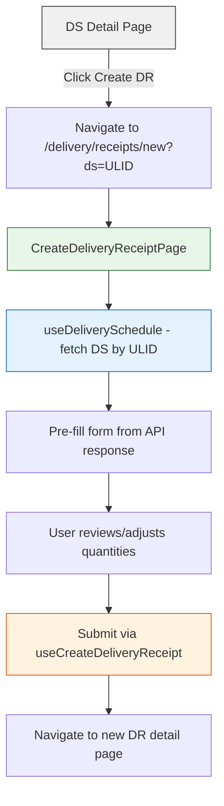
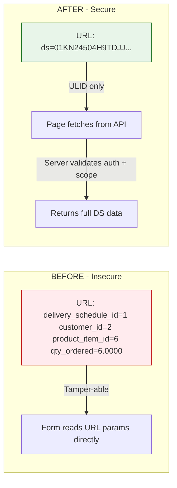

# Fix Delivery Receipt Creation + URL Security Audit

## Problem Summary

Three interconnected issues discovered when clicking "Create Delivery Receipt" from a Delivery Schedule (DS) record:

### Bug 1: No CreateDeliveryReceiptPage exists
The "Create Delivery Receipt" button in [`DeliveryScheduleDetailPage.tsx`](frontend/src/pages/production/DeliveryScheduleDetailPage.tsx:287) links to `/delivery/receipts/new?...` but:
- **No route** for `/delivery/receipts/new` exists in [`router/index.tsx`](frontend/src/router/index.tsx:633)
- **No page component** `CreateDeliveryReceiptPage` exists anywhere
- The URL falls through to `/delivery/receipts/:ulid` with `ulid="new"`, which tries to fetch a non-existent receipt and errors

### Bug 2: URL exposes sensitive internal data
The link dumps raw database values into query params:
```
/delivery/receipts/new?delivery_schedule_id=1&delivery_schedule_ulid=01KN...&customer_id=2&product_item_id=6&qty_ordered=6.0000&unit_of_measure=pcs
```
This exposes numeric primary keys (`delivery_schedule_id=1`, `customer_id=2`, `product_item_id=6`), exact quantities, and internal references. In production, this is a security risk (IDOR vulnerability vector, information leakage).

### Bug 3: Form doesn't load correct DS data
Even if the page existed, it reads from URL query params instead of fetching fresh data from the API using the DS ulid. This means stale/tampered params could create incorrect receipts.

---

## Architecture: Correct Approach

The proper pattern (already used elsewhere in the codebase) is:

1. **URL carries only the ULID** -- `/delivery/receipts/new?ds=01KN24504H9TDJJ0F18WDFPSFX`
2. **Page fetches full data from API** using that ULID -- `useDeliverySchedule(dsUlid)`
3. **Form pre-fills from API response** -- customer, items, quantities all come from the server, not the URL

This matches how [`CreateGoodsReceiptPage`](frontend/src/pages/procurement/CreateGoodsReceiptPage.tsx:41) works with `?po_ulid=<ulid>`.

---

## Implementation Steps

### Step 1: Create `CreateDeliveryReceiptPage.tsx`

**File:** `frontend/src/pages/delivery/CreateDeliveryReceiptPage.tsx`

- Read only `ds` (delivery schedule ULID) from `useSearchParams`
- Call `useDeliverySchedule(dsUlid)` to fetch full DS data from API
- Pre-fill form fields from DS response:
  - `direction` = `'outbound'` (DS is always outbound to customer)
  - `customer_id` from `schedule.customer.id` (fetched server-side, not URL)
  - `delivery_schedule_id` from `schedule.id` (fetched server-side)
  - `receipt_date` = today
  - Items array from schedule items with `item_master_id`, `quantity_expected`, `quantity_received` (defaulting to expected), `unit_of_measure`
- Use existing `useCreateDeliveryReceipt()` hook for submission
- Use existing `deliveryReceiptSchema` from [`schemas/delivery.ts`](frontend/src/schemas/delivery.ts:16) for validation
- Show info banner: "Pre-filled from delivery schedule #DS-REF. Adjust quantities as needed."
- On success, navigate to the new receipt detail page

### Step 2: Add route to router

**File:** [`frontend/src/router/index.tsx`](frontend/src/router/index.tsx:633)

Add BEFORE the `:ulid` route (specific routes must precede dynamic segments):
```
{ path: '/delivery/receipts/new', element: withSuspense(guard('delivery.manage', <CreateDeliveryReceiptPage />)) },
```

Add the lazy import:
```
const CreateDeliveryReceiptPage = lazyWithRetry(() => import('@/pages/delivery/CreateDeliveryReceiptPage'))
```

### Step 3: Fix the DS detail page link

**File:** [`DeliveryScheduleDetailPage.tsx`](frontend/src/pages/production/DeliveryScheduleDetailPage.tsx:287)

Change from:
```tsx
to={`/delivery/receipts/new?delivery_schedule_id=${schedule.id}&delivery_schedule_ulid=${schedule.ulid}&customer_id=${schedule.customer?.id ?? ''}&product_item_id=${...}&qty_ordered=${...}&unit_of_measure=${...}`}
```

To:
```tsx
to={`/delivery/receipts/new?ds=${schedule.ulid}`}
```

Only the ULID is passed. Everything else is fetched server-side on the create page.

### Step 4: Fix QC Inspection link (same pattern)

**File:** [`ProductionOrderDetailPage.tsx`](frontend/src/pages/production/ProductionOrderDetailPage.tsx:754)

Change from:
```tsx
to={`/qc/inspections/new?production_order_id=${order.id}&item_master_id=${order.product_item?.id ?? ''}&stage=${...}`}
```

To:
```tsx
to={`/qc/inspections/new?po=${order.ulid}&stage=${order.status === 'completed' ? 'oqc' : 'ipqc'}`}
```

Then update [`CreateInspectionPage.tsx`](frontend/src/pages/qc/CreateInspectionPage.tsx) to fetch production order data by ULID instead of reading numeric IDs from URL.

### Step 5: Fix PO goods-receipts link

**File:** [`PurchaseOrderDetailPage.tsx`](frontend/src/pages/procurement/PurchaseOrderDetailPage.tsx:672)

Change from:
```tsx
to={`/procurement/goods-receipts?purchase_order_id=${po.id}`}
```

To:
```tsx
to={`/procurement/goods-receipts?po=${po.ulid}`}
```

Update the receiving page to resolve ULID to ID server-side.

### Step 6: Fix Employee attendance link

**File:** [`EmployeeProfileView.tsx`](frontend/src/components/employee/EmployeeProfileView.tsx:771)

Change from:
```tsx
`/hr/attendance?employee_id=${employee.id}&employee_name=${encodeURIComponent(employee.full_name)}`
```

To:
```tsx
`/hr/attendance?employee=${employee.ulid}`
```

Update attendance list page to resolve employee ULID to filter params server-side.

### Step 7: TypeScript checks and testing

- Run `pnpm typecheck` from frontend
- Verify all modified pages render correctly
- Test the DR creation flow from DS detail page end-to-end

---

## Flow Diagram



## Security Pattern: Before vs After



## Files to Create
| File | Purpose |
|------|---------|
| `frontend/src/pages/delivery/CreateDeliveryReceiptPage.tsx` | New page with form, fetches DS data by ULID |

## Files to Modify
| File | Change |
|------|--------|
| `frontend/src/router/index.tsx` | Add route + lazy import for CreateDeliveryReceiptPage |
| `frontend/src/pages/production/DeliveryScheduleDetailPage.tsx` | Simplify link to only pass DS ULID |
| `frontend/src/pages/production/ProductionOrderDetailPage.tsx` | Use ULID instead of numeric ID in QC link |
| `frontend/src/pages/procurement/PurchaseOrderDetailPage.tsx` | Use ULID instead of numeric ID in GR link |
| `frontend/src/components/employee/EmployeeProfileView.tsx` | Use ULID instead of numeric ID in attendance link |
| `frontend/src/pages/qc/CreateInspectionPage.tsx` | Fetch PO data by ULID instead of reading numeric ID from URL |
| `frontend/src/pages/hr/attendance/AttendanceListPage.tsx` | Resolve employee ULID filter |
| `frontend/src/pages/team/TeamAttendancePage.tsx` | Resolve employee ULID filter |
