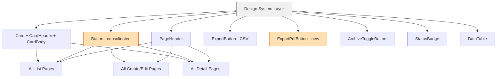

# Frontend UI/UX Consistency Audit and Remediation Plan

## Executive Summary

A thorough audit of the Ogami ERP frontend revealed **7 major categories of UI/UX inconsistency** across approximately 100+ page components. The system has well-designed shared components ([`PageHeader`](frontend/src/components/ui/PageHeader.tsx), [`Button`](frontend/src/components/ui/Button.tsx), [`Card`](frontend/src/components/ui/Card.tsx), [`ExportButton`](frontend/src/components/ui/ExportButton.tsx), [`ArchiveToggleButton`](frontend/src/components/ui/ArchiveToggleButton.tsx)) but many pages bypass them with inline styles that deviate from the design system.

---

## Category 1: Pages Using Raw `h1`/`h2` Headers Instead of `PageHeader`

**The standard:** All list and detail pages should use the shared [`PageHeader`](frontend/src/components/ui/PageHeader.tsx) component which provides consistent `text-lg font-semibold` title, optional subtitle, back button, icon, status badge, and right-aligned actions.

**Offending pages that use raw headings instead:**

| File | Current Pattern | Issue |
|------|----------------|-------|
| [`VendorOrdersPage.tsx`](frontend/src/pages/vendor-portal/VendorOrdersPage.tsx:33) | `<h1 className="text-2xl font-bold">` | Uses `2xl/bold` instead of `lg/semibold`; no PageHeader |
| [`VendorItemsPage.tsx`](frontend/src/pages/vendor-portal/VendorItemsPage.tsx:113) | `<h1 className="text-2xl font-bold">` | Same deviation |
| [`VendorInvoicesPage.tsx`](frontend/src/pages/vendor-portal/VendorInvoicesPage.tsx:73) | `<h1 className="text-2xl font-bold">` | Same deviation |
| [`VendorGoodsReceiptsPage.tsx`](frontend/src/pages/vendor-portal/VendorGoodsReceiptsPage.tsx:13) | `<h1 className="text-2xl font-bold">` | Same deviation |
| [`VendorRfqListPage.tsx`](frontend/src/pages/procurement/VendorRfqListPage.tsx:75) | `<h1 className="text-2xl font-bold">` | Same deviation |
| [`GovernmentReportsPage.tsx`](frontend/src/pages/reports/GovernmentReportsPage.tsx:98) | `<h1 className="text-lg font-semibold">` | Correct size but not using PageHeader |
| [`ProductionCostPage.tsx`](frontend/src/pages/production/ProductionCostPage.tsx:61) | `<h1 className="text-2xl font-bold">` | Uses `2xl/bold` |
| [`HRReportsPage.tsx`](frontend/src/pages/hr/HRReportsPage.tsx:12) | `<h1 className="text-2xl font-bold">` | Uses `2xl/bold` |
| [`ApAgingReportPage.tsx`](frontend/src/pages/accounting/ApAgingReportPage.tsx:39) | `<h1 className="text-2xl font-bold">` | Uses `2xl/bold` |
| [`CustomerCreditNotesPage.tsx`](frontend/src/pages/ar/CustomerCreditNotesPage.tsx:122) | `<h1 className="text-2xl font-bold">` | Uses `2xl/bold` |
| [`VendorCreditNotesPage.tsx`](frontend/src/pages/accounting/VendorCreditNotesPage.tsx:111) | `<h1 className="text-2xl font-bold">` | Uses `2xl/bold` |
| [`QuarantineManagementPage.tsx`](frontend/src/pages/qc/QuarantineManagementPage.tsx:22) | `<h1 className="text-2xl font-bold">` | Uses `2xl/bold` |
| [`FinancialRatiosPage.tsx`](frontend/src/pages/accounting/FinancialRatiosPage.tsx:29) | `<h1 className="text-2xl font-bold">` | Uses `2xl/bold` |
| [`BlanketPurchaseOrdersPage.tsx`](frontend/src/pages/procurement/BlanketPurchaseOrdersPage.tsx:11) | `<h1 className="text-2xl font-bold">` | Uses `2xl/bold` |
| [`PhysicalCountPage.tsx`](frontend/src/pages/inventory/PhysicalCountPage.tsx:134) | `<h1 className="text-2xl font-bold">` | Uses `2xl/bold` |
| [`QcDefectRatePage.tsx`](frontend/src/pages/qc/QcDefectRatePage.tsx:36) | `<h1 className="text-2xl font-bold">` | Uses `2xl/bold` |
| [`CreateBomPage.tsx`](frontend/src/pages/production/CreateBomPage.tsx:120) | `<h1 className="text-lg font-semibold">` | Correct size but no PageHeader |
| [`EditBomPage.tsx`](frontend/src/pages/production/EditBomPage.tsx:137) | `<h1 className="text-lg font-semibold">` | Correct size but no PageHeader |
| [`CreateProductionOrderPage.tsx`](frontend/src/pages/production/CreateProductionOrderPage.tsx:151) | `<h1 className="text-lg font-semibold">` | Correct size but no PageHeader |
| [`CreateDeliverySchedulePage.tsx`](frontend/src/pages/production/CreateDeliverySchedulePage.tsx:106) | `<h1 className="text-lg font-semibold">` | Correct size but no PageHeader |
| [`CreateMoldPage.tsx`](frontend/src/pages/mold/CreateMoldPage.tsx:60) | `<h1 className="text-lg font-semibold">` | Correct size but no PageHeader |
| [`CreateNcrPage.tsx`](frontend/src/pages/qc/CreateNcrPage.tsx:85) | `<h1 className="text-lg font-semibold">` | Correct size but no PageHeader |
| [`CreateInspectionPage.tsx`](frontend/src/pages/qc/CreateInspectionPage.tsx:110) | `<h1 className="text-lg font-semibold">` | Correct size but no PageHeader |
| [`PayrollRunDetailPage.tsx`](frontend/src/pages/payroll/PayrollRunDetailPage.tsx:619) | `<h1 className="text-lg font-semibold">` | Uses raw h1 in detail header area |
| [`CreatePayrollRunPage.tsx`](frontend/src/pages/payroll/CreatePayrollRunPage.tsx:337) | `<h1 className="text-lg font-semibold">` | No PageHeader |

**Dashboard pages** also use `text-xl font-bold` inconsistently:
- [`VicePresidentDashboard.tsx`](frontend/src/pages/dashboard/VicePresidentDashboard.tsx:57), [`HeadDashboard.tsx`](frontend/src/pages/dashboard/HeadDashboard.tsx:64), [`ManagerDashboard.tsx`](frontend/src/pages/dashboard/ManagerDashboard.tsx:58), [`OfficerDashboard.tsx`](frontend/src/pages/dashboard/OfficerDashboard.tsx:134), [`ImpexOfficerDashboard.tsx`](frontend/src/pages/dashboard/ImpexOfficerDashboard.tsx:99), [`GaOfficerDashboard.tsx`](frontend/src/pages/dashboard/GaOfficerDashboard.tsx:115), [`MoldManagerDashboard.tsx`](frontend/src/pages/dashboard/MoldManagerDashboard.tsx:90), [`EmployeeDashboard.tsx`](frontend/src/pages/dashboard/EmployeeDashboard.tsx:49)

### Fix
Replace all raw `<h1>` headers with `<PageHeader>` using consistent `title`, `subtitle`, `icon`, and `actions` props.

---

## Category 2: Color System Inconsistency - `gray-*` vs `neutral-*`

**The standard:** The entire design system uses Tailwind `neutral-*` color palette. Three pages use the old `gray-*` palette which produces visually different shades.

| File | Issue |
|------|-------|
| [`QuarantineManagementPage.tsx`](frontend/src/pages/qc/QuarantineManagementPage.tsx:22) | `text-gray-900`, `bg-gray-800`, `bg-gray-50`, `divide-gray-200`, `text-gray-500` throughout |
| [`FinancialRatiosPage.tsx`](frontend/src/pages/accounting/FinancialRatiosPage.tsx:29) | `text-gray-900`, `bg-gray-800`, `text-gray-500`, `bg-gray-100` throughout |
| [`BlanketPurchaseOrdersPage.tsx`](frontend/src/pages/procurement/BlanketPurchaseOrdersPage.tsx:11) | `text-gray-900`, `bg-gray-800`, `divide-gray-200`, `text-gray-500` throughout |

### Fix
Replace all `gray-*` classes with their `neutral-*` equivalents across these 3 files.

---

## Category 3: Export PDF Button Styling Inconsistencies

**The standard:** There is no shared `ExportPdfButton` component. Each page creates its own `<a>` tag with slightly different styling.

| File | Class String | Differences |
|------|-------------|-------------|
| [`CustomerInvoiceDetailPage.tsx`](frontend/src/pages/ar/CustomerInvoiceDetailPage.tsx:326) | `inline-flex items-center gap-1.5 bg-white text-neutral-700 border border-neutral-300 hover:bg-neutral-50 text-sm font-medium px-4 py-2 rounded` | Uses `inline-flex`, icon is `Download`, `px-4 py-2` |
| [`APInvoiceDetailPage.tsx`](frontend/src/pages/accounting/APInvoiceDetailPage.tsx:385) | `inline-flex items-center gap-1.5 bg-white text-neutral-700 border border-neutral-300 hover:bg-neutral-50 text-sm font-medium px-4 py-2 rounded` | Same as above but icon is `FileText` not `Download` |
| [`PurchaseRequestDetailPage.tsx`](frontend/src/pages/procurement/PurchaseRequestDetailPage.tsx:321) | `inline-flex items-center gap-1.5 text-sm px-3 py-2 bg-white text-neutral-700 border border-neutral-300 hover:bg-neutral-50 font-medium rounded transition-colors` | Uses `px-3` instead of `px-4`; adds `transition-colors` |
| [`PurchaseOrderDetailPage.tsx`](frontend/src/pages/procurement/PurchaseOrderDetailPage.tsx:332) | `flex items-center gap-2 px-4 py-2 bg-white border border-neutral-300 text-neutral-700 text-sm font-medium rounded hover:bg-neutral-50` | Uses `flex` not `inline-flex`; `gap-2` not `gap-1.5` |

### Fix
Create a shared `ExportPdfButton` component or standardize on the `Button` component with `variant="secondary"` and consistent icon usage.

---

## Category 4: ArchiveToggleButton Placement Inconsistencies

**The standard:** The [`ArchiveToggleButton`](frontend/src/components/ui/ArchiveToggleButton.tsx) should be placed consistently. Two patterns exist, creating confusion:

**Pattern A - In filter bar** (most common, preferred):
Pages like [`ProductionOrderListPage`](frontend/src/pages/production/ProductionOrderListPage.tsx:105), [`PurchaseOrderListPage`](frontend/src/pages/procurement/PurchaseOrderListPage.tsx:90), [`DeliveryReceiptListPage`](frontend/src/pages/delivery/DeliveryReceiptListPage.tsx:104), [`MoldListPage`](frontend/src/pages/mold/MoldListPage.tsx:86), [`EquipmentListPage`](frontend/src/pages/maintenance/EquipmentListPage.tsx:85) place it inline with filters.

**Pattern B - In isolated div below PageHeader**:
Pages like [`VendorsPage`](frontend/src/pages/accounting/VendorsPage.tsx:543), [`CustomersPage`](frontend/src/pages/ar/CustomersPage.tsx:421) wrap it in `
` alone, creating wasted whitespace.

**Pattern C - Missing ArchiveToggleButton entirely**:
Some list pages that have archive endpoints don't show the toggle at all.

### Fix
Standardize on Pattern A: ArchiveToggleButton always goes in the filter bar row, inline with search/status dropdowns.

---

## Category 5: Page Wrapper and Spacing Inconsistencies

**The standard:** Page root containers should use consistent spacing.

| Pattern | Pages Using It |
|---------|---------------|
| `
` (no spacing) | Most list pages: EmployeeList, PurchaseOrderList, ProductionOrderList, etc. |
| `
` | SalesOrderList, QuotationList, CrmTicketList, VendorsPage |
| `
` | MoldList, WorkOrderList, EquipmentList, DeliveryReceiptList |
| `
` | BankAccounts, BankReconciliation, BalanceSheet, CashFlow, GeneralLedger, IncomeStatement, TrialBalance, VatLedger |
| `
` | CustomersPage, CustomerInvoicesPage, TaxPeriodSummary, LeaveCalendar |
| `
` | VendorRfqList, ProductionCost, QcDefectRate |
| `
` | BudgetPages |
| `
` | Detail pages |

### Key Issues
1. **`p-6` padding**: Some pages add their own `p-6` padding while the [`AppLayout`](frontend/src/components/layout/AppLayout.tsx) likely already provides padding. This creates double-padding on some pages.
2. **`space-y` variance**: Inconsistent vertical gap: some `space-y-4`, some `space-y-6`, some none at all.
3. **`max-w-*` inconsistency**: Different width constraints across modules.

### Fix
Establish a standard page wrapper pattern and apply consistently. Recommended: `
` for all list pages; `
` for detail/form pages.

---

## Category 6: Table Container Inconsistencies

**The standard:** Tables should be wrapped in the [`Card`](frontend/src/components/ui/Card.tsx) component which provides `bg-white border border-neutral-200 rounded-xl shadow-subtle`.

| Pattern | Example Pages |
|---------|--------------|
| `<Card><CardHeader>...<CardBody className="p-0"><table>` | PurchaseOrderList (correct) |
| `
<table>` | ProductionOrderList (inline, `rounded` not `rounded-xl`) |
| `
<table>` | VendorOrdersPage (`rounded-lg` not `rounded-xl`) |
| `
<table>` | QuarantineManagement, BlanketPurchaseOrders (wrong color system, uses shadow) |
| Direct `<table>` without wrapper | Some inline tables |

### Fix
Wrap all data tables in `<Card><CardBody className="p-0">` for consistent border radius, shadow, and color scheme.

---

## Category 7: Duplicate Button Components

**The standard:** There are TWO Button components:
1. [`Button.tsx`](frontend/src/components/ui/Button.tsx) (PascalCase) - variants: `primary | secondary | danger | ghost`, sizes: `sm | md | lg`, uses `rounded`
2. [`button.tsx`](frontend/src/components/ui/button.tsx) (lowercase) - variants: `default | secondary | outline | ghost | destructive`, sizes: `default | sm | lg | icon`, uses `rounded-lg`

Neither is imported by any page file directly; instead pages use inline `<button className="...">` with ad-hoc styling everywhere.

### Fix
Consolidate into a single Button component. Audit all inline `<button>` elements and migrate to the standard component.

---

## Implementation Checklist

- [ ] **Create a shared `ExportPdfButton` component** that wraps a styled `<a>` link with consistent icon, padding, colors
- [ ] **Consolidate Button components** - merge `button.tsx` and `Button.tsx` into one canonical component
- [ ] **Fix 25+ pages using raw `<h1>` headers** - replace with `<PageHeader>` component
- [ ] **Fix 3 pages using `gray-*` color palette** - replace with `neutral-*` in QuarantineManagementPage, FinancialRatiosPage, BlanketPurchaseOrdersPage
- [ ] **Standardize Export PDF buttons** across 4 detail pages to use shared ExportPdfButton component
- [ ] **Standardize ArchiveToggleButton placement** - move to filter bar row on VendorsPage, CustomersPage, and any other Pattern B pages
- [ ] **Standardize page wrapper divs** - establish `
` for list pages; remove extraneous `p-6` from pages where AppLayout already provides padding
- [ ] **Standardize table containers** - wrap all raw `
` table containers in `<Card><CardBody className="p-0">` with consistent rounded corners
- [ ] **Fix inline button styling** in pages that use ad-hoc `className` strings instead of the `Button` component -- particularly action buttons in VendorRfqListPage, CustomersPage, VendorsPage, ProductionOrderDetailPage
- [ ] **Standardize dashboard page headers** - migrate 8+ dashboard pages to use `<PageHeader>` with consistent `text-lg font-semibold` sizing
- [ ] **Fix Create/Edit pages without PageHeader** - migrate CreateBomPage, EditBomPage, CreateProductionOrderPage, CreateDeliverySchedulePage, CreateMoldPage, CreateNcrPage, CreateInspectionPage, CreatePayrollRunPage to use `<PageHeader>` with `backTo` prop

---

## Priority Order

1. **High Impact / Low Risk**: Fix gray-to-neutral color palette (3 files, simple find-replace)
2. **High Impact / Low Risk**: Replace raw `<h1>` with `<PageHeader>` on 25+ pages
3. **Medium Impact / Medium Risk**: Standardize ArchiveToggleButton placement
4. **Medium Impact / Medium Risk**: Create and apply `ExportPdfButton` shared component
5. **Medium Impact / High Risk**: Consolidate Button components (touches component API)
6. **Lower Impact / Medium Risk**: Standardize page wrapper spacing
7. **Lower Impact / Medium Risk**: Standardize table container wrappers
8. **Ongoing**: Migrate inline `<button>` elements to the Button component

---

## Architecture Note: Design Token Consistency

Components in orange need to be created or consolidated.
