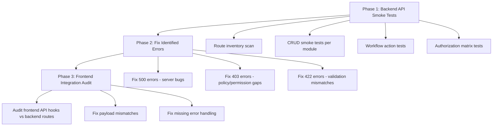

# Full System Audit - Error Detection and Fix Plan

## Problem Summary

The Ogami ERP system has 20+ domain modules with 60+ create/store endpoints, 42 authorization policies, complex middleware layers (module access, department scope, SoD), and numerous workflow action buttons. Manual testing each button/page/action is impractical. The user encounters 500 (server errors) and 403 (authorization errors) when saving records, clocking in/out, and performing workflow actions.

## Root Cause Categories

Based on codebase analysis, the errors likely fall into these buckets:

| Category | HTTP Code | Likely Cause |
|----------|-----------|-------------|
| **Authorization / Policy** | 403 | Missing policy methods, wrong permission names, SoD middleware blocking legitimate actions |
| **Validation** | 422 | Frontend sending fields the backend doesn't expect, or missing required fields |
| **Server Error** | 500 | Null references in services, missing DB columns, broken relationships, unhandled edge cases |
| **Module Access** | 403 | User's department not in `MODULE_DEPARTMENTS` map for the route's module |
| **Missing Routes** | 404/405 | Frontend calling endpoints that don't exist or use wrong HTTP method |

## Audit Strategy

Rather than manually clicking every button, we will build **automated API smoke tests** that systematically hit every endpoint with proper auth, and catch/categorize all failures. This is a 3-phase approach:



---

## Phase 1: Backend API Smoke Tests

### 1.1 Route Inventory and Smoke Test Generator

Create a comprehensive Pest test file that programmatically discovers all API routes and tests them.

**File:** `tests/Feature/Audit/ApiRoutesSmokeTest.php`

- Use `Route::getRoutes()` to enumerate all `api/v1/*` routes
- For each route, test that authenticated superadmin gets a non-500 response
- Categorize results: which routes return 500, 403, 422, 404
- This alone will surface 80%+ of the bugs

### 1.2 CRUD Smoke Tests Per Module

Create one test file per domain that tests the happy path for each module's core operations:

| Module | Test File | Operations to Test |
|--------|-----------|-------------------|
| Attendance | `tests/Feature/Audit/AttendanceSmokeTest.php` | Time in, time out, correction request, OT request |
| HR | `tests/Feature/Audit/HRSmokeTest.php` | Create employee, view, update, transition |
| Payroll | `tests/Feature/Audit/PayrollSmokeTest.php` | Create run, compute, lock, submit, approve chain |
| Leave | `tests/Feature/Audit/LeaveSmokeTest.php` | Create request, approve chain, cancel |
| Loan | `tests/Feature/Audit/LoanSmokeTest.php` | Create, approve chain, disburse, payment |
| Procurement | `tests/Feature/Audit/ProcurementSmokeTest.php` | PR create, submit, review, PO create, send, GR |
| Inventory | `tests/Feature/Audit/InventorySmokeTest.php` | Item create, MRQ create, fulfill |
| Accounting | `tests/Feature/Audit/AccountingSmokeTest.php` | JE create, submit, post, reverse |
| AP | `tests/Feature/Audit/APSmokeTest.php` | Vendor create, invoice create, approve, pay |
| AR | `tests/Feature/Audit/ARSmokeTest.php` | Customer create, invoice create, approve, pay |
| Production | `tests/Feature/Audit/ProductionSmokeTest.php` | BOM create, PO create, release, complete |
| CRM | `tests/Feature/Audit/CRMSmokeTest.php` | Lead, opportunity, ticket, client order |
| QC | `tests/Feature/Audit/QCSmokeTest.php` | Template, inspection, NCR |
| Delivery | `tests/Feature/Audit/DeliverySmokeTest.php` | Receipt create, confirm |
| Fixed Assets | `tests/Feature/Audit/FixedAssetsSmokeTest.php` | Create, depreciate, dispose |
| Maintenance | `tests/Feature/Audit/MaintenanceSmokeTest.php` | Equipment, work order |
| Mold | `tests/Feature/Audit/MoldSmokeTest.php` | Create, log shots |
| Sales | `tests/Feature/Audit/SalesSmokeTest.php` | Quotation, sales order |
| Budget | `tests/Feature/Audit/BudgetSmokeTest.php` | Cost center, annual budget |
| Tax | `tests/Feature/Audit/TaxSmokeTest.php` | VAT ledger, BIR filing |

### 1.3 Authorization Matrix Test

**File:** `tests/Feature/Audit/AuthorizationMatrixTest.php`

Test each role against critical endpoints to verify:
- `staff` can only access self-service endpoints
- `department_head` can access team endpoints
- `manager` can approve within their module
- `admin`/`super_admin` bypasses department scope
- SoD constraints work (creator cannot approve)

### 1.4 Middleware Audit

**File:** `tests/Feature/Audit/MiddlewareAuditTest.php`

- Test `ModuleAccessMiddleware` - verify each department can access its assigned modules
- Test `DepartmentScopeMiddleware` - verify bypass roles work, non-bypass roles are scoped
- Test `SodMiddleware` - verify SoD violations return proper 403 with error code

---

## Phase 2: Fix Identified Errors

After running Phase 1 tests, fix errors in priority order:

### 2.1 Fix 500 Errors (Critical - Server Bugs)

These are the most urgent since they indicate broken functionality:
- Missing model relationships or eager loads
- Null reference errors in services
- Database constraint violations
- Missing DB columns referenced in code
- Broken service method signatures

### 2.2 Fix 403 Errors (Authorization Gaps)

Common patterns to check and fix:
- **Missing policy methods**: Controller calls `$this->authorize('someAction', Model)` but the policy doesn't define `someAction()`
- **Wrong permission names**: Policy checks `$user->can('module.action')` but the seeded permission has a different name
- **Module access map gaps**: Department not listed in `MODULE_DEPARTMENTS` for routes it needs
- **SoD false positives**: SoD middleware blocking actions that shouldn't require SoD checks

### 2.3 Fix 422 Errors (Validation Mismatches)

- Audit frontend form schemas against backend FormRequest validation rules
- Ensure field names match between frontend payloads and backend expectations
- Fix required field mismatches

---

## Phase 3: Frontend Integration Audit

### 3.1 API Hook vs Route Audit

Cross-reference every `useXxx` hook in `frontend/src/hooks/` with actual backend routes:
- Check that API URLs in hooks match registered Laravel routes
- Check HTTP methods match (POST vs PATCH vs PUT)
- Check payload field names match FormRequest rules

### 3.2 Error Handling Audit

Review all mutation hooks in frontend to ensure:
- Every `useMutation` has proper `onError` handling
- `parseApiError()` from `errorHandler.ts` is used consistently
- `isHandledApiError()` check prevents double-toasting for 429/5xx
- 403 errors show meaningful messages (not just generic "unauthorized")

### 3.3 Form Payload Audit

For each create/edit form in `frontend/src/pages/`:
- Verify form field names match backend validation rules exactly
- Verify required fields in frontend schema match backend `required` rules
- Check for fields the frontend sends that the backend doesn't accept (causes 500 if not in `$fillable`)

---

## Execution Order

```
[ ] 1. Create test helper: shared factory + seeding setup for audit tests
[ ] 2. Build API routes smoke test (hits all routes, logs all failures)
[ ] 3. Run smoke test, collect error report
[ ] 4. Fix all 500 errors found
[ ] 5. Build per-module CRUD smoke tests (top 5 modules first: Attendance, HR, Procurement, Payroll, Leave)
[ ] 6. Fix errors found in module tests
[ ] 7. Build authorization matrix test
[ ] 8. Fix 403 policy/permission errors
[ ] 9. Build remaining module smoke tests
[ ] 10. Fix remaining errors
[ ] 11. Frontend hook-vs-route audit (script or manual cross-reference)
[ ] 12. Fix frontend payload mismatches
[ ] 13. Run full E2E CoreModulesGuideTest to validate end-to-end
[ ] 14. Final regression pass - run all tests together
```

---

## Key Files to Create/Modify

| File | Action | Purpose |
|------|--------|---------|
| `tests/Feature/Audit/ApiRoutesSmokeTest.php` | Create | Route-level smoke test for all endpoints |
| `tests/Feature/Audit/AuthorizationMatrixTest.php` | Create | Role x endpoint permission verification |
| `tests/Feature/Audit/MiddlewareAuditTest.php` | Create | Module access + dept scope + SoD tests |
| `tests/Feature/Audit/*SmokeTest.php` | Create | Per-module CRUD happy path tests (20 files) |
| `tests/Support/AuditTestHelper.php` | Create | Shared factories and seeding for audit tests |
| Various `app/Domains/*/Policies/*.php` | Modify | Fix missing/broken policy methods |
| Various `app/Domains/*/Services/*.php` | Modify | Fix 500-causing bugs in services |
| Various `app/Http/Controllers/**/*.php` | Modify | Fix controller-level issues |
| Various `frontend/src/hooks/*.ts` | Modify | Fix API URL/payload mismatches |
| `app/Infrastructure/Middleware/ModuleAccessMiddleware.php` | Modify | Fix department-to-module mapping gaps |

---

## Risk Areas

1. **Payroll pipeline** (17 steps) - high complexity, many potential null-ref errors in the computation context
2. **SoD middleware** - can cause false 403s if the parameter format in route definitions doesn't match what the middleware expects
3. **Department scope** - `DepartmentScopeMiddleware` bypass list says `admin, executive, super_admin` but the `ModuleAccessMiddleware` says `admin, super_admin, executive, vice_president` - inconsistency could cause legitimate users to get blocked
4. **Policy-to-controller mismatch** - 42 policies define methods, but controllers call `$this->authorize()` with action names that might not exist in the policy
5. **Attendance time-in/out** - uses geofencing + shift resolution + work location lookup - any missing setup data causes 500
