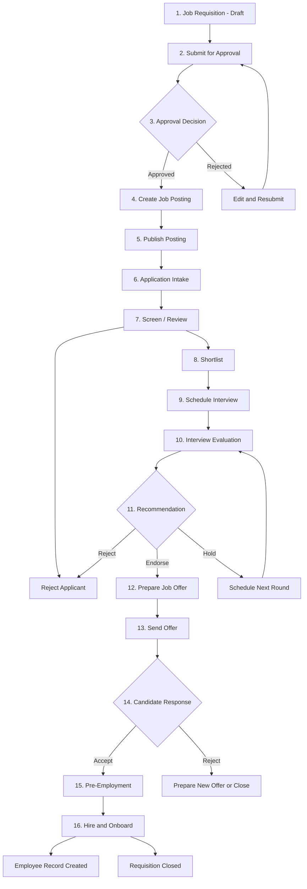
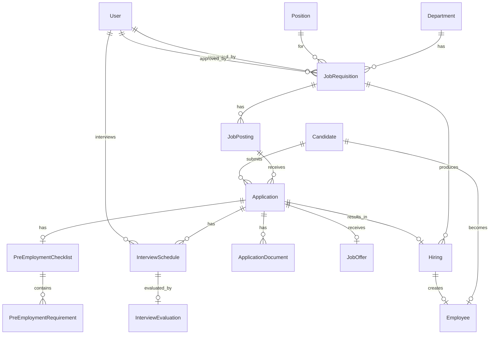

# HR Recruitment Module - Complete Implementation Plan

## Phase 0 - Discovery Summary

### 0A. Existing HR Domain Findings

| # | Question | Answer |
|---|----------|--------|
| 1 | HR models exist? | `Employee`, `Department`, `Position`, `SalaryGrade`, `EmployeeClearance`, `EmployeeDocument` |
| 2 | HR directory structure? | `app/Domains/HR/` with `Models/`, `Services/`, `Events/`, `Listeners/`, `Policies/`, `StateMachines/` |
| 3 | Approval/workflow engine? | Yes - `HasApprovalWorkflow` trait in `app/Shared/Concerns/` + polymorphic `ApprovalLog` model in `app/Shared/Models/` |
| 4 | Notification system? | Yes - queued notifications via `database` + `broadcast` channels. Pattern: `::fromModel()` static factory, `ShouldQueue`, `$this->queue = 'notifications'` |
| 5 | AuditLog service? | Yes - `owen-it/laravel-auditing` package. Models implement `Auditable` interface + use `AuditableTrait` |
| 6 | Existing roles? | `super_admin`, `admin`, `executive`, `vice_president`, `manager`, `officer`, `head`, `staff`, `vendor`, `client` via Spatie |
| 7 | User-Employee FK? | `users.employee_id` FK added by migration `2026_03_19_050619`. User `belongsTo` Employee |
| 8 | File upload service? | `EmployeeDocument` model exists. Storage uses Laravel filesystem - `resume_path`, `document_path` conventions |
| 9 | Money convention? | Integer centavos via `unsignedBigInteger`. `Money` VO at `app/Shared/ValueObjects/Money.php` |
| 10 | Route naming? | `api/v1/hr/*` - registered in `routes/api.php` as `Route::prefix('hr')->name('hr.')` loading `routes/api/v1/hr.php` |

### 0B. Integration Points

| # | Question | Answer |
|---|----------|--------|
| 1 | Position model? | Yes - `app/Domains/HR/Models/Position.php` with `id`, `code`, `title`, `department_id`, `pay_grade`, `is_active` |
| 2 | Department model? | Yes - `app/Domains/HR/Models/Department.php` with `id`, `code`, `name`, `parent_department_id`, `cost_center_code` |
| 3 | Employee model? | Yes - `app/Domains/HR/Models/Employee.php` - 411 lines, full lifecycle with state machine |
| 4 | Payroll/Compensation? | Yes - `SalaryGrade` model with `min_monthly_rate`/`max_monthly_rate`. Employee has `basic_monthly_rate` in centavos |
| 5 | Onboarding module? | Yes - `OnboardingChecklistService` at `app/Domains/HR/Services/` manages `employee_onboarding_items` table |

### 0C. Discovery Summary Table

| Component | Exists? | Path | Notes |
|---|---|---|---|
| HR Domain directory | Yes | `app/Domains/HR/` | Models, Services, Events, StateMachines, Policies |
| Employee model | Yes | `app/Domains/HR/Models/Employee.php` | 411 lines, `HasPublicUlid`, `SoftDeletes`, `Auditable` |
| Department model | Yes | `app/Domains/HR/Models/Department.php` | 204 lines, `SoftDeletes`, `Auditable` |
| Position model | Yes | `app/Domains/HR/Models/Position.php` | 52 lines, `SoftDeletes`, `Auditable` |
| Approval/Workflow engine | Yes | `app/Shared/Concerns/HasApprovalWorkflow.php` | Polymorphic `approval_logs` table, `logApproval()` helper |
| Notification service | Yes | `app/Notifications/` | 60+ notification classes, `::fromModel()` pattern, database+broadcast |
| AuditLog service | Yes | `owen-it/laravel-auditing` | Models use `AuditableTrait` + `Auditable` interface |
| File upload service | Partial | `EmployeeDocument` model | Standard Laravel `Storage` filesystem, path stored in DB |
| Existing roles: HR Manager | Yes | `manager` role + `hr` module | Department module scoping: `hr` module gives HR permissions |
| Existing roles: Recruiter | No | -- | New `officer` in HR dept can serve; or add recruitment-specific permissions |
| Existing roles: Dept Head | Yes | `head` role | First-level approvals, team supervision |

### Key Conventions Discovered

- **Models**: `final class`, `implements Auditable`, traits: `AuditableTrait`, `HasPublicUlid`, `SoftDeletes`, `HasDepartmentScope`
- **Services**: `final class implements ServiceContract`, constructor injection, `DB::transaction()` for mutations
- **Controllers**: Thin adapters - `$this->authorize()` then delegate to service, return Resource
- **Exceptions**: Extend `DomainException` with args: `message`, `errorCode`, `httpStatus`, `context[]`
- **State machines**: Separate class with `TRANSITIONS` const array, `transition()` method, `isAllowed()` check
- **Routes**: `routes/api/v1/{domain}.php`, middleware `auth:sanctum` + `module_access:{module}`
- **Frontend**: React 18 + TypeScript, lazy-loaded pages, `RequirePermission` guard, `api` from `@/lib/api`
- **URL params**: ULIDs via `HasPublicUlid` trait - routes bind on `ulid` not `id`
- **Status columns**: `string` + PostgreSQL CHECK constraint, never `$table->enum()`

---

## Phase 1 - Architecture Plan

### 1A. Recruitment Lifecycle



### 1B. Status Enums

| Entity | Statuses | Initial |
|---|---|---|
| JobRequisition | `draft`, `pending_approval`, `approved`, `rejected`, `open`, `on_hold`, `closed`, `cancelled` | `draft` |
| JobPosting | `draft`, `published`, `closed`, `expired` | `draft` |
| Application | `new`, `under_review`, `shortlisted`, `rejected`, `withdrawn` | `new` |
| InterviewSchedule | `scheduled`, `in_progress`, `completed`, `cancelled`, `no_show` | `scheduled` |
| JobOffer | `draft`, `sent`, `accepted`, `rejected`, `expired`, `withdrawn` | `draft` |
| PreEmploymentChecklist | `pending`, `in_progress`, `completed`, `waived` | `pending` |
| Hiring | `pending`, `hired`, `failed_preemployment` | `pending` |

### 1C. State Transition Maps

**JobRequisition transitions:**
```
draft            -> pending_approval, cancelled
pending_approval -> approved, rejected, cancelled
approved         -> open, cancelled
rejected         -> draft (resubmit)
open             -> on_hold, closed
on_hold          -> open, closed, cancelled
closed           -> (terminal)
cancelled        -> (terminal)
```

**Application transitions:**
```
new          -> under_review, withdrawn
under_review -> shortlisted, rejected, withdrawn
shortlisted  -> rejected, withdrawn
rejected     -> (terminal)
withdrawn    -> (terminal)
```

**JobOffer transitions:**
```
draft     -> sent, withdrawn
sent      -> accepted, rejected, expired, withdrawn
accepted  -> (terminal)
rejected  -> (terminal, but new offer can be created)
expired   -> (terminal)
withdrawn -> (terminal)
```

### 1D. Entity Relationship Diagram



---

## Phase 2 - Database Migrations

All migrations will follow the project convention: `string` status + CHECK constraint, `unsignedBigInteger` for money, `softDeletes`, timestamps with `TIMESTAMPTZ`.

### Migration Order and File Paths

| # | Migration File | Table | Dependencies |
|---|---|---|---|
| 1 | `2026_03_29_000001_create_candidates_table.php` | `candidates` | None |
| 2 | `2026_03_29_000002_create_job_requisitions_table.php` | `job_requisitions` | `departments`, `positions`, `users` |
| 3 | `2026_03_29_000003_create_requisition_approvals_table.php` | `requisition_approvals` | `job_requisitions`, `users` |
| 4 | `2026_03_29_000004_create_job_postings_table.php` | `job_postings` | `job_requisitions` |
| 5 | `2026_03_29_000005_create_applications_table.php` | `applications` | `job_postings`, `candidates`, `users` |
| 6 | `2026_03_29_000006_create_application_documents_table.php` | `application_documents` | `applications` |
| 7 | `2026_03_29_000007_create_interview_schedules_table.php` | `interview_schedules` | `applications`, `users` |
| 8 | `2026_03_29_000008_create_interview_evaluations_table.php` | `interview_evaluations` | `interview_schedules`, `users` |
| 9 | `2026_03_29_000009_create_job_offers_table.php` | `job_offers` | `applications`, `positions`, `departments`, `users` |
| 10 | `2026_03_29_000010_create_pre_employment_checklists_table.php` | `pre_employment_checklists` | `applications`, `users` |
| 11 | `2026_03_29_000011_create_pre_employment_requirements_table.php` | `pre_employment_requirements` | `pre_employment_checklists` |
| 12 | `2026_03_29_000012_create_hirings_table.php` | `hirings` | `applications`, `job_requisitions`, `employees`, `users` |

All in `database/migrations/`.

### Key Schema Decisions

- **No `HasPublicUlid`** on `Candidate` since candidates are not routed publicly the same way employees are. Instead, use it on `JobRequisition`, `Application`, `JobOffer`, and `Hiring` which are URL-routable.
- **`requisition_approvals`** is a dedicated table rather than using the polymorphic `approval_logs` because requisitions need a specific approval chain with ordering. However, we will ALSO use `HasApprovalWorkflow` trait on `JobRequisition` for the general audit trail.
- **Auto-number generation**: `REQ-YYYY-XXXXX`, `JP-YYYY-XXXXX`, `APP-YYYY-XXXXX`, `OFR-YYYY-XXXXX` using `lockForUpdate()->count()` pattern.
- **`application_documents`** is separate from `EmployeeDocument` since candidates are not employees yet.

---

## Phase 3 - Backend Implementation Plan

### 3A. Enums - File Paths

| File | Enum | Values |
|---|---|---|
| `app/Domains/HR/Recruitment/Enums/RequisitionStatus.php` | `RequisitionStatus` | draft, pending_approval, approved, rejected, open, on_hold, closed, cancelled |
| `app/Domains/HR/Recruitment/Enums/PostingStatus.php` | `PostingStatus` | draft, published, closed, expired |
| `app/Domains/HR/Recruitment/Enums/ApplicationStatus.php` | `ApplicationStatus` | new, under_review, shortlisted, rejected, withdrawn |
| `app/Domains/HR/Recruitment/Enums/InterviewStatus.php` | `InterviewStatus` | scheduled, in_progress, completed, cancelled, no_show |
| `app/Domains/HR/Recruitment/Enums/InterviewType.php` | `InterviewType` | panel, one_on_one, technical, hr_screening, final |
| `app/Domains/HR/Recruitment/Enums/OfferStatus.php` | `OfferStatus` | draft, sent, accepted, rejected, expired, withdrawn |
| `app/Domains/HR/Recruitment/Enums/PreEmploymentStatus.php` | `PreEmploymentStatus` | pending, in_progress, completed, waived |
| `app/Domains/HR/Recruitment/Enums/RequirementStatus.php` | `RequirementStatus` | pending, submitted, verified, rejected, waived |
| `app/Domains/HR/Recruitment/Enums/HiringStatus.php` | `HiringStatus` | pending, hired, failed_preemployment |
| `app/Domains/HR/Recruitment/Enums/CandidateSource.php` | `CandidateSource` | referral, walk_in, job_board, agency, internal |
| `app/Domains/HR/Recruitment/Enums/EmploymentType.php` | `EmploymentType` | regular, contractual, project_based, part_time |
| `app/Domains/HR/Recruitment/Enums/EvaluationRecommendation.php` | `EvaluationRecommendation` | endorse, reject, hold |
| `app/Domains/HR/Recruitment/Enums/RequirementType.php` | `RequirementType` | nbi_clearance, medical_certificate, tin, sss, philhealth, pagibig, birth_certificate, diploma, transcript, id_photo, other |

Each enum must implement: `label(): string`, `color(): string`, `canTransitionTo(self $next): bool` where applicable.

### 3B. Models - File Paths

All models in `app/Domains/HR/Recruitment/Models/`:

| File | Traits | Key Relationships |
|---|---|---|
| `Candidate.php` | `SoftDeletes`, `AuditableTrait`, `HasFactory` | hasMany Applications, hasOne Employee |
| `JobRequisition.php` | `SoftDeletes`, `AuditableTrait`, `HasPublicUlid`, `HasFactory`, `HasApprovalWorkflow` | belongsTo Department/Position/User, hasMany JobPostings/Hirings |
| `RequisitionApproval.php` | -- | belongsTo JobRequisition/User |
| `JobPosting.php` | `SoftDeletes`, `AuditableTrait`, `HasPublicUlid`, `HasFactory` | belongsTo JobRequisition, hasMany Applications |
| `Application.php` | `SoftDeletes`, `AuditableTrait`, `HasPublicUlid`, `HasFactory` | belongsTo JobPosting/Candidate, hasMany InterviewSchedules/ApplicationDocuments, hasOne JobOffer/PreEmploymentChecklist/Hiring |
| `ApplicationDocument.php` | `SoftDeletes` | belongsTo Application |
| `InterviewSchedule.php` | `SoftDeletes`, `AuditableTrait`, `HasFactory` | belongsTo Application/User, hasOne InterviewEvaluation |
| `InterviewEvaluation.php` | `SoftDeletes`, `AuditableTrait` | belongsTo InterviewSchedule/User |
| `JobOffer.php` | `SoftDeletes`, `AuditableTrait`, `HasPublicUlid`, `HasFactory` | belongsTo Application/Position/Department/User |
| `PreEmploymentChecklist.php` | -- | belongsTo Application/User, hasMany PreEmploymentRequirements |
| `PreEmploymentRequirement.php` | -- | belongsTo PreEmploymentChecklist |
| `Hiring.php` | `AuditableTrait`, `HasPublicUlid` | belongsTo Application/JobRequisition/Employee/User |

### 3C. State Machines

| File | Purpose |
|---|---|
| `app/Domains/HR/Recruitment/StateMachines/RequisitionStateMachine.php` | Requisition lifecycle transitions |
| `app/Domains/HR/Recruitment/StateMachines/ApplicationStateMachine.php` | Application screening transitions |
| `app/Domains/HR/Recruitment/StateMachines/OfferStateMachine.php` | Offer lifecycle transitions |

Each follows the pattern in `EmployeeStateMachine`: `TRANSITIONS` const, `transition()`, `isAllowed()`.

### 3D. Services - File Paths

All in `app/Domains/HR/Recruitment/Services/`:

| File | Methods |
|---|---|
| `RequisitionService.php` | `list`, `show`, `create`, `update`, `submit`, `approve`, `reject`, `cancel`, `reopen` |
| `JobPostingService.php` | `list`, `show`, `createFromRequisition`, `update`, `publish`, `close` |
| `ApplicationService.php` | `list`, `show`, `apply`, `review`, `shortlist`, `reject`, `withdraw` |
| `InterviewService.php` | `list`, `show`, `schedule`, `reschedule`, `cancel`, `markNoShow`, `complete`, `submitEvaluation` |
| `OfferService.php` | `list`, `show`, `prepareOffer`, `update`, `sendOffer`, `acceptOffer`, `rejectOffer`, `withdrawOffer`, `expireOffer` |
| `PreEmploymentService.php` | `show`, `initChecklist`, `submitDocument`, `verifyDocument`, `rejectDocument`, `waiveRequirement`, `markComplete` |
| `HiringService.php` | `hire` - creates Employee record, closes requisition if headcount met, triggers onboarding |
| `RecruitmentDashboardService.php` | `getKpis`, `getPipelineFunnel`, `getSourceMix`, `getRecentRequisitions`, `getUpcomingInterviews` |
| `RecruitmentReportService.php` | `pipeline`, `timeToFill`, `sourceMix` |

All services: `final class implements ServiceContract`, mutations wrapped in `DB::transaction()`.

### 3E. Controllers - File Paths

All in `app/Http/Controllers/HR/Recruitment/`:

| File | Resource Routes | Action Routes |
|---|---|---|
| `RequisitionController.php` | index, store, show, update | submit, approve, reject, cancel |
| `JobPostingController.php` | index, store, show, update | publish, close |
| `ApplicationController.php` | index, store, show | review, shortlist, reject, withdraw |
| `InterviewController.php` | index, store, show, update | cancel, markNoShow, complete, submitEvaluation |
| `OfferController.php` | index, store, show, update | send, accept, reject, withdraw |
| `PreEmploymentController.php` | show | submitDocument, verify, rejectDocument, waive, complete |
| `HiringController.php` | -- | hire |
| `CandidateController.php` | index, show, update | -- |
| `RecruitmentDashboardController.php` | index | -- |
| `RecruitmentReportController.php` | -- | pipeline, timeToFill, sourceMix |

### 3F. Form Requests - File Paths

All in `app/Http/Requests/HR/Recruitment/`:

| File | Key Validations |
|---|---|
| `StoreRequisitionRequest.php` | department_id exists, position_id exists, headcount min:1, salary_range_min <= salary_range_max |
| `UpdateRequisitionRequest.php` | Same as store but `sometimes` |
| `StoreJobPostingRequest.php` | job_requisition_id exists+approved, title required, description min:50 |
| `PublishPostingRequest.php` | closes_at after:today |
| `StoreApplicationRequest.php` | job_posting_id exists+published, candidate_id or inline candidate data, resume mimes:pdf,doc,docx max:5120 |
| `ScheduleInterviewRequest.php` | application_id exists, scheduled_at after:now, duration_minutes min:15, interviewer_id exists, round min:1 |
| `SubmitEvaluationRequest.php` | scorecard array with criterion/score 1-5, recommendation in enum |
| `PrepareOfferRequest.php` | application_id exists, offered_salary integer min:1, start_date after:today |
| `SubmitDocumentRequest.php` | document file mimes:pdf,jpg,png,doc,docx max:10240 |
| `HireRequest.php` | application_id exists, start_date after_or_equal:today |

### 3G. API Resources - File Paths

All in `app/Http/Resources/HR/Recruitment/`:

| File | Purpose |
|---|---|
| `RequisitionListResource.php` | List view - summary fields |
| `RequisitionResource.php` | Detail view - all fields + relationships |
| `JobPostingListResource.php` | List view |
| `JobPostingResource.php` | Detail view |
| `ApplicationListResource.php` | List view |
| `ApplicationResource.php` | Detail view with timeline, interviews, offer, documents |
| `CandidateResource.php` | Candidate profile |
| `InterviewScheduleResource.php` | Interview detail with evaluation |
| `JobOfferResource.php` | Offer detail |
| `PreEmploymentChecklistResource.php` | Checklist with requirements |
| `HiringResource.php` | Hiring record |
| `RecruitmentDashboardResource.php` | Dashboard KPIs and data |

### 3H. Routes

New file: `routes/api/v1/recruitment.php`

Register in `routes/api.php` as:
```
Route::prefix('recruitment')->name('recruitment.')->group(base_path('routes/api/v1/recruitment.php'));
```

Route structure:
```
GET    /api/v1/recruitment/dashboard
GET    /api/v1/recruitment/reports/pipeline
GET    /api/v1/recruitment/reports/time-to-fill
GET    /api/v1/recruitment/reports/source-mix

# Requisitions - CRUD + actions
GET    /api/v1/recruitment/requisitions
POST   /api/v1/recruitment/requisitions
GET    /api/v1/recruitment/requisitions/{ulid}
PUT    /api/v1/recruitment/requisitions/{ulid}
POST   /api/v1/recruitment/requisitions/{ulid}/submit
POST   /api/v1/recruitment/requisitions/{ulid}/approve
POST   /api/v1/recruitment/requisitions/{ulid}/reject
POST   /api/v1/recruitment/requisitions/{ulid}/cancel

# Job Postings
GET    /api/v1/recruitment/postings
POST   /api/v1/recruitment/postings
GET    /api/v1/recruitment/postings/{ulid}
PUT    /api/v1/recruitment/postings/{ulid}
POST   /api/v1/recruitment/postings/{ulid}/publish
POST   /api/v1/recruitment/postings/{ulid}/close

# Applications
GET    /api/v1/recruitment/applications
POST   /api/v1/recruitment/applications
GET    /api/v1/recruitment/applications/{ulid}
POST   /api/v1/recruitment/applications/{ulid}/review
POST   /api/v1/recruitment/applications/{ulid}/shortlist
POST   /api/v1/recruitment/applications/{ulid}/reject
POST   /api/v1/recruitment/applications/{ulid}/withdraw

# Interviews
GET    /api/v1/recruitment/interviews
POST   /api/v1/recruitment/interviews
GET    /api/v1/recruitment/interviews/{id}
PUT    /api/v1/recruitment/interviews/{id}
POST   /api/v1/recruitment/interviews/{id}/cancel
POST   /api/v1/recruitment/interviews/{id}/no-show
POST   /api/v1/recruitment/interviews/{id}/complete
POST   /api/v1/recruitment/interviews/{id}/evaluation

# Offers
GET    /api/v1/recruitment/offers
POST   /api/v1/recruitment/offers
GET    /api/v1/recruitment/offers/{ulid}
PUT    /api/v1/recruitment/offers/{ulid}
POST   /api/v1/recruitment/offers/{ulid}/send
POST   /api/v1/recruitment/offers/{ulid}/accept
POST   /api/v1/recruitment/offers/{ulid}/reject
POST   /api/v1/recruitment/offers/{ulid}/withdraw

# Pre-Employment
GET    /api/v1/recruitment/pre-employment/{application_ulid}
POST   /api/v1/recruitment/pre-employment/requirements/{id}/submit-document
POST   /api/v1/recruitment/pre-employment/requirements/{id}/verify
POST   /api/v1/recruitment/pre-employment/requirements/{id}/reject
POST   /api/v1/recruitment/pre-employment/requirements/{id}/waive
POST   /api/v1/recruitment/pre-employment/{checklist_id}/complete

# Hiring
POST   /api/v1/recruitment/hire/{application_ulid}

# Candidates
GET    /api/v1/recruitment/candidates
GET    /api/v1/recruitment/candidates/{id}
PUT    /api/v1/recruitment/candidates/{id}
```

Middleware: `auth:sanctum`, `module_access:hr`

### 3I. Notifications

New files in `app/Notifications/Recruitment/`:

| File | Event | Recipients | Channels |
|---|---|---|---|
| `RequisitionSubmittedNotification.php` | Requisition submitted | HR Manager | database, broadcast |
| `RequisitionApprovedNotification.php` | Requisition approved | Requester + HR | database, broadcast |
| `RequisitionRejectedNotification.php` | Requisition rejected | Requester | database, broadcast |
| `ApplicationReceivedNotification.php` | New application | HR/Recruiter | database, broadcast |
| `ApplicationShortlistedNotification.php` | Shortlisted | Candidate | mail |
| `ApplicationRejectedNotification.php` | Rejected | Candidate | mail |
| `InterviewScheduledNotification.php` | Interview scheduled | Candidate + Interviewer | mail, database, broadcast |
| `InterviewCancelledNotification.php` | Interview cancelled | Candidate + Interviewer | mail, database, broadcast |
| `OfferSentNotification.php` | Offer sent | Candidate | mail |
| `OfferAcceptedNotification.php` | Offer accepted | HR Manager + Requester | database, broadcast, mail |
| `OfferRejectedNotification.php` | Offer rejected | HR Manager | database, broadcast |
| `PreEmploymentCompleteNotification.php` | Pre-employment done | HR | database, broadcast |
| `HiredNotification.php` | Hired | HR Manager + Dept Head | database, broadcast, mail |

All follow `::fromModel()` pattern, `ShouldQueue`, `$this->queue = 'notifications'`.

### 3J. Scheduled Jobs

| File | Schedule | Purpose |
|---|---|---|
| `app/Jobs/Recruitment/ExpireOffersJob.php` | Daily at 00:00 | Find offers where status=sent AND expires_at < now, call `OfferService->expireOffer()` |
| `app/Jobs/Recruitment/ExpirePostingsJob.php` | Daily at 00:00 | Find postings where status=published AND closes_at < now, call `JobPostingService->close()` |

Register in `routes/console.php` or `app/Console/Kernel.php`.

### 3K. Policies

| File | Purpose |
|---|---|
| `app/Policies/Recruitment/RequisitionPolicy.php` | viewAny, view, create, update, submit, approve, reject, cancel |
| `app/Policies/Recruitment/JobPostingPolicy.php` | viewAny, view, create, update, publish, close |
| `app/Policies/Recruitment/ApplicationPolicy.php` | viewAny, view, create, review, shortlist, reject |
| `app/Policies/Recruitment/InterviewPolicy.php` | viewAny, view, create, evaluate |
| `app/Policies/Recruitment/OfferPolicy.php` | viewAny, view, create, send, accept, reject |
| `app/Policies/Recruitment/PreEmploymentPolicy.php` | view, submitDocument, verify |
| `app/Policies/Recruitment/HiringPolicy.php` | execute |

SoD enforcement: `approve` checks `$user->id !== $requisition->requested_by`.

---

## Phase 4 - Frontend Implementation Plan

### 4A. TypeScript Types

New file: `frontend/src/types/recruitment.ts`

Types to define:
- `RequisitionStatus`, `PostingStatus`, `ApplicationStatus`, `InterviewStatus`, `OfferStatus`, `PreEmploymentStatus`, `HiringStatus`
- `Candidate`, `JobRequisition`, `JobPosting`, `Application`, `InterviewSchedule`, `InterviewEvaluation`, `JobOffer`, `PreEmploymentChecklist`, `PreEmploymentRequirement`, `Hiring`
- `RecruitmentDashboard`, `PipelineReport`, `TimeToFillReport`, `SourceMixReport`
- Paginated wrappers using existing `Paginated<T>` pattern

### 4B. API Hooks

New file: `frontend/src/hooks/useRecruitment.ts`

TanStack Query hooks for all CRUD and action endpoints. Follow existing patterns - queries use `queryKey` arrays, mutations use `useMutation` with `onSuccess` invalidation.

### 4C. Pages

All in `frontend/src/pages/hr/recruitment/`:

| File | Route | Description |
|---|---|---|
| `RecruitmentDashboard.tsx` | `/hr/recruitment` | KPI cards + pipeline funnel + source chart + recent tables |
| `RequisitionListPage.tsx` | `/hr/recruitment/requisitions` | Filterable list with status badges |
| `RequisitionFormPage.tsx` | `/hr/recruitment/requisitions/new` and `/:ulid/edit` | Create/edit form |
| `RequisitionDetailPage.tsx` | `/hr/recruitment/requisitions/:ulid` | Detail with approval workflow UI |
| `JobPostingListPage.tsx` | `/hr/recruitment/postings` | List with publish/close actions |
| `JobPostingFormPage.tsx` | `/hr/recruitment/postings/new` | Create form, pre-fill from requisition |
| `JobPostingDetailPage.tsx` | `/hr/recruitment/postings/:ulid` | Detail with applications count |
| `ApplicationListPage.tsx` | `/hr/recruitment/applications` | Filterable by posting, status |
| `ApplicationDetailPage.tsx` | `/hr/recruitment/applications/:ulid` | Core tracker - timeline + tabs |
| `InterviewListPage.tsx` | `/hr/recruitment/interviews` | Calendar/list toggle |
| `InterviewDetailPage.tsx` | `/hr/recruitment/interviews/:id` | Detail with scorecard |
| `OfferListPage.tsx` | `/hr/recruitment/offers` | List with status badges |
| `OfferDetailPage.tsx` | `/hr/recruitment/offers/:ulid` | Offer letter preview + status |
| `CandidateListPage.tsx` | `/hr/recruitment/candidates` | Searchable candidate pool |
| `CandidateProfilePage.tsx` | `/hr/recruitment/candidates/:id` | Profile with application history |
| `PipelineReportPage.tsx` | `/hr/recruitment/reports/pipeline` | Pipeline funnel report |

### 4D. Key Components

New shared components in `frontend/src/components/recruitment/`:

| Component | Purpose |
|---|---|
| `StatusBadge.tsx` | Color-coded badge for all recruitment statuses |
| `ApplicationTimeline.tsx` | Vertical stepper showing application journey |
| `InterviewScorecardForm.tsx` | Configurable criteria, 1-5 rating, recommendation |
| `OfferLetterPreview.tsx` | Modal with formatted offer letter template |
| `PreEmploymentChecklist.tsx` | Checklist table with upload/verify/progress bar |
| `RecruitmentKpiCards.tsx` | 4 KPI cards for dashboard |
| `PipelineFunnelChart.tsx` | Recruitment funnel visualization |
| `SourceMixChart.tsx` | Donut/pie chart for application sources |
| `RequisitionApprovalBanner.tsx` | Approval banner with approve/reject actions |

### 4E. Router Registration

Add to `frontend/src/router/index.tsx`:
- Lazy imports for all 16 pages
- Routes under `/hr/recruitment/*` path
- Permission guard: `recruitment.requisitions.view` or `hr.full_access`

---

## Phase 5 - Permissions and Roles

### 5A. New Permissions to Add

Add to `RolePermissionSeeder.php` PERMISSIONS const:

```
recruitment.requisitions.view
recruitment.requisitions.create
recruitment.requisitions.edit
recruitment.requisitions.submit
recruitment.requisitions.approve
recruitment.requisitions.reject
recruitment.requisitions.cancel
recruitment.postings.view
recruitment.postings.create
recruitment.postings.publish
recruitment.postings.close
recruitment.applications.view
recruitment.applications.review
recruitment.applications.shortlist
recruitment.applications.reject
recruitment.interviews.view
recruitment.interviews.schedule
recruitment.interviews.evaluate
recruitment.offers.view
recruitment.offers.create
recruitment.offers.send
recruitment.preemployment.view
recruitment.preemployment.verify
recruitment.hiring.execute
recruitment.reports.view
recruitment.candidates.view
recruitment.candidates.manage
```

### 5B. Role-Permission Mapping

| Permission | manager | officer | head | staff |
|---|---|---|---|---|
| recruitment.requisitions.view | Yes | Yes | Own dept | -- |
| recruitment.requisitions.create | Yes | Yes | Yes | -- |
| recruitment.requisitions.submit | Yes | Yes | Yes | -- |
| recruitment.requisitions.approve | Yes | -- | -- | -- |
| recruitment.requisitions.reject | Yes | -- | -- | -- |
| recruitment.postings.view | Yes | Yes | Own dept | -- |
| recruitment.postings.create | Yes | Yes | -- | -- |
| recruitment.postings.publish | Yes | Yes | -- | -- |
| recruitment.applications.view | Yes | Yes | -- | -- |
| recruitment.applications.review | Yes | Yes | -- | -- |
| recruitment.applications.shortlist | Yes | Yes | -- | -- |
| recruitment.interviews.view | Yes | Yes | Own assigned | Own assigned |
| recruitment.interviews.schedule | Yes | Yes | -- | -- |
| recruitment.interviews.evaluate | Yes | Yes | Own assigned | Own assigned |
| recruitment.offers.view | Yes | Yes | -- | -- |
| recruitment.offers.create | Yes | Yes | -- | -- |
| recruitment.offers.send | Yes | -- | -- | -- |
| recruitment.preemployment.view | Yes | Yes | -- | -- |
| recruitment.preemployment.verify | Yes | -- | -- | -- |
| recruitment.hiring.execute | Yes | -- | -- | -- |
| recruitment.reports.view | Yes | Yes | -- | -- |

Also add `recruitment.*` to the `hr` module in `ModulePermissionSeeder`.

---

## Phase 6 - Tests and Seeders

### 6A. Feature Tests

All in `tests/Feature/Recruitment/`:

| File | Test Cases |
|---|---|
| `RequisitionServiceTest.php` | create draft, submit, approve, reject, cancel, SoD violation, invalid transitions |
| `ApplicationServiceTest.php` | apply to open posting, duplicate rejected, closed posting rejected, shortlist, reject, withdraw |
| `InterviewServiceTest.php` | schedule for shortlisted, cannot schedule for non-shortlisted, submit evaluation, no duplicate eval, no-show |
| `OfferServiceTest.php` | prepare offer, salary as centavos, send transitions, accept, reject, expire |
| `HiringServiceTest.php` | hire creates Employee, closes requisition on headcount, requires accepted offer, requires pre-employment, audit log |
| `RecruitmentApiTest.php` | Route accessibility, permission checks, CRUD operations via HTTP |

Target: 30+ test cases minimum.

### 6B. Factories

All in `database/factories/Recruitment/`:

| File | Model |
|---|---|
| `CandidateFactory.php` | Candidate |
| `JobRequisitionFactory.php` | JobRequisition |
| `JobPostingFactory.php` | JobPosting |
| `ApplicationFactory.php` | Application |
| `InterviewScheduleFactory.php` | InterviewSchedule |
| `InterviewEvaluationFactory.php` | InterviewEvaluation |
| `JobOfferFactory.php` | JobOffer |
| `PreEmploymentChecklistFactory.php` | PreEmploymentChecklist |
| `PreEmploymentRequirementFactory.php` | PreEmploymentRequirement |
| `HiringFactory.php` | Hiring |

### 6C. Seeder

New file: `database/seeders/RecruitmentSeeder.php`

Produces:
- 10 candidates with varied sources
- 5 approved requisitions across different departments
- 10 published job postings
- 30 applications in various stages
- 15 completed interviews with evaluations
- 5 active offers in mixed statuses
- 3 completed hirings with Employee records
- Enough data to populate dashboard meaningfully

---

## Phase 7 - Implementation Order

The implementation must follow this strict dependency order:

1. **Enums** - no dependencies, pure PHP
2. **Migrations** - create all 12 tables in FK order
3. **Models** - depend on migrations + enums
4. **State Machines** - depend on enums
5. **Services** - depend on models + state machines
6. **Form Requests** - depend on models
7. **API Resources** - depend on models
8. **Policies** - depend on models
9. **Controllers** - depend on services + form requests + resources + policies
10. **Routes** - depend on controllers
11. **Notifications** - depend on models
12. **Scheduled Jobs** - depend on services
13. **Permission Seeder Update** - add recruitment permissions
14. **Factories** - depend on models
15. **Seeders** - depend on factories
16. **Tests** - depend on everything above
17. **Frontend Types** - depend on API contract
18. **Frontend Hooks** - depend on types
19. **Frontend Components** - depend on hooks
20. **Frontend Pages** - depend on components
21. **Frontend Router** - depend on pages

### Complete File Manifest

**Backend - 70+ files:**

```
# Enums (13 files)
app/Domains/HR/Recruitment/Enums/RequisitionStatus.php
app/Domains/HR/Recruitment/Enums/PostingStatus.php
app/Domains/HR/Recruitment/Enums/ApplicationStatus.php
app/Domains/HR/Recruitment/Enums/InterviewStatus.php
app/Domains/HR/Recruitment/Enums/InterviewType.php
app/Domains/HR/Recruitment/Enums/OfferStatus.php
app/Domains/HR/Recruitment/Enums/PreEmploymentStatus.php
app/Domains/HR/Recruitment/Enums/RequirementStatus.php
app/Domains/HR/Recruitment/Enums/HiringStatus.php
app/Domains/HR/Recruitment/Enums/CandidateSource.php
app/Domains/HR/Recruitment/Enums/EmploymentType.php
app/Domains/HR/Recruitment/Enums/EvaluationRecommendation.php
app/Domains/HR/Recruitment/Enums/RequirementType.php

# Migrations (12 files)
database/migrations/2026_03_29_000001_create_candidates_table.php
database/migrations/2026_03_29_000002_create_job_requisitions_table.php
database/migrations/2026_03_29_000003_create_requisition_approvals_table.php
database/migrations/2026_03_29_000004_create_job_postings_table.php
database/migrations/2026_03_29_000005_create_applications_table.php
database/migrations/2026_03_29_000006_create_application_documents_table.php
database/migrations/2026_03_29_000007_create_interview_schedules_table.php
database/migrations/2026_03_29_000008_create_interview_evaluations_table.php
database/migrations/2026_03_29_000009_create_job_offers_table.php
database/migrations/2026_03_29_000010_create_pre_employment_checklists_table.php
database/migrations/2026_03_29_000011_create_pre_employment_requirements_table.php
database/migrations/2026_03_29_000012_create_hirings_table.php

# Models (12 files)
app/Domains/HR/Recruitment/Models/Candidate.php
app/Domains/HR/Recruitment/Models/JobRequisition.php
app/Domains/HR/Recruitment/Models/RequisitionApproval.php
app/Domains/HR/Recruitment/Models/JobPosting.php
app/Domains/HR/Recruitment/Models/Application.php
app/Domains/HR/Recruitment/Models/ApplicationDocument.php
app/Domains/HR/Recruitment/Models/InterviewSchedule.php
app/Domains/HR/Recruitment/Models/InterviewEvaluation.php
app/Domains/HR/Recruitment/Models/JobOffer.php
app/Domains/HR/Recruitment/Models/PreEmploymentChecklist.php
app/Domains/HR/Recruitment/Models/PreEmploymentRequirement.php
app/Domains/HR/Recruitment/Models/Hiring.php

# State Machines (3 files)
app/Domains/HR/Recruitment/StateMachines/RequisitionStateMachine.php
app/Domains/HR/Recruitment/StateMachines/ApplicationStateMachine.php
app/Domains/HR/Recruitment/StateMachines/OfferStateMachine.php

# Services (9 files)
app/Domains/HR/Recruitment/Services/RequisitionService.php
app/Domains/HR/Recruitment/Services/JobPostingService.php
app/Domains/HR/Recruitment/Services/ApplicationService.php
app/Domains/HR/Recruitment/Services/InterviewService.php
app/Domains/HR/Recruitment/Services/OfferService.php
app/Domains/HR/Recruitment/Services/PreEmploymentService.php
app/Domains/HR/Recruitment/Services/HiringService.php
app/Domains/HR/Recruitment/Services/RecruitmentDashboardService.php
app/Domains/HR/Recruitment/Services/RecruitmentReportService.php

# Controllers (10 files)
app/Http/Controllers/HR/Recruitment/RequisitionController.php
app/Http/Controllers/HR/Recruitment/JobPostingController.php
app/Http/Controllers/HR/Recruitment/ApplicationController.php
app/Http/Controllers/HR/Recruitment/InterviewController.php
app/Http/Controllers/HR/Recruitment/OfferController.php
app/Http/Controllers/HR/Recruitment/PreEmploymentController.php
app/Http/Controllers/HR/Recruitment/HiringController.php
app/Http/Controllers/HR/Recruitment/CandidateController.php
app/Http/Controllers/HR/Recruitment/RecruitmentDashboardController.php
app/Http/Controllers/HR/Recruitment/RecruitmentReportController.php

# Form Requests (10 files)
app/Http/Requests/HR/Recruitment/StoreRequisitionRequest.php
app/Http/Requests/HR/Recruitment/UpdateRequisitionRequest.php
app/Http/Requests/HR/Recruitment/StoreJobPostingRequest.php
app/Http/Requests/HR/Recruitment/PublishPostingRequest.php
app/Http/Requests/HR/Recruitment/StoreApplicationRequest.php
app/Http/Requests/HR/Recruitment/ScheduleInterviewRequest.php
app/Http/Requests/HR/Recruitment/SubmitEvaluationRequest.php
app/Http/Requests/HR/Recruitment/PrepareOfferRequest.php
app/Http/Requests/HR/Recruitment/SubmitDocumentRequest.php
app/Http/Requests/HR/Recruitment/HireRequest.php

# API Resources (12 files)
app/Http/Resources/HR/Recruitment/RequisitionListResource.php
app/Http/Resources/HR/Recruitment/RequisitionResource.php
app/Http/Resources/HR/Recruitment/JobPostingListResource.php
app/Http/Resources/HR/Recruitment/JobPostingResource.php
app/Http/Resources/HR/Recruitment/ApplicationListResource.php
app/Http/Resources/HR/Recruitment/ApplicationResource.php
app/Http/Resources/HR/Recruitment/CandidateResource.php
app/Http/Resources/HR/Recruitment/InterviewScheduleResource.php
app/Http/Resources/HR/Recruitment/JobOfferResource.php
app/Http/Resources/HR/Recruitment/PreEmploymentChecklistResource.php
app/Http/Resources/HR/Recruitment/HiringResource.php
app/Http/Resources/HR/Recruitment/RecruitmentDashboardResource.php

# Policies (7 files)
app/Policies/Recruitment/RequisitionPolicy.php
app/Policies/Recruitment/JobPostingPolicy.php
app/Policies/Recruitment/ApplicationPolicy.php
app/Policies/Recruitment/InterviewPolicy.php
app/Policies/Recruitment/OfferPolicy.php
app/Policies/Recruitment/PreEmploymentPolicy.php
app/Policies/Recruitment/HiringPolicy.php

# Routes (1 file + 1 modification)
routes/api/v1/recruitment.php (new)
routes/api.php (modify - add recruitment route group)

# Notifications (13 files)
app/Notifications/Recruitment/RequisitionSubmittedNotification.php
app/Notifications/Recruitment/RequisitionApprovedNotification.php
app/Notifications/Recruitment/RequisitionRejectedNotification.php
app/Notifications/Recruitment/ApplicationReceivedNotification.php
app/Notifications/Recruitment/ApplicationShortlistedNotification.php
app/Notifications/Recruitment/ApplicationRejectedNotification.php
app/Notifications/Recruitment/InterviewScheduledNotification.php
app/Notifications/Recruitment/InterviewCancelledNotification.php
app/Notifications/Recruitment/OfferSentNotification.php
app/Notifications/Recruitment/OfferAcceptedNotification.php
app/Notifications/Recruitment/OfferRejectedNotification.php
app/Notifications/Recruitment/PreEmploymentCompleteNotification.php
app/Notifications/Recruitment/HiredNotification.php

# Scheduled Jobs (2 files)
app/Jobs/Recruitment/ExpireOffersJob.php
app/Jobs/Recruitment/ExpirePostingsJob.php

# Factories (10 files)
database/factories/Recruitment/CandidateFactory.php
database/factories/Recruitment/JobRequisitionFactory.php
database/factories/Recruitment/JobPostingFactory.php
database/factories/Recruitment/ApplicationFactory.php
database/factories/Recruitment/InterviewScheduleFactory.php
database/factories/Recruitment/InterviewEvaluationFactory.php
database/factories/Recruitment/JobOfferFactory.php
database/factories/Recruitment/PreEmploymentChecklistFactory.php
database/factories/Recruitment/PreEmploymentRequirementFactory.php
database/factories/Recruitment/HiringFactory.php

# Seeder (1 file + 1 modification)
database/seeders/RecruitmentSeeder.php (new)
database/seeders/RolePermissionSeeder.php (modify - add permissions)

# Tests (6 files)
tests/Feature/Recruitment/RequisitionServiceTest.php
tests/Feature/Recruitment/ApplicationServiceTest.php
tests/Feature/Recruitment/InterviewServiceTest.php
tests/Feature/Recruitment/OfferServiceTest.php
tests/Feature/Recruitment/HiringServiceTest.php
tests/Feature/Recruitment/RecruitmentApiTest.php
```

**Frontend - 20+ files:**

```
# Types (1 file)
frontend/src/types/recruitment.ts

# Hooks (1 file)
frontend/src/hooks/useRecruitment.ts

# Components (9 files)
frontend/src/components/recruitment/StatusBadge.tsx
frontend/src/components/recruitment/ApplicationTimeline.tsx
frontend/src/components/recruitment/InterviewScorecardForm.tsx
frontend/src/components/recruitment/OfferLetterPreview.tsx
frontend/src/components/recruitment/PreEmploymentChecklist.tsx
frontend/src/components/recruitment/RecruitmentKpiCards.tsx
frontend/src/components/recruitment/PipelineFunnelChart.tsx
frontend/src/components/recruitment/SourceMixChart.tsx
frontend/src/components/recruitment/RequisitionApprovalBanner.tsx

# Pages (16 files)
frontend/src/pages/hr/recruitment/RecruitmentDashboard.tsx
frontend/src/pages/hr/recruitment/RequisitionListPage.tsx
frontend/src/pages/hr/recruitment/RequisitionFormPage.tsx
frontend/src/pages/hr/recruitment/RequisitionDetailPage.tsx
frontend/src/pages/hr/recruitment/JobPostingListPage.tsx
frontend/src/pages/hr/recruitment/JobPostingFormPage.tsx
frontend/src/pages/hr/recruitment/JobPostingDetailPage.tsx
frontend/src/pages/hr/recruitment/ApplicationListPage.tsx
frontend/src/pages/hr/recruitment/ApplicationDetailPage.tsx
frontend/src/pages/hr/recruitment/InterviewListPage.tsx
frontend/src/pages/hr/recruitment/InterviewDetailPage.tsx
frontend/src/pages/hr/recruitment/OfferListPage.tsx
frontend/src/pages/hr/recruitment/OfferDetailPage.tsx
frontend/src/pages/hr/recruitment/CandidateListPage.tsx
frontend/src/pages/hr/recruitment/CandidateProfilePage.tsx
frontend/src/pages/hr/recruitment/PipelineReportPage.tsx

# Router modification
frontend/src/router/index.tsx (modify - add recruitment routes)
```

**Total: ~120 new files + 3 modified files**

---

## Risks and Mitigations

| Risk | Mitigation |
|---|---|
| Auto-number race condition on concurrent inserts | Use `lockForUpdate()` in DB transaction, same pattern as existing `EmployeeService` |
| Candidate email uniqueness per posting | Composite unique constraint `UNIQUE(job_posting_id, candidate_id)` on `applications` table |
| SoD violation on self-approval | Policy checks `$user->id !== $requisition->requested_by` before allowing approve |
| Offer expiry missed if scheduler not running | `ExpireOffersJob` is idempotent; also check expiry on read in `OfferService::show()` |
| N+1 on list views | Eager load via `with()` in service list methods; verify in tests |
| Large resume uploads blocking request | File upload max 5MB for resumes, 10MB for documents; use queue for processing if needed |
