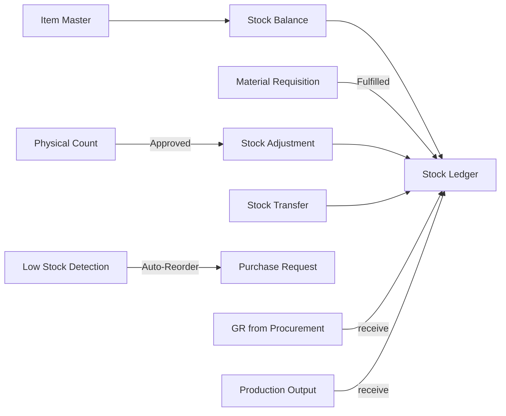

# Inventory Module -- Full Gap Analysis and Audit

## Executive Summary

Deep code-level analysis of the entire Inventory module (backend services, controllers, routes, policies, frontend pages, hooks, and router). The module is significantly more mature than the Recruitment module was -- it has proper confirmation dialogs, toast notifications, validation, and a well-structured multi-step MRQ approval workflow. However, there are still notable bugs and gaps.

---

## Module Architecture Overview

---

## CRITICAL BUGS -- Will Crash at Runtime

### BUG-01: `_err` vs `err` variable name mismatch in 13 catch blocks
- **Files affected**: [`StockBalancePage.tsx`](frontend/src/pages/inventory/StockBalancePage.tsx:83), [`StockAdjustmentsPage.tsx`](frontend/src/pages/inventory/StockAdjustmentsPage.tsx:82), [`PhysicalCountPage.tsx`](frontend/src/pages/inventory/PhysicalCountPage.tsx:113), [`MaterialRequisitionDetailPage.tsx`](frontend/src/pages/inventory/MaterialRequisitionDetailPage.tsx:138), [`ItemMasterListPage.tsx`](frontend/src/pages/inventory/ItemMasterListPage.tsx:60), [`ItemMasterFormPage.tsx`](frontend/src/pages/inventory/ItemMasterFormPage.tsx:101), [`ItemCategoriesPage.tsx`](frontend/src/pages/inventory/ItemCategoriesPage.tsx:136), [`WarehouseLocationsPage.tsx`](frontend/src/pages/inventory/WarehouseLocationsPage.tsx:72), [`CreateMaterialRequisitionPage.tsx`](frontend/src/pages/inventory/CreateMaterialRequisitionPage.tsx:61)
- **Problem**: `catch (_err)` declares the error as `_err` (intentionally unused) but the catch body references `err` (undeclared). This means ALL error handling is broken -- any API error will throw a secondary ReferenceError instead of showing the toast message.
- **Impact**: Every error path in the Inventory module crashes with `Uncaught ReferenceError: err is not defined` instead of showing a user-friendly error message.
- **Fix**: Change all `catch (_err)` to `catch (err)` across all 13 occurrences.

### BUG-02: `isArchiveView` used before declaration in ItemMasterListPage
- **Location**: [`ItemMasterListPage.tsx:30`](frontend/src/pages/inventory/ItemMasterListPage.tsx:30)
- **Problem**: Inside `ItemCategoriesModal`, `useQuery` is enabled with `isArchiveView` but this variable is not declared in the modal scope -- it is from the parent component scope. The query will either crash or always be disabled.
- **Impact**: The archived items query inside the categories modal will malfunction.
- **Fix**: Remove the `isArchiveView` dependency from the modal or pass it as a prop.

---

## HIGH-SEVERITY GAPS -- Workflow and Feature Issues

### GAP-01: No delete/archive for Item Master
- **Location**: [`ItemMasterController`](app/Http/Controllers/Inventory/ItemMasterController.php)
- **Problem**: There is `toggleActive` but no soft-delete/archive. The `ItemMasterListPage` has an `ArchiveToggleButton` but no actual archive endpoint or `DELETE` route.
- **Impact**: Items cannot be archived/deleted.
- **Fix**: Add `destroy` method with soft-delete and corresponding route.

### GAP-02: No delete for warehouse locations
- **Location**: [`WarehouseLocationController`](app/Http/Controllers/Inventory/WarehouseLocationController.php)
- **Problem**: Only `store` and `update` exist. No `destroy` or toggle-active endpoint.
- **Impact**: Locations can never be removed or deactivated from the UI.
- **Fix**: Add toggle-active or destroy route.

### GAP-03: No delete route for item categories
- **Location**: Routes file has no `DELETE` route for categories
- **Problem**: The frontend [`ItemMasterListPage`](frontend/src/pages/inventory/ItemMasterListPage.tsx:57) calls `api.delete('/inventory/items/categories/{id}')` but no such route exists in [`inventory.php`](routes/api/v1/inventory.php).
- **Impact**: Category deletion will 404.
- **Fix**: Add `Route::delete('items/categories/{category}', ...)` route.

### GAP-04: PhysicalCountPage bypasses the proper API workflow
- **Location**: [`PhysicalCountPage.tsx`](frontend/src/pages/inventory/PhysicalCountPage.tsx)
- **Problem**: The page does physical counting entirely client-side, then posts adjustments directly via `useStockAdjust`. It does NOT use the backend [`PhysicalCountController`](app/Http/Controllers/Inventory/PhysicalCountController.php) endpoints (create, startCounting, recordCounts, submitForApproval, approve). The entire server-side physical count workflow with state machine is completely bypassed.
- **Impact**: No audit trail of physical counts, no approval workflow, counts go directly to adjustments without review. The backend `PhysicalCount` model and service are dead code from the frontend's perspective.
- **Fix**: Rewrite `PhysicalCountPage` to use the proper API endpoints: create -> startCounting -> recordCounts -> submitForApproval -> approve.

### GAP-05: No UI to view/manage physical count records
- **Problem**: The backend has full CRUD + workflow for physical counts (`GET /physical-counts`, `GET /physical-counts/{id}`), but there is no list page to view past physical counts, their status, or approve pending ones.
- **Impact**: The entire physical count approval workflow is invisible.
- **Fix**: Create a PhysicalCountListPage and PhysicalCountDetailPage.

### GAP-06: MaterialRequisitionListPage uses non-existent archive endpoint
- **Location**: [`MaterialRequisitionListPage.tsx:49`](frontend/src/pages/inventory/MaterialRequisitionListPage.tsx:49)
- **Problem**: Queries `api.get('/inventory/mrqs-archived')` but no such route exists.
- **Impact**: Archive view toggle will 404.
- **Fix**: Either add the route or use `with_archived` param on the existing list endpoint.

### GAP-07: No stock reservation management UI
- **Location**: Backend has [`StockReservation`](app/Domains/Inventory/Models/StockReservation.php) model and [`StockReservationService`](app/Domains/Inventory/Services/StockReservationService.php) but no controller, routes, or frontend.
- **Impact**: Stock reservations created by production orders or sales orders cannot be viewed or managed.
- **Fix**: Add a reservations list view, at minimum read-only.

### GAP-08: No lot/batch tracking UI
- **Location**: Backend has [`LotBatch`](app/Domains/Inventory/Models/LotBatch.php) model but no controller, routes, or frontend.
- **Impact**: Lot/batch numbers are recorded in stock ledger but there's no way to view, search, or manage lots.
- **Fix**: Add lot tracking view.

---

## MEDIUM-SEVERITY GAPS

### GAP-09: No edit capability for Material Requisitions
- **Problem**: MRQs can only be created, not edited. Once created in draft, items cannot be modified. No `update` route exists.
- **Fix**: Add `PUT /requisitions/{mrq}` endpoint for draft-status MRQs.

### GAP-10: No item detail/view page
- **Problem**: The router has `/inventory/items/:ulid` but it routes to `ItemMasterFormPage` (edit mode). There is no read-only item detail view showing stock balances, ledger history, and related MRQs.
- **Fix**: Create an ItemDetailPage or add a read-only mode to the form page.

### GAP-11: Stock ledger page has no "Transfer" transaction type filter
- **Problem**: The [`StockLedgerPage`](frontend/src/pages/inventory/StockLedgerPage.tsx) may not show transfers as a distinct type in the filter dropdown.
- **Fix**: Verify and add all transaction types to the filter.

### GAP-12: No authorization on PhysicalCount endpoints
- **Location**: [`PhysicalCountController`](app/Http/Controllers/Inventory/PhysicalCountController.php)
- **Problem**: None of the endpoints (`index`, `store`, `show`, `startCounting`, `recordCounts`, `submitForApproval`, `approve`) have `$this->authorize()` calls. Any user with inventory module access can create and approve physical counts.
- **Fix**: Add proper policy checks.

### GAP-13: No authorization on WarehouseLocation index
- **Location**: [`WarehouseLocationController::index()`](app/Http/Controllers/Inventory/WarehouseLocationController.php:15)
- **Problem**: No `$this->authorize()` call on the index method.
- **Fix**: Add authorization.

### GAP-14: No authorization on StockController balances/ledger
- **Location**: [`StockController`](app/Http/Controllers/Inventory/StockController.php)
- **Problem**: `balances()` and `ledger()` have no authorization checks.
- **Fix**: Add `$this->authorize('viewAny', ItemMaster::class)` or equivalent.

---

## LOW-SEVERITY GAPS

### GAP-15: No inventory dashboard
- **Problem**: No central inventory dashboard with KPIs (total value, low stock count, pending MRQs, recent movements).
- **Fix**: Create an InventoryDashboard component.

### GAP-16: No export on stock ledger
- **Problem**: StockBalancePage has an ExportButton but StockLedgerPage does not.
- **Fix**: Add ExportButton to StockLedgerPage.

### GAP-17: Transfer page has no transfer history
- **Problem**: [`StockTransferPage`](frontend/src/pages/inventory/StockTransferPage.tsx) only shows the transfer form. No history of past transfers.
- **Fix**: Add a recent transfers list similar to StockAdjustmentsPage.

### GAP-18: Warehouse locations page missing search
- **Problem**: No search input on WarehouseLocationsPage.
- **Fix**: Add search filter.

---

## Recommended Fix Priority

### Phase 1 -- Critical Bugs
- [ ] BUG-01: Fix `_err` -> `err` in 13 catch blocks (runtime crash)
- [ ] BUG-02: Fix `isArchiveView` scope issue in ItemMasterListPage

### Phase 2 -- Workflow Completeness
- [ ] GAP-03: Add delete route for item categories
- [ ] GAP-04: Rewrite PhysicalCountPage to use proper API workflow
- [ ] GAP-05: Create PhysicalCountListPage + PhysicalCountDetailPage
- [ ] GAP-06: Fix archive endpoint for MRQ list
- [ ] GAP-09: Add edit capability for draft MRQs

### Phase 3 -- Authorization Fixes
- [ ] GAP-12: Add authorization to PhysicalCount endpoints
- [ ] GAP-13: Add authorization to WarehouseLocation index
- [ ] GAP-14: Add authorization to StockController balances/ledger

### Phase 4 -- Feature Gaps
- [ ] GAP-01: Add soft-delete for Item Master
- [ ] GAP-02: Add toggle-active for warehouse locations
- [ ] GAP-07: Stock reservation view
- [ ] GAP-08: Lot/batch tracking view
- [ ] GAP-10: Item detail page

### Phase 5 -- UX Polish
- [ ] GAP-15: Inventory dashboard
- [ ] GAP-16: Export on stock ledger
- [ ] GAP-17: Transfer history
- [ ] GAP-18: Warehouse locations search
