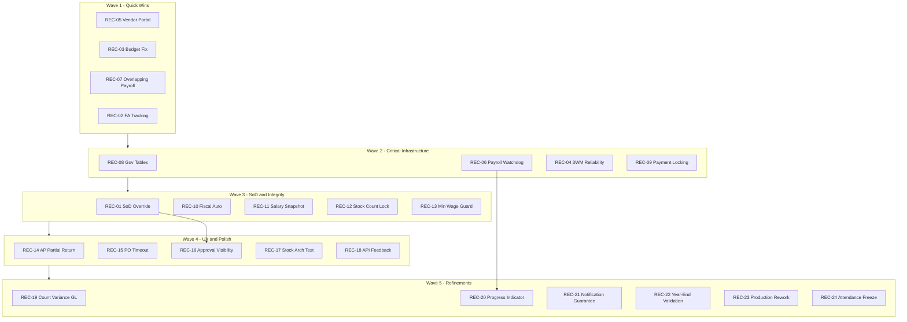

# Ogami ERP - Implementation Details for All Recommendations

This document supplements the main adversarial analysis report with concrete, code-level implementation details for every recommendation across all priority levels.

---

## CRITICAL PRIORITY (Wave 1-2)

---

### REC-01: SoD Emergency Override Mechanism

**Addresses:** HB-01, HB-02, HB-03, F-035, F-036, F-037, F-038

#### Database Changes

**New migration:** `create_sod_override_audit_log_table.php`

```
Schema::create('sod_override_audit_log', function (Blueprint $table) {
    $table->id();
    $table->ulid('ulid')->unique();
    $table->string('override_type');         -- payroll_hr_approve, payroll_acctg_approve, ap_approve, etc.
    $table->string('entity_type');           -- payroll_runs, vendor_invoices, etc.
    $table->unsignedBigInteger('entity_id');
    $table->unsignedBigInteger('original_actor_id');  -- who was blocked by SoD
    $table->unsignedBigInteger('granted_by_id');      -- admin/super_admin who authorized
    $table->text('reason');                  -- mandatory justification
    $table->timestamp('granted_at');
    $table->timestamp('expires_at');         -- auto-expire after 24h
    $table->boolean('was_used')->default(false);
    $table->timestamps();
    $table->softDeletes();
});
```

**New migration:** `create_approval_delegates_table.php`

```
Schema::create('approval_delegates', function (Blueprint $table) {
    $table->id();
    $table->ulid('ulid')->unique();
    $table->unsignedBigInteger('delegator_id');
    $table->unsignedBigInteger('delegate_id');
    $table->string('permission_scope');     -- payroll.hr_approve, payroll.vp_approve, etc.
    $table->date('effective_from');
    $table->date('effective_until');
    $table->text('reason');
    $table->unsignedBigInteger('created_by_id');
    $table->timestamps();
    $table->softDeletes();
});
```

#### New Files

**`app/Shared/Services/SodOverrideService.php`**

```php
final class SodOverrideService implements ServiceContract
{
    public function grantOverride(string $overrideType, string $entityType, int $entityId,
        int $originalActorId, int $grantedById, string $reason): SodOverrideAuditLog;
    
    public function hasValidOverride(string $overrideType, string $entityType,
        int $entityId, int $actorId): bool;
    
    public function findDelegate(string $permissionScope, ?int $excludeUserId = null): ?User;
}
```

**`app/Shared/Models/SodOverrideAuditLog.php`** -- Eloquent model
**`app/Shared/Models/ApprovalDelegate.php`** -- Eloquent model
**`app/Http/Controllers/Admin/SodOverrideController.php`** -- Admin CRUD

#### Files to Modify

**`app/Domains/Payroll/Services/PayrollWorkflowService.php`** -- lines 96-100

In `hrApprove()`, after SoD check fails, check for override:

```php
if ($run->initiated_by_id && $approverId === (int) $run->initiated_by_id) {
    $hasOverride = app(SodOverrideService::class)->hasValidOverride(
        'payroll_hr_approve', 'payroll_runs', $run->id, $approverId
    );
    if (! $hasOverride) {
        $delegate = app(SodOverrideService::class)->findDelegate(
            'payroll.hr_approve', excludeUserId: $run->initiated_by_id
        );
        throw new SodViolationException(
            'SOD-005: ...' . ($delegate ? " Eligible delegate: {$delegate->name}" 
                : ' No delegate configured. Request SoD override from admin.')
        );
    }
    Log::warning('SoD override used for payroll HR approval', [...]);
}
```

Apply same pattern to `acctgApprove()` at line 208.

**`app/Domains/AP/Services/VendorInvoiceService.php`** -- lines 183, 210, 237
Each approval step checks SoD. Add override check as fallback in `headNote()`, `managerCheck()`, `officerReview()`.

#### Frontend

**`frontend/src/pages/admin/SodOverrides.tsx`** -- New page
**`frontend/src/pages/payroll/PayrollApproval.tsx`** -- Add "Request SoD Override" button on SoD error

---

### REC-02: Fix Fixed Asset Depreciation GL Tracking

**Addresses:** SF-01, CR-04

#### Current State

`postDepreciationEntry()` at `app/Domains/FixedAssets/Services/FixedAssetService.php:230` already throws DomainException for null GL accounts. But `depreciateMonth()` at line 104 catches `\Throwable` and continues.

#### Files to Modify

**`app/Domains/FixedAssets/Services/FixedAssetService.php`** -- line 77

Change return type from `int` to `array` and track failures:

```php
public function depreciateMonth(FiscalPeriod $period, User $actor): array
{
    $assets = FixedAsset::where('status', 'active')->with('category')->get();
    $succeeded = 0;
    $failed = [];
    $skipped = 0;

    foreach ($assets as $asset) {
        // ... existing skip logic ($skipped++)
        try {
            $this->postDepreciationEntry($asset, $period, $depAmount, $actor);
            $succeeded++;
        } catch (\Throwable $e) {
            Log::critical('Fixed asset depreciation GL posting failed', [
                'asset_id' => $asset->id, 'asset_code' => $asset->asset_code,
                'category_id' => $asset->category_id, 'error' => $e->getMessage(),
            ]);
            $failed[] = ['asset_id' => $asset->id, 'asset_code' => $asset->asset_code, 'error' => $e->getMessage()];
        }
    }
    return ['succeeded' => $succeeded, 'failed' => $failed, 'skipped' => $skipped, 'total' => $assets->count()];
}
```

#### New Files

**`app/Console/Commands/FixedAssetValidateGlAccountsCommand.php`** -- artisan fixed-assets:validate-gl
**`app/Domains/FixedAssets/Services/FaReconciliationService.php`** -- Compare FA register totals vs GL account balances

---

### REC-03: Fix Budget Check False Positive

**Addresses:** SF-02

#### Files to Modify

**`app/Domains/Budget/Services/BudgetEnforcementService.php`** -- line 60-68

Change:
```php
return ['within_budget' => true, ...];
```
To:
```php
return ['within_budget' => false, 'budget_not_configured' => true, 
    'warning' => 'No budget line configured for this department in the current fiscal year.'];
```

#### New Files

**`app/Console/Commands/BudgetHealthCheckCommand.php`** -- Weekly check for unconfigured departments

---

### REC-04: Three-Way Match Event Reliability

**Addresses:** DI-01, F-010, F-023

#### Files to Modify

**`app/Domains/Procurement/Services/ThreeWayMatchService.php`** -- line 96-97

Replace `event(new ThreeWayMatchPassed($freshGr))` with:

```php
\App\Jobs\CreateApInvoiceFromGrJob::dispatch($gr->id)
    ->onQueue('high')
    ->afterCommit();
```

#### New Files

**`app/Jobs/CreateApInvoiceFromGrJob.php`** -- Queued job with 3 retries, exponential backoff, `failed()` handler that notifies AP team

**`app/Console/Commands/ReconcileGrInvoicesCommand.php`** -- Scheduled every 30 min; finds GRs where `three_way_match_passed=true AND ap_invoice_created=false` older than 1 hour

---

### REC-05: Vendor Portal Data Exposure Fix

**Addresses:** SF-04, CR-06

#### Files to Modify

**`app/Http/Controllers/VendorPortal/VendorPortalController.php`** -- line 82

Change: `return response()->json(['data' => $purchaseOrder]);`
To: `return response()->json(['data' => new VendorPurchaseOrderResource($purchaseOrder)]);`

Also line 62: `return response()->json($orders);`
To: `return VendorPurchaseOrderResource::collection($orders)->response();`

#### New Files

**`app/Http/Resources/VendorPortal/VendorPurchaseOrderResource.php`** -- Whitelists: ulid, po_reference, status, delivery_date, total_amount, items, fulfillment_notes, goods_receipts summary. Excludes: internal_notes, margin_*, unit_cost, budget refs, approval comments.

**`app/Http/Resources/VendorPortal/VendorPurchaseOrderItemResource.php`** -- Item-level resource

#### New Test

```php
arch('vendor portal never returns raw models')
    ->expect('App\Http\Controllers\VendorPortal')
    ->toUse('App\Http\Resources\VendorPortal');
```

---

### REC-06: Payroll Processing Watchdog

**Addresses:** HB-04, F-024

#### Database Changes

```
$table->timestamp('processing_started_at')->nullable();
$table->unsignedInteger('total_employees')->default(0);
$table->unsignedInteger('processed_employees')->default(0);
$table->string('processing_failure_reason')->nullable();
```

#### New Files

**`app/Console/Commands/PayrollProcessingWatchdogCommand.php`** -- Every 5 min; auto-transitions stale PROCESSING runs to FAILED after 30 min

#### Files to Modify

**`app/Domains/Payroll/Services/PayrollComputationService.php`** -- Set `processing_started_at` at start; increment `processed_employees` per employee

**`app/Domains/Payroll/Services/PayrollRunService.php`** -- Add `forceFail()` method for admin use

---

### REC-07: Prevent Overlapping Payroll Runs

**Addresses:** DI-03, F-022

#### Database Changes

```sql
CREATE UNIQUE INDEX idx_payroll_run_active_period 
ON payroll_runs (pay_period_id) 
WHERE status NOT IN ('cancelled', 'REJECTED', 'RETURNED', 'FAILED', 'PUBLISHED');
```

#### Files to Modify

**`app/Domains/Payroll/Services/PayrollRunService.php`** -- Add pre-create check for existing active run

---

### REC-08: Gov Contribution Table Pre-Flight Check

**Addresses:** HB-06, CR-01, F-004

#### Files to Modify

**`app/Domains/Payroll/Services/PayrollPreRunService.php`** -- Add `checkPR009()` that verifies SSS, PhilHealth, PagIBIG, TRAIN tables have entries

#### New Files

**`app/Console/Commands/PayrollValidateTablesCommand.php`** -- Manual verification command

---

## HIGH PRIORITY (Wave 2-3)

---

### REC-09: Concurrent Payment Guard

**Addresses:** DI-02, F-021

#### Files to Modify

**`app/Domains/AR/Services/PaymentAllocationService.php`** -- line 54

Change:
```php
$openInvoices = CustomerInvoice::query()
    ->where('customer_id', $customerId)
    ->whereIn('status', ['approved', 'partially_paid'])
    ->orderBy('due_date')
    ->get();
```
To:
```php
$openInvoices = CustomerInvoice::query()
    ->where('customer_id', $customerId)
    ->whereIn('status', ['approved', 'partially_paid'])
    ->orderBy('due_date')
    ->lockForUpdate()
    ->get();
```

**`app/Domains/AP/Services/PaymentBatchService.php`** -- Apply same `lockForUpdate()` pattern for vendor invoice payments

#### Database Changes

**Migration:** `add_payment_overflow_trigger.php`

```sql
CREATE OR REPLACE FUNCTION check_customer_payment_overflow()
RETURNS TRIGGER AS $$
DECLARE
    invoice_total NUMERIC;
    payments_total NUMERIC;
BEGIN
    SELECT total_amount_centavos INTO invoice_total 
    FROM customer_invoices WHERE id = NEW.customer_invoice_id;
    
    SELECT COALESCE(SUM(amount_centavos), 0) INTO payments_total 
    FROM customer_payments WHERE customer_invoice_id = NEW.customer_invoice_id;
    
    IF payments_total > invoice_total THEN
        RAISE EXCEPTION 'Payment total % exceeds invoice amount %', payments_total, invoice_total;
    END IF;
    RETURN NEW;
END;
$$ LANGUAGE plpgsql;

CREATE TRIGGER trg_check_customer_payment_overflow
BEFORE INSERT ON customer_payments
FOR EACH ROW EXECUTE FUNCTION check_customer_payment_overflow();
```

---

### REC-10: Fiscal Period Auto-Creation

**Addresses:** HB-05

#### New Files

**`app/Console/Commands/FiscalPeriodAutoCreateCommand.php`**

```php
// artisan accounting:auto-create-fiscal-period
// Schedule: daily at midnight
// Logic:
//   1. If current month has no open period, alert immediately via notification
//   2. If next month period does not exist and we are within 7 days of month end, create it
//   3. Log all auto-created periods
```

#### Files to Modify

**`app/Domains/Accounting/Services/FiscalPeriodService.php`** -- Add:

```php
public function ensureCurrentPeriodExists(): FiscalPeriod
{
    $period = FiscalPeriod::where('date_from', '<=', now())
        ->where('date_to', '>=', now())
        ->where('status', 'open')
        ->first();
    
    if (! $period) {
        throw new DomainException(
            'No open fiscal period for ' . now()->toDateString() . '. Create one in Accounting > Fiscal Periods.',
            'ACCTG_NO_FISCAL_PERIOD', 422
        );
    }
    return $period;
}
```

Call from `JournalEntryService::create()`, `PayrollPostingService`, `ApPaymentPostingService`, and `ProductionCostPostingService` at the beginning of any GL posting method.

**`app/Console/Kernel.php`** -- Register schedule:

```php
$schedule->command('accounting:auto-create-fiscal-period')->dailyAt('00:01');
```

---

### REC-11: Payroll Salary Snapshot Integrity

**Addresses:** DI-05, F-030

#### Database Changes

```
$table->json('salary_changes_detected')->nullable();  -- on payroll_runs table
```

#### Files to Modify

**`app/Domains/Payroll/Services/PayrollWorkflowService.php`** -- In `submitForHrApproval()`:

```php
$changedEmployees = $this->detectSalaryChanges($run);
if ($changedEmployees->isNotEmpty()) {
    $run->update(['salary_changes_detected' => $changedEmployees->toArray()]);
}
```

Add private method `detectSalaryChanges()` that compares `PayrollDetail.basic_salary_centavos` against current `Employee.monthly_salary_centavos`.

#### Frontend

**`frontend/src/pages/payroll/PayrollReview.tsx`** -- Show warning banner when `salary_changes_detected` is non-empty. Add "Recompute" button that returns run to DRAFT.

---

### REC-12: Stock Movement Lock During Physical Count

**Addresses:** DI-04, F-020

#### Database Changes

```
-- On warehouse_locations table
$table->boolean('is_counting')->default(false);
$table->timestamp('counting_started_at')->nullable();
$table->unsignedBigInteger('counting_started_by_id')->nullable();
```

#### Files to Modify

**`app/Domains/Inventory/Services/PhysicalCountService.php`** -- Set `is_counting=true` when count starts; `false` when completes/cancels.

**`app/Domains/Inventory/Services/StockService.php`** -- In `receive()` at line 40 and `issue()` at line 98, add before `DB::transaction`:

```php
$location = WarehouseLocation::find($locationId);
if ($location && $location->is_counting) {
    throw new DomainException(
        'Cannot modify stock: physical count in progress for this warehouse location.',
        'INV_LOCATION_LOCKED_FOR_COUNT', 423
    );
}
```

---

### REC-13: Minimum Wage Compliance Guard

**Addresses:** CR-02, F-041

#### Files to Modify

**`app/Domains/Payroll/Pipeline/Step05BasicPayStep.php`** -- After computing basic pay, add:

```php
$minWage = MinimumWageRate::where('region', $ctx->employee->region ?? 'NCR')
    ->where('effective_date', '<=', $ctx->payPeriod->start_date)
    ->orderByDesc('effective_date')->first();

if ($minWage && $ctx->dailyRate < $minWage->daily_rate_centavos) {
    $ctx->addWarning('BELOW_MINIMUM_WAGE', "Employee {$ctx->employee->employee_code} daily rate below minimum wage for region");
}
```

**`app/Domains/Payroll/Services/PayrollPreRunService.php`** -- Add `checkPR010()` for minimum wage rate existence.

---

## MEDIUM PRIORITY (Wave 3-4)

---

### REC-14: AP Approval Chain Partial Return

**Addresses:** SB-04

#### Current State

The `VendorInvoiceStateMachine` at `app/Domains/AP/StateMachines/VendorInvoiceStateMachine.php` lines 27-36 allows every approval step to return to `draft`:

```php
'pending_approval' => ['head_noted', 'draft', 'deleted'],
'head_noted' => ['manager_checked', 'draft', 'deleted'],
'manager_checked' => ['officer_reviewed', 'draft', 'deleted'],
'officer_reviewed' => ['approved', 'draft', 'deleted'],
```

#### Files to Modify

**`app/Domains/AP/StateMachines/VendorInvoiceStateMachine.php`** -- Change transitions to return to previous step instead of draft:

```php
'pending_approval' => ['head_noted', 'draft', 'deleted'],           // draft OK here - it is step 1
'head_noted' => ['manager_checked', 'pending_approval', 'deleted'], // return to prev step
'manager_checked' => ['officer_reviewed', 'head_noted', 'deleted'], // return to prev step
'officer_reviewed' => ['approved', 'manager_checked', 'deleted'],   // return to prev step
```

**`app/Domains/AP/Services/VendorInvoiceService.php`** -- Add new methods for step-back:

```php
public function returnToHeadNote(VendorInvoice $invoice, User $actor, string $reason): VendorInvoice
{
    if ($invoice->status !== 'manager_checked') {
        throw new DomainException('Can only return to head-noted from manager-checked status.', 'AP_INVALID_RETURN', 409);
    }
    
    $invoice->update([
        'status' => 'head_noted',
        'manager_checked_by' => null,
        'manager_checked_at' => null,
        'return_reason' => $reason,
        'returned_by' => $actor->id,
        'returned_at' => now(),
    ]);
    
    // Notify original head noter to re-review
    return $invoice->fresh();
}

public function returnToManagerCheck(VendorInvoice $invoice, User $actor, string $reason): VendorInvoice;
public function returnToPendingApproval(VendorInvoice $invoice, User $actor, string $reason): VendorInvoice;
```

#### Database Changes

```
-- On vendor_invoices table
$table->text('return_reason')->nullable();
$table->unsignedBigInteger('returned_by')->nullable();
$table->timestamp('returned_at')->nullable();
```

#### Frontend

**`frontend/src/pages/ap/VendorInvoiceApproval.tsx`** -- Change "Return to Draft" button to "Return to Previous Step" with dropdown showing which step to return to based on current status.

---

### REC-15: PO Vendor Response Timeout

**Addresses:** SB-01, F-009

#### Database Changes

```
-- On purchase_orders table
$table->date('expected_response_date')->nullable();
$table->unsignedSmallInteger('reminder_count')->default(0);
```

#### New Files

**`app/Console/Commands/PurchaseOrderFollowUpCommand.php`**

```php
// artisan procurement:po-followup
// Schedule: daily at 9am
//
// Logic:
//   1. Find POs in 'sent' status where sent_at > now() - configured_threshold (default 3 days)
//   2. For first reminder: send email to vendor, increment reminder_count
//   3. For second reminder (6 days): send escalation to procurement manager
//   4. For third reminder (10 days): flag PO as 'stale' for manual action
```

**`app/Notifications/Procurement/VendorPoReminderNotification.php`** -- Email to vendor
**`app/Notifications/Procurement/StalePoNotification.php`** -- Alert to procurement team

#### Files to Modify

**`app/Domains/Procurement/Services/PurchaseOrderService.php`** -- In `send()` method, set `expected_response_date`:

```php
$po->update([
    'status' => 'sent',
    'sent_at' => now(),
    'expected_response_date' => now()->addDays(
        config('procurement.vendor_response_days', 3)
    ),
]);
```

**`app/Console/Kernel.php`** -- Register: `$schedule->command('procurement:po-followup')->dailyAt('09:00');`

---

### REC-16: Approval Progress Visibility

**Addresses:** SB-02, SB-06

#### Database Changes

**New migration:** `create_approval_tracking_table.php`

```
Schema::create('approval_tracking', function (Blueprint $table) {
    $table->id();
    $table->string('trackable_type');   -- vendor_invoices, leave_requests, loans, payroll_runs
    $table->unsignedBigInteger('trackable_id');
    $table->unsignedSmallInteger('step_order');
    $table->string('step_name');        -- head_noted, manager_checked, etc.
    $table->string('step_label');       -- Department Head Review, Manager Check, etc.
    $table->string('status')->default('pending');  -- pending, completed, returned, skipped
    $table->unsignedBigInteger('completed_by_id')->nullable();
    $table->timestamp('completed_at')->nullable();
    $table->text('comments')->nullable();
    $table->timestamps();
    
    $table->index(['trackable_type', 'trackable_id']);
});
```

#### New Files

**`app/Shared/Services/ApprovalTrackingService.php`**

```php
final class ApprovalTrackingService implements ServiceContract
{
    // Create tracking entries when a workflow starts
    public function initializeTracking(string $type, int $id, array $steps): void;
    
    // Mark a step as complete
    public function completeStep(string $type, int $id, string $stepName, int $actorId, ?string $comments): void;
    
    // Get current progress for display
    public function getProgress(string $type, int $id): array;
    // Returns: [{step_order, step_name, step_label, status, completed_by, completed_at}]
}
```

#### Files to Modify

Add tracking calls in:
- **`app/Domains/AP/Services/VendorInvoiceService.php`** -- `submit()`, `headNote()`, `managerCheck()`, `officerReview()`, `approve()`
- **`app/Domains/Leave/Services/LeaveRequestService.php`** -- All approval methods
- **`app/Domains/Loan/Services/LoanRequestService.php`** -- All approval methods
- **`app/Domains/Payroll/Services/PayrollWorkflowService.php`** -- All step methods

Example in `VendorInvoiceService::submit()`:

```php
app(ApprovalTrackingService::class)->initializeTracking('vendor_invoices', $invoice->id, [
    ['step_name' => 'head_noted', 'step_label' => 'Department Head Review'],
    ['step_name' => 'manager_checked', 'step_label' => 'Manager Check'],
    ['step_name' => 'officer_reviewed', 'step_label' => 'Officer Review'],
    ['step_name' => 'approved', 'step_label' => 'Final Approval'],
]);
```

#### Frontend

**`frontend/src/components/shared/ApprovalProgressBar.tsx`** -- Reusable step indicator component showing which steps are completed, current step, and pending steps. Include actor name and timestamp for completed steps.

Use in: `VendorInvoiceDetail.tsx`, `LeaveRequestDetail.tsx`, `LoanDetail.tsx`, `PayrollRunDetail.tsx`

---

### REC-17: Stock Service Architecture Enforcement

**Addresses:** SF-07, CR-05

#### New Files

**`tests/Arch/InventoryArchTest.php`**

```php
arch('stock balance only modified through StockService')
    ->expect('App\Domains\Inventory\Models\StockBalance')
    ->not->toBeUsedIn([
        'App\Domains\Procurement',
        'App\Domains\Production',
        'App\Domains\Maintenance',
        'App\Http\Controllers',
    ])
    ->ignoring('App\Domains\Inventory\Services\StockService');

arch('no direct stock increment outside StockService')
    ->expect('increment')
    ->not->toBeCalledIn('App\Domains\Inventory\Models\StockBalance')
    ->except('App\Domains\Inventory\Services\StockService');
```

Note: The exact Pest arch test syntax may need adjustment based on available arch test helpers. The intent is to ensure no code outside `StockService` directly calls `StockBalance::increment()`, `StockBalance::update()`, or `StockBalance::create()`.

#### Files to Audit

Search for direct `StockBalance` usage outside StockService:

```bash
grep -rn "StockBalance::" app/ --include="*.php" | grep -v "StockService.php" | grep -v "Models/"
```

Fix any direct usages to go through `StockService::receive()` or `StockService::issue()`.

---

### REC-18: API Double-Submit User Feedback

**Addresses:** SF-03

#### Files to Modify

**`frontend/src/lib/api.ts`** -- lines 54-58

Current behavior silently aborts and returns `{ __cooldown: true }`.

Change to store the original request promise and return it for duplicate calls:

```typescript
const WRITE_COOLDOWN_MS = 1500
const lastWriteCallAt = new Map<string, number>()
const pendingWritePromises = new Map<string, Promise<unknown>>()

api.interceptors.request.use(
  (config) => {
    const method = (config.method ?? 'get').toUpperCase()
    if (['POST', 'PUT', 'PATCH', 'DELETE'].includes(method)) {
      const key = `${method}:${config.url ?? ''}`
      const lastCall = lastWriteCallAt.get(key) ?? 0
      const now = Date.now()
      if (now - lastCall < WRITE_COOLDOWN_MS) {
        // Return pending promise from original request instead of aborting
        const pending = pendingWritePromises.get(key)
        if (pending) {
          // Attach the pending promise as adapter so axios returns it
          config.__pendingDuplicate = pending
        }
        const controller = new AbortController()
        controller.abort('Duplicate request within cooldown')
        config.signal = controller.signal
      } else {
        lastWriteCallAt.set(key, now)
      }
    }
    return config
  },
)
```

**`frontend/src/lib/api.ts`** -- response interceptor, line 72-76

```typescript
if (axios.isCancel(error)) {
  // Show a non-intrusive toast instead of silently dropping
  const toast = useToast?.() // or import toast utility
  toast?.info('Request already in progress...')
  return Promise.reject({ __cooldown: true })
}
```

Note: Since the interceptor runs outside React context, use a global toast function or event emitter pattern rather than hooks directly.

---

## LOW PRIORITY (Wave 4)

---

### REC-19: Physical Count Automated Variance Posting

**Addresses:** DI-04 (secondary)

#### Current State

`PhysicalCountStateMachine` manages the count lifecycle but there is no automated GL posting for count variances.

#### Files to Modify

**`app/Domains/Inventory/Services/PhysicalCountService.php`** -- Add after count approval:

```php
public function postVarianceToGl(PhysicalCount $count, User $actor): ?JournalEntry
{
    $variance = $count->items->sum(function ($item) {
        return ($item->counted_quantity - $item->system_quantity) * $item->unit_cost_centavos;
    });
    
    if ($variance === 0) {
        return null;
    }
    
    $varianceAccount = ChartOfAccount::where('account_code', 'inventory_variance')->first();
    $inventoryAccount = ChartOfAccount::where('account_code', 'inventory')->first();
    
    if (! $varianceAccount || ! $inventoryAccount) {
        Log::warning('Cannot post physical count variance: GL accounts not configured', [
            'physical_count_id' => $count->id,
        ]);
        return null;
    }
    
    $absVariance = abs($variance) / 100; // centavos to currency
    
    $lines = $variance > 0
        ? [
            ['account_id' => $inventoryAccount->id, 'debit' => $absVariance, 'credit' => null],
            ['account_id' => $varianceAccount->id, 'debit' => null, 'credit' => $absVariance],
        ]
        : [
            ['account_id' => $varianceAccount->id, 'debit' => $absVariance, 'credit' => null],
            ['account_id' => $inventoryAccount->id, 'debit' => null, 'credit' => $absVariance],
        ];
    
    return app(JournalEntryService::class)->create([
        'date' => $count->count_date,
        'description' => "Inventory variance adjustment - Physical Count #{$count->reference}",
        'source_type' => 'physical_counts',
        'source_id' => $count->id,
        'lines' => $lines,
    ]);
}
```

#### Configuration

Add to `SystemSettingsSeeder`:
- `inventory.variance_gl_account_code` -- GL account for inventory variances
- `inventory.auto_post_count_variance` -- boolean toggle (default: false)

---

### REC-20: Payroll Run Progress Indicator

**Addresses:** UX improvement for PROCESSING state

#### Files to Modify

Uses columns added in REC-06: `total_employees`, `processed_employees`, `processing_started_at`

**`frontend/src/pages/payroll/PayrollRunDetail.tsx`** -- Add progress bar component when status is PROCESSING:

```tsx
// Poll every 5 seconds while status is PROCESSING
const { data: run } = usePayrollRun(ulid, {
  refetchInterval: run?.status === 'PROCESSING' ? 5000 : false,
})

{run?.status === 'PROCESSING' && (
  <ProgressBar 
    current={run.processed_employees} 
    total={run.total_employees}
    startedAt={run.processing_started_at}
  />
)}
```

**`frontend/src/components/payroll/ProcessingProgressBar.tsx`** -- New component

```tsx
// Shows: "Processing 247 of 500 employees (49%)"
// Estimated time remaining based on rate
// Warning indicator if started_at > 15 minutes ago
```

#### Backend API

**`app/Http/Controllers/Payroll/PayrollRunController.php`** -- Ensure `show()` returns `total_employees`, `processed_employees`, `processing_started_at` fields.

**`app/Http/Resources/Payroll/PayrollRunResource.php`** -- Add fields to resource.

---

### REC-21: Enhanced Notification Delivery Guarantee

**Addresses:** SF-05

#### Database Changes

**New migration:** `create_notification_delivery_log_table.php`

```
Schema::create('notification_delivery_log', function (Blueprint $table) {
    $table->id();
    $table->ulid('ulid')->unique();
    $table->string('notification_type');     -- class name
    $table->string('channel');               -- mail, database, broadcast
    $table->unsignedBigInteger('notifiable_id');
    $table->string('notifiable_type');
    $table->string('status')->default('pending');  -- pending, sent, failed, retried
    $table->unsignedSmallInteger('attempt_count')->default(0);
    $table->text('error_message')->nullable();
    $table->json('context')->nullable();     -- serialized notification data
    $table->timestamp('first_attempted_at')->nullable();
    $table->timestamp('last_attempted_at')->nullable();
    $table->timestamp('delivered_at')->nullable();
    $table->timestamps();
    
    $table->index(['status', 'attempt_count']);
    $table->index(['notifiable_type', 'notifiable_id']);
});
```

#### New Files

**`app/Shared/Services/NotificationDeliveryService.php`**

```php
final class NotificationDeliveryService implements ServiceContract
{
    public function track(string $notificationType, string $channel, 
        Model $notifiable, array $context): NotificationDeliveryLog;
    
    public function markSent(int $logId): void;
    public function markFailed(int $logId, string $error): void;
    
    public function retryFailed(int $maxAttempts = 3): int;
    // Returns count of retried notifications
}
```

**`app/Console/Commands/RetryFailedNotificationsCommand.php`**

```php
// artisan notifications:retry-failed
// Schedule: every 15 minutes
//
// Logic:
//   1. Find notification_delivery_log WHERE status = 'failed' AND attempt_count < 3
//   2. Re-dispatch each notification
//   3. Update status and attempt_count
//   4. Alert admin if any notifications have failed 3+ times
```

**`frontend/src/pages/admin/NotificationDashboard.tsx`** -- Admin page showing:
- Pending notifications count
- Failed notifications with retry button
- Delivery success rate over last 24h/7d/30d

#### Files to Modify

Wrap all `Notification::send()` calls across the codebase in try-catch with delivery tracking. Most of these are already in try-catch blocks that silently catch `\Throwable` -- replace with tracking:

In `app/Domains/Payroll/Services/PayrollWorkflowService.php` line 63-70:

```php
try {
    Notification::send($acctgManagers, PayrollSubmittedNotification::fromModel($run));
    // Track success
    foreach ($acctgManagers as $m) {
        app(NotificationDeliveryService::class)->markSent(...);
    }
} catch (\Throwable $e) {
    Log::warning('Notification delivery failed', ['error' => $e->getMessage()]);
    app(NotificationDeliveryService::class)->markFailed(..., $e->getMessage());
}
```

---

### REC-22: Year-End Close Pre-Validation for Open Sub-Ledger Items

**Addresses:** Scenario 12

#### Files to Modify

**`app/Domains/Accounting/Services/YearEndClosingService.php`** -- line 38, before the open periods check, add:

```php
// Check for open AP/AR items that should be accrued
$openApInvoices = VendorInvoice::whereYear('invoice_date', $fiscalYear)
    ->whereIn('status', ['approved', 'partially_paid'])
    ->count();

$openArInvoices = CustomerInvoice::whereYear('invoice_date', $fiscalYear)
    ->whereIn('status', ['approved', 'partially_paid'])
    ->count();

$unpostedProductionOrders = ProductionOrder::where('status', 'completed')
    ->whereYear('completed_at', $fiscalYear)
    ->whereDoesntHave('costPostingJournalEntry')
    ->count();

$warnings = [];
if ($openApInvoices > 0) {
    $warnings[] = "{$openApInvoices} open AP invoices from {$fiscalYear} will remain unpaid across year boundary.";
}
if ($openArInvoices > 0) {
    $warnings[] = "{$openArInvoices} open AR invoices from {$fiscalYear} still have outstanding balances.";
}
if ($unpostedProductionOrders > 0) {
    $warnings[] = "{$unpostedProductionOrders} completed production orders have no cost posting -- WIP will be overstated.";
}

if (! empty($warnings) && ! ($data['acknowledge_warnings'] ?? false)) {
    throw new DomainException(
        'Year-end closing has warnings that require acknowledgment: ' . implode(' ', $warnings),
        'ACCT_YEAR_END_WARNINGS',
        422,
        ['warnings' => $warnings]
    );
}
```

---

### REC-23: Production Order Rework Transition

**Addresses:** Scenario 11

#### Files to Modify

**`app/Domains/Production/StateMachines/ProductionOrderStateMachine.php`** -- line 30

Add rework transition:
```php
'completed' => ['closed', 'in_progress'],  // in_progress = rework path
```

**`app/Domains/Production/Services/ProductionOrderService.php`** -- Add:

```php
public function rework(ProductionOrder $order, array $data, User $actor): ProductionOrder
{
    if ($order->status !== 'completed') {
        throw new DomainException('Only completed orders can be sent for rework.', 'PROD_INVALID_REWORK', 422);
    }
    
    // Require NCR reference for audit trail
    if (empty($data['ncr_reference'])) {
        throw new DomainException('NCR reference required for rework.', 'PROD_REWORK_NO_NCR', 422);
    }
    
    return DB::transaction(function () use ($order, $data, $actor) {
        $this->stateMachine->transition($order, 'in_progress');
        $order->update([
            'rework_ncr_reference' => $data['ncr_reference'],
            'rework_quantity' => $data['rework_quantity'],
            'rework_started_at' => now(),
            'rework_started_by_id' => $actor->id,
        ]);
        return $order->fresh();
    });
}
```

#### Database Changes

```
$table->string('rework_ncr_reference')->nullable();
$table->decimal('rework_quantity', 12, 2)->nullable();
$table->timestamp('rework_started_at')->nullable();
$table->unsignedBigInteger('rework_started_by_id')->nullable();
```

---

### REC-24: Attendance Freeze During Payroll Processing

**Addresses:** Scenario 18

#### Database Changes

```
-- On pay_periods table
$table->boolean('attendance_frozen')->default(false);
$table->timestamp('attendance_frozen_at')->nullable();
```

#### Files to Modify

**`app/Domains/Payroll/Services/PayrollComputationService.php`** -- Before starting computation:

```php
$payPeriod = $run->payPeriod;
$payPeriod->update(['attendance_frozen' => true, 'attendance_frozen_at' => now()]);
```

After DISBURSED or RETURNED/REJECTED:
```php
$payPeriod->update(['attendance_frozen' => false, 'attendance_frozen_at' => null]);
```

**`app/Domains/Attendance/Services/AttendanceCorrectionService.php`** -- In approve method:

```php
// Check if the correction date falls within a frozen pay period
$frozenPeriod = PayPeriod::where('attendance_frozen', true)
    ->where('start_date', '<=', $correction->correction_date)
    ->where('end_date', '>=', $correction->correction_date)
    ->first();

if ($frozenPeriod) {
    throw new DomainException(
        'Cannot approve attendance correction: payroll processing is in progress for this period. '
        . 'The correction will be applied after the current payroll run completes.',
        'ATT_PERIOD_FROZEN', 423
    );
}
```

---

## Implementation Sequence - All Waves



## Summary

| Wave | Recommendations | New Migrations | New Files | Files Modified |
|------|----------------|----------------|-----------|----------------|
| Wave 1 | REC-02, 03, 05, 07 | 1 | 4 | 4 |
| Wave 2 | REC-04, 06, 08, 09 | 3 | 5 | 5 |
| Wave 3 | REC-01, 10, 11, 12, 13 | 4 | 6 | 8 |
| Wave 4 | REC-14, 15, 16, 17, 18 | 3 | 7 | 8 |
| Wave 5 | REC-19, 20, 21, 22, 23, 24 | 3 | 5 | 9 |
| **Total** | **24 recommendations** | **14 migrations** | **27 new files** | **34 files modified** |
