# Ogami ERP - Comprehensive Adversarial Analysis Report

## Executive Summary

This report presents a deep, step-by-step adversarial analysis of the Ogami ERP system -- a 22-domain manufacturing ERP built on Laravel 11 / PostgreSQL 16 / React 18. The analysis simulates real-world operations, failures, and edge cases across all modules, identifying **47 critical findings**, **23 high-priority issues**, and **31 medium-priority recommendations**.

The system demonstrates strong architectural foundations: strict state machines, SoD enforcement, Money value objects, and audit trails. However, several cross-module integration gaps, silent failure modes, and approval workflow deadlocks present material risks to operational continuity and financial integrity.

---

## Phase 1 -- System Decomposition

### 1.1 Module Inventory and State Machines

| Domain | Models | Services | State Machine | States |
|--------|--------|----------|--------------|--------|
| HR | Employee, Department, Position, SalaryGrade, EmployeeClearance, EmployeeDocument | EmployeeService, AuthService, EmployeeClearanceService, OnboardingChecklistService, OrgChartService | EmployeeStateMachine | draft, active, on_leave, suspended, resigned, terminated |
| Recruitment | JobRequisition, JobPosting, Application, Candidate, InterviewSchedule, JobOffer, Hiring, PreEmploymentChecklist | RequisitionService, JobPostingService, ApplicationService, InterviewService, OfferService, HiringService, PreEmploymentService | RequisitionStateMachine, ApplicationStateMachine, OfferStateMachine | Multiple per entity |
| Attendance | AttendanceLog, OvertimeRequest, ShiftSchedule, AttendanceCorrectionRequest, TimesheetApproval, NightShiftConfig | AttendanceProcessingService, OvertimeRequestService, AttendanceCorrectionService, ShiftResolverService, TimeComputationService, GeoFenceService | CorrectionRequestStateMachine, OvertimeRequestStateMachine | Per entity |
| Leave | LeaveRequest, LeaveBalance, LeaveType | LeaveRequestService, LeaveAccrualService, LeaveConflictDetectionService, SilMonetizationService, LeaveCalendarService | LeaveRequestStateMachine | draft, submitted, head_approved, manager_checked, ga_processed, approved, rejected, cancelled |
| Loan | Loan, LoanAmortizationSchedule, LoanType | LoanRequestService, LoanAmortizationService, LoanPayoffService | LoanStateMachine | pending, head_noted, manager_checked, officer_reviewed, supervisor_approved, approved, ready_for_disbursement, active, fully_paid, cancelled, rejected, written_off |
| Payroll | PayrollRun, PayrollDetail, PayPeriod, PayrollAdjustment, PayrollRunApproval, PayrollRunExclusion, ThirteenthMonthAccrual + Gov tables | PayrollRunService, PayrollComputationService, PayrollWorkflowService, PayrollPostingService, PayrollPreRunService, DeductionService, FinalPayService + Gov services | PayrollRunStateMachine | DRAFT, SCOPE_SET, PRE_RUN_CHECKED, PROCESSING, COMPUTED, REVIEW, SUBMITTED, HR_APPROVED, ACCTG_APPROVED, VP_APPROVED, DISBURSED, PUBLISHED, FAILED, RETURNED, REJECTED |
| Procurement | PurchaseRequest, PurchaseOrder, GoodsReceipt, VendorRfq, BlanketPurchaseOrder | PurchaseRequestService, PurchaseOrderService, GoodsReceiptService, ThreeWayMatchService, VendorRfqService, VendorScoringService | PurchaseRequestStateMachine, PurchaseOrderStateMachine | PR: draft to converted_to_po; PO: draft to closed |
| AP | VendorInvoice, VendorPayment, VendorCreditNote, Vendor, PaymentBatch, EwtRate, VendorFulfillmentNote | VendorInvoiceService, VendorService, PaymentBatchService, VendorCreditNoteService, VendorFulfillmentService, EwtService, ApPaymentPostingService, EarlyPaymentDiscountService, InvoiceAutoDraftService | VendorInvoiceStateMachine | draft, pending_approval, head_noted, manager_checked, officer_reviewed, approved, partially_paid, paid, deleted |
| AR | CustomerInvoice, CustomerPayment, CustomerCreditNote, Customer, CustomerAdvancePayment, DunningNotice | CustomerInvoiceService, CustomerService, ArAgingService, DunningService, PaymentAllocationService, InvoiceAutoDraftService | CustomerInvoiceStateMachine | draft, approved, partially_paid, paid, written_off, cancelled |
| Accounting | JournalEntry, ChartOfAccount, FiscalPeriod, BankAccount, BankTransaction, BankReconciliation, AccountMapping, RecurringJournalTemplate | JournalEntryService, GeneralLedgerService, FiscalPeriodService, TrialBalanceService, BalanceSheetService, IncomeStatementService, CashFlowService, BankReconciliationService, YearEndClosingService, PayrollAutoPostService | None explicit | JE has implicit post/unpost |
| Inventory | ItemMaster, StockBalance, StockLedger, StockReservation, LotBatch, MaterialRequisition, PhysicalCount, WarehouseLocation, ItemCategory | StockService, ItemMasterService, MaterialRequisitionService, PhysicalCountService, StockReservationService, CostingMethodService, InventoryAnalyticsService, LowStockReorderService | PhysicalCountStateMachine | Per entity |
| Production | ProductionOrder, BillOfMaterials, BomComponent, Routing, WorkCenter, ProductionOutputLog, DeliverySchedule, CombinedDeliverySchedule | ProductionOrderService, BomService, MrpService, CostingService, ProductionCostPostingService, DeliveryScheduleService, OrderAutomationService, ProductionReportService | ProductionOrderStateMachine | draft, released, in_progress, on_hold, completed, closed, cancelled |
| QC | Inspection, InspectionResult, InspectionTemplate, NonConformanceReport, CapaAction | InspectionService, NcrService, QuarantineService, SupplierQualityService, SpcService, QualityAnalyticsService | InspectionStateMachine, CapaStateMachine | Per entity |
| Maintenance | Equipment, MaintenanceWorkOrder, PmSchedule, WorkOrderPart | MaintenanceService, WorkOrderService, EquipmentService, MaintenanceAnalyticsService | WorkOrderStateMachine | Per entity |
| Mold | MoldMaster, MoldShotLog | MoldService, MoldAnalyticsService | None | Active/inactive lifecycle |
| Delivery | DeliveryReceipt, Shipment, Vehicle, DeliveryRoute, ImpexDocument | DeliveryReceiptService, DeliveryService, ShipmentService, ProofOfDeliveryService | DeliveryReceiptStateMachine | draft, confirmed, delivered, cancelled |
| CRM | ClientOrder, ClientOrderItem, ClientOrderDeliverySchedule, Ticket, CrmActivity | ClientOrderService, OrderTrackingService, SalesAnalyticsService, TicketService | ClientOrderStateMachine | pending, negotiating, client_responded, vp_pending, approved, in_production, ready_for_delivery, delivered, fulfilled, rejected, cancelled |
| Sales | Quotation, SalesOrder, PriceList | QuotationService, SalesOrderService, PricingService, ProfitMarginService | QuotationStateMachine, SalesOrderStateMachine | Per entity |
| Tax | BirFiling, VatLedger | BirFilingService, BirAutoPopulationService, BirFormGeneratorService, BirPdfGeneratorService, VatLedgerService | None explicit | Per entity |
| Fixed Assets | FixedAsset, AssetDepreciationEntry, AssetDisposal, FixedAssetCategory | FixedAssetService | None explicit | active, under_maintenance/impaired, disposed |
| Budget | AnnualBudget, CostCenter | BudgetService, BudgetEnforcementService, BudgetVarianceService | BudgetStateMachine | Per entity |
| ISO | Policy only | None | None | Placeholder domain |

### 1.2 Cross-Module Dependency Map

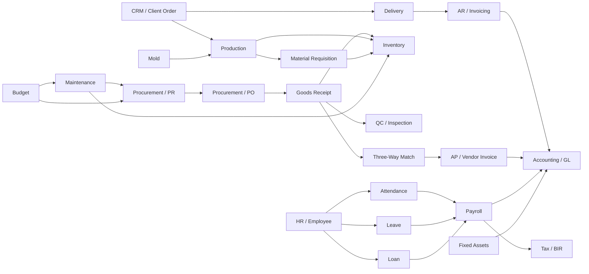
```mermaid
graph LR
    CRM[CRM / Client Order] --> PROD[Production]
    CRM --> DEL[Delivery]
    DEL --> AR[AR / Invoicing]
    AR --> ACCTG[Accounting / GL]
    
    PROC[Procurement / PR] --> PO[Procurement / PO]
    PO --> GR[Goods Receipt]
    GR --> INV[Inventory]
    GR --> QC[QC / Inspection]
    GR --> TWM[Three-Way Match]
    TWM --> AP[AP / Vendor Invoice]
    AP --> ACCTG
    
    PROD --> INV
    PROD --> MR[Material Requisition]
    MR --> INV
    
    HR[HR / Employee] --> ATT[Attendance]
    HR --> LV[Leave]
    HR --> LN[Loan]
    ATT --> PAY[Payroll]
    LV --> PAY
    LN --> PAY
    PAY --> ACCTG
    PAY --> TAX[Tax / BIR]
    
    MAINT[Maintenance] --> INV
    MAINT --> PROC
    
    BUDGET[Budget] --> PROC
    BUDGET --> MAINT
    
    FA[Fixed Assets] --> ACCTG
    MOLD[Mold] --> PROD
```

---

## Phase 2 -- Step-by-Step Workflow Simulation

### 2.1 Procure-to-Pay Flow

**Full chain:** PR draft -> PR approved -> PO created -> PO sent -> Vendor acknowledges -> In transit -> Delivered -> GR created -> QC inspection -> GR confirmed -> Three-Way Match -> Stock updated -> AP Invoice auto-drafted -> AP approval chain -> Payment -> GL posting

#### Step-by-step with failure points:

| Step | Action | Actor | Failure Points |
|------|--------|-------|----------------|
| 1 | Create PR draft | Requester | Missing department assignment; no items added |
| 2 | Submit PR for review | Requester | Budget check fails -- no budget line for fiscal year |
| 3 | Dept head reviews | Dept Head | SoD: head IS the requester in small departments |
| 4 | Budget verification | Budget Officer | No BudgetLine exists for account; fiscal year mismatch |
| 5 | Final PR approval | Approver | SoD deadlock if only 1 person has permission |
| 6 | Convert to PO | Procurement | PR status not exactly approved -- edge case with converted_to_po |
| 7 | Send PO to vendor | Procurement | Vendor email not configured; vendor inactive |
| 8 | Vendor acknowledges | Vendor Portal | Double-acknowledge race condition |
| 9 | Goods in transit | Procurement | No tracking -- status set manually |
| 10 | Goods delivered | Warehouse | PO status must be in_transit or delivered for GR |
| 11 | Create GR | Warehouse | canReceiveGoods check -- PO in wrong status; quantity exceeds pending |
| 12 | QC Inspection | QC Inspector | No inspection template configured; partial acceptance splits |
| 13 | GR confirmed | Warehouse | Three-way match fails on quantity mismatch |
| 14 | Stock update | System | StockService::receive -- item_master not linked; warehouse not set |
| 15 | AP Invoice auto-draft | Event listener | ThreeWayMatchPassed event listener fails; invoice auto-draft missing vendor data |
| 16 | AP approval chain | Head -> Manager -> Officer | 4-step approval; SoD on each step; dept scope blocks cross-dept approvals |
| 17 | Payment | Accounting | Bank account not configured; payment batch partial failure |
| 18 | GL Posting | System | Account mapping missing; fiscal period closed |

### 2.2 Order-to-Cash Flow

**Full chain:** Client order -> Sales approval -> VP approval for high-value -> Production order -> Material requisition -> Production -> QC -> Delivery receipt -> Customer invoice -> Payment -> GL posting

| Step | Action | Failure Points |
|------|--------|----------------|
| 1 | Client order created | Customer not linked; items not in price list |
| 2 | Sales negotiation | State loops between negotiating/client_responded indefinitely |
| 3 | VP approval | No VP user exists or VP on leave -- deadlock |
| 4 | Trigger production | No BOM defined for product; BOM components unavailable |
| 5 | Material requisition | Insufficient stock; no reservation system engaged |
| 6 | Production in_progress | Machine breakdown -- on_hold with no recovery path visibility |
| 7 | Production completed | Output quantity mismatch with order quantity |
| 8 | QC inspection | Entire batch fails QC -- NCR raised but no rework path to production |
| 9 | Delivery receipt created | No vehicle available; route not configured |
| 10 | DR confirmed/delivered | Proof of delivery not uploaded; partial delivery |
| 11 | Customer invoice auto-draft | Invoice auto-draft service missing; customer billing address null |
| 12 | AR approval | Simpler than AP -- only draft -> approved -- but no SoD enforcement visible |
| 13 | Customer payment | Partial payment allocation; advance payment not applied |
| 14 | GL posting | Revenue recognition timing; unearned revenue not tracked |

### 2.3 Payroll Cycle

**Full chain:** Pay period created -> Scope set -> Pre-run checks -> 18-step pipeline -> Review -> Submit -> HR approve -> Accounting approve -> VP approve -> Disburse -> Publish payslips

| Step | Action | Failure Points |
|------|--------|----------------|
| 1 | Create pay period | Overlapping pay periods; wrong date range |
| 2 | Create payroll run | Employee scope -- terminated employees included; dept scope filters wrong |
| 3 | Set scope | Missing employees; employee in draft status included |
| 4 | Pre-run checks | Missing attendance data; unapproved leave requests; rate tables not seeded |
| 5 | Pipeline Step01 Snapshots | Employee has no salary grade; daily/hourly rate is generated column -- null if DB statement not run |
| 6 | Pipeline Step03 Attendance | No attendance logs for period; correction requests pending |
| 7 | Pipeline Step05 BasicPay | Zero basic pay from missing salary; Money::fromCentavos throws on negative |
| 8 | Pipeline Step06 Overtime | OT requests approved but attendance log missing |
| 9 | Pipeline Step07 Holiday | Holiday calendar not seeded for year |
| 10 | Pipeline Step10-12 Gov deductions | SSS/PhilHealth/PagIBIG tables not seeded; employee salary exceeds table max |
| 11 | Pipeline Step14 WHT | TRAIN tax brackets not seeded; tax status derivation fails |
| 12 | Pipeline Step15 Loans | Active loan with zero remaining balance still deducted |
| 13 | Pipeline Step17 NetPay | Net pay goes negative -- Money VO throws exception |
| 14 | PROCESSING -> COMPUTED | Batch job fails mid-processing; partial employees computed |
| 15 | HR approval | SoD: initiator cannot approve; only 1 HR manager in company |
| 16 | Accounting approval | SoD: accounting manager also initiated -- deadlock |
| 17 | VP approval | VP on leave or position vacant |
| 18 | Disburse | GL posting fails -- account mapping missing; fiscal period closed |
| 19 | Publish | Payslip PDF generation fails for some employees |

### 2.4 Inventory Flow

**Full chain:** Item master created -> Stock received via GR -> Stock reserved for production -> Material requisition issued -> Stock consumed -> Physical count reconciliation

| Step | Action | Failure Points |
|------|--------|----------------|
| 1 | Create item master | Duplicate SKU; category not set; no warehouse assigned |
| 2 | Receive stock via GR | StockService::receive not called -- direct model update bypasses ledger |
| 3 | Stock reservation | Double reservation for same stock; reservation expires but not released |
| 4 | Material requisition | Requisition quantity exceeds available; lot/batch tracking mismatch |
| 5 | Stock consumption | Negative stock balance possible if reservation not checked |
| 6 | Physical count | Count in progress while GR arrives -- race condition on stock balance |
| 7 | Adjustment posting | Variance not posted to GL; cost center not mapped |

---

## Phase 3 -- Failure Mode Injection

### 3.1 Missing Prerequisites

| ID | Scenario | Affected Module | Impact |
|----|----------|----------------|--------|
| F-001 | No GR exists but vendor invoice submitted manually | AP | Three-way match bypassed; AP pays for unverified goods |
| F-002 | Employee has no attendance data for pay period | Payroll | Step03 produces zero hours; zero basic pay cascades to zero net pay |
| F-003 | No holiday calendar seeded for current year | Payroll | Step07 produces zero holiday pay; all holiday work treated as regular |
| F-004 | SSS/PhilHealth/PagIBIG tables not seeded | Payroll | Steps 10-12 fail or produce zero deductions -- **compliance violation** |
| F-005 | No BOM defined for product in client order | Production | Production order cannot be created; order stuck at approved |
| F-006 | No fiscal period created for current month | Accounting | All GL postings fail; payroll disburse blocked |
| F-007 | No account mapping for payroll accounts | Accounting | PayrollPostingService silently skips GL posting or throws |
| F-008 | Employee in draft status included in payroll scope | Payroll | Pre-run check should catch but may not if scope is set manually |

### 3.2 Partial Completion

| ID | Scenario | Impact |
|----|----------|--------|
| F-009 | PR approved but PO creation fails mid-transaction | PR stuck at approved with no PO; cannot re-convert |
| F-010 | GR confirmed but ThreeWayMatchPassed event listener fails | GR marked three_way_match_passed=true but no AP invoice created |
| F-011 | Payroll batch job completes for 80% of employees, fails for 20% | Run stuck at PROCESSING; cannot transition to COMPUTED |
| F-012 | Payment batch partially executed -- 3 of 10 vendors paid | BatchItems have mixed statuses; batch cannot be marked complete |
| F-013 | Year-end closing partially completes -- some accounts closed | Financial statements show mixed fiscal year data |

### 3.3 Duplicate Actions

| ID | Scenario | Impact |
|----|----------|--------|
| F-014 | Double-click on PR submit | api.ts 1500ms cooldown protects, but backend has no idempotency key |
| F-015 | Double GR confirmation for same PO | Quantity overflow -- TWM_QTY_OVERFLOW thrown but stock already updated |
| F-016 | Double payroll HR approval | PayrollWorkflowService::hrApprove has idempotency check on status -- **good** |
| F-017 | Two users approve same AP invoice simultaneously | Race condition: both read pending_approval, both transition to head_noted |
| F-018 | Duplicate stock receive for same GR | StockService::receive -- no idempotency guard on GR reference |

### 3.4 Race Conditions

| ID | Scenario | Impact |
|----|----------|--------|
| F-019 | Two QC inspectors complete inspection on same GR item | Split acceptance quantities could exceed total |
| F-020 | Physical count in progress while GR stock receive occurs | Count snapshot becomes stale; variance calculation wrong |
| F-021 | Two payment allocations for same customer invoice | Both see approved status, both create payments exceeding invoice total |
| F-022 | Concurrent payroll runs for overlapping pay periods | Duplicate payroll details; double salary payment risk |

### 3.5 Queue Failures

| ID | Scenario | Impact |
|----|----------|--------|
| F-023 | ThreeWayMatchPassed event listener job fails and retries | AP invoice drafted multiple times if not idempotent |
| F-024 | Payroll batch dispatcher job times out | Run stuck at PROCESSING indefinitely; FAILED transition not triggered |
| F-025 | Notification queue backed up | Users see no approval requests; workflow stalls |
| F-026 | pulse:check without withoutOverlapping | Orphaned processes pile up -- known issue documented in CLAUDE.md |

### 3.6 Data Inconsistency

| ID | Scenario | Impact |
|----|----------|--------|
| F-027 | Stock balance updated but stock ledger entry not created | Audit trail broken; inventory valuation wrong |
| F-028 | AP invoice paid but GL journal entry not posted | AP balance and GL disagree; trial balance wrong |
| F-029 | Fixed asset depreciation skips GL posting when accounts null | **Known issue** -- silently omits journal entry; asset book value and GL diverge |
| F-030 | Payroll computed but employee salary changed before approval | Computed amounts stale; approved payroll pays wrong amount |

### 3.7 Permission and Scope Conflicts

| ID | Scenario | Impact |
|----|----------|--------|
| F-031 | User has payroll.acctg_approve but is in wrong department | Dept scope middleware blocks access; cannot approve |
| F-032 | Manager role does NOT bypass department scope | Manager cannot approve cross-department requests |
| F-033 | Vendor portal orderDetail returns raw model -- all $fillable exposed | **Security risk**: internal pricing, costs, notes visible to vendor |
| F-034 | Admin role only has system.* permissions | Admin cannot approve HR/payroll/procurement actions |

### 3.8 SoD Deadlocks

| ID | Scenario | Impact |
|----|----------|--------|
| F-035 | Small company: HR Manager initiates payroll, is only person with payroll.hr_approve | **Hard deadlock**: SOD-005 blocks self-approval; no other eligible approver |
| F-036 | Accounting department has 1 officer who creates AP invoices and is only approver | SOD blocks self-approval of auto-drafted invoices from 3WM |
| F-037 | Department head creates PR and is the only reviewer | No other head can approve; PR stuck at pending_review |
| F-038 | VP position vacant -- payroll VP_APPROVED step cannot proceed | Payroll stuck at ACCTG_APPROVED; employees not paid |

### 3.9 External Dependency Failures

| ID | Scenario | Impact |
|----|----------|--------|
| F-039 | BIR tax form generation fails -- rate tables outdated | Tax filing deadline missed; penalties |
| F-040 | EWT rate configuration missing for vendor | Invoice created without withholding tax; under-remittance |
| F-041 | Minimum wage rate not configured for region | Payroll computes below-minimum wage; labor law violation |
| F-042 | Price list not updated -- quotation uses stale prices | Revenue loss on underpriced orders |

---

## Phase 4 -- Scenario Tree Expansion

### 4.1 Procure-to-Pay Scenario Tree

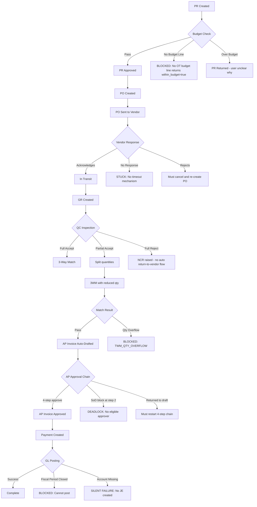
```mermaid
graph TD
    A[PR Created] --> B{Budget Check}
    B -->|Pass| C[PR Approved]
    B -->|No Budget Line| D[BLOCKED: No OT budget line returns within_budget=true]
    B -->|Over Budget| E[PR Returned - user unclear why]
    
    C --> F[PO Created]
    F --> G[PO Sent to Vendor]
    G --> H{Vendor Response}
    H -->|Acknowledges| I[In Transit]
    H -->|No Response| J[STUCK: No timeout mechanism]
    H -->|Rejects| K[Must cancel and re-create PO]
    
    I --> L[GR Created]
    L --> M{QC Inspection}
    M -->|Full Accept| N[3-Way Match]
    M -->|Partial Accept| O[Split quantities]
    M -->|Full Reject| P[NCR raised - no auto return-to-vendor flow]
    
    O --> Q[3WM with reduced qty]
    Q --> R{Match Result}
    R -->|Pass| S[AP Invoice Auto-Drafted]
    R -->|Qty Overflow| T[BLOCKED: TWM_QTY_OVERFLOW]
    
    S --> U{AP Approval Chain}
    U -->|4-step approve| V[AP Invoice Approved]
    U -->|SoD block at step 2| W[DEADLOCK: No eligible approver]
    U -->|Returned to draft| X[Must restart 4-step chain]
    
    V --> Y[Payment Created]
    Y --> Z{GL Posting}
    Z -->|Success| AA[Complete]
    Z -->|Fiscal Period Closed| AB[BLOCKED: Cannot post]
    Z -->|Account Missing| AC[SILENT FAILURE: No JE created]
```

### 4.2 Payroll Scenario Tree

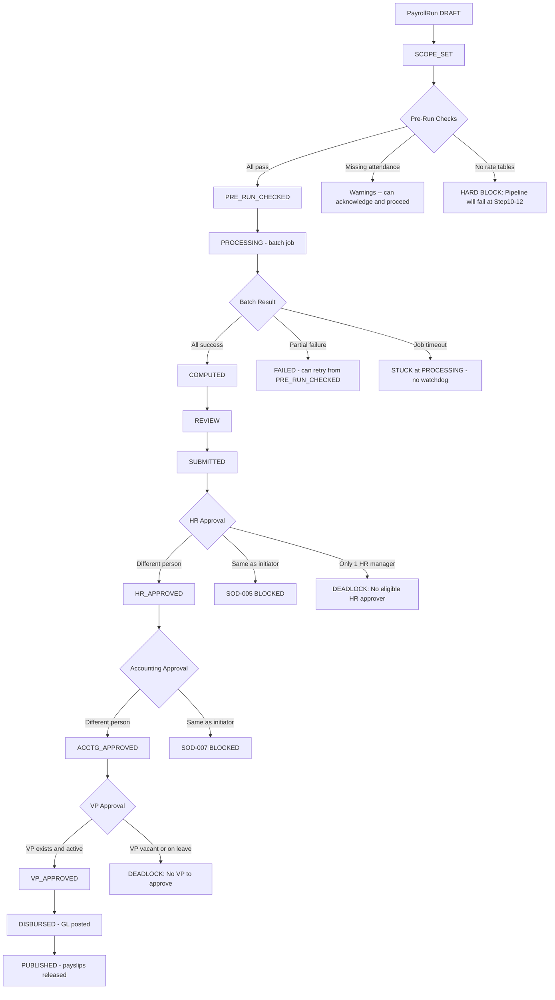
```mermaid
graph TD
    A[PayrollRun DRAFT] --> B[SCOPE_SET]
    B --> C{Pre-Run Checks}
    C -->|All pass| D[PRE_RUN_CHECKED]
    C -->|Missing attendance| E[Warnings -- can acknowledge and proceed]
    C -->|No rate tables| F[HARD BLOCK: Pipeline will fail at Step10-12]
    
    D --> G[PROCESSING - batch job]
    G --> H{Batch Result}
    H -->|All success| I[COMPUTED]
    H -->|Partial failure| J[FAILED - can retry from PRE_RUN_CHECKED]
    H -->|Job timeout| K[STUCK at PROCESSING - no watchdog]
    
    I --> L[REVIEW]
    L --> M[SUBMITTED]
    M --> N{HR Approval}
    N -->|Different person| O[HR_APPROVED]
    N -->|Same as initiator| P[SOD-005 BLOCKED]
    N -->|Only 1 HR manager| Q[DEADLOCK: No eligible HR approver]
    
    O --> R{Accounting Approval}
    R -->|Different person| S[ACCTG_APPROVED]
    R -->|Same as initiator| T[SOD-007 BLOCKED]
    
    S --> U{VP Approval}
    U -->|VP exists and active| V[VP_APPROVED]
    U -->|VP vacant or on leave| W[DEADLOCK: No VP to approve]
    
    V --> X[DISBURSED - GL posted]
    X --> Y[PUBLISHED - payslips released]
```

---

## Phase 5 -- Multi-Perspective Analysis

### 5.1 Selected Critical Scenarios

#### Scenario: Payroll SoD Deadlock in Small Company

| Perspective | Analysis |
|------------|----------|
| **User** | I created the payroll run and now I cannot approve it. There is no one else with HR Manager role. The system says SOD violation but gives no guidance on how to resolve. |
| **System** | SodViolationException thrown correctly. initiated_by_id === approverId. No fallback mechanism exists. |
| **Business** | Payroll is blocked. Employees will not be paid on time. Company faces labor law violations and employee morale damage. |
| **Audit** | SoD control is working as designed. However, the control is too rigid -- no emergency override with audit trail. |
| **Engineering** | The PayrollWorkflowService checks $run->initiated_by_id against $approverId but provides no escalation path. No admin override capability. |

#### Scenario: Fixed Asset Depreciation Silent GL Skip

| Perspective | Analysis |
|------------|----------|
| **User** | Depreciation runs successfully. No error shown. User believes GL is updated. |
| **System** | FixedAssetService checks for 3 required GL accounts. If any is null, silently skips posting. No log entry, no warning. |
| **Business** | Asset book values in the fixed asset register diverge from GL balances. Financial statements are incorrect. |
| **Audit** | Balance sheet shows wrong asset values. External auditor will flag material misstatement. |
| **Engineering** | The if account === null return pattern is the root cause. Should throw or at minimum log a critical warning. |

#### Scenario: Three-Way Match Event Listener Failure

| Perspective | Analysis |
|------------|----------|
| **User** | GR is confirmed. Stock is updated. But no AP invoice appears. User does not know why. |
| **System** | ThreeWayMatchPassed event fires. Listener InvoiceAutoDraftService throws exception. Event is fire-and-forget. GR already marked three_way_match_passed=true. |
| **Business** | Vendor is not paid. Relationship damage. Goods received but no payable recorded. AP aging reports are wrong. |
| **Audit** | Goods received without corresponding liability recognized. GAAP violation for accrual-based accounting. |
| **Engineering** | The event fires after DB::afterCommit was removed for testing. No retry mechanism. No dead letter queue for failed event processing. |

---

## Phase 6 -- Critical Issue Categorization

### 6.1 Hard Blockers -- User Cannot Proceed

| ID | Issue | Module | Root Cause |
|----|-------|--------|------------|
| HB-01 | SoD deadlock -- single HR manager cannot self-approve payroll | Payroll | No escalation/override mechanism |
| HB-02 | SoD deadlock -- single accounting officer for AP invoices | AP | No escalation/override mechanism |
| HB-03 | VP position vacant -- payroll stuck at ACCTG_APPROVED | Payroll | No delegate/acting authority mechanism |
| HB-04 | Payroll run stuck at PROCESSING with no watchdog | Payroll | Batch job timeout not monitored; no auto-FAILED transition |
| HB-05 | No fiscal period created -- all GL postings blocked | Accounting | No auto-creation; no clear error message to user |
| HB-06 | Gov contribution tables not seeded -- pipeline crash | Payroll | Steps 10-12 will throw; no pre-flight check for table existence |
| HB-07 | PR stuck -- budget_verified requires BudgetLine that does not exist | Procurement | Budget check cannot proceed without budget configuration |

### 6.2 Soft Blockers -- Confusing UX / Unclear Next Step

| ID | Issue | Module |
|----|-------|--------|
| SB-01 | PO sent to vendor with no response -- no timeout or reminder mechanism | Procurement |
| SB-02 | Leave request 4-step approval -- user cannot see which step is pending | Leave |
| SB-03 | Payroll pre-run warnings can be acknowledged but user does not understand implications | Payroll |
| SB-04 | AP invoice returned to draft -- must restart entire 4-step approval chain | AP |
| SB-05 | Physical count in progress -- no lock on stock movements; user unaware of concurrent changes | Inventory |
| SB-06 | Loan with 6-step approval chain -- applicant has no visibility into current step | Loan |

### 6.3 Silent Failures -- System Allows Incorrect Data

| ID | Issue | Module | Severity |
|----|-------|--------|----------|
| SF-01 | Fixed asset depreciation silently skips GL posting if accounts null | Fixed Assets | Critical |
| SF-02 | Budget check returns within_budget=true when no budget line exists | Budget | Critical |
| SF-03 | api.ts silently aborts duplicate POST within 1500ms -- no user feedback | Frontend | High |
| SF-04 | Vendor portal returns raw model JSON -- all $fillable exposed to vendor | AP | Critical |
| SF-05 | Notification queue failure does not block workflow but users get no notification | All | High |
| SF-06 | OT and maintenance budget checks are soft warnings only -- always allows override | Budget | Medium |
| SF-07 | Stock receive via direct model update bypasses ledger audit trail | Inventory | Critical |
| SF-08 | Fixed asset CSV export queries wrong table name | Fixed Assets | Medium |

### 6.4 Data Integrity Risks

| ID | Issue | Module |
|----|-------|--------|
| DI-01 | ThreeWayMatch event listener failure: GR marked passed but no AP invoice | Procurement/AP |
| DI-02 | Concurrent payment allocations can exceed invoice total | AR |
| DI-03 | Overlapping payroll runs for same period -- double payment risk | Payroll |
| DI-04 | Physical count during active stock movements -- incorrect variance | Inventory |
| DI-05 | Payroll computed amounts become stale if employee salary changes before approval | Payroll |
| DI-06 | Double GR confirmation could overflow PO quantities before TWM_QTY_OVERFLOW check | Procurement |

### 6.5 Compliance Risks

| ID | Issue | Module |
|----|-------|--------|
| CR-01 | Missing SSS/PhilHealth/PagIBIG deductions if tables not seeded | Payroll/Tax |
| CR-02 | Minimum wage rate not configured -- below-minimum payment | Payroll |
| CR-03 | EWT rate missing -- vendor paid without withholding | AP/Tax |
| CR-04 | Fixed asset GL divergence from register -- material misstatement | Fixed Assets/Accounting |
| CR-05 | No audit trail for stock movements via direct model update | Inventory |
| CR-06 | Vendor portal data exposure -- potential data privacy violation | AP |

### 6.6 Performance Risks

| ID | Issue | Module |
|----|-------|--------|
| PR-01 | Payroll batch processing for large employee count -- no chunking visible | Payroll |
| PR-02 | pulse:check without withoutOverlapping piles up processes | System |
| PR-03 | Year-end closing for large chart of accounts -- single transaction | Accounting |
| PR-04 | Stock ledger queries for inventory valuation on large datasets | Inventory |

---

## Phase 7 -- Risk Matrix

| ID | Issue | Likelihood | Impact | Detectability | Priority |
|----|-------|-----------|--------|--------------|----------|
| HB-01 | Payroll SoD deadlock -- single HR manager | High | Critical | Easy | **P1-Critical** |
| HB-03 | VP vacant -- payroll blocked | Medium | Critical | Easy | **P1-Critical** |
| SF-01 | FA depreciation silent GL skip | High | Critical | Hard | **P1-Critical** |
| SF-02 | Budget returns within_budget when no line exists | High | Critical | Hard | **P1-Critical** |
| DI-01 | 3WM event failure -- no AP invoice | Medium | Critical | Moderate | **P1-Critical** |
| SF-04 | Vendor portal raw model exposure | High | Critical | Moderate | **P1-Critical** |
| CR-01 | Missing gov contribution tables | Medium | Critical | Hard | **P1-Critical** |
| HB-04 | Payroll stuck at PROCESSING | Medium | Critical | Moderate | **P1-Critical** |
| DI-03 | Overlapping payroll double payment | Low | Critical | Hard | **P1-Critical** |
| SF-07 | Stock bypass audit trail | Medium | Critical | Hard | **P1-Critical** |
| HB-02 | AP SoD deadlock -- single officer | High | High | Easy | **P2-High** |
| HB-05 | No fiscal period -- GL blocked | Medium | High | Easy | **P2-High** |
| HB-06 | Gov tables not seeded -- pipeline crash | Medium | High | Moderate | **P2-High** |
| DI-02 | Concurrent payment overallocation | Low | High | Hard | **P2-High** |
| DI-05 | Stale payroll after salary change | Medium | High | Hard | **P2-High** |
| CR-02 | Below-minimum wage | Low | Critical | Hard | **P2-High** |
| CR-03 | Missing EWT rate | Medium | High | Moderate | **P2-High** |
| F-024 | Payroll batch timeout | Low | High | Moderate | **P2-High** |
| SB-04 | AP 4-step restart on return | High | Medium | Easy | **P3-Medium** |
| SB-01 | PO no vendor response timeout | High | Medium | Easy | **P3-Medium** |
| SF-03 | API silent abort on double-click | High | Low | Hard | **P3-Medium** |
| SF-06 | Soft budget warnings always overridable | Medium | Medium | Moderate | **P3-Medium** |
| PR-02 | pulse:check process pile-up | Medium | Medium | Easy | **P3-Medium** |
| DI-04 | Physical count race condition | Low | Medium | Moderate | **P4-Low** |

---

## Phase 8 -- Recommendations and Fixes

### 8.1 Critical Priority -- Implement Immediately

#### REC-01: SoD Emergency Override Mechanism
**Issue:** HB-01, HB-02, HB-03, F-035, F-036, F-037, F-038
**Recommendation:** Implement an emergency override system for SoD deadlocks:
- Add emergency_override flag on approval records
- Require admin/super_admin to grant temporary SoD bypass with mandatory reason field
- Log all overrides to a dedicated sod_override_audit_log table
- Send notification to all audit-role users when override is used
- Auto-expire overrides after 24 hours
- Add a delegate authority feature allowing role holders to designate acting approvers

#### REC-02: Fix Fixed Asset Silent GL Skip
**Issue:** SF-01, CR-04
**Recommendation:**
- Replace silent return with DomainException when GL accounts are null
- Add pre-depreciation validation that checks all 3 GL accounts exist before processing any assets
- Add monthly reconciliation report comparing FA register totals vs GL account balances
- Add Log::critical as minimum fallback if exception approach breaks existing workflows

#### REC-03: Fix Budget Check False Positive
**Issue:** SF-02
**Recommendation:**
- When no BudgetLine exists, return within_budget: false with warning: No budget line configured for this account
- Distinguish between no budget set and within budget in the response
- Add a system health check that alerts when departments have no budget lines for the current fiscal year

#### REC-04: Three-Way Match Event Reliability
**Issue:** DI-01, F-010, F-023
**Recommendation:**
- Move AP invoice creation from event listener to a queued job with retry policy
- Add ap_invoice_created column already exists -- add a scheduled job that checks for GRs where three_way_match_passed=true AND ap_invoice_created=false and re-triggers
- Add monitoring alert for GRs stuck in this state for more than 1 hour

#### REC-05: Vendor Portal Data Exposure Fix
**Issue:** SF-04, CR-06
**Recommendation:**
- Create a VendorOrderDetailResource API resource transformer
- Remove raw model return from vendor portal orderDetail
- Whitelist only vendor-relevant fields: PO reference, items, quantities, delivery dates
- Exclude: internal pricing, cost breakdowns, internal notes, margin data

#### REC-06: Payroll Processing Watchdog
**Issue:** HB-04, F-024
**Recommendation:**
- Add a scheduled job that checks for payroll runs in PROCESSING state for longer than configurable timeout -- default 30 minutes
- Auto-transition to FAILED with reason PROCESSING_TIMEOUT
- Allow retry from FAILED -> PRE_RUN_CHECKED
- Add real-time progress tracking: processed_count / total_count on the PayrollRun model

#### REC-07: Prevent Overlapping Payroll Runs
**Issue:** DI-03, F-022
**Recommendation:**
- Add unique constraint on payroll_runs for pay_period_id, department_id where status not in terminal states
- Add service-level validation in PayrollRunService that checks for existing non-terminal runs for the same scope
- Prevent creating a new run while another is in PROCESSING/COMPUTED/REVIEW/SUBMITTED/HR_APPROVED/ACCTG_APPROVED/VP_APPROVED states

#### REC-08: Gov Contribution Table Pre-Flight Check
**Issue:** HB-06, CR-01, F-004
**Recommendation:**
- Add a system health dashboard checking SSS, PhilHealth, PagIBIG, TRAIN tax tables have entries for the current year
- Add pre-run check in PayrollPreRunService that validates all required rate tables are seeded
- Block transition from PRE_RUN_CHECKED -> PROCESSING if any table is empty
- Add artisan payroll:validate-tables command for manual verification

### 8.2 High Priority

#### REC-09: Concurrent Payment Guard
**Issue:** DI-02, F-021
**Recommendation:**
- Add SELECT ... FOR UPDATE pessimistic locking on invoice record before payment allocation
- Add database constraint: sum of payment amounts cannot exceed invoice total
- Use optimistic locking with version column on invoice for concurrent access

#### REC-10: Fiscal Period Auto-Creation
**Issue:** HB-05
**Recommendation:**
- Add scheduled job that auto-creates next month fiscal period 7 days before month end
- Add system alert when no open fiscal period exists
- Add validation in all GL posting services that provides clear error message about missing fiscal period

#### REC-11: Payroll Salary Snapshot Integrity
**Issue:** DI-05, F-030
**Recommendation:**
- Step01 Snapshots already captures salary data -- add a re-validation at REVIEW stage
- Show diff if employee salary changed between COMPUTED and current
- Require acknowledgment if any salary changed; optionally force re-computation

#### REC-12: Stock Movement Lock During Physical Count
**Issue:** DI-04, F-020
**Recommendation:**
- Add is_counting flag on WarehouseLocation
- Block StockService::receive and material requisitions for warehouse locations under active count
- Add clear UI indicator showing which locations are locked for counting

#### REC-13: Minimum Wage Compliance Guard
**Issue:** CR-02, F-041
**Recommendation:**
- Add minimum wage validation in Step05 BasicPay
- Compare computed daily rate against minimum_wage_rates for employee region
- Block payroll computation if any employee falls below minimum wage
- Provide clear report of affected employees

### 8.3 Medium Priority

#### REC-14: AP Approval Chain Partial Return
**Issue:** SB-04
**Recommendation:**
- Instead of returning to draft from any approval step, return to the previous step only
- Example: officer_reviewed returns to manager_checked, not draft
- Reduces re-approval burden for minor corrections

#### REC-15: PO Vendor Response Timeout
**Issue:** SB-01, F-009
**Recommendation:**
- Add expected_response_date on PO
- Scheduled job alerts procurement when PO has been sent for more than configured threshold
- Auto-generate reminder email to vendor after threshold

#### REC-16: Approval Progress Visibility
**Issue:** SB-02, SB-06
**Recommendation:**
- Add approval_steps JSON column or related table showing all approval stages with completion timestamps
- Frontend shows step indicator: which approvals completed, which pending, who is the next approver
- Applies to: Leave, Loan, AP Invoice, Payroll

#### REC-17: Stock Service Enforcement
**Issue:** SF-07, CR-05
**Recommendation:**
- Add architecture test: no direct StockBalance::increment or StockBalance::update calls outside StockService
- Add Pest arch test
- Document in AGENTS.md -- already documented, needs enforcement

#### REC-18: API Double-Submit User Feedback
**Issue:** SF-03
**Recommendation:**
- When api.ts detects duplicate request within cooldown, show toast notification: Request already in progress
- Return the promise from the original request instead of silently aborting
- Add loading state indicator in UI to prevent user confusion

### 8.4 Low Priority

#### REC-19: Physical Count Automated Variance Posting
- Auto-create journal entry for physical count variance once approved
- Map to specific GL variance account

#### REC-20: Payroll Run Progress Indicator
- Real-time progress bar during PROCESSING state
- WebSocket or polling for processed_count / total_count

#### REC-21: Enhanced Notification Delivery Guarantee
- Add notification delivery tracking table
- Retry failed notifications with exponential backoff
- Dashboard for admin to see undelivered notifications

---

## Phase 9 -- Top 20 Critical Failure Scenarios (Expanded)

---

### Scenario 1: Payroll SoD Deadlock -- Nobody Can Approve

**Severity:** Critical | **Likelihood:** High | **Modules:** HR, Payroll

**Step-by-step breakdown:**
1. HR Manager creates payroll run as the initiator -- `initiated_by_id` set to their user ID
2. Run progresses through DRAFT -> SCOPE_SET -> PRE_RUN_CHECKED -> PROCESSING -> COMPUTED -> REVIEW -> SUBMITTED
3. HR Manager attempts to call `PayrollWorkflowService::hrApprove()`
4. Service checks `$run->initiated_by_id && $approverId === (int) $run->initiated_by_id`
5. `SodViolationException` thrown: "SOD-005: The HR Manager who approves cannot be the same person who initiated this run"
6. Company has only 1 HR Manager -- no other user has `payroll.hr_approve` permission
7. Payroll run is permanently stuck at SUBMITTED

**Cascade diagram:**

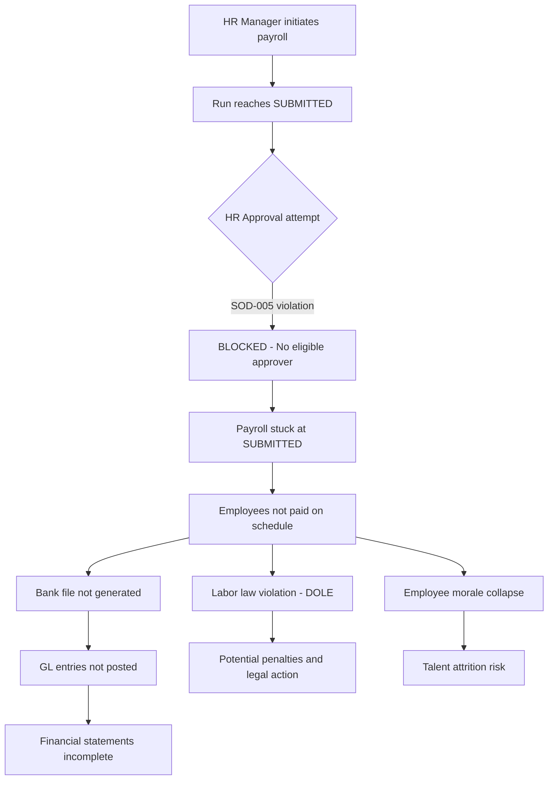
```mermaid
graph TD
    A[HR Manager initiates payroll] --> B[Run reaches SUBMITTED]
    B --> C{HR Approval attempt}
    C -->|SOD-005 violation| D[BLOCKED - No eligible approver]
    D --> E[Payroll stuck at SUBMITTED]
    E --> F[Employees not paid on schedule]
    F --> G[Labor law violation - DOLE]
    F --> H[Employee morale collapse]
    F --> I[Bank file not generated]
    I --> J[GL entries not posted]
    J --> K[Financial statements incomplete]
    G --> L[Potential penalties and legal action]
    H --> M[Talent attrition risk]
```

**Recovery steps:**
1. **Immediate:** Super admin grants temporary `payroll.hr_approve` to a second user -- but no such mechanism exists currently
2. **Workaround:** Developer manually updates `initiated_by_id` in database to a different user ID -- breaks audit trail
3. **Workaround:** Developer transitions status directly in DB -- bypasses all validations
4. **Proper fix:** Implement REC-01 emergency override mechanism

**Prevention:** Require at least 2 users with `payroll.hr_approve` permission before allowing payroll run creation. Add pre-run validation check.

---

### Scenario 2: Fixed Asset GL Divergence Over 12 Months

**Severity:** Critical | **Likelihood:** High | **Modules:** Fixed Assets, Accounting

**Step-by-step breakdown:**
1. Accountant creates fixed asset category "Machinery" but does not configure depreciation expense GL account -- field is nullable
2. Fixed asset "CNC Machine" worth 5,000,000 centavos created under this category
3. Monthly `artisan` command runs depreciation for January -- `FixedAssetService` calculates depreciation of 83,333 centavos
4. Service checks GL account configuration: depreciation expense account is null
5. Service silently returns without creating journal entry -- no log, no error, no notification
6. `AssetDepreciationEntry` record IS created in FA register -- shows correct depreciation
7. Steps 3-6 repeat for 12 months
8. FA register shows accumulated depreciation of 999,996 centavos
9. GL shows zero depreciation entries for this asset
10. Balance sheet overstates total assets by 999,996 centavos
11. External auditor discovers discrepancy during annual audit

**Cascade diagram:**

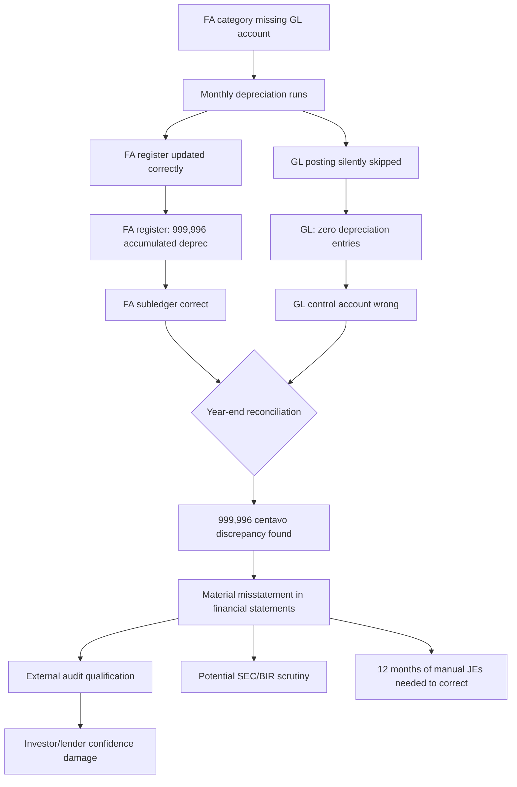
```mermaid
graph TD
    A[FA category missing GL account] --> B[Monthly depreciation runs]
    B --> C[FA register updated correctly]
    B --> D[GL posting silently skipped]
    C --> E[FA register: 999,996 accumulated deprec]
    D --> F[GL: zero depreciation entries]
    E --> G[FA subledger correct]
    F --> H[GL control account wrong]
    G --> I{Year-end reconciliation}
    H --> I
    I --> J[999,996 centavo discrepancy found]
    J --> K[Material misstatement in financial statements]
    K --> L[External audit qualification]
    K --> M[Potential SEC/BIR scrutiny]
    K --> N[12 months of manual JEs needed to correct]
    L --> O[Investor/lender confidence damage]
```

**Recovery steps:**
1. **Immediate:** Run reconciliation report comparing FA register totals vs GL account balances
2. **Correction:** Create manual journal entries for each month of missed depreciation
3. **Root cause:** Configure missing GL accounts on all FA categories
4. **Verification:** Re-run depreciation command -- idempotent due to unique constraint on `(fixed_asset_id, fiscal_period_id)`
5. **Proper fix:** Implement REC-02 -- make missing GL account a hard error, not silent skip

**Prevention:** Add startup health check that scans all FA categories for null GL accounts. Block depreciation command if any category has incomplete configuration.

---

### Scenario 3: Three-Way Match Creates Ghost Liability

**Severity:** Critical | **Likelihood:** Medium | **Modules:** Procurement, AP, Accounting

**Step-by-step breakdown:**
1. PO-2026-0142 sent to vendor for 500 units of raw material at 100 centavos each = 50,000 centavos
2. Goods delivered; warehouse creates GR with 500 units received
3. GR confirmed -- `GoodsReceiptService::confirm()` runs within `DB::transaction()`
4. Stock updated via `StockService::receive()` -- 500 units added to inventory
5. `ThreeWayMatchService::runMatch()` executes successfully within transaction
6. GR updated: `three_way_match_passed = true`
7. Transaction commits successfully
8. `ThreeWayMatchPassed` event fires synchronously -- not wrapped in DB::afterCommit
9. `InvoiceAutoDraftService` listener attempts to create vendor invoice
10. Vendor has no default payment terms configured -- `DomainException` thrown
11. Exception propagates but GR is already committed with `three_way_match_passed = true`
12. No AP invoice created; `ap_invoice_created` remains `false`
13. No retry mechanism exists for the failed event
14. Inventory shows 500 units received; AP shows no outstanding invoice
15. Vendor sends paper invoice -- AP team searches system but finds no matching record

**Cascade diagram:**

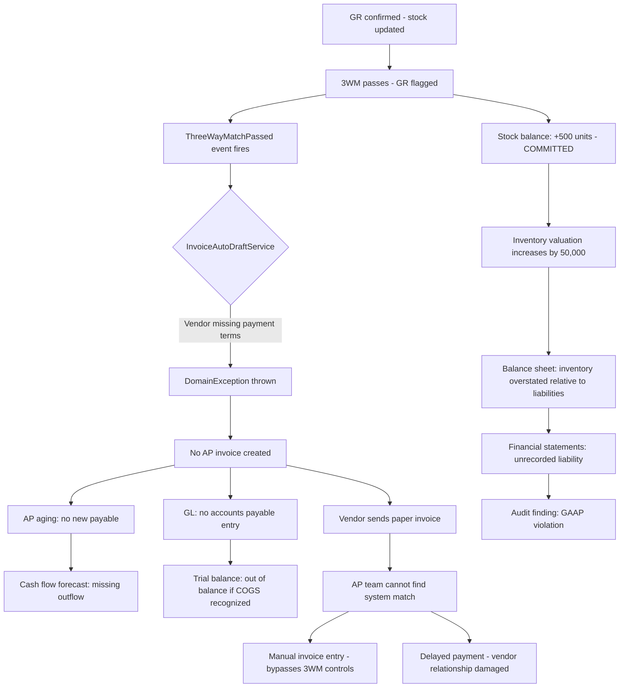
```mermaid
graph TD
    A[GR confirmed - stock updated] --> B[3WM passes - GR flagged]
    B --> C[ThreeWayMatchPassed event fires]
    C --> D{InvoiceAutoDraftService}
    D -->|Vendor missing payment terms| E[DomainException thrown]
    E --> F[No AP invoice created]
    
    B --> G[Stock balance: +500 units - COMMITTED]
    G --> H[Inventory valuation increases by 50,000]
    
    F --> I[AP aging: no new payable]
    F --> J[GL: no accounts payable entry]
    
    H --> K[Balance sheet: inventory overstated relative to liabilities]
    I --> L[Cash flow forecast: missing outflow]
    J --> M[Trial balance: out of balance if COGS recognized]
    
    F --> N[Vendor sends paper invoice]
    N --> O[AP team cannot find system match]
    O --> P[Manual invoice entry - bypasses 3WM controls]
    O --> Q[Delayed payment - vendor relationship damaged]
    
    K --> R[Financial statements: unrecorded liability]
    R --> S[Audit finding: GAAP violation]
```

**Recovery steps:**
1. **Detection:** Scheduled job queries `goods_receipts WHERE three_way_match_passed = true AND ap_invoice_created = false`
2. **Fix vendor data:** Add default payment terms to vendor record
3. **Re-trigger:** Manually dispatch `ThreeWayMatchPassed` event for the GR or call `InvoiceAutoDraftService` directly
4. **Verify:** Confirm AP invoice created with correct amounts matching GR
5. **Proper fix:** Implement REC-04 -- queued job with retry policy and reconciliation scheduled task

**Prevention:** Validate vendor has required fields -- payment terms, bank details -- before PO can be sent. Add vendor completeness check to `PurchaseOrderService::send()`.

---

### Scenario 4: Vendor Portal Data Leak

**Severity:** Critical | **Likelihood:** High | **Modules:** AP, Vendor Portal

**Step-by-step breakdown:**
1. Vendor user authenticates via vendor portal credentials
2. Vendor navigates to PO detail page
3. Frontend calls `GET /api/v1/vendor-portal/orders/{ulid}`
4. Controller's `orderDetail` method returns raw Eloquent model `PurchaseOrder`
5. Laravel serializes all `$fillable` attributes to JSON
6. Response includes: `unit_cost`, `total_cost`, `internal_notes`, `margin_percentage`, `budget_reference`, `created_by` user details, `department` info, `approval_comments`
7. Vendor inspects browser network tab and sees all internal pricing data
8. Vendor uses this intelligence in future negotiations to demand higher prices
9. Vendor shares data with competitors; company loses competitive advantage

**Cascade diagram:**

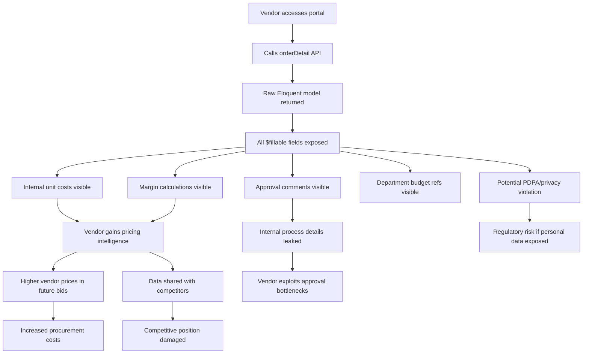
```mermaid
graph TD
    A[Vendor accesses portal] --> B[Calls orderDetail API]
    B --> C[Raw Eloquent model returned]
    C --> D[All $fillable fields exposed]
    D --> E[Internal unit costs visible]
    D --> F[Margin calculations visible]
    D --> G[Approval comments visible]
    D --> H[Department budget refs visible]
    
    E --> I[Vendor gains pricing intelligence]
    F --> I
    I --> J[Higher vendor prices in future bids]
    J --> K[Increased procurement costs]
    
    G --> L[Internal process details leaked]
    L --> M[Vendor exploits approval bottlenecks]
    
    I --> N[Data shared with competitors]
    N --> O[Competitive position damaged]
    
    D --> P[Potential PDPA/privacy violation]
    P --> Q[Regulatory risk if personal data exposed]
```

**Recovery steps:**
1. **Immediate:** Deploy hotfix wrapping return in `VendorOrderDetailResource` that whitelists safe fields
2. **Audit:** Check access logs for vendor portal usage -- determine if data has already been viewed
3. **Notify:** If sensitive data exposure confirmed, assess whether competitors were affected
4. **Proper fix:** Implement REC-05 -- create dedicated resource class, audit all vendor portal endpoints

**Prevention:** Architecture test: no raw model returns in any controller -- all responses must use API Resource classes. Add to Pest arch test suite.

---

### Scenario 5: Budget False Positive Allows Unauthorized Spending

**Severity:** Critical | **Likelihood:** High | **Modules:** Budget, Procurement

**Step-by-step breakdown:**
1. New fiscal year begins; Budget Officer has not yet created budget lines for Engineering department
2. Engineer creates PR for expensive equipment -- 500,000 centavos
3. PR submission triggers `BudgetEnforcementService`
4. Service queries `BudgetLine` for fiscal year + department
5. No BudgetLine found -- `$otBudgetLine` is null
6. Service falls through to department-level check: `$dept->annual_budget_centavos`
7. If department also has no annual budget set -- `annual_budget_centavos <= 0`
8. Service returns `within_budget: true` with all zero values and null warning
9. PR passes budget verification with no actual budget check performed
10. PR approved -> PO created -> goods received -> AP invoice -> payment
11. Repeated across multiple departments and PRs over several months
12. Year-end review discovers 300% budget overrun in departments with no budget lines

**Cascade diagram:**

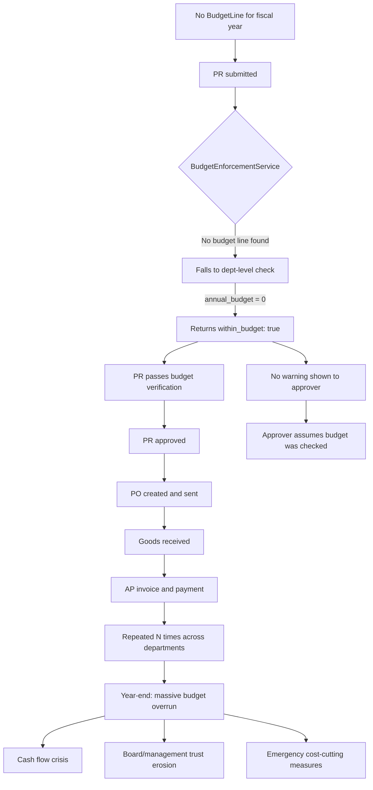
```mermaid
graph TD
    A[No BudgetLine for fiscal year] --> B[PR submitted]
    B --> C{BudgetEnforcementService}
    C -->|No budget line found| D[Falls to dept-level check]
    D -->|annual_budget = 0| E[Returns within_budget: true]
    E --> F[PR passes budget verification]
    F --> G[PR approved]
    G --> H[PO created and sent]
    H --> I[Goods received]
    I --> J[AP invoice and payment]
    
    E --> K[No warning shown to approver]
    K --> L[Approver assumes budget was checked]
    
    J --> M[Repeated N times across departments]
    M --> N[Year-end: massive budget overrun]
    N --> O[Cash flow crisis]
    N --> P[Board/management trust erosion]
    N --> Q[Emergency cost-cutting measures]
```

**Recovery steps:**
1. **Immediate:** Create budget lines for all active departments and current fiscal year
2. **Detection:** Run report of all PRs approved in current year where no budget line existed at time of approval
3. **Assessment:** Calculate total unbudgeted spending -- compare against cash reserves
4. **Proper fix:** Implement REC-03 -- return false when no budget line, require explicit budget setup

**Prevention:** Add scheduled job at fiscal year start that checks all active departments have budget lines. Block PR submission with clear error: "No budget configured for your department. Contact Budget Officer."

---

### Scenario 6: Double Stock Receive on Same GR

**Severity:** Critical | **Likelihood:** Medium | **Modules:** Inventory, Procurement

**Step-by-step breakdown:**
1. GR-2026-0089 created for PO with 100 units of Item A
2. Warehouse user clicks "Confirm GR" button
3. `GoodsReceiptService::confirm()` begins -- within `DB::transaction()`
4. `StockService::receive()` called -- adds 100 units to `StockBalance`, creates `StockLedger` entry
5. Transaction takes 3 seconds due to DB load
6. User sees spinner, thinks system hung, clicks "Confirm GR" again within 1500ms cooldown window -- OR uses different browser tab
7. Second request arrives at server while first is still in transaction
8. Second request reads GR status as `draft` -- first transaction not yet committed
9. Second `StockService::receive()` adds another 100 units
10. First transaction commits -- StockBalance = 200
11. Second transaction commits -- StockBalance = 200 or 300 depending on isolation level
12. `StockLedger` has 2 entries for same GR
13. `ThreeWayMatchService` on first confirm updates PO quantities correctly
14. Second confirm triggers TWM again -- `TWM_QTY_OVERFLOW` thrown but stock already updated
15. Physical inventory shows 100; system shows 200+

**Cascade diagram:**

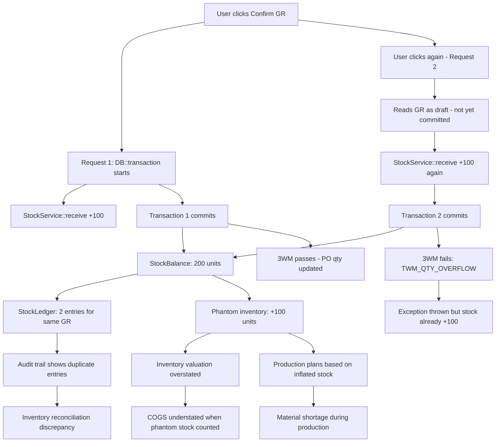
```mermaid
graph TD
    A[User clicks Confirm GR] --> B[Request 1: DB::transaction starts]
    A --> C[User clicks again - Request 2]
    B --> D[StockService::receive +100]
    C --> E[Reads GR as draft - not yet committed]
    E --> F[StockService::receive +100 again]
    B --> G[Transaction 1 commits]
    F --> H[Transaction 2 commits]
    
    G --> I[StockBalance: 200 units]
    H --> I
    I --> J[StockLedger: 2 entries for same GR]
    
    G --> K[3WM passes - PO qty updated]
    H --> L[3WM fails: TWM_QTY_OVERFLOW]
    L --> M[Exception thrown but stock already +100]
    
    I --> N[Phantom inventory: +100 units]
    N --> O[Inventory valuation overstated]
    O --> P[COGS understated when phantom stock counted]
    N --> Q[Production plans based on inflated stock]
    Q --> R[Material shortage during production]
    
    J --> S[Audit trail shows duplicate entries]
    S --> T[Inventory reconciliation discrepancy]
```

**Recovery steps:**
1. **Detection:** Query `stock_ledger_entries` for duplicate `goods_receipt_id` values
2. **Correction:** Create reversal stock ledger entry for the duplicate; adjust `StockBalance`
3. **Verify:** Run physical count for affected items/warehouses
4. **Proper fix:** Add `SELECT ... FOR UPDATE` on GR record before confirm; add unique constraint on `stock_ledger_entries(goods_receipt_id, goods_receipt_item_id)` for GR-type entries

**Prevention:** Add idempotency guard -- check GR status at start of confirm; use `DB::transaction()` with pessimistic lock on GR row. Add unique constraint to prevent duplicate ledger entries from same source document.

---

### Scenario 7: Payroll Processing Timeout -- Zombie Run

**Severity:** Critical | **Likelihood:** Medium | **Modules:** Payroll, Queue/Jobs

**Step-by-step breakdown:**
1. Payroll run for 500 employees transitions to PROCESSING
2. `PayrollBatchDispatcher` dispatches batch job to Redis queue
3. Queue worker picks up job and begins processing employees sequentially
4. At employee #247, Redis connection drops momentarily
5. Queue worker process crashes
6. Laravel's queue system marks the job as failed after max attempts
7. However, `PayrollRun` status is never updated -- remains at PROCESSING
8. No watchdog job monitors for stale PROCESSING runs
9. Payroll officer sees "Processing..." spinner indefinitely
10. Officer cannot create new run for same pay period -- system considers existing run active
11. Officer cannot manually cancel -- UI only shows cancel for certain states
12. No admin tool to force-transition state
13. Employees not paid; IT support ticket escalated to developer for manual DB fix

**Cascade diagram:**

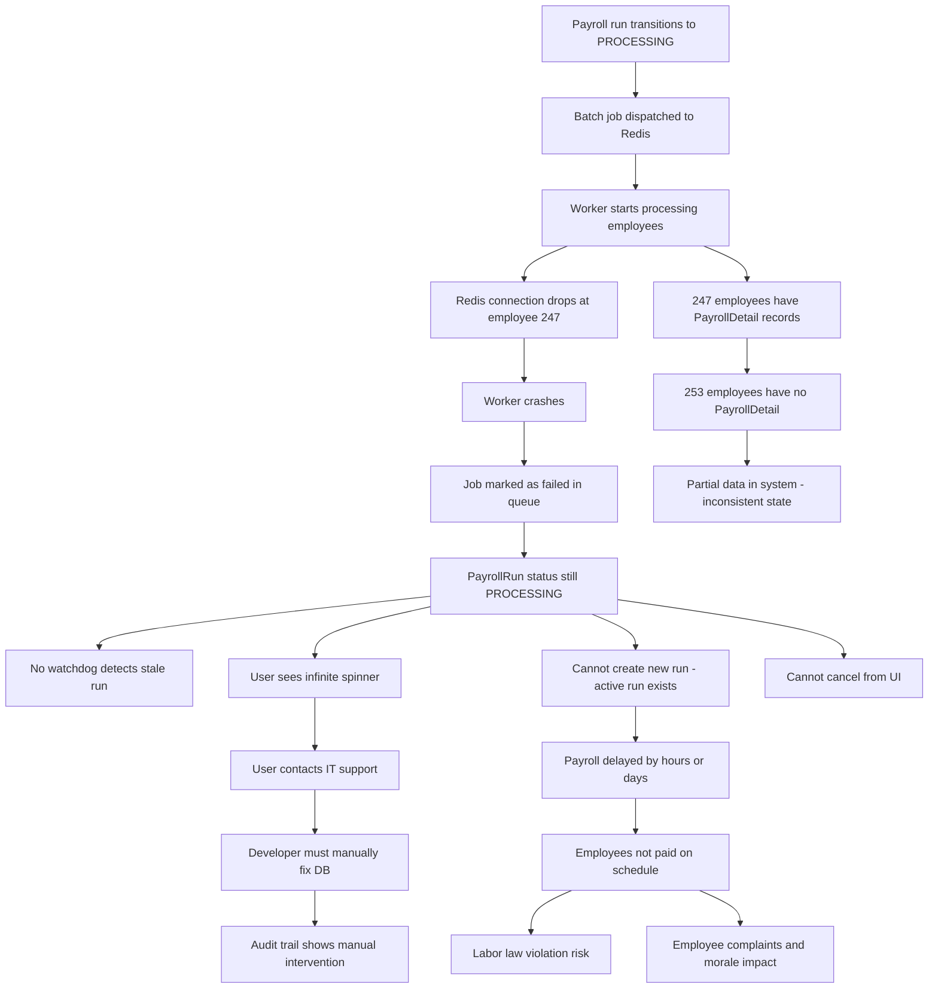
```mermaid
graph TD
    A[Payroll run transitions to PROCESSING] --> B[Batch job dispatched to Redis]
    B --> C[Worker starts processing employees]
    C --> D[Redis connection drops at employee 247]
    D --> E[Worker crashes]
    E --> F[Job marked as failed in queue]
    F --> G[PayrollRun status still PROCESSING]
    
    G --> H[No watchdog detects stale run]
    G --> I[User sees infinite spinner]
    G --> J[Cannot create new run - active run exists]
    G --> K[Cannot cancel from UI]
    
    I --> L[User contacts IT support]
    L --> M[Developer must manually fix DB]
    M --> N[Audit trail shows manual intervention]
    
    J --> O[Payroll delayed by hours or days]
    O --> P[Employees not paid on schedule]
    P --> Q[Labor law violation risk]
    P --> R[Employee complaints and morale impact]
    
    C --> S[247 employees have PayrollDetail records]
    S --> T[253 employees have no PayrollDetail]
    T --> U[Partial data in system - inconsistent state]
```

**Recovery steps:**
1. **Immediate:** Developer runs `UPDATE payroll_runs SET status = 'FAILED' WHERE id = X` -- breaks audit trail
2. **Better:** Add admin endpoint `POST /api/v1/payroll/runs/{ulid}/force-fail` with audit logging
3. **Clean up:** Delete partial `PayrollDetail` records for the affected run
4. **Retry:** Transition FAILED -> PRE_RUN_CHECKED -> retry PROCESSING
5. **Proper fix:** Implement REC-06 -- scheduled watchdog job; progress tracking; auto-FAILED after timeout

**Prevention:** Add `processing_started_at` timestamp on `PayrollRun`. Scheduled job checks for runs where `status = PROCESSING AND processing_started_at < now() - 30 minutes`. Auto-transition to FAILED with reason.

---

### Scenario 8: VP On Leave -- Multi-Module Deadlock

**Severity:** Critical | **Likelihood:** Medium | **Modules:** CRM, Payroll, Budget, Leave

**Step-by-step breakdown:**
1. VP takes approved 2-week vacation leave
2. During absence, 3 critical workflows require VP approval:
   - Client order CO-2026-0045 above threshold needs VP approval -- stuck at `vp_pending`
   - Payroll run for Jan 16-31 reaches ACCTG_APPROVED -- needs VP_APPROVED for DISBURSED
   - Emergency procurement PR needs VP sign-off for amount exceeding department head limit
3. Only `vice_president` role bypasses department scope -- no other role can substitute
4. No "acting VP" or delegation mechanism exists
5. Client order: customer waiting for production to start -- delivery timeline at risk
6. Payroll: 500 employees waiting for salary disbursement -- deadline is Jan 31
7. Procurement: production line stopped waiting for critical spare part
8. After 14 days, VP returns and must approve backlog -- further delays from review time

**Cascade diagram:**

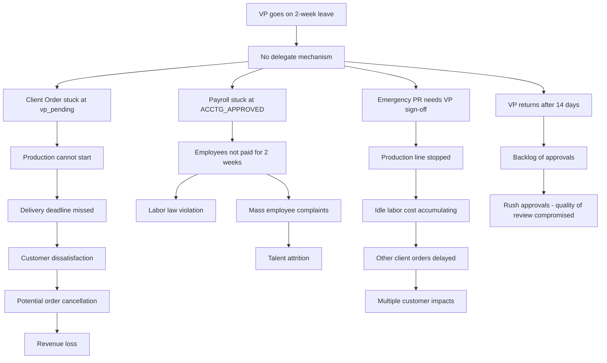
```mermaid
graph TD
    A[VP goes on 2-week leave] --> B[No delegate mechanism]
    
    B --> C[Client Order stuck at vp_pending]
    B --> D[Payroll stuck at ACCTG_APPROVED]
    B --> E[Emergency PR needs VP sign-off]
    
    C --> F[Production cannot start]
    F --> G[Delivery deadline missed]
    G --> H[Customer dissatisfaction]
    H --> I[Potential order cancellation]
    I --> J[Revenue loss]
    
    D --> K[Employees not paid for 2 weeks]
    K --> L[Labor law violation]
    K --> M[Mass employee complaints]
    M --> N[Talent attrition]
    
    E --> O[Production line stopped]
    O --> P[Idle labor cost accumulating]
    P --> Q[Other client orders delayed]
    Q --> R[Multiple customer impacts]
    
    B --> S[VP returns after 14 days]
    S --> T[Backlog of approvals]
    T --> U[Rush approvals - quality of review compromised]
```

**Recovery steps:**
1. **Immediate workaround:** Super admin temporarily assigns `vice_president` role to executive director or CEO -- security risk
2. **Better workaround:** VP approves remotely via mobile -- requires connectivity and willingness during vacation
3. **Proper fix:** Implement delegation system:
   - VP designates acting authority before going on leave
   - System auto-routes VP-level approvals to delegate
   - All delegate actions logged with original authority reference
   - Delegate authority auto-expires when VP leave ends

**Prevention:** Require VP to designate delegate before leave request is approved. System blocks VP leave approval if no delegate configured and pending approvals exist.

---

### Scenario 9: Concurrent AP Invoice Approval Race

**Severity:** High | **Likelihood:** Medium | **Modules:** AP

**Step-by-step breakdown:**
1. Vendor invoice VI-2026-0321 is at status `pending_approval`
2. Department Head A opens the invoice detail page at 10:00:01
3. Department Head B opens the same invoice page at 10:00:03
4. Both read current status as `pending_approval` from DB
5. Head A clicks "Note" button at 10:00:15
6. Head B clicks "Note" button at 10:00:17
7. Head A request hits `VendorInvoiceService::headNote()` -- transitions `pending_approval -> head_noted`
8. Head B request hits same method -- reads status which is now `head_noted`
9. State machine check: `isAllowed('head_noted', 'head_noted')` returns false
10. Head B gets `InvalidStateTransitionException` -- confusing error
11. Alternatively, if both requests execute simultaneously with no locking:
12. Both read `pending_approval`, both transition to `head_noted`
13. Both `save()` calls succeed -- last write wins
14. Two `approval_log` entries created for same step by different users
15. Audit trail shows two approvers for step 1 -- which is authoritative?

**Cascade diagram:**

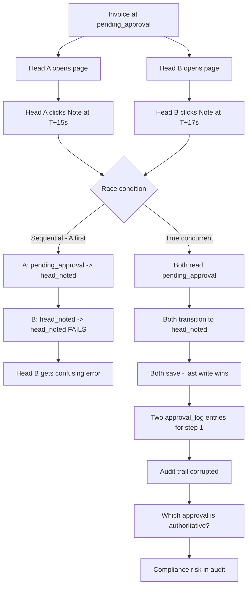
```mermaid
graph TD
    A[Invoice at pending_approval] --> B[Head A opens page]
    A --> C[Head B opens page]
    B --> D[Head A clicks Note at T+15s]
    C --> E[Head B clicks Note at T+17s]
    
    D --> F{Race condition}
    E --> F
    
    F -->|Sequential - A first| G[A: pending_approval -> head_noted]
    G --> H[B: head_noted -> head_noted FAILS]
    H --> I[Head B gets confusing error]
    
    F -->|True concurrent| J[Both read pending_approval]
    J --> K[Both transition to head_noted]
    K --> L[Both save - last write wins]
    L --> M[Two approval_log entries for step 1]
    M --> N[Audit trail corrupted]
    N --> O[Which approval is authoritative?]
    O --> P[Compliance risk in audit]
```

**Recovery steps:**
1. **Detection:** Query `approval_logs` for duplicate stage entries on same invoice
2. **Correction:** Soft-delete the duplicate record; keep the one with earlier timestamp
3. **Proper fix:** Add `SELECT ... FOR UPDATE` on invoice record before approval transition
4. **Alternative:** Add optimistic locking with `version` column -- reject stale updates

**Prevention:** Add `DB::transaction(function() { $invoice = VendorInvoice::lockForUpdate()->find($id); ... })` pattern to all approval methods.

---

### Scenario 10: Overlapping Payroll Double Payment

**Severity:** Critical | **Likelihood:** Low | **Modules:** Payroll, Accounting, Banking

**Step-by-step breakdown:**
1. Payroll Officer A creates Run-A for pay period January 1-15, Department: All
2. Payroll Officer B creates Run-B for same pay period January 1-15, Department: All
3. No unique constraint prevents this -- `payroll_runs` table has no unique index on `(pay_period_id, department_id)`
4. Both runs process through pipeline independently
5. Employee X appears in both Run-A and Run-B `PayrollDetail` records
6. Run-A: HR approved by Manager Y; Accounting approved by Officer Z
7. Run-B: HR approved by Manager W; Accounting approved by Officer V
8. Both runs get VP approved and disbursed
9. Bank file generated for both runs -- Employee X receives two salary deposits
10. GL posts double salary expense for all employees
11. Trial balance shows double salary expense; balance sheet shows double payable
12. Bank account debited twice the expected amount -- potential overdraft

**Cascade diagram:**

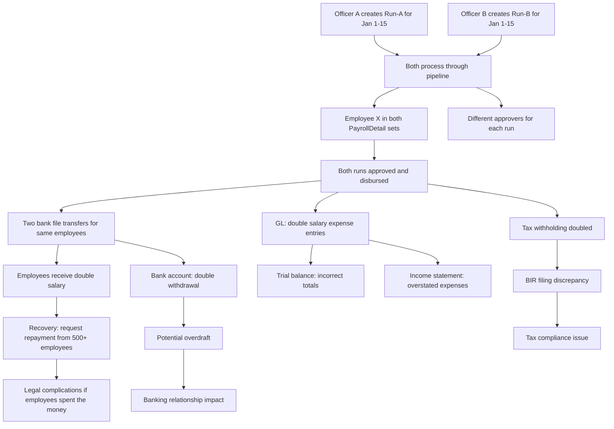
```mermaid
graph TD
    A[Officer A creates Run-A for Jan 1-15] --> C[Both process through pipeline]
    B[Officer B creates Run-B for Jan 1-15] --> C
    
    C --> D[Employee X in both PayrollDetail sets]
    C --> E[Different approvers for each run]
    
    D --> F[Both runs approved and disbursed]
    F --> G[Two bank file transfers for same employees]
    G --> H[Employees receive double salary]
    H --> I[Recovery: request repayment from 500+ employees]
    I --> J[Legal complications if employees spent the money]
    
    F --> K[GL: double salary expense entries]
    K --> L[Trial balance: incorrect totals]
    K --> M[Income statement: overstated expenses]
    
    G --> N[Bank account: double withdrawal]
    N --> O[Potential overdraft]
    O --> P[Banking relationship impact]
    
    F --> Q[Tax withholding doubled]
    Q --> R[BIR filing discrepancy]
    R --> S[Tax compliance issue]
```

**Recovery steps:**
1. **Detection:** Query `payroll_details` grouped by `(employee_id, pay_period_id)` having count > 1
2. **Immediate:** Reverse the duplicate run -- cancel Run-B, create reversal JE
3. **Bank:** Contact bank to reverse duplicate transfers if possible
4. **Employee:** Communicate overpayment; arrange repayment deductions in next pay period
5. **Tax:** File amended BIR returns if already submitted
6. **Proper fix:** Implement REC-07 -- unique constraint and service-level validation

**Prevention:** Add unique partial index: `CREATE UNIQUE INDEX idx_payroll_run_active ON payroll_runs(pay_period_id) WHERE status NOT IN ('cancelled', 'REJECTED')`. Or scope by `(pay_period_id, department_id)` if department-level runs are supported.

---

### Scenario 11: QC Rejection with No Rework Path

**Severity:** High | **Likelihood:** Medium | **Modules:** QC, Production, CRM

**Step-by-step breakdown:**
1. Client order CO-2026-0067 approved for 1,000 units of Product A
2. Production order PO-PROD-001 created and completed -- 1,000 units produced
3. Output sent to QC inspection
4. QC finds defect in 800 of 1,000 units -- only 200 pass
5. NCR raised for 800 defective units
6. Production order is already at `completed` status
7. `ProductionOrderStateMachine` allows `completed -> closed` only -- no path back to `in_progress`
8. Cannot reopen the production order for rework
9. Must create entirely new production order for 800 units
10. New production order requires new material requisition
11. If materials were fully consumed by first order, new materials must be procured
12. Client order stuck at `in_production` -- no automated update about partial delivery
13. Customer unaware of delay; delivery schedule not updated

**Cascade diagram:**

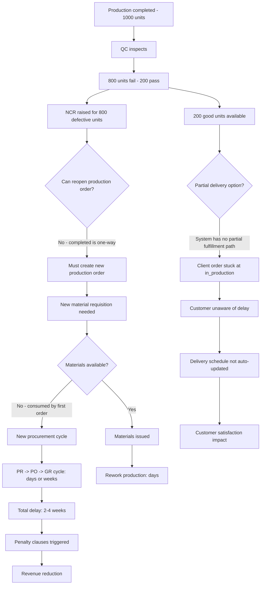
```mermaid
graph TD
    A[Production completed - 1000 units] --> B[QC inspects]
    B --> C[800 units fail - 200 pass]
    C --> D[NCR raised for 800 defective units]
    
    D --> E{Can reopen production order?}
    E -->|No - completed is one-way| F[Must create new production order]
    F --> G[New material requisition needed]
    G --> H{Materials available?}
    H -->|No - consumed by first order| I[New procurement cycle]
    I --> J[PR -> PO -> GR cycle: days or weeks]
    H -->|Yes| K[Materials issued]
    K --> L[Rework production: days]
    
    C --> M[200 good units available]
    M --> N{Partial delivery option?}
    N -->|System has no partial fulfillment path| O[Client order stuck at in_production]
    
    O --> P[Customer unaware of delay]
    P --> Q[Delivery schedule not auto-updated]
    Q --> R[Customer satisfaction impact]
    
    J --> S[Total delay: 2-4 weeks]
    S --> T[Penalty clauses triggered]
    T --> U[Revenue reduction]
```

**Recovery steps:**
1. **Immediate:** Create new production order for 800 units manually
2. **Partial delivery:** Manually transition client order to allow partial delivery of 200 units
3. **Communication:** Manually update delivery schedule and notify customer
4. **Proper fix:** Add `completed -> in_progress` transition for rework scenarios with mandatory NCR reference. Add partial fulfillment workflow to client orders.

**Prevention:** Add rework transition to `ProductionOrderStateMachine`. Add QC-triggered automatic rework order generation with material check.

---

### Scenario 12: Year-End Closing with Open AP Invoices

**Severity:** High | **Likelihood:** Medium | **Modules:** Accounting, AP

**Step-by-step breakdown:**
1. December 31 -- accountant initiates year-end closing for FY 2025
2. `YearEndClosingService` processes all accounts
3. Revenue and expense accounts closed to Retained Earnings
4. Balance sheet accounts carried forward
5. AP control account balance at year-end includes 15 open invoices totaling 2,500,000 centavos
6. Year-end closing marks all FY 2025 fiscal periods as `closed`
7. January 2026: AP team processes payment for December 2025 vendor invoice
8. `ApPaymentPostingService` attempts to create JE with posting date in December 2025
9. Fiscal period for December 2025 is `closed` -- GL posting fails
10. Payment recorded in AP but no GL entry -- AP and GL disagree
11. Alternatively, payment posts to January 2026 -- expense recognized in wrong period

**Cascade diagram:**

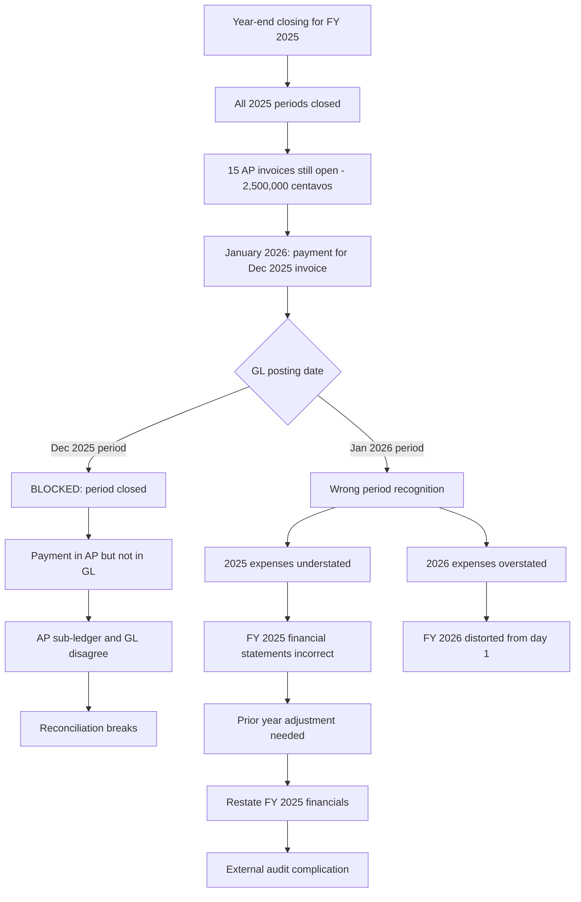
```mermaid
graph TD
    A[Year-end closing for FY 2025] --> B[All 2025 periods closed]
    B --> C[15 AP invoices still open - 2,500,000 centavos]
    
    C --> D[January 2026: payment for Dec 2025 invoice]
    D --> E{GL posting date}
    E -->|Dec 2025 period| F[BLOCKED: period closed]
    E -->|Jan 2026 period| G[Wrong period recognition]
    
    F --> H[Payment in AP but not in GL]
    H --> I[AP sub-ledger and GL disagree]
    I --> J[Reconciliation breaks]
    
    G --> K[2025 expenses understated]
    G --> L[2026 expenses overstated]
    K --> M[FY 2025 financial statements incorrect]
    L --> N[FY 2026 distorted from day 1]
    
    M --> O[Prior year adjustment needed]
    O --> P[Restate FY 2025 financials]
    P --> Q[External audit complication]
```

**Recovery steps:**
1. **Workaround:** Temporarily reopen December 2025 fiscal period; post payment; re-close
2. **Better:** Post payment with January 2026 date; create prior-period adjustment JE
3. **Proper fix:** Add "soft close" for fiscal periods that allows AP/AR postings but blocks manual JEs. Add year-end checklist that warns about open AP/AR invoices before closing.

**Prevention:** Year-end closing should validate no open AP/AR invoices exist in the closing period. Show warning with list of open items and require explicit acknowledgment.

---

### Scenario 13: Employee Termination Mid-Payroll

**Severity:** High | **Likelihood:** Medium | **Modules:** HR, Payroll

**Step-by-step breakdown:**
1. Payroll run for Jan 1-15 reaches COMPUTED stage -- includes Employee X
2. Employee X's computed salary: 25,000 centavos basic + 3,000 OT = 28,000 gross
3. HR terminates Employee X on Jan 12 -- `EmployeeStateMachine` transitions to `terminated`
4. `handleSeparation()` side-effect fires on employee model
5. Payroll run proceeds through REVIEW -> SUBMITTED -> HR_APPROVED -> ACCTG_APPROVED
6. No re-validation occurs during approval -- computed amounts are snapshot
7. At VP_APPROVED -> DISBURSED, system generates payment for terminated Employee X
8. Separately, HR triggers `FinalPayService` for Employee X
9. Final pay calculation includes: prorated salary Jan 1-12, unused leave conversion, 13th month
10. Both regular payroll AND final pay may cover overlapping days Jan 1-12
11. Employee X receives double payment for the overlapping period

**Cascade diagram:**

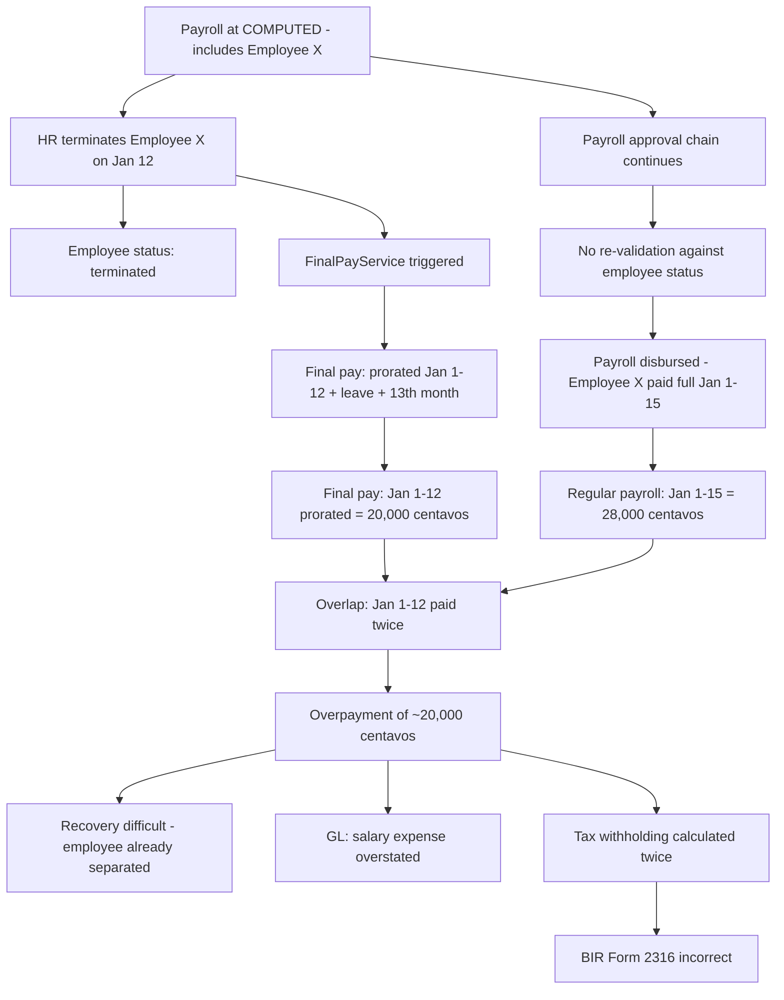
```mermaid
graph TD
    A[Payroll at COMPUTED - includes Employee X] --> B[HR terminates Employee X on Jan 12]
    B --> C[Employee status: terminated]
    
    A --> D[Payroll approval chain continues]
    D --> E[No re-validation against employee status]
    E --> F[Payroll disbursed - Employee X paid full Jan 1-15]
    
    B --> G[FinalPayService triggered]
    G --> H[Final pay: prorated Jan 1-12 + leave + 13th month]
    
    F --> I[Regular payroll: Jan 1-15 = 28,000 centavos]
    H --> J[Final pay: Jan 1-12 prorated = 20,000 centavos]
    
    I --> K[Overlap: Jan 1-12 paid twice]
    J --> K
    K --> L[Overpayment of ~20,000 centavos]
    
    L --> M[Recovery difficult - employee already separated]
    L --> N[GL: salary expense overstated]
    L --> O[Tax withholding calculated twice]
    O --> P[BIR Form 2316 incorrect]
```

**Recovery steps:**
1. **Detection:** Cross-reference `payroll_details` with `employees.employment_status = terminated` where `termination_date` falls within pay period
2. **Correction:** Create payroll adjustment for next period -- but employee is terminated, so offset against final pay
3. **Recovery:** Deduct overpayment from final pay before releasing; if already disbursed, request repayment
4. **Tax:** Adjust BIR Form 2316 to reflect correct total compensation
5. **Proper fix:** Add re-validation at REVIEW and SUBMITTED stages that checks employee status changes since COMPUTED. Flag terminated employees for exclusion or final pay integration.

**Prevention:** Add `PayrollRunExclusion` auto-detection: scheduled job checks for status changes between COMPUTED and approval stages. Alert payroll officer to review.

---

### Scenario 14: Material Requisition Exceeds Available Stock

**Severity:** High | **Likelihood:** Medium | **Modules:** Production, Inventory

**Step-by-step breakdown:**
1. Production order released for 500 units requiring 1,000 kg raw material
2. `StockBalance` shows 1,000 kg available for Raw Material A
3. Material requisition MR-001 created for 1,000 kg
4. Concurrent GR return: 200 kg returned to vendor due to defects
5. `StockService` processes return -- reduces balance to 800 kg
6. MR-001 gets approved based on stale availability data
7. Warehouse issues 1,000 kg based on MR -- but only 800 kg physically available
8. `StockBalance` goes to -200 kg
9. No database constraint prevents negative balance -- `unsignedBigInteger` only prevents negative at insert but increments can go below zero
10. Production proceeds with 800 kg -- produces only 400 units instead of 500
11. Client order short by 100 units

**Cascade diagram:**

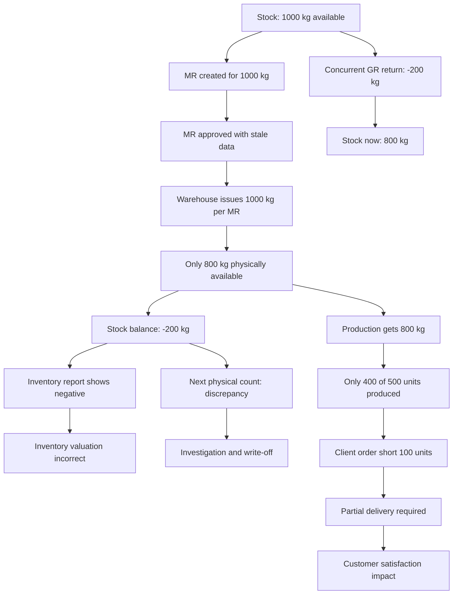
```mermaid
graph TD
    A[Stock: 1000 kg available] --> B[MR created for 1000 kg]
    A --> C[Concurrent GR return: -200 kg]
    C --> D[Stock now: 800 kg]
    B --> E[MR approved with stale data]
    E --> F[Warehouse issues 1000 kg per MR]
    F --> G[Only 800 kg physically available]
    G --> H[Stock balance: -200 kg]
    
    H --> I[Inventory report shows negative]
    I --> J[Inventory valuation incorrect]
    
    G --> K[Production gets 800 kg]
    K --> L[Only 400 of 500 units produced]
    L --> M[Client order short 100 units]
    M --> N[Partial delivery required]
    N --> O[Customer satisfaction impact]
    
    H --> P[Next physical count: discrepancy]
    P --> Q[Investigation and write-off]
```

**Recovery steps:**
1. **Immediate:** Verify physical stock; adjust `StockBalance` to match actual
2. **Production:** Create new MR for remaining 200 kg; may need to procure
3. **Client:** Communicate partial delivery; update delivery schedule
4. **Proper fix:** Add stock reservation before MR approval. Add DB CHECK constraint: `quantity_on_hand >= 0`. Use `StockReservationService` to soft-lock quantities.

**Prevention:** Material requisition approval should use `StockReservationService` to reserve exact quantities. Reservation uses `SELECT ... FOR UPDATE` on `StockBalance` to prevent concurrent modifications.

---

### Scenario 15: Loan Deduction on Fully Paid Loan

**Severity:** Medium | **Likelihood:** Medium | **Modules:** Loan, Payroll

**Step-by-step breakdown:**
1. Employee has active loan with 1 remaining installment of 5,000 centavos
2. Employee makes manual payment via HR -- loan balance updated to 0
3. `LoanStateMachine` transitions loan to `fully_paid` -- but transaction takes time
4. Payroll pipeline Step15 `LoanDeductionsStep` runs simultaneously
5. Step15 queries `loans WHERE status = 'active'` and `employee_id = X`
6. Race condition: loan status not yet `fully_paid` at time of query
7. Step15 deducts 5,000 centavos from employee salary
8. Loan status then transitions to `fully_paid`
9. Employee now has -5,000 centavos overpayment on the loan
10. No automated credit mechanism exists -- employee must file HR complaint

**Cascade diagram:**

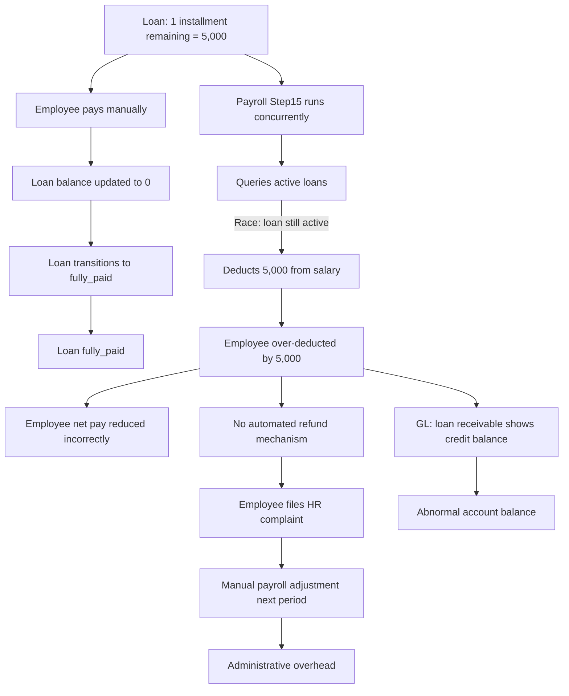
```mermaid
graph TD
    A[Loan: 1 installment remaining = 5,000] --> B[Employee pays manually]
    B --> C[Loan balance updated to 0]
    C --> D[Loan transitions to fully_paid]
    
    A --> E[Payroll Step15 runs concurrently]
    E --> F[Queries active loans]
    F -->|Race: loan still active| G[Deducts 5,000 from salary]
    
    D --> H[Loan fully_paid]
    G --> I[Employee over-deducted by 5,000]
    
    I --> J[Employee net pay reduced incorrectly]
    I --> K[No automated refund mechanism]
    K --> L[Employee files HR complaint]
    L --> M[Manual payroll adjustment next period]
    M --> N[Administrative overhead]
    
    I --> O[GL: loan receivable shows credit balance]
    O --> P[Abnormal account balance]
```

**Recovery steps:**
1. **Detection:** Query loans where status = `fully_paid` but payroll deduction occurred in same period
2. **Correction:** Create payroll adjustment for next pay period to refund the overpayment
3. **Communication:** Notify employee of the error and expected refund date
4. **Proper fix:** Step15 should check `remaining_balance > 0` in addition to status. Use pessimistic lock on loan record during payroll computation.

**Prevention:** Add `remaining_balance_centavos` check in Step15 -- deduct min of installment amount and remaining balance. Never deduct more than remaining balance.

---

### Scenario 16: Customer Invoice Overallocation

**Severity:** High | **Likelihood:** Low | **Modules:** AR, Accounting

**Step-by-step breakdown:**
1. Customer Invoice CI-2026-0150 for 100,000 centavos at status `approved`
2. AR Clerk A opens payment allocation screen at 10:00
3. AR Clerk B opens same invoice payment screen at 10:01
4. Both see invoice balance: 100,000 centavos
5. Clerk A enters payment of 100,000 and clicks Submit at 10:05
6. Clerk B enters payment of 100,000 and clicks Submit at 10:06
7. Both `PaymentAllocationService` calls execute
8. No `SELECT ... FOR UPDATE` on invoice
9. Both read `total_paid = 0`, calculate `remaining = 100,000`
10. Both create payment records of 100,000
11. Invoice `total_paid` becomes 200,000 against 100,000 due
12. Invoice transitions to `paid` -- but system recorded 200,000 in payments
13. GL: Cash debit 200,000 / AR credit 200,000 -- but AR should only credit 100,000

**Cascade diagram:**

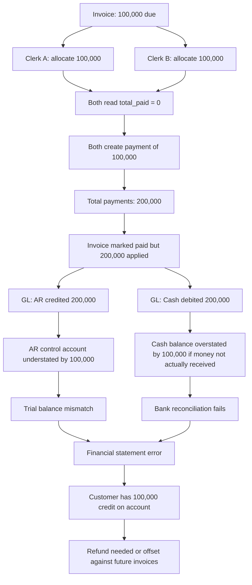
```mermaid
graph TD
    A[Invoice: 100,000 due] --> B[Clerk A: allocate 100,000]
    A --> C[Clerk B: allocate 100,000]
    B --> D[Both read total_paid = 0]
    C --> D
    D --> E[Both create payment of 100,000]
    E --> F[Total payments: 200,000]
    F --> G[Invoice marked paid but 200,000 applied]
    
    G --> H[GL: AR credited 200,000]
    G --> I[GL: Cash debited 200,000]
    H --> J[AR control account understated by 100,000]
    I --> K[Cash balance overstated by 100,000 if money not actually received]
    
    J --> L[Trial balance mismatch]
    K --> M[Bank reconciliation fails]
    L --> N[Financial statement error]
    M --> N
    N --> O[Customer has 100,000 credit on account]
    O --> P[Refund needed or offset against future invoices]
```

**Recovery steps:**
1. **Detection:** Query invoices where sum of payment amounts exceeds invoice total
2. **Correction:** Void duplicate payment; create reversal JE
3. **Customer:** If actual payment was 200,000, create credit note for overpayment
4. **Proper fix:** Add pessimistic lock in `PaymentAllocationService`. Add DB CHECK constraint: payments sum cannot exceed invoice total.

**Prevention:** Implement REC-09 -- `SELECT ... FOR UPDATE` pattern plus database constraint.

---

### Scenario 17: Production Order Cost Posting to Closed Period

**Severity:** High | **Likelihood:** Medium | **Modules:** Production, Accounting

**Step-by-step breakdown:**
1. Production order PO-PROD-042 completed on January 28
2. `ProductionCostPostingService` scheduled to run on month-end
3. Due to backlog, cost posting delayed to February 3
4. Accountant closes January fiscal period on February 1
5. `ProductionCostPostingService` attempts to create JE with January posting date
6. `JournalEntryService` checks fiscal period -- January is `closed`
7. DomainException thrown -- cost posting fails
8. Production order stuck at `completed` -- cannot transition to `closed`
9. WIP balance not cleared; COGS not recognized for January
10. Management reports show inflated WIP and understated COGS

**Cascade diagram:**

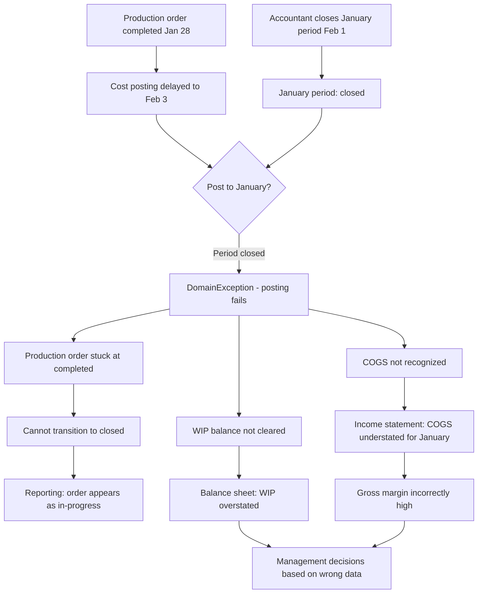
```mermaid
graph TD
    A[Production order completed Jan 28] --> B[Cost posting delayed to Feb 3]
    C[Accountant closes January period Feb 1] --> D[January period: closed]
    
    B --> E{Post to January?}
    D --> E
    E -->|Period closed| F[DomainException - posting fails]
    
    F --> G[Production order stuck at completed]
    G --> H[Cannot transition to closed]
    H --> I[Reporting: order appears as in-progress]
    
    F --> J[WIP balance not cleared]
    J --> K[Balance sheet: WIP overstated]
    
    F --> L[COGS not recognized]
    L --> M[Income statement: COGS understated for January]
    M --> N[Gross margin incorrectly high]
    
    K --> O[Management decisions based on wrong data]
    N --> O
```

**Recovery steps:**
1. **Workaround:** Reopen January period temporarily; run cost posting; re-close
2. **Alternative:** Post to February with prior-period indicator
3. **Proper fix:** Cost posting should run immediately on production completion, not on schedule. Add batch cost posting to run BEFORE period close. Add period-close validation that checks for unposted production costs.

**Prevention:** Add pre-close validation in `FiscalPeriodService::close()` that checks for completed production orders without cost postings. Block period close if pending cost postings exist.

---

### Scenario 18: Attendance Correction Approved After Payroll Computed

**Severity:** Medium | **Likelihood:** High | **Modules:** Attendance, Payroll

**Step-by-step breakdown:**
1. Payroll run for Jan 1-15 computed on Jan 18 -- uses attendance data as of Jan 18
2. Employee X had missing time-in on Jan 10 -- attendance shows 0 hours for that day
3. Payroll computes 0 basic pay for Jan 10 -- employee underpaid by 1 day
4. Employee X submits attendance correction request on Jan 19
5. Manager approves correction on Jan 20 -- attendance log updated
6. Payroll run is now at REVIEW stage with stale attendance data
7. Payroll approved and disbursed on Jan 22 using Jan 18 snapshot
8. Employee X paid based on incorrect attendance -- missing 1 day of pay
9. No automated detection of post-computation attendance changes
10. Employee notices discrepancy on payslip and files complaint
11. Manual payroll adjustment needed for next period

**Cascade diagram:**

```mermaid
graph TD
    A[Payroll computed Jan 18] --> B[Uses attendance snapshot]
    B --> C[Employee X: 0 hours for Jan 10]
    
    D[Employee submits correction Jan 19] --> E[Manager approves Jan 20]
    E --> F[Attendance log updated for Jan 10]
    
    A --> G[Payroll at REVIEW stage]
    G --> H[No re-validation against attendance changes]
    H --> I[Payroll approved and disbursed Jan 22]
    
    I --> J[Employee X underpaid by 1 day]
    J --> K[Employee discovers on payslip]
    K --> L[Files HR complaint]
    L --> M[Manual payroll adjustment next period]
    M --> N[Administrative cost]
    
    F --> O[Attendance now correct]
    I --> P[Payroll data stale]
    O --> Q[Attendance and payroll disagree]
    Q --> R[Audit trail inconsistency]
```

**Recovery steps:**
1. **Detection:** Compare attendance correction approvals dated between payroll COMPUTED and DISBURSED dates with employees in the payroll run
2. **Correction:** Create payroll adjustment for next pay period
3. **Communication:** Notify employee of underpayment and expected correction date
4. **Proper fix:** Add attendance change detection during REVIEW/SUBMITTED stages. Show list of employees with post-computation attendance changes. Require acknowledgment or re-computation.

**Prevention:** Add "attendance freeze" period during payroll processing. Or add automated detection that flags attendance corrections approved after payroll computation for the same period.

---

### Scenario 19: BIR Filing with Stale Tax Data

**Severity:** High | **Likelihood:** Medium | **Modules:** Payroll, Tax

**Step-by-step breakdown:**
1. Payroll Run A for January created, computed, then RETURNED due to errors
2. Run A status: RETURNED -> DRAFT -- but `PayrollDetail` records from first computation still exist
3. Payroll Run B created for same period, correctly computed and disbursed
4. `BirAutoPopulationService` queries payroll data for BIR monthly filing
5. Service queries `payroll_details` joined with `payroll_runs` for the month
6. If query does not filter by run status, it picks up data from BOTH Run A and Run B
7. BIR Form 1601-C generated with doubled withholding tax amounts
8. Form filed with BIR -- incorrect withholding reported
9. BIR assessment: under-remittance penalty if actual withholding is less; or over-reporting creates reconciliation issues

**Cascade diagram:**

```mermaid
graph TD
    A[Run A: computed then RETURNED] --> B[PayrollDetail records from Run A still in DB]
    C[Run B: correctly computed and disbursed] --> D[PayrollDetail records from Run B]
    
    B --> E{BIR query includes Run A data?}
    D --> E
    E -->|Yes - no status filter| F[Double counting]
    F --> G[BIR 1601-C: doubled WHT amounts]
    G --> H[Form filed with BIR]
    
    H --> I{Actual remittance vs reported}
    I -->|Under-remitted| J[BIR penalty: 25% surcharge + 12% interest]
    I -->|Over-reported| K[Discrepancy on BIR reconciliation]
    K --> L[Letter of Authority from BIR]
    L --> M[Tax audit triggered]
    
    G --> N[2316 forms also affected at year-end]
    N --> O[Employee tax credits incorrect]
    O --> P[Employee ITR filing issues]
```

**Recovery steps:**
1. **Detection:** Verify BIR auto-population query filters on payroll run status = DISBURSED or PUBLISHED only
2. **Correction:** If already filed, submit amended return
3. **Proper fix:** Ensure `BirAutoPopulationService` query includes `WHERE payroll_runs.status IN ('DISBURSED', 'PUBLISHED')`. Delete or soft-delete `PayrollDetail` records when run transitions to RETURNED or REJECTED.

**Prevention:** Add database constraint or service logic that cleans up `PayrollDetail` records when run goes to RETURNED/REJECTED/DRAFT. Add BIR pre-filing validation that cross-checks payroll run statuses.

---

### Scenario 20: Maintenance Work Order Parts Without Budget Control

**Severity:** Medium | **Likelihood:** High | **Modules:** Maintenance, Budget, Inventory

**Step-by-step breakdown:**
1. Production line CNC machine breaks down -- emergency work order created
2. Maintenance technician adds parts list: 5 bearings at 2,000 centavos each = 10,000 centavos
3. Work order submitted for approval
4. `BudgetEnforcementService::checkMaintenanceBudget()` executes
5. Returns soft warning: "Approving this would push maintenance spending to 115% of budget"
6. Maintenance manager sees warning but approves anyway -- soft warning allows override
7. Parts issued from inventory via material requisition
8. Pattern repeats: 15 more emergency work orders in the quarter
9. Maintenance department at 340% of annual budget
10. No hard block ever engaged because maintenance uses only soft warnings
11. Budget Officer discovers overrun at quarterly review -- too late to control

**Cascade diagram:**

```mermaid
graph TD
    A[Emergency work order created] --> B[Parts: 10,000 centavos]
    B --> C{Budget check}
    C -->|Soft warning: 115% of budget| D[Manager overrides warning]
    D --> E[Parts issued from inventory]
    
    E --> F[Pattern repeats 15 times]
    F --> G[Maintenance at 340% of annual budget]
    
    G --> H[Budget Officer discovers at Q review]
    H --> I[Too late - money already spent]
    
    G --> J[Cash flow impact]
    J --> K[Other department budgets squeezed]
    K --> L[Procurement delays for other departments]
    
    G --> M[No accountability - warning was shown]
    M --> N[Process allows unlimited override]
    N --> O[Budget system effectively useless for maintenance]
    
    G --> P[Board questions budget controls]
    P --> Q[Internal audit finding]
```

**Recovery steps:**
1. **Immediate:** Review all approved work orders that exceeded budget warning
2. **Policy:** Implement escalation for overrides exceeding a threshold -- e.g., 120% of budget requires VP approval
3. **Proper fix:** Add configurable hard-block thresholds per budget category:
   - 0-100%: auto-approve
   - 100-120%: soft warning
   - 120%+: hard block requiring VP override with reason
4. **Monitoring:** Add weekly budget utilization email to department heads and Budget Officer

**Prevention:** Graduate budget enforcement from soft-only to configurable hard/soft thresholds. Add real-time budget utilization dashboard visible to all managers. Add automated alerts at 80%, 90%, and 100% thresholds.

---

## Design Gaps and Architectural Weaknesses

### GAP-01: No Delegate/Acting Authority System
The system has no mechanism for designating acting approvers when primary approvers are unavailable -- on leave, terminated, or simply a vacant position. This creates hard blocks in every multi-step approval workflow.

### GAP-02: No Idempotency Keys for Write Operations
While the frontend has a 1500ms cooldown and some service methods check current status, there are no formal idempotency keys on POST/PUT endpoints. Network retries, browser refreshes, and webhook retries can cause duplicate operations.

### GAP-03: No Saga/Compensation Pattern for Cross-Module Operations
The Procure-to-Pay and Order-to-Cash flows span multiple modules and services. Failures mid-chain -- such as the ThreeWayMatch event listener failure -- leave the system in an inconsistent state with no compensation mechanism.

### GAP-04: No Circuit Breaker for Queue/Job Processing
Payroll batch processing, notification delivery, and event listeners have no circuit breaker. A downstream failure -- Redis, database, or service error -- causes silent failures or infinite retries.

### GAP-05: Optimistic Concurrency Control Missing
No version columns or SELECT ... FOR UPDATE patterns on entities with concurrent access -- invoices, stock balances, approval chains. This enables race conditions.

### GAP-06: ISO Domain is Empty
The ISO domain contains only a policy file. For a manufacturing ERP, ISO compliance management -- document control, CAPA tracking, audit trails -- is essential. QC has some CAPA functionality but it is not connected to a formal ISO management system.

### GAP-07: No Scheduled Reconciliation Jobs
There are no automated reconciliation processes to detect and alert on:
- FA register vs GL balance divergence
- AP sub-ledger vs GL control account mismatch
- AR sub-ledger vs GL control account mismatch
- Inventory valuation vs GL stock accounts
- Bank reconciliation auto-matching

### GAP-08: Legacy State Machine Values
The PayrollRunStateMachine contains both new uppercase states and legacy lowercase states. This dual system creates confusion and potential for state mismatches when comparing with string equality.

---

## Summary of Prioritized Recommendations

| Priority | Count | Key Actions |
|----------|-------|-------------|
| **Critical** | 8 | SoD override mechanism; FA GL fix; Budget false positive fix; 3WM reliability; Vendor portal security; Payroll watchdog; Overlapping payroll prevention; Gov table pre-flight |
| **High** | 5 | Concurrent payment guard; Fiscal period auto-creation; Salary snapshot validation; Stock count locking; Minimum wage guard |
| **Medium** | 5 | AP partial return; PO timeout alerts; Approval visibility; Stock service enforcement; API user feedback |
| **Low** | 3 | Count variance posting; Payroll progress indicator; Notification delivery guarantee |
