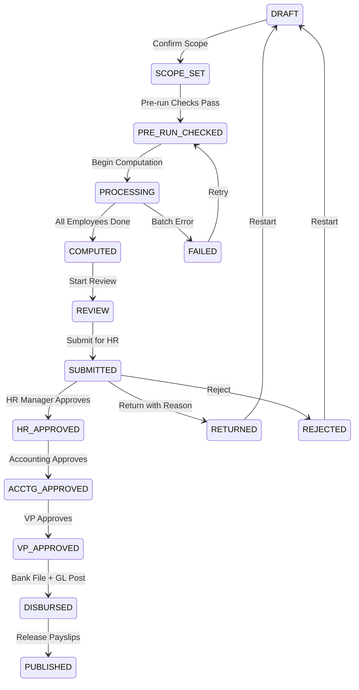
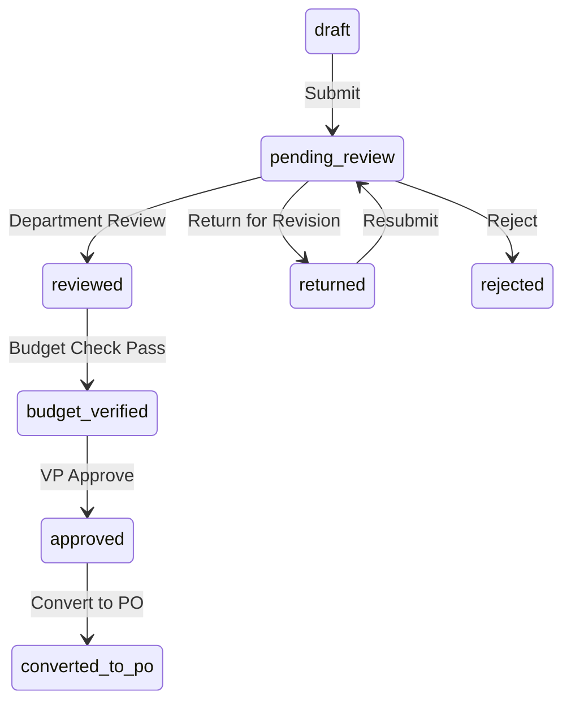
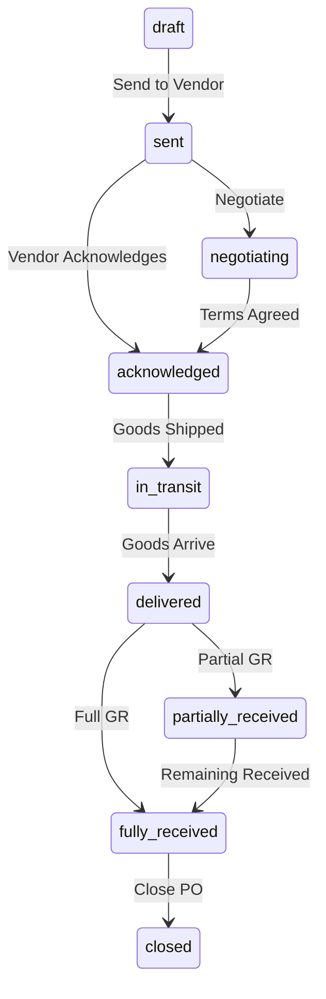
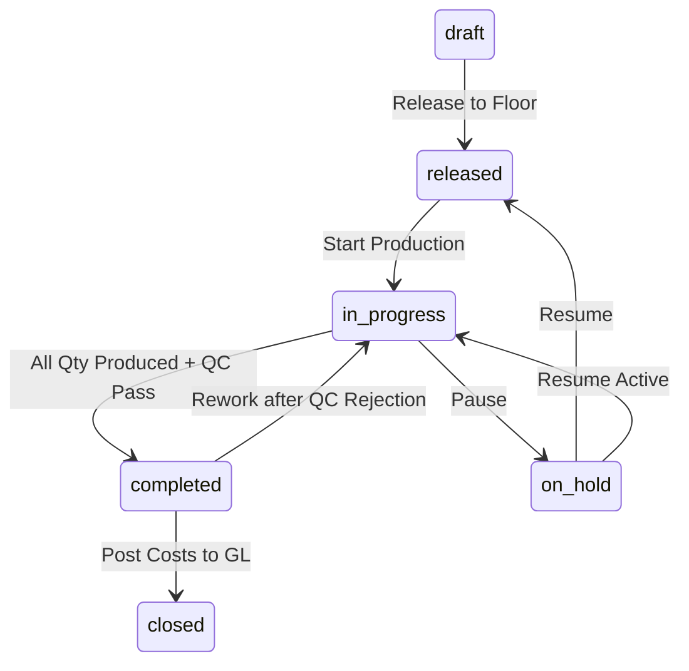

# Ogami ERP - Complete Module & Workflow Study

> **Ogami ERP** is a manufacturing ERP for Philippine businesses with **22 domain modules** built on Laravel 11 + PostgreSQL 16 + Redis backend and React 18 + TypeScript frontend.

---

## System Architecture Overview

```
Route -> Controller -> authorize() -> Service -> DB::transaction() -> Resource
```

- **Backend:** `app/Domains/<Domain>/` with Models, Services, Policies, StateMachines, Pipeline
- **Frontend:** `frontend/src/` with TanStack Query hooks, Zod schemas, 2 Zustand stores only
- **Auth:** Session-cookie (Sanctum) -- no JWT
- **Money:** Integer centavos via `Money` value object -- never float
- **IDs:** ULID public identifiers on all domain tables
- **SoD:** Creator cannot approve their own record (enforced in policies)
- **Department Scoping:** Auto-applied middleware; only admin/super_admin/executive/VP bypass

---

## Module-by-Module Workflow Analysis

---

### 1. HR (Human Resources)

**Location:** `app/Domains/HR/`

**Models:** Employee, Department, Position, SalaryGrade, EmployeeDocument, EmployeeClearance

**Services:** EmployeeService, AuthService, EmployeeClearanceService, OnboardingChecklistService, OrgChartService

**State Machine:** EmployeeStateMachine

**Workflow:**
1. **Create Employee** -- HR officer fills employee profile (personal info, department, position, salary grade, government IDs encrypted with SHA-256 hash)
2. **Transition** -- Employee status transitions managed via `EmployeeStateMachine` (e.g., probationary -> regular -> resigned)
3. **Activate** -- SoD enforced: creator cannot activate (EmployeePolicy)
4. **Team View** -- Managers see department-scoped employee lists via `dept_scope` middleware
5. **Clearance** -- EmployeeClearanceService handles resignation/termination clearance process

**Sub-Module: Recruitment** (nested under HR)

**Models:** JobRequisition, JobPosting, Candidate, Application, InterviewSchedule, InterviewEvaluation, JobOffer, Hiring, PreEmploymentChecklist, PreEmploymentRequirement

**Services:** RequisitionService, JobPostingService, ApplicationService, InterviewService, OfferService, PreEmploymentService, HiringService, RecruitmentDashboardService, RecruitmentReportService

**State Machines:** RequisitionStateMachine, ApplicationStateMachine, OfferStateMachine

**Full Recruitment Pipeline:**
```
Requisition -> Job Posting -> Application -> Interview -> Offer -> Pre-Employment -> Hire
```

1. **Job Requisition:** Department head creates requisition -> submit -> approve/reject/cancel/hold/resume
2. **Job Posting:** HR creates posting from approved requisition -> publish -> close -> reopen
3. **Application:** Candidate applies -> review -> shortlist -> reject -> withdraw
4. **Interview:** Schedule interviews -> complete -> submit evaluation -> mark no-show -> cancel
5. **Job Offer:** Create offer for successful candidate -> send -> accept/reject/withdraw
6. **Pre-Employment:** Initialize checklist -> submit documents -> verify/reject/waive requirements -> complete
7. **Hiring:** Convert accepted application to Employee record

**Reports:** Pipeline analysis, time-to-fill, source mix

---

### 2. Payroll

**Location:** `app/Domains/Payroll/`

**Models:** PayrollRun, PayrollDetail, PayPeriod, PayrollAdjustment, PayrollRunApproval, PayrollRunExclusion, ThirteenthMonthAccrual + Government rate tables (SSS, PhilHealth, PagIBIG, TRAIN Tax)

**Services:** PayrollRunService, PayrollComputationService, PayrollWorkflowService, PayrollScopeService, PayrollPreRunService, PayrollQueryService, PayrollPostingService, PayrollBatchDispatcher, DeductionService, FinalPayService, GovReportDataService, PayslipPdfService, ThirteenthMonthComputationService, TaxWithholdingService, and individual contribution services (SSS, PhilHealth, PagIBIG)

**17-Step Computation Pipeline:**
```
Step01 Snapshots -> Step02 PeriodMeta -> Step03 Attendance -> Step04 YTD ->
Step05 BasicPay -> Step06 Overtime -> Step07 Holiday -> Step08 NightDiff ->
Step09 GrossPay -> Step10 SSS -> Step11 PhilHealth -> Step12 PagIBIG ->
Step13 TaxableIncome -> Step14 WHT -> Step15 LoanDeductions ->
Step16 OtherDeductions -> Step17 NetPay -> Step18 ThirteenthMonth
```

Each step receives `PayrollComputationContext` and only mutates it -- never queries DB directly.

**8-Step Approval Workflow (State Machine):**



**SoD Enforcement:** Payroll initiator cannot be HR approver (SOD-005), cannot be accounting approver (SOD-006), cannot be VP approver (SOD-008)

**Cross-Module Integration:**
- **Attendance** -> Step03 pulls attendance summary
- **Leave** -> Paid/unpaid leave affects basic pay
- **Loan** -> Step15 auto-deducts active loan amortizations
- **Accounting** -> PayrollPostingService creates journal entries (Dr Salaries Expense 5001 / Cr Payables 2200)

---

### 3. Procurement

**Location:** `app/Domains/Procurement/`

**Models:** PurchaseRequest, PurchaseRequestItem, PurchaseOrder, PurchaseOrderItem, GoodsReceipt, GoodsReceiptItem, VendorRfq, VendorRfqVendor, BlanketPurchaseOrder

**Services:** PurchaseRequestService, PurchaseOrderService, GoodsReceiptService, ThreeWayMatchService, VendorRfqService, VendorScoringService, BlanketPurchaseOrderService

**Purchase Request Workflow:**


**Purchase Order Workflow:**


**Full Procurement Chain:**
1. **Need Identification** -- Department creates Purchase Request (or auto-generated from low stock or MRQ conversion)
2. **Budget Pre-Check** -- Validates department has sufficient annual budget
3. **PR Approval** -- draft -> pending_review -> reviewed -> budget_verified -> approved (with SoD at each stage)
4. **RFQ (optional)** -- Send Request for Quotation to multiple vendors
5. **Vendor Scoring** -- Evaluate vendors based on price, quality, delivery
6. **PO Creation** -- Convert approved PR to Purchase Order
7. **Vendor Communication** -- Send PO -> vendor acknowledges -> negotiate terms
8. **Goods Receipt** -- Receive goods, create GR with QC inspection link
9. **Three-Way Match** -- ThreeWayMatchService matches PO + GR + Vendor Invoice before payment

**Cross-Module Integration:**
- **Inventory** -> MRQ to PR conversion when stock is insufficient
- **AP** -> Three-way match triggers invoice approval
- **Budget** -> Budget pre-check and budget_verified step
- **QC** -> GR triggers quality inspection
- **Vendor Portal** -> Vendors acknowledge POs, propose changes, mark shipments

---

### 4. Inventory

**Location:** `app/Domains/Inventory/`

**Models:** ItemMaster, ItemCategory, StockBalance, StockLedger, StockReservation, LotBatch, WarehouseLocation, MaterialRequisition, MaterialRequisitionItem, PhysicalCount, PhysicalCountItem

**Services:** ItemMasterService, StockService, StockReservationService, MaterialRequisitionService, PhysicalCountService, CostingMethodService, InventoryReportService, InventoryAnalyticsService, LowStockReorderService

**Key Rule:** All stock changes MUST go through `StockService::receive()` -- never direct model updates. This ensures audit trail via `stock_ledger_entries`.

**Material Requisition Workflow:**
```
draft -> submitted -> noted (head) -> checked (manager) -> reviewed (officer) -> vp_approved -> fulfilled
```
Each step has SoD enforcement (no duplicate approvers).

**Physical Count Workflow:**
```
draft -> counting -> submitted -> approved (adjustments applied)
```

**Sub-Workflows:**
- **Stock Adjustments** -- Manual corrections with reason codes
- **Stock Transfers** -- Move between warehouse locations
- **Low Stock Auto-Reorder** -- Detects items below reorder point, auto-creates draft PRs
- **ABC Analysis** -- Classifies items by value (A/B/C categories)
- **Turnover Analysis** -- Inventory turnover rates
- **Dead Stock Detection** -- Items with no movement beyond configurable days

**Cross-Module Integration:**
- **Procurement** -> GR updates stock via StockService
- **Production** -> BOM material consumption deducts stock; output adds finished goods
- **Maintenance** -> Work order parts consume spare inventory
- **Sales/Delivery** -> Stock reservation for confirmed sales orders

---

### 5. Production

**Location:** `app/Domains/Production/`

**Models:** BillOfMaterials (BOM), BomComponent, ProductionOrder, ProductionOutputLog, WorkCenter, Routing, DeliverySchedule, DeliveryScheduleItem, CombinedDeliverySchedule

**Services:** BomService, ProductionOrderService, WorkCenterService, RoutingService, CostingService, MrpService, DeliveryScheduleService, CombinedDeliveryScheduleService, OrderAutomationService, ProductionCostPostingService, ProductionReportService

**Production Order Workflow:**


**Full Production Chain:**
1. **BOM Setup** -- Define bill of materials with components, quantities, and costs
2. **Routing Setup** -- Define manufacturing steps, work centers, and sequence
3. **BOM Cost Rollup** -- Calculate standard cost from component costs
4. **Production Order** -- Create from BOM with planned quantity
5. **Stock Check** (PROD-001) -- Pre-release stock availability verification
6. **Release** -- Release to shop floor, materials can be requisitioned
7. **Start** -- Begin production, output logging begins
8. **Log Output** -- Record production quantities per shift/batch
9. **Complete** -- All quantity produced and QC passed
10. **Cost Posting** -- Post actual vs standard cost variance to GL
11. **Close** -- Archive production order

**MRP (Material Requirements Planning):**
- `MrpService::summary()` -- Overview of material requirements
- `MrpService::explodeRequirements()` -- BOM explosion for a product and quantity
- `MrpService::timePhased()` -- Time-phased material plan

**Delivery Schedules:**
- Create delivery schedules from production orders
- Combined delivery schedules group multiple items
- Workflow: dispatch -> delivered -> acknowledge receipt

**Cross-Module Integration:**
- **Inventory** -> Material consumption deducts raw materials; output adds finished goods
- **QC** -> Completed production triggers quality inspection; QC rejection triggers rework
- **Accounting** -> Cost variance posting to GL
- **Procurement** -> MRP drives purchase request creation for shortages

---

### 6. Quality Control (QC)

**Location:** `app/Domains/QC/`

**Models:** Inspection, InspectionResult, InspectionTemplate, InspectionTemplateItem, NonConformanceReport (NCR), CapaAction

**Services:** InspectionService, InspectionTemplateService, NcrService, QualityAnalyticsService, QuarantineService, SpcService, SupplierQualityService

**State Machines:** InspectionStateMachine, CapaStateMachine

**QC Workflow:**
1. **Template Setup** -- Define inspection templates with parameters and pass/fail criteria
2. **Create Inspection** -- Triggered by GR (incoming), production output, or manual
3. **Record Results** -- Inspector records measurements/observations per template item
4. **Pass/Fail** -- System evaluates results against template criteria
5. **NCR (if failed)** -- Non-conformance report created for failures
6. **CAPA** -- Corrective/Preventive Action issued from NCR
7. **CAPA Completion** -- Track and close CAPA actions
8. **NCR Close** -- Close NCR after all CAPAs resolved

**Advanced Features:**
- **SPC (Statistical Process Control)** -- Control charts for process monitoring (mean, UCL, LCL)
- **Supplier Quality** -- Vendor quality summary by inspection pass rates
- **Defect Rate Analytics** -- Monthly defect rate trends and top defect types
- **Quarantine** -- QuarantineService manages non-conforming material segregation

**Cross-Module Integration:**
- **Procurement** -> GR triggers incoming material inspection
- **Production** -> Output QC inspection; failure triggers NCR and rework
- **Inventory** -> Failed inspection quarantines stock
- **AP** -> Vendor quality scores affect vendor rating

---

### 7. Accounts Payable (AP)

**Location:** `app/Domains/AP/`

**Models:** Vendor, VendorItem, VendorInvoice, VendorPayment, VendorCreditNote, VendorFulfillmentNote, PaymentBatch, PaymentBatchItem, EwtRate

**Services:** VendorService, VendorItemService, VendorInvoiceService, VendorCreditNoteService, VendorFulfillmentService, PaymentBatchService, ApPaymentPostingService, EarlyPaymentDiscountService, EwtService, InvoiceAutoDraftService

**State Machine:** VendorInvoiceStateMachine

**AP Invoice Workflow:**
1. **Invoice Draft** -- Created manually or auto-drafted from PO (InvoiceAutoDraftService)
2. **Three-Way Match** -- PO + GR + Invoice matched before approval
3. **Invoice Approval** -- SoD-gated approval creates journal entry (Dr Expense / Cr AP)
4. **EWT Calculation** -- Expanded Withholding Tax auto-computed
5. **Payment** -- Individual or batch payment processing
6. **Payment Posting** -- ApPaymentPostingService posts Dr AP / Cr Cash to GL
7. **Batch Operations** -- Batch approve/reject invoices

**Vendor Management:**
- Vendor CRUD with accreditation and suspension workflows
- Vendor portal account provisioning
- Vendor scorecard (VendorScoringService from Procurement)
- Vendor items catalog management
- Early payment discount calculation

**Vendor Portal** (separate route group):
- Vendors view their POs, acknowledge, propose changes
- Mark shipments in-transit and delivered
- View goods receipts
- Submit invoices
- Manage item catalog

**Cross-Module Integration:**
- **Procurement** -> Three-way match with PO and GR
- **Accounting** -> Invoice approval and payment create journal entries
- **Tax** -> EWT rates applied on payments; feeds BIR form 2307
- **Budget** -> AP spend tracked against department budgets

---

### 8. Accounts Receivable (AR)

**Location:** `app/Domains/AR/`

**Models:** Customer, CustomerInvoice, CustomerPayment, CustomerCreditNote, CustomerAdvancePayment, DunningLevel, DunningNotice

**Services:** CustomerService, CustomerInvoiceService, CustomerCreditNoteService, PaymentAllocationService, ArAgingService, DunningService, InvoiceAutoDraftService

**State Machine:** CustomerInvoiceStateMachine

**AR Invoice Workflow:**
1. **Create Invoice** -- From sales order or manually
2. **Approve** -- SoD-gated; generates invoice number + auto-posts JE (Dr AR / Cr Revenue)
3. **Receive Payment** -- Record payment; excess auto-creates advance payment
4. **Credit Note** -- Issue credit/debit notes with SoD posting
5. **Write-Off** -- Bad debt write-off (Accounting Manager only)
6. **Cancel** -- Cancel unpaid invoice

**AR Aging Report:**
- Buckets: Current, 1-30, 31-60, 61-90, Over 90 days
- Per-customer breakdown with total balance

**Dunning:**
- Configurable dunning levels
- DunningService generates notices for overdue invoices

**Customer Management:**
- Customer CRUD with client portal account provisioning
- Customer statement of account export (CSV)
- Credit limit enforcement

**Cross-Module Integration:**
- **Sales** -> Sales orders generate customer invoices
- **Accounting** -> Invoice approval and payment create journal entries
- **Banking** -> Payment receipt flows to bank reconciliation
- **CRM** -> Customer links to client orders and tickets

---

### 9. Accounting (General Ledger)

**Location:** `app/Domains/Accounting/`

**Models:** ChartOfAccount, JournalEntry, JournalEntryLine, JournalEntryTemplate, RecurringJournalTemplate, FiscalPeriod, BankAccount, BankTransaction, BankReconciliation, AccountMapping

**Services:** ChartOfAccountService, JournalEntryService, GeneralLedgerService, FiscalPeriodService, TrialBalanceService, BalanceSheetService, IncomeStatementService, CashFlowService, FinancialRatioService, BankReconciliationService, PayrollAutoPostService, RecurringJournalTemplateService, YearEndClosingService

**Journal Entry Workflow:**
```
draft -> submitted -> posted (SoD: creator cannot post)
posted -> reversed (creates reversing entry)
```

**Key Sub-Systems:**

**Chart of Accounts (COA):**
- Hierarchical account structure with account types (Asset, Liability, Equity, Revenue, Expense)
- AccountMapping links domain operations to GL accounts

**Fiscal Periods:**
- Open/close periods to control posting
- Year-end closing process

**Bank Reconciliation:**
- Match bank transactions to journal entries
- Unreconciled items tracking

**Financial Reports:**
- Trial Balance
- Balance Sheet
- Income Statement
- Cash Flow Statement
- Financial Ratios

**Recurring Journals:**
- Template-based recurring entries (monthly accruals, etc.)
- Auto-generate from templates

**Cross-Module Integration:**
- **Payroll** -> PayrollAutoPostService creates salary expense JEs
- **AP** -> Invoice approval and payment create JEs
- **AR** -> Invoice approval and payment create JEs
- **Production** -> Cost variance posting
- **Fixed Assets** -> Depreciation and disposal JEs

---

### 10. Attendance

**Location:** `app/Domains/Attendance/`

**Models:** AttendanceLog, OvertimeRequest, ShiftSchedule, EmployeeShiftAssignment, AttendanceCorrectionRequest, NightShiftConfig, TimesheetApproval, WorkLocation, EmployeeWorkLocation

**Services:** AttendanceProcessingService, AttendanceImportService, AttendanceTimeService, AttendanceCorrectionService, OvertimeRequestService, ShiftResolverService, TimeComputationService, AnomalyResolutionService, GeoFenceService

**State Machines:** OvertimeRequestStateMachine, CorrectionRequestStateMachine

**Attendance Workflow:**
1. **Clock In/Out** -- Manual entry or CSV import from biometric devices
2. **Shift Resolution** -- ShiftResolverService determines applicable shift
3. **Time Computation** -- Calculate regular hours, overtime, late, undertime, night diff
4. **Anomaly Detection** -- Flag missing punches, excessive hours, etc.
5. **Correction Requests** -- Employees request time corrections -> approval workflow

**Overtime Request Workflow:**
```
filed -> supervisor_endorsed -> head_endorsed -> manager_approved ->
officer_reviewed -> vp_approved
```
- Batch approve/reject supported
- Executive approval for manager-filed OT
- SoD at each endorsement/approval stage

**Shift Management:**
- Shift schedules with start/end times, break minutes, grace periods
- Employee shift assignments with effective dates
- Flexible shift support

**Attendance Summary Report:**
- Department-scoped summary with days present/absent/late/OT

**Cross-Module Integration:**
- **Payroll** -> Step03 pulls attendance data for pay computation
- **Leave** -> Approved leave creates attendance log entries
- **HR** -> Employee shift assignments linked to employee records

---

### 11. Leave Management

**Location:** `app/Domains/Leave/`

**Models:** LeaveRequest, LeaveBalance, LeaveType

**Services:** LeaveRequestService, LeaveAccrualService, LeaveCalendarService, LeaveConflictDetectionService, SilMonetizationService

**State Machine:** LeaveRequestStateMachine

**4-Step Leave Approval (form AD-084-00):**
```
Employee Submits -> Dept Head Approve -> Plant Manager Check ->
GA Officer Process -> VP Note
```
Each step has SoD enforcement (approver cannot be submitter).

**Leave Types:** Vacation, Sick, Maternity, Paternity, Service Incentive Leave (SIL), Leave Without Pay (LWOP), etc.

**Leave Balance Tracking:**
- Opening balance + monthly accrual - used = current balance
- Carry-over rules per leave type
- Maximum cap per year
- SIL monetization support

**Calendar & Overlap Detection:**
- Department calendar view showing approved leaves + holidays
- Overlap detection with configurable max concurrent leaves

**Cross-Module Integration:**
- **Attendance** -> Approved leave auto-creates attendance log
- **Payroll** -> Paid/unpaid leave affects salary computation
- **HR** -> Leave types configured per employment type

---

### 12. Loan Management

**Location:** `app/Domains/Loan/`

**Models:** Loan, LoanAmortizationSchedule, LoanType

**Services:** LoanRequestService, LoanAmortizationService, LoanPayoffService

**State Machine:** LoanStateMachine

**Loan Workflow (v2 with SoD):**
```
draft -> head_noted -> manager_checked -> officer_reviewed ->
vp_approved -> accounting_approved -> disbursed
```

**Loan Lifecycle:**
1. **Application** -- Employee requests loan (type, amount, terms)
2. **Multi-Stage Approval** -- 5-stage SoD workflow (head/manager/officer/VP/accounting)
3. **Amortization Generation** -- Auto-generate payment schedule
4. **Disbursement** -- Record fund release
5. **Payment Recording** -- Track installment payments
6. **Payroll Deduction** -- Step15 auto-deducts from salary
7. **SOA Export** -- Statement of account CSV

**Cross-Module Integration:**
- **Payroll** -> Step15LoanDeductions auto-deducts active loans
- **HR** -> Employee history tracking
- **Accounting** -> Disbursement and payment affect GL

---

### 13. Sales

**Location:** `app/Domains/Sales/`

**Models:** Quotation, QuotationItem, SalesOrder, SalesOrderItem, PriceList, PriceListItem

**Services:** QuotationService, SalesOrderService, PricingService, ProfitMarginService

**State Machines:** QuotationStateMachine, SalesOrderStateMachine

**Sales Workflow:**
1. **Pricing** -- Resolve price for customer/item combination from price lists
2. **Quotation** -- Create quote -> send to customer -> accept/reject
3. **Convert to Order** -- Accepted quotation converts to Sales Order
4. **Confirm Order** -- Sales order confirmed, triggers fulfillment
5. **Cancel** -- Cancel unshipped orders

**Profit Margin Analysis:**
- Per-quotation and per-sales-order margin calculation
- Price suggestion based on target margin percentage

**Cross-Module Integration:**
- **AR** -> Confirmed sales orders generate customer invoices
- **Inventory** -> Stock reservation for confirmed orders
- **Delivery** -> Sales orders drive delivery receipt creation
- **CRM** -> Client orders link to sales workflow
- **Production** -> Sales orders may trigger production orders

---

### 14. Delivery

**Location:** `app/Domains/Delivery/`

**Models:** DeliveryReceipt, DeliveryReceiptItem, Shipment, Vehicle, DeliveryRoute, ImpexDocument

**Services:** DeliveryReceiptService, DeliveryService, ShipmentService, ProofOfDeliveryService

**State Machine:** DeliveryReceiptStateMachine

**Delivery Workflow:**
1. **Create Delivery Receipt** -- From confirmed sales order
2. **Create Shipment** -- Assign carrier, tracking, estimated arrival
3. **Update Shipment Status** -- Track in-transit -> delivered
4. **Confirm Receipt** -- Customer confirms delivery
5. **Proof of Delivery** -- ProofOfDeliveryService manages delivery confirmations

**Route Planning:**
- Create delivery routes with planned dates
- Assign vehicles and drivers
- Track route status: planned -> in_progress -> completed

**Cross-Module Integration:**
- **Sales** -> Sales orders generate delivery receipts
- **Inventory** -> Delivery reduces stock
- **CRM** -> Combined delivery schedules link to client orders
- **AR** -> Delivery confirmation enables invoicing

---

### 15. Budget

**Location:** `app/Domains/Budget/`

**Models:** AnnualBudget, CostCenter

**Services:** BudgetService, BudgetEnforcementService, BudgetVarianceService

**State Machine:** BudgetStateMachine

**Budget Workflow:**
1. **Cost Center Setup** -- Define cost centers linked to departments
2. **Budget Line Creation** -- Set annual budget amounts per cost center/GL account
3. **Submit for Approval** -- Budget line draft -> submitted -> approved/rejected
4. **Department Budget** -- Set annual budget per department (centavos)
5. **Enforcement** -- BudgetEnforcementService checks available budget before PR creation

**Variance Analysis:**
- Actual vs budget comparison per cost center
- Forecast: year-end projection based on YTD spend
- By-cost-center summary

**Cross-Module Integration:**
- **Procurement** -> Budget pre-check before PR creation; budget_verified step
- **Accounting** -> Budget lines link to GL accounts
- **AP** -> Spending tracked against budget

---

### 16. Fixed Assets

**Location:** `app/Domains/FixedAssets/`

**Models:** FixedAsset, FixedAssetCategory, AssetDepreciationEntry, AssetDisposal

**Services:** FixedAssetService

**Workflow:**
1. **Category Setup** -- Define asset categories with depreciation methods and useful life
2. **Asset Registration** -- Register new assets (asset_code auto-set by PostgreSQL trigger)
3. **Depreciation** -- Batch depreciation by fiscal period (idempotent via unique constraint)
4. **Disposal** -- Record asset disposal with gain/loss calculation

**Depreciation Methods:** Straight-line (primary), with GL posting for depreciation expense and accumulated depreciation

**Key Gotchas:**
- `asset_code` set by PostgreSQL trigger -- never set in PHP
- Depreciation/disposal silently skip GL posting if required accounts are null
- CSV export references correct table `fixed_asset_depreciation_entries`

**Cross-Module Integration:**
- **Accounting** -> Depreciation and disposal create journal entries
- **Maintenance** -> Equipment records may link to fixed assets

---

### 17. Maintenance

**Location:** `app/Domains/Maintenance/`

**Models:** Equipment, MaintenanceWorkOrder, PmSchedule, WorkOrderPart

**Services:** EquipmentService, MaintenanceService, WorkOrderService, MaintenanceAnalyticsService

**State Machine:** WorkOrderStateMachine

**Maintenance Workflow:**
1. **Equipment Registration** -- Register machines with asset tags, specs
2. **PM Schedule Setup** -- Define preventive maintenance schedules per equipment
3. **Work Order Creation** -- Create corrective or preventive maintenance orders
4. **Start Work** -- Assign technician, begin maintenance
5. **Parts Consumption** -- Add spare parts from inventory to work order
6. **Complete** -- Record completion and findings

**Analytics:**
- MTBF (Mean Time Between Failures)
- MTTR (Mean Time To Repair)
- OEE (Overall Equipment Effectiveness)
- Cost per equipment

**Cross-Module Integration:**
- **Inventory** -> Spare parts consumption from stock
- **Production** -> Equipment downtime affects production scheduling
- **Fixed Assets** -> Equipment may link to fixed assets

---

### 18. Mold Management

**Location:** `app/Domains/Mold/`

**Models:** MoldMaster, MoldShotLog

**Services:** MoldService, MoldAnalyticsService

**Workflow:**
1. **Mold Registration** -- Register mold with max shot count, cost, specs
2. **Shot Logging** -- Record shots per production run
3. **Lifecycle Monitoring** -- Track current vs max shots, predict replacement
4. **Retire** -- Retire mold when end-of-life reached

**Analytics:**
- Cost amortization per mold (cost / shots)
- Lifecycle dashboard showing all molds' health

**Cross-Module Integration:**
- **Production** -> Molds used in production orders
- **Maintenance** -> Mold maintenance tracking

---

### 19. CRM (Customer Relationship Management)

**Location:** `app/Domains/CRM/`

**Models:** ClientOrder, ClientOrderItem, ClientOrderActivity, ClientOrderDeliverySchedule, Ticket, TicketMessage, CrmActivity

**Services:** ClientOrderService, OrderTrackingService, TicketService, SalesAnalyticsService

**State Machine:** ClientOrderStateMachine

**Support Ticket Workflow:**
```
open -> assign -> in_progress -> resolve -> close
closed -> reopen -> open
```
- SLA breach tracking with configurable thresholds
- Priority-based queue (critical/high/normal/low)

**Client Order Workflow:**
```
pending -> approved/rejected/negotiating
negotiating -> sales_responded -> client_responded (loop)
approved -> vp_approved -> in_production -> delivered
```
- Client portal: customers place orders, track status, respond to negotiations
- Order tracking timeline with activity log

**CRM Dashboard:**
- Open/in-progress ticket counts
- Avg resolution hours
- SLA compliance percentage
- Tickets by priority
- Recent SLA breaches

**Planned (Phase 2):** Leads, Opportunities, Lead Scoring, Pipeline Management

**Cross-Module Integration:**
- **Sales** -> Client orders link to sales orders
- **Production** -> Approved orders trigger production
- **Delivery** -> Combined delivery schedules
- **AR** -> Customer link for invoicing

---

### 20. Tax (Philippine BIR Compliance)

**Location:** `app/Domains/Tax/`

**Models:** BirFiling, VatLedger

**Services:** BirFilingService, BirAutoPopulationService, BirFormGeneratorService, BirPdfGeneratorService, VatLedgerService

**Tax Workflow:**
1. **VAT Ledger** -- Track input/output VAT per period
2. **Period Close** -- Close VAT period with carry-forward of negative net VAT
3. **BIR Filing Schedule** -- Schedule upcoming BIR filings by form type
4. **Overdue Tracking** -- Monitor overdue filings
5. **Calendar View** -- Filing calendar for compliance planning

**BIR Form Generation:**
- **VAT Return** -- Auto-populate monthly VAT return data
- **Withholding Tax** -- Monthly withholding tax summary
- **Form 2307** -- Quarterly certificate of creditable tax withheld (per vendor)

**Cross-Module Integration:**
- **AP** -> EWT on vendor payments feeds BIR forms
- **AR** -> Output VAT from customer invoices
- **Payroll** -> Withholding tax on compensation
- **Accounting** -> Tax-related journal entries

---

### 21. Dashboard

**Location:** `app/Domains/Dashboard/`

**Services:** DashboardKpiService, DashboardQueryService, RoleBasedDashboardService

**Features:**
- Role-based dashboards showing relevant KPIs
- Aggregated metrics across all modules
- Query service for flexible dashboard data retrieval

---

### 22. ISO Document Management

**Location:** `app/Domains/ISO/`

**Policies:** ISOPolicy

**Status:** Minimal implementation -- policy-only. ISO document management is referenced in QC templates (form numbers like AD-084-00) but the full document control module is not yet built.

---

## Cross-Module Integration Chains

### Chain 1: Procure-to-Pay (P2P)
```
Need Identification -> PR (Procurement) -> Budget Check (Budget) ->
PO (Procurement) -> Vendor Acknowledgment (Vendor Portal) ->
Goods Receipt (Procurement) -> QC Inspection (QC) ->
Stock Update (Inventory) -> Three-Way Match (Procurement) ->
Vendor Invoice (AP) -> Invoice Approval + GL Post (Accounting) ->
Payment + GL Post (Accounting) -> EWT Filing (Tax)
```

### Chain 2: Order-to-Cash (O2C)
```
Client Order (CRM) -> Quotation (Sales) -> Sales Order (Sales) ->
Stock Reservation (Inventory) -> Production Order (Production) ->
QC Inspection (QC) -> Delivery Receipt (Delivery) ->
Customer Invoice (AR) -> Payment Receipt + GL Post (Accounting) ->
VAT Filing (Tax)
```

### Chain 3: Hire-to-Retire (H2R)
```
Job Requisition (Recruitment) -> Job Posting -> Application ->
Interview -> Offer -> Pre-Employment -> Hire (HR) ->
Shift Assignment (Attendance) -> Leave Balance Init (Leave) ->
Daily Attendance (Attendance) -> OT Requests -> Leave Requests ->
Loan Applications (Loan) -> Payroll Computation (Payroll) ->
GL Posting (Accounting) -> Government Contributions ->
BIR Filing (Tax) -> Resignation/Clearance (HR)
```

### Chain 4: Plan-to-Produce (P2P Manufacturing)
```
Sales Demand (Sales/CRM) -> MRP Explosion (Production) ->
Material Requisition (Inventory) -> Purchase Request (if short) ->
BOM Selection (Production) -> Production Order -> Release to Floor ->
Material Consumption (Inventory) -> Output Logging -> QC Inspection (QC) ->
Finished Goods Receipt (Inventory) -> Cost Variance Posting (Accounting) ->
Delivery Scheduling (Production/Delivery)
```

### Chain 5: Maintain-to-Operate
```
Equipment Registration (Maintenance) -> PM Schedule Setup ->
Work Order Generation -> Parts Requisition (Inventory) ->
Maintenance Execution -> Equipment Analytics (MTBF/MTTR/OEE) ->
Cost Tracking (Accounting)
```

---

## Security Architecture

### RBAC Roles
| Role | Scope |
|------|-------|
| super_admin | Full system access |
| admin | System management (system.* permissions only) |
| executive | Cross-department access |
| vice_president | Final approval authority, cross-department |
| manager | Department-level management |
| head | Department head operations |
| officer | Specialized operations (purchasing, accounting) |
| staff | Basic department operations |
| client | Customer portal access |
| vendor | Vendor portal access |

### SoD Constraints
- SOD-001: Employee creator cannot activate
- SOD-003: OT submitter cannot approve
- SOD-005: Payroll initiator cannot be HR approver
- SOD-006: Payroll initiator cannot be accounting approver
- SOD-008: Payroll initiator cannot be VP approver
- Journal entry creator cannot post
- Invoice creator cannot approve
- PR creator cannot approve at any stage

### Department Scoping
- `dept_scope` middleware auto-filters queries to user's department
- Only 4 roles bypass: admin, super_admin, executive, vice_president
- Managers and heads do NOT bypass department scoping

---

## Shared Infrastructure

### Value Objects
- `Money` -- Integer centavos, prevents float arithmetic
- `Minutes` -- Time duration tracking
- `PayPeriod` -- Pay period date range
- `DateRange` -- Generic date range
- `EmployeeCode` -- Formatted employee identifier
- `WorkingDays` -- Business day calculations
- `OvertimeMultiplier` -- OT rate multipliers (1.25x, 1.30x, etc.)

### Events and Listeners
- `EmployeeActivated` -> `CreateLeaveBalances` (auto-initializes leave balances)
- `EmployeeResigned` -> triggers clearance workflow

### Common Patterns
- All domain services are `final class` implementing `ServiceContract`
- State machines hold `TRANSITIONS` constant defining valid state flows
- Policies enforce authorization and SoD at the Gate level
- Controllers are thin: only `authorize()` then delegate to service
