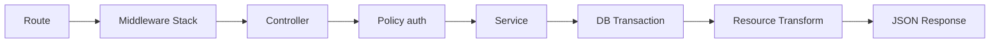
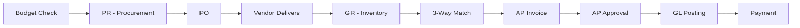
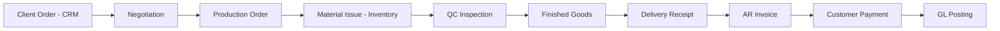
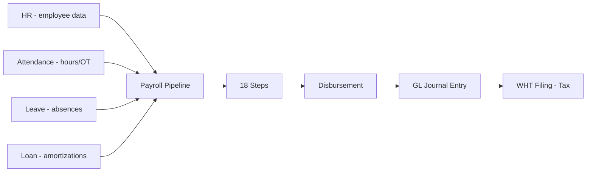

# Ogami ERP - Comprehensive Codebase & Architecture Study

> **Repository:** kwat0g/ogami-laravel | **Generated:** 2026-03-30 | **Stack:** Laravel 11 / PostgreSQL 16 / Redis / React 18 / TypeScript / Vite 6

---

## 1. System Overview

Ogami ERP is a **manufacturing Enterprise Resource Planning system** built specifically for **Philippine businesses**. It covers **22 domain modules** spanning the full HR-to-Finance and Production-to-Delivery cycle, with deep Philippine tax and labor law compliance.

### Tech Stack

| Layer | Technology |
|-------|-----------|
| Backend | Laravel 11 (PHP 8.2+) |
| Database | PostgreSQL 16 (triggers, generated columns, CHECK constraints) |
| Cache/Queue | Redis |
| Frontend | React 18 + TypeScript + Vite 6 |
| Package Manager | pnpm 10 (workspace at repo root) |
| State Management | TanStack Query (server state) + Zustand (2 stores only: auth, UI) |
| Auth | Laravel Sanctum (session-cookie, no JWT) |
| RBAC | Spatie Laravel Permission |
| Testing | Pest PHP (backend), Vitest (frontend), Playwright (E2E) |
| Static Analysis | PHPStan/Larastan level 5, ESLint, TypeScript strict |

### Quantitative Profile

| Metric | Count |
|--------|-------|
| Domain modules | 22 |
| Eloquent models | 137 |
| Domain services | 141 |
| Controllers | 81 |
| API Resources | 73 |
| Form Requests | 82 |
| Database migrations | 222 |
| Policies | 41 |
| State machines | 17 |
| Frontend pages | 241 |
| Frontend hooks | 58 |
| API route files | 30 |
| Backend test files | 94 |
| Value Objects | 7 |

---

## 2. Architecture

### 2.1 Backend - Domain-Driven Structure

```
app/
  Domains/<Domain>/
    Models/           Eloquent models (HasPublicUlid, SoftDeletes, Auditable)
    Services/         Business logic (final class implements ServiceContract)
    Policies/         Laravel Gate policies
    StateMachines/    Status transitions (TRANSITIONS constant)
    Pipeline/         Payroll computation steps (Step01-Step18)
    Events/           Domain events
    Listeners/        Event handlers
    Validators/       Business rule validators
    DataTransferObjects/  DTOs for complex operations

  Http/
    Controllers/      Thin controllers (authorize + delegate to service)
    Requests/         FormRequest validation
    Resources/        API response transformers

  Infrastructure/
    Boot/             Environment validation
    Middleware/        DepartmentScope, SoD, ModuleAccess, SecurityHeaders
    Observers/         Model observers
    Scopes/           Global query scopes

  Shared/
    ValueObjects/     Money, Minutes, PayPeriod, DateRange, EmployeeCode, WorkingDays, OvertimeMultiplier
    Exceptions/       DomainException base + 12 specialized exceptions
    Contracts/        Interfaces only: ServiceContract, BusinessRule
    Traits/           HasPublicUlid, HasDepartmentScope, ApiResponse
    Concerns/         HasApprovalWorkflow
    Models/           ApprovalLog, ApprovalDelegate, SodOverrideAuditLog
```

### 2.2 Request Flow



**Middleware stack:** `auth:sanctum` -> `dept_scope` -> `sod` -> `module_access` -> `security_headers`

### 2.3 Architecture Rules (Enforced by Arch Tests)

| Rule | Constraint |
|------|-----------|
| ARCH-001 | No `DB::` calls in controllers |
| ARCH-002 | Domain services implement `ServiceContract` |
| ARCH-003 | Exceptions extend `DomainException` |
| ARCH-004 | Value objects are `final readonly class` |
| ARCH-005 | No `dd()`/`dump()`/`var_dump()` in `app/` |
| ARCH-006 | `Shared\Contracts` contains only interfaces |

### 2.4 Frontend Structure

```
frontend/src/
  hooks/use<Domain>.ts     TanStack Query wrappers (58 files)
  pages/<domain>/          Page components (241 files)
  types/<domain>.ts        TypeScript interfaces (26 files)
  schemas/<domain>.ts      Zod validation schemas (25 files)
  stores/                  authStore.ts + uiStore.ts ONLY
  lib/api.ts               Axios instance (withCredentials, 1500ms write cooldown)
  router/index.tsx         All routes (700+ lines, lazy-loaded)
  components/              Shared UI (layout, modals, dashboard)
  contexts/                React contexts (PayrollWizardContext)
```

---

## 3. All 22 Domain Modules

### 3.1 People and Time Group

#### HR (Human Resources)
- **Purpose:** Employee master data, departments, positions, salary grades, recruitment
- **Models:** Employee, Department, Position, SalaryGrade, EmployeeClearance, EmployeeDocument + 13 Recruitment models
- **Services:** EmployeeService, AuthService, OnboardingChecklistService, OrgChartService, EmployeeClearanceService + 9 Recruitment services
- **State Machine:** `draft -> active <-> on_leave | suspended -> resigned | terminated`
- **Key Rules:**
  - `daily_rate` and `hourly_rate` are PostgreSQL stored generated columns (never set in PHP)
  - Government IDs: AES-256 encrypted + SHA-256 hash column for uniqueness
  - Department scoping auto-applied via middleware
- **Feeds:** Payroll, Attendance, Leave, Loan

#### Attendance
- **Purpose:** Daily time logs, shift schedules, overtime requests, holiday calendar
- **Services:** AttendanceProcessingService, AttendanceImportService, OvertimeRequestService, AnomalyResolutionService
- **OT Approval:** 5-step chain (Supervisor -> Manager -> Executive -> HR Officer -> VP)
- **Key Rules:**
  - One log per employee per work date (unique constraint)
  - Night differential: 10% premium for 10PM-6AM
  - Source tracking: biometric, csv_import, manual, system
- **Feeds:** Payroll Steps 03, 06, 08

#### Leave
- **Purpose:** Leave requests, type definitions, balance tracking, SIL monetization
- **Services:** LeaveRequestService, LeaveAccrualService, LeaveCalendarService, LeaveConflictDetectionService, SilMonetizationService
- **Approval Chain:** 4-step (Dept Head -> Manager -> GA Officer -> VP)
- **Key Rules:**
  - Balance deducted only at VP approval step
  - Half-day leave supported (AM/PM)
  - Team conflict detection (min staffing, position overlap)
- **Feeds:** Payroll, Attendance (absent flag)

#### Loan
- **Purpose:** Employee loans, amortization schedules, payroll deductions
- **Services:** LoanRequestService, LoanAmortizationService, LoanPayoffService
- **States:** `pending -> head_noted -> manager_checked -> officer_reviewed -> supervisor_approved -> approved -> ready_for_disbursement -> active -> fully_paid | written_off`
- **Key Rules:**
  - Monthly interest = Principal x Annual Rate / 12
  - Payroll deducts only from `active` loans
  - Write-off posts GL reversal entry
- **Feeds:** Payroll Step 15

---

### 3.2 Payroll

- **Purpose:** Semi-monthly payroll computation and multi-level approval
- **Models:** PayrollRun, PayrollDetail, PayrollAdjustment, PayPeriod, PayrollRunApproval, PayrollRunExclusion, ThirteenthMonthAccrual + 5 government contribution tables
- **Services (20+):** PayrollRunService, PayrollComputationService, PayrollWorkflowService, PayrollQueryService, PayrollPreRunService, PayrollScopeService, PayrollPostingService, PayslipPdfService, TaxWithholdingService, SssContributionService, PhilHealthContributionService, PagibigContributionService, DeductionService, FinalPayService, GovReportDataService, ThirteenthMonthAccrualService, PayrollBatchDispatcher, PayrollEdgeCaseHandler, TaxStatusDeriver, ThirteenthMonthComputationService

#### 18-Step Computation Pipeline


Each step is a single-responsibility invokable class mutating `PayrollComputationContext`.

#### 14-State Workflow

```
DRAFT -> SCOPE_SET -> PRE_RUN_CHECKED -> PROCESSING -> COMPUTED ->
REVIEW -> SUBMITTED -> HR_APPROVED -> ACCTG_APPROVED -> VP_APPROVED ->
DISBURSED -> PUBLISHED  (+ RETURNED, REJECTED -> DRAFT)
```

#### Philippine Statutory Compliance
- SSS contribution (table-based, employee + employer share)
- PhilHealth premium (4% of basic, 50/50 split)
- Pag-IBIG (2% each side, max P100/month)
- TRAIN Law withholding tax (annualized method)
- 13th month pay computation and accrual

---

### 3.3 Finance and Accounting Group

#### Accounting
- **Purpose:** General ledger, journal entries, bank reconciliation, financial reports
- **Models:** ChartOfAccount, FiscalPeriod, JournalEntry, JournalEntryLine, JournalEntryTemplate, RecurringJournalTemplate, BankAccount, BankTransaction, BankReconciliation, AccountMapping
- **Services (13):** JournalEntryService, ChartOfAccountService, FiscalPeriodService, GeneralLedgerService, TrialBalanceService, BalanceSheetService, IncomeStatementService, CashFlowService, FinancialRatioService, BankReconciliationService, PayrollAutoPostService, RecurringJournalTemplateService, YearEndClosingService
- **JE States:** `draft -> submitted -> posted | cancelled`
- **Key Rules:**
  - Double-entry enforced: debit total = credit total
  - JE number assigned only on posting (JE-YYYY-MM-NNNNNN)
  - Fiscal period enforcement: date must fall within open period
  - Auto-receives JEs from Payroll, AP, AR, Fixed Assets, Production
- **Financial Reports:** Balance Sheet, Income Statement, Trial Balance, Cash Flow, Financial Ratios (8 ratios)

#### AP (Accounts Payable)
- **Purpose:** Vendor invoices, payments, credit notes, purchase-to-pay cycle
- **Models:** Vendor, VendorInvoice, VendorPayment, VendorItem, VendorCreditNote, VendorFulfillmentNote, EwtRate, PaymentBatch, PaymentBatchItem
- **Services (10):** VendorService, VendorInvoiceService, VendorFulfillmentService, VendorItemService, VendorCreditNoteService, ApPaymentPostingService, EwtService, EarlyPaymentDiscountService, InvoiceAutoDraftService, PaymentBatchService
- **States:** `draft -> pending_approval -> head_noted -> manager_checked -> officer_reviewed -> approved -> partially_paid | paid`
- **Key Rules:**
  - 3-Way Match: PO <-> GR <-> Invoice
  - EWT rate frozen at invoice creation
  - Net payable = net amount + VAT - EWT
  - SoD: each approver different person

#### AR (Accounts Receivable)
- **Purpose:** Customer invoices, payments, credit notes, dunning
- **Models:** Customer, CustomerInvoice, CustomerPayment, CustomerAdvancePayment, CustomerCreditNote, DunningLevel, DunningNotice
- **Services (7):** CustomerService, CustomerInvoiceService, CustomerCreditNoteService, ArAgingService, DunningService, InvoiceAutoDraftService, PaymentAllocationService
- **States:** `draft -> approved -> partially_paid -> paid | written_off | cancelled`
- **Key Rules:**
  - Delivery Receipt must exist before invoice creation
  - Invoice number assigned only on approval
  - Write-off requires VP approval + GL reversal
  - Automated dunning batch command (`ar:run-dunning`)

#### Tax
- **Purpose:** BIR filing tracking, VAT ledger reconciliation
- **Models:** VatLedger, BirFiling
- **Services:** VatLedgerService, BirFilingService, BirAutoPopulationService, BirFormGeneratorService, BirPdfGeneratorService
- **BIR Forms:** 1601C, 0619E, 1601EQ, 2550M, 2550Q, 1702Q, 1702RT, 2307 alphalist
- **Data Sources:** Payroll (WHT), AP (EWT, input VAT), AR (output VAT)

#### Budget
- **Purpose:** Annual departmental budgets by GL account and cost center
- **Models:** AnnualBudget, BudgetAmendment, CostCenter
- **Services:** BudgetService, BudgetEnforcementService, BudgetForecastService, BudgetVarianceService, BudgetAmendmentService
- **States:** `draft -> submitted -> approved | rejected`
- **Key Rules:**
  - Budget stored in centavos (integer) per department + GL account + fiscal year
  - PR creation **hard-blocked** if department budget exceeded
  - Budget amendment workflow for reallocations

#### Fixed Assets
- **Purpose:** Asset register, depreciation schedules, disposals, transfers, revaluation
- **Models:** FixedAsset, FixedAssetCategory, AssetDepreciationEntry, AssetDisposal, AssetTransfer
- **Services:** FixedAssetService, AssetRevaluationService
- **Depreciation Methods:** Straight-line, double-declining, units-of-production
- **Key Rules:**
  - `asset_code` set by PostgreSQL trigger (never in PHP)
  - Monthly depreciation JE auto-posted via scheduler
  - Disposal posts gain/loss GL entry

---

### 3.4 Supply Chain Group

#### Procurement
- **Purpose:** Purchase requests, purchase orders, goods receipts, vendor RFQs
- **Models:** PurchaseRequest, PurchaseRequestItem, PurchaseOrder, PurchaseOrderItem, GoodsReceipt, GoodsReceiptItem, VendorRfq, VendorRfqVendor, BlanketPurchaseOrder
- **Services (7):** PurchaseRequestService, PurchaseOrderService, GoodsReceiptService, ThreeWayMatchService, VendorRfqService, VendorScoringService, BlanketPurchaseOrderService
- **PR States:** `draft -> pending_review -> reviewed -> budget_verified -> approved -> converted_to_po (+ returned | rejected)`
- **PO States:** `draft -> submitted -> acknowledged -> partially_received -> received_in_full | cancelled`
- **Key Rules:**
  - PR hard-blocked if department budget exceeded
  - SoD: requester != reviewer != budget verifier != VP
  - 3-Way Match feeds into AP invoice verification

#### Inventory
- **Purpose:** Item master, stock balances, stock movements, material requisitions, lot/batch tracking
- **Models:** ItemMaster, ItemCategory, StockBalance, StockLedger, WarehouseLocation, MaterialRequisition, MaterialRequisitionItem, PhysicalCount, PhysicalCountItem, LotBatch, StockReservation
- **Services (9):** StockService, ItemMasterService, MaterialRequisitionService, PhysicalCountService, InventoryAnalyticsService, InventoryReportService, CostingMethodService, LowStockReorderService, StockReservationService
- **MRQ States:** `draft -> submitted -> picked -> issued | cancelled`
- **Key Rules:**
  - Stock changes MUST go through `StockService::receive()` for audit trail
  - FIFO and weighted average costing
  - Physical count with variance reconciliation
  - Low-stock alert fires event at reorder point

---

### 3.5 Manufacturing Group

#### Production
- **Purpose:** Production orders, BOM, delivery schedules, output tracking, MRP, capacity planning
- **Models:** ProductionOrder, ProductionOutputLog, BillOfMaterials, BomComponent, DeliverySchedule, CombinedDeliverySchedule, WorkCenter, Routing
- **Services (11):** ProductionOrderService, BomService, CostingService, CapacityPlanningService, MrpService, DeliveryScheduleService, CombinedDeliveryScheduleService, OrderAutomationService, ProductionCostPostingService, ProductionReportService
- **PO States:** `draft -> scheduled -> in_progress -> on_hold -> completed | cancelled`
- **Key Features:**
  - Multi-level BOM explosion with auto-cost calculation
  - MRP with vendor lead times
  - Capacity planning against work centers
  - Auto-post cost variance GL entry on completion
  - Auto-creation from client orders

#### QC (Quality Control)
- **Purpose:** Inspections, NCR management, CAPA workflow, SPC, supplier quality
- **Models:** Inspection, InspectionResult, InspectionTemplate, InspectionTemplateItem, NonConformanceReport, CapaAction
- **Services (7):** InspectionService, InspectionTemplateService, NcrService, QualityAnalyticsService, QuarantineService, SpcService, SupplierQualityService
- **NCR States:** `raised -> under_investigation -> corrective_action_assigned -> closed | reopened`
- **Key Rules:**
  - IQC gate enforcement on Goods Receipt
  - CAPA tracks root cause + corrective/preventive action
  - Supplier quality scoring

#### Maintenance
- **Purpose:** Equipment register, work orders, preventive maintenance, spare parts
- **Models:** Equipment, MaintenanceWorkOrder, PmSchedule, WorkOrderPart
- **Services:** MaintenanceService, WorkOrderService, EquipmentService, MaintenanceAnalyticsService
- **WO States:** `reported -> assigned -> in_progress -> completed | cancelled`
- **Triggers:** Machine breakdown, scheduled PM, mold shot limit

#### Mold
- **Purpose:** Mold lifecycle tracking, shot counting, cost amortization
- **Models:** MoldMaster, MoldShotLog
- **Services:** MoldService, MoldAnalyticsService
- **States:** `active -> under_maintenance | retired | inactive`
- **Key Rules:**
  - Shot count = primary EOL indicator
  - Auto-log shots from production output (shots = qty / cavity_count)
  - Triggers maintenance WO at threshold

---

### 3.6 Sales and Distribution Group

#### CRM
- **Purpose:** Client orders with negotiation, lead management, opportunity pipeline, support tickets
- **Models:** ClientOrder, ClientOrderItem, ClientOrderActivity, ClientOrderDeliverySchedule, Lead, Contact, Opportunity, Ticket, TicketMessage
- **Services (7):** ClientOrderService, LeadService, LeadScoringService, OpportunityService, OrderTrackingService, SalesAnalyticsService, TicketService
- **Client Order States:** `pending -> negotiating <-> client_responded -> approved | rejected | cancelled`
- **Key Features:**
  - Multi-round negotiation tracking
  - Lead scoring (4-factor)
  - SLA enforcement on tickets
  - Approved order triggers Production Order + Delivery Schedule

#### Sales
- **Purpose:** Quotations, sales orders, price lists, profit margin analysis
- **Models:** Quotation, QuotationItem, SalesOrder, SalesOrderItem, PriceList, PriceListItem
- **Services:** QuotationService, SalesOrderService, PricingService, ProfitMarginService
- **Key Features:**
  - Quotation auto-converts to SO on acceptance
  - Credit limit enforcement
  - Profit margin analysis per line item
  - Price suggestion based on target margin and BOM cost

#### Delivery
- **Purpose:** Delivery receipts, shipments, fleet management, proof of delivery
- **Models:** DeliveryReceipt, DeliveryReceiptItem, Shipment, Vehicle, DeliveryRoute, ImpexDocument
- **Services:** DeliveryReceiptService, DeliveryService, ShipmentService, ProofOfDeliveryService
- **DR States:** `draft -> ready_for_pickup -> in_transit -> delivered | returned | cancelled`
- **Key Rules:**
  - DR must exist before AR invoice creation (physical delivery gate)
  - Proof of delivery: signature, photo, GPS capture

---

### 3.7 Compliance Group

#### ISO
- **Purpose:** ISO 9001 document control, internal audits, findings, improvement actions
- **Models:** ControlledDocument, DocumentRevision, DocumentDistribution, InternalAudit, AuditFinding, ImprovementAction
- **Services:** ISOService, DocumentControlService, AuditService, DocumentAcknowledgmentService
- **Document States:** `draft -> under_review -> effective | superseded | archived`
- **Audit States:** `scheduled -> in_progress -> completed | cancelled`

#### Dashboard
- **Purpose:** Role-based KPI dashboards (7 types)
- **Services:** DashboardKpiService, RoleBasedDashboardService
- **Dashboard Types:** Executive, Production, HR, Accounting, Warehouse, Sales, Employee

---

## 4. Cross-Module Integration Flows

### 4.1 Purchase-to-Pay (P2P)



### 4.2 Order-to-Cash (O2C)



### 4.3 Payroll Cycle



### 4.4 Inventory Flow

```
GR Receipt (Procurement)      -> Stock Ledger +
Material Requisition (Prod)   -> Stock Ledger -
Production Output             -> Stock Ledger +
Delivery (Sales)              -> Stock Ledger -
Adjustments (Cycle Count)     -> Stock Ledger +/-
```

### 4.5 Accounting Hub (GL Auto-Posting)

All these modules auto-post journal entries to the General Ledger:
- **Payroll** -> Salaries expense, deductions, employer contributions
- **AP** -> Expense/COGS debit, AP liability credit
- **AR** -> AR debit, Revenue + VAT credit
- **Production** -> Cost variance on PO completion
- **Fixed Assets** -> Monthly depreciation, disposal gain/loss
- **Loan** -> Disbursement, write-off reversal

---

## 5. Security and Authorization

### 5.1 RBAC Roles (Reversed Hierarchy)

```
Officer (highest operational access)
  -> Manager
    -> Head
      -> Staff (lowest access)

Special roles: admin, super_admin, executive, vice_president, vendor, client
```

- `admin` has only `system.*` permissions, NOT HR/payroll implicitly
- `executive` and `vice_president` see all departments
- `manager`, `head`, `staff` are scoped to their department

### 5.2 Security Features

| Feature | Implementation |
|---------|---------------|
| Authentication | Session-cookie (Sanctum), no JWT, no localStorage tokens |
| SoD Enforcement | Middleware + Policy: creator cannot approve own records |
| Department Scoping | Auto-applied via `DepartmentScopeMiddleware`; 4 roles bypass |
| Module Access | `ModuleAccessMiddleware` controls department-to-module visibility |
| Gov ID Encryption | AES-256 + SHA-256 hash for uniqueness constraints |
| Audit Trails | All model changes via `owen-it/laravel-auditing` |
| Security Headers | CSP, HSTS, X-Frame-Options via middleware |
| API Rate Limiting | Laravel built-in rate limiter |
| Frontend Write Cooldown | 1500ms dedup on POST/PUT/PATCH/DELETE |

### 5.3 Approval Role Matrix

| Module | Step 1 | Step 2 | Step 3 | Step 4 | Step 5 |
|--------|--------|--------|--------|--------|--------|
| Leave Request | Dept Head | Plant Manager | GA Officer | VP | - |
| Overtime Request | Supervisor | Manager | Executive | HR Officer | VP |
| Loan (v2) | Dept Head | Manager | Officer | VP | - |
| Procurement PR | Dept Head | Plant Manager | Officer | VP | - |
| Material Requisition | Dept Head | Manager | Officer | VP | Warehouse |
| AP Invoice | Dept Head | Manager | Officer | Accounting Mgr | - |
| Payroll Run | Initiator | HR Manager | Accounting Mgr | Cashier | - |
| Journal Entry | Preparer | Accounting Mgr | - | - | - |

---

## 6. Shared Building Blocks

### 6.1 Value Objects (all `final readonly class`)

| VO | Description | Rules |
|----|-------------|-------|
| `Money` | Centavos as integer | Never float; `fromCentavos()` throws on negative; ROUND_HALF_UP |
| `Minutes` | Time duration | Used in attendance/payroll |
| `PayPeriod` | Period definition | Encapsulates cutoff + pay dates |
| `DateRange` | Date interval | Immutable start/end pair |
| `EmployeeCode` | Formatted ID | Pattern: EMP-YYYY-NNN |
| `WorkingDays` | Day count | Pro-rating calculations |
| `OvertimeMultiplier` | OT rate | Philippine labor law rates |

### 6.2 Key Traits

- **`HasPublicUlid`** - ULID column for URL routing (requires SoftDeletes)
- **`HasDepartmentScope`** - Auto-applies department query filtering
- **`ApiResponse`** - Standard JSON response formatting
- **`HasApprovalWorkflow`** - Multi-step approval with SoD
- **`HasArchiveOperations`** - Soft delete archive operations

### 6.3 Exception Hierarchy

Base: `DomainException(message, errorCode, httpStatus, context[])` with 12 specialized exceptions covering authorization, SoD violations, state transitions, payroll edge cases, financial constraints, and more.

---

## 7. Infrastructure and Middleware

| Middleware | Purpose |
|-----------|---------|
| `DepartmentScopeMiddleware` | Auto-restricts queries to user department |
| `SodMiddleware` | Blocks same-user create+approve |
| `ModuleAccessMiddleware` | Department-to-module visibility control |
| `SecurityHeadersMiddleware` | CSP, HSTS, X-Frame-Options |
| `EnsureJsonApiMiddleware` | Forces JSON responses |
| `VendorScopeMiddleware` | Vendor portal data restriction |

**Key Infrastructure Services:**
- `ApprovalWorkflowService` - Generic multi-step approval orchestration
- `DocumentNumberService` - Sequential numbering (JE, INV, PO, etc.)

---

## 8. Database Design Patterns

- **Money:** Always `unsignedBigInteger` (centavos), never float/decimal
- **Enums:** `string` + PostgreSQL CHECK constraint (never `$table->enum()`)
- **Public IDs:** `$table->ulid('ulid')->unique()` on every table
- **Soft deletes:** Every table has `deleted_at`
- **Generated columns:** `daily_rate`, `hourly_rate` via `DB::statement()` after `Schema::create()`
- **Triggers:** Employee hard-delete prevention, `asset_code` generation, production `qty_rejected`
- **Gov IDs:** Encrypted text + separate `_hash` (SHA-256) column for uniqueness

### Seeder Dependency Chain (strict order)
1. Configuration tables (tax brackets, SSS/PhilHealth/PagIBIG rates, minimum wage, OT multipliers, holidays)
2. RBAC (Roles -> Permissions -> Modules -> ModulePermissions)
3. HR reference (SalaryGrades, LeaveTypes, LoanTypes, ShiftSchedules)
4. Accounting reference (ChartOfAccounts, AccountMappings)
5. Organizational (FiscalPeriods, Departments, Positions, DepartmentModuleAssignment)
6. Employee data (ConsolidatedEmployeeSeeder, TestAccounts)
7. Transactional (SampleData, LeaveBalances, Attendance, Payroll)

---

## 9. Testing Strategy

| Suite | DB | Description |
|-------|----|-------------|
| Unit/Shared | No | Value object tests (Money) |
| Unit/Payroll | Yes | Contribution, tax, deduction, 24 golden scenarios |
| Feature | Yes | HTTP endpoint tests per domain (~60 files) |
| Integration | Yes | Cross-domain workflows (10 files) |
| Arch | No | Structural constraint enforcement |

**Key Integration Tests:**
- `APPaymentToGLTest` - AP payment creates correct GL entries
- `PayrollToGLTest` - Payroll posting creates balanced JEs
- `ProcurementToInventoryTest` - GR updates stock balances
- `ProductionToInventoryTest` - Production output updates finished goods
- `ClientOrderToDeliveryWorkflowTest` - End-to-end O2C
- `LeaveAttendancePayrollTest` - Leave -> Attendance -> Payroll chain

**Testing Rules:**
- Always PostgreSQL (`ogami_erp_test`) - never SQLite
- RBAC seeding required before creating test users
- Custom Pest expectations: `->toBeValidationError()`, `->toBeDomainError()`
- PayrollTestHelper strips generated columns, handles aliases
- Golden suite: 24 canonical payroll scenarios with fixed expected values

---

## 10. Module Completeness Assessment

| Module | Completeness | Alignment |
|--------|-------------|-----------|
| Payroll | 95% | Excellent |
| Accounting | 90% | Very Good |
| Procurement | 90% | Very Good |
| AR | 90% | Very Good |
| Inventory | 88% | Good |
| AP | 88% | Good |
| QC | 88% | Good |
| HR | 85% | Good |
| Maintenance | 85% | Good |
| Tax | 82% | Good |
| Production | 92% | Good (post-BOM fix) |
| Budget | 85% | Good |
| Leave | 90% | Good |
| Loan | 85% | Good |
| CRM | 85% | Good |
| Sales | 85% | Good |
| Delivery | 82% | Good |
| Fixed Assets | 85% | Good |
| ISO | 80% | Good |
| Mold | 80% | Good |
| Attendance | 88% | Good |
| Dashboard | 80% | Good |

---

## 11. Key Design Decisions

1. **Integer centavos for money** - Avoids IEEE 754 floating-point precision issues
2. **ULID public keys** - Opaque, non-enumerable URLs while keeping integer PKs for FK performance
3. **PostgreSQL generated columns** - daily_rate/hourly_rate computed at DB level
4. **Pipeline pattern for payroll** - 18 single-responsibility steps mutating shared context
5. **State machines as constants** - Simple array-based transition maps (no external library)
6. **Strict SoD enforcement** - Both middleware and policy level checks
7. **Department-scoped queries** - Global scope with explicit bypass for admin roles
8. **Two Zustand stores only** - All server state in TanStack Query
9. **Write cooldown on API client** - Prevents button-spam without server-side idempotency
10. **Government ID encryption + hash** - Encrypted for storage, hashed for uniqueness
11. **No SQLite in tests** - PG-specific features require real PostgreSQL
12. **Reversed hierarchy** - Officer > Manager > Head > Staff (unusual but intentional)

---

## 12. API Route Organization

30 versioned route files under `routes/api/v1/`:

| File | Domain |
|------|--------|
| `accounting.php` | GL, JE, COA, Fiscal Periods, Bank Recon, Financial Reports |
| `admin.php` | System administration |
| `approvals.php` | Cross-domain approval endpoints |
| `ar.php` | Customers, Invoices, Payments, Credit Notes, Dunning |
| `attendance.php` | Logs, Shifts, OT Requests, Timesheets |
| `auth.php` | Login, Logout, Session management |
| `budget.php` | Cost Centers, Annual Budgets, Amendments, Variance |
| `crm.php` | Client Orders, Leads, Opportunities, Tickets |
| `dashboard.php` | Role-based KPI dashboards |
| `delivery.php` | Receipts, Shipments, Routes, Fleet |
| `employee.php` | Employee self-service endpoints |
| `fixed_assets.php` | Assets, Depreciation, Disposal, Transfers |
| `hr.php` | Departments, Positions, Salary Grades, Documents |
| `inventory.php` | Items, Stock, MRQ, Physical Count, Analytics |
| `leave.php` | Requests, Types, Balances, Calendar |
| `loans.php` | Applications, Amortization, Payments |
| `maintenance.php` | Equipment, Work Orders, PM Schedules |
| `mold.php` | Mold Masters, Shot Logs |
| `payroll.php` | Runs, Computation, Approval, Reports |
| `procurement.php` | PR, PO, GR, RFQ, Vendor Scoring |
| `production.php` | Orders, BOM, MRP, Capacity, Schedules |
| `qc.php` | Inspections, Templates, NCR, CAPA |
| `recruitment.php` | Requisitions, Postings, Applications, Offers |
| `sales.php` | Quotations, Sales Orders, Price Lists |
| `tax.php` | VAT Ledger, BIR Filings |
| `vendor-portal.php` | Vendor self-service (PO, catalog, invoices) |
| `notifications.php` | Notification management |
| `reports.php` | Cross-module report endpoints |
| `search.php` | Global search |
| `enhancements.php` | Enhancement settings management |
