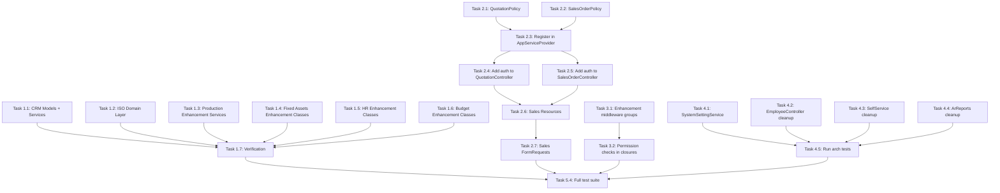

# ogamiPHP Audit Fix Implementation Plan
Generated: 2026-03-28

This plan addresses all findings from the [ogamiPHP Production Audit Report](plans/ogamiphp-production-audit-report.md), organized into 5 priority tiers with exact file paths, code patterns, and implementation steps.

---

## Priority 1: Remove/Guard Phantom Routes (CRITICAL -- prevents demo crashes)

These are the highest priority because any panelist navigating to these routes will see a 500 error with a `Class not found` stack trace.

### Task 1.1: Create Missing CRM Domain Classes (Lead, Contact, Opportunity)

The CRM module's `Quotation` and `SalesOrder` models import `Contact` and `Opportunity` -- so these models need to exist even if minimal.

**Files to create:**

1. **`app/Domains/CRM/Models/Lead.php`**
   - Follow pattern from [`ClientOrder.php`](app/Domains/CRM/Models/ClientOrder.php)
   - `final class Lead extends Model implements Auditable`
   - Use traits: `AuditableTrait, HasPublicUlid, SoftDeletes`
   - Table: `crm_leads` (from migration [`2026_03_27_210002_phase1_crm_lead_contact_opportunity.php`](database/migrations/2026_03_27_210002_phase1_crm_lead_contact_opportunity.php))
   - Relationships: `assignedTo()` BelongsTo User, `createdBy()` BelongsTo User, `activities()` HasMany CrmActivity, `convertedCustomer()` BelongsTo Customer

2. **`app/Domains/CRM/Models/Contact.php`**
   - Table: `crm_contacts`
   - Relationships: `customer()` BelongsTo Customer, `createdBy()` BelongsTo User

3. **`app/Domains/CRM/Models/Opportunity.php`**
   - Table: `crm_opportunities`
   - Relationships: `customer()` BelongsTo Customer, `contact()` BelongsTo Contact, `createdBy()` BelongsTo User, `lead()` BelongsTo Lead

4. **`app/Domains/CRM/Services/LeadService.php`**
   - `final class LeadService implements ServiceContract`
   - Methods: `paginate()`, `store()`, `update()`, `convert()`, `disqualify()`
   - All mutations in `DB::transaction()`
   - Pattern: follow [`ClientOrderService.php`](app/Domains/CRM/Services/ClientOrderService.php)

5. **`app/Domains/CRM/Services/LeadScoringService.php`**
   - `final class LeadScoringService implements ServiceContract`
   - Methods: `scoreLead()`, `scoreAll()`, `autoQualify()`
   - Can return computed arrays/scores; no DB writes required for scoring

6. **`app/Domains/CRM/Services/OpportunityService.php`**
   - `final class OpportunityService implements ServiceContract`
   - Methods: `paginate()`, `store()`, `update()`, `pipeline()`, `advanceStage()`, `markWon()`, `markLost()`

**Verify migration columns:** Read [`2026_03_27_210002_phase1_crm_lead_contact_opportunity.php`](database/migrations/2026_03_27_210002_phase1_crm_lead_contact_opportunity.php) to ensure `$fillable` arrays match migration columns.

### Task 1.2: Create Missing ISO Domain Layer

**Files to create:**

1. **`app/Domains/ISO/Models/ControlledDocument.php`**
   - Table: `controlled_documents` (from [`2026_03_05_000017_create_iso_tables.php`](database/migrations/2026_03_05_000017_create_iso_tables.php))
   - Traits: `AuditableTrait, HasPublicUlid, SoftDeletes`

2. **`app/Domains/ISO/Models/InternalAudit.php`**
   - Table: `internal_audits`

3. **`app/Domains/ISO/Models/AuditFinding.php`**
   - Table: `audit_findings`
   - Relationships: `audit()` BelongsTo InternalAudit

4. **`app/Domains/ISO/Services/ISOService.php`**
   - `final class ISOService implements ServiceContract`
   - Methods: `paginateDocuments()`, `storeDocument()`, `updateDocument()`, `paginateAudits()`, `storeAudit()`, `storeAuditFinding()`
   - Called by [`ISOController.php`](app/Http/Controllers/ISO/ISOController.php) -- match the method signatures the controller expects

5. **`app/Domains/ISO/Services/DocumentAcknowledgmentService.php`**
   - `final class DocumentAcknowledgmentService implements ServiceContract`
   - Methods: `pendingForUser()`, `acknowledge()`, `acknowledgmentStatus()`
   - Called from [`enhancements.php:376`](routes/api/v1/enhancements.php:376)

6. **`app/Domains/ISO/Policies/ISOPolicy.php`**
   - Pattern: follow [`MaintenancePolicy.php`](app/Domains/Maintenance/Policies/MaintenancePolicy.php) -- single policy covering multiple models
   - Methods: `viewAny`, `view`, `create`, `update`, `audit`
   - Permission names: `iso.view`, `iso.create`, `iso.manage`, `iso.audit`

**Also register in AppServiceProvider:** Add `Gate::policy(ControlledDocument::class, ISOPolicy::class)` and `Gate::policy(InternalAudit::class, ISOPolicy::class)` at [`AppServiceProvider.php:173`](app/Providers/AppServiceProvider.php:173)

### Task 1.3: Create Missing Production Enhancement Services

**Files to create:**

1. **`app/Domains/Production/Services/CapacityPlanningService.php`**
   - `final class CapacityPlanningService implements ServiceContract`
   - Methods: `utilizationReport($from, $to)`, `checkFeasibility($productionOrder)`
   - Referenced from [`production.php:83`](routes/api/v1/production.php:83) and [`enhancements.php:329`](routes/api/v1/enhancements.php:329)

2. **`app/Domains/Production/Services/MrpService.php`**
   - `final class MrpService implements ServiceContract`
   - Methods: `timePhasedExplode()`
   - Referenced from [`production.php:93`](routes/api/v1/production.php:93) and [`enhancements.php:337`](routes/api/v1/enhancements.php:337)

### Task 1.4: Create Missing Fixed Assets Enhancement Classes

1. **`app/Domains/FixedAssets/Models/AssetTransfer.php`**
   - Table: `asset_transfers` (from [`2026_03_27_240000_phase4_asset_transfer.php`](database/migrations/2026_03_27_240000_phase4_asset_transfer.php))
   - Traits: `HasPublicUlid, SoftDeletes`
   - Relationships: `fixedAsset()`, `fromDepartment()`, `toDepartment()`, `requestedBy()`, `approvedBy()`
   - Referenced from [`fixed_assets.php:82`](routes/api/v1/fixed_assets.php:82)

2. **`app/Domains/FixedAssets/Services/AssetRevaluationService.php`**
   - `final class AssetRevaluationService implements ServiceContract`
   - Methods: `revalue()`, `impairmentTest()`
   - Referenced from [`enhancements.php:444`](routes/api/v1/enhancements.php:444)

### Task 1.5: Create Missing HR Enhancement Classes

1. **`app/Domains/HR/Models/PerformanceAppraisal.php`**
   - Table: `performance_appraisals` (from [`2026_03_28_000001`](database/migrations/2026_03_28_000001_create_performance_appraisals_table.php))

2. **`app/Domains/HR/Services/PerformanceAppraisalService.php`**
   - `final class PerformanceAppraisalService implements ServiceContract`
   - Referenced in enhancement tests

### Task 1.6: Create Missing Budget Enhancement Classes

1. **`app/Domains/Budget/Models/BudgetAmendment.php`**
   - Table: `budget_amendments` (from [`2026_03_28_000002`](database/migrations/2026_03_28_000002_create_budget_amendments_table.php))

### Task 1.7: Verification Step

After creating all files, run:
```bash
./vendor/bin/phpstan analyse --level=0 app/Domains/CRM app/Domains/ISO app/Domains/Production/Services/CapacityPlanningService.php app/Domains/Production/Services/MrpService.php app/Domains/FixedAssets app/Domains/HR/Services/PerformanceAppraisalService.php app/Domains/Budget/Models/BudgetAmendment.php
```

And verify routes load:
```bash
php artisan route:list --path=api/v1/crm
php artisan route:list --path=api/v1/sales
php artisan route:list --path=api/v1/production
```

---

## Priority 2: Sales Module Authorization (CRITICAL -- security gap)

### Task 2.1: Create QuotationPolicy

**File:** `app/Domains/Sales/Policies/QuotationPolicy.php`

Follow pattern from [`PurchaseOrderPolicy.php`](app/Domains/Procurement/Policies/PurchaseOrderPolicy.php:19):

```
final class QuotationPolicy
{
    use HandlesAuthorization;

    public function before(User $user, string $ability): ?bool
    {
        if ($user->hasRole('admin') || $user->hasRole('super_admin')) return true;
        return null;
    }

    public function viewAny(User $user): bool  -- sales.quotations.view
    public function view(User $user, Quotation $q): bool  -- sales.quotations.view
    public function create(User $user): bool  -- sales.quotations.create
    public function update(User $user, Quotation $q): bool  -- sales.quotations.update AND status=draft
    public function send(User $user, Quotation $q): bool  -- sales.quotations.send AND status=draft
    public function accept(User $user, Quotation $q): bool  -- sales.quotations.accept AND status=sent
    public function reject(User $user, Quotation $q): bool  -- sales.quotations.manage AND status=sent
    public function convertToOrder(User $user, Quotation $q): bool  -- sales.orders.confirm AND status=accepted
}
```

### Task 2.2: Create SalesOrderPolicy

**File:** `app/Domains/Sales/Policies/SalesOrderPolicy.php`

```
final class SalesOrderPolicy
{
    public function viewAny(User $user): bool  -- sales.orders.view
    public function view(User $user, SalesOrder $o): bool  -- sales.orders.view
    public function create(User $user): bool  -- sales.orders.manage
    public function confirm(User $user, SalesOrder $o): bool  -- sales.orders.confirm AND SoD: $user->id !== $o->created_by_id
    public function cancel(User $user, SalesOrder $o): bool  -- sales.orders.cancel AND status is draft or confirmed
}
```

### Task 2.3: Register Policies in AppServiceProvider

Add to [`AppServiceProvider.php`](app/Providers/AppServiceProvider.php) after line 188:

```php
use App\Domains\Sales\Models\Quotation;
use App\Domains\Sales\Models\SalesOrder;
use App\Domains\Sales\Policies\QuotationPolicy;
use App\Domains\Sales\Policies\SalesOrderPolicy;

Gate::policy(Quotation::class, QuotationPolicy::class);
Gate::policy(SalesOrder::class, SalesOrderPolicy::class);
```

### Task 2.4: Add Authorization to QuotationController

Edit [`QuotationController.php`](app/Http/Controllers/Sales/QuotationController.php):
- `index()`: Add `$this->authorize('viewAny', Quotation::class);`
- `store()`: Add `$this->authorize('create', Quotation::class);`
- `show()`: Add `$this->authorize('view', $quotation);`
- `send()`: Add `$this->authorize('send', $quotation);`
- `accept()`: Add `$this->authorize('accept', $quotation);`
- `reject()`: Add `$this->authorize('reject', $quotation);`
- `convertToOrder()`: Add `$this->authorize('convertToOrder', $quotation);`

### Task 2.5: Add Authorization to SalesOrderController

Edit [`SalesOrderController.php`](app/Http/Controllers/Sales/SalesOrderController.php):
- `index()`: Add `$this->authorize('viewAny', SalesOrder::class);`
- `store()`: Add `$this->authorize('create', SalesOrder::class);`
- `show()`: Add `$this->authorize('view', $salesOrder);`
- `confirm()`: Add `$this->authorize('confirm', $salesOrder);`
- `cancel()`: Add `$this->authorize('cancel', $salesOrder);`

### Task 2.6: Create Sales Resource Classes

1. **`app/Http/Resources/Sales/QuotationResource.php`**
   - Follow pattern from [`PurchaseOrderResource.php`](app/Http/Resources/Procurement/PurchaseOrderResource.php)
   - Include: `id`, `ulid`, `quotation_number`, `customer` (nested), `status`, `total_centavos`, `validity_date`, `items`, `created_by`, timestamps
   - Exclude: internal IDs that should not be exposed

2. **`app/Http/Resources/Sales/SalesOrderResource.php`**
   - Include: `id`, `ulid`, `order_number`, `customer` (nested), `status`, `total_centavos`, `items`, timestamps

3. **Update controllers** to return `QuotationResource` and `SalesOrderResource` instead of raw `response()->json()`

### Task 2.7: Create FormRequest Classes for Sales

1. **`app/Http/Requests/Sales/StoreQuotationRequest.php`**
   - Move validation from [`QuotationController.php:30-42`](app/Http/Controllers/Sales/QuotationController.php:30)

2. **`app/Http/Requests/Sales/StoreSalesOrderRequest.php`**
   - Move validation from [`SalesOrderController.php:26-39`](app/Http/Controllers/Sales/SalesOrderController.php:26)

---

## Priority 3: Enhancement Route Authorization (CRITICAL -- security gap)

### Task 3.1: Add Module-Scoped Middleware to Enhancement Route Groups

Edit [`enhancements.php`](routes/api/v1/enhancements.php):

Replace the single `Route::middleware(['auth:sanctum'])` wrapper (line 17) with module-specific sub-groups:

```
Route::middleware(['auth:sanctum'])->group(function () {
    // Dashboard system health -- needs any authenticated user (keep as-is)
    Route::get('dashboard/system-health', ...);

    // Chain record and audit trail -- needs any authenticated user (keep as-is)
    Route::get('chain-record/{type}/{id}', ...);
    Route::get('audit-trail/{type}/{id}', ...);
});

Route::middleware(['auth:sanctum', 'module_access:production'])->group(function () {
    Route::get('production/orders/{order}/material-consumption', ...);
    Route::get('production/capacity', ...);
    Route::get('production/capacity/check/{productionOrder}', ...);
    Route::get('production/mrp/time-phased', ...);
    Route::get('production/bom/where-used/{itemId}', ...);
});

Route::middleware(['auth:sanctum', 'module_access:accounting'])->group(function () {
    Route::prefix('ap')->group(...);  // AP discount routes
    Route::get('accounting/financial-ratios', ...);
});

Route::middleware(['auth:sanctum', 'module_access:inventory'])->group(function () {
    Route::get('inventory/valuation-by-method', ...);
});

Route::middleware(['auth:sanctum', 'module_access:qc'])->group(function () {
    Route::prefix('qc/quarantine')->group(...);
});

Route::middleware(['auth:sanctum', 'module_access:iso'])->group(function () {
    Route::prefix('iso')->group(...);
});

Route::middleware(['auth:sanctum', 'module_access:loans'])->group(function () {
    Route::prefix('loans')->group(...);
});

Route::middleware(['auth:sanctum', 'module_access:procurement'])->group(function () {
    Route::prefix('procurement/blanket-pos')->group(...);
});

Route::middleware(['auth:sanctum', 'module_access:fixed_assets'])->group(function () {
    Route::prefix('fixed-assets')->group(...);
});

Route::middleware(['auth:sanctum', 'module_access:tax'])->group(function () {
    Route::prefix('tax')->group(...);
});

Route::middleware(['auth:sanctum', 'module_access:delivery'])->group(function () {
    Route::post('delivery/receipts/{deliveryReceipt}/pod', ...);
});

Route::middleware(['auth:sanctum', 'module_access:leaves'])->group(function () {
    Route::get('leave/requests/{leaveRequest}/conflicts', ...);
});

Route::middleware(['auth:sanctum', 'module_access:payroll'])->group(function () {
    Route::get('payroll/final-pay/{employee}', ...);
});
```

### Task 3.2: Add Permission Checks to Inline Route Closures

For each enhancement closure that performs state-changing operations, add `abort_unless()` checks:

- QC quarantine release/reject: `abort_unless($request->user()->can('qc.manage'), 403)`
- Fixed asset revalue/impairment: `abort_unless($request->user()->can('fixed_assets.manage'), 403)`
- Loan payoff/restructure: `abort_unless($request->user()->can('loans.hr_approve'), 403)`
- Blanket PO create/activate: `abort_unless($request->user()->can('procurement.purchase-order.manage'), 403)`
- Delivery POD: `abort_unless($request->user()->can('delivery.manage'), 403)`

---

## Priority 4: Architecture Violations Cleanup

### Task 4.1: Extract SystemSettingController DB Queries Into Service

**Create:** `app/Services/SystemSettingService.php`
- Move all `DB::table('system_settings')` queries from [`SystemSettingController.php`](app/Http/Controllers/Admin/SystemSettingController.php) into this service
- Methods: `listAll()`, `listByGroup()`, `getByKey()`, `updateByKey()`, `batchUpdate()`, `writeAuditLog()`
- Controller should only: authorize, call service, return response

### Task 4.2: Clean Up EmployeeController DB Query

In [`EmployeeController.php:83`](app/Http/Controllers/HR/EmployeeController.php:83):
- Move the `DB::table('model_has_roles')` query into [`EmployeeService`](app/Domains/HR/Services/EmployeeService.php) as a `getHigherRoleUserIds()` method

### Task 4.3: Clean Up EmployeeSelfServiceController DB Query

In [`EmployeeSelfServiceController.php:454`](app/Http/Controllers/Employee/EmployeeSelfServiceController.php:454):
- Move `DB::table('system_settings')` into a shared `SystemSettingService::getCompanyInfo()` method

### Task 4.4: Clean Up ArReportsController DB Query

In [`ArReportsController.php:180`](app/Http/Controllers/AR/ArReportsController.php:180):
- Move `DB::table('system_settings')` into the same `SystemSettingService::getCompanyInfo()` method

### Task 4.5: Run Architecture Tests

```bash
./vendor/bin/pest tests/Arch/ArchTest.php
```

Verify that ARCH-001 (no DB:: in controllers) passes after cleanup. If the arch test is not checking for inline DB:: calls, add:

```php
arch('controllers must not use DB facade')
    ->expect('App\Http\Controllers')
    ->not->toUse('Illuminate\Support\Facades\DB');
```

---

## Priority 5: Polish and Test Coverage

### Task 5.1: Add Basic Feature Tests for Sales Authorization

**File:** `tests/Feature/Sales/SalesAuthorizationTest.php`

Test cases:
- Unauthenticated user gets 401 on all sales endpoints
- Staff without `sales.quotations.view` gets 403 on quotation list
- User with `sales.quotations.create` can create a quotation
- SoD: same user who created a sales order cannot confirm it
- User without `sales.orders.confirm` gets 403 on confirm action

### Task 5.2: Add ISO Feature Tests

**File:** `tests/Feature/ISO/ISOServiceTest.php`

Update existing [`ISOFeatureTest.php`](tests/Feature/ISO/ISOFeatureTest.php) to work with newly created services.

### Task 5.3: Fix Enhancement Service Tests

Update [`EnhancementServicesTest.php`](tests/Feature/Enhancement/EnhancementServicesTest.php) -- several tests reference `CapacityPlanningService` and `PerformanceAppraisalService` which now need to exist.

### Task 5.4: Run Full Test Suite

```bash
./vendor/bin/pest --testsuite=Feature
./vendor/bin/pest --testsuite=Unit
./vendor/bin/pest --testsuite=Integration
./vendor/bin/pest --testsuite=Arch
./vendor/bin/phpstan analyse
```

Fix any failures resulting from the new classes.

---

## Implementation Dependency Graph



---

## Files Changed Summary

| Priority | New Files | Modified Files |
|---|---|---|
| P1 | ~15 new domain classes | 1 AppServiceProvider |
| P2 | 6 new files: 2 policies, 2 resources, 2 form requests | 2 controllers, 1 AppServiceProvider |
| P3 | 0 | 1 enhancements.php route file |
| P4 | 1 SystemSettingService | 4 controllers |
| P5 | 2 test files | 2 existing test files |
| **Total** | **~24 new files** | **~11 modified files** |
