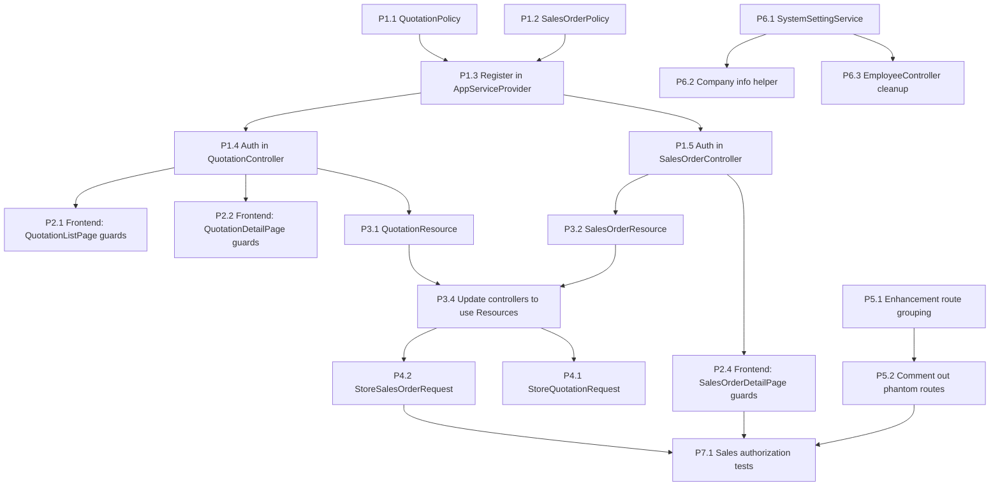

# ogamiPHP Core Module Fixes -- Frontend-Visible Scope
Generated: 2026-03-28

This plan focuses exclusively on improving the **currently visible frontend modules** -- fixing backend authorization gaps, frontend UX issues, and architecture violations in modules that users/panelists will actually interact with during the demo.

**Out of scope:** Missing enhancement classes (Lead, Opportunity, ISO, CapacityPlanning, MRP, AssetTransfer, etc.) -- these are intentionally planned for future phases.

---

## Module Inventory: What Is Visible in Frontend

| Module | Frontend Pages | Router Guard | Backend Auth | Status |
|---|---|---|---|---|
| HR | 10 pages | `hr.full_access` | Policy-based | Good |
| Attendance | 4 pages | `hr.full_access` | Policy-based | Good |
| Leave | 4 pages | `hr.full_access` | Policy-based | Good |
| Loans | 3 pages | `hr.full_access` | Policy-based | Good |
| Payroll | 14 pages | Various payroll perms | Policy-based | Good |
| Accounting | 21 pages | Various acctg perms | Policy-based | Good |
| AP | Included in accounting | `vendor_invoices.*` | Policy-based | Good |
| AR | 7 pages | `customer_invoices.*` | Policy-based | Good |
| Procurement | 15 pages | `procurement.*` | Policy-based | Good |
| Inventory | 13 pages | `inventory.*` | Policy-based | Good |
| Production | 14 pages | `production.*` | Policy-based | Good |
| QC | 10 pages | `qc.*` | Policy-based | Good |
| Delivery | 5 pages | `delivery.*` | Policy-based | Good |
| Maintenance | 7 pages | `maintenance.*` | Policy-based | Good |
| Mold | 4 pages | `mold.*` | Policy-based | Good |
| Budget | 2 pages | `budget.*` | Closure-based | Partial |
| Fixed Assets | 2 pages | `fixed_assets.*` | Policy-based | Good |
| Tax | 1 page | `reports.vat` | Policy-based | Good |
| CRM/Tickets | 3 pages | `crm.tickets.*` | Policy-based | Good |
| Sales/Orders | 3 pages | `sales.order_review` | Policy-based | Good |
| **Sales/Quotations** | **4 pages** | **`sales.quotations.view`** | **NONE** | **BROKEN** |
| **Sales/Orders** | **2 pages** | **`sales.orders.view`** | **NONE** | **BROKEN** |
| Dashboard | 15 role-based | Various | N/A | Good |
| Vendor Portal | 7 pages | `vendor_portal.*` | Scope middleware | Good |
| Client Portal | 8 pages | `client_portal.*` | Policy-based | Good |

---

## Priority 1: Sales Module Backend Authorization

### Task 1.1: Create QuotationPolicy

**File to create:** `app/Domains/Sales/Policies/QuotationPolicy.php`

Pattern from [`PurchaseOrderPolicy.php`](app/Domains/Procurement/Policies/PurchaseOrderPolicy.php):

```php
final class QuotationPolicy
{
    use HandlesAuthorization;

    public function before(User $user, string $ability): ?bool
    {
        if ($user->hasRole('admin') || $user->hasRole('super_admin')) return true;
        return null;
    }

    public function viewAny(User $user): bool
    {
        return $user->hasPermissionTo('sales.quotations.view');
    }

    public function view(User $user, Quotation $quotation): bool
    {
        return $user->hasPermissionTo('sales.quotations.view');
    }

    public function create(User $user): bool
    {
        return $user->hasPermissionTo('sales.quotations.create');
    }

    public function update(User $user, Quotation $quotation): bool
    {
        return $user->hasPermissionTo('sales.quotations.update')
            && $quotation->status === 'draft';
    }

    public function send(User $user, Quotation $quotation): bool
    {
        return $user->hasPermissionTo('sales.quotations.send')
            && $quotation->status === 'draft';
    }

    public function accept(User $user, Quotation $quotation): bool
    {
        return $user->hasPermissionTo('sales.quotations.accept')
            && $quotation->status === 'sent';
    }

    public function reject(User $user, Quotation $quotation): bool
    {
        return $user->hasPermissionTo('sales.quotations.manage')
            && $quotation->status === 'sent';
    }

    public function convertToOrder(User $user, Quotation $quotation): bool
    {
        return $user->hasPermissionTo('sales.orders.confirm')
            && $quotation->status === 'accepted';
    }
}
```

### Task 1.2: Create SalesOrderPolicy

**File to create:** `app/Domains/Sales/Policies/SalesOrderPolicy.php`

```php
final class SalesOrderPolicy
{
    use HandlesAuthorization;

    public function before(User $user, string $ability): ?bool
    {
        if ($user->hasRole('admin') || $user->hasRole('super_admin')) return true;
        return null;
    }

    public function viewAny(User $user): bool
    {
        return $user->hasPermissionTo('sales.orders.view');
    }

    public function view(User $user, SalesOrder $order): bool
    {
        return $user->hasPermissionTo('sales.orders.view');
    }

    public function create(User $user): bool
    {
        return $user->hasPermissionTo('sales.orders.manage');
    }

    // SoD: creator cannot confirm their own order
    public function confirm(User $user, SalesOrder $order): bool
    {
        return $user->hasPermissionTo('sales.orders.confirm')
            && $user->id !== $order->created_by_id
            && $order->status === 'draft';
    }

    public function cancel(User $user, SalesOrder $order): bool
    {
        return $user->hasPermissionTo('sales.orders.cancel')
            && in_array($order->status, ['draft', 'confirmed']);
    }
}
```

### Task 1.3: Register Policies in AppServiceProvider

**File to edit:** [`app/Providers/AppServiceProvider.php`](app/Providers/AppServiceProvider.php)

Add after line 188 (after the existing `Gate::policy(AnnualBudget::class, BudgetPolicy::class)` line):

```php
Gate::policy(Quotation::class, QuotationPolicy::class);
Gate::policy(SalesOrder::class, SalesOrderPolicy::class);
```

Add the corresponding imports at the top of the file.

### Task 1.4: Add Authorization to QuotationController

**File to edit:** [`app/Http/Controllers/Sales/QuotationController.php`](app/Http/Controllers/Sales/QuotationController.php)

Add `$this->authorize()` calls to every method:

| Method | Line | Add |
|---|---|---|
| `index()` | 21 | `$this->authorize('viewAny', Quotation::class);` |
| `store()` | 28 | `$this->authorize('create', Quotation::class);` |
| `show()` | 49 | `$this->authorize('view', $quotation);` |
| `send()` | 56 | `$this->authorize('send', $quotation);` |
| `accept()` | 61 | `$this->authorize('accept', $quotation);` |
| `reject()` | 66 | `$this->authorize('reject', $quotation);` |
| `convertToOrder()` | 71 | `$this->authorize('convertToOrder', $quotation);` |

### Task 1.5: Add Authorization to SalesOrderController

**File to edit:** [`app/Http/Controllers/Sales/SalesOrderController.php`](app/Http/Controllers/Sales/SalesOrderController.php)

| Method | Line | Add |
|---|---|---|
| `index()` | 17 | `$this->authorize('viewAny', SalesOrder::class);` |
| `store()` | 24 | `$this->authorize('create', SalesOrder::class);` |
| `show()` | 46 | `$this->authorize('view', $salesOrder);` |
| `confirm()` | 55 | `$this->authorize('confirm', $salesOrder);` |
| `cancel()` | 62 | `$this->authorize('cancel', $salesOrder);` |

---

## Priority 2: Sales Frontend Permission Guards on Action Buttons

### Task 2.1: Fix QuotationListPage -- Guard New Quotation Button

**File:** [`frontend/src/pages/sales/QuotationListPage.tsx`](frontend/src/pages/sales/QuotationListPage.tsx)

Currently line 35 shows "New Quotation" button unconditionally. Fix:

```tsx
import { useAuthStore } from '@/stores/authStore'

// Inside component:
const canCreate = useAuthStore(s => s.hasPermission('sales.quotations.create'))

// In JSX, wrap button:
{canCreate && (
  <Link to="/sales/quotations/new" className="btn-primary">
    <Plus className="w-3.5 h-3.5" /> New Quotation
  </Link>
)}
```

### Task 2.2: Fix QuotationDetailPage -- Guard Action Buttons

**File:** [`frontend/src/pages/sales/QuotationDetailPage.tsx`](frontend/src/pages/sales/QuotationDetailPage.tsx)

Currently lines 29-31 show Send/Accept/Convert buttons based only on status. Fix:

```tsx
import { useAuthStore } from '@/stores/authStore'

const canSend = useAuthStore(s => s.hasPermission('sales.quotations.send'))
const canAccept = useAuthStore(s => s.hasPermission('sales.quotations.accept'))
const canConvert = useAuthStore(s => s.hasPermission('sales.orders.confirm'))

// Update button rendering:
{q.status === 'draft' && canSend && <button ...>Send</button>}
{q.status === 'sent' && canAccept && <button ...>Accept</button>}
{q.status === 'accepted' && canConvert && <button ...>Convert to Order</button>}
```

Also add **error state** handling (currently missing):
```tsx
if (isLoading) return <SkeletonLoader rows={6} />
if (isError) return <div className="p-6 text-red-500">Failed to load quotation.</div>
if (!q) return <div className="p-6 text-neutral-500">Quotation not found</div>
```

### Task 2.3: Fix SalesOrderListPage -- No Action Needed

The [`SalesOrderListPage.tsx`](frontend/src/pages/sales/SalesOrderListPage.tsx) is a read-only list page with no create button (note: "Sales orders are created from accepted quotations"). The router guard (`sales.orders.view`) already protects the route. No changes needed.

### Task 2.4: Fix SalesOrderDetailPage -- Guard Confirm/Cancel Buttons

**File:** [`frontend/src/pages/sales/SalesOrderDetailPage.tsx`](frontend/src/pages/sales/SalesOrderDetailPage.tsx)

Add permission guards on confirm and cancel action buttons similar to Task 2.2.

---

## Priority 3: Sales Resource Classes (Prevent Raw Model Exposure)

### Task 3.1: Create QuotationResource

**File to create:** `app/Http/Resources/Sales/QuotationResource.php`

Follow pattern from [`PurchaseOrderResource.php`](app/Http/Resources/Procurement/PurchaseOrderResource.php):

```php
final class QuotationResource extends JsonResource
{
    public function toArray($request): array
    {
        return [
            'id' => $this->id,
            'ulid' => $this->ulid,
            'quotation_number' => $this->quotation_number,
            'customer' => $this->whenLoaded('customer', fn () => [
                'id' => $this->customer->id,
                'name' => $this->customer->name,
            ]),
            'status' => $this->status,
            'total_centavos' => $this->total_centavos,
            'validity_date' => $this->validity_date,
            'notes' => $this->notes,
            'items' => QuotationItemResource::collection($this->whenLoaded('items')),
            'created_by' => $this->whenLoaded('createdBy', fn () => [
                'id' => $this->createdBy->id,
                'name' => $this->createdBy->name,
            ]),
            'created_at' => $this->created_at,
            'updated_at' => $this->updated_at,
        ];
    }
}
```

### Task 3.2: Create SalesOrderResource

**File to create:** `app/Http/Resources/Sales/SalesOrderResource.php`

Same pattern, exposing: `id`, `ulid`, `order_number`, `customer`, `status`, `total_centavos`, `requested_delivery_date`, `promised_delivery_date`, `items`, `created_by`, timestamps.

### Task 3.3: Create QuotationItemResource and SalesOrderItemResource

**Files to create:**
- `app/Http/Resources/Sales/QuotationItemResource.php`
- `app/Http/Resources/Sales/SalesOrderItemResource.php`

### Task 3.4: Update Controllers to Use Resources

**Edit** [`QuotationController.php`](app/Http/Controllers/Sales/QuotationController.php):
- `index()`: Return `QuotationResource::collection($paginated)`
- `store()`: Return `new QuotationResource($quotation)`
- `show()`: Return `new QuotationResource($quotation)`
- Other methods: Return `new QuotationResource($result)`

**Edit** [`SalesOrderController.php`](app/Http/Controllers/Sales/SalesOrderController.php):
- Same pattern with `SalesOrderResource`

---

## Priority 4: Sales FormRequest Classes

### Task 4.1: Create StoreQuotationRequest

**File to create:** `app/Http/Requests/Sales/StoreQuotationRequest.php`

Move validation from [`QuotationController.php:30-42`](app/Http/Controllers/Sales/QuotationController.php:30):

```php
final class StoreQuotationRequest extends FormRequest
{
    public function authorize(): bool
    {
        return $this->user()->can('create', Quotation::class);
    }

    public function rules(): array
    {
        return [
            'customer_id' => ['required', 'integer', 'exists:customers,id'],
            'contact_id' => ['sometimes', 'integer', 'exists:crm_contacts,id'],
            'opportunity_id' => ['sometimes', 'integer', 'exists:crm_opportunities,id'],
            'validity_date' => ['required', 'date', 'after:today'],
            'notes' => ['sometimes', 'string'],
            'terms_and_conditions' => ['sometimes', 'string'],
            'items' => ['required', 'array', 'min:1'],
            'items.*.item_id' => ['required', 'integer', 'exists:item_masters,id'],
            'items.*.quantity' => ['required', 'numeric', 'min:0.0001'],
            'items.*.unit_price_centavos' => ['required', 'integer', 'min:0'],
            'items.*.remarks' => ['sometimes', 'string'],
        ];
    }
}
```

### Task 4.2: Create StoreSalesOrderRequest

**File to create:** `app/Http/Requests/Sales/StoreSalesOrderRequest.php`

Move validation from [`SalesOrderController.php:26-39`](app/Http/Controllers/Sales/SalesOrderController.php:26).

---

## Priority 5: Enhancement Route Authorization (for routes that ARE functional)

The [`enhancements.php`](routes/api/v1/enhancements.php) file has many routes that reference **existing** services (not phantom ones). These functional routes currently bypass module_access middleware.

### Task 5.1: Group Enhancement Routes by Module Access

**File to edit:** [`routes/api/v1/enhancements.php`](routes/api/v1/enhancements.php)

Split the single `auth:sanctum` group into module-scoped groups. Only address routes with **existing** service classes:

| Route Group | Service Exists? | Required Middleware |
|---|---|---|
| `dashboard/system-health` (line 20) | Inline DB queries | `auth:sanctum` only (dashboard) |
| `chain-record/{type}/{id}` (line 186) | `ChainRecordService` -- YES | `auth:sanctum` |
| `audit-trail/{type}/{id}` (line 194) | Inline -- YES | `auth:sanctum` |
| `production/orders/{}/material-consumption` (line 239) | Inline -- YES | `module_access:production` |
| `ap/discount-summary` (line 310) | `EarlyPaymentDiscountService` -- YES | `module_access:accounting` |
| `ap/payment-optimization` (line 314) | `EarlyPaymentDiscountService` -- YES | `module_access:accounting` |
| `accounting/financial-ratios` (line 321) | `FinancialRatioService` -- YES | `module_access:accounting` |
| `production/capacity` (line 328-335) | `CapacityPlanningService` -- NO | Skip/comment out |
| `production/mrp/time-phased` (line 336) | `MrpService` -- NO | Skip/comment out |
| `production/bom/where-used` (line 340) | `CostingService` -- YES | `module_access:production` |
| `inventory/valuation-by-method` (line 347) | `CostingMethodService` -- YES | `module_access:inventory` |
| `qc/quarantine/*` (line 353-370) | `QuarantineService` -- YES | `module_access:qc` |
| `iso/*` (line 374-386) | `DocumentAcknowledgmentService` -- NO | Skip/comment out |
| `loans/*` (line 390-407) | `LoanPayoffService` -- YES | `module_access:loans` |
| `procurement/blanket-pos/*` (line 411-434) | `BlanketPurchaseOrderService` -- YES | `module_access:procurement` |
| `fixed-assets/*` (line 438-451) | `AssetRevaluationService` -- NO | Skip/comment out |
| `tax/*` (line 455-466) | `BirPdfGeneratorService` -- YES | `module_access:tax` |
| `delivery/receipts/*/pod` (line 470) | `ProofOfDeliveryService` -- YES | `module_access:delivery` |
| `leave/requests/*/conflicts` (line 485) | `LeaveConflictDetectionService` -- YES | `module_access:leaves` |
| `payroll/final-pay/*` (line 491) | `FinalPayService` -- YES | `module_access:payroll` |

### Task 5.2: Comment Out Routes Referencing Non-Existent Services

Add `// TODO: Phase 2` comments around routes referencing:
- `CapacityPlanningService` (lines 328-335)
- `MrpService` (line 336-338)
- `DocumentAcknowledgmentService` (lines 374-386)
- `AssetRevaluationService` (lines 438-451)

---

## Priority 6: ARCH-001 Controller Cleanup (Visible Modules Only)

### Task 6.1: Create SystemSettingService

**File to create:** `app/Services/SystemSettingService.php`

Extract all `DB::table('system_settings')` queries from [`SystemSettingController.php`](app/Http/Controllers/Admin/SystemSettingController.php) (9 occurrences).

Methods: `listAll()`, `listByGroup()`, `getByKey()`, `updateByKey()`, `batchUpdate()`, `writeAuditLog()`

### Task 6.2: Create Shared getCompanyInfo Helper

Both [`EmployeeSelfServiceController.php:454`](app/Http/Controllers/Employee/EmployeeSelfServiceController.php:454) and [`ArReportsController.php:180`](app/Http/Controllers/AR/ArReportsController.php:180) query `system_settings` for company_name/address. Move to `SystemSettingService::getCompanyInfo()`.

### Task 6.3: Clean Up EmployeeController

Move `DB::table('model_has_roles')` from [`EmployeeController.php:83`](app/Http/Controllers/HR/EmployeeController.php:83) into `EmployeeService`.

---

## Priority 7: Feature Tests for Sales Authorization

### Task 7.1: Create Sales Authorization Tests

**File to create:** `tests/Feature/Sales/SalesAuthorizationTest.php`

Test cases:
- `it('returns 401 for unauthenticated quotation access')`
- `it('returns 403 when user lacks sales.quotations.view')`
- `it('allows user with sales.quotations.view to list quotations')`
- `it('allows user with sales.quotations.create to create quotation')`
- `it('blocks user without sales.quotations.send from sending quotation')`
- `it('enforces SoD on sales order confirmation -- creator cannot confirm')`
- `it('allows different user to confirm sales order')`

---

## Summary: Files Changed

| Priority | Action | Files |
|---|---|---|
| P1 | Sales backend auth | 2 new policies, 2 modified controllers, 1 modified AppServiceProvider |
| P2 | Sales frontend guards | 3 modified TSX files |
| P3 | Sales Resource classes | 4 new Resource files, 2 modified controllers |
| P4 | Sales FormRequests | 2 new FormRequest files, 2 modified controllers |
| P5 | Enhancement route auth | 1 modified route file |
| P6 | ARCH-001 cleanup | 1 new service, 4 modified controllers |
| P7 | Tests | 1 new test file |
| **Total** | | **10 new files, ~13 modified files** |

---

## Execution Order


