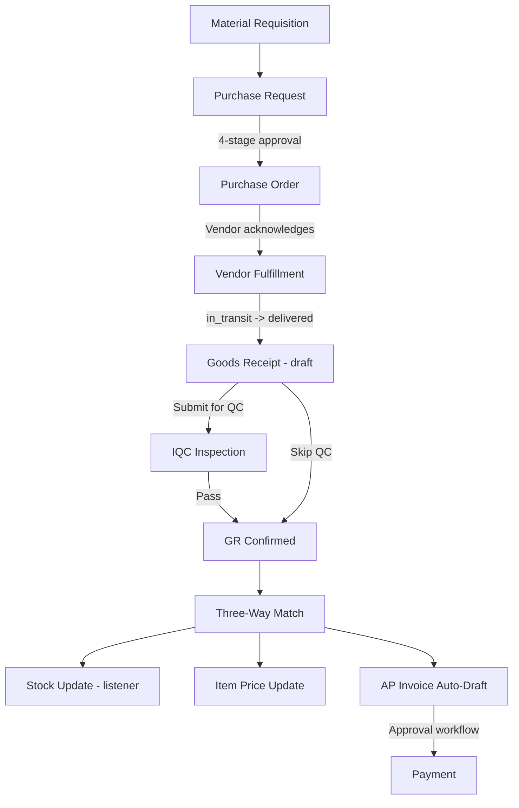

# Procurement Flow Audit: Gaps, Risks, and Missing Integration Points

## Flow Overview



---

## SECTION 1: CRITICAL BUGS

### BUG-1: InvoiceAutoDraftService references non-existent unit_price column

**Severity:** CRITICAL  
**File:** [`app/Domains/AP/Services/InvoiceAutoDraftService.php`](app/Domains/AP/Services/InvoiceAutoDraftService.php:80)

```php
$unitPrice = (float) $poItem->unit_price;  // DOES NOT EXIST -- returns null
```

The `purchase_order_items` table has `agreed_unit_cost`, not `unit_price`. This service always computes zero. The live invoice path uses [`VendorInvoiceService::createFromPo()`](app/Domains/AP/Services/VendorInvoiceService.php:516) which correctly reads `agreed_unit_cost`. Two competing services exist -- only one works.

**Fix:** Delete `InvoiceAutoDraftService` (dead code) or rename the column reference.

---

### BUG-2: standard_price column referenced in 5 places but does not exist

**Severity:** CRITICAL  
**Impact:** BOM costs, dashboard inventory valuation, and financial ratios all broken

The `item_masters` table only has `standard_price_centavos` (added by migration `2026_03_20_000005`). There is no `standard_price` column. These references return `null`:

| File | Line | Code | Impact |
|------|------|------|--------|
| [`CostingService.php`](app/Domains/Production/Services/CostingService.php:335) | 335 | `$item->itemMaster?->standard_price ?? 0` | Actual production material cost = 0 |
| [`CostingService.php`](app/Domains/Production/Services/CostingService.php:183) | 183 | `$item->standard_price_centavos ?? ($item->standard_price ?? 0) * 100` | Works if centavos is set; fallback broken |
| [`RoleBasedDashboardService.php`](app/Domains/Dashboard/Services/RoleBasedDashboardService.php:228) | 228 | `item_masters.standard_price` (raw SQL) | PG error: column does not exist |
| [`FinancialRatioService.php`](app/Domains/Accounting/Services/FinancialRatioService.php:189) | 189 | `item_masters.standard_price` (raw SQL) | PG error: column does not exist |
| [`LowStockReorderService.php`](app/Domains/Inventory/Services/LowStockReorderService.php:250) | 250 | `$lastPoItem?->unit_price` | Wrong column on PO item too |

**Fix:** Change all `standard_price` references to `standard_price_centavos` and adjust math accordingly.

---

### BUG-3: PO item `item_master_id` always null on auto-created POs

**Severity:** HIGH  
**File:** [`PurchaseOrderService.php`](app/Domains/Procurement/Services/PurchaseOrderService.php:87)

```php
'item_master_id' => null,  // ALWAYS null
```

The GR confirm resolves this via case-insensitive name matching, which creates duplicate `AUTO-*` items. Over time, the item master accumulates orphaned entries.

---

## SECTION 2: GOODS RECEIPT FLEXIBILITY GAPS

### Current GR Actions Available

| Action | Route | Backend | Frontend Button |
|--------|-------|---------|-----------------|
| Create draft | `POST /goods-receipts` | `GoodsReceiptService::store()` | CreateGoodsReceiptPage |
| View detail | `GET /goods-receipts/{ulid}` | controller show | GoodsReceiptDetailPage |
| Submit for QC | `POST /{ulid}/submit-for-qc` | `submitForQc()` | Not visible in frontend |
| Confirm | `POST /{ulid}/confirm` | `confirm()` | Confirm button on detail |
| Reject entire GR | `POST /{ulid}/reject` | `reject()` | Reject button on detail |
| Delete draft | `DELETE /{ulid}` | `destroy()` | Delete button on detail |

### What's MISSING for real-world receiving

#### GAP-GR-1: No per-item accept/reject -- it's all-or-nothing

**Current state:** GR items have a `condition` field (good/damaged/partial/rejected) and `remarks`, set at creation time. But after creation, there is NO way to change an item's condition. The only options are "confirm entire GR" or "reject entire GR".

**Real-world scenario:** A PO for 10 items is delivered. 8 items are good, 1 is damaged, 1 is the wrong specification. Today you must either:
- Confirm the entire GR (damaged item enters stock)
- Reject the entire GR (8 good items don't enter stock)

**What's needed:**
- `PATCH /goods-receipts/{ulid}/items/{itemId}` -- update condition, quantity, remarks per line
- Partial confirmation: confirm good items, hold/return damaged items
- Split GR: confirmed portion creates stock + AP invoice; rejected portion creates return-to-vendor note

---

#### GAP-GR-2: No edit capability on draft GR

**Current state:** Once a GR draft is created (by vendor delivery or manually), the only options are confirm, reject, or delete. There is no `update()` method or route.

**Real-world scenario:** Warehouse staff creates a GR but enters wrong quantities or conditions. They must delete the entire GR and re-create from scratch.

**What's needed:**
- `PUT /goods-receipts/{ulid}` -- update header fields (received_date, delivery_note_number, condition_notes)
- `PUT /goods-receipts/{ulid}/items/{itemId}` -- update line quantities, conditions, remarks

---

#### GAP-GR-3: No partial receipt handling

**Current state:** The GR can receive less than the PO quantity (the PO goes to `partially_received`). But there is no way to create a SECOND GR for the remaining items from the same PO.

**Wait -- this IS supported:** The `PurchaseOrder::canReceiveGoods()` returns true for `acknowledged|in_transit|delivered|partially_received`. So a second GR CAN be created. Good.

**However:** When the vendor's `markDelivered()` creates a GR via the fulfillment service, it creates a split PO for remaining quantities. This means the remaining items are on a NEW PO, not the original. The chain link to the original PR is preserved via `parent_po_id`, but this creates complexity.

---

#### GAP-GR-4: No return-to-vendor flow after GR confirmation

**Current state:** If goods pass GR confirmation but later fail internal quality checks or are found defective during production, there is NO way to:
1. Create a return-to-vendor (RTV) record
2. Reverse the stock entry
3. Create a debit note or credit note against the vendor

The `GoodsReceiptService::reject()` only works for `draft` or `pending_qc` status. Once confirmed, the GR is locked.

**What's needed:**
- `GoodsReturnService` -- creates return record, reverses stock via `StockService::issue()`, links to debit note
- `POST /goods-receipts/{ulid}/return` -- return specific items post-confirmation
- Updates to AP invoice to reflect returned quantities (partial credit note)

---

#### GAP-GR-5: No discrepancy report when received qty differs from PO qty

**Current state:** When the GR has fewer items than the PO, the three-way match simply sets the PO to `partially_received`. There's no formal discrepancy report or notification to the purchasing department.

**Real-world scenario:** Vendor ships 80 out of 100 units. The receiving warehouse confirms the GR. But purchasing is never notified about the 20 missing units. They might assume the delivery is complete.

**What's needed:**
- Auto-generate a discrepancy notification when `quantity_received < quantity_ordered` for any item
- Dashboard widget showing POs with outstanding/undelivered quantities
- Aging report for partially received POs

---

#### GAP-GR-6: Submit for QC button not shown in frontend

**Current state:** The route `POST /{ulid}/submit-for-qc` exists and the service works, but the `GoodsReceiptDetailPage.tsx` only shows Confirm and Reject buttons. There's no "Submit for QC" button visible.

**Evidence:** Searching the GR detail page shows `useConfirmGoodsReceipt`, `useDeleteGoodsReceipt`, `useRejectGoodsReceipt` hooks -- no submit-for-QC hook or button.

**Impact:** Items that require incoming quality control (IQC) can't be routed through the QC workflow from the GR page. Users are forced to directly confirm, bypassing the IQC gate (unless `requires_iqc` is set on the item master, which hard-blocks confirmation).

---

#### GAP-GR-7: No condition-based stock segregation

**Current state:** When a GR is confirmed with items in `damaged` or `partial` condition, ALL items go to the same warehouse location. There's no quarantine zone or separate handling.

**What's needed:**
- Items with `condition = 'damaged'` should go to a quarantine location
- Items with `condition = 'rejected'` should NOT enter stock at all (currently the `InvoiceAutoDraftService` skips rejected items, but stock update doesn't)
- The `UpdateStockOnThreeWayMatch` listener receives ALL GR items regardless of condition

---

## SECTION 3: PRICE FLOW GAPS

### GAP-PRICE-1: No auto BOM cost rollup when item prices change

When GR confirms and [`updateItemPricesFromPO()`](app/Domains/Procurement/Services/GoodsReceiptService.php:369) updates `standard_price_centavos`, no event fires to re-roll BOM costs for BOMs containing that item.

**Impact:** BOMs show stale costs until manually re-rolled via `BomService::rollupCost()`.

### GAP-PRICE-2: No price variance alert

When item prices change significantly (e.g., raw material cost doubles), no notification is sent to management. Large cost changes go undetected.

### GAP-PRICE-3: MRQ -> PR -> PO chain loses item_master_id

The item identity chain breaks at the PR step:
```
BOM component (item_id: 42) -> MRQ (item_id: 42) -> PR (text description only) -> PO (item_master_id: null) -> GR (auto-creates new item 99)
```
Stock for the wrong item. Production can't find materials.

---

## SECTION 4: AP INVOICE GAPS

### GAP-AP-1: Invoice auto-draft doesn't handle rejected items correctly in VendorInvoiceService

The `VendorInvoiceService::createFromPo()` at line 547-549 computes net amount from ALL GR items:
```php
$netAmount = $gr->items->reduce(
    fn (float $carry, GoodsReceiptItem $item) => $carry + ((float) $item->quantity_received * (float) ($item->poItem->agreed_unit_cost ?? 0)),
    0.0,
);
```
This includes items with `condition = 'damaged'` or `condition = 'rejected'`. Only the dead `InvoiceAutoDraftService` skips rejected items.

**Impact:** Vendor invoiced for damaged/rejected goods.

### GAP-AP-2: No credit note automation for partial rejections

When items are rejected at GR level, there's no automated vendor credit note or debit memo.

---

## SECTION 5: STOCK RESERVATION GAPS

### GAP-STOCK-1: Stock reservations not consumed on MRQ fulfillment

`StockReservationService` can reserve stock for production orders, but `MaterialRequisitionService::fulfill()` doesn't check or consume reservations. Stock could be double-allocated.

### GAP-STOCK-2: No quarantine location for IQC items

When `qc.allow_provisional_receipt` is true, items enter stock immediately with a 24hr inspection deadline. But there's no quarantine location or hold status -- the stock is available for production use before QC completes.

---

## PRIORITY ACTION ITEMS

### Immediate Fixes (Bugs)

| # | Issue | Files | Effort |
|---|-------|-------|--------|
| 1 | Fix `standard_price` -> `standard_price_centavos` in 5 files | CostingService, DashboardService, FinancialRatioService, LowStockReorderService | Low |
| 2 | Remove dead `InvoiceAutoDraftService` | 1 file | Low |
| 3 | Fix VendorInvoiceService to exclude rejected GR items | 1 file | Low |
| 4 | Propagate `item_master_id` through MRQ -> PR -> PO chain | PurchaseRequestService, PurchaseOrderService | Medium |

### GR Flexibility Enhancements (New Features)

| # | Feature | Effort |
|---|---------|--------|
| 5 | Add GR item update endpoint (edit qty, condition, remarks) | Medium |
| 6 | Add GR header update endpoint | Low |
| 7 | Add Submit for QC button to frontend GR detail page | Low |
| 8 | Partial confirmation: accept good items, hold damaged/rejected | High |
| 9 | Return-to-vendor flow (post-confirmation) | High |
| 10 | Condition-based stock segregation (quarantine for damaged) | Medium |
| 11 | Discrepancy notification on partial receipt | Medium |

### Integration Improvements

| # | Feature | Effort |
|---|---------|--------|
| 12 | Auto BOM cost rollup on item price change | Medium |
| 13 | Price variance alert notification | Low |
| 14 | Stock reservation consumption on MRQ fulfillment | Medium |
