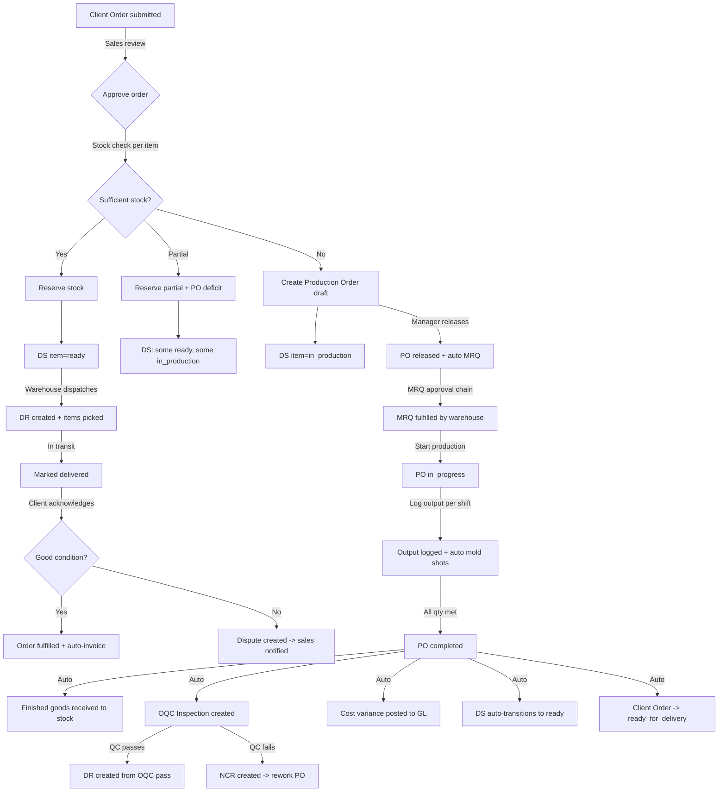

# Production Module Deep Audit - Production Grade ERP Gaps

## What Works Well (Solid Foundation)

The production module has a strong foundation with several production-grade patterns already in place:

1. **State machine** with 7 states and valid transitions including rework path
2. **QC gates** blocking completion when inspections are open/failed
3. **MRQ integration** blocking production start until materials fulfilled
4. **BOM snapshot** frozen at PO creation for cost variance analysis
5. **Auto-OQC** creating outgoing quality inspections on completion
6. **Auto-cost posting** to GL on completion
7. **Auto-DR creation** deferred until OQC passes for DS-linked orders
8. **Rework flow** with NCR linkage
9. **Stock receive** on completion with net qty calculation
10. **Cancel/void** with stock reversal

## Remaining Gaps for Production-Grade ERP

### GAP-P1: No Partial Delivery Support [HIGH]

**Problem:** The dispatch flow in [`DeliveryScheduleService::dispatchSchedule()`](app/Domains/Production/Services/DeliveryScheduleService.php:346) requires the DS to be `ready` or `partially_ready`, but there is no mechanism to:
- Split a delivery schedule into multiple shipments
- Ship available items while waiting for others
- Track which DSI items have been shipped vs pending

**Real ERP behavior:** Manufacturing ERPs allow partial shipments. If 3 of 5 items are ready, ship those 3 and create a second shipment for the remaining 2.

**Fix:** Add `dispatchPartial()` method that ships only ready items, creates a partial DR, and keeps the DS in `partially_dispatched` status until all items are shipped.

### GAP-P2: No Production Scheduling/Capacity Planning [MEDIUM]

**Problem:** Production orders are created with target start/end dates but there is no:
- Machine/work center capacity check
- Shift-based scheduling
- Gantt-style scheduling view
- Conflict detection when multiple POs compete for same machine

The [`WorkCenterService`](app/Domains/Production/Services/WorkCenterService.php) and [`RoutingService`](app/Domains/Production/Services/RoutingService.php) exist but are not integrated into PO creation or release.

**Real ERP behavior:** SAP/Oracle check work center capacity before releasing POs and flag overloaded periods.

**Fix for thesis:** Add a simple capacity utilization indicator on the PO list page showing how many POs overlap in the same date range, and a warning on PO creation when the target period is already heavily loaded.

### GAP-P3: No WIP (Work-in-Progress) Tracking [MEDIUM]

**Problem:** Once a PO moves to `in_progress`, there is no tracking of:
- Which BOM operations/routing steps are completed
- Percentage completion based on routing steps
- Time spent per operation
- Machine utilization per operation

Output logging only tracks final `qty_produced` and `qty_rejected` without operation-level granularity.

**Real ERP behavior:** Each routing step has start/end times, operator assignment, and completion status.

**Fix for thesis:** The output log already captures shift and operator. Add a `routing_step_id` field to `ProductionOutputLog` to track which operation produced the output.

### GAP-P4: No Material Shortage Alert/Dashboard [HIGH]

**Problem:** When a PO is released, an MRQ is auto-created from the BOM. But if the MRQ cannot be fulfilled (insufficient raw materials), there is no:
- Dashboard showing POs blocked by material shortages
- Alert to procurement to create Purchase Requests
- Auto-link from unfulfilled MRQ to a Purchase Request

The [`MrpService`](app/Domains/Production/Services/MrpService.php) exists but it is not integrated into the approval or dashboard flow.

**Real ERP behavior:** MRP runs generate planned purchase orders for material shortages automatically.

**Fix for thesis:** Add a "Material Shortages" widget to the Production Manager dashboard showing POs with unfulfilled MRQs, with a one-click "Create PR from MRQ" button (the `useConvertMrqToPr` hook already exists on the frontend).

### GAP-P5: No Scrap/Yield Tracking Beyond qty_rejected [LOW]

**Problem:** Production output logs track `qty_produced` and `qty_rejected`, but there is no:
- Scrap reason categorization (material defect, machine error, operator error)
- Yield percentage tracking over time
- Rejection trend analysis

**Fix for thesis:** Add a `rejection_reason` field to `ProductionOutputLog` with predefined categories.

### GAP-P6: Client Order Status Not Updated When DS Goes to Ready via Listener [HIGH]

**Problem:** The newly created [`UpdateDeliveryScheduleOnProductionComplete`](app/Listeners/Production/UpdateDeliveryScheduleOnProductionComplete.php) listener transitions DS from `in_production` to `ready`, BUT it does not update the linked Client Order from `in_production` to `ready_for_delivery`.

The existing [`UpdateClientOrderOnProductionComplete`](app/Listeners/CRM/UpdateClientOrderOnProductionComplete.php) listener does check for this, but it runs as a separate listener that may not account for the DS transition happening in another listener. Race condition possible between the two listeners.

**Fix:** In `UpdateDeliveryScheduleOnProductionComplete`, after transitioning DS to `ready`, also update the linked Client Order to `ready_for_delivery` if all DSs for that order are ready.

### GAP-P7: Delivery Receipt Items Not Created from DS Items [MEDIUM]

**Problem:** In [`dispatchSchedule()`](app/Domains/Production/Services/DeliveryScheduleService.php:376), a `DeliveryReceipt` is created but without line items. The DR is a header-only record. Real ERPs create DR line items matching the DS items so warehouse staff can pick/pack each item.

**Fix:** After creating the DR, create `DeliveryReceiptItem` records from the DS items with expected quantities.

### GAP-P8: No Auto-Invoice on Delivery Acknowledgment [MEDIUM]

**Problem:** When client acknowledges receipt in [`acknowledgeReceipt()`](app/Domains/Production/Services/DeliveryScheduleService.php:445), the order transitions to `fulfilled` but no Customer Invoice is auto-created. The accounting team must manually create invoices.

**Real ERP behavior:** Delivery acknowledgment triggers auto-invoice generation from the sales order/client order.

**Fix:** After successful acknowledgment (no disputes), auto-create a draft Customer Invoice from the Client Order items and pricing.

### GAP-P9: OrderAutomationService Duplicates checkAndCreateDraftProductionOrders [LOW]

**Problem:** As identified in the previous audit, [`OrderAutomationService::createFromClientOrder()`](app/Domains/Production/Services/OrderAutomationService.php:38) does NOT check stock before creating POs, while [`ClientOrderService::checkAndCreateDraftProductionOrders()`](app/Domains/CRM/Services/ClientOrderService.php:1197) does. Both can potentially run for the same order.

**Fix:** Remove `OrderAutomationService` or refactor it to delegate to `checkAndCreateDraftProductionOrders`.

### GAP-P10: No Production Order Priority System [LOW]

**Problem:** All POs are treated equally. There is no:
- Priority field (urgent, high, normal, low)
- Due date-based priority sorting
- Automatic priority escalation as delivery date approaches

**Fix for thesis:** Add a `priority` field to `ProductionOrder` model and sort the PO list by priority + target_end_date.

---

## Implementation Priority for Thesis Demo

### Must-Fix (Demo-Breaking)

- [ ] **GAP-P6**: Fix Client Order status sync when DS transitions to ready via listener
- [ ] **GAP-P7**: Create DR items from DS items on dispatch
- [ ] **GAP-P1**: Add partial delivery support (at minimum, track which items are shipped)

### Should-Fix (Strengthens Demo)

- [ ] **GAP-P4**: Material shortage dashboard widget
- [ ] **GAP-P8**: Auto-invoice on delivery acknowledgment
- [ ] **GAP-P9**: Remove OrderAutomationService duplicate path

### Nice-to-Have (Impresses Panel)

- [ ] **GAP-P2**: Simple capacity indicator on PO creation
- [ ] **GAP-P3**: Routing step tracking in output logs
- [ ] **GAP-P5**: Scrap reason categorization
- [ ] **GAP-P10**: Priority field on production orders

---

## Complete Production Flow (After All Fixes)

