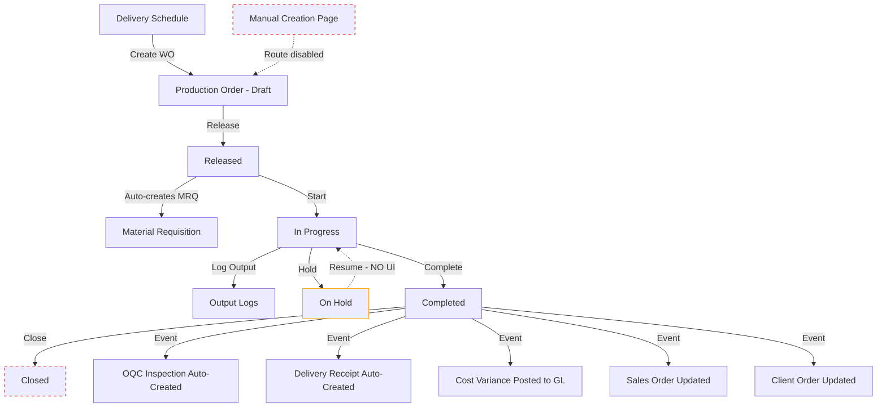

# Production Module Full Chain Audit - Broken Processes, Gaps, and Risks

## Executive Summary

Full audit of the Production/PPC module covering the chain from BOM creation through Production Orders, Output Logging, QC Integration, and Delivery. The module has a solid backend architecture but significant frontend gaps that leave users stuck or unable to complete workflows. **17 critical findings** identified across missing UI actions, broken state transitions, unreachable pages, and integration blind spots.

---

## Module Architecture Overview



---

## CRITICAL FINDINGS - Broken Processes

### GAP-01: On Hold / Resume - Backend exists, NO routes, NO frontend UI
- **Severity:** CRITICAL
- **Impact:** Users cannot put a production order on hold or resume it
- **Backend:** [`ProductionOrderService::hold()`](app/Domains/Production/Services/ProductionOrderService.php:707) and [`ProductionOrderService::resume()`](app/Domains/Production/Services/ProductionOrderService.php:728) are fully implemented with `held_from_state` tracking
- **State Machine:** [`ProductionOrderStateMachine`](app/Domains/Production/StateMachines/ProductionOrderStateMachine.php:34) defines transitions: `released -> on_hold`, `in_progress -> on_hold`, `on_hold -> released/in_progress/cancelled`
- **Routes:** NO `hold` or `resume` routes in [`production.php`](routes/api/v1/production.php:66)
- **Frontend:** NO hold/resume buttons in [`ProductionOrderDetailPage.tsx`](frontend/src/pages/production/ProductionOrderDetailPage.tsx:581), NO hooks in [`useProduction.ts`](frontend/src/hooks/useProduction.ts)
- **Fix:** Add PATCH routes `orders/{id}/hold` and `orders/{id}/resume`, add controller methods, add frontend hooks and action buttons

### GAP-02: Close Order - Backend exists, NO frontend button
- **Severity:** CRITICAL
- **Impact:** Completed orders can never reach terminal `closed` state; they pile up in `completed` forever
- **Backend:** [`ProductionOrderController::close()`](app/Http/Controllers/Production/ProductionOrderController.php:56) and route [`PATCH orders/{id}/close`](routes/api/v1/production.php:70) exist
- **Frontend:** NO `useCloseOrder` hook in [`useProduction.ts`](frontend/src/hooks/useProduction.ts), NO close button in [`ProductionOrderDetailPage.tsx`](frontend/src/pages/production/ProductionOrderDetailPage.tsx:581). The `statusBadge` map does not include `closed` or `on_hold` keys
- **Fix:** Add `useCloseOrder` hook, add Close button for `completed` status, add `closed` and `on_hold` to `statusBadge` maps in both list and detail pages

### GAP-03: Manual Production Order Creation Route Disabled
- **Severity:** HIGH
- **Impact:** The `CreateProductionOrderPage` exists but is unreachable - the route is commented out
- **Evidence:** Router line 566: `// Note: No /production/orders/new route` in [`index.tsx`](frontend/src/router/index.tsx:566). The import is prefixed with underscore: `_CreateProductionOrderPage`
- **Risk:** Users can only create WOs from delivery schedule detail page modal. No way to create ad-hoc WOs for rework, samples, R&D, or internal use
- **Fix:** Register route `/production/orders/new` pointing to `CreateProductionOrderPage`, add New WO button to `ProductionOrderListPage`

### GAP-04: Status Badge Maps Incomplete - Frontend crashes or shows wrong styles
- **Severity:** HIGH  
- **Impact:** `on_hold` and `closed` statuses have no badge styling, will render as unstyled text
- **Files affected:**
  - [`ProductionOrderListPage.tsx`](frontend/src/pages/production/ProductionOrderListPage.tsx:17) - missing `on_hold`, `closed`
  - [`ProductionOrderDetailPage.tsx`](frontend/src/pages/production/ProductionOrderDetailPage.tsx:32) - missing `on_hold`, `closed`
- **Fix:** Add `on_hold` and `closed` entries to all `statusBadge` Record types

---

## HIGH-PRIORITY FINDINGS - Missing Frontend Features

### GAP-05: No Cancel Button for In-Progress Orders
- **Severity:** HIGH
- **Impact:** Cancel button only shows for `draft` and `released` statuses. State machine allows `in_progress -> cancelled` but frontend blocks it
- **Location:** [`ProductionOrderDetailPage.tsx:634`](frontend/src/pages/production/ProductionOrderDetailPage.tsx:634) - condition is `['draft', 'released'].includes(order.status)`
- **Fix:** Add `in_progress` to the cancel button condition, with appropriate confirmation dialog warning about stock reversal

### GAP-06: No QC Inspection Creation Link from Production Order Detail
- **Severity:** HIGH
- **Impact:** Users see QC inspections in the detail page table but cannot create one from context. Must navigate to QC module separately and manually enter the production order reference
- **Evidence:** [`CreateInspectionPage.tsx`](frontend/src/pages/qc/CreateInspectionPage.tsx:38) has no `production_order_id` field
- **Fix:** Add "Create QC Inspection" button on WO detail page that navigates to `/qc/inspections/new?production_order_id={id}&item_master_id={product_item_id}&stage=oqc`. Update CreateInspectionPage to read query params

### GAP-07: No Work Center or Routing Management Pages
- **Severity:** MEDIUM
- **Impact:** Backend has full CRUD routes for work centers and routings in [`production.php`](routes/api/v1/production.php:94), but NO frontend pages exist. Users cannot manage work centers or routings through the UI
- **Backend routes available:** GET/POST/PUT/DELETE for work-centers, GET/POST/PUT/DELETE for routings
- **Sidebar:** Not listed in [`AppLayout.tsx`](frontend/src/components/layout/AppLayout.tsx:214) navigation
- **Fix:** Create `WorkCenterListPage`, `RoutingListPage` pages and add to router + sidebar navigation

### GAP-08: No MRP Dashboard Page
- **Severity:** MEDIUM
- **Impact:** Backend has MRP routes ([`production.php:109`](routes/api/v1/production.php:109)) - summary, explode, time-phased - but no frontend page
- **Fix:** Create MRP dashboard page with material requirements summary, explosion view, and time-phased planning grid

### GAP-09: Production Cost Analysis Page Not in Sidebar
- **Severity:** LOW
- **Impact:** [`ProductionCostPage`](frontend/src/pages/production/ProductionCostPage.tsx) exists and has a route at `/production/cost-analysis` but is NOT listed in sidebar navigation
- **Fix:** Add to sidebar nav items under Production section

---

## INTEGRATION CHAIN GAPS

### GAP-10: QC Inspection -> Production Order Linkage is One-Way
- **Severity:** HIGH
- **Impact:** When OQC auto-creates an inspection on production complete via [`CreateOqcInspectionOnProductionComplete`](app/Listeners/QC/CreateOqcInspectionOnProductionComplete.php), it works. But if QC FAILS, there is no automatic hold/rework trigger back to the production order
- **Expected:** Failed OQC should auto-hold or notify production
- **Current:** The QC-to-production feedback loop is manual only
- **Fix:** Add listener on inspection status change that auto-holds linked production order when QC fails

### GAP-11: Delivery Schedule Status Not Auto-Updated
- **Severity:** MEDIUM
- **Impact:** When a production order is created from a delivery schedule, the DS status should change from `open` to `in_production`. No evidence this happens automatically
- **Evidence:** [`DeliveryScheduleService`](app/Domains/Production/Services/DeliveryScheduleService.php) and the WO creation in [`ProductionOrderService::store()`](app/Domains/Production/Services/ProductionOrderService.php:171) do not update DS status
- **Fix:** After WO creation linked to DS, auto-update DS status to `in_production`. After WO completion, auto-update to `ready`

### GAP-12: Start Production Button Behavior - Race Condition with ConfirmDialog
- **Severity:** MEDIUM
- **Impact:** The Start Production button at [`line 596`](frontend/src/pages/production/ProductionOrderDetailPage.tsx:596) wraps in a ConfirmDialog but also calls `setConfirmAction('start')` AND `executeAction()` inline in `onConfirm`. This creates a race condition because `executeAction` reads `confirmAction` state which may not be set yet in the same render cycle
- **Evidence:** 
  ```tsx
  onConfirm={async () => {
    setConfirmAction('start')  // State update is async
    await executeAction()      // Reads confirmAction which is still null
  }}
  ```
- **Fix:** Use `handleAction('start')` instead, or pass action directly to execute function

### GAP-13: Delivery Schedule Archive Route 404
- **Severity:** MEDIUM
- **Impact:** [`DeliveryScheduleListPage.tsx:49`](frontend/src/pages/production/DeliveryScheduleListPage.tsx:49) calls `/production/delivery-schedules-archived` but this route does NOT exist in [`production.php`](routes/api/v1/production.php:33)
- **Fix:** Add archived route for delivery schedules, or remove the archive toggle from the list page

---

## FLEXIBILITY & UX GAPS

### GAP-14: Production Order Edit Only in Draft - No Partial Edit for Released
- **Severity:** MEDIUM
- **Impact:** [`ProductionOrderService::update()`](app/Domains/Production/Services/ProductionOrderService.php:251) throws if status is not `draft`. Released orders cannot have notes or target dates adjusted even though no material impact
- **Fix:** Allow editing `notes` and `target_end_date` for `released` and `in_progress` statuses. Keep BOM/qty/product locked

### GAP-15: No Edit Button on Production Order Detail Page
- **Severity:** HIGH
- **Impact:** Even for draft orders that CAN be edited, there is no Edit button on the detail page. The update route exists at [`PUT orders/{id}`](routes/api/v1/production.php:64) and the controller handles it, but frontend has no edit UI
- **Fix:** Add inline edit mode or Edit button that enables field editing for draft orders

### GAP-16: Combined Delivery Schedules - No Create Page
- **Severity:** MEDIUM
- **Impact:** Combined Delivery Schedules have list and detail pages, dispatch/deliver actions, but no way to CREATE a new combined schedule from the frontend. They may be auto-created from client orders, but manual grouping is not possible
- **Fix:** Create a combined schedule creation page or modal that allows selecting multiple delivery schedules to group

### GAP-17: BOM Delete/Archive Not Accessible from Detail Page
- **Severity:** LOW
- **Impact:** BOM list page has archive view with restore/delete, but the BOM detail page ([`BomDetailPage.tsx`](frontend/src/pages/production/BomDetailPage.tsx)) only has an Archive button. No soft-delete action visible for active BOMs from the detail view
- **Fix:** Add delete/archive button to BOM detail page for users with `production.bom.manage` permission

---

## Implementation Priority

### Phase 1 - Fix Broken Flows (CRITICAL)
- [ ] GAP-01: Add hold/resume API routes + controller methods + frontend hooks + buttons
- [ ] GAP-02: Add close order frontend hook + button for completed orders
- [ ] GAP-04: Add `on_hold` and `closed` to all statusBadge maps
- [ ] GAP-05: Allow cancel from in_progress status in frontend
- [ ] GAP-12: Fix start production button race condition with ConfirmDialog
- [ ] GAP-15: Add edit capability for draft production orders in detail page

### Phase 2 - Complete Missing Features (HIGH)
- [ ] GAP-03: Enable manual production order creation route and add button to list page
- [ ] GAP-06: Add Create QC Inspection button on WO detail page with pre-filled params
- [ ] GAP-11: Auto-update delivery schedule status on WO create and WO complete
- [ ] GAP-13: Fix delivery schedule archive route 404
- [ ] GAP-14: Allow partial edit of notes/dates for released/in_progress orders

### Phase 3 - Add Missing Pages (MEDIUM)
- [ ] GAP-07: Create Work Center and Routing management pages
- [ ] GAP-08: Create MRP Dashboard page
- [ ] GAP-09: Add Production Cost Analysis to sidebar navigation
- [ ] GAP-16: Create combined delivery schedule creation UI

### Phase 4 - Polish (LOW)
- [ ] GAP-10: Add QC failure -> production hold auto-feedback loop
- [ ] GAP-17: Add delete/archive to BOM detail page

---

## Files Requiring Changes

| File | Changes Needed |
|------|---------------|
| [`routes/api/v1/production.php`](routes/api/v1/production.php) | Add hold/resume routes |
| [`ProductionOrderController.php`](app/Http/Controllers/Production/ProductionOrderController.php) | Add hold/resume methods |
| [`useProduction.ts`](frontend/src/hooks/useProduction.ts) | Add useCloseOrder, useHoldOrder, useResumeOrder hooks |
| [`ProductionOrderDetailPage.tsx`](frontend/src/pages/production/ProductionOrderDetailPage.tsx) | Add hold/resume/close/edit buttons, fix start race condition, add QC create link |
| [`ProductionOrderListPage.tsx`](frontend/src/pages/production/ProductionOrderListPage.tsx) | Add New WO button, fix statusBadge map |
| [`index.tsx` router](frontend/src/router/index.tsx) | Enable /production/orders/new route |
| [`AppLayout.tsx`](frontend/src/components/layout/AppLayout.tsx) | Add cost analysis, work centers, routings to sidebar |
| [`CreateInspectionPage.tsx`](frontend/src/pages/qc/CreateInspectionPage.tsx) | Accept production_order_id query param |
| [`DeliveryScheduleListPage.tsx`](frontend/src/pages/production/DeliveryScheduleListPage.tsx) | Fix archive route |
| [`types/production.ts`](frontend/src/types/production.ts) | Already correct - has all statuses |
| NEW: `WorkCenterListPage.tsx` | Work center CRUD page |
| NEW: `RoutingListPage.tsx` | Routing management page |
| NEW: `MrpDashboardPage.tsx` | MRP summary/explosion/time-phased views |

