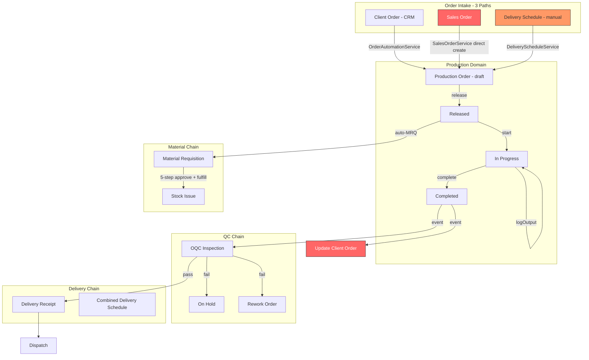
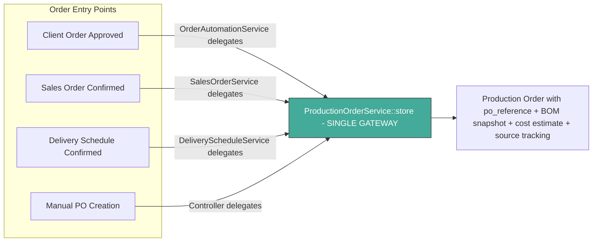
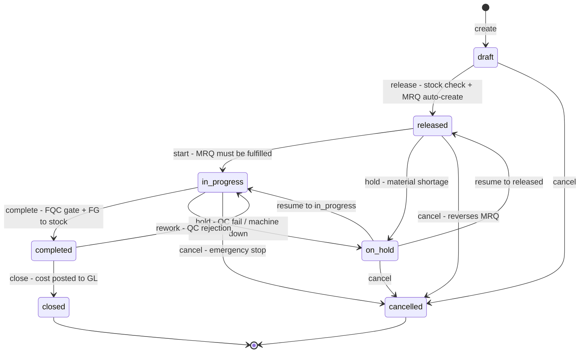
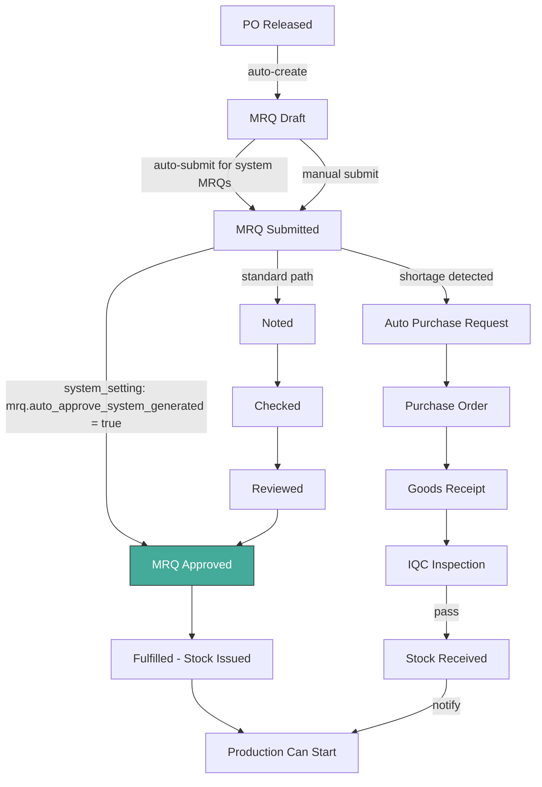
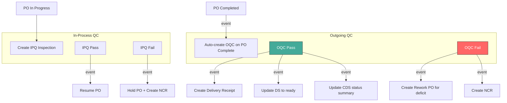
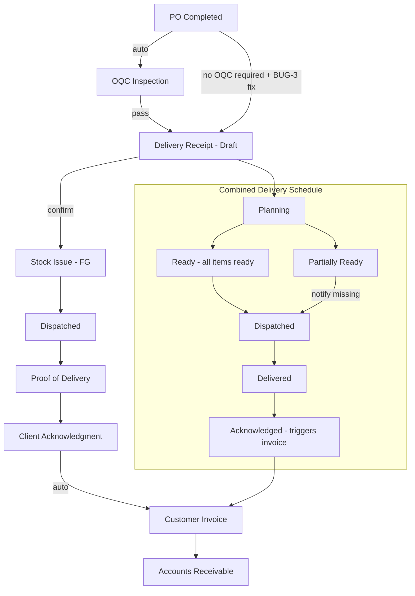
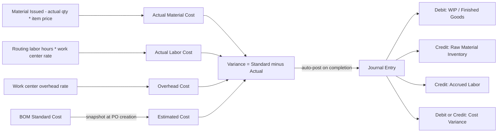

# Production Module: Full Chain Audit, Standard Process Design, and Implementation Plan

---

## Part A: Audit Findings -- What Is Broken

### A1. Complete Chain Map - Current State



Red nodes = broken chains. Orange = partially broken.

---

### A2. Critical Bugs - Broken at Runtime

#### BUG-1: Client Order status never updates after production completes

**File:** [`UpdateClientOrderOnProductionComplete`](app/Listeners/CRM/UpdateClientOrderOnProductionComplete.php:25)  
**Line 25:** `$order = $event->productionOrder;`  
**Event class:** [`ProductionOrderCompleted`](app/Events/Production/ProductionOrderCompleted.php:23) defines property as `$event->order`

The listener accesses a non-existent property. Result: `$order` is always null, the method returns immediately, and Client Orders are permanently stuck in `approved` or `in_production` status. The entire `approved -> in_production -> ready_for_delivery -> delivered -> fulfilled` chain is dead.

**Fix:** Change `$event->productionOrder` to `$event->order`.

---

#### BUG-2: Delivery Schedule auto-PO creation throws Class not found

**File:** [`DeliveryScheduleService::getAvailableStock()`](app/Domains/Production/Services/DeliveryScheduleService.php:173)  
Uses `StockBalance::where(...)` but `App\Domains\Inventory\Models\StockBalance` is not imported. The file only imports `StockService`, not the model.

**Fix:** Add `use App\Domains\Inventory\Models\StockBalance;` to the imports.

---

#### BUG-3: Delivery Receipt listener is dead code - never executes

**File:** [`CreateDeliveryReceiptOnProductionComplete`](app/Listeners/Delivery/CreateDeliveryReceiptOnProductionComplete.php:41)

```php
if ($order->delivery_schedule_id === null) { return; }     // Line 41-43: exit if NO DS
// ...
if ($order->delivery_schedule_id !== null) { return; }     // Line 50-52: exit if HAS DS
```

Both conditions together guarantee the method always returns without doing anything. The intent was: orders WITH a DS defer to the OQC path; orders WITHOUT a DS get a DR directly. The second guard kills the second path.

**Fix:** Remove lines 50-52.

---

### A3. Broken Chain Links

| ID | Problem | Where | Impact |
|----|---------|-------|--------|
| CHAIN-1 | Sales bypasses `ProductionOrderService::store()` -- direct `ProductionOrder::create()` | [`SalesOrderService:298`](app/Domains/Sales/Services/SalesOrderService.php:298) | No po_reference, no BOM snapshot, no cost estimate, no end-date calc |
| CHAIN-2 | Sales has no back-link to Production | `production_orders` table | Sales Order stuck in `in_production` forever -- no listener exists |
| CHAIN-3 | OrderAutomation bypasses `ProductionOrderService::store()` | [`OrderAutomationService:110`](app/Domains/Production/Services/OrderAutomationService.php:110) | Client Order POs lack BOM snapshot and cost estimates |
| CHAIN-4 | Missing `combinedDeliverySchedule()` relationship | [`DeliverySchedule`](app/Domains/Production/Models/DeliverySchedule.php:1) | CDS status never updates when items become ready via OQC |
| CHAIN-5 | Wrong relationship name in reports | [`ProductionReportService:28`](app/Domains/Production/Services/ProductionReportService.php:28) | `product` should be `productItem` -- null product names in cost report |
| CHAIN-6 | FG stock not reserved after OQC creation | [`ProductionOrderService::complete()`](app/Domains/Production/Services/ProductionOrderService.php:506) | FG stock could be consumed by other orders before DR confirms |
| CHAIN-7 | DS status not updated without OQC | Dead listener BUG-3 | Delivery Schedules stuck in `open` when no OQC is needed |

---

### A4. Missing Integrations

| ID | What is Missing | Impact |
|----|-----------------|--------|
| MISSING-1 | MRP Service is a stub returning zeros | [`MrpService`](app/Domains/Production/Services/MrpService.php:1) -- no material planning |
| MISSING-2 | No Routing/WorkCenter management API | Models exist, no CRUD -- users cannot manage shop floor config |
| MISSING-3 | No auto CDS creation from Client Order | CDS must be created manually after Client Order approval |
| MISSING-4 | No material arrival notification | Production planners must manually check stock after GR |
| MISSING-5 | No production order edit for draft orders | Cannot change qty, dates, or BOM on draft PO |
| MISSING-6 | No capacity planning | No validation of PO dates against work center capacity |

---

### A5. Flexibility and Risk Gaps

| ID | Gap | Risk |
|----|-----|------|
| FLEX-1 | Frontend type missing `on_hold` and `closed` statuses | [`production.ts:51`](frontend/src/types/production.ts:51) -- UI cannot display/handle these states |
| FLEX-2 | MRQ 5-step approval too rigid for auto-MRQs | Production blocked waiting for 5 manual approvals on system-generated MRQs |
| FLEX-3 | Single warehouse assumption everywhere | Multiple services use `WarehouseLocation::where('is_active', true)->first()` |
| FLEX-4 | No partial production completion | Cannot ship partial output while continuing production |
| FLEX-5 | `void()` uses `cancelled` instead of distinct state | Loses audit distinction between void and cancel |
| FLEX-6 | No scrap categorization | Only `qty_rejected` tracked, no root cause categorization |
| FLEX-7 | Cost posting JE may be unbalanced | [`ProductionCostPostingService`](app/Domains/Production/Services/ProductionCostPostingService.php:99) -- labor credit logic |
| FLEX-8 | Rework deficit ignores multiple inspections | [`CreateReworkOrderOnOqcFail:44`](app/Listeners/Production/CreateReworkOrderOnOqcFail.php:44) |
| FLEX-9 | System user email dependency fragile | Silent automation failure if user missing |
| FLEX-10 | No stock reservation during MRQ lifecycle | Stock can be consumed between PO release and MRQ fulfillment |

---

## Part B: Standard Process Design -- The Target State

### B1. Three Order Entry Paths - Unified Into One Production Flow

The current system has three disconnected entry points. The standard design unifies them through a single `ProductionOrderService::store()` gateway:



**Key principle:** Every production order, regardless of origin, goes through `ProductionOrderService::store()` to guarantee consistent data. The `store()` method accepts optional `source_type` and `source_id` fields to trace origin.

---

### B2. Production Order Lifecycle - Enhanced State Machine



**Changes from current:**
- Add explicit `closed` state transition with route endpoint
- `void()` gets its own `voided` terminal state
- `on_hold` tracks `held_from_state` so resume returns to the correct state

---

### B3. Material Chain - Flexible MRQ Approval



**Flexibility features:**
- System-generated MRQs auto-submit and optionally auto-approve via `system_setting`
- Manual MRQs follow full 5-step approval
- Stock shortage during MRQ fulfillment triggers auto-PR creation
- Material arrival triggers notification to production planners

---

### B4. QC Integration - Bidirectional



---

### B5. Delivery Chain - From Production to Customer



---

### B6. Cost Flow - Standard to Actual to GL



---

## Part C: Implementation Plan -- Phased Approach

### Phase 1: Critical Bug Fixes - Unblock the Chain

These are required before any other work -- they are runtime failures.

| # | Task | File | What to Do |
|---|------|------|------------|
| 1 | Fix event property name | [`UpdateClientOrderOnProductionComplete.php:25`](app/Listeners/CRM/UpdateClientOrderOnProductionComplete.php:25) | Change `$event->productionOrder` to `$event->order` |
| 2 | Add missing import | [`DeliveryScheduleService.php`](app/Domains/Production/Services/DeliveryScheduleService.php:7) | Add `use App\Domains\Inventory\Models\StockBalance;` |
| 3 | Fix dead listener | [`CreateDeliveryReceiptOnProductionComplete.php:50-52`](app/Listeners/Delivery/CreateDeliveryReceiptOnProductionComplete.php:50) | Remove the redundant `if delivery_schedule_id !== null return` guard |
| 4 | Add missing relationship | [`DeliverySchedule.php`](app/Domains/Production/Models/DeliverySchedule.php:1) | Add `combinedDeliverySchedule(): BelongsTo` relationship |
| 5 | Fix wrong relationship | [`ProductionReportService.php:28`](app/Domains/Production/Services/ProductionReportService.php:28) | Change `product` to `productItem` |
| 6 | Fix frontend types | [`production.ts:51`](frontend/src/types/production.ts:51) | Add `on_hold` and `closed` to `ProductionOrderStatus` union type |

---

### Phase 2: Unify Production Order Creation - Single Gateway

| # | Task | Details |
|---|------|---------|
| 7 | Add `source_type` and `source_id` to `production_orders` | Migration: add nullable `source_type varchar` and `source_id bigint` columns. Values: `client_order`, `sales_order`, `delivery_schedule`, `manual`, `rework` |
| 8 | Add `sales_order_id` nullable FK | Migration: add `sales_order_id` to `production_orders` referencing `sales_orders.id` |
| 9 | Enhance `ProductionOrderService::store()` | Accept optional `source_type`, `source_id`, `sales_order_id`, `client_order_id` parameters |
| 10 | Refactor `OrderAutomationService::createFromClientOrder()` | Delegate each line item to `ProductionOrderService::store()` instead of direct `ProductionOrder::create()` |
| 11 | Refactor `SalesOrderService::triggerFulfillment()` | Delegate to `ProductionOrderService::store()` with `source_type=sales_order` |
| 12 | Refactor `CreateReworkOrderOnOqcFail` | Delegate to `ProductionOrderService::store()` with `source_type=rework` |
| 13 | Refactor `DeliveryScheduleService::createProductionOrderFromDeliverySchedule()` | Delegate to `ProductionOrderService::store()` with `source_type=delivery_schedule` |
| 14 | Add `UpdateSalesOrderOnProductionComplete` listener | New listener on `ProductionOrderCompleted` that checks if all POs for a Sales Order are complete, then updates SO status |
| 15 | Update `CreateDeliveryReceiptOnProductionComplete` | After BUG-3 fix, also update the linked `DeliverySchedule` status to `ready` |

---

### Phase 3: Flexible Material Chain

| # | Task | Details |
|---|------|---------|
| 16 | Add `system_setting`: `mrq.auto_submit_system_generated` | When true, auto-MRQs from PO release are auto-submitted instead of staying in draft |
| 17 | Add `system_setting`: `mrq.auto_approve_system_generated` | When true, system-generated MRQs skip the 5-step approval and go directly to approved |
| 18 | Implement fast-track in `MaterialRequisitionService` | If the MRQ has `production_order_id` and the setting is enabled, auto-advance through approval steps |
| 19 | Add stock reservation on PO release | When MRQ is auto-created, reserve the required stock quantities via `StockReservationService` to prevent race conditions |
| 20 | Add material shortage to PR bridge | When MRQ fulfillment finds insufficient stock, auto-create a `PurchaseRequest` for the deficit using `PurchaseRequestService::store()` |
| 21 | Add IQC-pass notification to production | New listener on `InspectionPassed` for IQC stage: check if any released POs are waiting for the received materials, log and optionally notify |

---

### Phase 4: Delivery Schedule Automation

| # | Task | Details |
|---|------|---------|
| 22 | Auto-create CDS from Client Order approval | In `ClientOrderService::approve()` or via a new listener, create a `CombinedDeliverySchedule` with item-level `DeliverySchedule` entries for each order line |
| 23 | Link DS to PO correctly | When POs are auto-created from Client Order, set `delivery_schedule_id` to the corresponding item-level DS |
| 24 | Update DS status in non-OQC path | In the fixed `CreateDeliveryReceiptOnProductionComplete`, also update the DS status to `ready` |
| 25 | Add FG stock reservation on OQC creation | When OQC inspection is created, reserve the FG stock quantity so it cannot be consumed before DR is confirmed |

---

### Phase 5: Production Order Enhancements

| # | Task | Details |
|---|------|---------|
| 26 | Add `PATCH orders/{id}` route for draft editing | Allow updating `qty_required`, `target_start_date`, `target_end_date`, `bom_id`, `notes` on draft POs |
| 27 | Add `closed` state transition | Add `POST orders/{id}/close` route that validates status=completed, then transitions to closed |
| 28 | Track `held_from_state` on hold | Store the previous state when putting on hold, so `resume()` returns to the correct state instead of always going to `in_progress` |
| 29 | Add `voided` terminal state | Distinct from `cancelled` -- update `void()` to use a separate state |
| 30 | Add scrap categorization to output logs | Add optional `rejection_reason` enum to `ProductionOutputLog`: `material_defect`, `machine_error`, `operator_error`, `design_issue`, `other` |

---

### Phase 6: Routing and Work Center Management

| # | Task | Details |
|---|------|---------|
| 31 | Create `WorkCenterService` with CRUD | paginate, store, update, archive, restore |
| 32 | Create `RoutingService` with CRUD | paginate, store, update, delete -- linked to BOM |
| 33 | Create `WorkCenterController` and routes | Standard RESTful routes under `/api/v1/production/work-centers` |
| 34 | Create `RoutingController` and routes | Standard RESTful routes under `/api/v1/production/routings` |
| 35 | Add capacity validation on PO release | Check if work center has available capacity for the PO date range before allowing release |

---

### Phase 7: MRP and Advanced Planning

| # | Task | Details |
|---|------|---------|
| 36 | Implement basic MRP explosion | For a given product and qty, explode the BOM to raw materials, check stock, identify shortages, and suggest procurement quantities |
| 37 | Add time-phased requirements | Project material needs over time based on PO target dates and BOM lead times |
| 38 | Add MRP dashboard API | `GET /production/mrp/summary` -- planned orders, shortages, capacity utilization |
| 39 | Multi-warehouse support | Parameterize `location_id` in all stock operations instead of assuming first active warehouse |

---

### Phase 8: Cost and GL Integrity

| # | Task | Details |
|---|------|---------|
| 40 | Fix JE balancing in `ProductionCostPostingService` | Ensure debits equal credits by separating material and labor into distinct balanced entries or using a proper T-account structure |
| 41 | Add JE validation before posting | Use the existing `UnbalancedJournalEntryException` to validate totals before committing |
| 42 | System user bootstrap validation | Add a check in `AppServiceProvider::boot()` that verifies the system user exists and logs a critical warning if not |

---

## Part D: Sub-Module Assessment Summary

| Sub-Module | Current State | After Fixes |
|------------|--------------|-------------|
| **BOM Management** | Good -- auto-rollup, multi-level, versioning | Good -- no changes needed |
| **Production Orders** | Broken -- 3 bypass paths, missing states | Fixed -- single gateway, full state machine |
| **State Machine** | Good design, incomplete implementation | Enhanced -- closed, voided, held_from_state |
| **Material Requisition** | Over-rigid for automation | Flexible -- fast-track for system MRQs |
| **Delivery Schedules** | Broken -- import error, missing relationship | Fixed -- auto-creation from Client Order |
| **Combined Delivery Schedules** | Partially working | Fixed -- auto-status updates, auto-creation |
| **QC Integration** | Good design | Enhanced -- stock reservation on OQC |
| **Costing** | Good -- multi-level, labor, overhead | Enhanced -- JE balancing fix |
| **GL Posting** | Risk of unbalanced JE | Fixed -- validation before commit |
| **Mold Integration** | Good -- auto-shot logging | Good -- no changes needed |
| **Routing/Work Centers** | Stub -- no API | New -- full CRUD management |
| **MRP** | Stub -- hardcoded zeros | New -- basic explosion and shortage alerts |
| **Reporting** | Broken relationship | Fixed -- correct relationship name |
| **Event System** | One dead listener, one wrong property | Fixed -- all listeners working correctly |
| **Frontend Types** | Missing 2 statuses | Fixed -- complete status union type |

---

## Part E: Test Coverage Requirements

Each phase should include corresponding tests:

| Phase | Test Type | What to Test |
|-------|-----------|-------------|
| Phase 1 | Unit + Integration | Event listener property access; DS auto-PO; DR creation for both OQC and non-OQC paths |
| Phase 2 | Integration | PO created from all 4 entry points has po_reference, BOM snapshot, cost estimate, source tracking |
| Phase 3 | Integration | Auto-submit MRQ; fast-track approval; stock reservation prevents double-issue |
| Phase 4 | Integration | Client Order approval creates CDS + DS entries; DS status updates on OQC pass |
| Phase 5 | Feature | Draft PO edit; close transition; hold/resume preserves state; scrap categorization |
| Phase 6 | Feature | Work center CRUD; routing CRUD; capacity validation blocks over-capacity release |
| Phase 7 | Feature | MRP explosion accuracy; shortage detection; time-phased projection |
| Phase 8 | Unit | JE balancing validation; system user bootstrap check |
