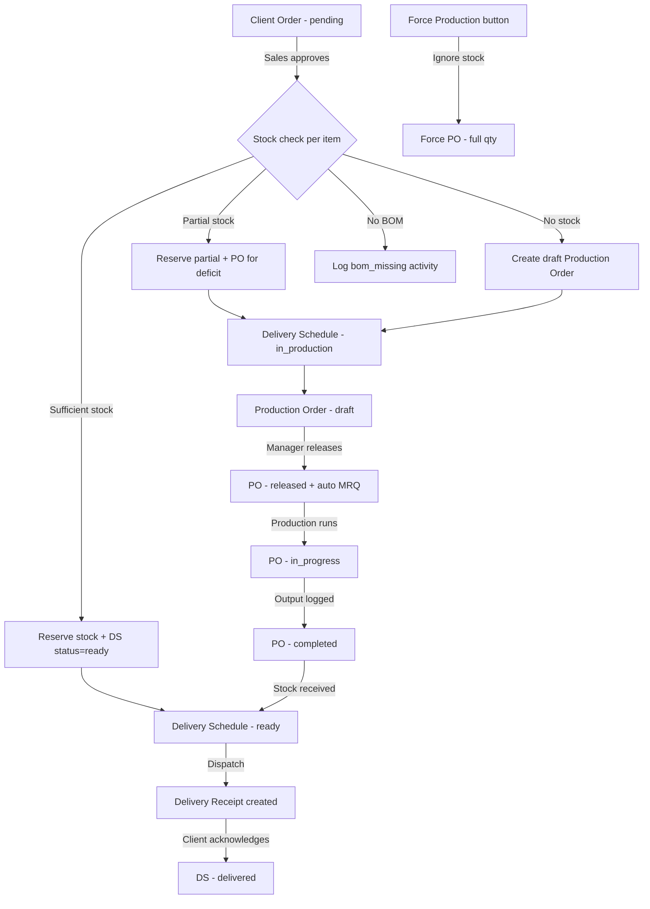

# Production Workflow Gap Analysis and Fixes

## Executive Summary

Analysis of the full production chain: Client Order -> Delivery Schedule -> Production Order -> QC -> Delivery Receipt. Found **7 broken/unaligned processes** and **5 improvement opportunities**.

---

## Current Workflow Architecture

---

## BROKEN PROCESSES

### BUG-1: Force Production Creates PO But Ignores Existing Delivery Schedule Status

**File:** [`ClientOrderService::forceProductionFromOrder()`](app/Domains/CRM/Services/ClientOrderService.php:994)

**Problem:** When force production is triggered on an order that already has a delivery schedule in `ready` status (stock was reserved), the force PO is created but:
1. The existing stock reservation is NOT released
2. The delivery schedule status is NOT reset from `ready` to `in_production`
3. This results in **double fulfillment** -- stock reserved AND production running for the same quantity

**Fix:** Before creating force POs, check if the delivery schedule item already has `ready` status. If so, release the existing stock reservation and transition the DSI back to `in_production`.

### BUG-2: Force Production Always Creates PO for Full Quantity Regardless of Stock

**File:** [`ClientOrderService::forceProductionFromOrder()`](app/Domains/CRM/Services/ClientOrderService.php:1039)

**The exact issue you described.** Line 1039: `$qtyRequired = (float) ($item->negotiated_quantity ?? $item->quantity)` -- this always uses the full order quantity. It does NOT check current stock or subtract what is already reserved/available.

In `preserve_stock_produce_full` mode, this is intentional by design name -- produce the full quantity regardless. But the user is not informed that existing stock reservations will coexist with the new production, leading to confusion.

**Fix:** Add a `stock_aware` mode that calculates `qty_to_produce = max(0, qty_required - available_stock)` and only produces the deficit. Also, add a clear UI indicator showing current stock vs ordered qty when force production is triggered.

### BUG-3: Delivery Schedule Created with Only First Item's Product ID

**File:** [`ClientOrderService::createDeliverySchedulesFromOrder()`](app/Domains/CRM/Services/ClientOrderService.php:830)

**Problem:** Line 851-852: The main `DeliverySchedule` record's `product_item_id` and `qty_ordered` are set from `$firstItem` only. For multi-item orders, the parent DS record only references the first item. While DSI (Delivery Schedule Items) table handles individual items, the parent DS fields are misleading.

**Impact:** Stock check in [`DeliveryScheduleService::maybeAutoCreateProductionOrder()`](app/Domains/Production/Services/DeliveryScheduleService.php:118) at line 128-136 checks stock using `$ds->product_item_id` (first item only) to decide whether to auto-create a PO. This means:
- If the first item has enough stock but the second item does not, no PO is created for either
- The stock check at the DS level is broken for multi-item orders

**Fix:** The `checkAndCreateDraftProductionOrders()` method already handles this correctly by iterating DSI items individually. The issue is only in the `maybeAutoCreateProductionOrder()` on manual DS confirmation. This method should iterate DSI items instead of using the parent DS fields.

### BUG-4: DS `confirmed` Status Auto-PO Creation Bypasses Existing PO Check for Multi-Item

**File:** [`DeliveryScheduleService::maybeAutoCreateProductionOrder()`](app/Domains/Production/Services/DeliveryScheduleService.php:118)

**Problem:** Line 121 checks `$ds->productionOrders()->count() > 0` -- this is a DS-level check. For multi-item delivery schedules, one item might have a PO while another does not. The method will skip PO creation for ALL items if ANY item already has a PO linked to the parent DS.

**Fix:** Iterate DSI items individually, checking for linked POs per item, not per DS.

### BUG-5: OrderAutomationService Does NOT Check Stock Before Creating POs

**File:** [`OrderAutomationService::createFromClientOrder()`](app/Domains/Production/Services/OrderAutomationService.php:38)

**Problem:** This service creates POs for ALL items in an approved order without checking stock availability. It always creates POs for full quantity. However, `checkAndCreateDraftProductionOrders()` in `ClientOrderService` DOES check stock. The issue is that BOTH paths can be triggered:
1. `approveOrder()` calls `checkAndCreateDraftProductionOrders()` (stock-aware)
2. The `ProductionOrderAutoCreated` event listener or manual trigger might call `OrderAutomationService::createFromClientOrder()` (NOT stock-aware)

**Fix:** Either remove `OrderAutomationService` as it duplicates `checkAndCreateDraftProductionOrders`, or add stock checking to it. Currently it has a duplicate guard (`$existingCount > 0`), but if the first path fails partially, the second path could create duplicate POs for items that already have stock.

### BUG-6: Production Order Completion Does Not Auto-Update DS Status to Ready

**File:** [`ProductionOrderService`](app/Domains/Production/Services/ProductionOrderService.php)

**Problem:** When a Production Order is completed (all output logged, QC passed), there is no automatic transition of the linked Delivery Schedule from `in_production` to `ready`. The DS status update appears to rely on manual intervention or an event listener.

Looking at `ProductionOrderCompleted` event dispatch at completion -- the event exists but there's no evidence of a listener that updates the DS status.

**Fix:** Add a listener for `ProductionOrderCompleted` that checks if the linked DS has all POs completed, and if so, transitions the DS to `ready` and receives finished goods into stock.

### BUG-7: Stock Reservation Not Reconciled After Production Completes

**Problem:** When `checkAndCreateDraftProductionOrders()` partially reserves stock (say 50 of 100 needed), then creates a PO for the deficit (50), after the PO completes and outputs 50 units to stock, there is no mechanism to:
1. Mark the DSI as `ready` (needs both the reserved 50 + produced 50)
2. Verify that the combined reserved + produced quantity meets the order requirement

The DS/DSI status management is fragmented across multiple services without a central reconciliation point.

---

## UNALIGNED PROCESSES

### MISALIGN-1: Two Competing Auto-PO Creation Paths

**Path A:** `ClientOrderService::checkAndCreateDraftProductionOrders()` -- stock-aware, creates POs for deficit only
**Path B:** `DeliveryScheduleService::maybeAutoCreateProductionOrder()` -- stock-aware but only checks DS-level product_item_id (broken for multi-item)
**Path C:** `OrderAutomationService::createFromClientOrder()` -- NOT stock-aware, creates POs for full quantity

All three can potentially run for the same order. Path A runs on approval. Path B runs when DS status changes to `confirmed`. Path C can run from event listeners.

### MISALIGN-2: DS Status Values Not Consistent Across Services

`DeliveryScheduleService::fulfillFromStock()` checks for `open` or `in_production` status, but `ClientOrderService` creates DS with status `open`. The DS can also be `confirmed` (from manual creation). The `maybeAutoCreateProductionOrder()` runs on `confirmed` transition. These status flows need a clear state machine.

---

## RECOMMENDED FIXES (Priority Order for Thesis Demo)

### FIX-1: Add Stock-Aware Mode to Force Production [HIGH PRIORITY]

- [ ] Add `stock_aware_produce_deficit` mode to `forceProductionFromOrder()` that calculates `qty_to_produce = max(0, qty_required - available_stock)`
- [ ] Show stock availability info in the Force Production UI dialog before user confirms
- [ ] Release existing stock reservations when force production overrides a ready DSI

### FIX-2: Fix Multi-Item DS Auto-PO Creation [HIGH PRIORITY]

- [ ] Refactor `DeliveryScheduleService::maybeAutoCreateProductionOrder()` to iterate DSI items individually
- [ ] Check stock per DSI item, not per parent DS
- [ ] Check existing POs per DSI item, not per parent DS

### FIX-3: Add DS Status Auto-Update on PO Completion [MEDIUM PRIORITY]

- [ ] Create listener for `ProductionOrderCompleted` event
- [ ] Check if all linked POs for the DS are completed
- [ ] Auto-transition DS from `in_production` to `ready` when all POs done
- [ ] Auto-receive finished goods into stock via `StockService::receive()`

### FIX-4: Remove or Align OrderAutomationService [MEDIUM PRIORITY]

- [ ] Either remove `OrderAutomationService` (since `checkAndCreateDraftProductionOrders` is more comprehensive) or add stock checking to match
- [ ] Ensure only ONE auto-PO creation path runs per order approval

### FIX-5: Show Stock Availability on Client Order Review Page [HIGH PRIORITY - UI]

- [ ] On the Sales review page, show current stock vs ordered quantity per item
- [ ] Show which items will be fulfilled from stock vs need production
- [ ] Indicate when force production is unnecessary because stock is sufficient

### FIX-6: Add Force Production Stock Warning [HIGH PRIORITY - UI]

- [ ] When force production is triggered and stock is already sufficient, show a warning: "Stock is already sufficient for this item. Production will create additional inventory."
- [ ] Allow the user to choose: produce deficit only, or produce full quantity anyway

### FIX-7: Add DS State Machine Validation [LOW PRIORITY]

- [ ] Create `DeliveryScheduleStateMachine` similar to `ProductionOrderStateMachine`
- [ ] Validate all status transitions: open -> in_production -> ready -> dispatched -> delivered
- [ ] Prevent invalid transitions like ready -> open
