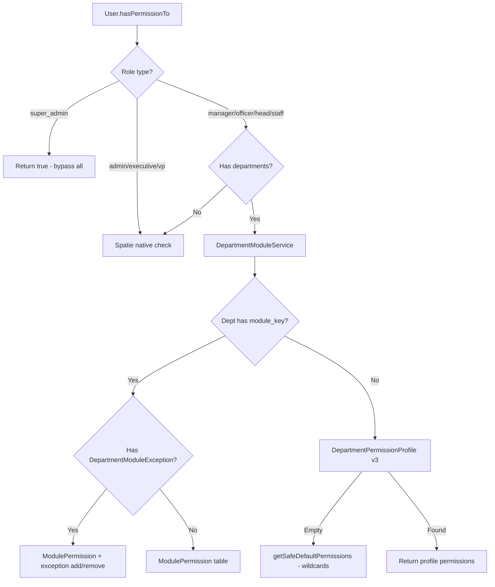
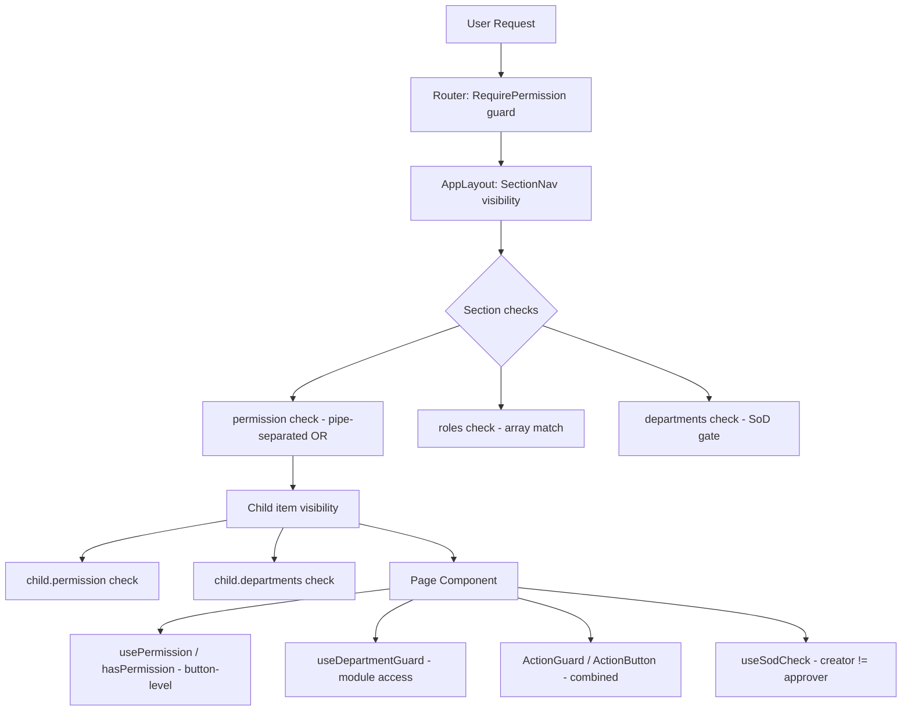

# RBAC Full Alignment Analysis and Remediation Plan

## Executive Summary

The Ogami ERP RBAC system has evolved through multiple iterations (v1 Spatie roles, v2 Department+Module, v3 DepartmentPermissionProfiles), creating **four overlapping permission resolution paths** that frequently contradict each other. This plan documents every misalignment found across backend seeders, middleware, services, policies, frontend auth store, sidebar navigation, route guards, and component-level permission checks, then provides actionable steps to unify the system.

---

## Architecture Overview

### Current Permission Resolution Flow



### Four Competing Permission Sources

| Source | Table/Seeder | Used When | Problem |
|--------|-------------|-----------|---------|
| **1. Spatie Role Permissions** | `RolePermissionSeeder` | admin/exec/vp OR fallback for users without depts | Manager gets ALL cross-module perms -- no dept scoping |
| **2. ModulePermission** | `ModulePermissionSeeder` via `module_permissions` table | Core roles WITH department + module_key assigned | Separate permission lists that may differ from Spatie |
| **3. DepartmentPermissionProfile** | `DepartmentPermissionProfileSeeder` via `department_permission_profiles` | Core roles WITH department but NO module_key | Yet another set of permissions that may diverge |
| **4. ReversedHierarchyPermissions** | `ReversedHierarchyPermissionSeeder` via `module_permissions` | Runs AFTER ModulePermissionSeeder, overwrites | May undo ModulePermissionSeeder work |

### Frontend RBAC Enforcement Layers



---

## Critical Backend Misalignments

### GAP-1: Three Seeders Compete to Define the Same Permissions

**Files involved:**
- [`RolePermissionSeeder`](database/seeders/RolePermissionSeeder.php:567) -- Spatie `syncPermissions()` on roles
- [`ModulePermissionSeeder`](database/seeders/ModulePermissionSeeder.php:766) -- Also calls `syncPermissions()` on Spatie roles
- [`ReversedHierarchyPermissionSeeder`](database/seeders/ReversedHierarchyPermissionSeeder.php:22) -- Writes to `module_permissions` table

The [`DatabaseSeeder`](database/seeders/DatabaseSeeder.php:42) runs them in order: `RolePermissionSeeder` -> `ModulePermissionSeeder` -> `ReversedHierarchyPermissionSeeder`. Each one may overwrite the previous. Specifically:

1. `RolePermissionSeeder` syncs Spatie permissions to roles (e.g., manager gets 130+ permissions across ALL modules)
2. `ModulePermissionSeeder.syncPermissionsToRoles()` at line 775 MERGES permissions from all modules and calls `syncPermissions()` again -- potentially overwriting step 1
3. `ReversedHierarchyPermissionSeeder` writes to `module_permissions` table with a different hierarchy model

**Impact:** The Spatie role permissions are a **superset of all modules**, meaning a Production Manager who falls back to Spatie (no dept assignment) gets Accounting, HR, Payroll, and every other module's permissions.

### GAP-2: `DepartmentModuleService.userHasPermission()` Bug

In [`DepartmentModuleService::userHasPermission()`](app/Services/DepartmentModuleService.php:156):
```php
if ($user->hasRole('superadmin')) { // BUG: should be 'super_admin'
    return true;
}
```
The role is `super_admin` with underscore per [`RolePermissionSeeder`](database/seeders/RolePermissionSeeder.php:450). The super admin bypass in `DepartmentModuleService` **never triggers** -- though `User.hasPermissionTo()` catches it earlier at line 213.

### GAP-3: Dead Code in `getSystemRolePermissions()`

[`getSystemRolePermissions()`](app/Services/DepartmentModuleService.php:223) returns wildcards like `system.*`, `users.*`, `roles.*`, `reports.view`, `approvals.final`, `dashboard.executive` -- **none of which exist as actual Spatie permissions**. Since system roles use Spatie native path via `User.hasPermissionTo()` line 220, this method is never called for them.

### GAP-4: `User.hasDepartmentAccess()` Bypass Roles Inconsistent

| Component | Bypass Roles |
|-----------|-------------|
| [`DepartmentScopeMiddleware`](app/Infrastructure/Middleware/DepartmentScopeMiddleware.php:27) | `admin, executive, super_admin, vice_president` |
| [`ModuleAccessMiddleware`](app/Infrastructure/Middleware/ModuleAccessMiddleware.php:130) | `admin, super_admin, executive, vice_president` |
| [`SodMiddleware`](app/Infrastructure/Middleware/SodMiddleware.php:53) | `admin, super_admin` only |
| [`User.hasDepartmentAccess()`](app/Models/User.php:186) | `admin, executive` only -- **missing `super_admin`, `vice_president`** |
| Frontend [`useDepartmentGuard`](frontend/src/hooks/useDepartmentGuard.ts:237) | `super_admin, admin, executive, vice_president` |
| Frontend [`authStore.hasDepartmentAccess`](frontend/src/stores/authStore.ts:66) | `admin, super_admin, executive, vice_president` |

### GAP-5: Manager Role SoD Violations in Spatie Layer

[`RolePermissionSeeder`](database/seeders/RolePermissionSeeder.php:567) gives the `manager` Spatie role BOTH:
- `payroll.hr_approve` AND `payroll.acctg_approve` -- same user can approve from both HR and Accounting side
- `payroll.initiate` AND `payroll.acctg_approve` -- can create and approve payroll
- `loans.hr_approve` AND `loans.accounting_approve` AND `loans.manager_check` -- can perform multiple steps
- `vendor_invoices.create` AND `vendor_invoices.approve` -- can create and approve vendor invoices

While `ModulePermissionSeeder` scopes these by module, the Spatie fallback path has no such scoping.

### GAP-6: Double Cache Key Collision

[`getDepartmentProfilePermissions()`](app/Services/DepartmentModuleService.php:385) uses the same cache key `dept_mod_perms:{role}:{dept_id}` as [`getPermissionsForDepartment()`](app/Services/DepartmentModuleService.php:83). Since `getPermissionsForDepartment()` calls `getDepartmentProfilePermissions()` inside its own `Cache::remember()`, the inner call caches with the same key but potentially different values.

---

## Critical Frontend Misalignments

### GAP-7: Frontend `MODULE_DEPARTMENTS` Diverges from Backend `ModuleAccessMiddleware`

Comparing [`useDepartmentGuard.ts`](frontend/src/hooks/useDepartmentGuard.ts:56) with [`ModuleAccessMiddleware`](app/Infrastructure/Middleware/ModuleAccessMiddleware.php:44):

| Module Key | Backend Departments | Frontend Departments | Impact |
|---|---|---|---|
| `loans` | `HR, ACCTG, PURCH, PROD, PLANT, WH, QC, MAINT, SALES, IT` | `HR, ACCTG` | **Frontend blocks all operational dept managers from loans team view sidebar** |
| `hr` (top-level) | `HR, PURCH, PROD, PLANT, WH, QC, MAINT, SALES, ACCTG, IT` | `HR` only | **Frontend hides HR sidebar for non-HR depts** (partially mitigated by `My Team` section) |
| `procurement` | `PURCH, PROD, PLANT, ACCTG, WH` | `PURCH` only | **Frontend blocks PROD/PLANT/ACCTG/WH from procurement pages** |
| `purchase_requests` | `PURCH, PROD, PLANT, ACCTG` | `PURCH` only | **Dept heads in PROD/PLANT/ACCTG cant see PRs on frontend despite having `create-dept` permission** |
| `ap` | `ACCTG, PURCH` | `ACCTG` only | **Frontend blocks Purchasing from AP pages** |
| `iso` | `ISO, QC` | `QC` only | **ISO department users blocked on frontend** |
| `approvals` | `EXEC, VP` | Not listed | **VP approval page accessibility relies solely on permission check, not dept guard** |

### GAP-8: Sidebar Department Gates Narrower Than Route Guards

The sidebar [`SECTIONS` array in AppLayout.tsx`](frontend/src/components/layout/AppLayout.tsx:87) has `departments` arrays on each section that are narrower than what route guards allow:

| Sidebar Section | `departments` in sidebar | Route guard permission | Mismatch |
|---|---|---|---|
| **HR & Payroll** | `HR, ACCTG, EXEC` | `hr.full_access\|payroll.view_runs` | A WH Head with `payroll.view_runs` (from Spatie) can access `/payroll/runs` via URL but never sees it in sidebar |
| **Financial Management** | `ACCTG, SALES, PURCH` | `chart_of_accounts.view` etc | An EXEC VP can access accounting routes directly but the section wont appear in sidebar (VP is bypassed in SectionNav dept check though) |
| **Supply Chain** | `PURCH, PPC, PROD, PLANT, WH` | `procurement.purchase-request.view` | An ACCTG officer with `procurement.purchase-request.budget-check` wont see Supply Chain section |
| **Sales & CRM** | `SALES` | `sales.order_review\|crm.tickets.view` | Client portal users have `crm.tickets.view` but are in a separate layout so this is OK |

### GAP-9: Frontend `PERMISSIONS` Object Missing Backend Permissions

Comparing [`permissions.ts`](frontend/src/lib/permissions.ts:26) with [`RolePermissionSeeder::PERMISSIONS`](database/seeders/RolePermissionSeeder.php:63):

**Missing from frontend `PERMISSIONS` constant:**

| Category | Missing Permissions |
|---|---|
| Attendance | `time_clock`, `corrections.submit`, `corrections.review`, `work_locations.manage`, `work_locations.assign` |
| Procurement | `purchase-request.create-dept` |
| CRM | `leads.view`, `leads.manage`, `leads.convert`, `opportunities.view`, `opportunities.manage` (no nested CRM entry) |
| Sales | `quotations.manage`, `orders.manage`, `pricing.view` |
| Inventory | `physical_count.view`, `physical_count.manage`, `transfers.manage` |
| AP | `payment_batches.manage` (has view/create/approve but not manage) |
| AR | `dunning.manage` (has view/create/send but not manage) |
| HR | `training.view`, `training.manage`, `competency.view`, `competency.manage` |
| Delivery | `routes.view`, `routes.manage` (partially present) |
| Fixed Assets | `transfer` |
| Budget | `forecast`, `review` (used in approval workflows) |
| Recruitment | Entire section absent from PERMISSIONS object |
| Leave Balances | `manage` |

### GAP-10: Component-Level Permission Checks Use Hardcoded Strings Instead of PERMISSIONS Object

Many pages use raw permission strings instead of the typed [`PERMISSIONS`](frontend/src/lib/permissions.ts) constant:

| File | Line | Uses |
|---|---|---|
| [`TeamLeavePage.tsx`](frontend/src/pages/team/TeamLeavePage.tsx:22) | 22-23 | `hasPermission('leaves.head_approve')` -- hardcoded |
| [`LoanDetailPage.tsx`](frontend/src/pages/hr/loans/LoanDetailPage.tsx:39) | 39-45 | Multiple hardcoded loan permissions |
| [`PayrollRunDetailPage.tsx`](frontend/src/pages/payroll/PayrollRunDetailPage.tsx:488) | 488-516 | All payroll step permissions hardcoded |
| [`PurchaseRequestDetailPage.tsx`](frontend/src/pages/procurement/PurchaseRequestDetailPage.tsx:228) | 228-250 | All PR workflow permissions hardcoded |
| [`VpApprovalsDashboardPage.tsx`](frontend/src/pages/approvals/VpApprovalsDashboardPage.tsx:156) | 156-163 | All VP approval permissions hardcoded |

This means if a permission name changes in the backend, there is no compile-time or type-check safety net.

### GAP-11: Role Hierarchy Comments Conflict with Actual Permissions

[`useDepartmentGuard.ts`](frontend/src/hooks/useDepartmentGuard.ts:7) states:
> Reversed hierarchy: Officer highest -> Manager -> Head -> Staff lowest

And [`ROLE_HIERARCHY`](frontend/src/hooks/useDepartmentGuard.ts:11) assigns Officer level 60, Manager level 50.

But [`RolePermissionSeeder`](database/seeders/RolePermissionSeeder.php:567) gives `manager` 130+ permissions vs `officer` 95 permissions. **Manager has MORE permissions than Officer in the Spatie layer.** The "reversed hierarchy" only applies in `ModulePermissionSeeder` where Officer is given the superset.

### GAP-12: Route Guards Allow Access That Sidebar Hides

Users can access routes via direct URL that are hidden from their sidebar:

| Route | Guard Permission | Sidebar Visible For | Hidden From |
|---|---|---|---|
| `/payroll/runs` | `payroll.view_runs` | HR, ACCTG, EXEC depts | Any head/manager outside those depts who has the permission via Spatie |
| `/procurement/purchase-requests` | `procurement.purchase-request.view` | PURCH, PPC, PROD, PLANT, WH depts | ACCTG officer with budget-check permission |
| `/inventory/transfers` | `inventory.transfers.manage` | Not in sidebar at all | Anyone with the permission |
| `/inventory/stock-adjustments` | Not listed in router | N/A | No route exists but `StockAdjustmentsPage.tsx` exists |
| `/qc/templates` | `qc.templates.view` | Not in sidebar | Accessible via direct URL |
| `/qc/ncrs` | `qc.ncr.view` | Not in sidebar | Accessible via direct URL |
| `/qc/defect-rate` | `qc.inspections.view` | Not in sidebar | Accessible via direct URL |
| `/mold/masters` | `mold.view` | Not in sidebar | Accessible via direct URL |

### GAP-13: Test Assertions Contradict Permission Model

[`RbacFrontendSyncTest`](tests/Integration/RbacFrontendSyncTest.php:37) has contradictory assertions:
- Line 64: `expect($user->hasPermissionTo('payroll.view_runs'))->toBeTrue()` for Production Manager
- Line 83: `should_not_see` array includes `payroll.view_runs`
- Line 61: `expect($user->hasPermissionTo('iso.view'))->toBeFalse()` -- correct for Spatie manager, but contradicted by `should_see` at line 79 that lists `iso.view`

---

## Remediation Plan

### Phase 1: Establish Single Source of Truth for Backend Permissions

- [ ] **1.1** Remove Spatie `syncPermissions()` for core roles (manager/officer/head/staff) from `RolePermissionSeeder` -- these roles should ONLY get permissions via `DepartmentModuleService`
- [ ] **1.2** Remove `ModulePermissionSeeder.syncPermissionsToRoles()` method (lines 770-825) that merges all module permissions back to Spatie roles
- [ ] **1.3** Remove `ReversedHierarchyPermissionSeeder` from `DatabaseSeeder` -- consolidate hierarchy into `ModulePermissionSeeder` directly
- [ ] **1.4** Audit `DepartmentPermissionProfileSeeder` vs `ModulePermissionSeeder` -- pick one system, recommend `ModulePermissionSeeder`
- [ ] **1.5** Keep Spatie `syncPermissions()` only for system roles: admin, super_admin, executive, vice_president, vendor, client

### Phase 2: Fix Backend Bugs

- [ ] **2.1** Fix `DepartmentModuleService::userHasPermission()` -- change `'superadmin'` to `'super_admin'`
- [ ] **2.2** Fix `User::hasDepartmentAccess()` -- add `super_admin` and `vice_president` to bypass list
- [ ] **2.3** Fix double-cache bug -- use distinct cache key `dept_profile_perms:{role}:{dept_id}` in `getDepartmentProfilePermissions()`
- [ ] **2.4** Remove dead code in `getSystemRolePermissions()` -- system roles use Spatie native path

### Phase 3: Align Frontend `MODULE_DEPARTMENTS` with Backend

Update [`useDepartmentGuard.ts`](frontend/src/hooks/useDepartmentGuard.ts:56) to match [`ModuleAccessMiddleware`](app/Infrastructure/Middleware/ModuleAccessMiddleware.php:44):

- [ ] **3.1** `loans`: Change from `['HR', 'ACCTG']` to `['HR', 'ACCTG', 'PURCH', 'PROD', 'PLANT', 'WH', 'QC', 'MAINT', 'SALES', 'IT']`
- [ ] **3.2** `procurement`: Change from `['PURCH']` to `['PURCH', 'PROD', 'PLANT', 'ACCTG', 'WH']`
- [ ] **3.3** `purchase_requests`: Change from `['PURCH']` to `['PURCH', 'PROD', 'PLANT', 'ACCTG']`
- [ ] **3.4** `ap`: Change from `['ACCTG']` to `['ACCTG', 'PURCH']`
- [ ] **3.5** `iso`: Change from `['QC']` to `['ISO', 'QC']`
- [ ] **3.6** Add `approvals` key: `['EXEC', 'VP']` (or rely on role bypass)
- [ ] **3.7** Verify all other keys match backend and fix any remaining discrepancies

### Phase 4: Align Frontend Sidebar Navigation

Update [`AppLayout.tsx SECTIONS`](frontend/src/components/layout/AppLayout.tsx:87):

- [ ] **4.1** **Supply Chain section** `departments`: Add `'ACCTG'` so Accounting Officers with budget-check can see Purchase Requests in sidebar
- [ ] **4.2** **HR & Payroll section**: The `departments: ['HR', 'ACCTG', 'EXEC']` is intentionally narrow -- non-HR managers should use My Team section. Verify this is documented
- [ ] **4.3** Add missing sidebar entries for pages accessible via routes but not in sidebar:
  - QC Templates (`/qc/templates`) under Production & Quality
  - NCR List (`/qc/ncrs`) under Production & Quality
  - Mold Masters (`/mold/masters`) under Production & Quality
  - Stock Adjustments page (if route exists)
  - Inventory Transfers (`/inventory/transfers`) under Supply Chain
  - QC Defect Rate, Quarantine, SPC dashboards
- [ ] **4.4** Add `departments: ['MOLD']` to Production & Quality section -- currently listed but verify MOLD dept heads see it
- [ ] **4.5** Review Finance Approvals section -- only ACCTG dept. Consider whether PURCH officers also need budget verification visibility

### Phase 5: Complete Frontend `PERMISSIONS` Object

Update [`permissions.ts`](frontend/src/lib/permissions.ts) to add all missing permissions:

- [ ] **5.1** Add attendance extensions: `time_clock`, `corrections.submit`, `corrections.review`, `work_locations.manage`, `work_locations.assign`
- [ ] **5.2** Add `procurement.purchase_request.create_dept` (note: backend uses `create-dept` with hyphen)
- [ ] **5.3** Add CRM leads and opportunities: `crm.leads` and `crm.opportunities` subgroups
- [ ] **5.4** Add missing sales permissions: `quotations.manage`, `orders.manage`, `pricing.view`
- [ ] **5.5** Add inventory extensions: `physical_count.view`, `physical_count.manage`, `transfers.manage`
- [ ] **5.6** Add `ap.payment_batches.manage` and `ar.dunning.manage`
- [ ] **5.7** Add HR training/competency: `hr.training.*`, `hr.competency.*`
- [ ] **5.8** Add `fixed_assets.transfer`, `budget.forecast`, `budget.review`
- [ ] **5.9** Add full recruitment section: `recruitment.requisitions.*`, `recruitment.postings.*`, `recruitment.applications.*`, `recruitment.interviews.*`, `recruitment.offers.*`, `recruitment.preemployment.*`, `recruitment.hiring.*`, `recruitment.reports.*`, `recruitment.candidates.*`
- [ ] **5.10** Add `leave_balances.manage`

### Phase 6: Migrate Hardcoded Permission Strings to PERMISSIONS Object

- [ ] **6.1** Replace all raw permission strings in page components with `PERMISSIONS.*` references
- [ ] **6.2** Priority files (most complex permission logic):
  - [`PayrollRunDetailPage.tsx`](frontend/src/pages/payroll/PayrollRunDetailPage.tsx) -- 15+ hardcoded strings
  - [`PurchaseRequestDetailPage.tsx`](frontend/src/pages/procurement/PurchaseRequestDetailPage.tsx) -- 10+ hardcoded strings
  - [`LoanDetailPage.tsx`](frontend/src/pages/hr/loans/LoanDetailPage.tsx) -- 8 hardcoded strings
  - [`VpApprovalsDashboardPage.tsx`](frontend/src/pages/approvals/VpApprovalsDashboardPage.tsx) -- 8 hardcoded strings
  - [`MaterialRequisitionDetailPage.tsx`](frontend/src/pages/inventory/MaterialRequisitionDetailPage.tsx) -- 7 hardcoded strings
- [ ] **6.3** Update [`router/index.tsx`](frontend/src/router/index.tsx) guard calls to use `PERMISSIONS.*` where possible (note: some routes use pipe-separated strings which need a helper)

### Phase 7: Resolve SoD Violations

- [ ] **7.1** If Phase 1 is implemented (removing Spatie perms for core roles), SoD resolves itself because `ModulePermissionSeeder` scopes by module
- [ ] **7.2** Audit `SodMiddleware` conflict matrix in [`SystemSettingsSeeder`](database/seeders/SystemSettingsSeeder.php:169) -- references `payroll.prepare`/`payroll.approve` but actual permissions are `payroll.initiate`/`payroll.hr_approve`/`payroll.acctg_approve`. Update matrix to use correct permission names
- [ ] **7.3** Add frontend SoD validation via [`useSodCheck`](frontend/src/hooks/useSodCheck.ts) in pages that currently lack it (e.g., payroll approval buttons)

### Phase 8: Fix Role Hierarchy Documentation

- [ ] **8.1** Resolve the "reversed hierarchy" terminology confusion. Either:
  - **Option A**: Keep the reversed hierarchy (Officer > Manager > Head > Staff) and update `RolePermissionSeeder` to match -- give Officer MORE permissions than Manager
  - **Option B**: Use standard hierarchy (Manager > Officer > Head > Staff) and update `useDepartmentGuard.ts` ROLE_HIERARCHY to match
- [ ] **8.2** Update [`authStore.ts`](frontend/src/stores/authStore.ts:79) comments that say "Reversed Hierarchy: Officer highest"
- [ ] **8.3** Update [`useDepartmentGuard.ts`](frontend/src/hooks/useDepartmentGuard.ts:7) comments and ROLE_HIERARCHY constants

### Phase 9: Fix and Expand Tests

- [ ] **9.1** Fix contradictory assertions in [`RbacFrontendSyncTest`](tests/Integration/RbacFrontendSyncTest.php) -- `should_see`/`should_not_see` arrays must match `expect()` assertions
- [ ] **9.2** Add integration tests that verify the FULL permission resolution path: User -> hasPermissionTo -> DepartmentModuleService -> ModulePermission table
- [ ] **9.3** Add test: seed ALL seeders in `DatabaseSeeder` order, then verify Production Manager does NOT have accounting permissions, HR Manager does NOT have production permissions
- [ ] **9.4** Add frontend unit tests for `useDepartmentGuard` hook verifying MODULE_DEPARTMENTS matches backend
- [ ] **9.5** Add Arch test: core roles MUST NOT have Spatie direct permissions after full seed

### Phase 10: Documentation and Cleanup

- [ ] **10.1** Create canonical RBAC architecture document describing the single permission resolution path
- [ ] **10.2** Deprecate `DepartmentPermissionTemplate`, `DepartmentPermissionProfile`, and `ReversedHierarchyPermissionSeeder`
- [ ] **10.3** Add script/command to verify frontend PERMISSIONS object is in sync with `RolePermissionSeeder::PERMISSIONS`
- [ ] **10.4** Document the department-to-module mapping as a single authoritative reference (currently split between `DepartmentModuleAssignmentSeeder`, `ModuleAccessMiddleware`, and `useDepartmentGuard.ts`)

---

## Frontend-Backend RBAC Alignment Matrix

### Sidebar Section to Backend Module Mapping

| Sidebar Section | Frontend Dept Gate | Backend Middleware | Aligned? | Fix |
|---|---|---|---|---|
| HR & Payroll | `HR, ACCTG, EXEC` | `module_access:hr` -> all depts; `module_access:payroll` -> `HR, ACCTG` | Partial | Intentional: non-HR uses My Team |
| My Team | `ALL` | No middleware -- uses permission guards | OK | -- |
| Financial Management | `ACCTG, SALES, PURCH` | `module_access:accounting` -> `ACCTG, EXEC` | Partial | Add EXEC to sidebar? VP bypasses dept check |
| Finance Approvals | `ACCTG` | `module_access:procurement` -> includes ACCTG | OK | -- |
| Supply Chain | `PURCH, PPC, PROD, PLANT, WH` | Procurement includes ACCTG; Inventory includes PPC, SALES | No | Add ACCTG, SALES |
| Production & Quality | `PROD, PLANT, PPC, QC, MAINT, MOLD` | Matches backend | OK | -- |
| Sales & CRM | `SALES` | Matches backend | OK | -- |
| Delivery & Logistics | `WH, SALES, PROD` | Matches backend | Partial | Add PLANT |
| Executive | `ALL` + roles VP/exec/super_admin | No dept middleware -- permission-gated | OK | -- |
| Administration | `IT, EXEC` + roles admin/super_admin/exec/vp | Matches backend | OK | -- |

### Route Guard to Sidebar Orphans

Pages with route guards but NO sidebar entry (users can access via URL only):

| Route | Guard Permission | Should Add to Sidebar? |
|---|---|---|
| `/qc/templates` | `qc.templates.view` | Yes -- under Production & Quality |
| `/qc/ncrs` | `qc.ncr.view` | Yes -- under Production & Quality |
| `/qc/defect-rate` | `qc.inspections.view` | Optional -- analytics page |
| `/qc/quarantine` | `qc.inspections.view` | Optional -- analytics page |
| `/qc/spc` | `qc.inspections.view` | Optional -- analytics page |
| `/qc/supplier-quality` | `qc.inspections.view` | Optional -- analytics page |
| `/mold/masters` | `mold.view` | Yes -- under Production & Quality |
| `/mold/lifecycle` | `mold.view` | Optional -- analytics page |
| `/inventory/transfers` | `inventory.transfers.manage` | Yes -- under Supply Chain |
| `/inventory/physical-count` | `inventory.adjustments.create` | Yes -- under Supply Chain |
| `/inventory/locations` | `inventory.locations.view` | Yes -- under Supply Chain |
| `/inventory/ledger` | `inventory.stock.view` | Optional -- analytics page |
| `/inventory/analytics` | `inventory.stock.view` | Optional -- analytics page |
| `/production/work-centers` | `production.orders.view` | Yes -- under Production |
| `/production/routings` | `production.orders.view` | Yes -- under Production |
| `/production/mrp` | `production.orders.view` | Optional -- analytics page |

---

## Risk Assessment

| Risk | Severity | Mitigation |
|------|----------|------------|
| Removing Spatie permissions for core roles breaks tests | High | Run full test suite after each change; update tests to use DepartmentModuleService path |
| Frontend becomes more restrictive than backend | Medium | Align MODULE_DEPARTMENTS first; deploy backend and frontend changes together |
| Cache invalidation issues during migration | Medium | Clear all RBAC caches after seeder changes; add artisan command for cache flush |
| Existing users with incorrect permissions | High | Create migration script that re-seeds permissions for all existing users |
| SoD matrix references wrong permission names | Medium | Audit and fix matrix against canonical permission names in a single PR |
| Sidebar changes expose pages to wrong departments | Medium | Test each sidebar section change by logging in as each role+dept combo |
