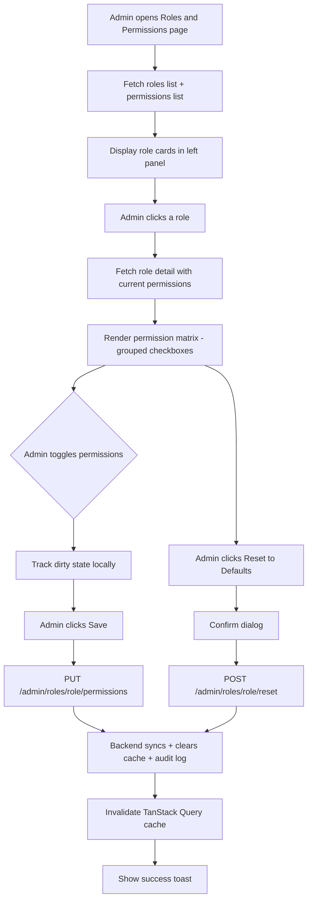

# RBAC Permission Management Admin Page

## Problem Statement

All 200+ permissions and their role assignments are hardcoded in [`RolePermissionSeeder.php`](database/seeders/RolePermissionSeeder.php:58) (933 lines). Every change requires editing the seeder and re-running it, which is error-prone and not suitable for production. The admin needs a UI to manage role-permission mappings at runtime.

## Current State

### What exists
- **Spatie Permission** package with `roles`, `permissions`, `model_has_roles`, `model_has_permissions`, `role_has_permissions` tables
- **~200 permissions** defined as a `PERMISSIONS` constant array in the seeder
- **10 roles**: `super_admin`, `admin`, `executive`, `vice_president`, `manager`, `officer`, `head`, `staff`, `vendor`, `client`
- **Backend**: `GET /api/v1/admin/roles` returns role names + user counts; `POST /users/{user}/roles` assigns a role to a user
- **Frontend**: [`UsersPage.tsx`](frontend/src/pages/admin/UsersPage.tsx) has a role-change modal; [`useRoles()`](frontend/src/hooks/useAdmin.ts:277) fetches roles
- **Frontend permissions**: [`permissions.ts`](frontend/src/lib/permissions.ts) mirrors seeder constants; [`authStore.ts`](frontend/src/stores/authStore.ts) checks permissions via `hasPermission()`

### What is missing
- No API to list all permissions
- No API to view/edit which permissions belong to a role
- No API to create/delete custom roles
- No admin UI for role-permission management
- No permission grouping/categorization in the DB

## Architecture Decisions

### Approach: Hybrid Seeder + Runtime Management
The seeder remains the **baseline** for fresh installs and CI. The new admin UI reads/writes directly to Spatie's `role_has_permissions` pivot table at runtime. This means:
- Seeder sets the initial state
- Admin UI can override at runtime
- A "Reset to defaults" button can re-run seeder logic if needed

### Protected Roles
`super_admin` always gets ALL permissions (enforced in code). The UI should show it as read-only. `admin`, `vendor`, and `client` roles should be editable but with a warning banner since they have specific architectural constraints.

### Permission Grouping
Permissions follow a `module.action` naming convention already. The UI groups them by the module prefix (e.g., `employees.*`, `payroll.*`, `procurement.*`) for a clean matrix view.

---

## Implementation Plan

### Phase 1: Backend API Endpoints

Add routes to [`routes/api/v1/admin.php`](routes/api/v1/admin.php) under the existing admin prefix. All endpoints require `system.assign_roles` permission.

#### 1.1 List All Permissions (grouped)
```
GET /api/v1/admin/permissions
```
Returns all permissions from the `permissions` table, grouped by module prefix.

Response shape:
```json
{
  "data": {
    "employees": ["employees.view", "employees.create", ...],
    "payroll": ["payroll.view_runs", "payroll.hr_approve", ...],
    ...
  },
  "meta": { "total": 207 }
}
```

#### 1.2 Get Role Detail with Permissions
```
GET /api/v1/admin/roles/{role}
```
Returns a single role with its assigned permission names.

Response shape:
```json
{
  "data": {
    "id": 5,
    "name": "manager",
    "guard_name": "web",
    "users_count": 12,
    "permissions": ["employees.view", "employees.create", ...]
  }
}
```

#### 1.3 Update Role Permissions (bulk sync)
```
PUT /api/v1/admin/roles/{role}/permissions
```
Accepts a full list of permission names and syncs them. Uses Spatie's `$role->syncPermissions()`.

Request body:
```json
{
  "permissions": ["employees.view", "employees.create", ...]
}
```

Guards:
- Reject if `role.name === 'super_admin'` (always has all permissions)
- Validate each permission name exists in the `permissions` table
- Clear Spatie's permission cache after sync
- Create an audit log entry

#### 1.4 Enhance Existing Roles Index
```
GET /api/v1/admin/roles
```
Already exists. Enhance to include `permissions_count` alongside `users_count`.

#### 1.5 Create Custom Role (optional, Phase 2)
```
POST /api/v1/admin/roles
```
Create a new role with a name and initial permission set. Validate name uniqueness, snake_case format.

#### 1.6 Delete Custom Role (optional, Phase 2)
```
DELETE /api/v1/admin/roles/{role}
```
Only allow deleting roles that have zero users and are not in the protected set.

#### 1.7 Reset Role to Seeder Defaults
```
POST /api/v1/admin/roles/{role}/reset
```
Re-applies the permission set from `RolePermissionSeeder` for the given role. Useful as a safety net.

---

### Phase 2: Frontend - Role & Permission Management Page

#### 2.1 New Page: `RolesPermissionsPage.tsx`
Location: `frontend/src/pages/admin/RolesPermissionsPage.tsx`

**Layout**: Two-panel design
- **Left panel**: Role list (cards or table showing role name, user count, permission count)
- **Right panel**: Permission matrix for the selected role

#### 2.2 Permission Matrix Component
A grouped checkbox grid:
- Rows = permission modules (e.g., "Employees", "Payroll", "Procurement")
- Columns = individual actions within that module
- Each cell = a checkbox (checked = role has that permission)
- Module-level "Select All" / "Deselect All" toggle
- Global search/filter to find specific permissions
- Visual diff highlighting: show which permissions differ from the seeder baseline

#### 2.3 Role Detail View
When a role is selected:
- Show role name, user count, permission count
- "Edit Permissions" button opens the matrix in edit mode
- "Reset to Defaults" button with confirmation dialog
- Read-only badge for `super_admin`
- Warning banner for `admin`/`vendor`/`client` explaining constraints

#### 2.4 Workflow Diagram



---

### Phase 3: Frontend Hooks & Integration

#### 3.1 New Hooks in `useAdmin.ts`
Add to [`frontend/src/hooks/useAdmin.ts`](frontend/src/hooks/useAdmin.ts):

- `usePermissionsList()` - fetches grouped permissions
- `useRoleDetail(roleName)` - fetches role with permissions
- `useUpdateRolePermissions()` - mutation for PUT sync
- `useResetRolePermissions()` - mutation for POST reset

#### 3.2 Router Integration
Add to [`frontend/src/router/index.tsx`](frontend/src/router/index.tsx):

```
/admin/roles-permissions -> guard with system.assign_roles
```

#### 3.3 Navigation Integration
Add "Roles & Permissions" link to the Admin section in [`AppLayout.tsx`](frontend/src/components/layout/AppLayout.tsx:304):

```typescript
{ label: 'Roles & Permissions', href: '/admin/roles-permissions', permission: 'system.assign_roles' }
```

---

### Phase 4: Safety & Audit

#### 4.1 Permission Change Audit Trail
Every permission sync should create an audit entry with:
- Who made the change
- Which role was modified
- Permissions added (diff)
- Permissions removed (diff)

Use the existing `audits` table via Owen IT's auditing package.

#### 4.2 Seeder Baseline Comparison
Store the seeder's "default" permission set per role so the UI can show a visual diff (green = added from baseline, red = removed from baseline). This can be computed by extracting the arrays from the seeder into a static method that returns the defaults.

#### 4.3 Cache Invalidation
After any permission change:
1. Call `app()[PermissionRegistrar::class]->forgetCachedPermissions()`
2. Frontend invalidates `['admin-roles']` and `['auth-me']` query keys so the active user sees updated permissions without a page refresh

---

## File Changes Summary

### Backend (Laravel)

| File | Change |
|------|--------|
| [`routes/api/v1/admin.php`](routes/api/v1/admin.php) | Add 4 new endpoints: GET permissions, GET role detail, PUT role permissions, POST role reset |
| [`database/seeders/RolePermissionSeeder.php`](database/seeders/RolePermissionSeeder.php) | Extract role-permission defaults into a public static method for reuse by reset endpoint |

### Frontend (React/TypeScript)

| File | Change |
|------|--------|
| `frontend/src/pages/admin/RolesPermissionsPage.tsx` | **New** - Main page with role list + permission matrix |
| [`frontend/src/hooks/useAdmin.ts`](frontend/src/hooks/useAdmin.ts) | Add 4 new hooks for permissions CRUD |
| [`frontend/src/router/index.tsx`](frontend/src/router/index.tsx) | Add route for `/admin/roles-permissions` |
| [`frontend/src/components/layout/AppLayout.tsx`](frontend/src/components/layout/AppLayout.tsx:304) | Add nav link in Admin section |

---

## Risks & Mitigations

| Risk | Mitigation |
|------|------------|
| Admin accidentally removes critical permissions from a role | "Reset to Defaults" button; confirmation dialog on save; audit trail |
| `super_admin` permissions tampered with | Backend rejects any PUT to super_admin; UI shows read-only |
| Stale permission cache after changes | Explicit cache clear on backend + frontend query invalidation |
| Frontend `PERMISSIONS` constant drifts from DB | The constant is only used for type-safe references; actual enforcement is always backend. No sync issue. |
| Large permission list makes UI unwieldy | Group by module prefix; add search/filter; collapsible sections |

---

## Implementation Order (Checklist)

1. Extract seeder defaults into a static method in `RolePermissionSeeder`
2. Add `GET /admin/permissions` endpoint (grouped permission list)
3. Add `GET /admin/roles/{role}` endpoint (role detail with permissions)
4. Add `PUT /admin/roles/{role}/permissions` endpoint (sync permissions)
5. Add `POST /admin/roles/{role}/reset` endpoint (reset to seeder defaults)
6. Enhance existing `GET /admin/roles` to include `permissions_count`
7. Add frontend hooks: `usePermissionsList`, `useRoleDetail`, `useUpdateRolePermissions`, `useResetRolePermissions`
8. Create `RolesPermissionsPage.tsx` with role list panel
9. Build permission matrix component with grouped checkboxes
10. Add search/filter and select-all per module group
11. Add "Reset to Defaults" with confirmation dialog
12. Add route and navigation link
13. Add audit logging for permission changes
14. Test with all 10 roles to verify correctness
