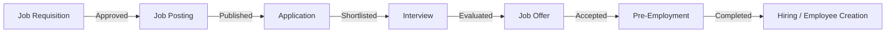

# Recruitment Module -- Full Gap Analysis and Audit

## Executive Summary

After a deep code-level analysis of the entire Recruitment module (backend services, controllers, routes, policies, enums, state machines, frontend pages, hooks, components, and router config), this document catalogs every gap, missing UI action, dead-end workflow, risk, and inconsistency found. Items are grouped by severity.

---

## Module Architecture Overview

---

## CRITICAL GAPS -- Missing UI Actions and Dead Ends

### GAP-01: No "Add Application" / "New Application" button anywhere
- **Location**: [`ApplicationsTab()`](frontend/src/pages/hr/recruitment/RecruitmentPage.tsx:348) and [`ApplicationListPage`](frontend/src/pages/hr/recruitment/ApplicationListPage.tsx:6)
- **Problem**: The backend has a full [`store()`](app/Http/Controllers/HR/Recruitment/ApplicationController.php:36) endpoint and the hook [`useCreateApplication()`](frontend/src/hooks/useRecruitment.ts:163) exists, but **no button or form page** exists to actually create an application. HR staff cannot manually add a walk-in applicant.
- **Impact**: Dead feature -- applications can only be created via API/seeder, never through the UI.
- **Fix**: Create an `ApplicationFormPage.tsx` with candidate info fields, posting selector, resume upload, and source dropdown. Add a "New Application" button to the Applications tab header.

### GAP-02: No "Schedule Interview" button from Application Detail
- **Location**: [`ApplicationDetailPage`](frontend/src/pages/hr/recruitment/ApplicationDetailPage.tsx:137)
- **Problem**: The Interviews tab inside Application Detail only displays existing interviews. There is **no button to schedule a new interview** for a shortlisted candidate. The backend [`InterviewController::store()`](app/Http/Controllers/HR/Recruitment/InterviewController.php:34) and hook [`useScheduleInterview()`](frontend/src/hooks/useRecruitment.ts:196) exist but are not wired to any UI.
- **Impact**: HR cannot schedule interviews from the application context, which is the natural workflow.
- **Fix**: Add a "Schedule Interview" button/modal in the interviews tab of ApplicationDetailPage when status is `shortlisted` or `under_review`.

### GAP-03: No "Create Offer" button from Application Detail
- **Location**: [`ApplicationDetailPage`](frontend/src/pages/hr/recruitment/ApplicationDetailPage.tsx:174)
- **Problem**: The Offer tab shows offer details if one exists, or "No offer created yet." There is **no button to create an offer**. The backend [`OfferController::store()`](app/Http/Controllers/HR/Recruitment/OfferController.php:35) and hook [`useCreateOffer()`](frontend/src/hooks/useRecruitment.ts:242) exist but are never triggered from UI.
- **Impact**: Offers cannot be created from the UI. The entire offer flow is inaccessible.
- **Fix**: Add a "Prepare Offer" button/modal in the offer tab when the application is shortlisted and has completed interviews with positive evaluations.

### GAP-04: No "Init Pre-Employment Checklist" button
- **Location**: [`ApplicationDetailPage`](frontend/src/pages/hr/recruitment/ApplicationDetailPage.tsx:216) documents tab
- **Problem**: The documents tab shows pre-employment checklist if it exists, but there is **no button to initialize one**. Backend route [`POST pre-employment/{application}/init`](routes/api/v1/recruitment.php:95) exists but no UI triggers it.
- **Impact**: Pre-employment checklist cannot be started from the UI.
- **Fix**: Add an "Initialize Pre-Employment Checklist" button when offer is accepted and no checklist exists.

### GAP-05: No document upload/verify/reject/waive UI for Pre-Employment
- **Location**: [`ApplicationDetailPage`](frontend/src/pages/hr/recruitment/ApplicationDetailPage.tsx:233) documents tab
- **Problem**: Pre-employment requirements are displayed as a list with status badges, but there are **no action buttons** to submit documents, verify them, reject them, or waive requirements. All backend endpoints exist ([`PreEmploymentController`](app/Http/Controllers/HR/Recruitment/PreEmploymentController.php:45)).
- **Impact**: The entire pre-employment document workflow is view-only -- no actions possible.
- **Fix**: Add upload button per requirement, verify/reject/waive action buttons for HR reviewers, and a "Mark Complete" button for the checklist.

### GAP-06: No Interview action buttons (Cancel / No-Show / Complete / Reschedule)
- **Location**: [`InterviewDetailPage`](frontend/src/pages/hr/recruitment/InterviewDetailPage.tsx:8)
- **Problem**: The interview detail page shows details and evaluation form, but has **no buttons for**: cancel interview, mark no-show, complete interview, or reschedule. All backend endpoints exist in [`InterviewController`](app/Http/Controllers/HR/Recruitment/InterviewController.php:66).
- **Impact**: Interviewers/HR cannot manage interview lifecycle from the UI.
- **Fix**: Add action buttons based on current interview status (scheduled -> cancel/no-show/complete, etc.).

---

## HIGH-SEVERITY GAPS -- Workflow and Data Issues

### GAP-07: Job Posting Form requires raw integer ID instead of ULID/dropdown
- **Location**: [`JobPostingFormPage`](frontend/src/pages/hr/recruitment/JobPostingFormPage.tsx:39)
- **Problem**: The requisition field is a raw `<input type="number">` asking for "Requisition ID (integer)". Even though the URL passes a `requisition` ULID query param, the form does not resolve it. Users have no way to know the integer ID.
- **Impact**: Creating job postings is practically broken -- users must guess internal DB IDs.
- **Fix**: Replace with a dropdown/combobox that fetches approved requisitions and displays them by number/position. Auto-fill when coming from requisition detail.

### GAP-08: No "Review" button on Application Detail
- **Location**: [`ApplicationDetailPage`](frontend/src/pages/hr/recruitment/ApplicationDetailPage.tsx:34)
- **Problem**: There is a Shortlist button and a Reject button, but **no explicit "Mark as Under Review" button**. The backend [`review()`](app/Http/Controllers/HR/Recruitment/ApplicationController.php:61) endpoint exists. The shortlist action auto-reviews, but for proper workflow tracking, explicit review should be available.
- **Impact**: The `under_review` status is only reachable via the shortlist auto-transition, bypassing explicit review logging.
- **Fix**: Add a "Start Review" button visible when status is `new`.

### GAP-09: No "Withdraw Application" button on Application Detail
- **Location**: [`ApplicationDetailPage`](frontend/src/pages/hr/recruitment/ApplicationDetailPage.tsx)
- **Problem**: Backend has [`withdraw()`](app/Http/Controllers/HR/Recruitment/ApplicationController.php:86) endpoint and route, but there is no withdraw button in the UI.
- **Impact**: Applications cannot be withdrawn from the frontend.
- **Fix**: Add "Withdraw" button with reason textarea, visible when status is not terminal.

### GAP-10: ApplicationStatus enum missing `hired` status
- **Location**: [`ApplicationStatus`](app/Domains/HR/Recruitment/Enums/ApplicationStatus.php:7)
- **Problem**: The enum has `new`, `under_review`, `shortlisted`, `rejected`, `withdrawn`. But the frontend checks `app.status !== 'hired'` in [`ApplicationDetailPage:44`](frontend/src/pages/hr/recruitment/ApplicationDetailPage.tsx:44). There is **no `hired` status** in the enum, which means the "Hire Candidate" button condition may never properly toggle off after hiring.
- **Impact**: After hiring, the application status stays `shortlisted` -- the "Hire Candidate" button may remain visible.
- **Fix**: Add `Hired` case to `ApplicationStatus` enum and transition application to `hired` after successful hire in `HiringService`.

### GAP-11: Requisition "On Hold" status has no UI trigger
- **Location**: [`RequisitionStatus`](app/Domains/HR/Recruitment/Enums/RequisitionStatus.php:14)
- **Problem**: The enum defines `on_hold` status but there is **no route, controller method, or UI button** to put a requisition on hold.
- **Impact**: Dead status -- unusable.
- **Fix**: Add a `hold`/`resume` endpoint and corresponding UI buttons on the requisition detail page.

### GAP-12: No "Cancel Requisition" button in UI
- **Location**: [`RequisitionDetailPage`](frontend/src/pages/hr/recruitment/RequisitionDetailPage.tsx)
- **Problem**: Backend has [`cancel()`](app/Http/Controllers/HR/Recruitment/RequisitionController.php:95) route but the detail page has no cancel button. Requisitions can never be cancelled from UI.
- **Impact**: Dead functionality.
- **Fix**: Add a "Cancel Requisition" button with reason field, conditionally shown.

### GAP-13: Duplicate legacy standalone pages never used
- **Location**: [`ApplicationListPage.tsx`](frontend/src/pages/hr/recruitment/ApplicationListPage.tsx), [`InterviewListPage.tsx`](frontend/src/pages/hr/recruitment/InterviewListPage.tsx), [`CandidateListPage.tsx`](frontend/src/pages/hr/recruitment/CandidateListPage.tsx), [`OfferListPage.tsx`](frontend/src/pages/hr/recruitment/OfferListPage.tsx), [`RequisitionListPage.tsx`](frontend/src/pages/hr/recruitment/RequisitionListPage.tsx), [`RecruitmentDashboard.tsx`](frontend/src/pages/hr/recruitment/RecruitmentDashboard.tsx), [`PipelineReportPage.tsx`](frontend/src/pages/hr/recruitment/PipelineReportPage.tsx)
- **Problem**: These standalone pages duplicate functionality already present in the consolidated [`RecruitmentPage.tsx`](frontend/src/pages/hr/recruitment/RecruitmentPage.tsx) tabs. They are not referenced in the router.
- **Impact**: Dead code, maintenance burden, potential confusion.
- **Fix**: Remove or redirect these legacy pages.

---

## MEDIUM-SEVERITY GAPS -- UX, Authorization, and Data Issues

### GAP-14: Salary input in centavos is confusing for users
- **Location**: [`RequisitionFormPage`](frontend/src/pages/hr/recruitment/RequisitionFormPage.tsx:187) and offer creation
- **Problem**: Users must enter salary as centavos (e.g., 2000000 for PHP 20,000). This is error-prone and unintuitive.
- **Fix**: Add a peso input that auto-converts to centavos, or show a live-formatted preview next to the input.

### GAP-15: Interview calendar view is a placeholder
- **Location**: [`InterviewListPage:101`](frontend/src/pages/hr/recruitment/InterviewListPage.tsx:101)
- **Problem**: Calendar toggle exists but shows "Calendar view coming soon." The same placeholder exists in the consolidated `RecruitmentPage` interviews tab (no calendar at all there).
- **Fix**: Implement an actual calendar view or remove the toggle.

### GAP-16: No pagination on Applications, Interviews, Offers, Candidates tabs
- **Location**: [`RecruitmentPage.tsx`](frontend/src/pages/hr/recruitment/RecruitmentPage.tsx) -- ApplicationsTab, InterviewsTab, OffersTab, CandidatesTab
- **Problem**: Only the Requisitions tab has pagination. All other tabs load data but have no pagination controls.
- **Fix**: Add `<Pagination>` component to all tabs.

### GAP-17: No "Create Candidate" button -- candidates only created via applications
- **Location**: [`CandidatesTab`](frontend/src/pages/hr/recruitment/RecruitmentPage.tsx:544)
- **Problem**: The Candidate Pool tab is view-only. There is no way to add a candidate directly. Backend only creates candidates via `ApplicationService::apply()`.
- **Fix**: Consider adding a "Add Candidate to Pool" button for proactive sourcing/talent pool building.

### GAP-18: InterviewController authorization is too loose
- **Location**: [`InterviewController`](app/Http/Controllers/HR/Recruitment/InterviewController.php:49)
- **Problem**: Update, cancel, markNoShow, and complete all use `$this->authorize('create', InterviewSchedule::class)` instead of proper ability names like `update`, `cancel`, etc.
- **Impact**: Any user who can create interviews can also cancel/modify them -- no proper SoD.
- **Fix**: Add proper policy methods for each action.

### GAP-19: OfferController `accept()` has no authorization check
- **Location**: [`OfferController::accept()`](app/Http/Controllers/HR/Recruitment/OfferController.php:73)
- **Problem**: The `accept` method calls `$this->service->acceptOffer()` without any `$this->authorize()` call. Any authenticated user with HR module access could accept an offer.
- **Impact**: Security risk -- missing authorization.
- **Fix**: Add proper authorization.

### GAP-20: OfferController `reject()` has no authorization check
- **Location**: [`OfferController::reject()`](app/Http/Controllers/HR/Recruitment/OfferController.php:78)
- **Problem**: Same as GAP-19 -- no authorization.
- **Fix**: Add proper authorization.

### GAP-21: ApplicationController `withdraw()` has no authorization check
- **Location**: [`ApplicationController::withdraw()`](app/Http/Controllers/HR/Recruitment/ApplicationController.php:86)
- **Problem**: No `$this->authorize()` call. Any authenticated user could withdraw any application.
- **Fix**: Add proper authorization check.

### GAP-22: InterviewController `store()` has no authorization check
- **Location**: [`InterviewController::store()`](app/Http/Controllers/HR/Recruitment/InterviewController.php:34)
- **Problem**: No `$this->authorize()` before creating interview. Missing gate check.
- **Fix**: Add authorization.

### GAP-23: No edit capability for Job Postings
- **Location**: [`JobPostingDetailPage`](frontend/src/pages/hr/recruitment/JobPostingDetailPage.tsx)
- **Problem**: Job postings can be created and have publish/close actions, but there is no edit route, no edit page, and no "Edit" button. Once created, the posting content cannot be corrected.
- **Fix**: Add an edit page and route similar to requisitions.

### GAP-24: No "Add Application" button from Job Posting Detail
- **Location**: [`JobPostingDetailPage`](frontend/src/pages/hr/recruitment/JobPostingDetailPage.tsx:44)
- **Problem**: There is a "View Applications" link but no way to add an application for this specific posting.
- **Fix**: Add "Add Application" button that pre-fills the posting.

---

## LOW-SEVERITY GAPS -- Polish and Robustness

### GAP-25: Pervasive `any` type usage across all frontend pages
- **Problem**: Nearly every `.map()` in all recruitment pages uses `eslint-disable @typescript-eslint/no-explicit-any`. No typed interfaces are used for list rendering.
- **Fix**: Define proper TypeScript interfaces for all response shapes.

### GAP-26: No error handling or toast notifications on most actions
- **Location**: [`ApplicationDetailPage`](frontend/src/pages/hr/recruitment/ApplicationDetailPage.tsx), [`JobPostingDetailPage`](frontend/src/pages/hr/recruitment/JobPostingDetailPage.tsx), [`OfferDetailPage`](frontend/src/pages/hr/recruitment/OfferDetailPage.tsx)
- **Problem**: Action mutations (`action.mutate()`) are called without `.catch()` or `onError` handling. Failures show no feedback to the user.
- **Fix**: Add `toast.error()` on mutation errors, similar to [`RequisitionDetailPage`](frontend/src/pages/hr/recruitment/RequisitionDetailPage.tsx:23) which does this correctly.

### GAP-27: No confirmation dialogs for destructive actions
- **Problem**: Reject, cancel, withdraw, and close actions execute immediately on click with no "Are you sure?" confirmation.
- **Fix**: Add confirmation modals for all destructive actions.

### GAP-28: CandidateProfilePage does not show resume or allow editing
- **Location**: [`CandidateProfilePage`](frontend/src/pages/hr/recruitment/CandidateProfilePage.tsx)
- **Problem**: Shows basic info and application history. No resume download link, no edit button (though backend `PATCH` exists).
- **Fix**: Add resume download and inline edit functionality.

### GAP-29: HiringService uses hardcoded fallback date_of_birth
- **Location**: [`HiringService::hire()`](app/Domains/HR/Recruitment/Services/HiringService.php:72)
- **Problem**: `'date_of_birth' => $data['date_of_birth'] ?? '1990-01-01'` -- creates fake employee data if not provided.
- **Fix**: Make `date_of_birth` required in [`HireRequest`](app/Http/Requests/HR/Recruitment/HireRequest.php) validation, or collect it during hiring.

### GAP-30: No "Reopen" action for closed/expired postings
- **Problem**: Once a posting is closed or expired, there is no way to reopen it. This may be intentional, but limits operational flexibility.
- **Fix**: Consider adding a reopen flow or allowing re-creation from the same requisition.

### GAP-31: No bulk actions on any list view
- **Problem**: No ability to bulk reject applications, bulk cancel interviews, etc.
- **Fix**: Add checkbox selection and bulk action toolbar on list views.

### GAP-32: Dashboard KPIs not refreshing on mutations
- **Problem**: Dashboard data is cached and may not reflect recent actions immediately.
- **Fix**: Add dashboard query key invalidation on relevant mutations (partially done in some hooks).

### GAP-33: No loading/disabled states on many action buttons
- **Problem**: Several action buttons in [`JobPostingDetailPage`](frontend/src/pages/hr/recruitment/JobPostingDetailPage.tsx) and [`ApplicationDetailPage`](frontend/src/pages/hr/recruitment/ApplicationDetailPage.tsx) don't show loading state during API calls.
- **Fix**: Wire `action.isPending` to disabled state and show spinner.

---

## Workflow Dead Ends Summary

| Scenario | What happens | What should happen |
|----------|-------------|-------------------|
| Walk-in applicant arrives | No way to add them | "New Application" form should exist |
| Application shortlisted, need interview | No schedule button | "Schedule Interview" modal from app detail |
| Interview done, need to make offer | No create offer button | "Prepare Offer" modal from app detail |
| Offer accepted, need pre-employment | No init button | "Start Pre-Employment" button |
| Pre-employment docs submitted | Cannot verify/reject in UI | Action buttons per requirement |
| Need to cancel a requisition | No cancel button | Add cancel with reason |
| Need to put requisition on hold | Status exists, no action | Add hold/resume actions |
| Need to reschedule interview | No reschedule button | Add reschedule form/modal |
| Need to withdraw an application | No withdraw button | Add withdraw with reason |

---

## Recommended Fix Priority

### Phase 1 -- Unblock Core Workflow
- [ ] GAP-01: Add Application form page and "New Application" button
- [ ] GAP-02: Add "Schedule Interview" modal on Application Detail
- [ ] GAP-03: Add "Create Offer" modal on Application Detail
- [ ] GAP-04: Add "Init Pre-Employment" button
- [ ] GAP-05: Add document upload/verify/reject/waive actions
- [ ] GAP-06: Add interview lifecycle action buttons
- [ ] GAP-07: Fix Job Posting form requisition selector

### Phase 2 -- Fix Authorization and Security
- [ ] GAP-18: Fix InterviewController authorization
- [ ] GAP-19: Add authorization to OfferController accept
- [ ] GAP-20: Add authorization to OfferController reject
- [ ] GAP-21: Add authorization to ApplicationController withdraw
- [ ] GAP-22: Add authorization to InterviewController store

### Phase 3 -- Complete Missing Workflow Actions
- [ ] GAP-08: Add explicit "Review" button
- [ ] GAP-09: Add "Withdraw Application" button
- [ ] GAP-10: Add `hired` status to ApplicationStatus enum
- [ ] GAP-11: Add On Hold/Resume for requisitions
- [ ] GAP-12: Add Cancel Requisition button
- [ ] GAP-23: Add edit capability for Job Postings
- [ ] GAP-24: Add "Add Application" from posting detail

### Phase 4 -- UX Polish
- [ ] GAP-14: Fix salary centavos input UX
- [ ] GAP-15: Implement or remove calendar view
- [ ] GAP-16: Add pagination to all tabs
- [ ] GAP-17: Add "Create Candidate" for talent pool
- [ ] GAP-25: Replace `any` types with proper interfaces
- [ ] GAP-26: Add error toasts to all mutations
- [ ] GAP-27: Add confirmation dialogs for destructive actions
- [ ] GAP-28: Add resume download and candidate editing
- [ ] GAP-29: Fix HiringService hardcoded fallbacks
- [ ] GAP-30: Consider reopen for postings
- [ ] GAP-31: Add bulk actions
- [ ] GAP-32: Dashboard cache invalidation
- [ ] GAP-33: Loading states on all action buttons

### Cleanup
- [ ] GAP-13: Remove or consolidate legacy standalone pages
