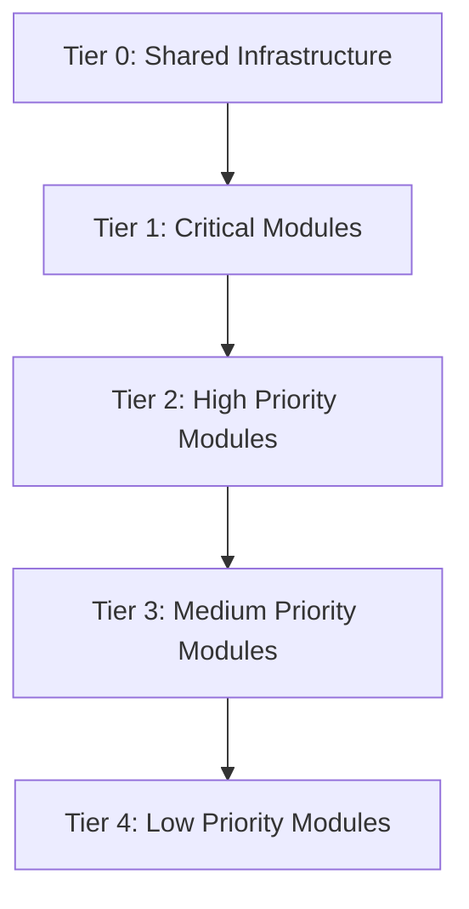
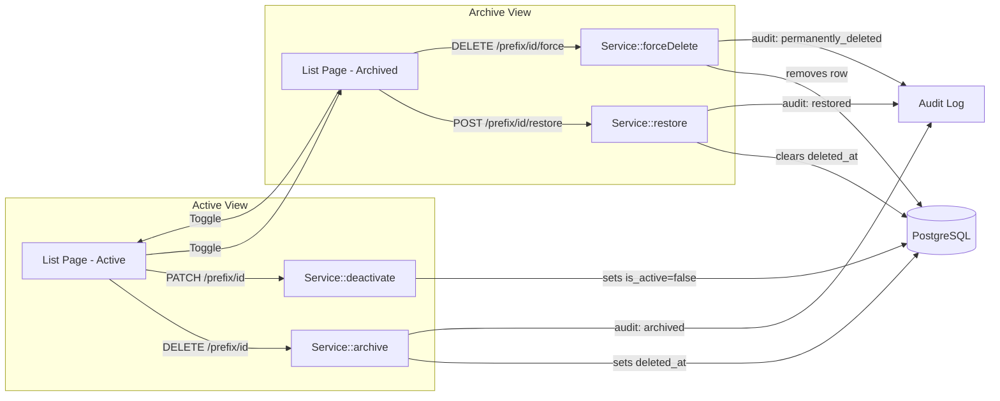

# Soft-Delete & Archive Implementation Plan

## Phase 0 -- Discovery Summary

### 0A. Model Inventory

**119 Eloquent models** discovered across 21 domain modules. The bulk migration [`2026_03_07_200000_add_soft_deletes_to_all_tables.php`](database/migrations/2026_03_07_200000_add_soft_deletes_to_all_tables.php:1) added `deleted_at` to ~45 tables. Combined with individual migrations, **~70 tables already have `deleted_at` columns**.

However, only **12 models** currently use the `SoftDeletes` trait in their class body, and **~27 models** import `SoftDeletes` but many may not actually apply it as a trait.

#### Models WITH SoftDeletes Trait (confirmed 12)

| Model | Domain | Has deleted_at migration | Notes |
|-------|--------|------------------------|-------|
| [`BirFiling`](app/Domains/Tax/Models/BirFiling.php:50) | Tax | Yes | |
| [`InspectionTemplateItem`](app/Domains/QC/Models/InspectionTemplateItem.php:13) | QC | Yes | Child row |
| [`BomComponent`](app/Domains/Production/Models/BomComponent.php:26) | Production | Yes | Child row |
| [`PurchaseRequestItem`](app/Domains/Procurement/Models/PurchaseRequestItem.php:26) | Procurement | Yes | Child row |
| [`PurchaseOrderItem`](app/Domains/Procurement/Models/PurchaseOrderItem.php:30) | Procurement | Yes | Child row |
| [`GoodsReceiptItem`](app/Domains/Procurement/Models/GoodsReceiptItem.php:25) | Procurement | Yes | Child row |
| [`DeliveryReceiptItem`](app/Domains/Delivery/Models/DeliveryReceiptItem.php:24) | Delivery | Yes | Child row |
| [`ClientOrder`](app/Domains/CRM/Models/ClientOrder.php:24) | CRM | Yes | |
| [`CostCenter`](app/Domains/Budget/Models/CostCenter.php:41) | Budget | Yes | |
| [`AnnualBudget`](app/Domains/Budget/Models/AnnualBudget.php:45) | Budget | Yes | |
| [`WarehouseLocation`](app/Domains/Inventory/Models/WarehouseLocation.php:24) | Inventory | Yes | |
| [`MaterialRequisitionItem`](app/Domains/Inventory/Models/MaterialRequisitionItem.php:22) | Inventory | Yes | Child row |

#### Models that IMPORT SoftDeletes but MAY NOT use the trait (gap -- needs trait addition)

| Model | Domain | Has deleted_at migration |
|-------|--------|------------------------|
| [`Vendor`](app/Domains/AP/Models/Vendor.php:15) | AP | Yes |
| [`VendorInvoice`](app/Domains/AP/Models/VendorInvoice.php:17) | AP | Yes |
| [`Customer`](app/Domains/AR/Models/Customer.php:16) | AR | Yes |
| [`CustomerInvoice`](app/Domains/AR/Models/CustomerInvoice.php:14) | AR | Yes |
| [`CustomerPayment`](app/Domains/AR/Models/CustomerPayment.php:10) | AR | Yes |
| [`CustomerAdvancePayment`](app/Domains/AR/Models/CustomerAdvancePayment.php:10) | AR | Yes |
| [`ItemMaster`](app/Domains/Inventory/Models/ItemMaster.php:14) | Inventory | Yes |
| [`LotBatch`](app/Domains/Inventory/Models/LotBatch.php:11) | Inventory | Yes |
| [`PurchaseRequest`](app/Domains/Procurement/Models/PurchaseRequest.php:14) | Procurement | Yes |
| [`PurchaseOrder`](app/Domains/Procurement/Models/PurchaseOrder.php:15) | Procurement | Yes |
| [`GoodsReceipt`](app/Domains/Procurement/Models/GoodsReceipt.php:14) | Procurement | Yes |
| [`BillOfMaterials`](app/Domains/Production/Models/BillOfMaterials.php:14) | Production | Yes |
| [`ProductionOrder`](app/Domains/Production/Models/ProductionOrder.php:17) | Production | Yes |
| [`ProductionOutputLog`](app/Domains/Production/Models/ProductionOutputLog.php:12) | Production | Yes |
| [`DeliverySchedule`](app/Domains/Production/Models/DeliverySchedule.php:15) | Production | Yes |
| [`CombinedDeliverySchedule`](app/Domains/Production/Models/CombinedDeliverySchedule.php:16) | Production | Yes |
| [`DeliveryReceipt`](app/Domains/Delivery/Models/DeliveryReceipt.php:19) | Delivery | Yes |
| [`DeliveryRoute`](app/Domains/Delivery/Models/DeliveryRoute.php:11) | Delivery | Yes |
| [`Vehicle`](app/Domains/Delivery/Models/Vehicle.php:10) | Delivery | Yes |
| [`ImpexDocument`](app/Domains/Delivery/Models/ImpexDocument.php:11) | Delivery | Yes |
| [`Inspection`](app/Domains/QC/Models/Inspection.php:16) | QC | Yes |
| [`InspectionResult`](app/Domains/QC/Models/InspectionResult.php:9) | QC | Yes |
| [`InspectionTemplate`](app/Domains/QC/Models/InspectionTemplate.php:12) | QC | Yes |
| [`Equipment`](app/Domains/Maintenance/Models/Equipment.php:15) | Maintenance | Yes |
| [`MoldMaster`](app/Domains/Mold/Models/MoldMaster.php:13) | Mold | Yes |
| [`MoldShotLog`](app/Domains/Mold/Models/MoldShotLog.php:10) | Mold | Yes |
| [`Ticket`](app/Domains/CRM/Models/Ticket.php:14) | CRM | Yes |
| [`PayPeriod`](app/Domains/Payroll/Models/PayPeriod.php:11) | Payroll | Yes |
| [`Position`](app/Domains/HR/Models/Position.php:10) | HR | Yes |

#### Models WITHOUT SoftDeletes and WITHOUT deleted_at -- Need BOTH migration and trait

| Model | Domain | Priority |
|-------|--------|----------|
| [`User`](app/Models/User.php:48) | Core | Critical -- has deleted_at migration but no SoftDeletes trait |
| [`Employee`](app/Domains/HR/Models/Employee.php:95) | HR | Critical -- has deleted_at migration, has PG trigger preventing hard delete, needs trait |
| [`Department`](app/Domains/HR/Models/Department.php:34) | HR | High -- has deleted_at migration, needs trait |
| [`SalaryGrade`](app/Domains/HR/Models/SalaryGrade.php:29) | HR | Medium |
| [`ChartOfAccount`](app/Domains/Accounting/Models/ChartOfAccount.php:38) | Accounting | High -- has archive logic but no SoftDeletes trait |
| [`JournalEntry`](app/Domains/Accounting/Models/JournalEntry.php:43) | Accounting | High |
| [`BankAccount`](app/Domains/Accounting/Models/BankAccount.php:32) | Accounting | High |
| [`BankReconciliation`](app/Domains/Accounting/Models/BankReconciliation.php:42) | Accounting | Medium |
| [`RecurringJournalTemplate`](app/Domains/Accounting/Models/RecurringJournalTemplate.php:34) | Accounting | Medium |
| [`FiscalPeriod`](app/Domains/Accounting/Models/FiscalPeriod.php:32) | Accounting | Low -- reference data |
| [`Loan`](app/Domains/Loan/Models/Loan.php:75) | Loan | Medium |
| [`LoanType`](app/Domains/Loan/Models/LoanType.php:31) | Loan | Low -- reference data |
| [`LeaveType`](app/Domains/Leave/Models/LeaveType.php:35) | Leave | Low -- reference data |
| [`LeaveRequest`](app/Domains/Leave/Models/LeaveRequest.php:68) | Leave | Medium |
| [`LeaveBalance`](app/Domains/Leave/Models/LeaveBalance.php:38) | Leave | Low |
| [`PayrollRun`](app/Domains/Payroll/Models/PayrollRun.php:74) | Payroll | High |
| [`PayrollAdjustment`](app/Domains/Payroll/Models/PayrollAdjustment.php:34) | Payroll | Medium |
| [`SalesOrder`](app/Domains/Sales/Models/SalesOrder.php:46) | Sales | High |
| [`Quotation`](app/Domains/Sales/Models/Quotation.php:44) | Sales | High |
| [`PriceList`](app/Domains/Sales/Models/PriceList.php:34) | Sales | Medium |
| [`VendorRfq`](app/Domains/Procurement/Models/VendorRfq.php:33) | Procurement | Medium |
| [`BlanketPurchaseOrder`](app/Domains/Procurement/Models/BlanketPurchaseOrder.php:38) | Procurement | Medium |
| [`VendorPayment`](app/Domains/AP/Models/VendorPayment.php:31) | AP | Medium |
| [`VendorCreditNote`](app/Domains/AP/Models/VendorCreditNote.php:35) | AP | Medium |
| [`EwtRate`](app/Domains/AP/Models/EwtRate.php:25) | AP | Low -- reference data |
| [`PaymentBatch`](app/Domains/AP/Models/PaymentBatch.php:37) | AP | Medium |
| [`CustomerCreditNote`](app/Domains/AR/Models/CustomerCreditNote.php:35) | AR | Medium |
| [`FixedAsset`](app/Domains/FixedAssets/Models/FixedAsset.php:48) | FixedAssets | High |
| [`FixedAssetCategory`](app/Domains/FixedAssets/Models/FixedAssetCategory.php:34) | FixedAssets | Medium |
| [`AssetDisposal`](app/Domains/FixedAssets/Models/AssetDisposal.php:33) | FixedAssets | Medium |
| [`Shipment`](app/Domains/Delivery/Models/Shipment.php:34) | Delivery | Medium |
| [`NonConformanceReport`](app/Domains/QC/Models/NonConformanceReport.php:33) | QC | Medium |
| [`CapaAction`](app/Domains/QC/Models/CapaAction.php:36) | QC | Medium |
| [`MaintenanceWorkOrder`](app/Domains/Maintenance/Models/MaintenanceWorkOrder.php:41) | Maintenance | Medium |

#### Immutable/Ledger Models -- EXCLUDED from soft-delete (by design)

| Model | Reason |
|-------|--------|
| `StockLedger` | Immutable audit ledger |
| `AttendanceLog` | Immutable time record |
| `JournalEntryLine` | Immutable GL line |
| `BankTransaction` | Immutable bank record |
| `PayrollDetail` | Immutable payroll record |
| `VatLedger` | Immutable tax ledger |
| `PayrollRunApproval` | Immutable approval record |
| `PayrollRunExclusion` | Operational exclusion |
| `ThirteenthMonthAccrual` | Computed accrual |
| `StockBalance` | Computed snapshot |
| `StockReservation` | Transient reservation |
| `PhysicalCount` / `PhysicalCountItem` | Immutable count record |
| Contribution tables: `SssContributionTable`, `PhilhealthPremiumTable`, `PagibigContributionTable`, `TrainTaxBracket`, `MinimumWageRate` | Government rate tables |
| `DunningLevel`, `DunningNotice` | AR dunning process records |
| `AssetDepreciationEntry` | Immutable depreciation |
| Child item models: `SalesOrderItem`, `QuotationItem`, `PriceListItem`, `WorkOrderPart`, `ClientOrderItem`, `VendorRfqVendor`, `VendorItem`, `VendorFulfillmentNote`, `PaymentBatchItem` | Cascade with parent |
| Activity/log models: `CrmActivity`, `ClientOrderActivity`, `ClientOrderDeliverySchedule`, `EmployeeClearance`, `EmployeeDocument`, `TimesheetApproval`, `PmSchedule` | Process records |

---

### 0B. Frontend List Pages Inventory

| Page | Route | Has Archive Toggle | Archive Pattern |
|------|-------|--------------------|-----------------|
| [`EmployeeListPage`](frontend/src/pages/hr/EmployeeListPage.tsx) | /hr/employees | No | Missing |
| [`DepartmentsPage`](frontend/src/pages/hr/DepartmentsPage.tsx) | /hr/departments | No | Missing |
| [`PositionsPage`](frontend/src/pages/hr/PositionsPage.tsx) | /hr/positions | No | Missing |
| [`ItemMasterListPage`](frontend/src/pages/inventory/ItemMasterListPage.tsx) | /inventory/items | Yes | `withArchived` checkbox |
| [`ItemCategoriesPage`](frontend/src/pages/inventory/ItemCategoriesPage.tsx) | /inventory/categories | No | Missing |
| [`WarehouseLocationsPage`](frontend/src/pages/inventory/WarehouseLocationsPage.tsx) | /inventory/warehouses | No | Missing |
| [`MaterialRequisitionListPage`](frontend/src/pages/inventory/MaterialRequisitionListPage.tsx) | /inventory/mrqs | Yes | `withArchived` checkbox |
| [`PurchaseRequestListPage`](frontend/src/pages/procurement/PurchaseRequestListPage.tsx) | /procurement/prs | Yes | `withArchived` checkbox |
| [`PurchaseOrderListPage`](frontend/src/pages/procurement/PurchaseOrderListPage.tsx) | /procurement/pos | Yes | `withArchived` checkbox |
| [`GoodsReceiptListPage`](frontend/src/pages/procurement/GoodsReceiptListPage.tsx) | /procurement/grs | Yes | `withArchived` checkbox |
| [`VendorRfqListPage`](frontend/src/pages/procurement/VendorRfqListPage.tsx) | /procurement/rfqs | No | Missing |
| [`BomListPage`](frontend/src/pages/production/BomListPage.tsx) | /production/boms | Yes | `withArchived` checkbox |
| [`ProductionOrderListPage`](frontend/src/pages/production/ProductionOrderListPage.tsx) | /production/orders | Yes | `withArchived` checkbox |
| [`DeliveryScheduleListPage`](frontend/src/pages/production/DeliveryScheduleListPage.tsx) | /production/schedules | Yes | `withArchived` checkbox |
| [`DeliveryReceiptListPage`](frontend/src/pages/delivery/DeliveryReceiptListPage.tsx) | /delivery/receipts | Yes | `withArchived` checkbox |
| [`ShipmentsPage`](frontend/src/pages/delivery/ShipmentsPage.tsx) | /delivery/shipments | No | Missing |
| [`DeliveryRoutesPage`](frontend/src/pages/delivery/DeliveryRoutesPage.tsx) | /delivery/routes | No | Missing |
| [`InspectionListPage`](frontend/src/pages/qc/InspectionListPage.tsx) | /qc/inspections | Yes | `withArchived` checkbox |
| [`NcrListPage`](frontend/src/pages/qc/NcrListPage.tsx) | /qc/ncrs | Yes | `withArchived` checkbox |
| [`QcTemplateListPage`](frontend/src/pages/qc/QcTemplateListPage.tsx) | /qc/templates | Yes | `withArchived` checkbox |
| [`CapaListPage`](frontend/src/pages/qc/CapaListPage.tsx) | /qc/capas | No | Missing |
| [`EquipmentListPage`](frontend/src/pages/maintenance/EquipmentListPage.tsx) | /maintenance/equipment | Yes | `withArchived` checkbox |
| [`WorkOrderListPage`](frontend/src/pages/maintenance/WorkOrderListPage.tsx) | /maintenance/work-orders | Yes | `withArchived` checkbox |
| [`MoldListPage`](frontend/src/pages/mold/MoldListPage.tsx) | /mold/molds | Yes | `withArchived` checkbox |
| [`AccountsPage`](frontend/src/pages/accounting/AccountsPage.tsx) | /accounting/accounts | Yes | `includeArchived` checkbox + Archive button |
| [`VendorsPage`](frontend/src/pages/accounting/VendorsPage.tsx) | /accounting/vendors | No | Has Archive button only |
| [`APInvoicesPage`](frontend/src/pages/accounting/APInvoicesPage.tsx) | /accounting/ap-invoices | No | Missing |
| [`JournalEntriesPage`](frontend/src/pages/accounting/JournalEntriesPage.tsx) | /accounting/journal-entries | No | Missing |
| [`CustomersPage`](frontend/src/pages/ar/CustomersPage.tsx) | /ar/customers | No | Has Archive button only |
| [`CustomerInvoicesPage`](frontend/src/pages/ar/CustomerInvoicesPage.tsx) | /ar/invoices | No | Missing |
| [`SalesOrderListPage`](frontend/src/pages/sales/SalesOrderListPage.tsx) | /sales/orders | No | Missing |
| [`QuotationListPage`](frontend/src/pages/sales/QuotationListPage.tsx) | /sales/quotations | No | Missing |
| [`PayrollRunListPage`](frontend/src/pages/payroll/PayrollRunListPage.tsx) | /payroll/runs | No | Has Archive on detail page |
| [`FixedAssetsPage`](frontend/src/pages/fixed-assets/FixedAssetsPage.tsx) | /fixed-assets | No | Missing |
| [`CostCentersPage`](frontend/src/pages/budget/CostCentersPage.tsx) | /budget/cost-centers | No | Missing |
| [`TicketListPage`](frontend/src/pages/crm/TicketListPage.tsx) | /crm/tickets | No | Missing |
| [`LoanListPage`](frontend/src/pages/hr/loans/LoanListPage.tsx) | /hr/loans | No | Missing |
| [`LeaveListPage`](frontend/src/pages/hr/leave/LeaveListPage.tsx) | /hr/leaves | No | Missing |
| [`UsersPage`](frontend/src/pages/admin/UsersPage.tsx) | /admin/users | Partial | `?archived=1` in API, archive button in UI |
| [`BankAccountsPage`](frontend/src/pages/banking/BankAccountsPage.tsx) | /banking/accounts | No | Missing |

---

### 0C. Delete Endpoint Inventory

| Route | Method | Current Behavior | Gap |
|-------|--------|-----------------|-----|
| `DELETE /qc/templates/{id}` | `InspectionTemplateController@destroy` | Hard deletes items, then model | Missing soft-delete |
| `DELETE /qc/inspections/{id}` | `InspectionController@destroy` | Hard deletes results + model | Missing soft-delete |
| `DELETE /production/boms/{id}` | `BomController@destroy` | Sets is_active=false + delete | Conflates status and archive |
| `DELETE /procurement/goods-receipts/{id}` | `GoodsReceiptController@destroy` | Unknown | Needs audit |
| `DELETE /payroll/runs/{id}` | `PayrollRunController@destroy` | Soft delete | OK -- needs restore |
| `DELETE /payroll/adjustments/{id}` | `PayrollAdjustmentController@destroy` | Unknown | Needs audit |
| `DELETE /attendance/shifts/{id}` | Inline closure | Hard delete | Missing soft-delete |
| `DELETE /attendance/shift-assignments/{id}` | Inline closure | Hard delete | Missing soft-delete |
| `DELETE /attendance/overtime-requests/{id}` | `OvertimeRequestController@cancel` | Status cancel, not delete | OK semantically |
| `DELETE /loans/{id}` | `LoanController@cancel` | Status cancel, not delete | OK semantically |
| `DELETE /ar/customers/{id}` | `CustomerController@destroy` | is_active=false + delete | Conflates status and archive |
| `DELETE /leave/requests/{id}` | `LeaveRequestController@cancel` | Status cancel, not delete | OK semantically |
| `DELETE /admin/users/{id}` | Inline closure | Revokes tokens + delete | Missing SoftDeletes trait on User |
| `DELETE /hr/departments/{id}` | Inline closure | Hard delete | Missing soft-delete |
| `DELETE /hr/positions/{id}` | Inline closure | Hard delete | Missing soft-delete |
| `DELETE /accounting/accounts/{id}` | `ChartOfAccountController@destroy` | is_active=false + delete | Conflates status and archive |
| `DELETE /accounting/journal-entry-templates/{id}` | `JournalEntryController@deleteTemplate` | Hard delete | Missing soft-delete |
| `DELETE /accounting/recurring-templates/{id}` | `RecurringJournalTemplateController@destroy` | Unknown | Needs audit |
| `DELETE /accounting/vendors/{id}` | `VendorController@destroy` | is_active=false + soft-delete | Conflates status and archive |
| `DELETE /accounting/vendors/{id}/items/{itemId}` | `VendorItemController@destroy` | Hard delete | Missing soft-delete |
| `DELETE /accounting/bank-accounts/{id}` | `BankAccountController@destroy` | Unknown | Needs audit |

---

### 0D. Gap Report

| Module | Backend Gap | Frontend Gap | Priority |
|--------|-------------|--------------|----------|
| **HR - Employee** | Has deleted_at + PG trigger but no SoftDeletes trait; no restore/forceDelete | No archive toggle, no restore UI | Critical |
| **HR - Department** | Has deleted_at but no SoftDeletes trait; inline hard-delete route | No archive toggle | High |
| **HR - Position** | Has deleted_at but no SoftDeletes trait; inline hard-delete route | No archive toggle | High |
| **Accounting - COA** | Has archive logic but no SoftDeletes trait; conflates is_active + delete | Has archive button + checkbox but no restore | High |
| **Accounting - Vendors** | SoftDeletes imported; conflates is_active + delete | Has archive button, no toggle, no restore | High |
| **AR - Customers** | SoftDeletes imported; conflates is_active + delete | Has archive button, no toggle, no restore | High |
| **AR - CustomerInvoice** | SoftDeletes imported; sets status=cancelled + delete | No archive UI at all | High |
| **Procurement - PR/PO/GR** | SoftDeletes imported; no restore/forceDelete routes | Has withArchived checkbox, no restore actions | High |
| **Production - BOM** | SoftDeletes imported; conflates is_active + delete | Has withArchived checkbox, archive button, no restore | High |
| **Production - Orders** | SoftDeletes imported; no restore route | Has withArchived checkbox, no restore actions | Medium |
| **Delivery - Receipts** | SoftDeletes imported; no restore route | Has withArchived checkbox, no restore actions | Medium |
| **QC - All** | Hard deletes in services; SoftDeletes imported | Has withArchived checkbox, no restore actions | High |
| **Maintenance** | SoftDeletes imported; no archive/restore services | Has withArchived checkbox, no restore actions | Medium |
| **Mold** | SoftDeletes imported; no archive/restore services | Has withArchived checkbox, no restore actions | Medium |
| **Sales** | No SoftDeletes; no delete routes | No archive UI | Medium |
| **Payroll - Runs** | Soft-delete works; no restore route | Archive on detail page only, no list toggle | Medium |
| **Fixed Assets** | No SoftDeletes; no delete routes | No archive UI | Medium |
| **Budget** | SoftDeletes active; no restore/forceDelete | No archive UI | Medium |
| **CRM - Tickets** | SoftDeletes imported; no archive/restore | No archive UI | Low |
| **Loans** | No SoftDeletes; cancel != archive | No archive UI | Low |
| **Admin - Users** | Has deleted_at but no SoftDeletes on User model; has ?archived=1 | Partial archive in UsersPage, no restore | High |
| **ALL MODULES** | No restore endpoints exist; no forceDelete endpoints; no archive-specific audit log | No restore buttons; no permanent delete UI; no archive view separation | Critical |

### Key Anti-Pattern: Status + Archive Conflation

These services set `is_active = false` AND call `->delete()` in the same operation, violating Rule 2:

| Service | Method | File |
|---------|--------|------|
| [`VendorService::archive()`](app/Domains/AP/Services/VendorService.php:63) | `is_active=false` + `delete()` | AP |
| [`CustomerService::delete()`](app/Domains/AR/Services/CustomerService.php:110) | `is_active=false` + `delete()` | AR |
| [`ChartOfAccountService::archive()`](app/Domains/Accounting/Services/ChartOfAccountService.php:110) | `is_active=false` + `delete()` | Accounting |
| [`BomService::delete()`](app/Domains/Production/Services/BomService.php:118) | `is_active=false` + `delete()` | Production |

---

## Phase 1 -- Backend Implementation

### 1A. Add SoftDeletes Trait to All Applicable Models

For every model listed in the gap tables above that imports `SoftDeletes` but does not use it as a trait, add `use SoftDeletes;` inside the class body. For models that neither import nor use it, add both the import and the trait.

**Estimated scope: ~50 models**

Models to add `use SoftDeletes;` trait:
- All 27+ models in the "imports but may not use" table
- All 34+ models in the "needs both migration and trait" table
- The `User` model in `app/Models/User.php`

**Exclusions:** Immutable/ledger models and child item models that cascade with parents.

### 1B. Add deleted_at Migrations Where Missing

A few tables still lack `deleted_at`. Create a single new migration:

```
database/migrations/YYYY_MM_DD_HHMMSS_add_soft_deletes_to_remaining_tables.php
```

Tables to check and add if missing:
- `sales_orders`, `quotations`, `price_lists`
- `fixed_assets`, `fixed_asset_categories`, `asset_disposals`
- `journal_entries`, `recurring_journal_templates`
- `blanket_purchase_orders`, `vendor_rfqs`
- Any other table that has a corresponding model needing soft-delete but was not covered by the bulk migration

### 1C. Create Shared ArchiveService Trait

Create a reusable trait for all domain services:

```
app/Shared/Traits/HasArchiveOperations.php
```

This trait provides:
- `archive(Model $model, User $user): void` -- soft-delete with FK check + audit
- `restore(string|int $id, User $user): Model` -- restore from trash + audit
- `forceDelete(string|int $id, User $user): void` -- permanent delete from trash + audit
- `assertNoDependentActiveRecords(Model $model): void` -- FK integrity check
- `listArchived(array $filters): LengthAwarePaginator` -- onlyTrashed query

Each domain service can override `dependentRelationships()` to specify what FK checks apply.

### 1D. Fix Status/Archive Conflation in Existing Services

For each service that currently conflates `is_active = false` with `delete()`:

1. **Separate the archive method** -- `archive()` only calls `delete()` which triggers SoftDeletes, sets `deleted_at`. It does NOT change `is_active`.
2. **Create a deactivate method** -- `deactivate()` only sets `is_active = false`. It does NOT set `deleted_at`.
3. **Create an activate method** -- `activate()` only sets `is_active = true`.

Services to fix:
- [`VendorService`](app/Domains/AP/Services/VendorService.php:63)
- [`CustomerService`](app/Domains/AR/Services/CustomerService.php:110)
- [`ChartOfAccountService`](app/Domains/Accounting/Services/ChartOfAccountService.php:110)
- [`BomService`](app/Domains/Production/Services/BomService.php:118)

### 1E. Fix Hard-Delete in Services

Replace hard-delete calls with soft-delete in these services:

- [`InspectionTemplateService::delete()`](app/Domains/QC/Services/InspectionTemplateService.php:88) -- calls `$template->delete()` without SoftDeletes
- [`InspectionService::void()`](app/Domains/QC/Services/InspectionService.php:111) -- hard-deletes results then model
- Inline route closures in [`attendance.php`](routes/api/v1/attendance.php:144) -- `$shift->delete()` and `$assignment->delete()`
- Inline route closures in [`hr.php`](routes/api/v1/hr.php:109) -- `$department->delete()` and `$position->delete()`

### 1F. Add Restore and ForceDelete Routes

For every resource controller, add these new routes in the corresponding route file:

```
GET    /{prefix}/archived         -- list archived records
POST   /{prefix}/{id}/restore     -- restore from archive
DELETE /{prefix}/{id}/force       -- permanent delete, superadmin only
```

This applies to every route file in `routes/api/v1/`:
- `hr.php` -- employees, departments, positions
- `accounting.php` -- accounts, vendors, journal entries, bank accounts
- `ar.php` -- customers, invoices
- `procurement.php` -- PRs, POs, GRs, RFQs
- `production.php` -- BOMs, production orders, delivery schedules
- `delivery.php` -- receipts, shipments, routes
- `qc.php` -- inspections, NCRs, templates, CAPAs
- `maintenance.php` -- equipment, work orders
- `mold.php` -- mold masters
- `sales.php` -- sales orders, quotations
- `payroll.php` -- payroll runs, adjustments
- `fixed_assets.php` -- assets, categories
- `budget.php` -- cost centers, annual budgets
- `crm.php` -- tickets
- `loans.php` -- loans
- `admin.php` -- users

### 1G. Add Controller Methods

Each resource controller gets:

- `archived(Request $request)` -- returns `onlyTrashed()` paginated
- `restore(Request $request, string $id)` -- calls service restore
- `forceDelete(Request $request, string $id)` -- calls service forceDelete, gated to superadmin

For inline route closures in `hr.php`, `attendance.php`, etc. -- refactor them into proper controller methods.

### 1H. Add Policy Methods

For every Policy class, add:

```php
public function restore(User $user, Model $model): bool
public function forceDelete(User $user, Model $model): bool
```

`forceDelete` must check `$user->hasRole('super_admin')`.

Currently only [`EmployeePolicy`](app/Domains/HR/Policies/EmployeePolicy.php:159) has a `restore` method.

### 1I. Add FK Integrity Checks (Rule 7)

For each parent model, define dependent relationships that must be checked before archiving:

| Parent Model | Dependent Relationships to Check |
|-------------|--------------------------------|
| Department | employees, positions |
| Position | employees |
| Customer | customerInvoices, customerPayments |
| Vendor | vendorInvoices, purchaseOrders |
| ChartOfAccount | children, journalEntryLines |
| ItemMaster | stockBalances, bomComponents, purchaseOrderItems |
| ProductionOrder | outputLogs, materialRequisitions |
| Equipment | maintenanceWorkOrders |
| MoldMaster | moldShotLogs |
| Employee | loans, leaveRequests, payrollDetails |

---

## Phase 2 -- Frontend Implementation

### 2A. Replace withArchived Checkbox with Proper Archive Toggle

The current pattern across ~15 pages uses a `withArchived` checkbox that mixes archived and active records in the same table. This must be replaced with a **dedicated archive view toggle** per the spec.

**Current pattern (wrong):**
```
[x] Show Archived  <-- mixes archived into active list
```

**Target pattern:**
```
[View Archive] / [Back to Active]  <-- separate views with different endpoints
```

#### Create Shared Component: ArchiveToggleButton

```
frontend/src/components/ui/ArchiveToggleButton.tsx
```

Props: `isArchiveView`, `onToggle`, optional `archivedCount`

#### Create Shared Component: ArchiveViewBanner

```
frontend/src/components/ui/ArchiveViewBanner.tsx
```

Renders amber/orange banner: "You are viewing archived records"

### 2B. Refactor Each List Page

For each of the ~38 list pages identified in 0B:

1. Replace `withArchived` state with `isArchiveView` boolean state
2. Switch API endpoint: active list uses `GET /{prefix}`, archive view uses `GET /{prefix}/archived`
3. Use separate query keys: `[module, 'active', filters]` vs `[module, 'archived', filters]`
4. In archive view:
   - Hide "Add New" / create button
   - Hide "Edit" actions
   - Hide status toggle actions
   - Show "Restore" action per row
   - Show "Permanent Delete" action per row for superadmin only
   - Show "Archived On" column with `deleted_at` date
   - Show amber/orange banner
5. In active view:
   - Rename "Delete" to "Archive" where applicable
   - Show confirmation dialog before archiving
   - Keep status toggle (Enable/Disable) separate from Archive
6. Invalidate both query keys after any mutation

### 2C. Pages Requiring the Most Work (no archive UI at all)

These pages need archive toggle added from scratch:
- [`EmployeeListPage`](frontend/src/pages/hr/EmployeeListPage.tsx)
- [`DepartmentsPage`](frontend/src/pages/hr/DepartmentsPage.tsx)
- [`PositionsPage`](frontend/src/pages/hr/PositionsPage.tsx)
- [`SalesOrderListPage`](frontend/src/pages/sales/SalesOrderListPage.tsx)
- [`QuotationListPage`](frontend/src/pages/sales/QuotationListPage.tsx)
- [`CustomerInvoicesPage`](frontend/src/pages/ar/CustomerInvoicesPage.tsx)
- [`APInvoicesPage`](frontend/src/pages/accounting/APInvoicesPage.tsx)
- [`JournalEntriesPage`](frontend/src/pages/accounting/JournalEntriesPage.tsx)
- [`FixedAssetsPage`](frontend/src/pages/fixed-assets/FixedAssetsPage.tsx)
- [`CostCentersPage`](frontend/src/pages/budget/CostCentersPage.tsx)
- [`TicketListPage`](frontend/src/pages/crm/TicketListPage.tsx)
- [`LoanListPage`](frontend/src/pages/hr/loans/LoanListPage.tsx)
- [`LeaveListPage`](frontend/src/pages/hr/leave/LeaveListPage.tsx)
- [`BankAccountsPage`](frontend/src/pages/banking/BankAccountsPage.tsx)
- [`PayrollRunListPage`](frontend/src/pages/payroll/PayrollRunListPage.tsx)

### 2D. Pages Needing Refactor from Checkbox to Toggle

These pages already have `withArchived` but need refactoring to the toggle pattern:
- [`ItemMasterListPage`](frontend/src/pages/inventory/ItemMasterListPage.tsx)
- [`MaterialRequisitionListPage`](frontend/src/pages/inventory/MaterialRequisitionListPage.tsx)
- [`PurchaseRequestListPage`](frontend/src/pages/procurement/PurchaseRequestListPage.tsx)
- [`PurchaseOrderListPage`](frontend/src/pages/procurement/PurchaseOrderListPage.tsx)
- [`GoodsReceiptListPage`](frontend/src/pages/procurement/GoodsReceiptListPage.tsx)
- [`BomListPage`](frontend/src/pages/production/BomListPage.tsx)
- [`ProductionOrderListPage`](frontend/src/pages/production/ProductionOrderListPage.tsx)
- [`DeliveryScheduleListPage`](frontend/src/pages/production/DeliveryScheduleListPage.tsx)
- [`DeliveryReceiptListPage`](frontend/src/pages/delivery/DeliveryReceiptListPage.tsx)
- [`InspectionListPage`](frontend/src/pages/qc/InspectionListPage.tsx)
- [`NcrListPage`](frontend/src/pages/qc/NcrListPage.tsx)
- [`QcTemplateListPage`](frontend/src/pages/qc/QcTemplateListPage.tsx)
- [`EquipmentListPage`](frontend/src/pages/maintenance/EquipmentListPage.tsx)
- [`WorkOrderListPage`](frontend/src/pages/maintenance/WorkOrderListPage.tsx)
- [`MoldListPage`](frontend/src/pages/mold/MoldListPage.tsx)

### 2E. Add Restore and Permanent Delete Hooks

Create shared hooks in a new file or extend existing hook files:

```
frontend/src/hooks/useArchiveActions.ts
```

Provides:
- `useRestore(module, id)` -- calls `POST /{prefix}/{id}/restore`
- `useForceDelete(module, id)` -- calls `DELETE /{prefix}/{id}/force`
- Both invalidate `[module, 'active']` and `[module, 'archived']` query keys

### 2F. Permanent Delete Confirmation Component

Extend [`ConfirmDestructiveDialog`](frontend/src/components/ui/ConfirmDestructiveDialog.tsx:38) or create a variant that requires typing "DELETE" to confirm. The existing component already supports `confirmWord` prop, so it can be reused directly.

### 2G. Empty States

Add empty states to both active and archive views. Create:

```
frontend/src/components/ui/ArchiveEmptyState.tsx
```

---

## Phase 3 -- Status vs Archive Disambiguation

### Matrix Enforcement

| User Action | Button Label | API Call | DB Effect | Where Record Goes |
|-------------|-------------|----------|-----------|-------------------|
| Disable | Disable | `PATCH /{prefix}/{id}` with `{is_active: false}` | `is_active = false` | Stays in active list |
| Enable | Enable | `PATCH /{prefix}/{id}` with `{is_active: true}` | `is_active = true` | Stays in active list |
| Archive | Archive | `DELETE /{prefix}/{id}` | `deleted_at = now()` | Moves to archive view |
| Restore | Restore | `POST /{prefix}/{id}/restore` | `deleted_at = null` | Returns to active list |
| Permanent Delete | Permanently Delete | `DELETE /{prefix}/{id}/force` | Row removed from DB | Gone forever |

### Modules with Conflation Bugs to Fix

1. **Vendors** -- [`VendorService::archive()`](app/Domains/AP/Services/VendorService.php:63) sets `is_active=false` before `delete()`. Fix: remove `is_active=false` from archive; when restoring, `is_active` should remain whatever it was before archiving.

2. **Customers** -- [`CustomerService::delete()`](app/Domains/AR/Services/CustomerService.php:110) same pattern. Fix: same approach.

3. **Chart of Accounts** -- [`ChartOfAccountService::archive()`](app/Domains/Accounting/Services/ChartOfAccountService.php:110) same pattern. Fix: same approach.

4. **BOM** -- [`BomService::delete()`](app/Domains/Production/Services/BomService.php:118) same pattern. Fix: same approach.

5. **UsersPage** -- [`UsersPage`](frontend/src/pages/admin/UsersPage.tsx:542) labels soft-delete as "Archive" but requires typing "DELETE" as confirmation word. Fix: change confirmation word to "ARCHIVE".

---

## Phase 4 -- Audit Log Implementation

### Existing Infrastructure

The project uses `owen-it/laravel-auditing` for general model change auditing. This writes to an `audits` table automatically on model create/update/delete events.

However, the spec requires **explicit action-level audit entries** for archive, restore, and permanent-delete. Two approaches:

### Option A: Extend owen-it Auditing (Recommended)

The `owen-it/laravel-auditing` package automatically captures `deleted` events on models with SoftDeletes. When `forceDelete()` is called, it captures that too. This may already satisfy most audit requirements.

Enhancement needed:
- Add custom audit event types for `restored` action
- Ensure `metadata` field captures the `performed_by` user and reason
- Verify `audits` table schema supports all required fields

### Option B: Dedicated Archive Audit Table

If owen-it auditing does not provide sufficient granularity, create a dedicated service:

```
app/Shared/Services/ArchiveAuditService.php
```

With a new migration for `archive_audit_logs` table:
- `action`: archived / restored / permanently_deleted
- `auditable_type`: model class name
- `auditable_id`: primary key
- `performed_by`: user ID
- `metadata`: JSON with reason, blockers, before/after state
- `performed_at`: timestamp

### Recommendation

Start with **Option A** since the infrastructure already exists. The `owen-it/laravel-auditing` package captures model events including delete and restore. Only add Option B if the existing auditing does not capture sufficient detail for the archive/restore/permanent-delete actions.

---

## Phase 5 -- Implementation Order

### Implementation Tiers



### Tier 0: Shared Infrastructure
- [ ] Create `HasArchiveOperations` trait for services
- [ ] Create `ArchiveToggleButton` shared component
- [ ] Create `ArchiveViewBanner` shared component
- [ ] Create `ArchiveEmptyState` shared component
- [ ] Create `useArchiveActions` shared hook
- [ ] Create migration for any missing `deleted_at` columns
- [ ] Verify owen-it auditing captures delete/restore events
- [ ] Add `SoftDeletes` trait to `User` model

### Tier 1: Critical Modules (highest business impact)
- [ ] HR - Employee: Add SoftDeletes trait, restore/forceDelete routes, archive toggle UI
- [ ] HR - Department: Add SoftDeletes trait, refactor inline route, archive toggle UI
- [ ] HR - Position: Add SoftDeletes trait, refactor inline route, archive toggle UI
- [ ] Accounting - ChartOfAccount: Add SoftDeletes trait, fix status conflation, add restore
- [ ] AP - Vendor: Fix status conflation, add restore/forceDelete, add archive toggle UI
- [ ] AR - Customer: Fix status conflation, add restore/forceDelete, add archive toggle UI
- [ ] Admin - Users: Add SoftDeletes to User model, add restore route, fix UI

### Tier 2: High Priority Modules
- [ ] Procurement - PR/PO/GR: Add SoftDeletes traits, restore/forceDelete routes, refactor UI
- [ ] Production - BOM: Fix status conflation, add restore/forceDelete, refactor UI
- [ ] Production - Orders: Add restore/forceDelete routes, refactor UI
- [ ] QC - Inspections/NCRs/Templates: Fix hard-deletes, add SoftDeletes, refactor UI
- [ ] AR - CustomerInvoice: Add SoftDeletes, restore routes, add archive UI
- [ ] AP - VendorInvoice: Add SoftDeletes, restore routes, add archive UI

### Tier 3: Medium Priority Modules
- [ ] Delivery - Receipts/Shipments/Routes: Add restore/forceDelete, refactor UI
- [ ] Maintenance - Equipment/WorkOrders: Add restore/forceDelete, refactor UI
- [ ] Mold - MoldMaster: Add restore/forceDelete, refactor UI
- [ ] Sales - Orders/Quotations: Add SoftDeletes, all archive infrastructure
- [ ] Payroll - Runs/Adjustments: Add restore route, add archive toggle to list page
- [ ] Fixed Assets: Add SoftDeletes, all archive infrastructure
- [ ] Accounting - JournalEntries/BankAccounts: Add SoftDeletes, archive UI

### Tier 4: Low Priority Modules
- [ ] Budget - CostCenters/AnnualBudgets: Add restore/forceDelete, archive UI
- [ ] CRM - Tickets: Add restore/forceDelete, archive UI
- [ ] Loans: Add SoftDeletes, archive infrastructure
- [ ] Leave - Types/Requests: Add archive infrastructure
- [ ] Attendance - Shifts/Assignments: Replace inline hard-deletes with soft-deletes

---

## Phase 6 -- Verification Checklist

For each module after implementation:

### Backend
- [ ] Model has `use SoftDeletes;` trait
- [ ] Migration has `deleted_at` column (TIMESTAMPTZ, nullable)
- [ ] Service `archive()` does soft delete, not hard delete
- [ ] Service `archive()` checks for active children before proceeding (Rule 7)
- [ ] Service `restore()` exists and restores the record
- [ ] Service `forceDelete()` exists and is superadmin-only
- [ ] All three actions write an audit log entry
- [ ] `GET /archived` route returns only `onlyTrashed()` records
- [ ] `GET /` index route returns only non-deleted records
- [ ] Policy has `restore` and `forceDelete` methods
- [ ] Status change (disable/enable) does NOT touch `deleted_at`
- [ ] Archive does NOT change `is_active`

### Frontend
- [ ] Archive toggle button in page header, not a checkbox
- [ ] Active view shows: Edit, Disable/Enable, Archive
- [ ] Archive view shows: Restore, Permanent Delete (superadmin only)
- [ ] Archive button shows confirmation dialog
- [ ] Permanent Delete button shows text-input confirmation with "DELETE"
- [ ] Archive view has amber/orange visual banner
- [ ] Create/Add button is hidden in archive view
- [ ] Edit action is hidden in archive view
- [ ] Both views have empty states
- [ ] Mutations invalidate both active and archived query keys
- [ ] `deleted_at` displayed as "Archived On" column in archive view
- [ ] Status change button does NOT appear in archive view

---

## Architecture Diagram



---

## Risk Areas

1. **Employee hard-delete prevention trigger** -- The PostgreSQL trigger in [`2026_02_26_000004_add_employee_hard_delete_prevention_trigger.php`](database/migrations/2026_02_26_000004_add_employee_hard_delete_prevention_trigger.php:14) blocks hard-deletes when `deleted_at IS NULL`. This is compatible with the SoftDeletes pattern but needs verification that `forceDelete()` works on already-soft-deleted employees.

2. **Inline route closures** -- Several routes in [`hr.php`](routes/api/v1/hr.php:109) and [`attendance.php`](routes/api/v1/attendance.php:144) use inline closures instead of controllers. These need refactoring to proper controller methods for consistency.

3. **owen-it auditing interaction** -- The `owen-it/laravel-auditing` package fires on model events. Need to verify it correctly distinguishes between soft-delete (`deleted` event) and force-delete, and that it captures the `restore` event.

4. **ULID-based routing** -- Many routes use ULID-based model binding (`{vendor:ulid}`, `{customer:ulid}`). The `onlyTrashed()` scope needs to work with ULID route model binding for restore and forceDelete endpoints.

5. **API cooldown** -- The frontend `api.ts` has a 1500ms cooldown on duplicate POST/PUT/PATCH/DELETE requests. Rapid archive/restore toggling could be silently dropped. Ensure the cooldown does not interfere with archive/restore UX.
