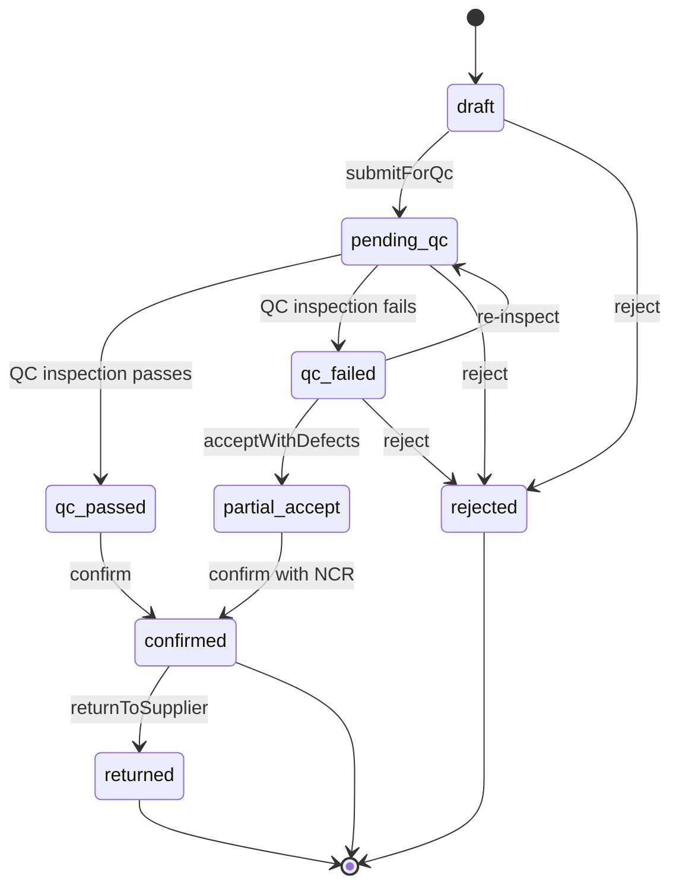
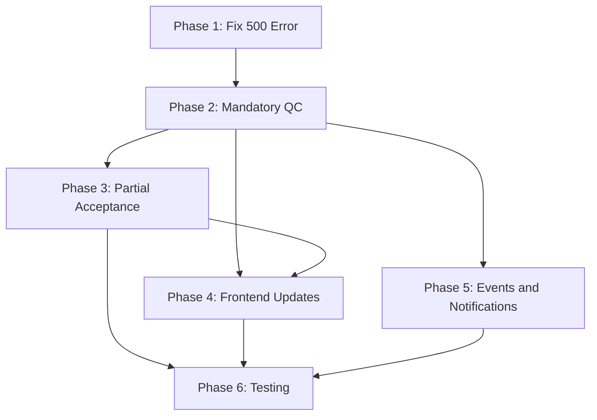

# Supply Chain Module: Fix GR Submit-for-QC Error and Comprehensive Improvements

## 1. Root Cause Analysis: 500 Error on Submit-for-QC

The `POST /api/v1/procurement/goods-receipts/{ulid}/submit-for-qc` endpoint returns a 500 Internal Server Error due to **two missing database columns and a CHECK constraint violation**.

### Problem Details

In [`GoodsReceiptService::submitForQc()`](app/Domains/Procurement/Services/GoodsReceiptService.php:168), the method writes to three fields:

```php
$gr->update([
    'status' => 'pending_qc',                    // BLOCKED by CHECK constraint
    'submitted_for_qc_by_id' => $actor->id,      // COLUMN DOES NOT EXIST
    'submitted_for_qc_at' => now(),               // COLUMN DOES NOT EXIST
]);
```

**Issue 1 -- CHECK constraint violation:** The `goods_receipts` table has a PostgreSQL CHECK constraint that only allows `'draft','confirmed','rejected'` (set in [migration 2026_03_25](database/migrations/2026_03_25_000001_add_rejection_fields_to_goods_receipts.php:21)). The value `'pending_qc'` is not in the allowed list.

**Issue 2 -- Missing columns:** The columns `submitted_for_qc_by_id` and `submitted_for_qc_at` were never created by any migration. The service tries to write to them, causing a PostgreSQL column-not-found error.

**Issue 3 -- Model $fillable gap:** The [`GoodsReceipt`](app/Domains/Procurement/Models/GoodsReceipt.php:45) model's `$fillable` array does not include `submitted_for_qc_by_id` or `submitted_for_qc_at`.

**Issue 4 -- Policy blocks QC flow:** The [`GoodsReceiptPolicy::confirm()`](app/Domains/Procurement/Policies/GoodsReceiptPolicy.php:50) method only allows action when `$gr->status === 'draft'`. Once the GR moves to `pending_qc`, neither `submitForQc` nor `confirm` can be authorized because the controller reuses the `confirm` policy ability for both.

### Additional Audit Findings

| Finding | Location | Severity |
|---------|----------|----------|
| `confirm()` allows skipping QC entirely -- accepts `draft` status directly | [`GoodsReceiptService.php:193`](app/Domains/Procurement/Services/GoodsReceiptService.php:193) | High |
| `returnToSupplier()` writes to `returned_at`, `returned_by_id`, `return_reason` columns that do not exist in the DB | [`GoodsReceiptService.php:361-366`](app/Domains/Procurement/Services/GoodsReceiptService.php:361) | High |
| `returned` status not in CHECK constraint | [`GoodsReceiptService.php:362`](app/Domains/Procurement/Services/GoodsReceiptService.php:362) | High |
| No listener auto-creates IQC inspection when GR is submitted for QC | Missing | Medium |
| `GoodsReceiptResource` does not expose QC-related fields | [`GoodsReceiptResource.php`](app/Http/Resources/Procurement/GoodsReceiptResource.php) | Medium |
| Frontend `GoodsReceiptStatus` type only has `draft` and `confirmed` | [`frontend/src/types/procurement.ts:49`](frontend/src/types/procurement.ts:49) | Medium |
| No partial acceptance flow -- entire GR is all-or-nothing | [`GoodsReceiptService.php:191`](app/Domains/Procurement/Services/GoodsReceiptService.php:191) | Medium |
| No event fired on `submitForQc` to notify QC team | [`GoodsReceiptService.php:178`](app/Domains/Procurement/Services/GoodsReceiptService.php:178) | Low |

---

## 2. GR State Machine (Current vs Proposed)

### Current (Broken)

```
draft --> confirmed (skips QC)
draft --> rejected
```

### Proposed



Key changes:
- **QC is mandatory** before confirmation -- `draft` can no longer go directly to `confirmed`
- New `qc_passed` and `qc_failed` intermediate states enable flexible decision-making
- New `partial_accept` state allows accepting a GR with defective items documented via NCR
- `returned` status is formally added to the state machine

---

## 3. Implementation Plan

### Phase 1: Fix the 500 Error (Critical)

#### Task 1.1: Database Migration -- Add Missing Columns and Update CHECK Constraint
Create migration `2026_03_29_000010_add_qc_workflow_fields_to_goods_receipts.php`:
- Add column `submitted_for_qc_by_id` (nullable FK to users)
- Add column `submitted_for_qc_at` (nullable timestamp)
- Add column `qc_completed_at` (nullable timestamp)
- Add column `qc_result` (nullable string: `passed`, `failed`, `partial`)
- Add column `qc_inspector_id` (nullable FK to users)
- Add column `returned_at` (nullable timestamp)
- Add column `returned_by_id` (nullable FK to users)
- Add column `return_reason` (nullable text)
- Drop and recreate CHECK constraint to allow: `draft`, `pending_qc`, `qc_passed`, `qc_failed`, `partial_accept`, `confirmed`, `rejected`, `returned`

#### Task 1.2: Update GoodsReceipt Model
- Add new columns to [`$fillable`](app/Domains/Procurement/Models/GoodsReceipt.php:45)
- Add new columns to [`$casts`](app/Domains/Procurement/Models/GoodsReceipt.php:63) (datetime for timestamps)
- Add relationships: `submittedForQcBy()`, `returnedBy()`, `qcInspector()`
- Add relationship: `inspections()` (hasMany through `goods_receipt_id` on inspections table)
- Update PHPDoc `@property` annotations

#### Task 1.3: Update GoodsReceiptPolicy
- Rename `confirm` ability to be more granular, or add new abilities:
  - `submitForQc` -- allowed when status is `draft`
  - `confirm` -- allowed when status is `qc_passed` or `partial_accept`
  - `reject` -- allowed when status is `draft`, `pending_qc`, `qc_failed`
  - `returnToSupplier` -- allowed when status is `confirmed`

#### Task 1.4: Update GoodsReceiptService::submitForQc()
- Verify the method works with the new columns (it should now that columns exist)
- Fire a new `GoodsReceiptSubmittedForQc` event after status update
- The event should notify QC team users

#### Task 1.5: Update GoodsReceiptResource
- Expose `submitted_for_qc_at`, `submitted_for_qc_by_id`, `qc_result`, `qc_completed_at`
- Expose `returned_at`, `returned_by_id`, `return_reason`
- Add `inspections` relationship when loaded

---

### Phase 2: Make QC Mandatory Before GR Confirmation

#### Task 2.1: Update GoodsReceiptService::confirm()
- Change allowed statuses from `['draft', 'pending_qc']` to `['qc_passed', 'partial_accept']`
- This enforces the QC gate -- no GR can be confirmed without going through QC first
- Remove the `enforceIqcGate()` call from confirm since QC is now a prerequisite state

#### Task 2.2: Add QC Result Transition Methods to GoodsReceiptService
Add new methods:
- `markQcPassed(GoodsReceipt $gr, User $actor)` -- transitions `pending_qc` to `qc_passed`
- `markQcFailed(GoodsReceipt $gr, User $actor, string $reason)` -- transitions `pending_qc` to `qc_failed`
- `acceptWithDefects(GoodsReceipt $gr, User $actor, array $defectData)` -- transitions `qc_failed` to `partial_accept`, requires NCR creation

#### Task 2.3: Create Event Listener -- Auto-Transition GR on Inspection Result
Create `App\Listeners\Procurement\UpdateGrOnInspectionResult`:
- Listen to `InspectionPassed` and `InspectionFailed` events
- When an IQC inspection linked to a `goods_receipt_id` passes, call `markQcPassed()`
- When it fails, call `markQcFailed()`
- This bridges the QC domain back to the Procurement domain

#### Task 2.4: Create Event Listener -- Auto-Create IQC Inspection on QC Submit
Create `App\Listeners\QC\CreateIqcInspectionOnGrSubmit`:
- Listen to `GoodsReceiptSubmittedForQc` event
- For each GR item where `itemMaster.requires_iqc === true`, auto-create an IQC inspection record
- Link it to the GR via `goods_receipt_id`
- If no items require IQC, auto-transition to `qc_passed` immediately

#### Task 2.5: Add Controller Endpoints
Add to [`GoodsReceiptController`](app/Http/Controllers/Procurement/GoodsReceiptController.php):
- `POST /{goodsReceipt}/accept-with-defects` -- calls `acceptWithDefects()`
- `POST /{goodsReceipt}/return-to-supplier` -- calls `returnToSupplier()`

Add routes to [`routes/api/v1/procurement.php`](routes/api/v1/procurement.php:201).

---

### Phase 3: Partial Acceptance and Defect Handling

#### Task 3.1: Add GoodsReceiptItem-Level QC Fields
Create migration to add to `goods_receipt_items`:
- `qc_status` (string, nullable: `pending`, `passed`, `failed`, `accepted_with_ncr`)
- `quantity_accepted` (decimal, nullable -- actual quantity accepted post-QC)
- `quantity_rejected` (decimal, nullable -- quantity rejected by QC)
- `ncr_id` (nullable FK to `non_conformance_reports`)
- `defect_type` (string, nullable: `cosmetic`, `dimensional`, `functional`, `material`, `other`)
- `defect_description` (text, nullable)

#### Task 3.2: Update GoodsReceiptItem Model
- Add new fields to `$fillable`
- Add `ncr()` relationship
- Add helper: `isAccepted()`, `isRejected()`, `hasDefects()`

#### Task 3.3: Implement Partial Acceptance Logic in GoodsReceiptService
When `acceptWithDefects()` is called:
1. For each GR item with `qc_status = 'failed'`, require either:
   - NCR reference with disposition decision (accept-as-is, rework, return, scrap)
   - Or rejection with quantity adjustment
2. Split quantities: `quantity_accepted` goes to stock, `quantity_rejected` goes to quarantine or return
3. Only `quantity_accepted` feeds into the three-way match quantities

#### Task 3.4: Update ThreeWayMatchService
- Use `quantity_accepted` (if set) instead of `quantity_received` when calculating match
- This ensures only QC-approved quantities update PO received amounts

---

### Phase 4: Frontend Updates

#### Task 4.1: Update TypeScript Types
In [`frontend/src/types/procurement.ts`](frontend/src/types/procurement.ts):
- Update `GoodsReceiptStatus` to include all new states: `'draft' | 'pending_qc' | 'qc_passed' | 'qc_failed' | 'partial_accept' | 'confirmed' | 'rejected' | 'returned'`
- Add QC-related fields to `GoodsReceipt` interface
- Add QC fields to `GoodsReceiptItem` interface

#### Task 4.2: Update React Hooks
In [`frontend/src/hooks/useGoodsReceipts.ts`](frontend/src/hooks/useGoodsReceipts.ts):
- Add `useAcceptWithDefects()` mutation hook
- Add `useReturnToSupplier()` mutation hook
- Update query invalidation for new transitions

#### Task 4.3: Update GoodsReceiptDetailPage
In [`frontend/src/pages/procurement/GoodsReceiptDetailPage.tsx`](frontend/src/pages/procurement/GoodsReceiptDetailPage.tsx):
- Show QC status badge with appropriate colors for each state
- Show QC timeline (submitted for QC -> inspected -> passed/failed -> accepted/rejected)
- Add "Accept with Defects" button when status is `qc_failed`
- Add "Return to Supplier" button when status is `confirmed`
- Show per-item QC results with accepted/rejected quantities
- Show linked NCRs and CAPA actions

#### Task 4.4: Update GoodsReceiptListPage
In [`frontend/src/pages/procurement/GoodsReceiptListPage.tsx`](frontend/src/pages/procurement/GoodsReceiptListPage.tsx):
- Add status badges for all new states
- Update filter dropdown to include all states

---

### Phase 5: Events, Notifications, and Audit Trail

#### Task 5.1: Create New Events
- `App\Events\Procurement\GoodsReceiptSubmittedForQc` -- fired when GR enters `pending_qc`
- `App\Events\Procurement\GoodsReceiptQcCompleted` -- fired when QC result is recorded
- `App\Events\Procurement\GoodsReceiptReturned` -- fired when GR is returned to supplier

#### Task 5.2: Create Notifications
- `GrSubmittedForQcNotification` -- notify QC team that an IQC is needed
- `GrQcFailedNotification` -- notify warehouse/procurement that QC found defects
- `GrReturnedToSupplierNotification` -- notify AP team to cancel/adjust pending invoice

#### Task 5.3: Register Event-Listener Bindings
Update `EventServiceProvider` with:
- `GoodsReceiptSubmittedForQc` -> `CreateIqcInspectionOnGrSubmit`, notification
- `InspectionPassed` -> `UpdateGrOnInspectionResult` (add to existing listeners)
- `InspectionFailed` -> `UpdateGrOnInspectionResult` (add to existing listeners)
- `GoodsReceiptReturned` -> notification, stock reversal

---

### Phase 6: Testing

#### Task 6.1: Feature Tests for GR-QC Workflow
Create `tests/Feature/Procurement/GoodsReceiptQcWorkflowTest.php`:
- Test `submitForQc` transitions draft to pending_qc
- Test `confirm` is blocked from draft status (must go through QC)
- Test QC pass auto-transitions GR to qc_passed
- Test QC fail auto-transitions GR to qc_failed
- Test `acceptWithDefects` creates NCR and transitions to partial_accept
- Test `confirm` from qc_passed triggers three-way match
- Test `confirm` from partial_accept uses accepted quantities only
- Test `returnToSupplier` reverses stock and updates PO

#### Task 6.2: Update Existing Tests
Update [`tests/Feature/Procurement/ProcurementFeatureTest.php`](tests/Feature/Procurement/ProcurementFeatureTest.php) and [`tests/Feature/Procurement/FullProcurementWorkflowTest.php`](tests/Feature/Procurement/FullProcurementWorkflowTest.php):
- Adjust existing GR confirm tests to go through QC flow
- Update integration tests that assume direct draft-to-confirmed

#### Task 6.3: Arch Tests
Verify architecture rules still pass -- services implement `ServiceContract`, no `DB::` in controllers, etc.

---

## 4. Execution Order and Dependencies



Phase 1 is the critical fix and should be deployed first. Phases 2-5 can be developed in parallel after Phase 1 is stable. Phase 6 runs after all others.

---

## 5. Files to Create or Modify

### New Files
| File | Purpose |
|------|---------|
| `database/migrations/2026_03_29_100000_add_qc_workflow_fields_to_goods_receipts.php` | Add missing columns and update CHECK constraint |
| `database/migrations/2026_03_29_100001_add_qc_fields_to_goods_receipt_items.php` | Per-item QC tracking |
| `app/Events/Procurement/GoodsReceiptSubmittedForQc.php` | Event for QC submission |
| `app/Events/Procurement/GoodsReceiptQcCompleted.php` | Event for QC completion |
| `app/Events/Procurement/GoodsReceiptReturned.php` | Event for supplier return |
| `app/Listeners/Procurement/UpdateGrOnInspectionResult.php` | Auto-transition GR on QC result |
| `app/Listeners/QC/CreateIqcInspectionOnGrSubmit.php` | Auto-create IQC inspections |
| `app/Notifications/Procurement/GrSubmittedForQcNotification.php` | QC team notification |
| `app/Notifications/Procurement/GrQcFailedNotification.php` | Defect notification |
| `tests/Feature/Procurement/GoodsReceiptQcWorkflowTest.php` | QC workflow tests |

### Modified Files
| File | Changes |
|------|---------|
| [`app/Domains/Procurement/Models/GoodsReceipt.php`](app/Domains/Procurement/Models/GoodsReceipt.php) | Add fillable, casts, relationships |
| [`app/Domains/Procurement/Models/GoodsReceiptItem.php`](app/Domains/Procurement/Models/GoodsReceiptItem.php) | Add QC fields, relationships |
| [`app/Domains/Procurement/Services/GoodsReceiptService.php`](app/Domains/Procurement/Services/GoodsReceiptService.php) | Fix submitForQc, add new methods, enforce QC gate |
| [`app/Domains/Procurement/Services/ThreeWayMatchService.php`](app/Domains/Procurement/Services/ThreeWayMatchService.php) | Use quantity_accepted for partial receipts |
| [`app/Domains/Procurement/Policies/GoodsReceiptPolicy.php`](app/Domains/Procurement/Policies/GoodsReceiptPolicy.php) | Granular abilities for each state transition |
| [`app/Http/Controllers/Procurement/GoodsReceiptController.php`](app/Http/Controllers/Procurement/GoodsReceiptController.php) | Add new endpoints |
| [`app/Http/Resources/Procurement/GoodsReceiptResource.php`](app/Http/Resources/Procurement/GoodsReceiptResource.php) | Expose QC fields |
| [`routes/api/v1/procurement.php`](routes/api/v1/procurement.php) | Add new routes |
| [`frontend/src/types/procurement.ts`](frontend/src/types/procurement.ts) | Update types |
| [`frontend/src/hooks/useGoodsReceipts.ts`](frontend/src/hooks/useGoodsReceipts.ts) | Add new mutation hooks |
| [`frontend/src/pages/procurement/GoodsReceiptDetailPage.tsx`](frontend/src/pages/procurement/GoodsReceiptDetailPage.tsx) | QC workflow UI |
| [`frontend/src/pages/procurement/GoodsReceiptListPage.tsx`](frontend/src/pages/procurement/GoodsReceiptListPage.tsx) | New status badges and filters |
