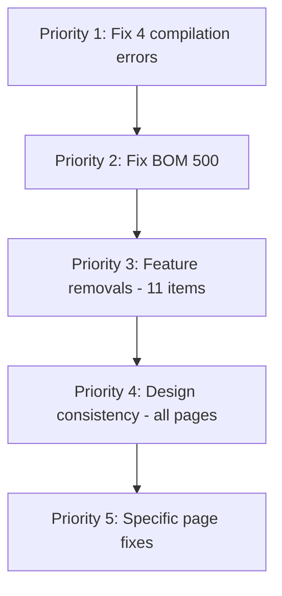

# UI Audit Fix and Feature Cleanup Plan

## Priority 1: Critical Compilation Errors (4 pages broken)

The batch Python script that added archived queries inserted them inside the middle of the existing `useQuery` call object literals, breaking the JSX syntax. These need immediate fixes.

### Root Cause
The archived query `const { data: archivedData... } = useQuery({...})` was inserted before the closing `})` of the main query in these files:

| Item | File | Fix |
|------|------|-----|
| #12 | [`PurchaseOrderListPage.tsx`](frontend/src/pages/procurement/PurchaseOrderListPage.tsx:35) | Move archived query after the main query closing `)` |
| #14 | [`GoodsReceiptListPage.tsx`](frontend/src/pages/procurement/GoodsReceiptListPage.tsx:29) | Same fix |
| #19 | [`DeliveryScheduleListPage.tsx`](frontend/src/pages/production/DeliveryScheduleListPage.tsx:49) | Same fix |
| #20 | [`InspectionListPage.tsx`](frontend/src/pages/qc/InspectionListPage.tsx:55) | Same fix |

### Fix Pattern
In each file, the archived query block needs to be moved from inside the main query to after it. The closing `})` of the main query and the `const { data: archivedData...` need to be reordered.

---

## Priority 2: BOM 500 Error (Item #18)

BOM detail page returns 500. Likely caused by the `archive()` method signature change -- we changed `BomService::archive()` to accept a `User` parameter but the BOM detail page's archive mutation may still call the old signature. Need to check the BOM detail page and the controller.

Also: rename "Archive" button to "Delete" and add a "Deactivate" button.

---

## Priority 3: Feature Removals (User-Approved)

These features should be removed as the user confirmed they are unnecessary:

| Item | Feature to Remove | Scope |
|------|-------------------|-------|
| #1 | Leave Calendar button + backend | Remove Calendar button from `/hr/leave`, remove calendar API endpoint |
| #2 | Pay Period page | Remove Pay Period from payroll sidebar/routes, allow manual date selection in payroll run creation |
| #11 | Cost Center page + nav | Remove Cost Center page, remove nav link, move Department Budget to Financial Management |
| #11 | Asset Register page + nav | Remove Asset Register page and nav link |
| #13 | Blanket POs page + nav | Remove Blanket Purchase Orders feature entirely |
| #16 | Inventory Valuation page | Remove standalone page, keep data in dashboard |
| #16 | Physical Count page | Remove standalone page if unnecessary |
| #16 | Sidebar link to /inventory/adjustments | Remove from sidebar, access only via Stock page |
| #17 | Stock Transfers | Remove if unnecessary, or keep accessible only from Stock Balances page |
| #21 | QC Quarantine page | Remove the page and nav link |
| #22 | Leave approval workflow banner notice | Remove the banner from /team/leave |

---

## Priority 4: Design Consistency Fixes

### Global Standard: Button Layout
Every list page should follow this consistent layout:

```
[PageHeader with title]
[Action buttons row: Export CSV | View Archive | Create New]  <-- all on same row, right-aligned
[Filters row: Search | Status dropdown | other filters]      <-- all dropdowns, aligned with search
[ArchiveViewBanner if in archive view]
[Table]
```

### Global Standard: Archive vs Delete vs Deactivate
- "Delete" button = performs soft-delete, moves record to archive
- "Deactivate" button = changes `is_active` to false, record stays in active list
- Archive toggle = shows/hides soft-deleted records
- No separate "Archive" action button -- use "Delete" which soft-deletes

### Pages Needing Fixes

| Item | Page | Fixes Needed |
|------|------|-------------|
| #3 | `/accounting/accounts` | Remove "Show archived" checkbox, add Delete action column |
| #4 | `/accounting/journal-entries` | Align Export CSV with other buttons; remove template selection from New Entry; consider removing New Entry button entirely since JEs are system-generated |
| #5 | `/accounting/vendors` | Align View Archive + Export CSV at top; rename "Archive" action to "Delete" |
| #6 | `/accounting/ap/invoices` | Align buttons top; convert filters to dropdowns aligned with search; keep or remove Manual Invoice (keep for edge cases) |
| #7 | `/ar/customers` | Align buttons top; rename "Archive" to "Delete"; add "Deactivate" action button |
| #8 | `/ar/invoices` | Align buttons top; keep manual creation for edge cases |
| #9 | `/banking/accounts` | Verify delete is soft-delete; add View Archive button; add Deactivate button |
| #10 | Financial Approval Budget | Fix VP budget verification URL to not be changeable, enforce filtering server-side |
| #15 | `/inventory/items` | Align View Archive at top; remove Active Only checkbox; fix deactivate not hiding item properly; move Deactivate from edit modal to action column; remove View Archive button and Delete button, keep only Deactivate |
| #16 | `/inventory/stock` | Add back button to /adjustments; add back button to /locations; fix "show inactive" checkbox for locations; remove delete action from locations; auto-generate warehouse code |
| #18 | BOM detail | Fix 500 error; rename Archive to Delete; add Deactivate button |

---

## Priority 5: Specific Page Fixes

### Item #10: VP Budget Verification URL Manipulation
The VP Financial Approval page redirects to PR page with `?status=reviewed` filter. The user can manually change the URL filter. Fix: enforce server-side filtering for VP role, or remove the URL parameter dependency.

### Item #15: Inventory Items Deactivate Logic
When deactivating an item, it disappears from the active list but does not appear in the archive view. This is because deactivate sets `is_active=false` (not `deleted_at`), so it should still appear in the active list but as inactive. The filter may be hiding inactive items. Fix the default filter to show all active items regardless of `is_active`.

### Item #16: Warehouse Location Code Auto-Generation
The warehouse location `code` field should be auto-generated (like other codes in the system) rather than manually typed.

---

## Implementation Order



### Execution Steps

- [ ] Fix 4 Vite compilation errors in PurchaseOrderListPage, GoodsReceiptListPage, DeliveryScheduleListPage, InspectionListPage
- [ ] Fix BOM detail 500 error
- [ ] Remove Leave Calendar button + backend
- [ ] Remove Pay Period page, update payroll run creation
- [ ] Remove Cost Center page, Asset Register, move Department Budget nav
- [ ] Remove Blanket POs page + nav
- [ ] Remove Inventory Valuation, Physical Count standalone pages
- [ ] Remove Stock Transfers or make accessible from Stock Balances only
- [ ] Remove QC Quarantine page
- [ ] Remove leave approval workflow banner
- [ ] Remove sidebar link to /inventory/adjustments, add back buttons
- [ ] Fix all button layouts to consistent top-aligned pattern
- [ ] Rename all "Archive" action buttons to "Delete"
- [ ] Add "Deactivate" action buttons where missing (Customers, Banking, BOM, Inventory Items)
- [ ] Convert inconsistent filters to dropdown pattern
- [ ] Remove "Show archived" checkboxes, use consistent View Archive toggle
- [ ] Fix VP budget verification URL filtering
- [ ] Fix inventory items deactivate behavior
- [ ] Fix warehouse location inactive display + auto-generate code
- [ ] Remove Journal Entry template selection
